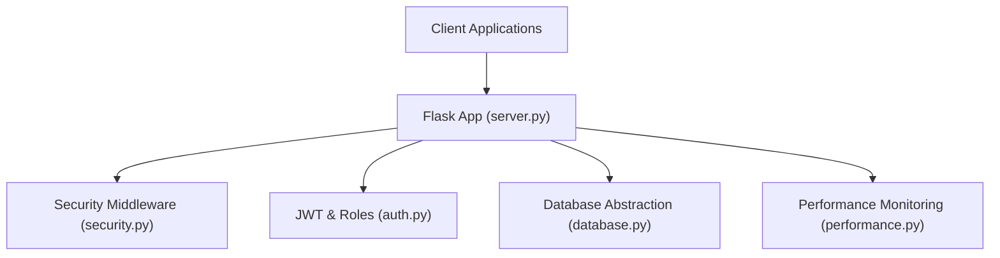
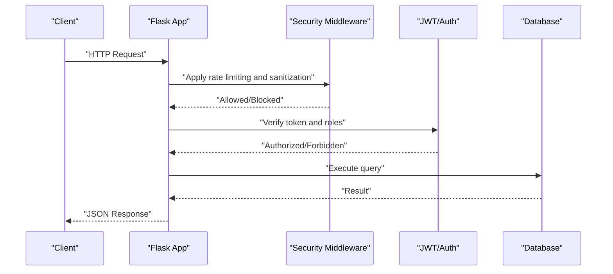
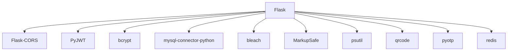

# API Reference

<cite>
**Referenced Files in This Document**
- [server.py](file://server.py)
- [auth.py](file://auth.py)
- [security.py](file://security.py)
- [database.py](file://database.py)
- [requirements.txt](file://requirements.txt)
- [README.md](file://README.md)
- [performance.py](file://performance.py)
</cite>

## Table of Contents
1. [Introduction](#introduction)
2. [Project Structure](#project-structure)
3. [Core Components](#core-components)
4. [Architecture Overview](#architecture-overview)
5. [Detailed Component Analysis](#detailed-component-analysis)
6. [Dependency Analysis](#dependency-analysis)
7. [Performance Considerations](#performance-considerations)
8. [Troubleshooting Guide](#troubleshooting-guide)
9. [Conclusion](#conclusion)
10. [Appendices](#appendices)

## Introduction
This document provides comprehensive API documentation for the EduFlow RESTful API. It covers authentication endpoints, CRUD operations for schools, student and teacher management, academic year management, and subject management. For each endpoint, you will find HTTP methods, URL patterns, request/response schemas, authentication requirements, parameter specifications, practical examples, error handling patterns, status codes, rate limiting, security considerations, and API versioning approach. Integration guidelines for client applications are included to help developers build robust integrations.

## Project Structure
The API is implemented using a Flask application with modular components for security, authentication, database connectivity, and performance monitoring. The server module defines all public endpoints, while supporting modules provide rate limiting, input sanitization, JWT-based authentication, and database abstraction.

**Diagram sources**
- [server.py](file://server.py#L1-L50)
- [security.py](file://security.py#L476-L578)
- [auth.py](file://auth.py#L14-L376)
- [database.py](file://database.py#L88-L118)
- [performance.py](file://performance.py#L215-L234)

**Section sources**
- [README.md](file://README.md#L1-L23)
- [requirements.txt](file://requirements.txt#L1-L14)

## Core Components
- Authentication and Authorization
  - JWT-based authentication with role-based access control.
  - Login endpoints for admin, school, and student roles.
  - Optional authentication decorator for non-mandatory access.
- Security
  - Rate limiting with configurable limits per endpoint category.
  - Input sanitization and HTML-safe processing.
  - Audit logging for security and administrative actions.
- Database Abstraction
  - MySQL/SQLite connection pooling with fallback.
  - Automatic schema creation and migrations.
- Performance Monitoring
  - Built-in performance endpoints for stats, endpoint metrics, and system metrics.

**Section sources**
- [auth.py](file://auth.py#L14-L376)
- [security.py](file://security.py#L20-L578)
- [database.py](file://database.py#L88-L338)
- [performance.py](file://performance.py#L215-L234)

## Architecture Overview
The API follows a layered architecture:
- Presentation Layer: Flask routes define endpoints.
- Security Layer: Rate limiting, input sanitization, and audit logging.
- Authentication Layer: JWT token generation and verification with role checks.
- Service Layer: Database operations and helper functions.
- Persistence Layer: MySQL or SQLite backend.

**Diagram sources**
- [server.py](file://server.py#L141-L200)
- [security.py](file://security.py#L495-L545)
- [auth.py](file://auth.py#L216-L290)
- [database.py](file://database.py#L120-L146)

## Detailed Component Analysis

### Authentication APIs
- Admin Login
  - Method: POST
  - URL: /api/admin/login
  - Request Body: { username, password }
  - Response: { success, token, user }
  - Authentication: None (exempt from rate limiting)
  - Status Codes: 200 OK, 400 Bad Request, 401 Unauthorized, 500 Internal Server Error
  - Example Request:
    - POST /api/admin/login
    - Headers: Content-Type: application/json
    - Body: { "username": "admin", "password": "admin123" }
  - Example Response:
    - 200 OK
    - Body: { "success": true, "token": "<JWT>", "user": { "id": 1, "username": "admin", "role": "admin" } }
  - Notes: Uses bcrypt for password hashing and HS256 JWT with 24-hour expiry.

- School Login
  - Method: POST
  - URL: /api/school/login
  - Request Body: { code }
  - Response: { success, token, school }
  - Authentication: None (exempt from rate limiting)
  - Status Codes: 200 OK, 400 Bad Request, 404 Not Found, 500 Internal Server Error
  - Example Request:
    - POST /api/school/login
    - Body: { "code": "SCH-..." }
  - Example Response:
    - 200 OK
    - Body: { "success": true, "token": "<JWT>", "school": { "id": 1, "code": "SCH-...", "name": "..." } }

- Student Login
  - Method: POST
  - URL: /api/student/login
  - Request Body: { code }
  - Response: { success, token, student }
  - Authentication: None
  - Status Codes: 200 OK, 400 Bad Request, 404 Not Found, 500 Internal Server Error
  - Example Request:
    - POST /api/student/login
    - Body: { "code": "STD-..." }
  - Example Response:
    - 200 OK
    - Body: { "success": true, "token": "<JWT>", "student": { "id": 1, "student_code": "STD-...", "full_name": "...", "school_id": 1 } }

- Teacher Login
  - Method: POST
  - URL: /api/teacher/login
  - Request Body: { teacher_code }
  - Response: { success, token, teacher }
  - Authentication: None
  - Status Codes: 200 OK, 400 Bad Request, 404 Not Found, 500 Internal Server Error
  - Example Request:
    - POST /api/teacher/login
    - Body: { "teacher_code": "TCHR-..." }
  - Example Response:
    - 200 OK
    - Body: { "success": true, "token": "<JWT>", "teacher": { "id": 1, "teacher_code": "TCHR-...", "full_name": "...", "school_id": 1 } }

- Authentication Requirements
  - Most endpoints require a Bearer token in the Authorization header.
  - Admin-only endpoints enforce role-based access control.
  - Optional authentication decorator allows non-mandatory access.

**Section sources**
- [server.py](file://server.py#L141-L304)
- [server.py](file://server.py#L1318-L1372)
- [auth.py](file://auth.py#L216-L290)

### Schools CRUD
- Get All Schools
  - Method: GET
  - URL: /api/schools
  - Response: { success, schools[] }
  - Authentication: None
  - Status Codes: 200 OK, 500 Internal Server Error

- Create School
  - Method: POST
  - URL: /api/schools
  - Request Body: { name, study_type, level, gender_type }
  - Response: { success, message, school }
  - Authentication: Admin required
  - Status Codes: 201 Created, 400 Bad Request, 500 Internal Server Error
  - Example Request:
    - POST /api/schools
    - Headers: Authorization: Bearer <token>, Content-Type: application/json
    - Body: { "name": "Al-Khair School", "study_type": "Arabic", "level": "ابتدائي", "gender_type": "Mixed" }

- Update School
  - Method: PUT
  - URL: /api/schools/{school_id}
  - Path Params: school_id
  - Request Body: { name, study_type, level, gender_type }
  - Response: { success, message, school }
  - Authentication: Admin required
  - Status Codes: 200 OK, 404 Not Found, 500 Internal Server Error

- Delete School
  - Method: DELETE
  - URL: /api/schools/{school_id}
  - Path Params: school_id
  - Response: { success, message, deleted }
  - Authentication: Admin required
  - Status Codes: 200 OK, 404 Not Found, 500 Internal Server Error

**Section sources**
- [server.py](file://server.py#L305-L321)
- [server.py](file://server.py#L329-L374)
- [server.py](file://server.py#L375-L414)
- [server.py](file://server.py#L415-L439)

### Students Management
- Get Students by School
  - Method: GET
  - URL: /api/school/{school_id}/students
  - Path Params: school_id
  - Response: { success, students[] }
  - Authentication: Admin or School required
  - Status Codes: 200 OK, 500 Internal Server Error

- Create Student
  - Method: POST
  - URL: /api/school/{school_id}/student
  - Path Params: school_id
  - Request Body: { full_name, grade, room, enrollment_date?, parent_contact?, blood_type?, chronic_disease? }
  - Response: { success, message, student }
  - Authentication: Admin or School required
  - Status Codes: 201 Created, 400 Bad Request, 500 Internal Server Error
  - Notes: Grade must match supported levels; duplicate check prevents same name+grade+school.

- Update Student
  - Method: PUT
  - URL: /api/student/{student_id}
  - Path Params: student_id
  - Request Body: { full_name, grade, room, detailed_scores?, daily_attendance?, parent_contact?, blood_type?, chronic_disease? }
  - Response: { success, message, student }
  - Authentication: Admin or School required
  - Status Codes: 200 OK, 404 Not Found, 500 Internal Server Error

- Delete Student
  - Method: DELETE
  - URL: /api/student/{student_id}
  - Path Params: student_id
  - Response: { success, message, deleted }
  - Authentication: Admin or School required
  - Status Codes: 200 OK, 404 Not Found, 500 Internal Server Error

- Update Student Detailed Scores/Attendance
  - Method: PUT
  - URL: /api/student/{student_id}/detailed
  - Path Params: student_id
  - Request Body: { detailed_scores?, daily_attendance? }
  - Response: { success, message }
  - Authentication: Admin or School required
  - Status Codes: 200 OK, 400 Bad Request, 404 Not Found, 500 Internal Server Error

**Section sources**
- [server.py](file://server.py#L440-L467)
- [server.py](file://server.py#L468-L559)
- [server.py](file://server.py#L563-L681)
- [server.py](file://server.py#L682-L766)

### Teachers Management
- Get Teachers by School
  - Method: GET
  - URL: /api/school/{school_id}/teachers
  - Path Params: school_id
  - Query Params: grade_level?, search?
  - Response: { success, teachers[] }
  - Authentication: Admin or School required
  - Status Codes: 200 OK, 500 Internal Server Error

- Create Teacher
  - Method: POST
  - URL: /api/school/{school_id}/teacher
  - Path Params: school_id
  - Request Body: { full_name, phone?, email?, subject_ids? | subject_id?, free_text_subjects?, grade_level, specialization? }
  - Response: { success, message, teacher, teacher_code }
  - Authentication: Admin or School required
  - Status Codes: 201 Created, 400 Bad Request, 500 Internal Server Error

- Update Teacher
  - Method: PUT
  - URL: /api/teacher/{teacher_id}
  - Path Params: teacher_id
  - Request Body: { full_name, phone?, email?, subject_ids?, grade_level, specialization? }
  - Response: { success, message, teacher }
  - Authentication: Admin or School required
  - Status Codes: 200 OK, 404 Not Found, 500 Internal Server Error

- Regenerate Teacher Code
  - Method: POST
  - URL: /api/teacher/{teacher_id}/regenerate-code
  - Path Params: teacher_id
  - Response: { success, message, teacher, new_code }
  - Authentication: Admin or School required
  - Status Codes: 200 OK, 404 Not Found, 500 Internal Server Error

- Delete Teacher
  - Method: DELETE
  - URL: /api/teacher/{teacher_id}
  - Path Params: teacher_id
  - Response: { success, message, deleted }
  - Authentication: Admin or School required
  - Status Codes: 200 OK, 404 Not Found, 500 Internal Server Error

- Authorized Subjects for Teacher
  - Method: GET
  - URL: /api/teacher/{teacher_id}/authorized-subjects
  - Path Params: teacher_id
  - Response: { success, subjects[], count, teacher_grade_level }
  - Authentication: Admin or School required
  - Status Codes: 200 OK, 404 Not Found, 500 Internal Server Error

- Teacher’s Assigned Subjects
  - Method: GET
  - URL: /api/teacher/{teacher_id}/subjects
  - Path Params: teacher_id
  - Response: { success, subjects[] }
  - Authentication: Admin, School, or Teacher required
  - Status Codes: 200 OK, 500 Internal Server Error

- Students Taught by Teacher
  - Method: GET
  - URL: /api/teacher/{teacher_id}/students
  - Path Params: teacher_id
  - Query Params: academic_year_id?
  - Response: { success, students[] }
  - Authentication: Admin, School, or Teacher required
  - Status Codes: 200 OK, 500 Internal Server Error

**Section sources**
- [server.py](file://server.py#L1018-L1066)
- [server.py](file://server.py#L1068-L1171)
- [server.py](file://server.py#L1173-L1243)
- [server.py](file://server.py#L1245-L1294)
- [server.py](file://server.py#L1296-L1316)
- [server.py](file://server.py#L1374-L1418)
- [server.py](file://server.py#L1420-L1433)

### Academic Year Management
- Current Academic Year (Calculated)
  - Method: GET
  - URL: /api/academic-year/current
  - Response: { success, academic_year_id?, academic_year_name?, current_academic_year }
  - Authentication: None
  - Status Codes: 200 OK, 500 Internal Server Error

- System-Wide Academic Years
  - Method: GET
  - URL: /api/system/academic-years
  - Response: { success, academic_years[], current_year_name }
  - Authentication: None
  - Status Codes: 200 OK, 500 Internal Server Error

- Create System Academic Year (Admin Only)
  - Method: POST
  - URL: /api/system/academic-year
  - Request Body: { name, start_year, end_year, start_date?, end_date?, is_current? }
  - Response: { success, message, academic_year }
  - Authentication: Admin required
  - Status Codes: 201 Created, 400 Bad Request, 500 Internal Server Error

- Set Current Academic Year (Admin Only)
  - Method: POST
  - URL: /api/system/academic-year/{year_id}/set-current
  - Path Params: year_id
  - Response: { success, message, academic_year }
  - Authentication: Admin required
  - Status Codes: 200 OK, 404 Not Found, 500 Internal Server Error

- Delete Academic Year (Admin Only)
  - Method: DELETE
  - URL: /api/system/academic-year/{year_id}
  - Path Params: year_id
  - Response: { success, message, deleted }
  - Authentication: Admin required
  - Status Codes: 200 OK, 404 Not Found, 500 Internal Server Error

- Generate Upcoming Academic Years (Admin Only)
  - Method: POST
  - URL: /api/system/academic-years/generate
  - Request Body: { count? }
  - Response: { success, message, academic_years[] }
  - Authentication: Admin required
  - Status Codes: 200 OK, 500 Internal Server Error

- Legacy Per-School Academic Year Endpoints (Redirected)
  - GET /api/school/{school_id}/academic-years -> Returns system-wide years
  - GET /api/school/{school_id}/academic-year/current -> Returns current year
  - POST /api/school/{school_id}/academic-year -> Returns error (centralized)
  - POST /api/school/{school_id}/academic-year/generate-upcoming -> Returns error (centralized)

- Student Grades by Academic Year
  - GET /api/student/{student_id}/grades/{academic_year_id}
  - PUT /api/student/{student_id}/grades/{academic_year_id}

**Section sources**
- [server.py](file://server.py#L1859-L1917)
- [server.py](file://server.py#L1923-L1946)
- [server.py](file://server.py#L1948-L2014)
- [server.py](file://server.py#L2016-L2049)
- [server.py](file://server.py#L2051-L2081)
- [server.py](file://server.py#L2083-L2135)
- [server.py](file://server.py#L2142-L2200)
- [server.py](file://server.py#L2262-L2292)
- [server.py](file://server.py#L2294-L2341)

### Subject Management
- Get Subjects by School
  - Method: GET
  - URL: /api/school/{school_id}/subjects
  - Path Params: school_id
  - Response: { success, subjects[] }
  - Authentication: Admin or School required
  - Status Codes: 200 OK, 500 Internal Server Error

- Create Subject
  - Method: POST
  - URL: /api/school/{school_id}/subject
  - Path Params: school_id
  - Request Body: { name, grade_level }
  - Response: { success, message, subject }
  - Authentication: Admin or School required
  - Status Codes: 201 Created, 400 Bad Request, 500 Internal Server Error

- Update Subject
  - Method: PUT
  - URL: /api/subject/{subject_id}
  - Path Params: subject_id
  - Request Body: { name, grade_level }
  - Response: { success, message, subject }
  - Authentication: Admin or School required
  - Status Codes: 200 OK, 404 Not Found, 500 Internal Server Error

- Delete Subject
  - Method: DELETE
  - URL: /api/subject/{subject_id}
  - Path Params: subject_id
  - Response: { success, message, deleted }
  - Authentication: Admin or School required
  - Status Codes: 200 OK, 404 Not Found, 500 Internal Server Error

**Section sources**
- [server.py](file://server.py#L768-L785)
- [server.py](file://server.py#L786-L867)

### Teacher-Class Assignment Management
- Get Teachers with Assignments (School)
  - Method: GET
  - URL: /api/school/{school_id}/teachers-with-assignments
  - Path Params: school_id
  - Query Params: academic_year_id?
  - Response: { success, teachers[] }
  - Authentication: Admin or School required
  - Status Codes: 200 OK, 500 Internal Server Error

- Get Teachers by Class
  - Method: GET
  - URL: /api/class/{class_name}/teachers
  - Path Params: class_name
  - Query Params: academic_year_id?
  - Response: { success, teachers[] }
  - Authentication: Admin or School required
  - Status Codes: 200 OK, 500 Internal Server Error

- Get Teacher’s Class Assignments
  - Method: GET
  - URL: /api/teacher/{teacher_id}/class-assignments
  - Path Params: teacher_id
  - Query Params: academic_year_id?
  - Response: { success, assignments[] }
  - Authentication: Admin, School, or Teacher required
  - Status Codes: 200 OK, 500 Internal Server Error

- Get All School Assignments
  - Method: GET
  - URL: /api/school/{school_id}/teacher-class-assignments
  - Path Params: school_id
  - Query Params: academic_year_id?
  - Response: { success, assignments[] }
  - Authentication: Admin or School required
  - Status Codes: 200 OK, 500 Internal Server Error

- Assign Teacher to Class
  - Method: POST
  - URL: /api/teacher-class-assignment
  - Request Body: { teacher_id, class_name, subject_id, academic_year_id? }
  - Response: { success, message }
  - Authentication: Admin or School required
  - Status Codes: 201 Created, 400 Bad Request, 500 Internal Server Error

- Remove Teacher from Class
  - Method: DELETE
  - URL: /api/teacher-class-assignment/{assignment_id}
  - Path Params: assignment_id
  - Response: { success, message }
  - Authentication: Admin or School required
  - Status Codes: 200 OK, 500 Internal Server Error

**Section sources**
- [server.py](file://server.py#L1439-L1445)
- [server.py](file://server.py#L1447-L1453)
- [server.py](file://server.py#L1455-L1461)
- [server.py](file://server.py#L1463-L1469)
- [server.py](file://server.py#L1471-L1499)
- [server.py](file://server.py#L1501-L1517)

### Teacher-Specific Operations
- Add/Update Grades (Teacher Only)
  - Method: POST
  - URL: /api/teacher/grades
  - Request Body: { student_id, subject_name, academic_year_id, grades }
  - Response: { success, message }
  - Authentication: Teacher required
  - Status Codes: 200 OK, 400 Bad Request, 403 Forbidden, 500 Internal Server Error

- Record Attendance (Teacher Only)
  - Method: POST
  - URL: /api/teacher/attendance
  - Request Body: { student_id, academic_year_id, attendance_date, status?, notes? }
  - Response: { success, message }
  - Authentication: Teacher required
  - Status Codes: 200 OK, 400 Bad Request, 403 Forbidden, 500 Internal Server Error

**Section sources**
- [server.py](file://server.py#L1708-L1777)
- [server.py](file://server.py#L1779-L1835)

### Performance Monitoring Endpoints
- Get Performance Statistics
  - Method: GET
  - URL: /api/performance/stats
  - Response: { ... }
  - Authentication: Admin required
  - Status Codes: 200 OK, 500 Internal Server Error

- Get Endpoint Performance Details
  - Method: GET
  - URL: /api/performance/endpoint/{endpoint}
  - Path Params: endpoint
  - Response: { ... }
  - Authentication: Admin required
  - Status Codes: 200 OK, 500 Internal Server Error

- Get System Metrics
  - Method: GET
  - URL: /api/performance/system
  - Response: { ... }
  - Authentication: Admin required
  - Status Codes: 200 OK, 500 Internal Server Error

**Section sources**
- [performance.py](file://performance.py#L215-L234)

## Dependency Analysis
The API relies on several external libraries for security, authentication, and performance monitoring. The following diagram shows key dependencies and their roles.

**Diagram sources**
- [requirements.txt](file://requirements.txt#L1-L14)

**Section sources**
- [requirements.txt](file://requirements.txt#L1-L14)

## Performance Considerations
- Rate Limiting
  - Authentication endpoints: 5 requests per 5 minutes.
  - API endpoints: 100 requests per minute.
  - Default: 200 requests per 5 minutes.
  - Exempt endpoints: Login routes are exempt from rate limiting.
  - Response headers include X-RateLimit-* for client-side awareness.
- Input Sanitization
  - HTML tags are stripped by default; limited HTML allowed for specific fields.
  - Control characters and null bytes are removed.
- Database Pooling
  - MySQL connection pooling with fallback to SQLite for development.
- Caching
  - Optional caching layer available for performance improvements.
- Performance Monitoring
  - Built-in endpoints to track system and endpoint performance.

**Section sources**
- [security.py](file://security.py#L20-L76)
- [security.py](file://security.py#L547-L562)
- [database.py](file://database.py#L88-L118)
- [performance.py](file://performance.py#L215-L234)

## Troubleshooting Guide
- Authentication Failures
  - Ensure Authorization header contains a valid Bearer token.
  - Tokens expire after 24 hours; use refresh mechanisms if implemented.
- Rate Limiting
  - Monitor X-RateLimit-* headers to understand remaining quota.
  - Exempt endpoints bypass rate limits.
- Database Connectivity
  - Verify MySQL environment variables or fallback to SQLite.
  - Check connection pool initialization and error messages.
- Error Responses
  - All API errors return JSON with an error field and localized Arabic message.
  - Common status codes: 400 Bad Request, 401 Unauthorized, 403 Forbidden, 404 Not Found, 500 Internal Server Error.

**Section sources**
- [server.py](file://server.py#L2213-L2226)
- [security.py](file://security.py#L510-L517)
- [database.py](file://database.py#L88-L118)

## Conclusion
This API reference documents the EduFlow RESTful endpoints comprehensively, including authentication, CRUD operations, academic year management, and subject/teacher management. It emphasizes security, rate limiting, and performance monitoring. Developers can integrate with these endpoints using the provided request/response patterns and authentication requirements.

## Appendices
- API Versioning
  - No explicit versioning scheme is implemented in the current codebase. Clients should pin to specific endpoints and handle breaking changes carefully.
- Security Best Practices
  - Always transmit tokens securely over HTTPS.
  - Validate and sanitize all inputs on the client side before sending requests.
  - Respect rate limit headers and implement exponential backoff on 429 responses.
- Integration Guidelines
  - Use Authorization: Bearer <token> for protected endpoints.
  - For admin-only endpoints, ensure the token’s role is admin.
  - For school/teacher endpoints, ensure the token’s associated entity matches the requested resource.