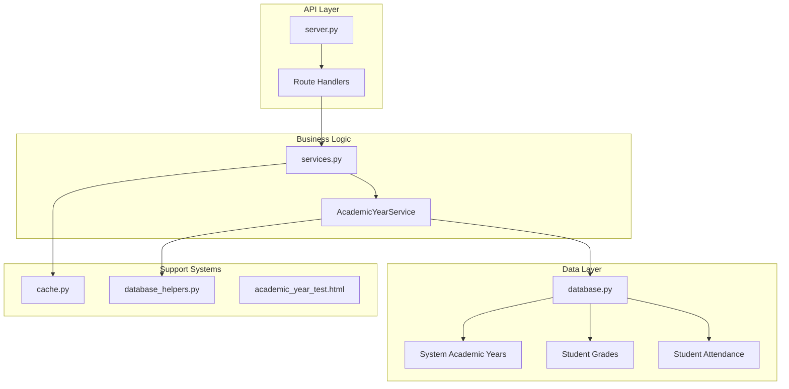
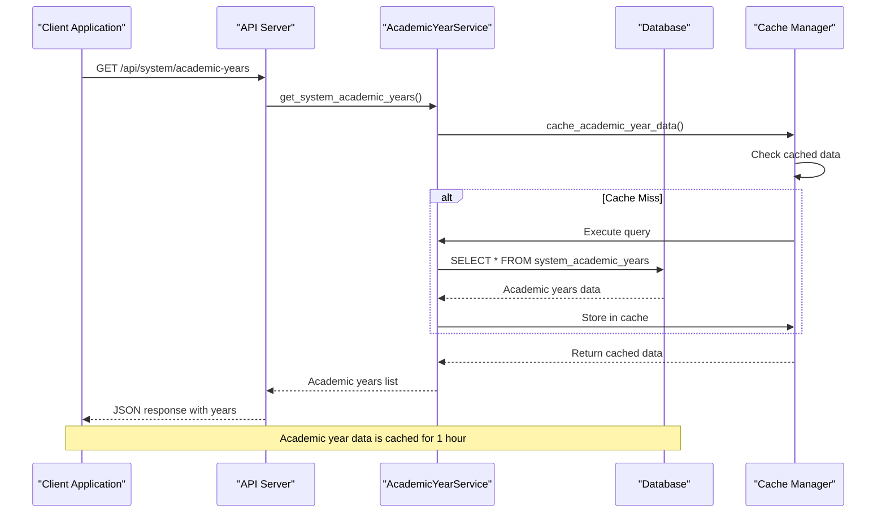
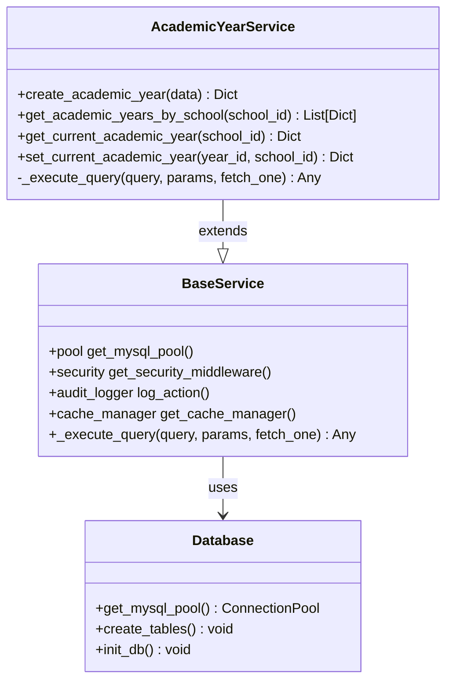
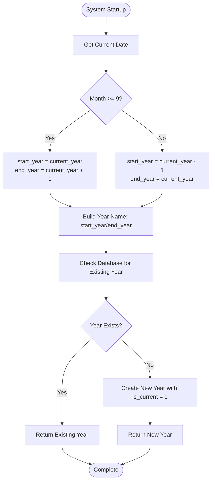
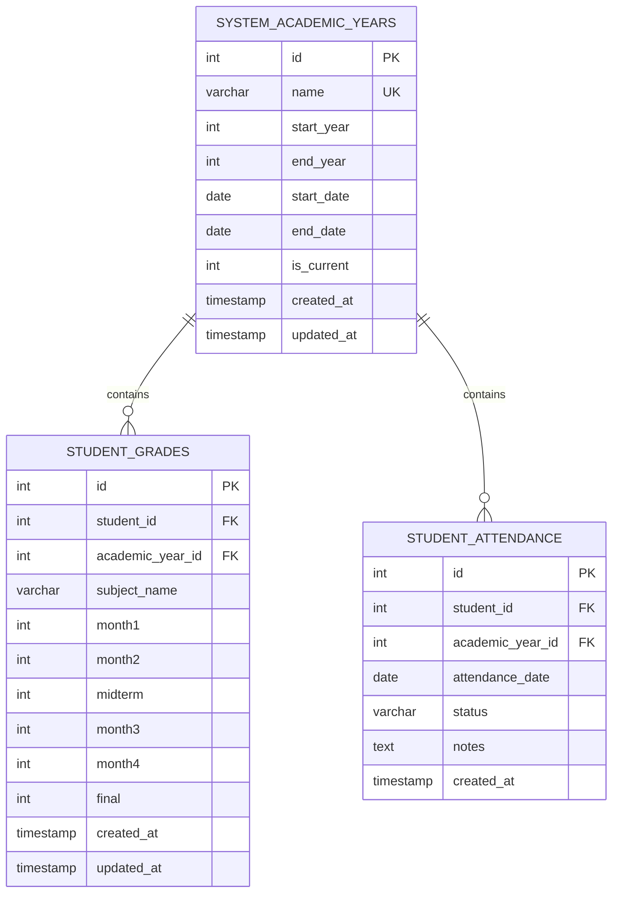
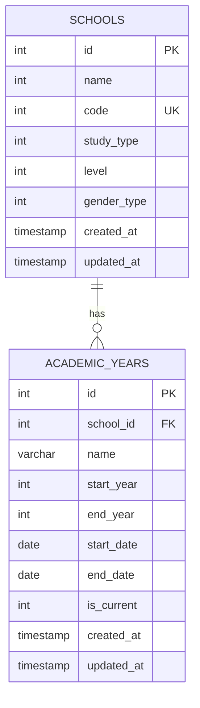
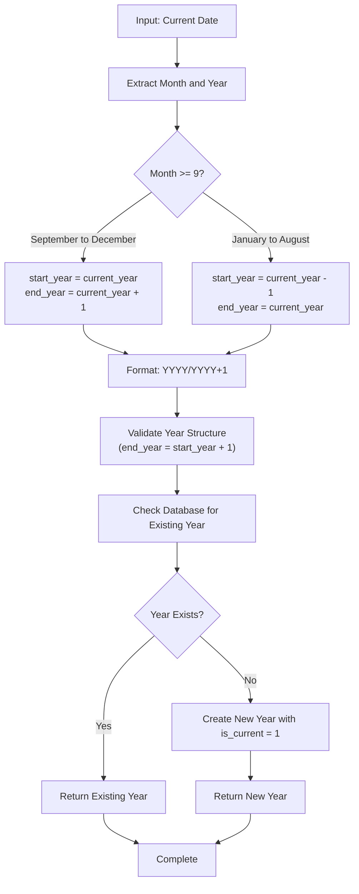
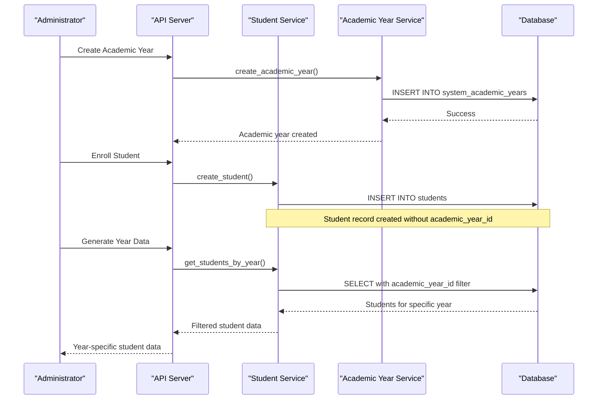
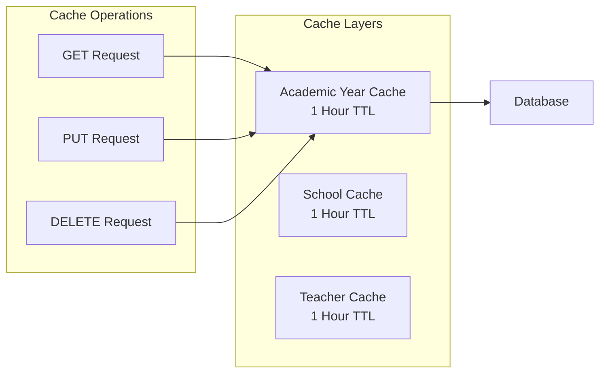
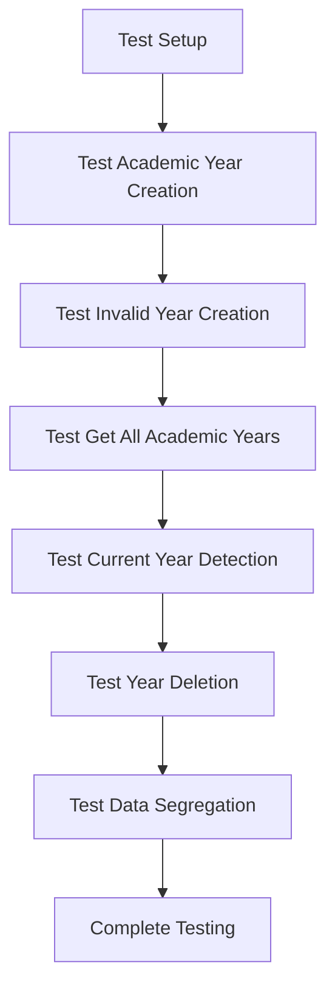

# Academic Year Management API

<cite>
**Referenced Files in This Document**
- [server.py](file://server.py)
- [database.py](file://database.py)
- [database_helpers.py](file://database_helpers.py)
- [services.py](file://services.py)
- [cache.py](file://cache.py)
- [academic_year_test.html](file://academic_year_test.html)
- [delete_academic_years.sql](file://delete_academic_years.sql)
- [README.md](file://README.md)
- [requirements.txt](file://requirements.txt)
</cite>

## Table of Contents
1. [Introduction](#introduction)
2. [Project Structure](#project-structure)
3. [Core Components](#core-components)
4. [Architecture Overview](#architecture-overview)
5. [Detailed Component Analysis](#detailed-component-analysis)
6. [API Endpoints](#api-endpoints)
7. [Database Schema](#database-schema)
8. [Year Progression Logic](#year-progression-logic)
9. [Integration with Student Enrollment](#integration-with-student-enrollment)
10. [Validation Rules](#validation-rules)
11. [Performance Considerations](#performance-considerations)
12. [Troubleshooting Guide](#troubleshooting-guide)
13. [Conclusion](#conclusion)

## Introduction
This document provides comprehensive API documentation for academic year management in the EduFlow school management system. The system implements centralized academic year management with robust validation, automatic year progression logic, and seamless integration with student enrollment and grade tracking systems. The API supports both legacy per-school academic year management and modern centralized system-wide academic year administration.

## Project Structure
The academic year management system is built on a modular Flask architecture with clear separation of concerns:



**Diagram sources**
- [server.py](file://server.py#L1927-L2256)
- [services.py](file://services.py#L118-L230)
- [database.py](file://database.py#L261-L320)

**Section sources**
- [README.md](file://README.md#L1-L23)
- [requirements.txt](file://requirements.txt#L1-L14)

## Core Components
The academic year management system consists of several key components working together:

### Centralized Academic Year Management
The system implements a centralized approach where academic years are managed at the system level rather than per school. This ensures consistency across all school instances and simplifies year progression logic.

### Automatic Year Calculation
The system automatically calculates the current academic year based on the current date, with academic years starting in September and ending in June.

### Data Segregation
Academic year data is properly segregated through foreign key relationships, ensuring that student grades and attendance are correctly associated with their respective academic periods.

**Section sources**
- [server.py](file://server.py#L1867-L1925)
- [database.py](file://database.py#L261-L320)

## Architecture Overview
The academic year management architecture follows a layered pattern with clear separation between API endpoints, business logic, and data persistence:



**Diagram sources**
- [server.py](file://server.py#L1931-L1954)
- [services.py](file://services.py#L118-L188)
- [cache.py](file://cache.py#L252-L254)

## Detailed Component Analysis

### Academic Year Service Layer
The AcademicYearService provides comprehensive business logic for academic year operations:



**Diagram sources**
- [services.py](file://services.py#L118-L230)
- [services.py](file://services.py#L12-L43)

**Section sources**
- [services.py](file://services.py#L118-L230)

### Year Progression Algorithm
The system implements intelligent year progression logic that automatically handles academic year transitions:



**Diagram sources**
- [server.py](file://server.py#L1849-L1865)
- [server.py](file://server.py#L1867-L1925)

**Section sources**
- [server.py](file://server.py#L1849-L1925)

## API Endpoints

### System-Wide Academic Year Management

#### Get Current Academic Year
**Endpoint:** `GET /api/academic-year/current`
**Description:** Retrieves the current academic year, automatically calculated from the system date
**Response:** Academic year information with automatic creation if not exists

#### Get All System Academic Years
**Endpoint:** `GET /api/system/academic-years`
**Description:** Returns all system-wide academic years, marking the current year based on date calculation
**Response:** Array of academic years with current year indicator

#### Create System Academic Year
**Endpoint:** `POST /api/system/academic-year`
**Description:** Creates a new system-wide academic year (admin only)
**Request Body:**
```json
{
  "name": "string",
  "start_year": integer,
  "end_year": integer,
  "start_date": "YYYY-MM-DD",
  "end_date": "YYYY-MM-DD",
  "is_current": boolean
}
```

#### Set Current Academic Year
**Endpoint:** `POST /api/system/academic-year/{year_id}/set-current`
**Description:** Sets a specific academic year as the current year (admin only)

#### Generate Upcoming Academic Years
**Endpoint:** `POST /api/system/academic-years/generate`
**Description:** Generates upcoming academic years (admin only)
**Request Body:** `{ "count": integer }`

#### Delete Academic Year
**Endpoint:** `DELETE /api/system/academic-year/{year_id}`
**Description:** Deletes an academic year with cascade deletion of related data (admin only)

### Legacy Per-School Endpoints (Deprecated)
The system maintains backward compatibility with legacy endpoints that now redirect to the centralized system:

#### Get School Academic Years
**Endpoint:** `GET /api/school/{school_id}/academic-years`
**Description:** Now returns system-wide academic years for all schools

#### Get School Current Academic Year
**Endpoint:** `GET /api/school/{school_id}/academic-year/current`
**Description:** Returns current academic year with automatic creation

**Section sources**
- [server.py](file://server.py#L1927-L2256)

## Database Schema

### System Academic Years Table
The centralized academic year management uses a dedicated table structure:



**Diagram sources**
- [database.py](file://database.py#L261-L320)

### Legacy Academic Years Table
For backward compatibility, the system maintains a legacy table structure:



**Diagram sources**
- [database.py](file://database.py#L275-L289)

**Section sources**
- [database.py](file://database.py#L261-L320)

## Year Progression Logic

### Academic Year Calculation Algorithm
The system implements a sophisticated year progression algorithm that handles the academic calendar correctly:



**Diagram sources**
- [server.py](file://server.py#L1849-L1865)
- [server.py](file://server.py#L1956-L2022)

### Validation Rules Implementation
The system enforces strict validation rules for academic year creation:

| Rule | Validation | Error Message |
|------|------------|---------------|
| Required Fields | name, start_year, end_year | "Name, start_year, and end_year are required" |
| Year Continuity | end_year = start_year + 1 | "End year must be start year + 1" |
| Uniqueness | Unique year name | "Academic year already exists" |
| Current Year | Single current year allowed | Automatic unsetting of other current years |

**Section sources**
- [server.py](file://server.py#L1956-L2022)

## Integration with Student Enrollment

### Data Segregation by Academic Year
The system integrates academic year management with student enrollment through proper foreign key relationships:



**Diagram sources**
- [database.py](file://database.py#L292-L320)
- [services.py](file://services.py#L232-L296)

### Grade Tracking Integration
The system maintains separate grade records for each academic year:

| Table | Purpose | Academic Year Relationship |
|-------|---------|---------------------------|
| `system_academic_years` | Centralized year management | Reference point for all data |
| `student_grades` | Academic performance tracking | Links grades to specific years |
| `student_attendance` | Attendance monitoring | Tracks attendance per year |
| `teacher_class_assignments` | Teaching assignments | Links assignments to years |

**Section sources**
- [database.py](file://database.py#L292-L320)
- [database.py](file://database.py#L247-L259)

## Validation Rules

### Academic Year Validation
The system implements comprehensive validation for academic year operations:

#### Creation Validation
- **Required Fields**: name, start_year, end_year
- **Format Validation**: end_year must equal start_year + 1
- **Uniqueness**: Year names must be unique
- **Date Generation**: Automatic date calculation if not provided

#### Update Validation
- **Consistency**: Maintains year progression logic
- **Current Year Management**: Ensures single current year
- **Cascade Operations**: Handles dependent data appropriately

#### Deletion Validation
- **Cascade Deletion**: Automatically removes related student grades and attendance
- **Integrity Checks**: Verifies referential integrity before deletion

**Section sources**
- [server.py](file://server.py#L1956-L2089)

## Performance Considerations

### Caching Strategy
The system implements intelligent caching for academic year data:



**Diagram sources**
- [cache.py](file://cache.py#L252-L254)

### Performance Optimizations
- **Automatic Year Creation**: Creates current academic year on-demand
- **Date-Based Current Year**: Calculates current year without database queries
- **Batch Operations**: Supports bulk academic year generation
- **Efficient Queries**: Optimized database queries with proper indexing

**Section sources**
- [cache.py](file://cache.py#L252-L254)
- [server.py](file://server.py#L2091-L2143)

## Troubleshooting Guide

### Common Issues and Solutions

#### Academic Year Not Found
**Symptom**: `Academic year not found` error when accessing year-specific data
**Solution**: Ensure the academic year exists in the `system_academic_years` table or use the automatic creation endpoint

#### Year Validation Errors
**Symptom**: `End year must be start year + 1` validation error
**Solution**: Ensure the end year is exactly one year greater than the start year

#### Current Year Conflicts
**Symptom**: Multiple academic years marked as current
**Solution**: Use the `set-current` endpoint to designate a single current year

#### Data Integrity Issues
**Symptom**: Errors when deleting academic years
**Solution**: The system automatically handles cascade deletion of related data

**Section sources**
- [server.py](file://server.py#L2024-L2089)

### Testing Academic Year Functionality
The system includes comprehensive testing capabilities:



**Diagram sources**
- [academic_year_test.html](file://academic_year_test.html#L6-L76)

**Section sources**
- [academic_year_test.html](file://academic_year_test.html#L1-L86)

## Conclusion
The EduFlow academic year management system provides a robust, scalable solution for educational institution administration. Through centralized management, intelligent validation, and seamless integration with student enrollment systems, the API ensures data consistency and operational efficiency. The system's architecture supports future enhancements while maintaining backward compatibility and performance optimization.

Key benefits include:
- **Centralized Control**: Single source of truth for academic year management
- **Automatic Operations**: Intelligent year progression and current year detection
- **Data Integrity**: Comprehensive validation and cascade operations
- **Performance Optimization**: Strategic caching and efficient database design
- **Developer-Friendly**: Clear API design with comprehensive error handling

The system successfully addresses the core requirements for academic year cycle management, providing administrators with reliable tools for educational institution oversight and data management.