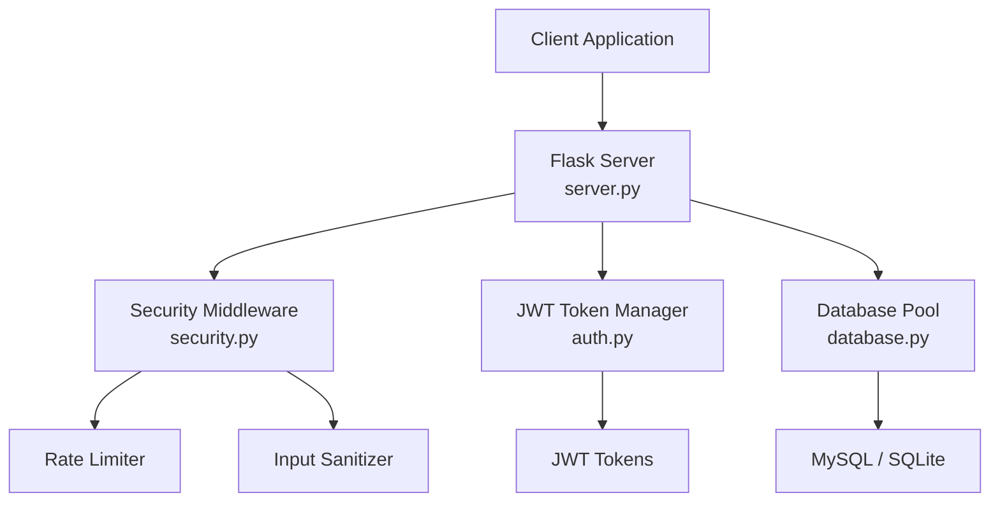
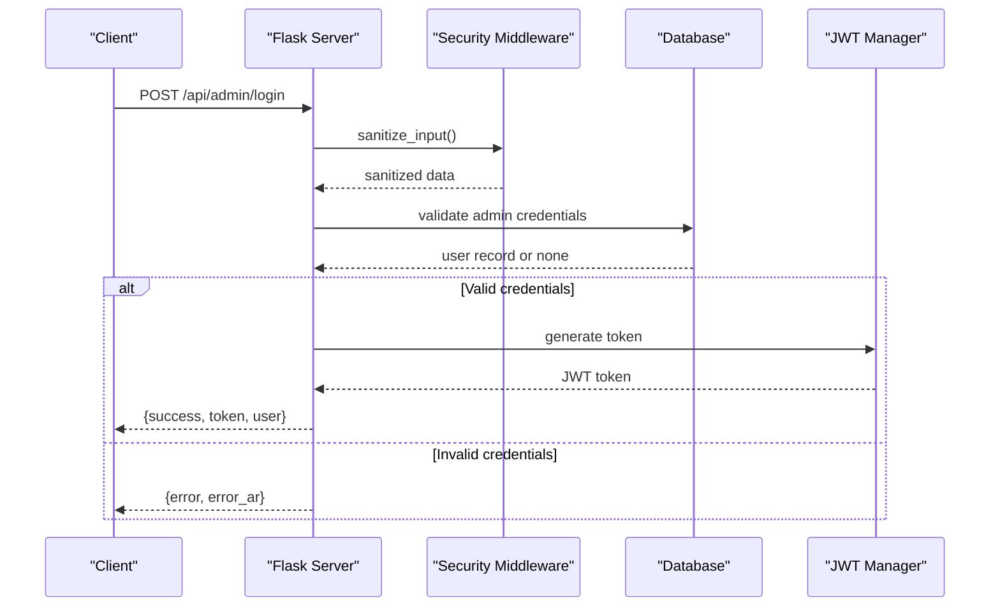
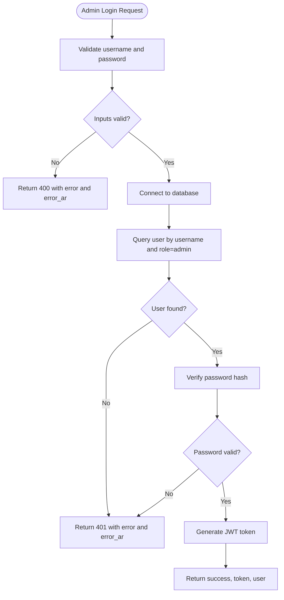
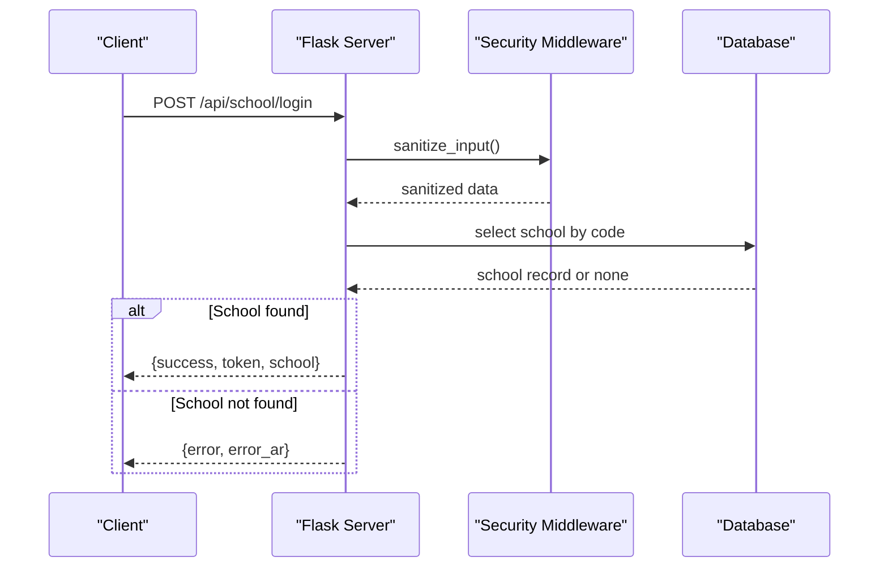
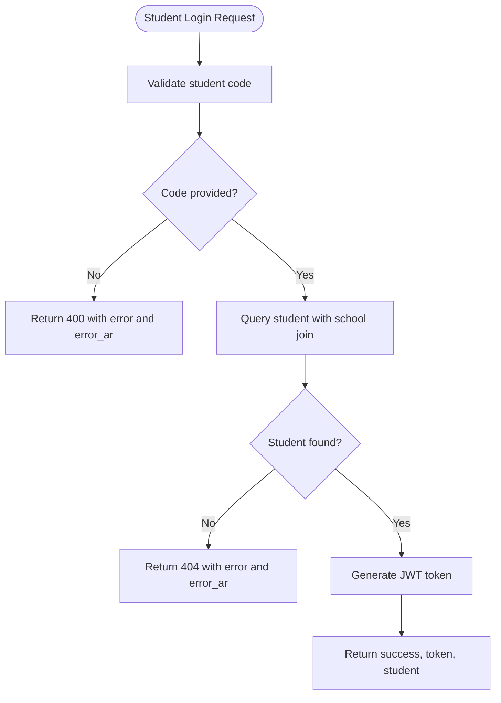
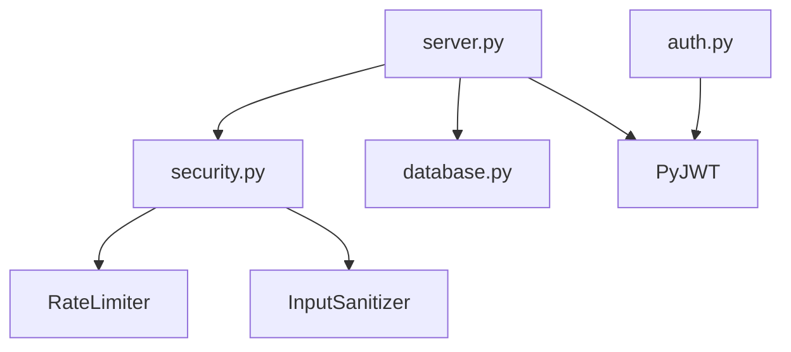

# Authentication Endpoints

<cite>
**Referenced Files in This Document**
- [server.py](file://server.py)
- [auth.py](file://auth.py)
- [security.py](file://security.py)
- [database.py](file://database.py)
- [.env.example](file://.env.example)
- [requirements.txt](file://requirements.txt)
</cite>

## Table of Contents
1. [Introduction](#introduction)
2. [Project Structure](#project-structure)
3. [Core Components](#core-components)
4. [Architecture Overview](#architecture-overview)
5. [Detailed Component Analysis](#detailed-component-analysis)
6. [Dependency Analysis](#dependency-analysis)
7. [Performance Considerations](#performance-considerations)
8. [Troubleshooting Guide](#troubleshooting-guide)
9. [Conclusion](#conclusion)
10. [Appendices](#appendices)

## Introduction
This document provides comprehensive API documentation for the authentication endpoints used by administrators, schools, and students. It covers the three main authentication routes:
- Administrator login: POST /api/admin/login
- School administrator login: POST /api/school/login
- Student portal access: POST /api/student/login

For each endpoint, you will find request parameters, response formats, token generation details, error handling patterns (including Arabic error messages), rate limiting exemptions, and security considerations. Practical examples and integration guidelines are included to help client applications integrate seamlessly.

## Project Structure
The authentication endpoints are implemented in the server module and supported by security middleware, JWT token management, and database utilities. The key files involved are:
- server.py: Defines the three authentication routes and integrates security middleware
- security.py: Provides rate limiting, input sanitization, and audit logging
- auth.py: Implements JWT token generation and verification
- database.py: Manages database connections and schema initialization
- .env.example: Environment variables including JWT_SECRET
- requirements.txt: Required Python packages

**Diagram sources**
- [server.py](file://server.py#L142-L304)
- [security.py](file://security.py#L20-L76)
- [auth.py](file://auth.py#L14-L68)
- [database.py](file://database.py#L88-L118)

**Section sources**
- [server.py](file://server.py#L1-L80)
- [security.py](file://security.py#L1-L60)
- [auth.py](file://auth.py#L1-L30)
- [database.py](file://database.py#L1-L40)
- [.env.example](file://.env.example#L1-L20)
- [requirements.txt](file://requirements.txt#L1-L14)

## Core Components
- Authentication routes: Implemented in server.py with decorators for input sanitization and rate limit exemption
- Security middleware: Provides rate limiting and input sanitization via security.py
- JWT token management: Implemented in auth.py with token generation and verification
- Database connectivity: Managed by database.py with MySQL/SQLite support
- Environment configuration: JWT_SECRET and other settings defined in .env.example

Key implementation references:
- Authentication routes: [server.py](file://server.py#L142-L304)
- Security middleware: [security.py](file://security.py#L476-L562)
- JWT token manager: [auth.py](file://auth.py#L14-L68)
- Database pool: [database.py](file://database.py#L88-L118)
- Environment variables: [.env.example](file://.env.example#L9-L17)

**Section sources**
- [server.py](file://server.py#L142-L304)
- [security.py](file://security.py#L476-L562)
- [auth.py](file://auth.py#L14-L68)
- [database.py](file://database.py#L88-L118)
- [.env.example](file://.env.example#L9-L17)

## Architecture Overview
The authentication flow follows a consistent pattern:
1. Client sends a POST request to the appropriate endpoint with required parameters
2. Request passes through security middleware (input sanitization and rate limiting)
3. Server validates credentials against the database
4. On success, server generates a JWT token and returns it with user/school/student data
5. On failure, server returns an error response with localized Arabic message

**Diagram sources**
- [server.py](file://server.py#L142-L199)
- [security.py](file://security.py#L585-L610)
- [auth.py](file://auth.py#L36-L68)
- [database.py](file://database.py#L138-L145)

## Detailed Component Analysis

### Administrator Authentication: POST /api/admin/login
- Purpose: Authenticate system administrators
- Method: POST
- Request Body Parameters:
  - username: string (required)
  - password: string (required)
- Response Fields:
  - success: boolean (true on success)
  - token: string (JWT access token)
  - user: object containing id, username, role
- Authentication Requirements:
  - No prior authentication required
  - Rate limit exemption applied
- Error Handling:
  - Missing username or password: 400 with error and error_ar
  - Invalid credentials: 401 with error and error_ar
  - Database connection failure: 500 with error and error_ar
- Security Considerations:
  - Passwords are hashed using bcrypt
  - Input sanitized via decorator
  - Rate limit exemption enabled for this endpoint
- Token Structure:
  - HS256 signed JWT with payload including id, username, role, exp
  - Expiration: 24 hours
- Practical Example:
  - Request: POST /api/admin/login with {"username":"admin","password":"admin123"}
  - Response: {"success":true,"token":"<JWT>","user":{"id":1,"username":"admin","role":"admin"}}

**Diagram sources**
- [server.py](file://server.py#L142-L199)
- [database.py](file://database.py#L138-L145)

**Section sources**
- [server.py](file://server.py#L142-L199)
- [database.py](file://database.py#L138-L145)

### School Administrator Authentication: POST /api/school/login
- Purpose: Authenticate school administrators by school code
- Method: POST
- Request Body Parameters:
  - code: string (required)
- Response Fields:
  - success: boolean (true on success)
  - token: string (JWT access token)
  - school: object containing school details
- Authentication Requirements:
  - No prior authentication required
  - Rate limit exemption applied
- Error Handling:
  - Missing code: 400 with error and error_ar
  - School not found: 404 with error and error_ar
  - Database connection failure: 500 with error and error_ar
- Security Considerations:
  - Input sanitized via decorator
  - Rate limit exemption enabled for this endpoint
- Token Structure:
  - HS256 signed JWT with payload including id, code, name, role=school, exp
  - Expiration: 24 hours
- Practical Example:
  - Request: POST /api/school/login with {"code":"<school-code>"}
  - Response: {"success":true,"token":"<JWT>","school":{"id":1,"code":"<code>","name":"<school>","role":"school"}}

**Diagram sources**
- [server.py](file://server.py#L201-L256)
- [security.py](file://security.py#L585-L610)
- [database.py](file://database.py#L147-L157)

**Section sources**
- [server.py](file://server.py#L201-L256)
- [database.py](file://database.py#L147-L157)

### Student Portal Authentication: POST /api/student/login
- Purpose: Authenticate students by student code
- Method: POST
- Request Body Parameters:
  - code: string (required)
- Response Fields:
  - success: boolean (true on success)
  - token: string (JWT access token)
  - student: object containing student details joined with school name
- Authentication Requirements:
  - No prior authentication required
- Error Handling:
  - Missing code: 400 with error and error_ar
  - Student not found: 404 with error and error_ar
  - Database connection failure: 500 with error and error_ar
- Security Considerations:
  - Input sanitized via decorator
  - Rate limit exemption enabled for this endpoint
- Token Structure:
  - HS256 signed JWT with payload including id, code, name, role=student, exp
  - Expiration: 24 hours
- Practical Example:
  - Request: POST /api/student/login with {"code":"<student-code>"}
  - Response: {"success":true,"token":"<JWT>","student":{"id":1,"student_code":"<code>","full_name":"<name>","school_id":1,"school_name":"<school>"}}

**Diagram sources**
- [server.py](file://server.py#L258-L304)
- [database.py](file://database.py#L159-L177)

**Section sources**
- [server.py](file://server.py#L258-L304)
- [database.py](file://database.py#L159-L177)

## Dependency Analysis
The authentication endpoints depend on several core modules:
- server.py depends on security.py for rate limiting and input sanitization
- server.py uses database.py for database connectivity
- server.py uses PyJWT for token generation
- auth.py provides JWT token management utilities
- security.py provides rate limiting and input sanitization

**Diagram sources**
- [server.py](file://server.py#L1-L16)
- [security.py](file://security.py#L1-L20)
- [auth.py](file://auth.py#L1-L12)

**Section sources**
- [server.py](file://server.py#L1-L16)
- [security.py](file://security.py#L1-L20)
- [auth.py](file://auth.py#L1-L12)
- [requirements.txt](file://requirements.txt#L1-L14)

## Performance Considerations
- Rate limiting: Authentication endpoints are exempt from rate limiting via decorators
- Token expiration: JWT tokens expire after 24 hours
- Database queries: Each endpoint performs a single database lookup
- Input sanitization: Automatic sanitization reduces risk of injection attacks

## Troubleshooting Guide
Common issues and resolutions:
- Authentication failures:
  - Verify credentials for administrator login
  - Confirm school code exists for school login
  - Ensure student code is correct for student login
- Database connectivity:
  - Check MySQL connection settings
  - Verify database initialization
- Token validation:
  - Ensure JWT_SECRET is configured
  - Verify token expiration and signature
- Rate limiting:
  - Authentication endpoints are exempt from rate limits

**Section sources**
- [server.py](file://server.py#L142-L304)
- [security.py](file://security.py#L20-L76)
- [auth.py](file://auth.py#L70-L104)
- [.env.example](file://.env.example#L9-L17)

## Conclusion
The authentication system provides secure, standardized login mechanisms for administrators, schools, and students. With JWT token generation, input sanitization, and rate limiting exemptions for authentication endpoints, the system balances security with usability. Client applications should integrate by sending the appropriate credentials to the designated endpoints and handling the returned tokens for subsequent authenticated requests.

## Appendices

### Integration Guidelines
- Set Authorization header to Bearer <token> for protected routes
- Store tokens securely and refresh as needed
- Handle error responses with both English and Arabic messages
- Use HTTPS in production environments

### Environment Configuration
- JWT_SECRET: Must be set to a secure random string in production
- Database connection: Configure MYSQL_HOST, MYSQL_USER, MYSQL_PASSWORD, MYSQL_DATABASE, MYSQL_PORT

**Section sources**
- [.env.example](file://.env.example#L9-L17)
- [requirements.txt](file://requirements.txt#L1-L14)