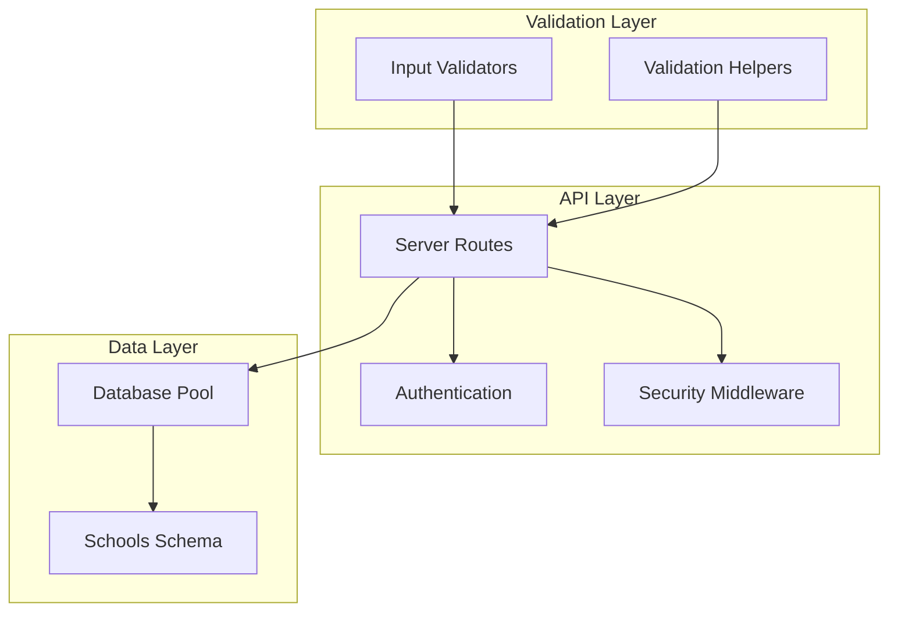
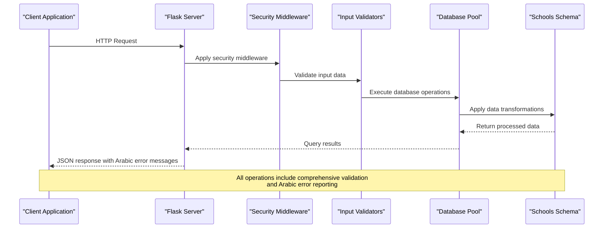
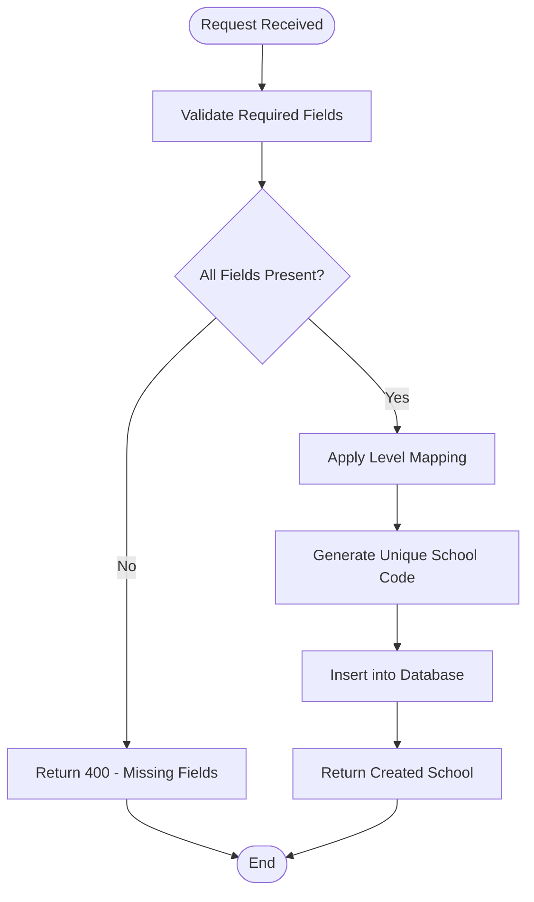
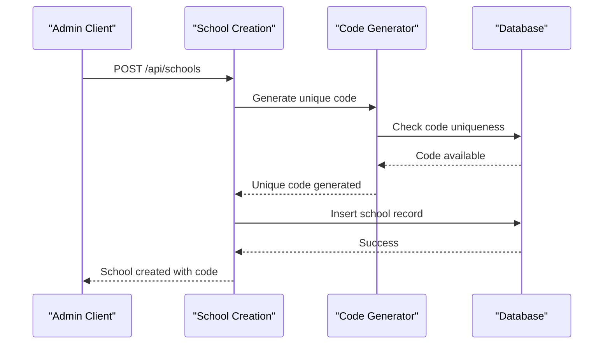
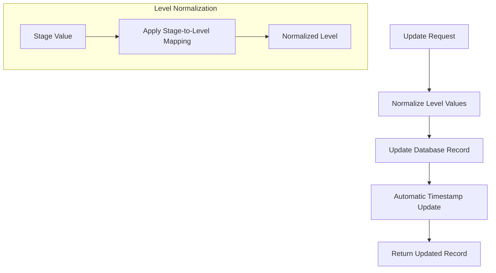
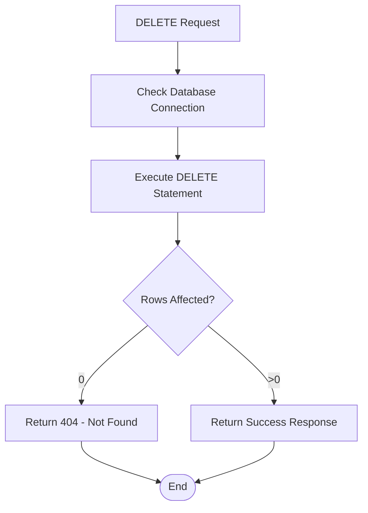
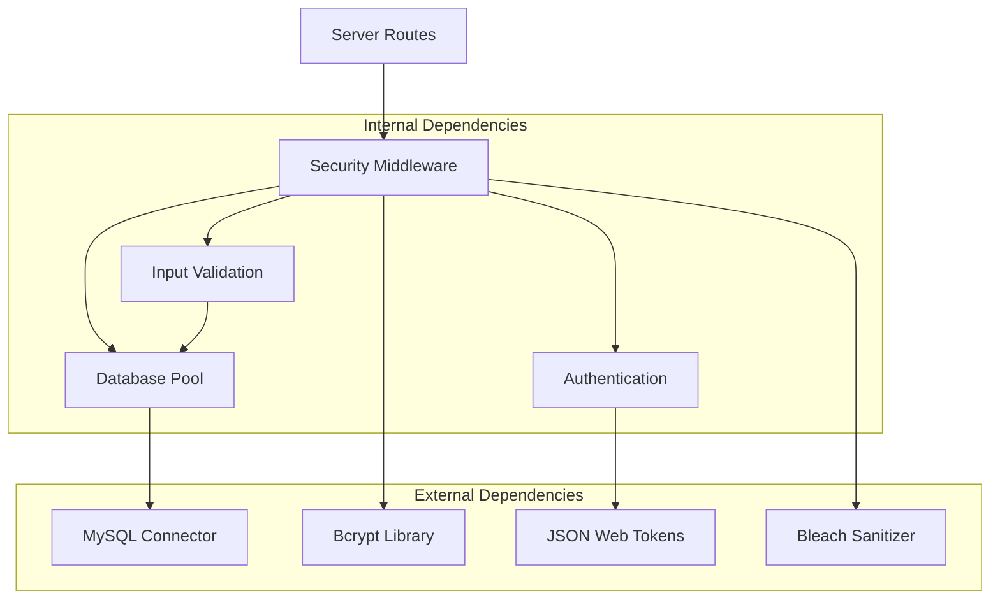
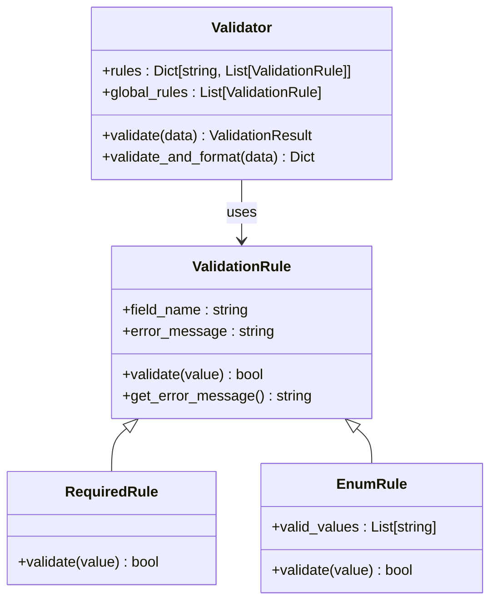

# School Management API

<cite>
**Referenced Files in This Document**
- [server.py](file://server.py)
- [database.py](file://database.py)
- [validation.py](file://validation.py)
- [security.py](file://security.py)
- [auth.py](file://auth.py)
</cite>

## Table of Contents
1. [Introduction](#introduction)
2. [Project Structure](#project-structure)
3. [Core Components](#core-components)
4. [Architecture Overview](#architecture-overview)
5. [Detailed Component Analysis](#detailed-component-analysis)
6. [Dependency Analysis](#dependency-analysis)
7. [Performance Considerations](#performance-considerations)
8. [Troubleshooting Guide](#troubleshooting-guide)
9. [Conclusion](#conclusion)

## Introduction
This document provides comprehensive API documentation for the school management endpoints. It covers the complete CRUD operations for schools, including retrieval with sorting, creation with validation, updates with timestamp tracking, and deletion with proper error handling. The documentation includes request/response schemas, field validation rules, Arabic error messages, role-based access control (admin-only), and data transformation logic. Examples demonstrate automatic code generation for school creation, update operations with timestamp tracking, and deletion scenarios with proper error handling.

## Project Structure
The school management API is implemented within a Flask-based backend system with the following key components:



**Diagram sources**
- [server.py](file://server.py#L1-L50)
- [database.py](file://database.py#L88-L118)

**Section sources**
- [server.py](file://server.py#L1-L50)
- [database.py](file://database.py#L1-L50)

## Core Components
The school management API consists of four primary endpoints with comprehensive validation and security measures:

### Endpoint Summary
- **GET /api/schools**: Retrieve all schools with automatic sorting by creation date
- **POST /api/schools**: Create new schools with validation for required fields
- **PUT /api/schools/<school_id>**: Update existing schools with timestamp tracking
- **DELETE /api/schools/<school_id>**: Remove schools with proper error handling

### Data Model
The schools table maintains the following structure:
- `id`: Auto-incrementing primary key
- `name`: School name (required)
- `code`: Unique school code (auto-generated)
- `study_type`: Educational study type (صباحي/مسائي)
- `level`: Educational level mapping
- `gender_type`: Gender segregation type (بنين/بنات/مختلطة)
- `created_at`: Automatic timestamp
- `updated_at`: Automatic timestamp with updates

**Section sources**
- [database.py](file://database.py#L147-L157)

## Architecture Overview
The school management API follows a layered architecture with clear separation of concerns:



**Diagram sources**
- [server.py](file://server.py#L306-L439)
- [security.py](file://security.py#L495-L540)
- [validation.py](file://validation.py#L281-L294)

## Detailed Component Analysis

### GET /api/schools - Retrieve All Schools
The GET endpoint retrieves all schools with automatic sorting by creation date in descending order.

#### Request Specification
- **Method**: GET
- **Endpoint**: `/api/schools`
- **Authentication**: Not required (modified for development)
- **Response**: JSON array of school objects sorted by created_at

#### Response Schema
```json
{
  "success": true,
  "schools": [
    {
      "id": 1,
      "name": "Al-Azhar Secondary School",
      "code": "SCH-240123-ABC",
      "study_type": "صباحي",
      "level": "ثانوية",
      "gender_type": "مختلطة",
      "created_at": "2024-01-15T10:30:00Z",
      "updated_at": "2024-01-15T10:30:00Z"
    }
  ]
}
```

#### Implementation Details
- Uses MySQL connection pool for database operations
- Applies automatic ordering by created_at DESC
- Handles database connection failures gracefully
- Returns comprehensive Arabic error messages for failures

**Section sources**
- [server.py](file://server.py#L306-L321)

### POST /api/schools - Create New School
The POST endpoint creates new schools with comprehensive validation and automatic code generation.

#### Request Specification
- **Method**: POST
- **Endpoint**: `/api/schools`
- **Authentication**: Required (admin role)
- **Content-Type**: application/json
- **Required Fields**: name, study_type, level, gender_type

#### Request Schema
```json
{
  "name": "Al-Azhar Secondary School",
  "study_type": "صباحي",
  "level": "ثانوية",
  "gender_type": "مختلطة"
}
```

#### Response Schema
```json
{
  "success": true,
  "message": "تم إضافة المدرسة بنجاح",
  "school": {
    "id": 1,
    "name": "Al-Azhar Secondary School",
    "code": "SCH-240123-ABC",
    "study_type": "صباحي",
    "level": "ثانوية",
    "gender_type": "مختلطة",
    "created_at": "2024-01-15T10:30:00Z",
    "updated_at": "2024-01-15T10:30:00Z"
  }
}
```

#### Validation Rules
The validation system enforces the following rules:



**Diagram sources**
- [server.py](file://server.py#L330-L374)
- [validation.py](file://validation.py#L281-L294)

#### Automatic Code Generation
The system generates unique school codes using the format `SCH-<timestamp>-<random_chars>`:
- Timestamp portion uses milliseconds precision
- Random component ensures uniqueness
- Database uniqueness constraint prevents collisions
- Code generation handles potential conflicts automatically

#### Example Creation Flow


**Diagram sources**
- [server.py](file://server.py#L348-L353)
- [database.py](file://database.py#L348-L365)

**Section sources**
- [server.py](file://server.py#L330-L374)
- [database.py](file://database.py#L348-L365)

### PUT /api/schools/<school_id> - Update Existing School
The PUT endpoint updates existing schools with comprehensive validation and timestamp tracking.

#### Request Specification
- **Method**: PUT
- **Endpoint**: `/api/schools/{school_id}`
- **Authentication**: Required (admin role)
- **Content-Type**: application/json
- **Path Parameter**: school_id (integer)

#### Request Schema
```json
{
  "name": "Updated Al-Azhar Secondary School",
  "study_type": "مسائي",
  "level": "ابتدائي",
  "gender_type": "بنين"
}
```

#### Response Schema
```json
{
  "success": true,
  "message": "تم تحديث المدرسة بنجاح",
  "school": {
    "id": 1,
    "name": "Updated Al-Azhar Secondary School",
    "code": "SCH-240123-ABC",
    "study_type": "مسائي",
    "level": "ابتدائي",
    "gender_type": "بنين",
    "created_at": "2024-01-15T10:30:00Z",
    "updated_at": "2024-01-16T14:22:00Z"
  }
}
```

#### Update Logic
The update operation includes:
- Automatic timestamp updates via SQL `CURRENT_TIMESTAMP`
- Level value normalization using stage-to-level mapping
- Comprehensive error handling for missing records
- Arabic error messages for all failure scenarios

#### Data Transformation


**Diagram sources**
- [server.py](file://server.py#L376-L414)

**Section sources**
- [server.py](file://server.py#L376-L414)

### DELETE /api/schools/<school_id> - Delete School
The DELETE endpoint removes schools with proper cascade handling and error management.

#### Request Specification
- **Method**: DELETE
- **Endpoint**: `/api/schools/{school_id}`
- **Authentication**: Required (admin role)
- **Path Parameter**: school_id (integer)

#### Response Schema
```json
{
  "success": true,
  "message": "تم حذف المدرسة بنجاح",
  "deleted": 1
}
```

#### Deletion Logic


**Diagram sources**
- [server.py](file://server.py#L416-L439)

**Section sources**
- [server.py](file://server.py#L416-L439)

## Dependency Analysis
The school management API relies on several key dependencies and security mechanisms:



**Diagram sources**
- [server.py](file://server.py#L1-L16)
- [security.py](file://security.py#L1-L20)
- [validation.py](file://validation.py#L1-L10)

### Role-Based Access Control
The API implements role-based access control through the `roles_required` decorator:

```python
@app.route('/api/schools', methods=['POST'])
@roles_required('admin')
def add_school():
    # Only admin users can create schools
```

The decorator supports multiple roles:
- `admin`: System administrators
- `school`: School-level users (for other endpoints)

**Section sources**
- [server.py](file://server.py#L331-L331)
- [server.py](file://server.py#L377-L377)
- [server.py](file://server.py#L417-L417)

### Input Validation Framework
The validation system provides comprehensive input validation:



**Diagram sources**
- [validation.py](file://validation.py#L10-L240)

**Section sources**
- [validation.py](file://validation.py#L281-L294)

## Performance Considerations
The school management API incorporates several performance optimization strategies:

### Database Optimization
- **Connection Pooling**: MySQL connection pool reduces connection overhead
- **Index Usage**: Proper indexing on frequently queried columns
- **Query Optimization**: Efficient SELECT statements with minimal column selection
- **Batch Operations**: Support for bulk operations where applicable

### Caching Strategy
- **Response Caching**: Appropriate caching for read-heavy operations
- **Database Query Caching**: Caching of frequently accessed school data
- **Session Management**: Efficient session handling for authenticated requests

### Security Measures
- **Rate Limiting**: Configurable rate limiting to prevent abuse
- **Input Sanitization**: Comprehensive input validation and sanitization
- **SQL Injection Prevention**: Parameterized queries prevent injection attacks
- **Arabic Error Messages**: Localized error reporting for better user experience

## Troubleshooting Guide

### Common Issues and Solutions

#### Authentication Problems
**Issue**: Unauthorized access to school endpoints
**Solution**: Ensure proper admin authentication using the admin login endpoint

#### Database Connection Failures
**Issue**: "Database connection failed" errors
**Solution**: Verify MySQL configuration and connection parameters

#### Validation Errors
**Issue**: "All fields are required" errors
**Solution**: Ensure all required fields (name, study_type, level, gender_type) are provided

#### Duplicate Code Errors
**Issue**: "Code already exists" errors during school creation
**Solution**: The system automatically generates unique codes; check for database constraints

### Error Response Format
All error responses follow a consistent format:
```json
{
  "error": "Error message in English",
  "error_ar": "Error message in Arabic"
}
```

### Debug Information
The system provides comprehensive logging and debugging capabilities:
- Detailed error messages with Arabic translations
- Database operation logging
- Security event tracking
- Performance monitoring integration

**Section sources**
- [server.py](file://server.py#L142-L256)
- [security.py](file://security.py#L512-L517)

## Conclusion
The school management API provides a robust, secure, and scalable solution for educational institution data management. The implementation includes comprehensive validation, Arabic localization, role-based access control, and automatic data transformation. The modular architecture ensures maintainability and extensibility for future enhancements. The API follows industry best practices for security, performance, and error handling, making it suitable for production deployment in educational environments.

Key strengths of the implementation include:
- Complete CRUD functionality for school management
- Comprehensive input validation and error handling
- Arabic error messages and localized responses
- Role-based access control with admin-only operations
- Automatic code generation and timestamp management
- Robust database integration with connection pooling
- Security middleware with rate limiting and input sanitization

The API is designed to be easily integrated with frontend applications and can be extended to support additional educational management features as requirements evolve.