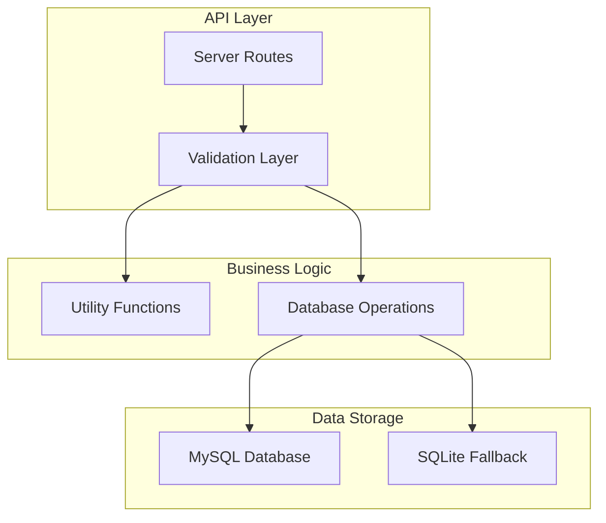
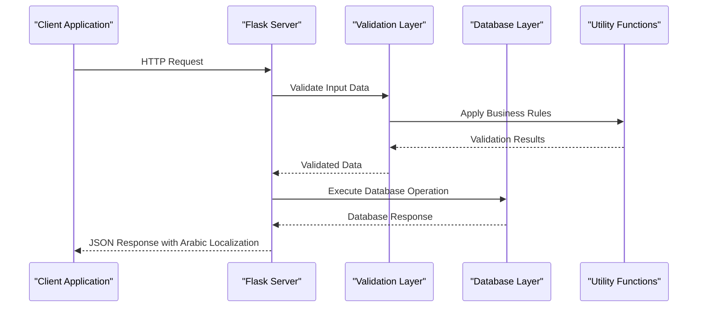
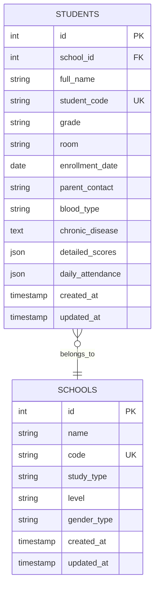
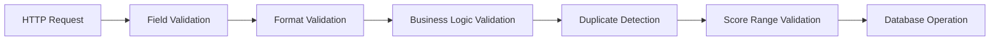
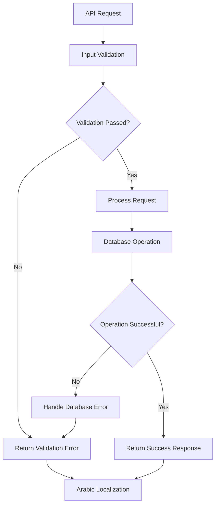

# Student Management API

<cite>
**Referenced Files in This Document**
- [server.py](file://server.py)
- [database.py](file://database.py)
- [utils.py](file://utils.py)
- [validation.py](file://validation.py)
- [validation_helpers.py](file://validation_helpers.py)
</cite>

## Table of Contents
1. [Introduction](#introduction)
2. [Project Structure](#project-structure)
3. [Core Components](#core-components)
4. [Architecture Overview](#architecture-overview)
5. [Detailed Component Analysis](#detailed-component-analysis)
6. [Dependency Analysis](#dependency-analysis)
7. [Performance Considerations](#performance-considerations)
8. [Troubleshooting Guide](#troubleshooting-guide)
9. [Conclusion](#conclusion)

## Introduction
This document provides comprehensive API documentation for the student management endpoints in the EduFlow system. It covers the complete CRUD operations for students, including retrieving all students in a school, adding new students, updating student information, and removing students. The documentation includes detailed validation rules for grade format, blood type validation, duplicate detection, academic data handling, and comprehensive error handling with Arabic localization.

## Project Structure
The student management functionality is implemented in a Flask-based Python application with the following key components:



**Diagram sources**
- [server.py](file://server.py#L1-L80)
- [database.py](file://database.py#L88-L118)

**Section sources**
- [server.py](file://server.py#L1-L80)
- [database.py](file://database.py#L1-L726)

## Core Components
The student management system consists of four primary endpoints with comprehensive validation and error handling:

### Endpoint Categories
1. **Retrieval**: GET `/api/school/{school_id}/students`
2. **Creation**: POST `/api/school/{school_id}/student`
3. **Update**: PUT `/api/student/{student_id}`
4. **Deletion**: DELETE `/api/student/{student_id}`

### Academic Data Fields
The system handles sophisticated academic data through two specialized JSON fields:
- `detailed_scores`: Subject-specific grade breakdowns
- `daily_attendance`: Daily attendance records

**Section sources**
- [server.py](file://server.py#L441-L467)
- [server.py](file://server.py#L469-L559)
- [server.py](file://server.py#L564-L681)

## Architecture Overview
The student management API follows a layered architecture pattern with clear separation of concerns:



**Diagram sources**
- [server.py](file://server.py#L441-L559)
- [utils.py](file://utils.py#L27-L405)

## Detailed Component Analysis

### GET /api/school/{school_id}/students
Retrieves all students in a specified school with comprehensive academic data.

#### Request Parameters
- `school_id` (path): Unique identifier of the school
- Authorization: Requires admin or school role

#### Response Format
```json
{
  "success": true,
  "students": [
    {
      "id": 1,
      "full_name": "Ahmed Hassan",
      "student_code": "STD-1700000000-ABCD",
      "grade": "ابتدائي - الأول الابتدائي",
      "room": "101",
      "detailed_scores": {},
      "daily_attendance": {},
      "created_at": "2024-01-01T00:00:00Z",
      "updated_at": "2024-01-01T00:00:00Z"
    }
  ]
}
```

#### Academic Data Handling
The system automatically processes JSON fields:
- Converts string-encoded JSON to objects
- Handles missing or null values gracefully
- Ensures consistent data structure across responses

**Section sources**
- [server.py](file://server.py#L441-L467)

### POST /api/school/{school_id}/student
Creates a new student with comprehensive validation and duplicate detection.

#### Request Body Validation
Required fields:
- `full_name`: Student's full name (2-255 characters)
- `grade`: Educational level with format validation
- `room`: Classroom identifier

Optional fields:
- `enrollment_date`: Student enrollment date
- `parent_contact`: Phone numbers (up to two)
- `blood_type`: Validated blood type
- `chronic_disease`: Medical conditions

#### Grade Format Validation
Grade strings must follow the format: `{educational_level} - {grade_description}` where educational level is one of:
- `ابتدائي` (Primary)
- `متوسطة` (Middle School)  
- `ثانوية` (Secondary)
- `إعدادية` (Preparatory)

#### Duplicate Detection
The system prevents duplicate student registration by checking:
- Exact match of full_name
- Same grade level
- Same school_id

#### Blood Type Validation
Supported blood types: O+, O-, A+, A-, B+, B-, AB+, AB-

#### Response
```json
{
  "success": true,
  "message": "تم إضافة الطالب بنجاح",
  "message_ar": "Student added successfully",
  "student": {
    "id": 1,
    "student_code": "STD-1700000000-ABCD",
    "full_name": "Ahmed Hassan",
    "grade": "ابتدائي - الأول الابتدائي",
    "room": "101"
  }
}
```

**Section sources**
- [server.py](file://server.py#L469-L559)

### PUT /api/student/{student_id}
Updates existing student information with comprehensive validation.

#### Request Body Fields
All fields are optional for partial updates:
- `full_name`: Updated student name
- `grade`: Updated educational level
- `room`: Updated classroom
- `detailed_scores`: Academic performance data
- `daily_attendance`: Attendance records
- `parent_contact`: Updated contact information
- `blood_type`: Updated blood type
- `chronic_disease`: Updated medical information

#### Academic Data Validation
The system validates academic data based on grade level:
- **Elementary Grades 1-4**: Scores must be between 0-10
- **Other Grades**: Scores must be between 0-100

#### Detailed Scores Structure
```json
"detailed_scores": {
  "Mathematics": {
    "month1": 85,
    "month2": 92,
    "midterm": 88,
    "month3": 90,
    "month4": 87,
    "final": 89
  },
  "Arabic": {
    "month1": 95,
    "month2": 98,
    "midterm": 96,
    "month3": 97,
    "month4": 94,
    "final": 96
  }
}
```

#### Daily Attendance Structure
```json
"daily_attendance": {
  "2024-01-01": {
    "status": "present",
    "notes": ""
  },
  "2024-01-02": {
    "status": "absent",
    "notes": "Fever"
  }
}
```

**Section sources**
- [server.py](file://server.py#L564-L681)

### DELETE /api/student/{student_id}
Removes a student from the system.

#### Response
```json
{
  "success": true,
  "message": "تم حذف الطالب بنجاح",
  "message_ar": "Student deleted successfully",
  "deleted": 1
}
```

**Section sources**
- [server.py](file://server.py#L658-L681)

## Dependency Analysis

### Data Model Dependencies


**Diagram sources**
- [database.py](file://database.py#L159-L177)

### Validation Dependencies
The system implements multiple validation layers:



**Diagram sources**
- [validation.py](file://validation.py#L265-L279)
- [utils.py](file://utils.py#L106-L186)

**Section sources**
- [database.py](file://database.py#L159-L177)
- [validation.py](file://validation.py#L265-L279)
- [utils.py](file://utils.py#L106-L186)

## Performance Considerations
The API implements several performance optimizations:

### Database Connection Management
- Connection pooling for MySQL databases
- Automatic fallback to SQLite for development
- Proper connection cleanup and error handling

### Response Optimization
- JSON field parsing with graceful error handling
- Efficient query construction with parameter binding
- Minimal data transfer through field selection capabilities

### Caching Strategy
- Built-in caching layer for frequently accessed data
- Configurable cache expiration policies
- Cache invalidation on data modifications

## Troubleshooting Guide

### Common Error Scenarios

#### Validation Errors
```json
{
  "error": "Full name, grade, and room are required",
  "error_ar": "الاسم الكامل والصف والغرفة مطلوبة"
}
```

#### Duplicate Student Registration
```json
{
  "error": "A student with the same name already exists in this grade",
  "error_ar": "طالب بنفس الاسم موجود بالفعل في هذا الصف"
}
```

#### Invalid Score Ranges
```json
{
  "error": "For grades 1-4, scores must be between 0 and 10",
  "error_ar": "للصفوف 1-4، يجب أن تكون الدرجات بين 0 و 10"
}
```

#### Database Connection Issues
```json
{
  "error": "Database connection failed",
  "error_ar": "فشل الاتصال بقاعدة البيانات"
}
```

### Error Handling Architecture
The system provides comprehensive error handling with Arabic localization:



**Diagram sources**
- [server.py](file://server.py#L2221-L2234)

**Section sources**
- [server.py](file://server.py#L2221-L2234)
- [utils.py](file://utils.py#L273-L311)

## Conclusion
The EduFlow student management API provides a comprehensive, secure, and scalable solution for educational institution data management. The system offers:

- **Complete CRUD Operations**: Full lifecycle management of student records
- **Advanced Validation**: Multi-layered validation ensuring data integrity
- **Academic Data Management**: Sophisticated handling of grades and attendance
- **Arabic Localization**: Complete internationalization support
- **Performance Optimization**: Efficient database operations and caching
- **Error Handling**: Comprehensive error management with meaningful feedback

The API's modular design allows for easy maintenance and extension while maintaining data consistency and security across all operations.