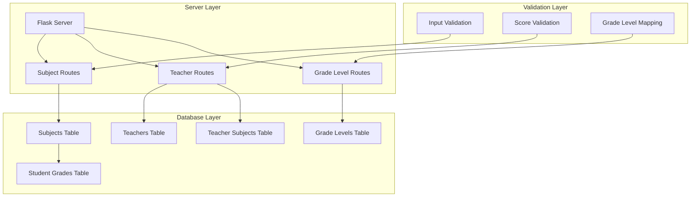
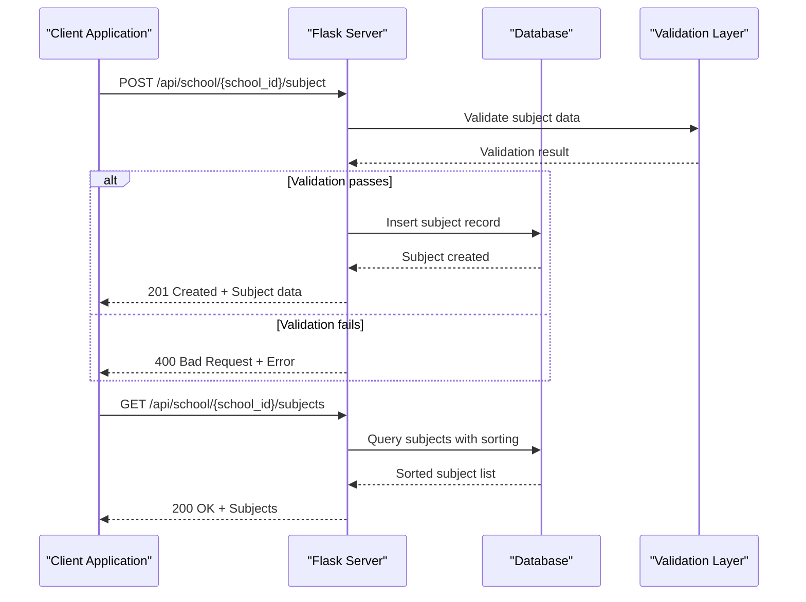
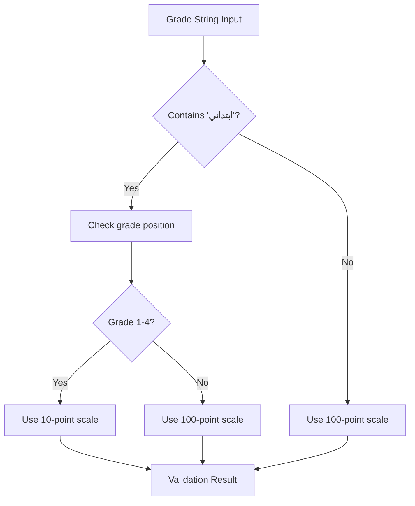
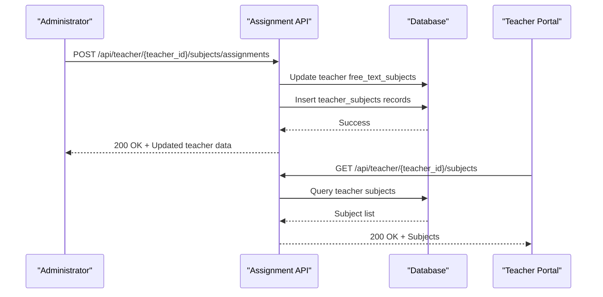
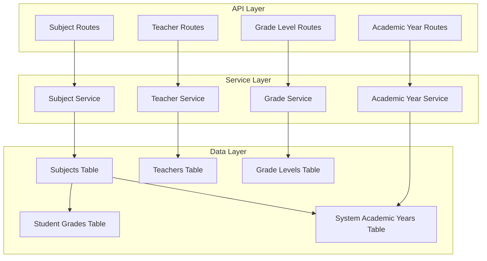

# Subject Management API

<cite>
**Referenced Files in This Document**
- [server.py](file://server.py)
- [database.py](file://database.py)
- [validation.py](file://validation.py)
- [utils.py](file://utils.py)
- [populate_subjects.py](file://populate_subjects.py)
- [README.md](file://README.md)
</cite>

## Table of Contents
1. [Introduction](#introduction)
2. [Project Structure](#project-structure)
3. [Core Components](#core-components)
4. [Architecture Overview](#architecture-overview)
5. [Detailed Component Analysis](#detailed-component-analysis)
6. [Dependency Analysis](#dependency-analysis)
7. [Performance Considerations](#performance-considerations)
8. [Troubleshooting Guide](#troubleshooting-guide)
9. [Conclusion](#conclusion)

## Introduction
This document provides comprehensive API documentation for subject management endpoints in the EduFlow school management system. It covers CRUD operations for subjects, grade-level classification, teacher assignment workflows, and integration with student grade tracking systems. The documentation includes endpoint specifications, request/response formats, validation rules, filtering mechanisms, grade-level mapping, and academic year progression logic.

## Project Structure
The subject management functionality is implemented within the Flask server application with supporting database schema and validation utilities. Key components include:
- Flask routes for subject CRUD operations
- Database schema with subjects, teachers, and grade-level tables
- Validation framework for input sanitization and rules
- Utility functions for grade-level mapping and scoring validation



**Diagram sources**
- [server.py](file://server.py#L768-L867)
- [database.py](file://database.py#L197-L245)

**Section sources**
- [README.md](file://README.md#L1-L23)
- [server.py](file://server.py#L1-L50)

## Core Components

### Subject Management Endpoints
The system provides comprehensive subject management through the following endpoints:

**GET /api/school/{school_id}/subjects**
- Retrieves all subjects for a specific school
- Results are sorted by grade_level and name
- Returns subject metadata including ID, name, grade level, and timestamps

**POST /api/school/{school_id}/subject**
- Creates a new subject for a school
- Requires name and grade_level fields
- Validates input through built-in checks
- Returns newly created subject with auto-generated ID

**PUT /api/subject/{subject_id}**
- Updates an existing subject's name and grade level
- Maintains referential integrity with dependent records

**DELETE /api/subject/{subject_id}**
- Removes a subject and cascades related teacher assignments

### Grade Level Classification
The system supports hierarchical grade-level classification with automatic mapping:
- Elementary (ابتدائي) grades 1-4 use 10-point scale
- Higher grades use 100-point scale
- Automatic detection based on grade string patterns
- Custom grade levels per school with display ordering

### Teacher-Subject Assignment
Comprehensive teacher-subject assignment system:
- Many-to-many relationship between teachers and subjects
- Support for both predefined subjects and free-text subjects
- Authorization enforcement based on teacher permissions
- Class assignment tracking across academic years

### Academic Year Integration
Seamless integration with academic year tracking:
- Centralized system_academic_years table
- Automatic current year detection
- Historical grade preservation during student promotion
- Academic year-aware grade management

**Section sources**
- [server.py](file://server.py#L768-L867)
- [database.py](file://database.py#L197-L320)

## Architecture Overview



**Diagram sources**
- [server.py](file://server.py#L787-L816)
- [validation.py](file://validation.py#L296-L304)

**Section sources**
- [server.py](file://server.py#L768-L867)
- [validation.py](file://validation.py#L296-L304)

## Detailed Component Analysis

### Subject CRUD Operations

#### GET /api/school/{school_id}/subjects
Retrieves all subjects for a specific school with grade-level sorting:

**Request:**
- Path parameters: school_id (integer)
- Authentication: admin or school role required
- Authorization: school_id must match authenticated school

**Response:**
- Success: 200 OK with subjects array
- Error: 404 Not Found if school doesn't exist
- Error: 500 Internal Server Error on database failure

**Sorting Logic:**
Results are ordered by grade_level ascending, then by name ascending for consistent presentation.

#### POST /api/school/{school_id}/subject
Creates a new subject with validation:

**Request Body:**
```json
{
  "name": "Mathematics",
  "grade_level": "Primary 1"
}
```

**Validation Rules:**
- name: Required, 1-255 characters
- grade_level: Optional but recommended for organization

**Success Response:**
- Status: 201 Created
- Returns: Complete subject object with generated ID

**Error Handling:**
- 400 Bad Request for validation failures
- 500 Internal Server Error for database issues

#### PUT /api/subject/{subject_id}
Updates existing subject information:

**Request Body:**
```json
{
  "name": "Advanced Mathematics",
  "grade_level": "Primary 2"
}
```

**Authorization:**
- Admin or school role required
- Subject must belong to authenticated school

#### DELETE /api/subject/{subject_id}
Removes a subject and handles cascading deletions:

**Behavior:**
- Deletes subject record
- Removes related teacher assignments
- Returns deletion count

**Section sources**
- [server.py](file://server.py#L787-L867)

### Grade Level Classification System



**Diagram sources**
- [utils.py](file://utils.py#L123-L160)

The grade classification system automatically determines scoring scales based on grade characteristics:
- Elementary grades (1-4) use 0-10 scale
- Higher grades use 0-100 scale
- Prevents mixed scale violations in grade submissions

**Section sources**
- [utils.py](file://utils.py#L123-L186)

### Teacher-Subject Assignment Workflows



**Diagram sources**
- [server.py](file://server.py#L1551-L1655)

**Section sources**
- [server.py](file://server.py#L1551-L1655)

### Academic Year Progression Logic

The system maintains academic year awareness through centralized management:

**Current Year Detection:**
- September-June academic year cycle
- Automatic calculation based on current date
- Centralized storage in system_academic_years table

**Student Promotion:**
- Preserves historical grade data
- Creates new grade records for promoted students
- Handles cross-year grade continuity

**Section sources**
- [server.py](file://server.py#L1847-L2090)

## Dependency Analysis



**Diagram sources**
- [server.py](file://server.py#L768-L1999)
- [database.py](file://database.py#L197-L320)

**Section sources**
- [server.py](file://server.py#L768-L1999)
- [database.py](file://database.py#L197-L320)

## Performance Considerations

### Database Optimization
- Indexes on frequently queried columns (school_id, grade_level, subject_id)
- Efficient JOIN operations for teacher-subject relationships
- Proper sorting with composite indexes for grade-level ordering

### Caching Strategy
- Subject lists cached per school
- Grade level hierarchies cached for quick access
- Teacher assignment data cached for real-time queries

### Scalability Guidelines
- Pagination support for large subject lists
- Efficient bulk operations for grade updates
- Connection pooling for database operations

## Troubleshooting Guide

### Common Issues and Solutions

**Subject Creation Failures:**
- Verify required fields (name, school_id)
- Check for duplicate subject names within school
- Ensure grade_level format matches existing levels

**Grade Validation Errors:**
- Confirm score falls within appropriate range (0-10 vs 0-100)
- Verify grade string format matches established patterns
- Check for special characters in subject names

**Authorization Problems:**
- Ensure proper role (admin/school/teacher)
- Verify school_id matches authenticated institution
- Check teacher permissions for subject access

**Database Connection Issues:**
- Verify MySQL/MariaDB availability
- Check connection pool configuration
- Monitor for connection timeouts

**Section sources**
- [server.py](file://server.py#L787-L867)
- [utils.py](file://utils.py#L163-L186)

## Conclusion

The subject management API provides a comprehensive foundation for educational institution management with robust validation, flexible grade-level classification, and seamless integration with teacher assignment and academic year tracking systems. The modular architecture supports scalability and maintainability while ensuring data integrity through comprehensive validation and authorization controls.

Key strengths include:
- Flexible grade-level classification with automatic scale detection
- Comprehensive teacher-subject assignment capabilities
- Academic year-aware grade management with historical preservation
- Robust validation and error handling
- Extensible architecture for future enhancements

The API design follows RESTful principles with clear endpoint semantics, consistent response formats, and comprehensive error reporting to support reliable integration with client applications.