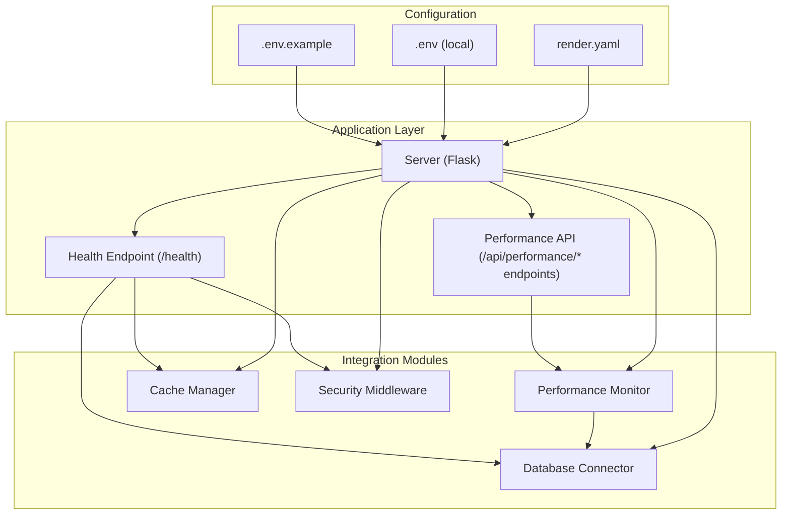
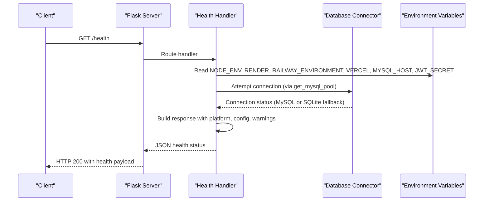
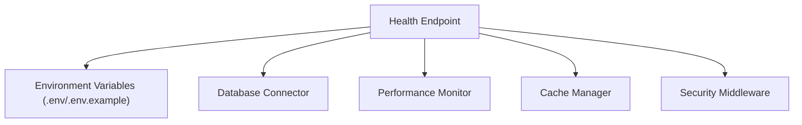

# System Health & Monitoring API

<cite>
**Referenced Files in This Document**
- [server.py](file://server.py)
- [database.py](file://database.py)
- [performance.py](file://performance.py)
- [cache.py](file://cache.py)
- [security.py](file://security.py)
- [utils.py](file://utils.py)
- [render.yaml](file://render.yaml)
- [.env.example](file://.env.example)
- [.env](file://.env)
</cite>

## Table of Contents
1. [Introduction](#introduction)
2. [Project Structure](#project-structure)
3. [Core Components](#core-components)
4. [Architecture Overview](#architecture-overview)
5. [Detailed Component Analysis](#detailed-component-analysis)
6. [Dependency Analysis](#dependency-analysis)
7. [Performance Considerations](#performance-considerations)
8. [Troubleshooting Guide](#troubleshooting-guide)
9. [Conclusion](#conclusion)

## Introduction
This document provides comprehensive API documentation for the system health and monitoring endpoints. It focuses on the `/health` endpoint that delivers a complete system status report, including database connectivity checks, environment and platform detection, configuration validation, and production misconfiguration warnings. It also documents the health monitoring integration with performance tracking, error reporting, and system diagnostics. The guide includes response schemas, deployment-specific examples, and troubleshooting steps to help operators maintain reliable service health.

## Project Structure
The health monitoring system is implemented within the main server application and integrates with supporting modules for database connectivity, performance tracking, caching, and security. The key files involved are:

- Server application with health endpoint and middleware initialization
- Database module for connection detection and fallback mechanisms
- Performance monitoring for system metrics and endpoint profiling
- Cache layer for caching-related diagnostics
- Security middleware for audit logging and rate limiting
- Environment configuration files for platform-specific settings

**Diagram sources**
- [server.py](file://server.py#L110-L139)
- [database.py](file://database.py#L88-L118)
- [performance.py](file://performance.py#L215-L234)
- [render.yaml](file://render.yaml#L10)

**Section sources**
- [server.py](file://server.py#L110-L139)
- [database.py](file://database.py#L88-L118)
- [performance.py](file://performance.py#L215-L234)
- [render.yaml](file://render.yaml#L10)

## Core Components
This section documents the health endpoint and related monitoring capabilities.

- Health endpoint (`/health`)
  - Purpose: Provides comprehensive system status including database connectivity, environment detection, configuration validation, and platform-specific warnings.
  - Method: GET
  - Response: JSON object with status indicators, timestamp, platform detection, configuration verification, and warning messages for production misconfigurations.

- Platform detection
  - Detects hosting environments via environment variables:
    - Render.com: `RENDER=true`
    - Railway.app: `RAILWAY_ENVIRONMENT=true`
    - Vercel.com: `VERCEL=true`
  - Reports detected platform and environment mode (development vs production).

- Configuration validation
  - Validates presence of critical configuration variables:
    - MySQL host availability
    - JWT secret presence
    - Production mode flag

- Warning messages
  - Alerts for production misconfigurations such as non-production environment on hosted platforms and missing MySQL host in production.

- Performance monitoring integration
  - The server initializes performance monitoring middleware that tracks request durations, endpoint statistics, and system metrics.
  - Performance endpoints provide detailed insights for diagnostics.

- Security and audit logging
  - Security middleware handles rate limiting and input sanitization.
  - Audit logging captures security events and user actions for compliance and troubleshooting.

**Section sources**
- [server.py](file://server.py#L110-L139)
- [performance.py](file://performance.py#L15-L144)
- [security.py](file://security.py#L20-L76)

## Architecture Overview
The health endpoint integrates with multiple subsystems to deliver a holistic system status. The following diagram illustrates the flow from the HTTP request to the health response, including platform detection, configuration checks, and diagnostic data.

**Diagram sources**
- [server.py](file://server.py#L110-L139)
- [database.py](file://database.py#L88-L118)

## Detailed Component Analysis

### Health Endpoint (`/health`)
The health endpoint consolidates system diagnostics into a single JSON response. Below is the response schema and behavior breakdown.

- Response Schema
  - status: String indicating overall system health (e.g., "healthy")
  - timestamp: ISO 8601 timestamp of the health check
  - environment: Current NODE_ENV value
  - database: Database engine type (e.g., "MySQL")
  - platform: Object containing:
    - render: Boolean indicating Render detection
    - railway: Boolean indicating Railway detection
    - vercel: Boolean indicating Vercel detection
    - detected: Human-readable platform name or "Unknown/Local"
  - configuration: Object containing:
    - hasMySQL: Boolean indicating MySQL host availability
    - hasJWTSecret: Boolean indicating JWT secret presence
    - isProduction: Boolean indicating production mode
  - warnings: Array of warning strings for production misconfigurations

- Behavior
  - Platform detection uses environment variables to determine hosting platform.
  - Configuration validation checks for required variables and sets flags accordingly.
  - Warnings are appended for production misconfigurations such as non-production environment on hosted platforms and missing MySQL host in production.

- Example Responses
  - Render production deployment:
    - environment: "production"
    - platform.detected: "Render.com"
    - configuration.isProduction: true
    - warnings: Empty or minimal
  - Railway staging deployment:
    - environment: "development"
    - platform.detected: "Railway.app"
    - warnings: ["NODE_ENV should be set to 'production' for hosting platforms"]
  - Local development:
    - environment: "development"
    - platform.detected: "Unknown/Local"
    - configuration.hasMySQL: false (SQLite fallback may be used)
    - warnings: Empty or informational

- Troubleshooting Guidance
  - If warnings indicate non-production environment on hosted platforms, set NODE_ENV to "production".
  - If MySQL host is missing in production, configure MYSQL_HOST or DATABASE_URL appropriately.
  - If platform detection shows "Unknown/Local", confirm hosting platform environment variables are properly set.

**Section sources**
- [server.py](file://server.py#L110-L139)
- [.env.example](file://.env.example#L33-L40)

### Performance Monitoring Integration
The server initializes performance monitoring middleware that tracks request durations, endpoint statistics, and system metrics. The performance API endpoints complement the health endpoint by providing detailed diagnostics.

- Performance API Endpoints
  - GET /api/performance/stats: Overall performance statistics including request count, average response time, error rate, slow endpoints, and system metrics.
  - GET /api/performance/endpoint/<endpoint>: Endpoint-specific performance details including counts, averages, min/max times, recent timings, and success rates.
  - GET /api/performance/system: System resource usage including CPU percentage, memory usage, active requests, and thread count.

- Integration with Health
  - Performance metrics can be used alongside health warnings to identify performance bottlenecks.
  - Slow endpoints identified by the performance monitor can inform operational decisions during health assessments.

**Section sources**
- [performance.py](file://performance.py#L215-L234)
- [performance.py](file://performance.py#L110-L144)

### Database Connectivity Detection
The health endpoint relies on the database connector to determine connectivity and fallback behavior.

- Connection Strategy
  - Attempts to establish a MySQL connection pool.
  - Falls back to SQLite if MySQL is unavailable, enabling local development and testing scenarios.

- Impact on Health
  - The health response reflects the effective database engine in use.
  - Warnings may be issued if MySQL is unavailable in production environments.

**Section sources**
- [database.py](file://database.py#L88-L118)

### Security and Audit Logging
Security middleware contributes to system diagnostics by capturing security events and enforcing rate limits.

- Audit Logging
  - Logs user actions and security events with timestamps, IP addresses, user agents, endpoints, and severities.
  - Supports retrieval of audit trails and security events for diagnostics.

- Rate Limiting
  - Enforces rate limits per endpoint category (auth, API, default) to protect system resources.
  - Provides rate limit headers in responses for client awareness.

**Section sources**
- [security.py](file://security.py#L177-L423)
- [security.py](file://security.py#L20-L76)

### Caching Diagnostics
The cache layer provides caching-related diagnostics that complement health monitoring.

- Cache Statistics
  - Reports Redis connection status, memory cache size, and memory usage.
  - Includes Redis version, memory usage, and key counts when available.

- Cache Patterns
  - Supports cache key pattern matching and invalidation for targeted diagnostics.

**Section sources**
- [cache.py](file://cache.py#L213-L232)

## Dependency Analysis
The health endpoint depends on environment variables, database connectivity, and configuration files. The following diagram shows the key dependencies and their relationships.

**Diagram sources**
- [server.py](file://server.py#L110-L139)
- [.env.example](file://.env.example#L9-L28)
- [.env](file://.env#L4-L25)

**Section sources**
- [server.py](file://server.py#L110-L139)
- [.env.example](file://.env.example#L9-L28)
- [.env](file://.env#L4-L25)

## Performance Considerations
- Health checks should remain lightweight to avoid impacting system performance.
- Use the performance API endpoints for deeper diagnostics without affecting health response latency.
- Monitor slow endpoints and system metrics to proactively identify performance issues.

## Troubleshooting Guide
Common issues and resolutions based on health status:

- Non-production environment on hosted platforms
  - Symptom: Warning indicating NODE_ENV should be "production" for hosting platforms.
  - Resolution: Set NODE_ENV to "production" in the hosting platform configuration.

- Missing MySQL host in production
  - Symptom: Warning indicating MYSQL_HOST not configured.
  - Resolution: Configure MYSQL_HOST or DATABASE_URL in the hosting platform environment variables.

- Platform detection shows "Unknown/Local"
  - Symptom: Platform detection reports unknown or local.
  - Resolution: Confirm hosting platform environment variables are set (RENDER, RAILWAY_ENVIRONMENT, VERCEL).

- Database connectivity issues
  - Symptom: Health indicates fallback to SQLite or connection errors.
  - Resolution: Verify MySQL configuration and network connectivity; ensure required environment variables are present.

- Performance degradation
  - Symptom: Slow endpoints or elevated error rates.
  - Resolution: Use performance API endpoints to identify bottlenecks; review system metrics and optimize accordingly.

**Section sources**
- [server.py](file://server.py#L133-L138)
- [performance.py](file://performance.py#L126-L144)

## Conclusion
The system health and monitoring API provides a comprehensive view of system status, integrating platform detection, configuration validation, and diagnostics. By leveraging the health endpoint alongside performance monitoring, security auditing, and caching diagnostics, operators can maintain reliable service health and quickly resolve issues across different deployment environments.