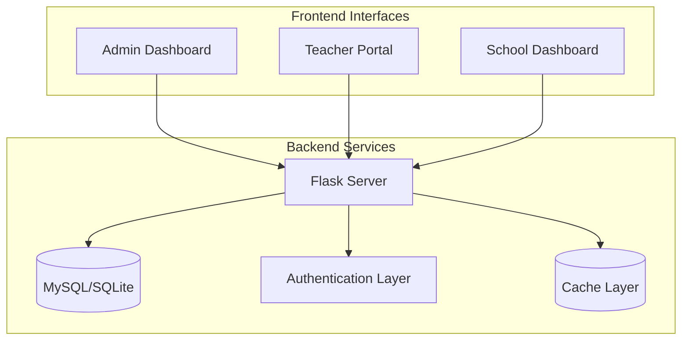
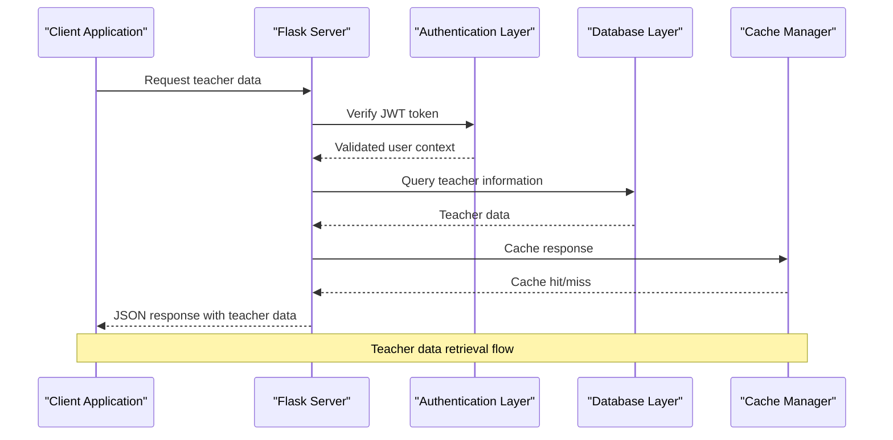
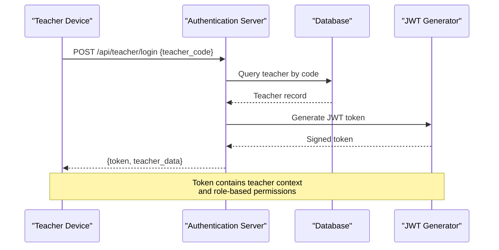
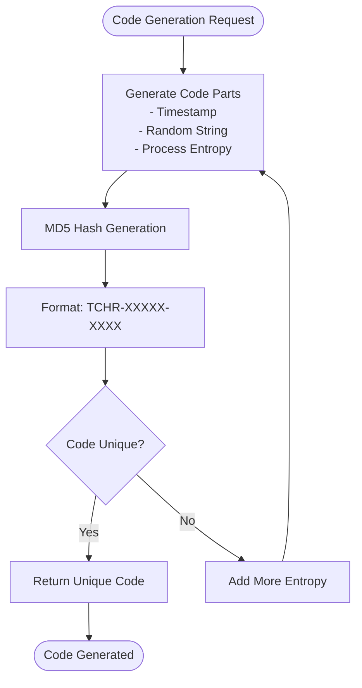
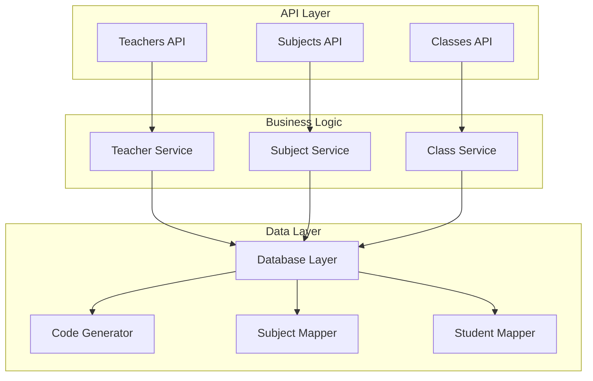

# Teacher Management API

<cite>
**Referenced Files in This Document**
- [server.py](file://server.py)
- [database.py](file://database.py)
- [auth.py](file://auth.py)
- [teacher-portal-enhanced.js](file://public/assets/js/teacher-portal-enhanced.js)
- [teacher-subject-assignment.js](file://public/assets/js/teacher-subject-assignment.js)
- [school.js](file://public/assets/js/school.js)
</cite>

## Table of Contents
1. [Introduction](#introduction)
2. [Project Structure](#project-structure)
3. [Core Components](#core-components)
4. [Architecture Overview](#architecture-overview)
5. [Detailed Component Analysis](#detailed-component-analysis)
6. [Dependency Analysis](#dependency-analysis)
7. [Performance Considerations](#performance-considerations)
8. [Troubleshooting Guide](#troubleshooting-guide)
9. [Conclusion](#conclusion)

## Introduction
This document provides comprehensive API documentation for teacher management endpoints within the EduFlow system. It covers the complete lifecycle of teacher records, subject assignments, classroom mappings, and teacher authentication flows. The documentation includes endpoint specifications, request/response formats, authentication mechanisms, and integration points with the teacher portal and administrative dashboards.

## Project Structure
The teacher management system is built around a Flask-based backend with a MySQL/SQLite database layer, complemented by client-side JavaScript for the teacher portal and administrative interfaces.



**Diagram sources**
- [server.py](file://server.py#L1-L50)
- [database.py](file://database.py#L1-L50)

**Section sources**
- [server.py](file://server.py#L1-L100)
- [database.py](file://database.py#L1-L120)

## Core Components
The teacher management system consists of several interconnected components:

### Database Schema
The system maintains separate tables for teachers, subjects, and their relationships:
- **Teachers table**: Stores teacher profiles, codes, and specializations
- **Subjects table**: Manages subject definitions per school
- **Teacher-Subjects junction**: Handles many-to-many relationships
- **Teacher-Class assignments**: Links teachers to specific class sections

### Authentication System
The system implements JWT-based authentication with role-based access control:
- Teacher login via unique teacher codes
- Admin and school-level authentication
- Token-based session management

### Frontend Integration
Multiple frontend interfaces provide different perspectives:
- Teacher portal for personal dashboard
- Administrative dashboards for management
- Subject assignment interfaces

**Section sources**
- [database.py](file://database.py#L219-L260)
- [server.py](file://server.py#L1318-L1373)

## Architecture Overview
The teacher management architecture follows a layered approach with clear separation of concerns:



**Diagram sources**
- [server.py](file://server.py#L1018-L1066)
- [auth.py](file://auth.py#L216-L268)

**Section sources**
- [server.py](file://server.py#L1018-L1066)
- [auth.py](file://auth.py#L216-L268)

## Detailed Component Analysis

### Teacher Retrieval Endpoint
The primary endpoint for retrieving teacher information with subject assignments:

**Endpoint**: `GET /api/school/{school_id}/teachers`

**Functionality**:
- Retrieves all teachers for a specific school
- Includes subject assignments and search capabilities
- Supports filtering by grade level and search queries

**Request Parameters**:
- Path parameters:
  - `school_id`: Numeric identifier for the target school
- Query parameters:
  - `grade_level`: Filter teachers by specific grade level
  - `search`: Search term for filtering by name, code, or email

**Response Format**:
```json
{
  "success": true,
  "teachers": [
    {
      "id": 1,
      "school_id": 1,
      "full_name": "Ahmed Hassan",
      "teacher_code": "TCHR-12345-6789",
      "phone": "+966501234567",
      "email": "ahmed.hassan@school.edu",
      "grade_level": "ابتدائي - الأول الابتدائي",
      "specialization": "علوم",
      "subjects": [
        {
          "id": 1,
          "name": "علوم",
          "grade_level": "ابتدائي - الأول الابتدائي"
        },
        {
          "id": null,
          "name": "رياضيات",
          "grade_level": "free_text"
        }
      ]
    }
  ]
}
```

**Implementation Details**:
- Uses LEFT JOIN operations to include subject information
- Handles NULL values from GROUP_CONCAT gracefully
- Integrates with `get_teacher_subjects()` for detailed subject data

**Section sources**
- [server.py](file://server.py#L1018-L1066)
- [database.py](file://database.py#L467-L507)

### Teacher Registration Endpoint
The endpoint for creating new teacher records with unique code generation:

**Endpoint**: `POST /api/school/{school_id}/teacher`

**Request Body**:
```json
{
  "full_name": "Fatima Ali",
  "phone": "+966559876543",
  "email": "fatima.ali@school.edu",
  "subject_ids": [1, 2, 3],
  "free_text_subjects": "لغة عربية, تاريخ",
  "grade_level": "متوسطة - الصف الخامس",
  "specialization": "علوم",
  "teacher_code": "TCHR-12345-6789"
}
```

**Response Format**:
```json
{
  "success": true,
  "message": "تم إضافة المعلم بنجاح",
  "teacher": {
    "id": 2,
    "school_id": 1,
    "full_name": "Fatima Ali",
    "teacher_code": "TCHR-12345-6789",
    "phone": "+966559876543",
    "email": "fatima.ali@school.edu",
    "grade_level": "متوسطة - الصف الخامس",
    "specialization": "علوم",
    "subjects": [
      {"id": 1, "name": "علوم", "grade_level": "متوسطة - الصف الخامس"},
      {"id": null, "name": "لغة عربية", "grade_level": "free_text"}
    ]
  },
  "teacher_code": "TCHR-12345-6789"
}
```

**Key Features**:
- Automatic unique teacher code generation
- Subject assignment validation
- Free-text subject support
- Comprehensive error handling

**Section sources**
- [server.py](file://server.py#L1068-L1172)
- [database.py](file://database.py#L391-L466)

### Teacher Authentication Flow
The system supports multiple authentication mechanisms:

**Teacher Login Endpoint**:
- `POST /api/teacher/login` - Authenticates teachers via teacher code
- Returns JWT token with teacher context

**Authentication Process**:


**Diagram sources**
- [server.py](file://server.py#L1320-L1373)
- [auth.py](file://auth.py#L36-L69)

**Section sources**
- [server.py](file://server.py#L1320-L1373)
- [auth.py](file://auth.py#L14-L69)

### Subject Assignment Management
The system provides comprehensive subject assignment capabilities:

**Endpoint**: `POST /api/teacher/{teacher_id}/subjects/assignments`

**Request Body**:
```json
{
  "subject_ids": [1, 2, 3],
  "free_text_subjects": "لغة عربية, تاريخ"
}
```

**Response Format**:
```json
{
  "success": true,
  "teacher": {
    "id": 1,
    "subjects": [
      {"id": 1, "name": "علوم", "grade_level": "ابتدائي - الأول الابتدائي"},
      {"id": null, "name": "لغة عربية", "grade_level": "free_text"}
    ]
  },
  "assigned_count": 2
}
```

**Subject Types Supported**:
- Predefined subjects from the subjects table
- Free-text subjects entered by administrators
- Automatic validation and sanitization

**Section sources**
- [server.py](file://server.py#L1551-L1599)
- [database.py](file://database.py#L467-L507)

### Classroom Assignment Operations
The system manages teacher-class relationships for scheduling and reporting:

**Endpoint**: `POST /api/teacher-class-assignment`

**Request Body**:
```json
{
  "teacher_id": 1,
  "class_name": "الصف الأول - الفصل أ",
  "subject_id": 1,
  "academic_year_id": 1
}
```

**Available Endpoints**:
- `GET /api/school/{school_id}/teachers-with-assignments` - School-wide teacher assignments
- `GET /api/class/{class_name}/teachers` - Teachers assigned to specific class
- `GET /api/teacher/{teacher_id}/class-assignments` - Individual teacher assignments
- `DELETE /api/teacher-class-assignment/{assignment_id}` - Remove teacher assignment

**Section sources**
- [server.py](file://server.py#L1471-L1518)
- [database.py](file://database.py#L552-L623)

### Teacher Code Generation System
The system implements a robust teacher code generation mechanism:

**Code Format**: `TCHR-XXXXX-XXXX` where:
- `TCHR`: Fixed prefix
- `XXXXX`: Nanosecond timestamp component
- `XXXX`: MD5 hash component for uniqueness

**Generation Process**:


**Diagram sources**
- [database.py](file://database.py#L367-L466)

**Section sources**
- [database.py](file://database.py#L367-L466)

### Teacher-Student Relationship Mapping
The system automatically maps teachers to students based on subject assignments:

**Endpoint**: `GET /api/teacher/{teacher_id}/students`

**Mapping Logic**:
- Identifies teacher's subject assignments
- Retrieves students enrolled in matching grade levels
- Filters by optional academic year parameter

**Integration Points**:
- Used by teacher portal for student dashboard
- Supports grade-level filtering
- Provides student enrollment context

**Section sources**
- [server.py](file://server.py#L1427-L1434)
- [database.py](file://database.py#L509-L551)

## Dependency Analysis



**Diagram sources**
- [server.py](file://server.py#L1018-L1518)
- [database.py](file://database.py#L367-L726)

**Section sources**
- [server.py](file://server.py#L1018-L1518)
- [database.py](file://database.py#L367-L726)

## Performance Considerations
The system implements several performance optimization strategies:

### Caching Strategy
- Response caching for frequently accessed teacher data
- Subject assignment caching to reduce database queries
- Token-based session caching for reduced authentication overhead

### Database Optimization
- Efficient JOIN operations for teacher-subject relationships
- Index utilization for teacher code lookups
- Batch operations for bulk subject assignments

### Frontend Integration
- Lazy loading for teacher portal data
- Pagination support for large datasets
- Real-time updates with polling intervals

## Troubleshooting Guide

### Common Issues and Solutions

**Teacher Code Generation Failures**:
- **Symptom**: Unable to generate unique teacher codes
- **Solution**: Check database connectivity and retry operation
- **Prevention**: Monitor database constraints and handle collisions gracefully

**Subject Assignment Errors**:
- **Symptom**: Subject assignment validation failures
- **Solution**: Verify subject IDs exist and teacher has authorization
- **Prevention**: Implement pre-validation checks

**Authentication Problems**:
- **Symptom**: JWT token validation errors
- **Solution**: Verify token signature and expiration
- **Prevention**: Implement token refresh mechanisms

**Section sources**
- [server.py](file://server.py#L1161-L1172)
- [database.py](file://database.py#L467-L507)

## Conclusion
The EduFlow teacher management system provides a comprehensive solution for educational institution administration. The API endpoints cover the complete teacher lifecycle from registration to assignment, with robust authentication, flexible subject management, and seamless integration with frontend interfaces. The system's modular architecture ensures scalability and maintainability while providing the essential functionality for effective teacher management.

The implementation demonstrates best practices in API design, database modeling, and frontend integration, making it suitable for deployment in educational environments requiring sophisticated teacher and subject management capabilities.