# Architecture Overview

<cite>
**Referenced Files in This Document**
- [server.py](file://server.py)
- [auth.py](file://auth.py)
- [database.py](file://database.py)
- [security.py](file://security.py)
- [cache.py](file://cache.py)
- [performance.py](file://performance.py)
- [services.py](file://services.py)
- [api_optimization.py](file://api_optimization.py)
- [requirements.txt](file://requirements.txt)
- [README.md](file://README.md)
- [public/index.html](file://public/index.html)
</cite>

## Table of Contents
1. [Introduction](#introduction)
2. [Project Structure](#project-structure)
3. [Core Components](#core-components)
4. [Architecture Overview](#architecture-overview)
5. [Detailed Component Analysis](#detailed-component-analysis)
6. [Dependency Analysis](#dependency-analysis)
7. [Performance Considerations](#performance-considerations)
8. [Troubleshooting Guide](#troubleshooting-guide)
9. [Conclusion](#conclusion)
10. [Appendices](#appendices)

## Introduction
This document presents the architecture of the EduFlow system, a comprehensive school management platform built with Python and Flask. The system integrates a layered architecture with a Flask web framework, a database abstraction layer, authentication and security middleware, and cross-cutting concerns such as caching and performance monitoring. It supports dual MySQL/SQLite connectivity, JWT-based authentication, and provides a unified API for administrative, school, teacher, and student portals.

## Project Structure
The project follows a modular structure with clear separation of concerns:
- Web server and routing: Flask application with route handlers and middleware
- Business logic: Services layer encapsulating domain operations
- Data access: Database abstraction supporting MySQL and SQLite
- Security: Rate limiting, input sanitization, audit logging, and optional 2FA
- Caching: Redis-backed cache with in-memory fallback
- Performance: Request timing, endpoint statistics, and system metrics
- API optimization: Field selection, pagination, and response optimization
- Frontend: Static HTML/CSS/JS served from the public directory

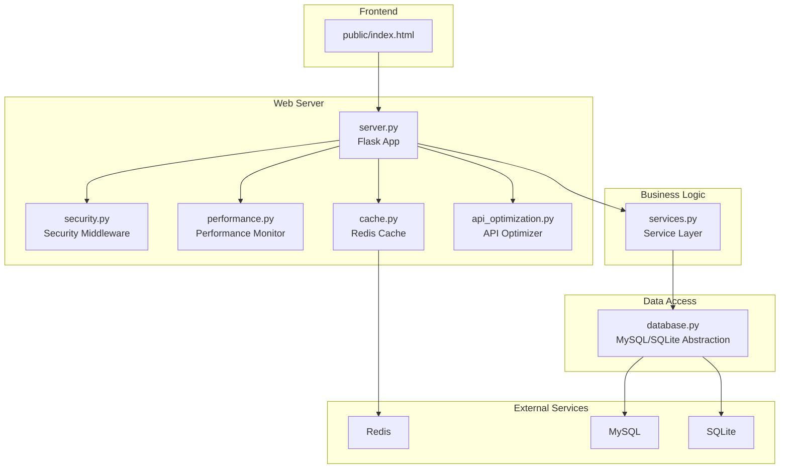

**Diagram sources**
- [server.py](file://server.py#L20-L50)
- [security.py](file://security.py#L476-L578)
- [performance.py](file://performance.py#L15-L40)
- [cache.py](file://cache.py#L14-L50)
- [api_optimization.py](file://api_optimization.py#L187-L223)
- [services.py](file://services.py#L12-L23)
- [database.py](file://database.py#L88-L118)

**Section sources**
- [README.md](file://README.md#L1-L23)
- [requirements.txt](file://requirements.txt#L1-L14)
- [public/index.html](file://public/index.html#L1-L345)

## Core Components
- Flask Web Server: Central application orchestrating routes, middleware, and CORS configuration
- Security Middleware: Rate limiting, input sanitization, audit logging, and optional 2FA
- Performance Monitor: Request timing, endpoint statistics, and system metrics
- Cache Manager: Redis-backed caching with in-memory fallback and cache invalidation strategies
- API Optimizer: Field selection, pagination, and response optimization utilities
- Service Layer: Business logic encapsulation with database access and audit logging
- Database Abstraction: Dual MySQL/SQLite support with connection pooling and SQLite adapter

**Section sources**
- [server.py](file://server.py#L1-L80)
- [security.py](file://security.py#L476-L578)
- [performance.py](file://performance.py#L15-L40)
- [cache.py](file://cache.py#L14-L50)
- [api_optimization.py](file://api_optimization.py#L187-L223)
- [services.py](file://services.py#L12-L23)
- [database.py](file://database.py#L88-L118)

## Architecture Overview
The system employs a layered architecture:
- Presentation Layer: Static HTML pages served by Flask’s static folder and API endpoints
- Application Layer: Flask routes and middleware handling authentication, rate limiting, and performance monitoring
- Business Logic Layer: Services encapsulating domain operations and coordinating with the data layer
- Data Access Layer: Unified database abstraction supporting MySQL and SQLite with connection pooling and adapter patterns
- Cross-Cutting Concerns: Security, caching, and performance monitoring integrated via middleware and decorators

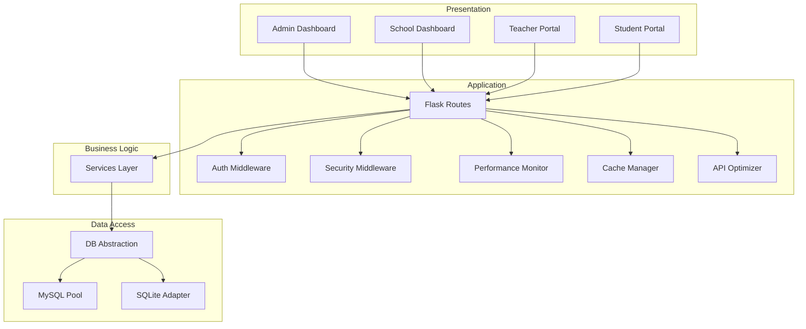

**Diagram sources**
- [server.py](file://server.py#L141-L321)
- [auth.py](file://auth.py#L216-L290)
- [security.py](file://security.py#L476-L578)
- [performance.py](file://performance.py#L15-L40)
- [cache.py](file://cache.py#L234-L275)
- [services.py](file://services.py#L12-L23)
- [database.py](file://database.py#L88-L118)

## Detailed Component Analysis

### Flask Web Server
The Flask application initializes CORS, loads environment variables, sets up database connections, and registers security, performance, caching, and API optimization components. It defines authentication decorators and numerous API endpoints for administration, schools, students, subjects, and teacher/class management.

Key responsibilities:
- Initialize and configure Flask app
- Load environment variables and JWT secret
- Configure uploads directory based on environment
- Register security, performance, cache, and API optimization middleware
- Define authentication and role-based decorators
- Implement API endpoints for login, CRUD operations, and specialized queries

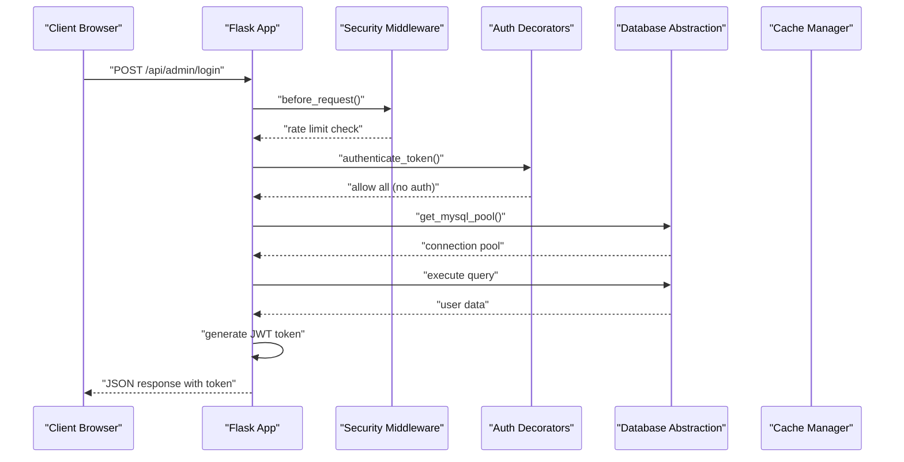

**Diagram sources**
- [server.py](file://server.py#L141-L200)
- [security.py](file://security.py#L495-L517)
- [auth.py](file://auth.py#L216-L267)
- [database.py](file://database.py#L88-L118)

**Section sources**
- [server.py](file://server.py#L1-L140)
- [server.py](file://server.py#L141-L321)

### Security Middleware
The security module provides:
- Rate limiting with configurable windows and limits
- Input sanitization using bleach and markupsafe
- Comprehensive audit logging with database persistence
- Optional 2FA with TOTP and QR code generation
- Global security middleware with before/after request hooks

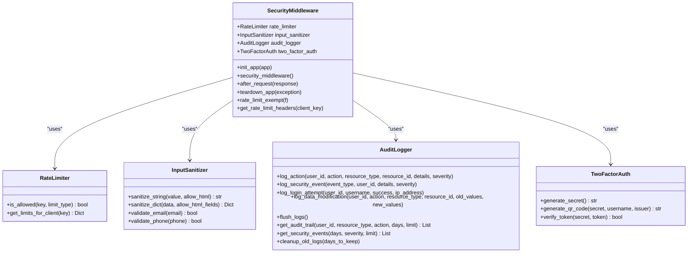

**Diagram sources**
- [security.py](file://security.py#L476-L578)
- [security.py](file://security.py#L20-L76)
- [security.py](file://security.py#L78-L176)
- [security.py](file://security.py#L177-L423)
- [security.py](file://security.py#L424-L475)

**Section sources**
- [security.py](file://security.py#L1-L617)

### Performance Monitoring
The performance monitor tracks:
- Request durations and endpoint statistics
- Active request counts and thread metrics
- Database query performance
- System resource usage via psutil
- Exposes monitoring endpoints for statistics and system metrics

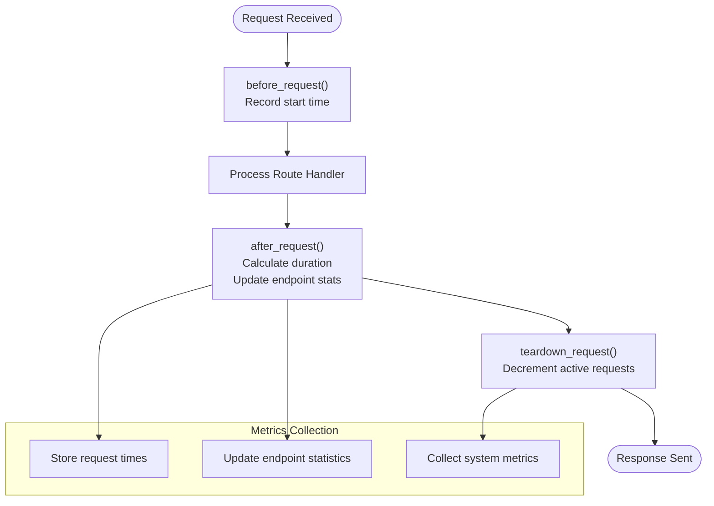

**Diagram sources**
- [performance.py](file://performance.py#L15-L83)
- [performance.py](file://performance.py#L110-L144)
- [performance.py](file://performance.py#L92-L108)

**Section sources**
- [performance.py](file://performance.py#L1-L241)

### Cache Manager
The cache manager provides:
- Redis-backed caching with in-memory fallback
- Automatic key generation and TTL management
- Cache invalidation patterns
- Predefined cache strategies for school, student, teacher, academic year, grades, and attendance data

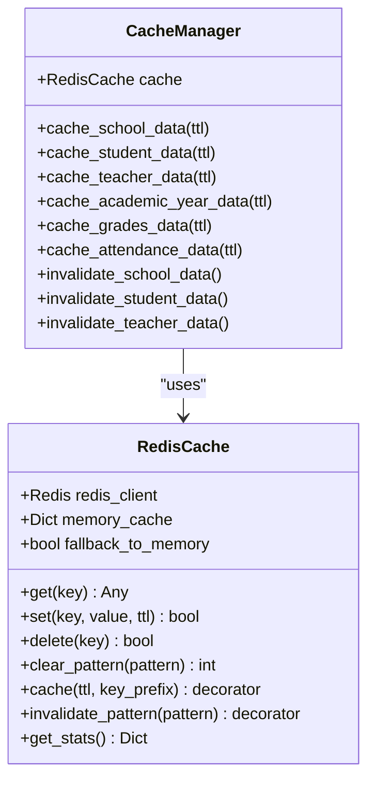

**Diagram sources**
- [cache.py](file://cache.py#L14-L50)
- [cache.py](file://cache.py#L234-L275)

**Section sources**
- [cache.py](file://cache.py#L1-L305)

### API Optimization
The API optimizer offers:
- Field selection to limit response payload
- Pagination for large datasets
- Response optimization utilities
- Decorators for applying optimization strategies

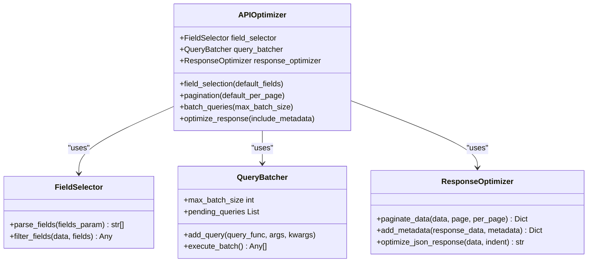

**Diagram sources**
- [api_optimization.py](file://api_optimization.py#L10-L61)
- [api_optimization.py](file://api_optimization.py#L62-L112)
- [api_optimization.py](file://api_optimization.py#L113-L186)
- [api_optimization.py](file://api_optimization.py#L187-L298)

**Section sources**
- [api_optimization.py](file://api_optimization.py#L1-L338)

### Database Abstraction
The database layer supports dual MySQL/SQLite:
- MySQL connection pooling via mysql-connector-python
- SQLite adapter mimicking MySQL interface
- Automatic fallback from MySQL to SQLite
- Schema creation and migration utilities
- Utility functions for unique code generation and teacher/student queries

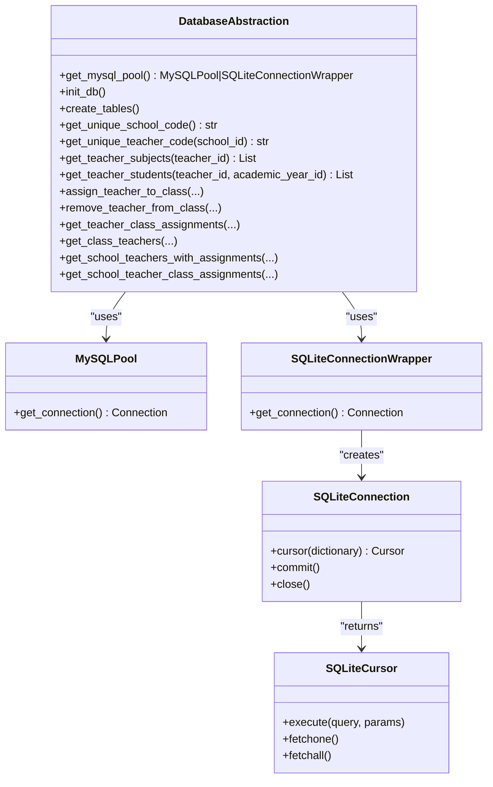

**Diagram sources**
- [database.py](file://database.py#L88-L118)
- [database.py](file://database.py#L23-L87)
- [database.py](file://database.py#L120-L338)

**Section sources**
- [database.py](file://database.py#L1-L726)

### Authentication Service
The authentication system provides:
- JWT token generation and verification
- Access and refresh token management
- Token blacklisting and cleanup
- Authentication and optional authentication decorators
- Token validation utilities

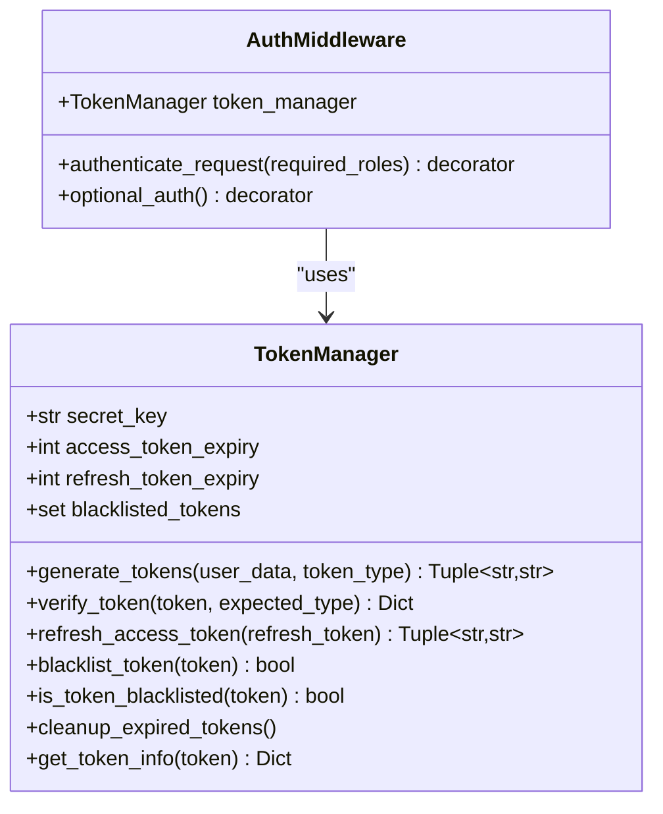

**Diagram sources**
- [auth.py](file://auth.py#L14-L189)
- [auth.py](file://auth.py#L216-L290)

**Section sources**
- [auth.py](file://auth.py#L1-L376)

### Service Layer
The service layer encapsulates business logic:
- Base service with database access, security, and cache integration
- School, Academic Year, Student, Teacher, and Recommendation services
- Audit logging integration for data modifications
- Centralized query execution with connection management

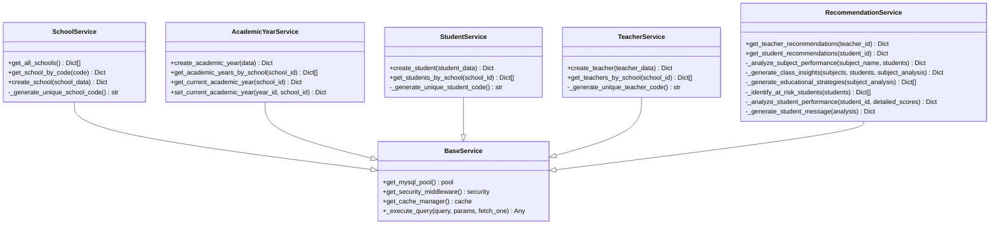

**Diagram sources**
- [services.py](file://services.py#L12-L43)
- [services.py](file://services.py#L44-L101)
- [services.py](file://services.py#L118-L230)
- [services.py](file://services.py#L232-L282)
- [services.py](file://services.py#L298-L346)
- [services.py](file://services.py#L367-L474)

**Section sources**
- [services.py](file://services.py#L1-L913)

### Frontend Integration
The frontend consists of static HTML pages served by Flask’s static folder. The index page demonstrates API integration with the backend:
- Role-based login modals
- Fetch-based API calls to /api/admin/login, /api/school/login, and /api/student/login
- Local storage usage for token persistence
- Redirects to respective dashboards upon successful authentication

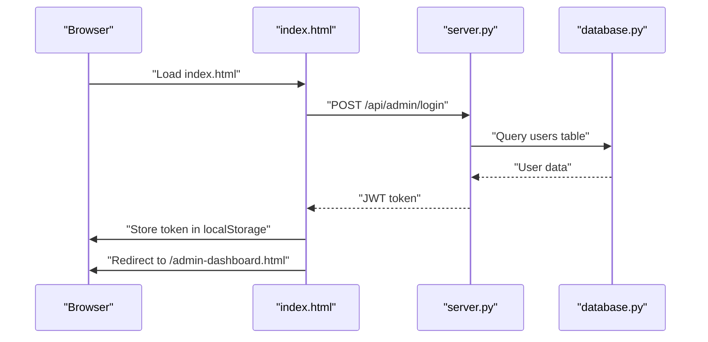

**Diagram sources**
- [public/index.html](file://public/index.html#L203-L236)
- [server.py](file://server.py#L141-L200)
- [database.py](file://database.py#L88-L118)

**Section sources**
- [public/index.html](file://public/index.html#L1-L345)

## Dependency Analysis
The system exhibits low coupling and high cohesion among modules. Dependencies flow primarily from the Flask server to middleware, services, and database abstractions. External dependencies include Flask, PyJWT, bcrypt, mysql-connector-python, redis, bleach, psutil, qrcode, pyotp, and werkzeug.

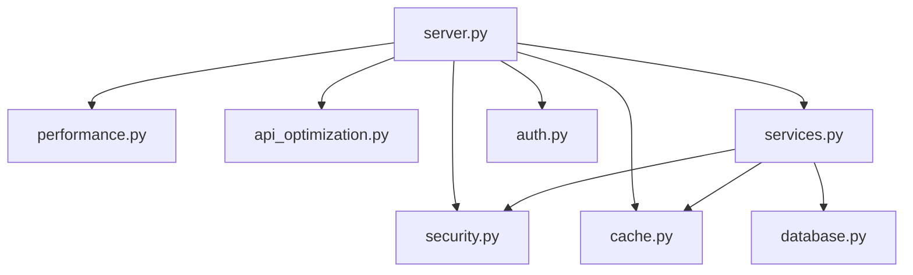

**Diagram sources**
- [server.py](file://server.py#L1-L50)
- [security.py](file://security.py#L1-L20)
- [performance.py](file://performance.py#L1-L15)
- [cache.py](file://cache.py#L1-L15)
- [api_optimization.py](file://api_optimization.py#L1-L10)
- [services.py](file://services.py#L1-L11)
- [database.py](file://database.py#L1-L10)
- [auth.py](file://auth.py#L1-L15)

**Section sources**
- [requirements.txt](file://requirements.txt#L1-L14)

## Performance Considerations
- Database pooling: MySQL connection pooling reduces overhead and improves throughput
- Caching: Redis cache with in-memory fallback minimizes repeated database queries
- Pagination: API pagination prevents large payloads and excessive memory usage
- Field selection: Selective field retrieval reduces response sizes
- Rate limiting: Prevents abuse and ensures fair resource allocation
- Performance monitoring: Tracks endpoint latency and system metrics for optimization

[No sources needed since this section provides general guidance]

## Troubleshooting Guide
Common issues and resolutions:
- Database connectivity failures: The system automatically falls back from MySQL to SQLite when MySQL is unavailable
- Authentication errors: Verify JWT secret and ensure tokens are stored and sent with requests
- Rate limiting: Review rate limit headers and adjust configurations as needed
- Cache connectivity: Redis fallback enables continued operation when Redis is unavailable
- Performance bottlenecks: Use performance endpoints to identify slow endpoints and optimize queries

**Section sources**
- [database.py](file://database.py#L114-L118)
- [security.py](file://security.py#L510-L517)
- [cache.py](file://cache.py#L42-L48)
- [performance.py](file://performance.py#L218-L234)

## Conclusion
EduFlow employs a robust, layered architecture leveraging Flask for the web server, comprehensive security and performance monitoring, dual MySQL/SQLite support, and caching for scalability. The service layer encapsulates business logic, while the database abstraction provides flexibility across deployment environments. The system’s design supports extensibility, maintainability, and operational excellence.

[No sources needed since this section summarizes without analyzing specific files]

## Appendices

### Technology Stack
- Flask 3.0.0
- PyJWT 2.8.0
- bcrypt 4.0.1
- mysql-connector-python 8.0.33
- redis 5.0.1
- bleach 6.1.0
- psutil 5.9.6
- qrcode 7.4.2
- pyotp 2.9.0
- Flask-Cors 4.0.0
- python-dotenv 1.0.0
- MarkupSafe 2.1.3
- werkzeug 3.0.1

**Section sources**
- [requirements.txt](file://requirements.txt#L1-L14)