# Data Flow Architecture

<cite>
**Referenced Files in This Document**
- [server.py](file://server.py)
- [database.py](file://database.py)
- [cache.py](file://cache.py)
- [validation.py](file://validation.py)
- [utils.py](file://utils.py)
- [security.py](file://security.py)
- [performance.py](file://performance.py)
- [services.py](file://services.py)
- [auth.py](file://auth.py)
</cite>

## Table of Contents
1. [Introduction](#introduction)
2. [Project Structure](#project-structure)
3. [Core Components](#core-components)
4. [Architecture Overview](#architecture-overview)
5. [Detailed Component Analysis](#detailed-component-analysis)
6. [Dependency Analysis](#dependency-analysis)
7. [Performance Considerations](#performance-considerations)
8. [Troubleshooting Guide](#troubleshooting-guide)
9. [Conclusion](#conclusion)

## Introduction
This document describes the complete data flow architecture of EduFlow, from frontend requests through API endpoints to database operations and caching layers. It explains request processing, including input sanitization, authentication, business logic execution, database queries, and response generation. It also documents the caching strategy using Redis for performance optimization, including cache invalidation, data consistency, and cache warming. Finally, it covers performance monitoring integration that tracks request latency, error rates, and system health, and provides sequence diagrams for typical user workflows such as login, student enrollment, and grade updates.

## Project Structure
EduFlow is a Python/Flask-based backend with modular components:
- server.py: Central Flask application, routing, and request lifecycle
- database.py: Database abstraction, connection pooling, and schema management
- cache.py: Redis-backed caching with in-memory fallback and cache management
- validation.py: Comprehensive input validation framework
- utils.py: Shared utilities, helpers, and standardized response formatting
- security.py: Rate limiting, input sanitization, audit logging, and security middleware
- performance.py: Request timing, endpoint statistics, and system metrics
- services.py: Business logic layer abstracted from routes
- auth.py: Enhanced JWT authentication with refresh token mechanism

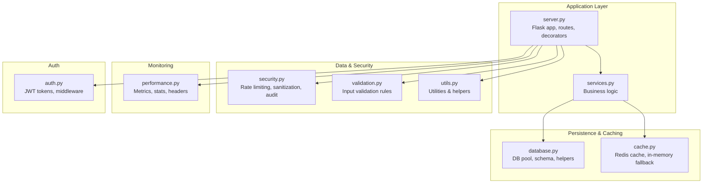

**Diagram sources**
- [server.py](file://server.py#L1-L120)
- [database.py](file://database.py#L88-L120)
- [cache.py](file://cache.py#L14-L50)
- [validation.py](file://validation.py#L10-L30)
- [utils.py](file://utils.py#L27-L60)
- [security.py](file://security.py#L20-L60)
- [performance.py](file://performance.py#L15-L40)
- [services.py](file://services.py#L12-L25)
- [auth.py](file://auth.py#L14-L40)

**Section sources**
- [server.py](file://server.py#L1-L120)
- [database.py](file://database.py#L88-L120)
- [cache.py](file://cache.py#L14-L50)
- [validation.py](file://validation.py#L10-L30)
- [utils.py](file://utils.py#L27-L60)
- [security.py](file://security.py#L20-L60)
- [performance.py](file://performance.py#L15-L40)
- [services.py](file://services.py#L12-L25)
- [auth.py](file://auth.py#L14-L40)

## Core Components
- Flask application and routing: Central entry point, CORS, environment configuration, and route registration
- Database abstraction: MySQL/SQLite connection pooling, schema creation, and helper functions
- Caching layer: Redis-backed cache with in-memory fallback, TTL management, and cache invalidation patterns
- Input validation: Rule-based validation framework with custom validators and request decorators
- Security middleware: Rate limiting, input sanitization, audit logging, and optional 2FA
- Performance monitoring: Request timing, endpoint statistics, and system metrics exposure
- Business services: Encapsulated domain logic with database operations and audit logging
- Authentication: JWT-based tokens with refresh capability and middleware

**Section sources**
- [server.py](file://server.py#L1-L120)
- [database.py](file://database.py#L120-L220)
- [cache.py](file://cache.py#L14-L50)
- [validation.py](file://validation.py#L203-L240)
- [security.py](file://security.py#L476-L578)
- [performance.py](file://performance.py#L15-L40)
- [services.py](file://services.py#L12-L43)
- [auth.py](file://auth.py#L14-L40)

## Architecture Overview
The system follows a layered architecture:
- Presentation: Flask routes handle HTTP requests and responses
- Security: Middleware validates and sanitizes inputs, enforces rate limits, and logs actions
- Services: Business logic orchestrates data transformations and database operations
- Persistence: Database abstraction handles connections, migrations, and CRUD operations
- Caching: Optional Redis cache improves read performance and reduces DB load
- Observability: Performance monitor tracks latency, error rates, and system health

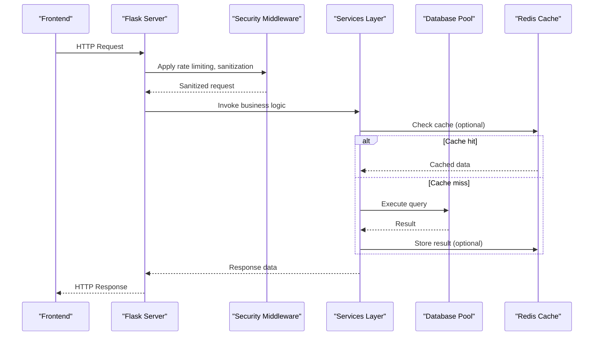

**Diagram sources**
- [server.py](file://server.py#L1-L120)
- [security.py](file://security.py#L476-L578)
- [services.py](file://services.py#L12-L43)
- [database.py](file://database.py#L88-L120)
- [cache.py](file://cache.py#L102-L128)

## Detailed Component Analysis

### Request Lifecycle and Data Path
- Initialization: Flask app loads environment variables, initializes database, security, performance, cache, and API optimization
- Routing: Routes define endpoints for authentication, CRUD operations, and teacher/class assignments
- Middleware: Security middleware runs before/after requests to enforce rate limits, sanitize inputs, and log actions
- Validation: Route decorators apply validation rules to incoming payloads
- Services: Business logic executes queries, transforms data, and logs audit trails
- Persistence: Database pool manages connections, executes statements, and handles transactions
- Caching: Optional cache reads/writes improve performance and reduce DB load
- Response: Standardized response formatting and performance headers

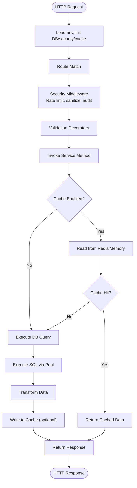

**Diagram sources**
- [server.py](file://server.py#L1-L120)
- [security.py](file://security.py#L476-L578)
- [validation.py](file://validation.py#L333-L367)
- [services.py](file://services.py#L12-L43)
- [database.py](file://database.py#L88-L120)
- [cache.py](file://cache.py#L102-L128)

**Section sources**
- [server.py](file://server.py#L1-L120)
- [security.py](file://security.py#L476-L578)
- [validation.py](file://validation.py#L333-L367)
- [services.py](file://services.py#L12-L43)
- [database.py](file://database.py#L88-L120)
- [cache.py](file://cache.py#L102-L128)

### Authentication and Authorization
- Authentication: Routes support admin, school, student, and teacher logins; tokens encode user identity and role
- Authorization: Role-based decorators allow restricting endpoints to specific roles
- JWT: Tokens include expiration and are signed with a shared secret
- Security middleware: Optional 2FA and audit logging for security events

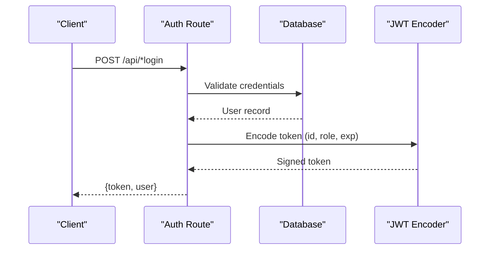

**Diagram sources**
- [server.py](file://server.py#L142-L200)
- [server.py](file://server.py#L201-L256)
- [server.py](file://server.py#L258-L304)
- [server.py](file://server.py#L1320-L1372)

**Section sources**
- [server.py](file://server.py#L142-L200)
- [server.py](file://server.py#L201-L256)
- [server.py](file://server.py#L258-L304)
- [server.py](file://server.py#L1320-L1372)
- [auth.py](file://auth.py#L14-L40)

### Data Validation and Transformation
- Validation framework: Rule-based validators for required fields, strings, emails, phones, numbers, dates, enums, and custom rules
- Request decorators: Apply validators to route payloads and return standardized error responses
- Utilities: Helper functions for grade validation, score range checks, sanitization, and response formatting
- Transformation: Data cleaning for detailed scores, grade normalization, and JSON parsing

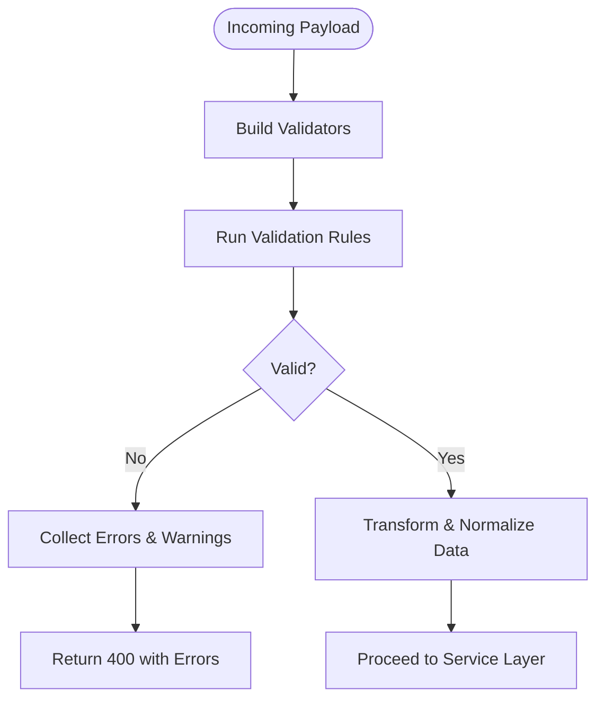

**Diagram sources**
- [validation.py](file://validation.py#L203-L240)
- [validation.py](file://validation.py#L333-L367)
- [utils.py](file://utils.py#L106-L186)
- [utils.py](file://utils.py#L243-L271)

**Section sources**
- [validation.py](file://validation.py#L203-L240)
- [validation.py](file://validation.py#L333-L367)
- [utils.py](file://utils.py#L106-L186)
- [utils.py](file://utils.py#L243-L271)

### Database Operations and Transactions
- Connection pooling: MySQL connector pool with fallback to SQLite adapter
- Schema management: Automatic table creation and migrations
- Helpers: CRUD helpers for schools, students, subjects, teachers, and assignments
- Transactions: Explicit commit/rollback handling around queries

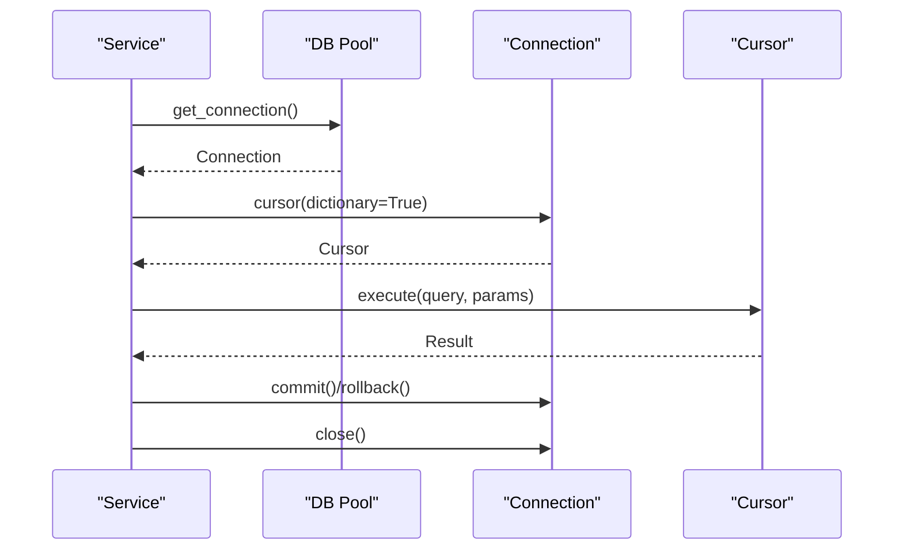

**Diagram sources**
- [database.py](file://database.py#L88-L120)
- [database.py](file://database.py#L123-L220)
- [services.py](file://services.py#L21-L43)

**Section sources**
- [database.py](file://database.py#L88-L120)
- [database.py](file://database.py#L123-L220)
- [services.py](file://services.py#L21-L43)

### Caching Strategy and Consistency
- Redis cache: Primary cache with TTL, key generation, and fallback to in-memory cache
- Cache manager: Predefined decorators for school, student, teacher, academic year, grades, and attendance data
- Invalidation: Pattern-based invalidation for cache invalidation after mutations
- Stats: Cache statistics including Redis connectivity and memory usage

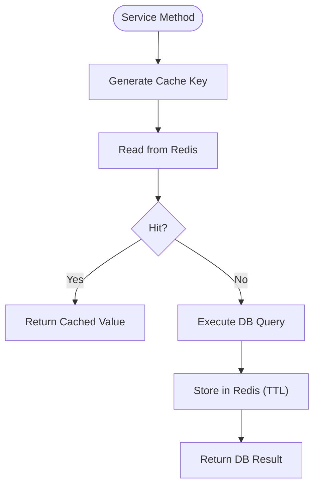

**Diagram sources**
- [cache.py](file://cache.py#L102-L128)
- [cache.py](file://cache.py#L240-L275)

**Section sources**
- [cache.py](file://cache.py#L14-L50)
- [cache.py](file://cache.py#L102-L128)
- [cache.py](file://cache.py#L240-L275)

### Performance Monitoring and Metrics
- Request timing: Tracks start/end times, calculates durations, and attaches performance headers
- Endpoint statistics: Maintains counts, totals, averages, min/max times per endpoint
- System metrics: CPU, memory, active requests, thread count
- Exposure: Dedicated endpoints for performance stats, endpoint details, and system metrics

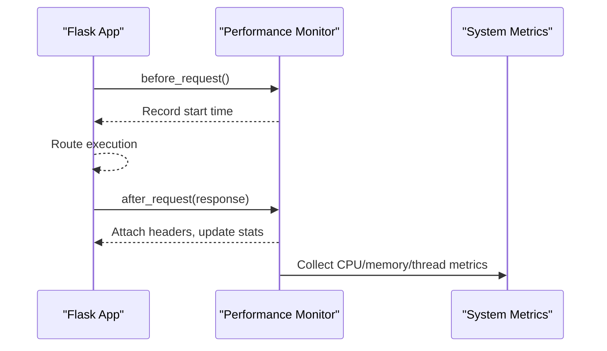

**Diagram sources**
- [performance.py](file://performance.py#L41-L83)
- [performance.py](file://performance.py#L110-L144)
- [performance.py](file://performance.py#L215-L235)

**Section sources**
- [performance.py](file://performance.py#L15-L40)
- [performance.py](file://performance.py#L41-L83)
- [performance.py](file://performance.py#L110-L144)
- [performance.py](file://performance.py#L215-L235)

### Typical Workflows

#### Login Workflow
- Admin/School/Student login: Validates credentials, generates JWT token, returns user/identity
- Teacher login: Authenticates by teacher code, returns token and subject assignments

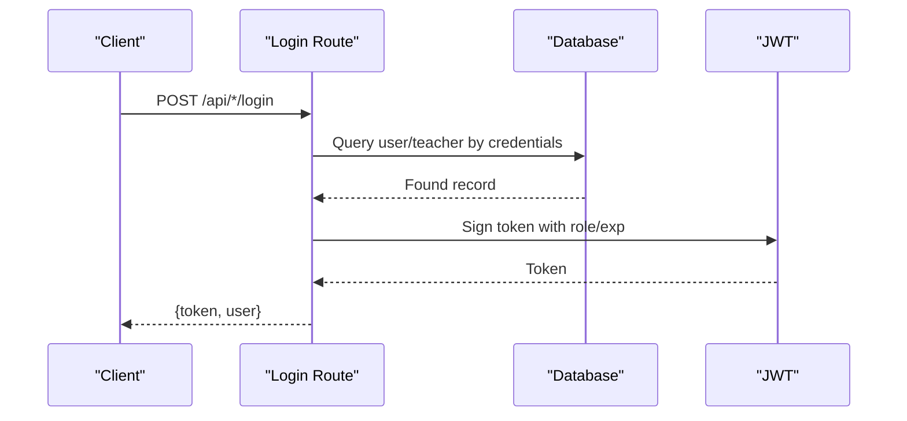

**Diagram sources**
- [server.py](file://server.py#L142-L200)
- [server.py](file://server.py#L201-L256)
- [server.py](file://server.py#L258-L304)
- [server.py](file://server.py#L1320-L1372)

#### Student Enrollment Workflow
- Admin/School creates student: Validates required fields, generates unique code, inserts into DB, returns success
- Data validation ensures grade format, room presence, and optional medical fields

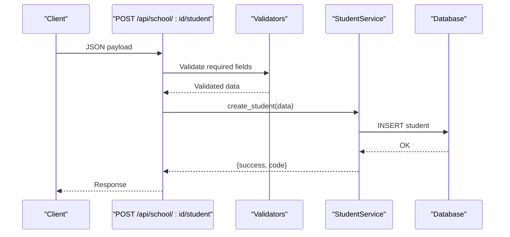

**Diagram sources**
- [server.py](file://server.py#L469-L560)
- [validation.py](file://validation.py#L265-L280)
- [services.py](file://services.py#L235-L269)

#### Grade Updates Workflow
- Admin/School updates student detailed scores: Validates score ranges by grade level, normalizes scores, updates DB, returns success

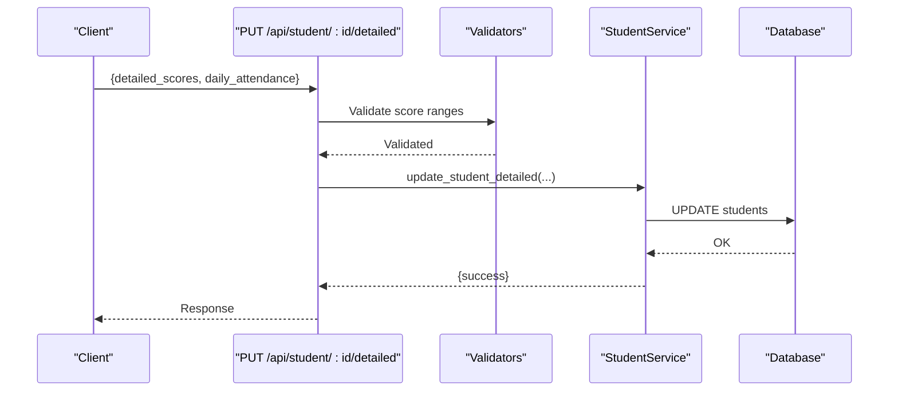

**Diagram sources**
- [server.py](file://server.py#L683-L766)
- [validation.py](file://validation.py#L306-L318)
- [utils.py](file://utils.py#L163-L186)

## Dependency Analysis
The system exhibits clear separation of concerns:
- server.py depends on database, security, performance, cache, and services
- services.py depends on database pool and security audit logger
- cache.py depends on Redis client and environment configuration
- validation.py integrates with utils for shared validation helpers
- security.py integrates with database pool for audit logging persistence
- performance.py integrates with psutil for system metrics
- auth.py provides reusable JWT utilities

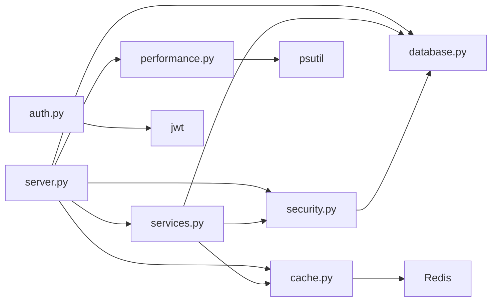

**Diagram sources**
- [server.py](file://server.py#L1-L120)
- [services.py](file://services.py#L12-L25)
- [cache.py](file://cache.py#L14-L50)
- [security.py](file://security.py#L476-L578)
- [performance.py](file://performance.py#L15-L40)
- [auth.py](file://auth.py#L14-L40)

**Section sources**
- [server.py](file://server.py#L1-L120)
- [services.py](file://services.py#L12-L25)
- [cache.py](file://cache.py#L14-L50)
- [security.py](file://security.py#L476-L578)
- [performance.py](file://performance.py#L15-L40)
- [auth.py](file://auth.py#L14-L40)

## Performance Considerations
- Use Redis cache for frequently accessed resources (schools, students, teachers, academic years) to reduce database load
- Apply cache invalidation patterns after write operations to maintain consistency
- Leverage connection pooling to minimize connection overhead
- Monitor endpoint latency and error rates via performance endpoints
- Use pagination and field selection where applicable to reduce payload sizes
- Consider cache warming for high-traffic endpoints during startup or off-peak periods

[No sources needed since this section provides general guidance]

## Troubleshooting Guide
- Health checks: Use the /health endpoint to verify environment, platform detection, and configuration warnings
- Performance endpoints: Query /api/performance/stats, /api/performance/endpoint/<endpoint>, and /api/performance/system for diagnostics
- Audit logs: Review audit trail for security events and unauthorized access attempts
- Error logging: Utilize standardized error responses and logging utilities for structured error reporting
- Database connectivity: Confirm MySQL/SQLite availability and schema initialization

**Section sources**
- [server.py](file://server.py#L110-L140)
- [performance.py](file://performance.py#L215-L235)
- [security.py](file://security.py#L177-L221)
- [utils.py](file://utils.py#L314-L334)

## Conclusion
EduFlow’s architecture cleanly separates concerns across layers: Flask routes, security middleware, validation, services, persistence, caching, and observability. The data flow emphasizes safety (input sanitization, validation, audit logging), scalability (caching, pooling), and transparency (performance monitoring). By following the documented patterns for authentication, validation, caching, and performance monitoring, developers can extend the system reliably while maintaining data integrity and responsiveness.