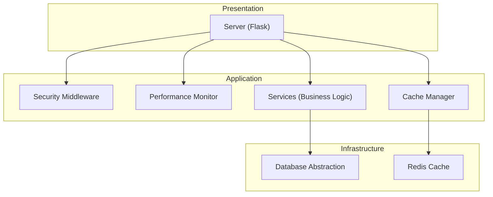
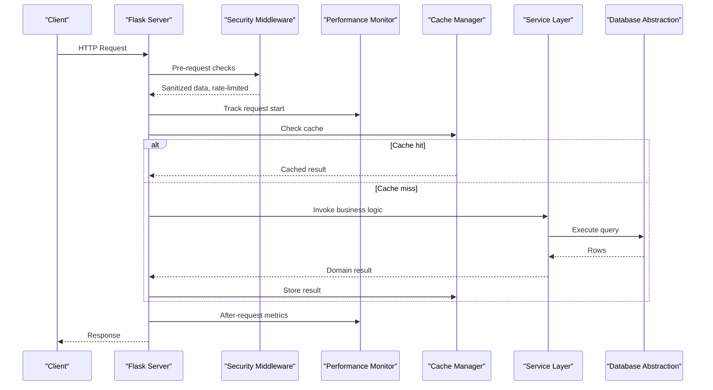
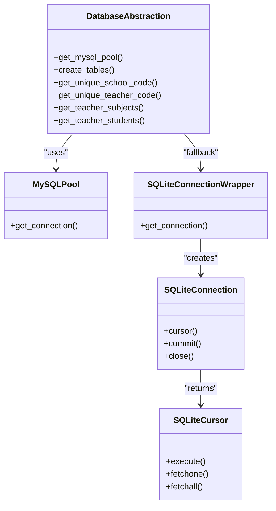
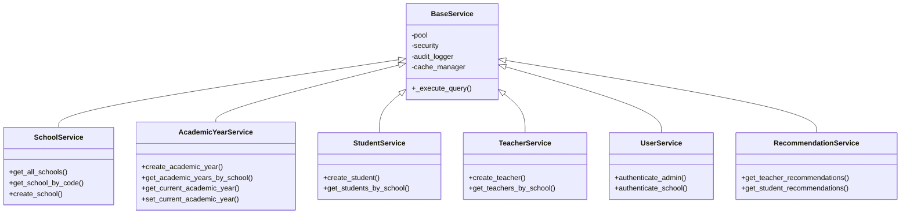
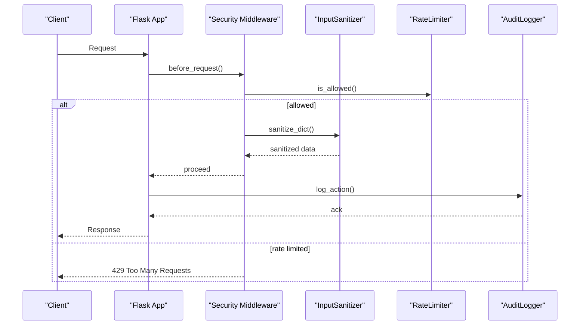
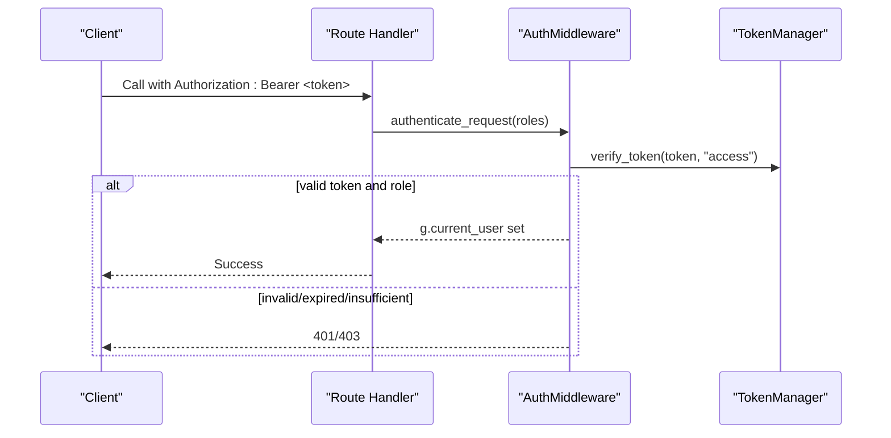
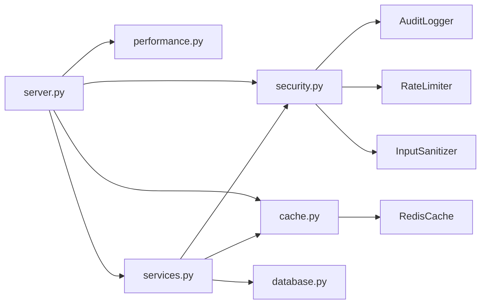

# Design Patterns

<cite>
**Referenced Files in This Document**
- [auth.py](file://auth.py)
- [database.py](file://database.py)
- [services.py](file://services.py)
- [security.py](file://security.py)
- [server.py](file://server.py)
- [cache.py](file://cache.py)
- [performance.py](file://performance.py)
- [utils.py](file://utils.py)
</cite>

## Table of Contents
1. [Introduction](#introduction)
2. [Project Structure](#project-structure)
3. [Core Components](#core-components)
4. [Architecture Overview](#architecture-overview)
5. [Detailed Component Analysis](#detailed-component-analysis)
6. [Dependency Analysis](#dependency-analysis)
7. [Performance Considerations](#performance-considerations)
8. [Troubleshooting Guide](#troubleshooting-guide)
9. [Conclusion](#conclusion)

## Introduction
This document explains the design patterns implemented in EduFlow and how they contribute to maintainability, testability, and extensibility. It focuses on:
- Repository Pattern for database abstraction
- Factory Pattern for dynamic service creation
- Observer Pattern for real-time data synchronization
- Middleware Pattern for cross-cutting concerns (security, rate limiting, input sanitization)
- Decorator Pattern for authentication and authorization

Where applicable, we provide code-level references to actual implementations and explain the benefits they bring.

## Project Structure
EduFlow is a Flask-based backend with layered architecture:
- Database layer with a unified connection abstraction
- Service layer encapsulating business logic
- Security middleware for cross-cutting concerns
- Caching layer for performance
- Performance monitoring for observability
- Utilities for validation and formatting

**Diagram sources**
- [server.py](file://server.py#L20-L42)
- [security.py](file://security.py#L476-L562)
- [performance.py](file://performance.py#L15-L83)
- [cache.py](file://cache.py#L234-L299)
- [database.py](file://database.py#L88-L118)

**Section sources**
- [server.py](file://server.py#L20-L42)

## Core Components
- Database abstraction: Unified connection pool and SQLite adapter for testability and environment flexibility
- Service layer: Business logic with shared infrastructure (security, caching, database)
- Security middleware: Rate limiting, input sanitization, audit logging, and 2FA
- Caching layer: Redis-backed cache with in-memory fallback and cache decorators
- Performance monitor: Request timing, endpoint statistics, and system metrics
- Utilities: Validation helpers and standardized response formatting

**Section sources**
- [database.py](file://database.py#L88-L118)
- [services.py](file://services.py#L12-L43)
- [security.py](file://security.py#L476-L562)
- [cache.py](file://cache.py#L14-L129)
- [performance.py](file://performance.py#L15-L83)
- [utils.py](file://utils.py#L19-L311)

## Architecture Overview
The system separates concerns across layers:
- Presentation: Flask routes
- Application: Services and middleware
- Infrastructure: Database and cache

**Diagram sources**
- [server.py](file://server.py#L141-L200)
- [security.py](file://security.py#L495-L545)
- [performance.py](file://performance.py#L41-L77)
- [cache.py](file://cache.py#L102-L128)
- [services.py](file://services.py#L21-L42)
- [database.py](file://database.py#L120-L122)

## Detailed Component Analysis

### Repository Pattern: Database Abstraction for Testability and Separation of Concerns
The Repository Pattern centralizes data access behind a unified interface, enabling:
- Environment switching (MySQL vs SQLite)
- Testability with deterministic mocks
- Consistent connection lifecycle management
- Cross-database compatibility

Key implementation highlights:
- Unified connection pool factory with fallback to SQLite adapter
- Cursor and connection wrappers to normalize behavior
- Centralized table creation and migrations
- Utility functions for unique code generation and teacher-student queries

Benefits:
- Single place to change database behavior
- Easier unit/integration tests
- Cleaner separation between business logic and persistence

**Diagram sources**
- [database.py](file://database.py#L88-L118)
- [database.py](file://database.py#L24-L87)

**Section sources**
- [database.py](file://database.py#L88-L118)
- [database.py](file://database.py#L120-L338)
- [database.py](file://database.py#L467-L550)

### Factory Pattern: Dynamic Service Creation Based on Role Requirements and Feature Needs
While the codebase does not expose a dedicated factory class, the service layer demonstrates a factory-like approach:
- Centralized service instances for easy access
- Base service composition with shared infrastructure (database pool, security, cache)
- Role-based routing decorators that conditionally enforce permissions

How it works:
- Services inherit from a base class that injects common dependencies
- Route decorators select services and enforce role-based access
- Global service instances simplify instantiation across routes

Benefits:
- Encapsulation of cross-cutting concerns in base service
- Easy extension with new services following the same pattern
- Consistent error handling and auditing

**Diagram sources**
- [services.py](file://services.py#L12-L43)
- [services.py](file://services.py#L44-L117)
- [services.py](file://services.py#L118-L230)
- [services.py](file://services.py#L232-L297)
- [services.py](file://services.py#L298-L366)
- [services.py](file://services.py#L861-L897)
- [services.py](file://services.py#L367-L858)

**Section sources**
- [services.py](file://services.py#L12-L43)
- [services.py](file://services.py#L899-L913)

### Observer Pattern: Real-Time Data Synchronization Between Clients and Server
The codebase does not implement a traditional Observer Pattern (publish/subscribe) for real-time updates. However, it provides:
- Audit logging that records changes for later consumption
- Caching strategies that can be invalidated to reflect updates
- Performance monitoring that tracks request/response behavior

Implications:
- No built-in WebSocket or pub/sub channels
- Audit trails can be used to detect changes externally
- Cache invalidation can trigger clients to refetch data

Recommendation:
- Introduce a publish/subscribe layer (e.g., Redis Pub/Sub) to notify clients of changes
- Use cache invalidation hooks to trigger client-side updates

[No sources needed since this section analyzes absence of a pattern and proposes enhancements]

### Middleware Pattern: Security Middleware for Cross-Cutting Concerns
The Security Middleware implements the Middleware Pattern to handle cross-cutting concerns:
- Rate limiting per endpoint category
- Input sanitization for JSON payloads
- Audit logging for actions and security events
- Two-Factor Authentication utilities

**Diagram sources**
- [security.py](file://security.py#L495-L545)
- [security.py](file://security.py#L20-L76)
- [security.py](file://security.py#L78-L158)
- [security.py](file://security.py#L177-L280)

Benefits:
- Centralized enforcement of security policies
- Consistent behavior across routes
- Extensible with additional middleware stages

**Section sources**
- [security.py](file://security.py#L476-L562)
- [security.py](file://security.py#L20-L76)
- [security.py](file://security.py#L78-L158)
- [security.py](file://security.py#L177-L280)

### Decorator Pattern: Authentication and Authorization Decorators
The system uses decorators extensively to enforce authentication and authorization:
- Authentication decorator validates JWT tokens and attaches user context
- Role-based decorators restrict access to specific roles
- Optional authentication decorator sets user context when present

**Diagram sources**
- [auth.py](file://auth.py#L222-L267)
- [auth.py](file://auth.py#L70-L104)
- [auth.py](file://auth.py#L330-L336)

Benefits:
- Clean separation of concerns in routes
- Reusable permission logic
- Easy to add optional authentication variants

**Section sources**
- [auth.py](file://auth.py#L216-L290)
- [auth.py](file://auth.py#L330-L336)

### Additional Cross-Cutting Patterns
- Caching Decorators: Cache and invalidate patterns for function results
- Performance Tracking: Request timing and endpoint statistics
- Validation Utilities: Standardized validation and response formatting

**Section sources**
- [cache.py](file://cache.py#L170-L211)
- [performance.py](file://performance.py#L15-L83)
- [utils.py](file://utils.py#L359-L405)

## Dependency Analysis
The system exhibits low coupling and high cohesion:
- Services depend on the base service for shared infrastructure
- Database abstraction is injected via a factory
- Security and caching are injected via global managers
- Routes depend on decorators and service instances

**Diagram sources**
- [server.py](file://server.py#L11-L16)
- [services.py](file://services.py#L6-L10)
- [security.py](file://security.py#L476-L562)
- [cache.py](file://cache.py#L234-L299)
- [database.py](file://database.py#L88-L118)

**Section sources**
- [server.py](file://server.py#L11-L16)
- [services.py](file://services.py#L6-L10)

## Performance Considerations
- Use caching decorators to reduce repeated database calls
- Monitor slow endpoints and optimize hotspots
- Apply rate limiting to protect resources
- Consider batching audit logs to reduce database overhead

[No sources needed since this section provides general guidance]

## Troubleshooting Guide
Common issues and resolutions:
- Database connectivity failures: Check environment variables and fallback to SQLite
- Authentication failures: Verify token structure and expiration
- Rate limiting errors: Inspect rate limit headers and adjust thresholds
- Audit log flush failures: Ensure database availability and proper credentials

**Section sources**
- [database.py](file://database.py#L88-L118)
- [auth.py](file://auth.py#L339-L369)
- [security.py](file://security.py#L510-L517)
- [security.py](file://security.py#L277-L337)

## Conclusion
EduFlow’s architecture leverages several design patterns to achieve separation of concerns, testability, and maintainability:
- Repository Pattern abstracts database access for flexibility and testability
- Factory-like service composition promotes reuse and consistency
- Middleware Pattern centralizes security and performance concerns
- Decorator Pattern cleanly enforces authentication and authorization
- Caching and performance monitoring enhance scalability and observability

Future enhancements could introduce a publish/subscribe layer for real-time updates and expand the factory pattern to dynamically instantiate services based on role and feature flags.