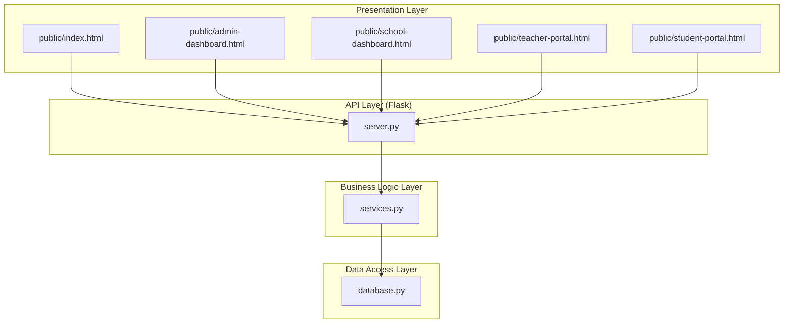
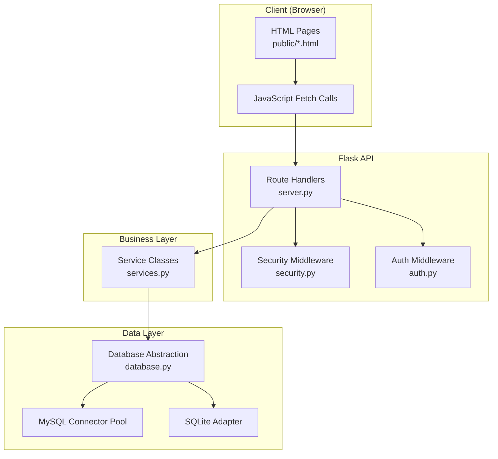
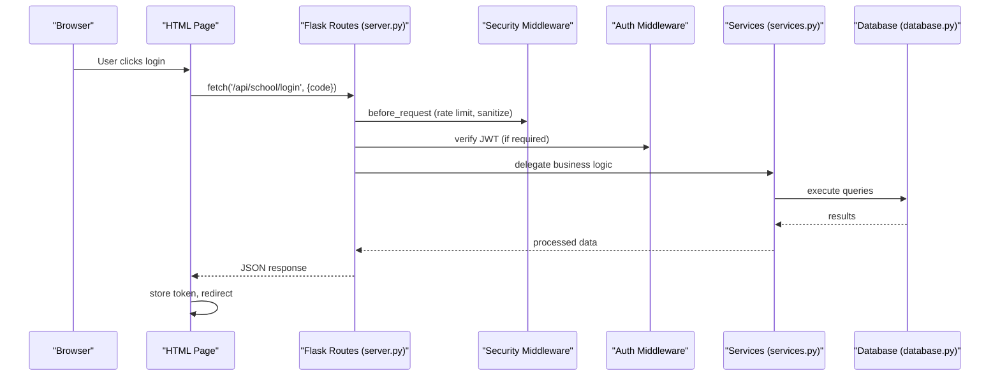
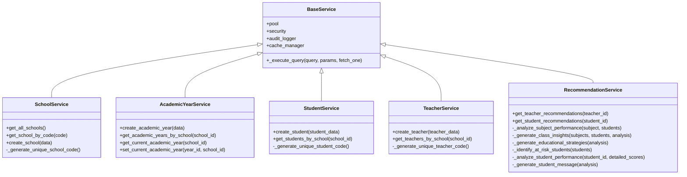
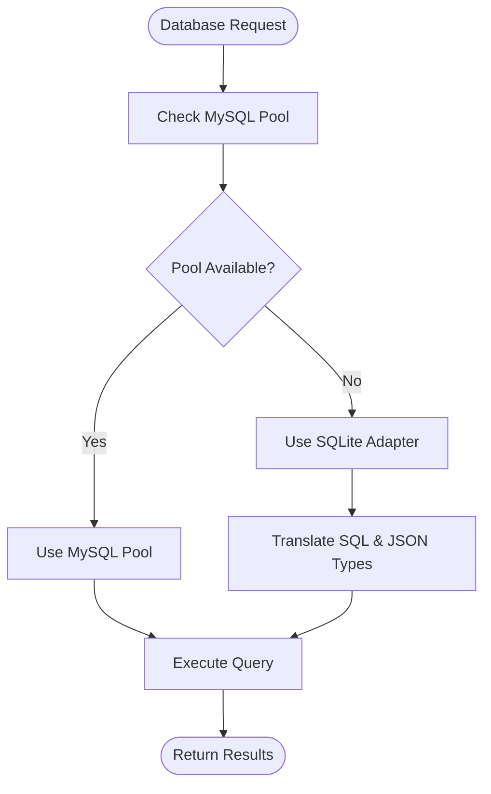
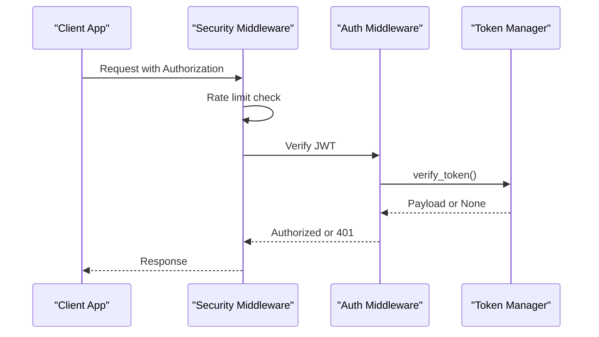
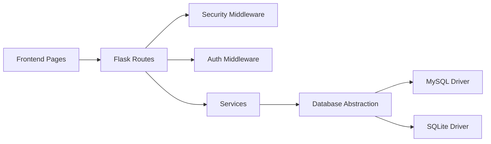

# System Architecture

<cite>
**Referenced Files in This Document**
- [server.py](file://server.py)
- [services.py](file://services.py)
- [database.py](file://database.py)
- [security.py](file://security.py)
- [auth.py](file://auth.py)
- [index.html](file://public/index.html)
- [admin-dashboard.html](file://public/admin-dashboard.html)
- [school-dashboard.html](file://public/school-dashboard.html)
- [teacher-portal.html](file://public/teacher-portal.html)
- [student-portal.html](file://public/student-portal.html)
</cite>

## Table of Contents
1. [Introduction](#introduction)
2. [Project Structure](#project-structure)
3. [Core Components](#core-components)
4. [Architecture Overview](#architecture-overview)
5. [Detailed Component Analysis](#detailed-component-analysis)
6. [Dependency Analysis](#dependency-analysis)
7. [Performance Considerations](#performance-considerations)
8. [Troubleshooting Guide](#troubleshooting-guide)
9. [Conclusion](#conclusion)

## Introduction
This document explains the EduFlow system architecture built on a layered Flask web framework. The system separates concerns across four layers:
- Presentation layer (HTML/CSS/JavaScript)
- API layer (Flask routes)
- Business logic layer (Services)
- Data access layer (Database abstraction)

It documents how frontend pages interact with API endpoints, which delegate to business services, and how data flows through the system. It also explains the technical decisions behind using Flask, the layered approach for maintainability, and the modular design supporting future extensions.

## Project Structure
The project follows a clear separation of concerns:
- Frontend static assets and pages live under the public directory
- Backend server entry point initializes Flask, middleware, and routes
- Services encapsulate business logic
- Database module abstracts data access and supports both MySQL and SQLite
- Security and authentication modules provide middleware and token management

**Diagram sources**
- [server.py](file://server.py#L20-L42)
- [services.py](file://services.py#L12-L43)
- [database.py](file://database.py#L88-L118)

**Section sources**
- [server.py](file://server.py#L20-L42)
- [database.py](file://database.py#L120-L122)

## Core Components
- Flask application initialization with CORS, environment configuration, and middleware setup
- Route handlers for authentication and CRUD operations
- Service layer providing business logic with database abstraction
- Database abstraction supporting MySQL and SQLite with a unified interface
- Security middleware for rate limiting, input sanitization, audit logging, and optional 2FA
- Authentication with JWT token management and refresh mechanisms

Key implementation references:
- Flask app creation and middleware: [server.py](file://server.py#L20-L42)
- Route handlers: [server.py](file://server.py#L141-L800)
- Service base class and business logic: [services.py](file://services.py#L12-L43)
- Database pool and adapters: [database.py](file://database.py#L88-L118)
- Security middleware: [security.py](file://security.py#L476-L563)
- Authentication tokens: [auth.py](file://auth.py#L14-L328)

**Section sources**
- [server.py](file://server.py#L20-L42)
- [services.py](file://services.py#L12-L43)
- [database.py](file://database.py#L88-L118)
- [security.py](file://security.py#L476-L563)
- [auth.py](file://auth.py#L14-L328)

## Architecture Overview
The system uses a layered architecture:
- Presentation layer renders HTML pages and handles user interactions via JavaScript fetch calls
- API layer exposes REST endpoints that validate requests and delegate to services
- Business logic layer encapsulates domain rules and orchestrates data operations
- Data access layer abstracts database connectivity and provides a unified interface

**Diagram sources**
- [server.py](file://server.py#L20-L42)
- [security.py](file://security.py#L476-L563)
- [auth.py](file://auth.py#L216-L290)
- [services.py](file://services.py#L12-L43)
- [database.py](file://database.py#L88-L118)

## Detailed Component Analysis

### Presentation Layer
The presentation layer consists of static HTML pages under public/:
- Home and role selection page with login modals
- Admin dashboard for managing schools and academic years
- School dashboard for grade levels, analytics, and student/teacher management
- Teacher portal for subject management and grade/attendance updates
- Student portal for performance insights and reports

These pages use JavaScript to call backend APIs, handle authentication tokens, and render dynamic content.

**Section sources**
- [index.html](file://public/index.html#L1-L345)
- [admin-dashboard.html](file://public/admin-dashboard.html#L1-L174)
- [school-dashboard.html](file://public/school-dashboard.html#L1-L800)
- [teacher-portal.html](file://public/teacher-portal.html#L1-L631)
- [student-portal.html](file://public/student-portal.html#L1-L800)

### API Layer (Flask)
The Flask application initializes middleware and defines routes for:
- Health checks
- Authentication endpoints for admin, school, and student
- CRUD operations for schools, students, subjects, and related entities
- Academic year management
- Recommendations and analytics endpoints

Middleware includes:
- Security middleware for rate limiting, input sanitization, and audit logging
- Authentication middleware for JWT verification and role enforcement

**Diagram sources**
- [server.py](file://server.py#L141-L305)
- [security.py](file://security.py#L495-L545)
- [auth.py](file://auth.py#L216-L290)
- [services.py](file://services.py#L44-L101)
- [database.py](file://database.py#L124-L127)

**Section sources**
- [server.py](file://server.py#L110-L305)
- [security.py](file://security.py#L495-L545)
- [auth.py](file://auth.py#L216-L290)

### Business Logic Layer (Services)
The service layer encapsulates business rules and coordinates data operations:
- BaseService manages database connections, transactions, and audit logging
- Domain-specific services (SchoolService, AcademicYearService, StudentService, TeacherService, RecommendationService) implement CRUD and analytics logic
- Services centralize validation, transformations, and cross-entity operations

**Diagram sources**
- [services.py](file://services.py#L12-L43)
- [services.py](file://services.py#L44-L101)
- [services.py](file://services.py#L118-L230)
- [services.py](file://services.py#L232-L297)
- [services.py](file://services.py#L298-L366)
- [services.py](file://services.py#L367-L474)

**Section sources**
- [services.py](file://services.py#L12-L43)
- [services.py](file://services.py#L44-L101)
- [services.py](file://services.py#L118-L230)
- [services.py](file://services.py#L232-L297)
- [services.py](file://services.py#L298-L366)
- [services.py](file://services.py#L367-L474)

### Data Access Layer (Database Abstraction)
The database layer provides a unified interface supporting:
- MySQL connector pooling with graceful fallback to SQLite
- A SQLite adapter that translates MySQL syntax and JSON types
- Centralized table creation and migrations
- Utility functions for unique code generation and teacher/student assignment queries

**Diagram sources**
- [database.py](file://database.py#L88-L118)
- [database.py](file://database.py#L23-L87)

**Section sources**
- [database.py](file://database.py#L88-L118)
- [database.py](file://database.py#L120-L122)
- [database.py](file://database.py#L23-L87)

### Security and Authentication
Security middleware provides:
- Rate limiting per endpoint category
- Input sanitization and HTML filtering
- Audit logging with batching and persistence
- Optional 2FA support

Authentication uses JWT with refresh tokens and role-based access control.

**Diagram sources**
- [security.py](file://security.py#L495-L545)
- [auth.py](file://auth.py#L216-L290)
- [auth.py](file://auth.py#L14-L328)

**Section sources**
- [security.py](file://security.py#L476-L563)
- [auth.py](file://auth.py#L14-L328)

## Dependency Analysis
The system exhibits low coupling and high cohesion:
- Presentation layer depends only on HTTP endpoints
- API layer depends on services and middleware
- Services depend on database abstraction
- Database abstraction depends on external drivers with internal adapters

**Diagram sources**
- [server.py](file://server.py#L20-L42)
- [security.py](file://security.py#L476-L563)
- [auth.py](file://auth.py#L216-L290)
- [services.py](file://services.py#L12-L43)
- [database.py](file://database.py#L88-L118)

**Section sources**
- [server.py](file://server.py#L20-L42)
- [services.py](file://services.py#L12-L43)
- [database.py](file://database.py#L88-L118)

## Performance Considerations
- Connection pooling: MySQL pool reduces connection overhead; SQLite adapter ensures local development reliability
- Batching: Audit logs are batched to reduce database writes
- Caching: Cache manager is initialized and available for service layer integration
- Rate limiting: Configurable limits protect endpoints from abuse
- JSON handling: Services and database adapters normalize JSON storage and retrieval

[No sources needed since this section provides general guidance]

## Troubleshooting Guide
Common issues and resolutions:
- Database connectivity failures: The system falls back from MySQL to SQLite; verify environment variables and network access
- Authentication errors: Ensure JWT secret is configured and tokens are valid; check role requirements for protected routes
- Rate limit exceeded: Review rate limit headers and adjust client-side retry logic
- Input sanitization errors: Validate request payloads and sanitize HTML where appropriate

**Section sources**
- [database.py](file://database.py#L99-L118)
- [security.py](file://security.py#L509-L517)
- [auth.py](file://auth.py#L216-L290)

## Conclusion
EduFlow’s layered Flask architecture cleanly separates presentation, API, business logic, and data access. The modular design enables maintainability, scalability, and future enhancements such as additional analytics, extended role support, and advanced caching strategies. The choice of Flask provides simplicity and flexibility, while middleware and service abstractions ensure robustness and security.