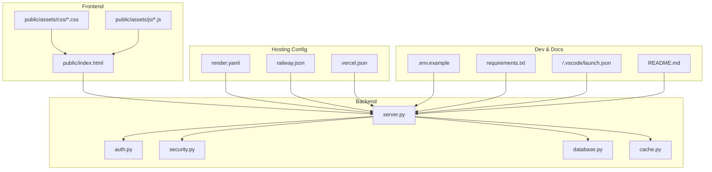
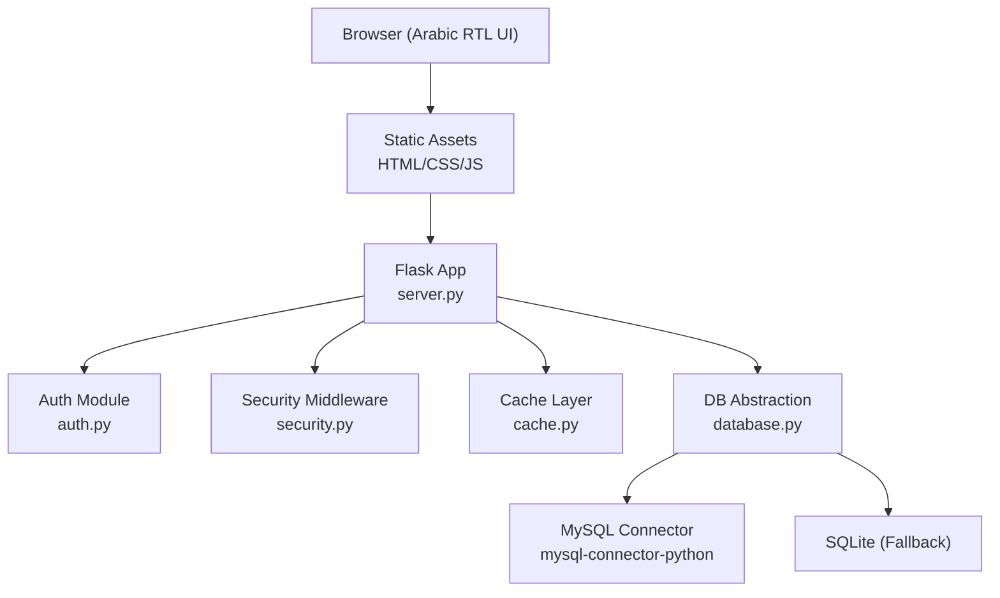
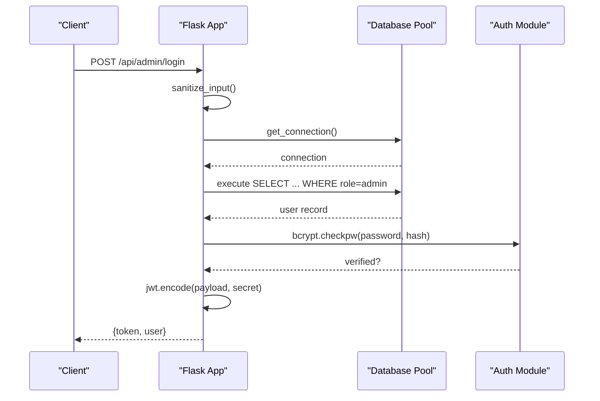
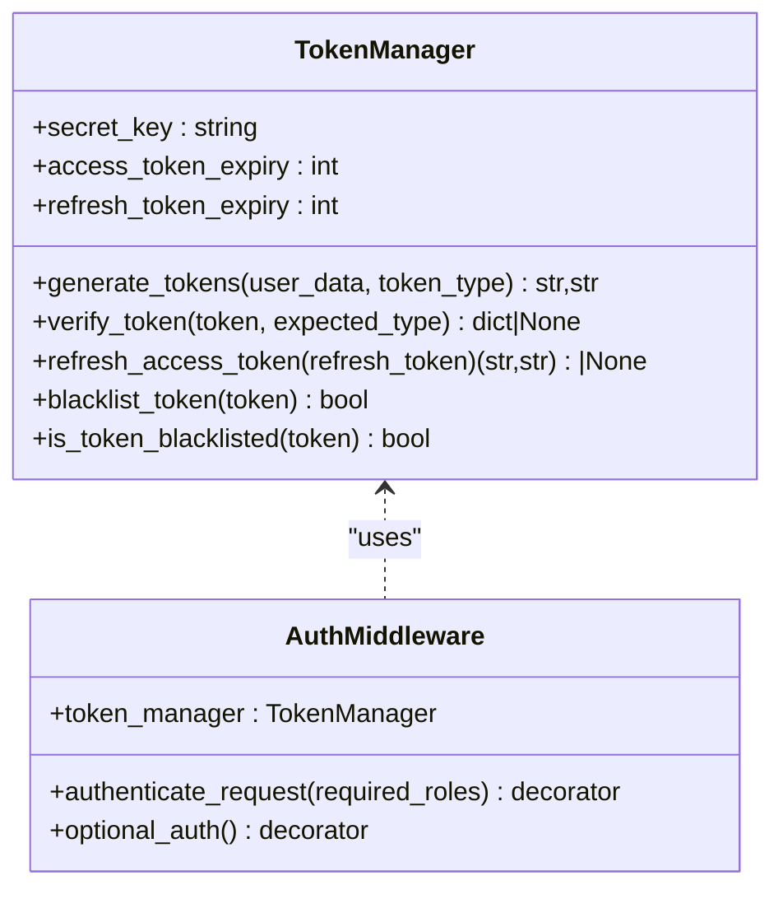
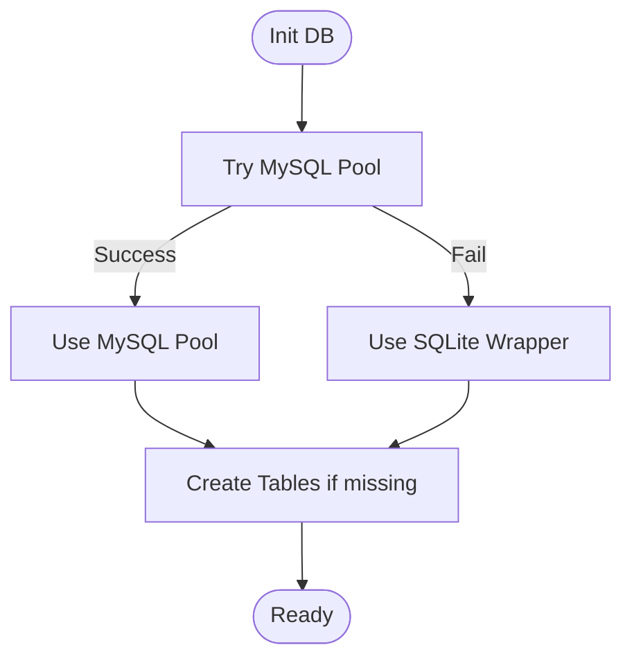
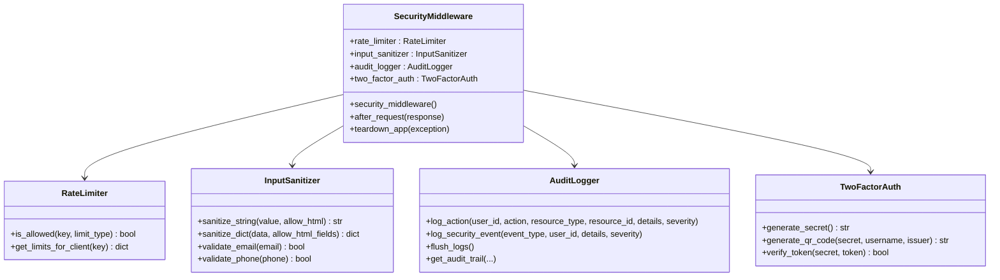
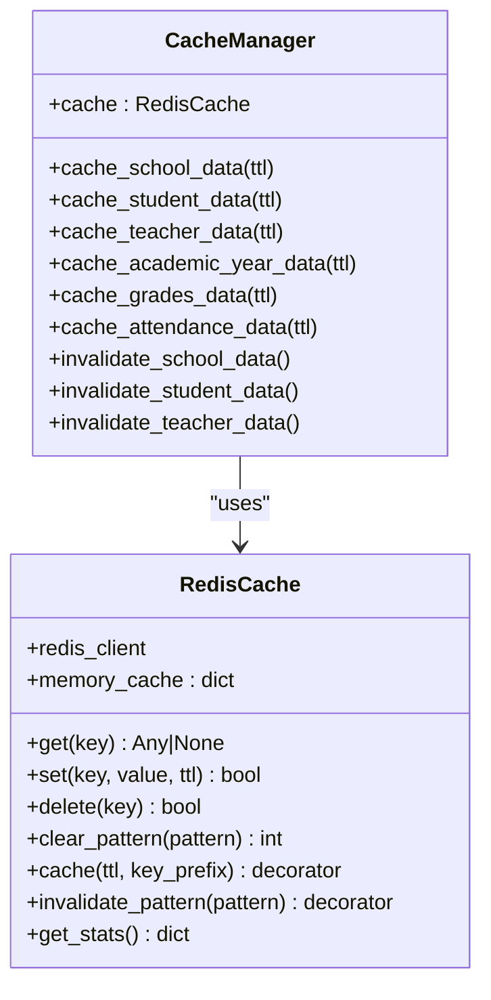
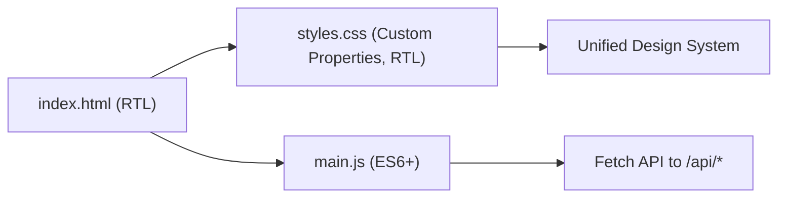
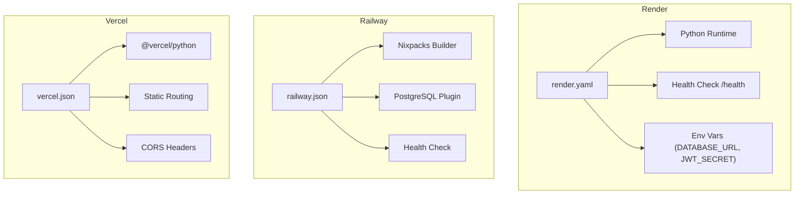
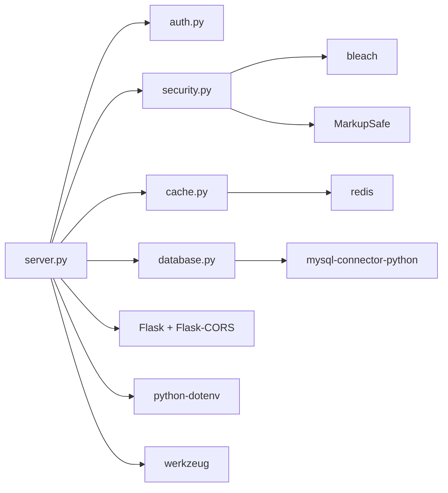

# Technology Stack

<cite>
**Referenced Files in This Document**
- [requirements.txt](file://requirements.txt)
- [server.py](file://server.py)
- [auth.py](file://auth.py)
- [database.py](file://database.py)
- [security.py](file://security.py)
- [cache.py](file://cache.py)
- [render.yaml](file://render.yaml)
- [vercel.json](file://vercel.json)
- [railway.json](file://railway.json)
- [.env.example](file://.env.example)
- [public/index.html](file://public/index.html)
- [public/assets/js/main.js](file://public/assets/js/main.js)
- [public/assets/css/styles.css](file://public/assets/css/styles.css)
- [.vscode/launch.json](file://.vscode/launch.json)
- [README.md](file://README.md)
</cite>

## Table of Contents
1. [Introduction](#introduction)
2. [Project Structure](#project-structure)
3. [Core Components](#core-components)
4. [Architecture Overview](#architecture-overview)
5. [Detailed Component Analysis](#detailed-component-analysis)
6. [Dependency Analysis](#dependency-analysis)
7. [Performance Considerations](#performance-considerations)
8. [Troubleshooting Guide](#troubleshooting-guide)
9. [Conclusion](#conclusion)
10. [Appendices](#appendices)

## Introduction
This document describes the complete technology stack for the EduFlow school management system. It covers the backend built with Flask 3.0.0, secure token management via PyJWT 2.8.0, password hashing with bcrypt 4.0.1, and MySQL connectivity through mysql-connector-python 8.0.33. On the frontend, it documents HTML5, CSS3 with Arabic RTL support, JavaScript ES6+ features, and modern web standards. Hosting platform configurations for Render, Railway, and Vercel are included, along with environment variable management and deployment automation. Development tools such as VS Code configuration, Python virtual environments, and testing frameworks are also documented. Finally, version compatibility matrices, dependency relationships, and upgrade considerations are provided to maintain the technology stack.

## Project Structure
The project is organized into:
- Backend: Flask application with modular components for authentication, security, caching, and database abstraction
- Frontend: Static HTML/CSS/JavaScript served from the public directory with Arabic RTL support
- Hosting: Platform-specific configuration files for Render, Railway, and Vercel
- Development: VS Code launch configuration and environment templates

**Diagram sources**
- [server.py](file://server.py#L1-L80)
- [auth.py](file://auth.py#L1-L40)
- [security.py](file://security.py#L1-L40)
- [database.py](file://database.py#L1-L40)
- [cache.py](file://cache.py#L1-L40)
- [render.yaml](file://render.yaml#L1-L34)
- [railway.json](file://railway.json#L1-L30)
- [vercel.json](file://vercel.json#L1-L54)
- [public/index.html](file://public/index.html#L1-L30)
- [public/assets/js/main.js](file://public/assets/js/main.js#L1-L40)
- [public/assets/css/styles.css](file://public/assets/css/styles.css#L1-L40)
- [.env.example](file://.env.example#L1-L40)
- [requirements.txt](file://requirements.txt#L1-L14)
- [.vscode/launch.json](file://.vscode/launch.json#L1-L15)
- [README.md](file://README.md#L1-L23)

**Section sources**
- [README.md](file://README.md#L1-L23)
- [requirements.txt](file://requirements.txt#L1-L14)
- [render.yaml](file://render.yaml#L1-L34)
- [railway.json](file://railway.json#L1-L30)
- [vercel.json](file://vercel.json#L1-L54)
- [.env.example](file://.env.example#L1-L78)
- [public/index.html](file://public/index.html#L1-L30)
- [.vscode/launch.json](file://.vscode/launch.json#L1-L15)

## Core Components
- Web Framework: Flask 3.0.0 with CORS enabled and environment-driven configuration
- Security: PyJWT 2.8.0 for token-based authentication; bcrypt 4.0.1 for password hashing
- Database: mysql-connector-python 8.0.33 with a fallback to SQLite for development
- Utilities: python-dotenv for environment variables, bleach and MarkupSafe for input sanitization, psutil for system metrics, qrcode and pyotp for 2FA, redis for caching
- Frontend: HTML5 semantic markup, CSS3 with custom properties and RTL layout, JavaScript ES6+ for interactivity

Key implementation highlights:
- Token management and middleware are encapsulated in dedicated modules
- Database abstraction supports both MySQL and SQLite with a unified interface
- Security middleware provides rate limiting, input sanitization, audit logging, and 2FA
- Caching layer integrates Redis with in-memory fallback

**Section sources**
- [requirements.txt](file://requirements.txt#L1-L14)
- [server.py](file://server.py#L1-L80)
- [auth.py](file://auth.py#L1-L40)
- [database.py](file://database.py#L1-L40)
- [security.py](file://security.py#L1-L40)
- [cache.py](file://cache.py#L1-L40)

## Architecture Overview
The system follows a layered architecture:
- Presentation Layer: Static HTML/CSS/JS served from public/
- API Layer: Flask routes in server.py expose REST endpoints
- Business Logic Layer: Modules for auth, security, caching, and database helpers
- Data Access Layer: Unified database abstraction supporting MySQL and SQLite

**Diagram sources**
- [server.py](file://server.py#L1-L80)
- [auth.py](file://auth.py#L1-L40)
- [security.py](file://security.py#L1-L40)
- [cache.py](file://cache.py#L1-L40)
- [database.py](file://database.py#L1-L40)
- [requirements.txt](file://requirements.txt#L1-L14)

## Detailed Component Analysis

### Backend Web Framework (Flask)
- Initializes Flask app with static folder pointing to public
- Loads environment variables via python-dotenv
- Enables CORS and sets platform-specific environment variables
- Provides health check endpoint and role-based routes for admin, school, and student logins
- Uses JWT for token issuance and bcrypt for password verification

**Diagram sources**
- [server.py](file://server.py#L142-L200)
- [auth.py](file://auth.py#L1-L40)
- [database.py](file://database.py#L88-L118)

**Section sources**
- [server.py](file://server.py#L1-L140)
- [requirements.txt](file://requirements.txt#L1-L14)

### Authentication and Token Management (PyJWT + bcrypt)
- TokenManager generates HS256 tokens with access/refresh pairs and optional blacklisting
- AuthMiddleware validates bearer tokens and enforces role-based access
- Password hashing uses bcrypt with salt generation and verification
- Frontend stores tokens in localStorage and sends Authorization headers

**Diagram sources**
- [auth.py](file://auth.py#L14-L215)

**Section sources**
- [auth.py](file://auth.py#L1-L215)
- [server.py](file://server.py#L188-L198)

### Database Connectivity (mysql-connector-python + SQLite)
- get_mysql_pool creates a MySQL connection pool with fallback to SQLite
- Database creation scripts define normalized tables with JSON fields and foreign keys
- Utility functions generate unique codes for schools and teachers
- Migration-friendly schema supports both MySQL and SQLite dialects

**Diagram sources**
- [database.py](file://database.py#L88-L118)
- [database.py](file://database.py#L123-L338)

**Section sources**
- [database.py](file://database.py#L1-L120)
- [database.py](file://database.py#L120-L340)
- [requirements.txt](file://requirements.txt#L6-L6)

### Security Middleware (Rate Limiting, Input Sanitization, Audit Logging, 2FA)
- RateLimiter enforces configurable limits per endpoint category
- InputSanitizer strips or whitelists HTML based on configuration
- AuditLogger persists actions to database and flushes in batches
- TwoFactorAuth integrates pyotp and qrcode for TOTP provisioning and verification

**Diagram sources**
- [security.py](file://security.py#L20-L563)

**Section sources**
- [security.py](file://security.py#L1-L563)

### Caching Layer (Redis + Memory Fallback)
- RedisCache connects to Redis with fallback to in-memory cache
- CacheManager provides decorators for caching and invalidation patterns
- TTL-based caching reduces database load and improves response times

**Diagram sources**
- [cache.py](file://cache.py#L14-L305)

**Section sources**
- [cache.py](file://cache.py#L1-L305)

### Frontend Technologies (HTML5, CSS3, JavaScript ES6+)
- HTML5 with Arabic language and RTL directionality
- CSS3 with custom properties, gradients, shadows, and responsive utilities
- JavaScript ES6+ features for DOM manipulation, forms, and asynchronous API calls
- Accessibility enhancements and unified design system

**Diagram sources**
- [public/index.html](file://public/index.html#L1-L30)
- [public/assets/css/styles.css](file://public/assets/css/styles.css#L1-L92)
- [public/assets/js/main.js](file://public/assets/js/main.js#L1-L40)

**Section sources**
- [public/index.html](file://public/index.html#L1-L345)
- [public/assets/css/styles.css](file://public/assets/css/styles.css#L1-L2619)
- [public/assets/js/main.js](file://public/assets/js/main.js#L1-L153)

### Hosting Platform Configurations
- Render: Python runtime, health check, environment variables, auto-deploy, persistent disk
- Railway: Nixpacks builder, PostgreSQL plugin, health checks, restart policy
- Vercel: Python runtime, static asset routing, CORS headers, function timeouts, regional endpoints

**Diagram sources**
- [render.yaml](file://render.yaml#L1-L34)
- [railway.json](file://railway.json#L1-L30)
- [vercel.json](file://vercel.json#L1-L54)

**Section sources**
- [render.yaml](file://render.yaml#L1-L34)
- [railway.json](file://railway.json#L1-L30)
- [vercel.json](file://vercel.json#L1-L54)
- [.env.example](file://.env.example#L1-L78)

### Development Tools
- VS Code launch configuration targets localhost for Chrome debugging
- Python virtual environments recommended for dependency isolation
- Testing frameworks can be integrated alongside existing test scripts

**Section sources**
- [.vscode/launch.json](file://.vscode/launch.json#L1-L15)
- [README.md](file://README.md#L14-L19)

## Dependency Analysis
Direct dependencies and relationships:
- server.py depends on auth.py, security.py, cache.py, database.py, and external libraries from requirements.txt
- security.py integrates bleach and MarkupSafe for sanitization
- cache.py integrates redis for caching
- database.py integrates mysql-connector-python with a SQLite fallback

**Diagram sources**
- [server.py](file://server.py#L1-L16)
- [requirements.txt](file://requirements.txt#L1-L14)
- [security.py](file://security.py#L10-L18)
- [cache.py](file://cache.py#L5-L12)
- [database.py](file://database.py#L1-L10)

**Section sources**
- [requirements.txt](file://requirements.txt#L1-L14)
- [server.py](file://server.py#L1-L16)

## Performance Considerations
- Use Redis cache for frequently accessed data to reduce database load
- Implement pagination and field selection for large datasets
- Monitor rate limits to prevent abuse and protect backend resources
- Optimize CSS and JS delivery; leverage browser caching headers
- Use health checks to detect and recover from failures quickly

## Troubleshooting Guide
Common issues and resolutions:
- Health check warnings indicate misconfigured environment variables or incorrect NODE_ENV for hosting
- Missing JWT_SECRET or DATABASE_URL causes authentication and database failures
- Rate limiting errors suggest excessive API calls; adjust limits or implement client-side retries
- CORS errors occur when origin policies are not aligned with deployed configuration
- Redis connectivity failures fall back to in-memory cache; ensure Redis URL is properly configured

**Section sources**
- [server.py](file://server.py#L110-L139)
- [.env.example](file://.env.example#L74-L78)
- [security.py](file://security.py#L509-L517)
- [vercel.json](file://vercel.json#L26-L30)
- [cache.py](file://cache.py#L29-L48)

## Conclusion
EduFlow’s technology stack combines a modern Flask backend with robust security, flexible database connectivity, and a professional Arabic RTL frontend. Hosting configurations for Render, Railway, and Vercel enable automated deployments with environment-driven configuration. The documented components, dependencies, and troubleshooting steps provide a foundation for reliable operation and future upgrades.

## Appendices

### Version Compatibility Matrix
- Flask 3.0.0 with Werkzeug 3.0.1
- PyJWT 2.8.0 for token encoding/decoding
- bcrypt 4.0.1 for password hashing
- mysql-connector-python 8.0.33 for MySQL connectivity
- python-dotenv 1.0.0 for environment variable loading
- bleach 6.1.0 and MarkupSafe 2.1.3 for input sanitization
- redis 5.0.1 for caching
- psutil 5.9.6 for system metrics
- qrcode 7.4.2 and pyotp 2.9.0 for 2FA

**Section sources**
- [requirements.txt](file://requirements.txt#L1-L14)

### Upgrade Considerations
- Flask: Review breaking changes in major releases; test CORS and routing behavior
- PyJWT: Ensure HS256 algorithm compatibility and secret rotation procedures
- bcrypt: Maintain consistent salt rounds and migration strategies for existing hashes
- mysql-connector-python: Validate connection pooling and schema differences across versions
- Frontend: Keep HTML5/CSS3/JS up to date; test RTL rendering and accessibility features