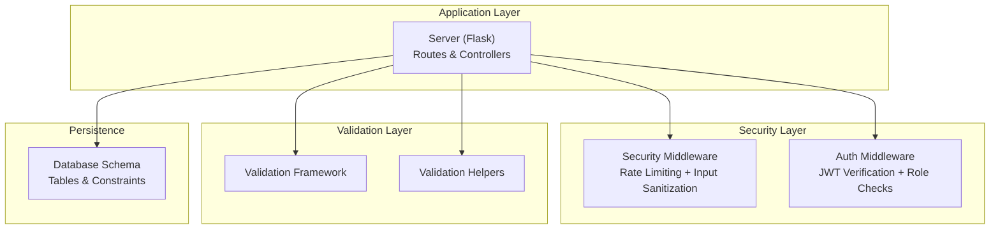
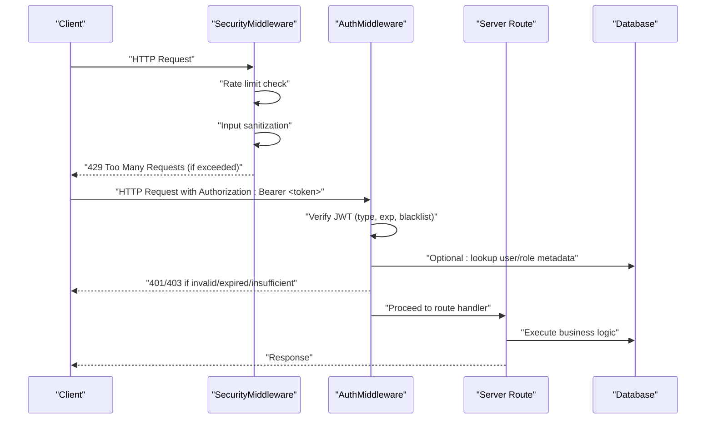
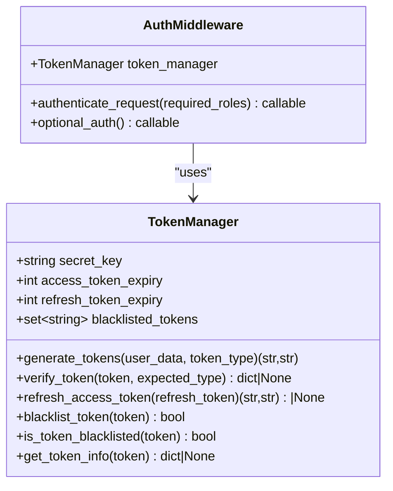
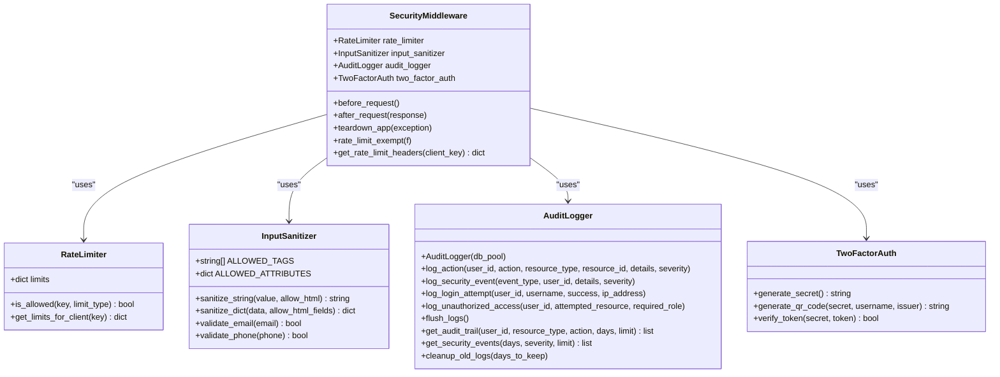
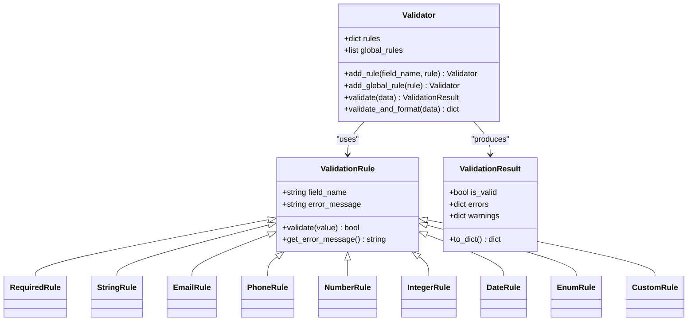
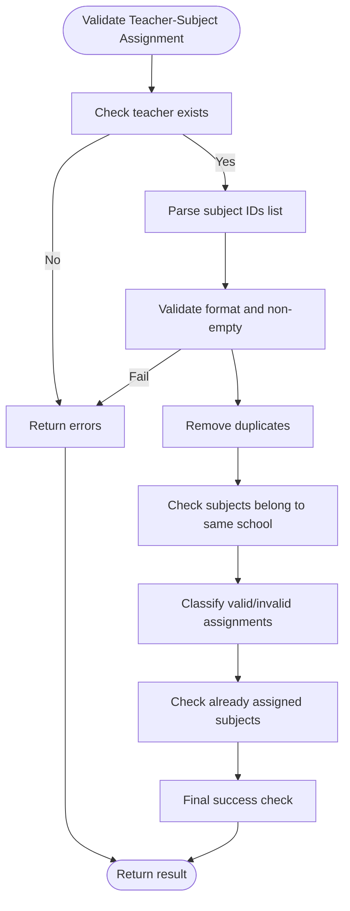
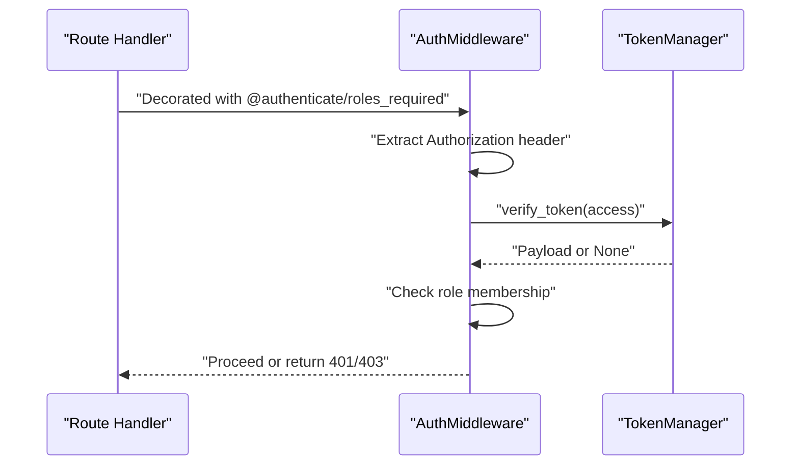
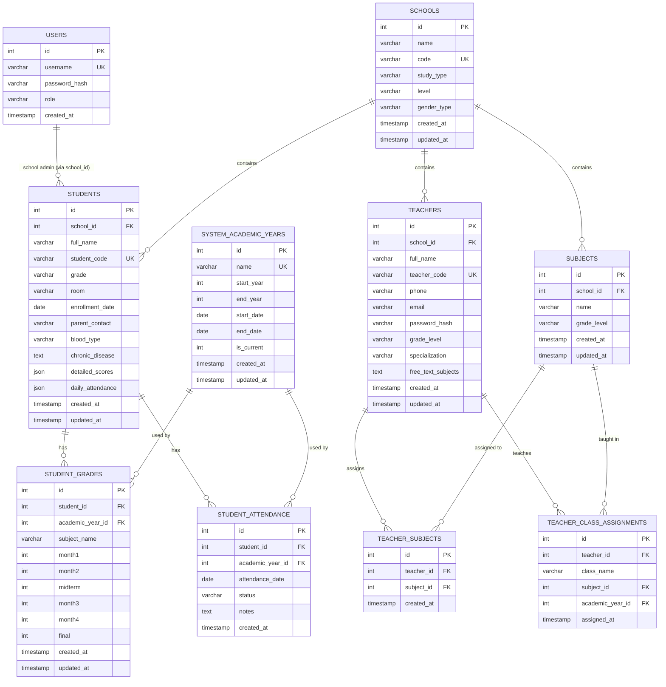
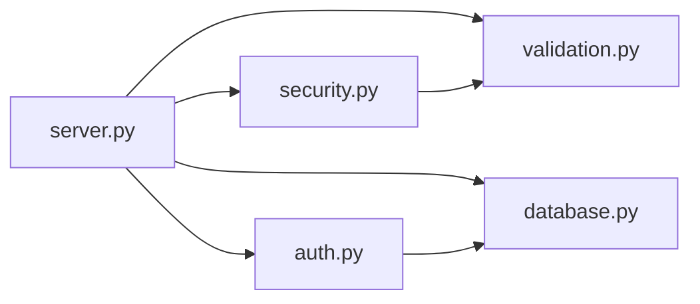

# Authentication & Security

<cite>
**Referenced Files in This Document**
- [auth.py](file://auth.py)
- [security.py](file://security.py)
- [validation.py](file://validation.py)
- [validation_helpers.py](file://validation_helpers.py)
- [utils.py](file://utils.py)
- [server.py](file://server.py)
- [database.py](file://database.py)
</cite>

## Table of Contents
1. [Introduction](#introduction)
2. [Project Structure](#project-structure)
3. [Core Components](#core-components)
4. [Architecture Overview](#architecture-overview)
5. [Detailed Component Analysis](#detailed-component-analysis)
6. [Dependency Analysis](#dependency-analysis)
7. [Performance Considerations](#performance-considerations)
8. [Troubleshooting Guide](#troubleshooting-guide)
9. [Conclusion](#conclusion)

## Introduction
This document provides comprehensive authentication and security documentation for the EduFlow system. It explains the multi-role authentication model supporting admin, school admin, teacher, and student roles, along with JWT token management, security middleware, rate limiting, input sanitization, validation helpers, and authorization controls. It also documents the authentication flow from login requests through token generation to session management, and outlines security measures such as bcrypt password hashing and PyOTP integration for two-factor authentication. Practical examples of authentication endpoints, token handling, and middleware usage are included, alongside common vulnerability mitigations and the relationship between authentication and authorization across portal types.

## Project Structure
The authentication and security subsystems are implemented across several modules:
- Authentication and JWT token management: [auth.py](file://auth.py)
- Security middleware (rate limiting, input sanitization, audit logging, 2FA): [security.py](file://security.py)
- Input validation framework: [validation.py](file://validation.py)
- Validation helpers for teacher-subject assignment: [validation_helpers.py](file://validation_helpers.py)
- Utility functions and decorators: [utils.py](file://utils.py)
- Application server and authentication endpoints: [server.py](file://server.py)
- Database initialization and schema: [database.py](file://database.py)

**Diagram sources**
- [server.py](file://server.py#L1-L120)
- [security.py](file://security.py#L476-L563)
- [auth.py](file://auth.py#L216-L290)
- [validation.py](file://validation.py#L203-L262)
- [validation_helpers.py](file://validation_helpers.py#L12-L147)
- [database.py](file://database.py#L123-L338)

**Section sources**
- [server.py](file://server.py#L1-L120)
- [security.py](file://security.py#L476-L563)
- [auth.py](file://auth.py#L216-L290)
- [validation.py](file://validation.py#L203-L262)
- [validation_helpers.py](file://validation_helpers.py#L12-L147)
- [database.py](file://database.py#L123-L338)

## Core Components
- TokenManager: Generates and verifies JWT access and refresh tokens, supports token blacklisting and expiration checks.
- AuthMiddleware: Provides Flask route decorators for mandatory and optional authentication and role-based access control.
- SecurityMiddleware: Implements rate limiting, input sanitization, audit logging, and 2FA integration.
- Validation Framework: Robust validation rules and a validator engine for request payloads.
- Validation Helpers: Domain-specific validations for teacher-subject assignment and related workflows.
- Utilities: Input sanitization, response formatting, error logging, and decorators for input validation.

Key capabilities:
- Multi-role authentication with role enforcement across endpoints.
- JWT-based session management with access/refresh token lifecycle.
- Comprehensive input sanitization using Bleach and custom sanitizers.
- Rate limiting tailored to auth, API, and default categories.
- Audit logging with database persistence and retrieval APIs.
- Two-factor authentication via PyOTP with QR code generation.

**Section sources**
- [auth.py](file://auth.py#L14-L215)
- [auth.py](file://auth.py#L216-L376)
- [security.py](file://security.py#L20-L76)
- [security.py](file://security.py#L78-L176)
- [security.py](file://security.py#L177-L423)
- [security.py](file://security.py#L424-L475)
- [security.py](file://security.py#L476-L563)
- [validation.py](file://validation.py#L10-L262)
- [validation_helpers.py](file://validation_helpers.py#L12-L147)
- [utils.py](file://utils.py#L19-L405)

## Architecture Overview
The authentication and security architecture integrates middleware, validation, and persistence layers to enforce secure access patterns across the EduFlow API.

**Diagram sources**
- [security.py](file://security.py#L495-L540)
- [auth.py](file://auth.py#L222-L267)
- [server.py](file://server.py#L142-L199)

**Section sources**
- [security.py](file://security.py#L495-L540)
- [auth.py](file://auth.py#L222-L267)
- [server.py](file://server.py#L142-L199)

## Detailed Component Analysis

### JWT Authentication and Token Management
- TokenManager generates access and refresh tokens with HS256, sets issued/expired timestamps, and includes a unique token ID (JTI). It supports token verification, refresh token rotation, blacklisting, and token info extraction.
- AuthMiddleware enforces authentication and role checks via Flask decorators, extracting tokens from Authorization headers and verifying them against the TokenManager.

**Diagram sources**
- [auth.py](file://auth.py#L14-L215)
- [auth.py](file://auth.py#L216-L290)

Practical usage:
- Setup: [setup_auth](file://auth.py#L309-L327)
- Convenience decorators: [authenticate](file://auth.py#L330-L336), [optional_authentication](file://auth.py#L334-L336)
- Token validation utilities: [validate_token_structure](file://auth.py#L339-L353), [get_token_expiration](file://auth.py#L355-L369)

**Section sources**
- [auth.py](file://auth.py#L14-L215)
- [auth.py](file://auth.py#L216-L290)
- [auth.py](file://auth.py#L309-L376)

### Security Middleware: Rate Limiting, Input Sanitization, Audit Logging, 2FA
- RateLimiter maintains per-client request queues and enforces limits by category (auth, API, default).
- InputSanitizer sanitizes strings and dictionaries using Bleach with configurable HTML allowances and custom escaping.
- AuditLogger persists audit events to a database table and supports retrieval and cleanup.
- TwoFactorAuth integrates PyOTP for secret generation, QR code provisioning, and token verification.

**Diagram sources**
- [security.py](file://security.py#L20-L76)
- [security.py](file://security.py#L78-L176)
- [security.py](file://security.py#L177-L423)
- [security.py](file://security.py#L424-L475)
- [security.py](file://security.py#L476-L563)

Practical usage:
- Setup: [setup_security](file://security.py#L574-L578)
- Global middleware hooks: [init_app](file://security.py#L489-L493)
- Rate limit exemption: [rate_limit_exempt](file://security.py#L581-L583)
- Input sanitization decorator: [sanitize_input](file://security.py#L585-L610)

**Section sources**
- [security.py](file://security.py#L20-L76)
- [security.py](file://security.py#L78-L176)
- [security.py](file://security.py#L177-L423)
- [security.py](file://security.py#L424-L475)
- [security.py](file://security.py#L476-L563)
- [security.py](file://security.py#L574-L610)

### Input Validation Framework
- ValidationRule hierarchy defines reusable validation rules (required, string, email, phone, number, integer, date, enum, custom).
- Validator orchestrates rule application and aggregates results with errors and warnings.
- Predefined validators for common entities (student, school, subject, grade, user) streamline endpoint validation.

**Diagram sources**
- [validation.py](file://validation.py#L10-L262)

Practical usage:
- Endpoint decorator: [validate_request](file://validation.py#L333-L367)
- Predefined validators: [create_student_validator](file://validation.py#L265-L279), [create_school_validator](file://validation.py#L281-L294), [create_subject_validator](file://validation.py#L296-L304), [create_grade_validator](file://validation.py#L306-L318), [create_user_validator](file://validation.py#L320-L330)

**Section sources**
- [validation.py](file://validation.py#L10-L262)
- [validation.py](file://validation.py#L333-L367)

### Validation Helpers for Teacher-Subject Assignment
- Validates teacher existence, subject IDs, duplicates, school membership, and existing assignments.
- Supports removal validation and subject data validation with detailed error reporting.

**Diagram sources**
- [validation_helpers.py](file://validation_helpers.py#L12-L147)

**Section sources**
- [validation_helpers.py](file://validation_helpers.py#L12-L147)

### Utilities and Decorators
- EduFlowUtils centralizes sanitization, response formatting, error logging, JSON validation, and input validation decorators.
- sanitize_input uses regex-based stripping of script tags and dangerous attributes.
- format_response standardizes API responses with bilingual messages.

**Section sources**
- [utils.py](file://utils.py#L19-L405)

### Authentication Endpoints and Token Handling
- Admin login: [admin_login](file://server.py#L142-L199)
- School login: [school_login](file://server.py#L201-L256)
- Student login: [student_login](file://server.py#L258-L304)
- Teacher login: [teacher_login](file://server.py#L1320-L1372)
- Token usage: AuthMiddleware decorators applied to routes enforce authentication and roles.

Notes:
- The server currently includes decorators that bypass authentication and role checks for demonstration or development purposes. Production deployments should enforce strict authentication and authorization.

**Section sources**
- [server.py](file://server.py#L142-L199)
- [server.py](file://server.py#L201-L256)
- [server.py](file://server.py#L258-L304)
- [server.py](file://server.py#L1320-L1372)
- [auth.py](file://auth.py#L222-L267)

### Authorization and Role-Based Access Control
- Roles enforced via decorators and middleware:
  - [roles_required](file://server.py#L100-L108) (currently bypassed in the provided code)
  - [authenticate](file://auth.py#L330-L336) and [optional_authentication](file://auth.py#L334-L336)
- AuthMiddleware checks token validity and role membership before invoking protected routes.

**Diagram sources**
- [auth.py](file://auth.py#L222-L267)
- [auth.py](file://auth.py#L330-L336)

**Section sources**
- [server.py](file://server.py#L100-L108)
- [auth.py](file://auth.py#L222-L267)
- [auth.py](file://auth.py#L330-L336)

### Database Schema and Password Hashing
- Users table stores usernames, password hashes, and roles.
- Teachers table includes teacher codes, optional password hashes, and metadata.
- bcrypt is used for password hashing in database initialization and login flows.

**Diagram sources**
- [database.py](file://database.py#L123-L338)

**Section sources**
- [database.py](file://database.py#L123-L338)

## Dependency Analysis
- Server depends on SecurityMiddleware for pre/post request processing and on AuthMiddleware for route protection.
- Validation framework is used by server routes via decorators to ensure data integrity.
- Database schema supports authentication and authorization by storing hashed passwords and role information.

**Diagram sources**
- [server.py](file://server.py#L1-L120)
- [security.py](file://security.py#L476-L563)
- [auth.py](file://auth.py#L216-L290)
- [validation.py](file://validation.py#L203-L262)
- [database.py](file://database.py#L123-L338)

**Section sources**
- [server.py](file://server.py#L1-L120)
- [security.py](file://security.py#L476-L563)
- [auth.py](file://auth.py#L216-L290)
- [validation.py](file://validation.py#L203-L262)
- [database.py](file://database.py#L123-L338)

## Performance Considerations
- Token blacklisting uses an in-memory set; for production, integrate Redis with TTL to manage token revocation efficiently.
- Rate limiting uses in-memory deques per client; consider external storage for distributed environments.
- Audit logging buffers writes and flushes periodically; ensure database connectivity and consider batching for high throughput.
- Input sanitization is applied to JSON payloads; validate payload sizes and consider streaming parsers for large inputs.

[No sources needed since this section provides general guidance]

## Troubleshooting Guide
Common issues and resolutions:
- Invalid or expired tokens: Ensure clients renew tokens using refresh endpoints and handle 401 responses by prompting re-authentication.
- Rate limit exceeded: Monitor X-RateLimit-* headers and implement client-side backoff strategies.
- Unauthorized access: Verify role claims in tokens and ensure routes are decorated with appropriate role requirements.
- Input sanitization errors: Review sanitized data and adjust allow-listed HTML fields as needed.
- Audit log flush failures: Confirm database availability and review flush logs for transient errors.

**Section sources**
- [auth.py](file://auth.py#L70-L104)
- [auth.py](file://auth.py#L105-L147)
- [security.py](file://security.py#L509-L517)
- [security.py](file://security.py#L536-L545)
- [security.py](file://security.py#L277-L337)

## Conclusion
EduFlow’s authentication and security system combines JWT-based session management, robust input sanitization, rate limiting, comprehensive audit logging, and role-based access control. While the current server code includes bypass decorators for development, the underlying components provide a strong foundation for enforcing strict authentication and authorization. Integrating bcrypt password hashing, PyOTP for 2FA, and production-grade token/blacklist storage will further harden the system. Adhering to the validation and sanitization patterns documented here will help maintain data integrity and reduce common vulnerabilities.