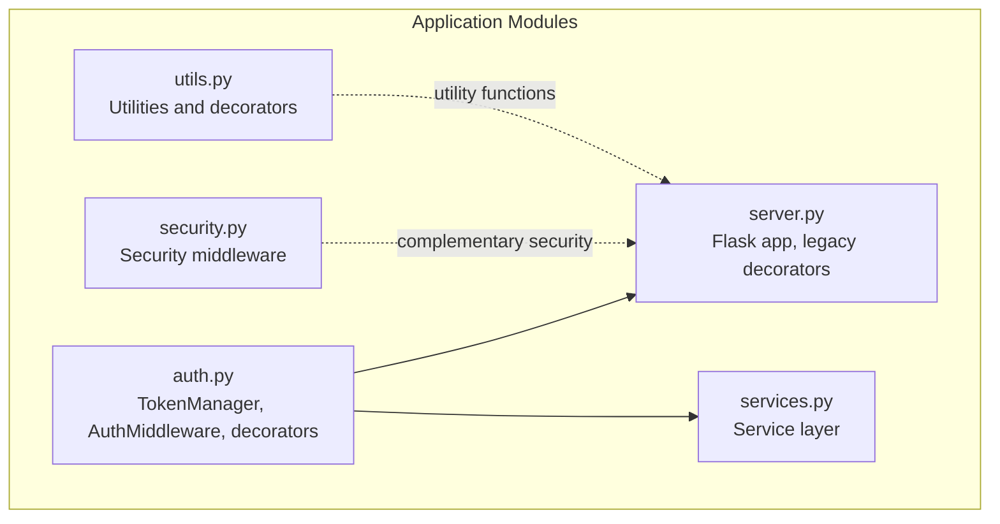
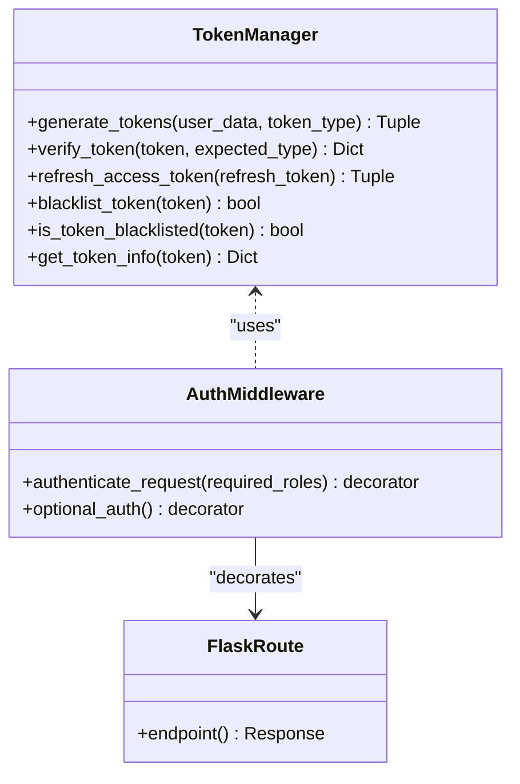
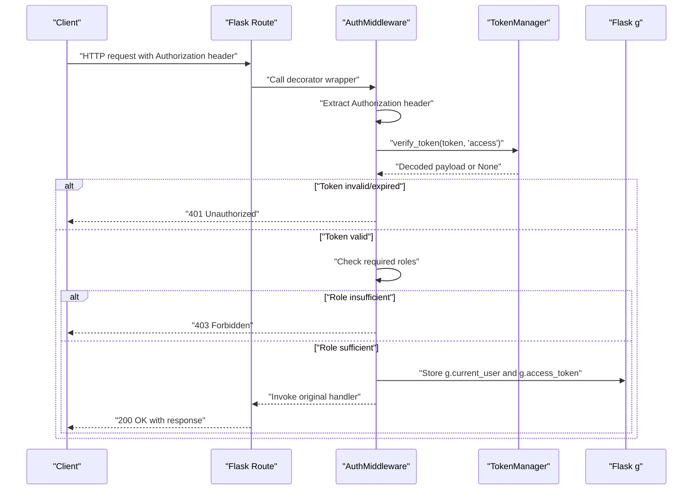
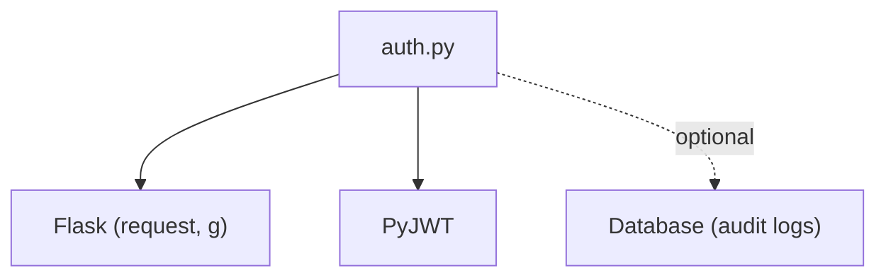

# Authentication Middleware

<cite>
**Referenced Files in This Document**
- [auth.py](file://auth.py)
- [server.py](file://server.py)
- [security.py](file://security.py)
- [utils.py](file://utils.py)
- [services.py](file://services.py)
</cite>

## Table of Contents
1. [Introduction](#introduction)
2. [Project Structure](#project-structure)
3. [Core Components](#core-components)
4. [Architecture Overview](#architecture-overview)
5. [Detailed Component Analysis](#detailed-component-analysis)
6. [Dependency Analysis](#dependency-analysis)
7. [Performance Considerations](#performance-considerations)
8. [Troubleshooting Guide](#troubleshooting-guide)
9. [Conclusion](#conclusion)

## Introduction
This document provides comprehensive documentation for the authentication middleware system implemented in the project. It focuses on the AuthMiddleware class and its Flask route decorators, covering the complete authentication flow from Authorization header extraction through token verification to role-based access control. The documentation also explains the decorator pattern implementation for securing API endpoints, demonstrates practical examples of applying authentication decorators with various role requirements, documents request context integration for storing current user information and access tokens, and addresses error handling for missing tokens, invalid tokens, and insufficient permissions. Both mandatory and optional authentication scenarios are covered.

## Project Structure
The authentication system spans several modules:
- auth.py: Implements TokenManager and AuthMiddleware with Flask route decorators for mandatory and optional authentication.
- server.py: Contains legacy authentication decorators that override the auth.py implementation in this repository snapshot; however, the auth.py implementation remains the authoritative source for the documented system.
- security.py: Provides security middleware and related utilities; not directly used by the AuthMiddleware but relevant for overall system security.
- utils.py: Offers utility functions and decorators used across the application.
- services.py: Demonstrates usage of request context variables (g.current_user) for audit logging and service operations.

**Diagram sources**
- [auth.py](file://auth.py#L14-L376)
- [server.py](file://server.py#L1-L200)
- [security.py](file://security.py#L476-L578)
- [utils.py](file://utils.py#L1-L405)
- [services.py](file://services.py#L12-L43)

**Section sources**
- [auth.py](file://auth.py#L14-L376)
- [server.py](file://server.py#L1-L200)

## Core Components
This section introduces the primary building blocks of the authentication middleware system.

- TokenManager: Manages JWT tokens with refresh capability, including generation, verification, refresh, blacklisting, and token introspection.
- AuthMiddleware: Provides Flask route decorators for enforcing authentication and authorization, integrating with TokenManager for token validation and role checks.
- Convenience decorators: Global helpers to apply authentication and optional authentication to routes.

Key responsibilities:
- Token generation and refresh with configurable expiry windows.
- Token verification with type and expiration checks.
- Role-based access control enforcement.
- Request context integration for current user and access token storage.
- Optional authentication that sets user context without requiring authentication.

**Section sources**
- [auth.py](file://auth.py#L14-L190)
- [auth.py](file://auth.py#L216-L290)
- [auth.py](file://auth.py#L295-L337)

## Architecture Overview
The authentication middleware follows a layered architecture:
- TokenManager handles cryptographic operations and token lifecycle management.
- AuthMiddleware encapsulates Flask-specific logic for extracting Authorization headers, validating tokens, enforcing roles, and storing context.
- Flask route decorators wrap endpoints to enforce authentication policies.
- Request context (g) stores the verified user payload and access token for downstream use.

**Diagram sources**
- [auth.py](file://auth.py#L14-L190)
- [auth.py](file://auth.py#L216-L290)

## Detailed Component Analysis

### TokenManager
TokenManager centralizes JWT operations:
- Generates access and refresh tokens with unique identifiers and expirations.
- Verifies tokens by decoding, checking type, and ensuring non-expiration.
- Supports refresh token flow to issue new access tokens.
- Maintains a blacklist for revoked tokens and provides token introspection utilities.

Implementation highlights:
- Uses HS256 algorithm for signing.
- Stores token metadata (type, exp, iat, jti) in payloads.
- Provides convenience methods for token structure validation and expiration extraction.

**Section sources**
- [auth.py](file://auth.py#L14-L190)
- [auth.py](file://auth.py#L338-L370)

### AuthMiddleware
AuthMiddleware provides two primary decorators:
- authenticate_request(required_roles): Enforces mandatory authentication and optional role checks.
- optional_auth(): Optionally sets user context if a valid token is present.

Decorator behavior:
- Extracts Authorization header and validates Bearer token presence.
- Delegates token verification to TokenManager.
- Enforces role checks against the token payload.
- Stores g.current_user and g.access_token for downstream use.

Request context integration:
- g.current_user holds the decoded token payload (user identity and claims).
- g.access_token holds the original access token string.

**Section sources**
- [auth.py](file://auth.py#L216-L290)

### Decorator Pattern Implementation
The AuthMiddleware leverages Python’s decorator pattern to wrap Flask routes:
- The decorator function returns a wrapper that performs authentication checks before invoking the original route handler.
- The wrapper preserves function metadata via @wraps.
- On success, the original function is executed; on failure, appropriate HTTP responses are returned.

Practical examples of applying decorators:
- Mandatory authentication for administrative endpoints.
- Role-specific access control for sensitive operations.
- Optional authentication for public endpoints that benefit from user context.

Note: In the provided server.py snapshot, legacy decorators override the auth.py implementation. The documented examples below reflect the auth.py behavior.

**Section sources**
- [auth.py](file://auth.py#L222-L267)
- [auth.py](file://auth.py#L269-L289)

### Authentication Flow
The end-to-end authentication flow is as follows:

**Diagram sources**
- [auth.py](file://auth.py#L231-L264)
- [auth.py](file://auth.py#L70-L104)

### Error Handling
The AuthMiddleware handles three primary error categories:
- Missing or invalid Authorization header: Returns 401 Unauthorized with multilingual error messages.
- Invalid or expired token: Returns 401 Unauthorized with multilingual error messages.
- Insufficient permissions: Returns 403 Forbidden with multilingual error messages.

These responses are structured consistently with success and error fields, including Arabic translations.

**Section sources**
- [auth.py](file://auth.py#L234-L258)

### Practical Examples
Below are examples of applying authentication decorators to routes with various role requirements. These examples reflect the AuthMiddleware behavior as implemented in auth.py.

- Mandatory authentication for any authenticated user:
  - Apply the decorator without specifying roles.
  - Ensures a valid, non-expired access token is present.

- Role-specific access control:
  - Pass a list of allowed roles to the decorator.
  - Enforces that the token’s role is included in the allowed list.

- Optional authentication:
  - Apply the optional_auth decorator.
  - Sets user context if a valid token is present; otherwise, proceeds without authentication.

Note: In the provided server.py snapshot, legacy decorators override the auth.py implementation. The examples here illustrate the intended behavior of the AuthMiddleware.

**Section sources**
- [auth.py](file://auth.py#L222-L267)
- [auth.py](file://auth.py#L269-L289)

### Request Context Integration
The AuthMiddleware integrates with Flask’s request context to share user information:
- g.current_user: Decoded token payload containing user identity and claims.
- g.access_token: Original access token string for downstream use.

Services and audit logging can leverage g.current_user for tracking actions and maintaining audit trails.

**Section sources**
- [auth.py](file://auth.py#L260-L262)
- [services.py](file://services.py#L88-L95)

## Dependency Analysis
The authentication middleware depends on:
- Flask request/response and g context for route decoration and context storage.
- PyJWT for token encoding/decoding and validation.
- Optional external systems for token blacklisting and audit logging.

**Diagram sources**
- [auth.py](file://auth.py#L10-L12)
- [auth.py](file://auth.py#L81-L104)
- [services.py](file://services.py#L88-L95)

**Section sources**
- [auth.py](file://auth.py#L10-L12)
- [auth.py](file://auth.py#L81-L104)
- [services.py](file://services.py#L88-L95)

## Performance Considerations
- Token verification involves cryptographic operations; caching verified tokens or using efficient token storage can reduce overhead.
- Blacklist checks should be optimized; in production, use persistent storage with TTL to avoid memory growth.
- Minimize unnecessary role checks by grouping endpoints appropriately and leveraging optional authentication where applicable.
- Consider token reuse patterns and refresh token rotation to balance security and performance.

## Troubleshooting Guide
Common issues and resolutions:
- Missing Authorization header: Ensure clients send a Bearer token prefixed with "Bearer ".
- Invalid or expired token: Regenerate tokens using the refresh flow or re-authenticate the user.
- Insufficient permissions: Verify the user’s role claim matches the required roles list.
- Token structure validation: Use the provided utility to validate JWT structure before attempting verification.

**Section sources**
- [auth.py](file://auth.py#L234-L258)
- [auth.py](file://auth.py#L338-L354)
- [auth.py](file://auth.py#L355-L369)

## Conclusion
The authentication middleware system provides a robust, extensible foundation for securing Flask endpoints. By combining TokenManager for token lifecycle management and AuthMiddleware for route-level enforcement, the system supports both mandatory and optional authentication, integrates seamlessly with Flask’s request context, and offers clear error handling. While the provided server.py snapshot includes legacy decorators, the documented AuthMiddleware implementation in auth.py serves as the authoritative reference for the middleware’s capabilities and usage patterns.