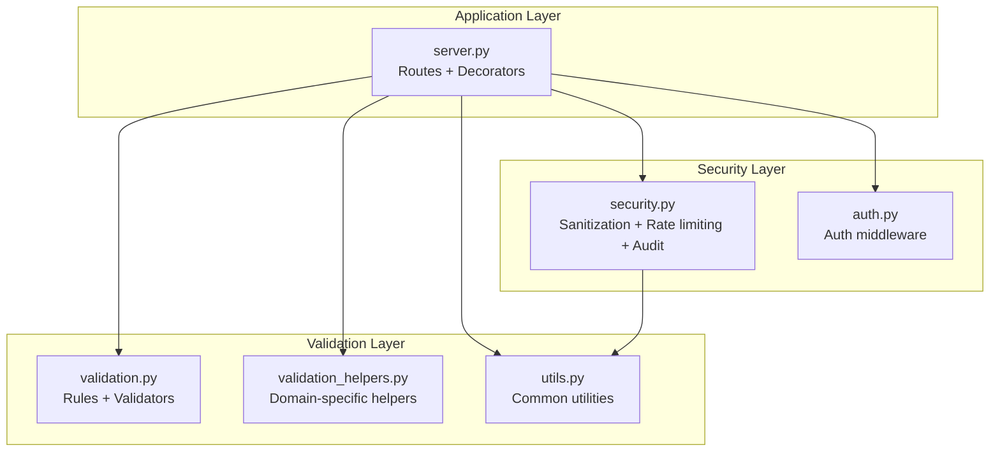
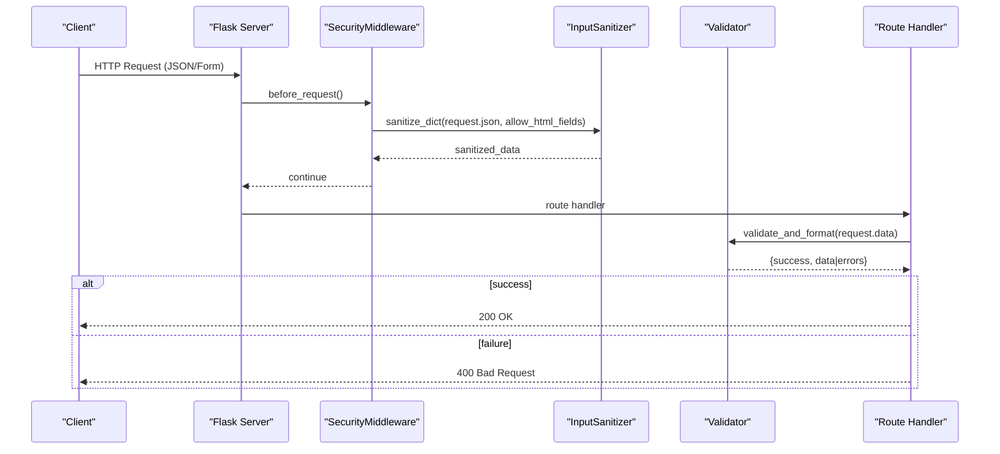
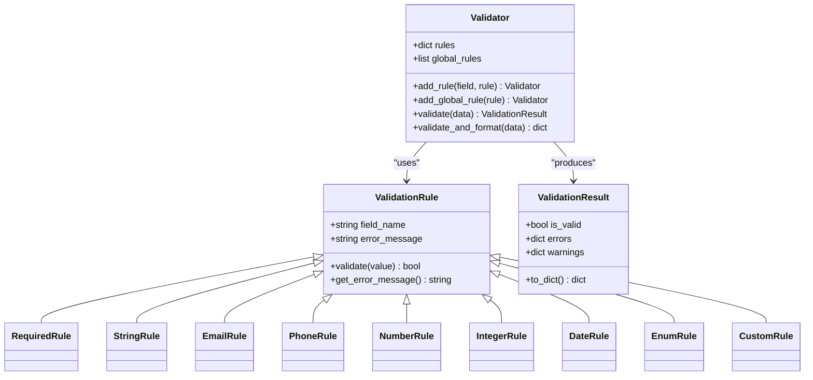
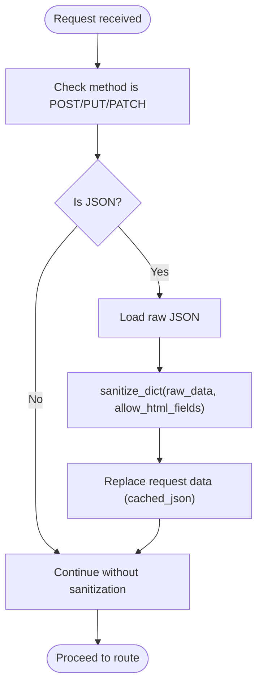
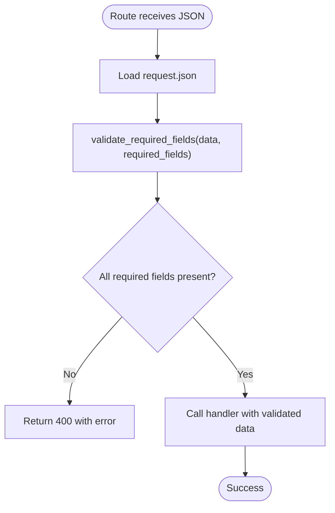
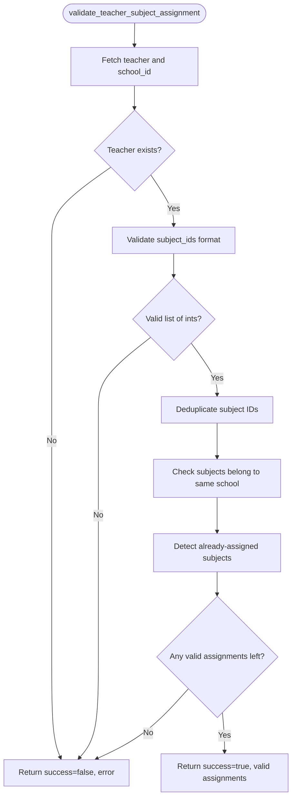
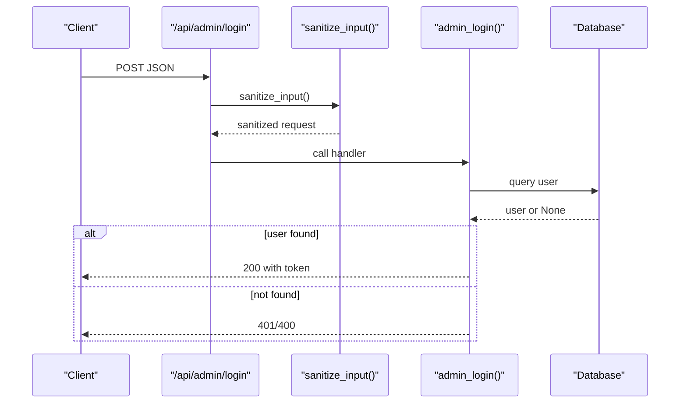
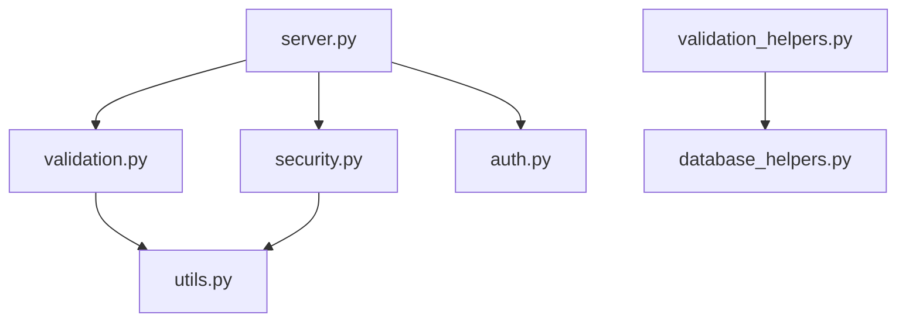

# Input Validation and Sanitization

<cite>
**Referenced Files in This Document**
- [validation.py](file://validation.py)
- [validation_helpers.py](file://validation_helpers.py)
- [security.py](file://security.py)
- [utils.py](file://utils.py)
- [auth.py](file://auth.py)
- [server.py](file://server.py)
</cite>

## Table of Contents
1. [Introduction](#introduction)
2. [Project Structure](#project-structure)
3. [Core Components](#core-components)
4. [Architecture Overview](#architecture-overview)
5. [Detailed Component Analysis](#detailed-component-analysis)
6. [Dependency Analysis](#dependency-analysis)
7. [Performance Considerations](#performance-considerations)
8. [Troubleshooting Guide](#troubleshooting-guide)
9. [Conclusion](#conclusion)
10. [Appendices](#appendices)

## Introduction
This document explains the input validation and sanitization systems used in the EduFlow platform. It covers:
- Validation helpers and rule-based validators
- HTML sanitization via Bleach integration
- Patterns for validating strings, numbers, emails, phones, dates, enums, and custom rules
- XSS prevention and data injection mitigation
- Practical examples of validation decorators and helper functions
- Integration with form processing and API request validation
- Common scenarios for user registration, login, and data entry
- Custom validation rules and error handling patterns
- Relationship between validation and security middleware

## Project Structure
The validation and sanitization logic spans several modules:
- validation.py: Rule-based validation framework and prebuilt validators
- validation_helpers.py: Domain-specific validation helpers for teacher-subject assignment
- security.py: Input sanitization with Bleach, rate limiting, audit logging, and security middleware
- utils.py: General-purpose utilities including validation helpers and response formatting
- auth.py: Authentication and authorization middleware (complements validation/security)
- server.py: Route-level integration of validation, sanitization, and security

**Diagram sources**
- [validation.py](file://validation.py#L1-L376)
- [validation_helpers.py](file://validation_helpers.py#L1-L321)
- [security.py](file://security.py#L1-L617)
- [utils.py](file://utils.py#L1-L405)
- [auth.py](file://auth.py#L1-L376)
- [server.py](file://server.py#L1-L2920)

**Section sources**
- [validation.py](file://validation.py#L1-L376)
- [validation_helpers.py](file://validation_helpers.py#L1-L321)
- [security.py](file://security.py#L1-L617)
- [utils.py](file://utils.py#L1-L405)
- [auth.py](file://auth.py#L1-L376)
- [server.py](file://server.py#L1-L2920)

## Core Components
- ValidationRule and derived rules (Required, String, Email, Phone, Number, Integer, Date, Enum, Custom)
- Validator and ValidationResult for composing and executing validations
- Predefined validators for students, schools, subjects, grades, and users
- Validation decorators for Flask routes
- InputSanitizer with Bleach integration for HTML sanitization
- Rate limiting, audit logging, and security middleware
- Utility functions for required field validation, score range checks, and response formatting

**Section sources**
- [validation.py](file://validation.py#L10-L262)
- [validation.py](file://validation.py#L263-L376)
- [security.py](file://security.py#L78-L176)
- [security.py](file://security.py#L476-L563)
- [utils.py](file://utils.py#L19-L78)
- [utils.py](file://utils.py#L242-L271)
- [utils.py](file://utils.py#L359-L391)

## Architecture Overview
The validation and sanitization pipeline integrates at multiple layers:
- Route-level: decorators enforce request validation and sanitization
- Middleware: security middleware applies rate limiting and sanitizes inputs
- Utilities: shared helpers validate and sanitize data consistently
- Domain helpers: specialized validators ensure business rules (e.g., teacher-subject assignment)

**Diagram sources**
- [security.py](file://security.py#L495-L535)
- [security.py](file://security.py#L585-L610)
- [validation.py](file://validation.py#L241-L262)
- [server.py](file://server.py#L142-L200)

**Section sources**
- [security.py](file://security.py#L476-L563)
- [validation.py](file://validation.py#L332-L376)
- [server.py](file://server.py#L142-L200)

## Detailed Component Analysis

### Validation Framework (validation.py)
- ValidationRule: base class for all rules with field_name and error_message
- Built-in rules:
  - RequiredRule: presence checks
  - StringRule: length constraints
  - EmailRule: regex-based email validation
  - PhoneRule: numeric phone validation with whitespace normalization
  - NumberRule and IntegerRule: numeric parsing and bounds checking
  - DateRule: date parsing with configurable format
  - EnumRule: whitelist validation
  - CustomRule: pluggable validation functions
- Validator: composes rules per field and global rules, produces ValidationResult
- Predefined validators:
  - create_student_validator, create_school_validator, create_subject_validator, create_grade_validator, create_user_validator
- Flask decorator:
  - validate_request(validator): extracts JSON/form, validates, attaches validated_data to request

**Diagram sources**
- [validation.py](file://validation.py#L10-L262)
- [validation.py](file://validation.py#L203-L262)

**Section sources**
- [validation.py](file://validation.py#L10-L262)
- [validation.py](file://validation.py#L203-L262)
- [validation.py](file://validation.py#L263-L376)

### Input Sanitization and Security (security.py)
- InputSanitizer:
  - sanitize_string(value, allow_html): strips or cleans HTML using Bleach
  - sanitize_dict(data, allow_html_fields): recursively sanitizes nested dicts and lists
  - validate_email/validate_phone: basic checks
- SecurityMiddleware:
  - before_request: rate limiting and input sanitization
  - after_request and teardown_app: audit log flushing
  - rate_limit_exempt decorator and get_rate_limit_headers
- sanitize_input decorator: route-level sanitization convenience
- RateLimiter: sliding-window request counting with configurable limits
- AuditLogger: structured audit trails with database persistence and batching

**Diagram sources**
- [security.py](file://security.py#L519-L535)
- [security.py](file://security.py#L585-L610)

**Section sources**
- [security.py](file://security.py#L78-L176)
- [security.py](file://security.py#L476-L563)
- [security.py](file://security.py#L585-L610)

### Utility Functions and Helpers (utils.py)
- ValidationError: custom exception for validation errors
- EduFlowUtils:
  - validate_required_fields: raises ValidationError for missing/empty fields
  - validate_blood_type, validate_educational_level, validate_grade_format
  - is_elementary_grades_1_to_4, validate_score_range
  - sanitize_input: basic XSS-prevention regex-based sanitizer
  - format_response: standardized API responses with Arabic translations
  - log_error, validate_json_data
- validate_input decorator: route-level required-field validation

**Diagram sources**
- [utils.py](file://utils.py#L359-L391)

**Section sources**
- [utils.py](file://utils.py#L19-L78)
- [utils.py](file://utils.py#L242-L271)
- [utils.py](file://utils.py#L359-L391)

### Domain-Specific Validation Helpers (validation_helpers.py)
- validate_teacher_subject_assignment: comprehensive validation for teacher-subject assignment including existence checks, format validation, duplicates, cross-school validation, and existing assignment detection
- validate_subject_removal: checks teacher existence and whether subject is assigned
- validate_subject_data: validates subject creation/update fields with length and type checks
- get_assignment_summary: aggregates teacher’s subject assignments by grade level

**Diagram sources**
- [validation_helpers.py](file://validation_helpers.py#L12-L136)

**Section sources**
- [validation_helpers.py](file://validation_helpers.py#L12-L136)
- [validation_helpers.py](file://validation_helpers.py#L148-L191)
- [validation_helpers.py](file://validation_helpers.py#L192-L273)
- [validation_helpers.py](file://validation_helpers.py#L275-L314)

### Integration with Forms and API Requests (server.py)
- Route decorators:
  - sanitize_input(): applies InputSanitizer to request JSON
  - validate_request(validator): applies Validator.validate_and_format to request data
- Example integrations:
  - Admin login route demonstrates sanitize_input and manual validation
  - Student/subject routes show mixed usage of decorators and inline validation
- Authentication and authorization:
  - authenticate and roles_required decorators (currently modified to allow all access)
  - AuthMiddleware handles JWT verification and role checks

**Diagram sources**
- [server.py](file://server.py#L142-L200)
- [security.py](file://security.py#L585-L610)

**Section sources**
- [server.py](file://server.py#L142-L200)
- [server.py](file://server.py#L470-L560)
- [server.py](file://server.py#L787-L817)
- [auth.py](file://auth.py#L216-L290)

## Dependency Analysis
Key relationships:
- validation.py depends on utils.py for ValidationError and EduFlowUtils
- security.py depends on utils.py for response formatting and logging
- server.py integrates validation.py, security.py, and auth.py
- validation_helpers.py depends on database_helpers for domain-specific checks

**Diagram sources**
- [validation.py](file://validation.py#L8-L8)
- [security.py](file://security.py#L10-L10)
- [server.py](file://server.py#L11-L16)
- [validation_helpers.py](file://validation_helpers.py#L10-L10)

**Section sources**
- [validation.py](file://validation.py#L8-L8)
- [security.py](file://security.py#L10-L10)
- [server.py](file://server.py#L11-L16)
- [validation_helpers.py](file://validation_helpers.py#L10-L10)

## Performance Considerations
- Validation and sanitization occur in middleware and decorators; keep rules minimal and targeted
- sanitize_dict recurses through nested structures; avoid excessive nesting in payloads
- Rate limiter uses deques for O(1) window maintenance; tune limits per endpoint category
- Audit logging batches writes to reduce DB overhead; ensure batch size aligns with throughput

[No sources needed since this section provides general guidance]

## Troubleshooting Guide
Common issues and resolutions:
- Validation fails with 400:
  - Inspect ValidationResult.errors returned by validate_and_format
  - Ensure required fields are present and formatted correctly
- Sanitization strips HTML unexpectedly:
  - Use sanitize_input decorator with allow_html_fields parameter
  - Review InputSanitizer.ALLOWED_TAGS and ALLOWED_ATTRIBUTES
- Rate limit exceeded:
  - Check X-RateLimit-* headers for remaining quota
  - Use rate_limit_exempt decorator for trusted endpoints
- Authentication bypass:
  - Current decorators allow all access; revert to strict roles_required and authenticate decorators
- Audit logs not persisted:
  - Ensure DB pool is configured and flush_logs is called

**Section sources**
- [validation.py](file://validation.py#L241-L262)
- [security.py](file://security.py#L519-L535)
- [security.py](file://security.py#L552-L562)
- [server.py](file://server.py#L91-L108)

## Conclusion
The EduFlow platform implements a layered validation and sanitization strategy:
- Rule-based validators ensure data integrity and business rules
- Bleach-based sanitization protects against XSS and malicious content
- Middleware and decorators enforce security policies consistently
- Utility functions standardize error handling and response formatting
Adopting these patterns improves security posture and reduces data injection risks across forms and APIs.

[No sources needed since this section summarizes without analyzing specific files]

## Appendices

### Practical Examples

- Validation decorators and helpers
  - Route-level validation: [validate_request](file://validation.py#L332-L376)
  - Required field validation: [validate_input](file://utils.py#L359-L391)
  - Domain-specific validation: [validate_teacher_subject_assignment](file://validation_helpers.py#L12-L136)

- Sanitization patterns
  - Route-level sanitization: [sanitize_input](file://security.py#L585-L610)
  - Middleware sanitization: [SecurityMiddleware.security_middleware](file://security.py#L495-L535)
  - HTML sanitization with Bleach: [InputSanitizer.sanitize_string](file://security.py#L92-L121)

- Common validation scenarios
  - User registration: combine create_user_validator with sanitize_input
  - Login forms: sanitize_input on login routes plus auth middleware
  - Data entry: use domain-specific helpers like validate_subject_data

- Custom validation rules
  - Extend ValidationRule or use CustomRule for domain-specific checks
  - Example: [CustomRule](file://validation.py#L163-L173)

- Error handling patterns
  - Standardized responses: [format_response](file://utils.py#L273-L312)
  - Validation exceptions: [ValidationError](file://utils.py#L19-L26)

**Section sources**
- [validation.py](file://validation.py#L332-L376)
- [utils.py](file://utils.py#L359-L391)
- [validation_helpers.py](file://validation_helpers.py#L12-L136)
- [security.py](file://security.py#L585-L610)
- [security.py](file://security.py#L495-L535)
- [validation.py](file://validation.py#L163-L173)
- [utils.py](file://utils.py#L273-L312)