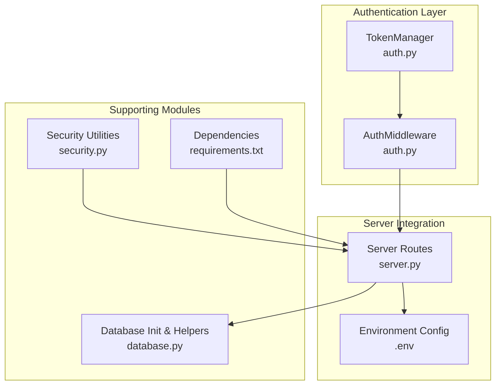
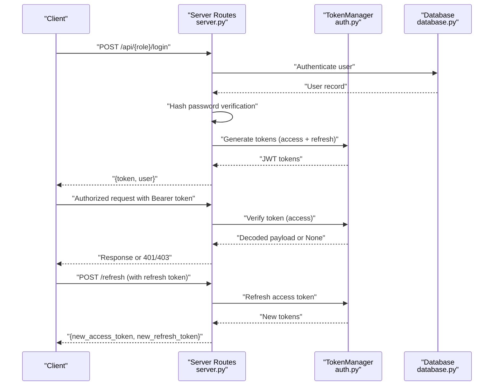
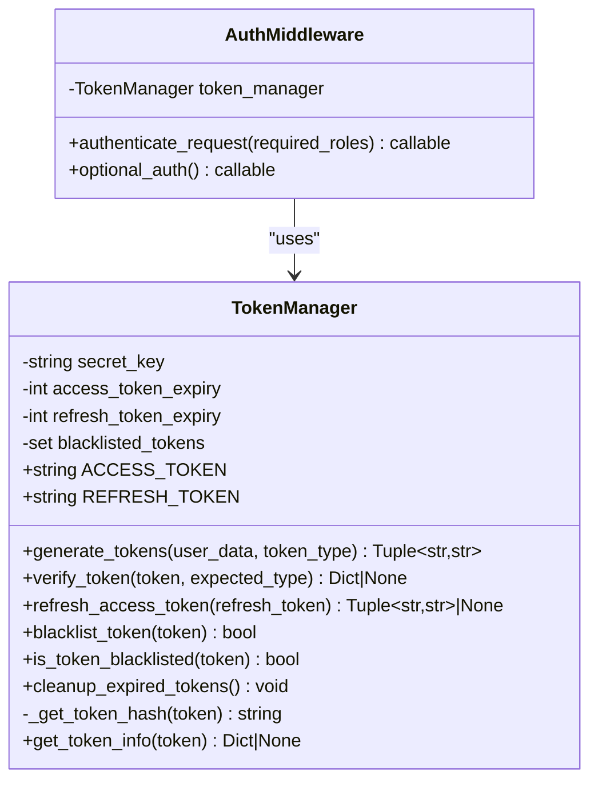
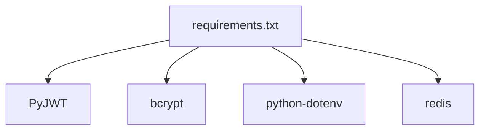

# JWT Token Management

<cite>
**Referenced Files in This Document**
- [auth.py](file://auth.py)
- [server.py](file://server.py)
- [security.py](file://security.py)
- [database.py](file://database.py)
- [DEPLOYMENT_GUIDE.md](file://DEPLOYMENT_GUIDE.md)
- [DATABASE_SETUP.md](file://DATABASE_SETUP.md)
- [requirements.txt](file://requirements.txt)
</cite>

## Table of Contents
1. [Introduction](#introduction)
2. [Project Structure](#project-structure)
3. [Core Components](#core-components)
4. [Architecture Overview](#architecture-overview)
5. [Detailed Component Analysis](#detailed-component-analysis)
6. [Dependency Analysis](#dependency-analysis)
7. [Performance Considerations](#performance-considerations)
8. [Troubleshooting Guide](#troubleshooting-guide)
9. [Conclusion](#conclusion)

## Introduction
This document provides comprehensive documentation for the JWT token management system in EduFlow. It focuses on the TokenManager class implementation, covering access token and refresh token generation using the HS256 algorithm, token payload structure, lifecycle management, and the token blacklist mechanism for logout and revocation. Practical examples illustrate token creation, validation, renewal, and proper usage patterns with error handling.

## Project Structure
The JWT token management system is primarily implemented in the authentication module and integrated with the server’s authentication routes. Supporting security utilities and database initialization are included for context.

**Diagram sources**
- [auth.py](file://auth.py#L14-L376)
- [server.py](file://server.py#L1-L200)
- [security.py](file://security.py#L1-L617)
- [database.py](file://database.py#L1-L726)
- [requirements.txt](file://requirements.txt#L1-L14)

**Section sources**
- [auth.py](file://auth.py#L1-L376)
- [server.py](file://server.py#L1-L200)
- [security.py](file://security.py#L1-L617)
- [database.py](file://database.py#L1-L726)
- [requirements.txt](file://requirements.txt#L1-L14)

## Core Components
- TokenManager: Central class responsible for generating, verifying, refreshing, and blacklisting JWT tokens. Implements HS256 signing and includes token type, expiration, issuance, and unique token ID (JTI) fields.
- AuthMiddleware: Flask route decorators that enforce authentication and optional authentication using access tokens verified by TokenManager.
- Server Integration: Authentication endpoints that produce JWT tokens for different roles (admin, school, student) using HS256 and environment-provided secrets.
- Security Utilities: Provide rate limiting, input sanitization, audit logging, and 2FA capabilities that complement token-based authentication.

Key responsibilities:
- Generate access and refresh tokens with HS256 algorithm
- Verify token signatures, types, and expiration
- Support token refresh using refresh tokens
- Blacklist tokens for logout and revocation
- Provide convenience decorators for Flask routes

**Section sources**
- [auth.py](file://auth.py#L14-L376)
- [server.py](file://server.py#L142-L304)
- [security.py](file://security.py#L476-L617)

## Architecture Overview
The JWT token lifecycle spans generation, verification, refresh, and blacklisting. The server produces tokens upon successful authentication, TokenManager validates incoming access tokens, refresh tokens enable seamless session continuation, and blacklisting ensures immediate logout and revocation.

**Diagram sources**
- [server.py](file://server.py#L142-L304)
- [auth.py](file://auth.py#L36-L128)
- [database.py](file://database.py#L120-L338)

## Detailed Component Analysis

### TokenManager Class
TokenManager encapsulates all JWT operations:
- Initialization with secret key, access/refresh expiry windows, and an in-memory blacklist set
- Token generation with HS256, including type, exp, iat, and JTI fields
- Token verification with blacklist checks, type validation, and expiration enforcement
- Refresh flow linking refresh tokens to access tokens via access_jti
- Blacklist management with SHA-256 hashing of tokens
- Utility methods for token info extraction and expiration inspection

**Diagram sources**
- [auth.py](file://auth.py#L14-L376)

**Section sources**
- [auth.py](file://auth.py#L14-L376)

### Token Payload Structure
Access tokens include:
- User data (role-specific fields)
- type: "access"
- exp: UTC expiration timestamp
- iat: UTC issuance timestamp
- jti: unique token ID

Refresh tokens include:
- user_id or id
- type: "refresh"
- exp, iat, jti
- access_jti: links to the original access token’s JTI

Both tokens are signed with HS256 using the shared secret key.

Practical examples (paths only):
- Access token generation: [generate_tokens](file://auth.py#L36-L68)
- Refresh token generation: [generate_tokens](file://auth.py#L57-L66)
- Token verification: [verify_token](file://auth.py#L70-L103)
- Token refresh: [refresh_access_token](file://auth.py#L105-L128)

**Section sources**
- [auth.py](file://auth.py#L36-L128)

### Token Lifecycle
Generation:
- Server routes encode user data into access and refresh payloads with HS256
- Access token expiry defaults to 24 hours; refresh token expiry defaults to 7 days

Verification:
- AuthMiddleware extracts Bearer tokens from Authorization headers
- TokenManager verifies signature, type, and expiration; checks blacklist

Refresh:
- On refresh request, TokenManager validates refresh token, extracts user data, blacklists the old refresh token, and issues new tokens

Blacklisting:
- Logout or revocation adds token hashes to the blacklist set
- Verification rejects blacklisted tokens immediately

Cleanup:
- Periodic cleanup removes expired tokens from blacklist (conceptual placeholder)

Practical examples (paths only):
- Server login endpoints: [admin_login](file://server.py#L142-L199), [school_login](file://server.py#L201-L256), [student_login](file://server.py#L258-L304)
- AuthMiddleware decorators: [authenticate_request](file://auth.py#L222-L267), [optional_auth](file://auth.py#L269-L289)
- Token refresh flow: [refresh_access_token](file://auth.py#L105-L128)
- Blacklist operations: [blacklist_token](file://auth.py#L130-L146), [is_token_blacklisted](file://auth.py#L148-L159)

**Section sources**
- [server.py](file://server.py#L142-L304)
- [auth.py](file://auth.py#L222-L289)
- [auth.py](file://auth.py#L105-L159)

### Token Blacklist Mechanism
- Token hash: SHA-256 of the serialized token string
- Storage: In-memory set; production-grade deployments should use Redis or a database with TTL
- Enforcement: During verification, if the token hash exists in the blacklist, the token is rejected
- Revocation: On logout or refresh, the old refresh token is blacklisted to prevent reuse

Practical examples (paths only):
- Hash generation: [_get_token_hash](file://auth.py#L179-L189)
- Blacklist addition: [blacklist_token](file://auth.py#L130-L146)
- Blacklist check: [is_token_blacklisted](file://auth.py#L148-L159)
- Verification with blacklist: [verify_token](file://auth.py#L81-L85)

**Section sources**
- [auth.py](file://auth.py#L130-L189)

### Practical Usage Patterns and Error Handling
Common patterns:
- Authentication decorator for protected routes: [authenticate_request](file://auth.py#L222-L267)
- Optional authentication to set user context without requiring authentication: [optional_auth](file://auth.py#L269-L289)
- Token structure validation and expiration inspection utilities: [validate_token_structure](file://auth.py#L339-L354), [get_token_expiration](file://auth.py#L355-L369)

Error handling scenarios:
- Missing or invalid Authorization header: 401 Unauthorized
- Invalid or expired token: 401 Unauthorized
- Insufficient permissions (role mismatch): 403 Forbidden
- Token structure validation failures: early rejection before decoding
- ExpiredSignatureError and InvalidTokenError caught and treated as invalid

Practical examples (paths only):
- AuthMiddleware error responses: [authenticate_request](file://auth.py#L234-L258)
- Token validation utilities: [validate_token_structure](file://auth.py#L339-L354), [get_token_expiration](file://auth.py#L355-L369)

**Section sources**
- [auth.py](file://auth.py#L222-L289)
- [auth.py](file://auth.py#L339-L369)

## Dependency Analysis
External dependencies relevant to JWT:
- PyJWT: Provides HS256 signing and decoding
- bcrypt: Used for password verification in server login routes
- python-dotenv: Loads JWT_SECRET from environment
- redis: Recommended for production token blacklisting and caching

**Diagram sources**
- [requirements.txt](file://requirements.txt#L1-L14)

**Section sources**
- [requirements.txt](file://requirements.txt#L1-L14)

## Performance Considerations
- Token verification overhead: Minimal for HS256; ensure secret key is stored securely and not recalculated per request
- Blacklist set size: In-memory set grows with revoked tokens; consider Redis with TTL for production
- Token refresh frequency: Balance between user experience and server load; adjust access/refresh expiry windows accordingly
- Caching: Use Redis for caching frequently accessed resources to reduce database load and improve response times

[No sources needed since this section provides general guidance]

## Troubleshooting Guide
Common issues and resolutions:
- Missing JWT_SECRET: Ensure environment variable is set; server falls back to a random secret if unset
- Token verification failures: Confirm HS256 algorithm and correct secret key; verify exp and iat fields
- Blacklist not taking effect: Verify token hash computation and storage; ensure blacklist is checked before decoding
- Refresh token invalid: Confirm token type is "refresh", not expired, and not previously blacklisted
- Rate limiting conflicts: Security middleware enforces rate limits; adjust limits or exempt specific endpoints if needed

Practical references (paths only):
- Environment configuration: [JWT_SECRET usage](file://server.py#L24), [Deployment guide](file://DEPLOYMENT_GUIDE.md#L61-L65)
- Token verification exceptions: [verify_token](file://auth.py#L100-L103)
- Security middleware rate limiting: [security_middleware](file://security.py#L495-L517)

**Section sources**
- [server.py](file://server.py#L24)
- [DEPLOYMENT_GUIDE.md](file://DEPLOYMENT_GUIDE.md#L61-L65)
- [auth.py](file://auth.py#L100-L103)
- [security.py](file://security.py#L495-L517)

## Conclusion
The EduFlow JWT token management system provides robust authentication and session handling using HS256-signed tokens. TokenManager centralizes token operations, while AuthMiddleware integrates seamlessly with Flask routes. The refresh token mechanism enhances user experience, and the blacklist mechanism supports immediate logout and revocation. For production, deploy Redis for scalable token blacklisting and secure JWT_SECRET management.