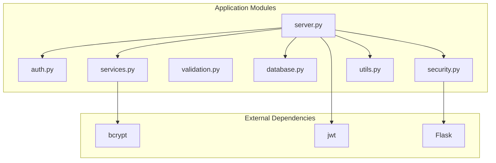
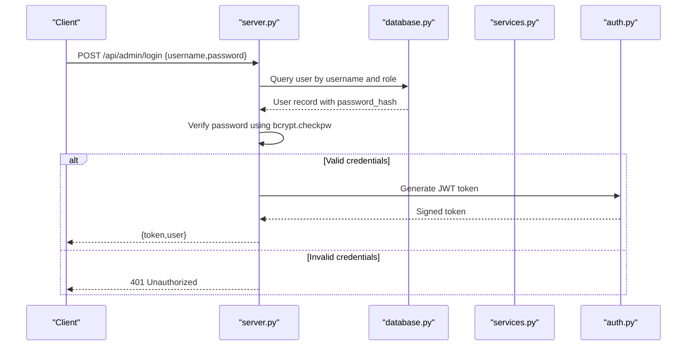
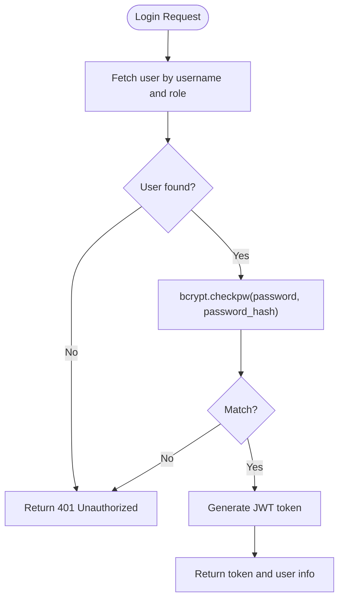
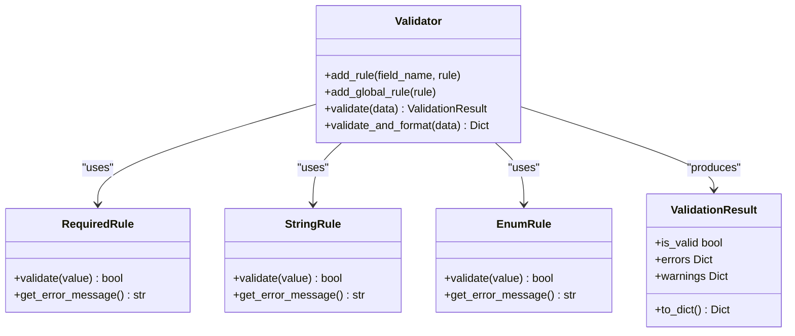
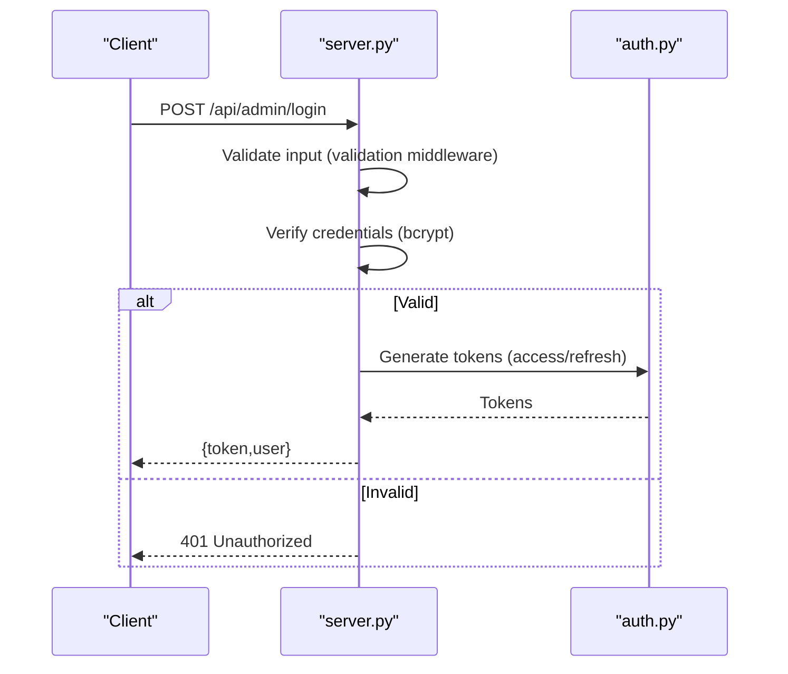
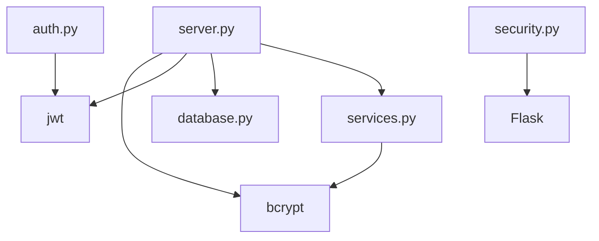

# Password Security

<cite>
**Referenced Files in This Document**
- [server.py](file://server.py)
- [auth.py](file://auth.py)
- [security.py](file://security.py)
- [validation.py](file://validation.py)
- [database.py](file://database.py)
- [services.py](file://services.py)
- [utils.py](file://utils.py)
</cite>

## Table of Contents
1. [Introduction](#introduction)
2. [Project Structure](#project-structure)
3. [Core Components](#core-components)
4. [Architecture Overview](#architecture-overview)
5. [Detailed Component Analysis](#detailed-component-analysis)
6. [Dependency Analysis](#dependency-analysis)
7. [Performance Considerations](#performance-considerations)
8. [Troubleshooting Guide](#troubleshooting-guide)
9. [Conclusion](#conclusion)

## Introduction
This document provides comprehensive guidance on password security implementation within the application. It explains how bcrypt is integrated for secure password hashing and verification, documents password strength requirements and validation patterns, details the authentication workflow, and outlines security measures around session management. The focus is on practical, code-backed understanding of how passwords are handled across the application lifecycle, from registration to authentication and session token management.

## Project Structure
The password security implementation spans several modules:
- server.py: Contains authentication endpoints and integrates bcrypt for password verification.
- auth.py: Provides JWT token management and middleware for authentication and authorization.
- security.py: Implements rate limiting, input sanitization, audit logging, and security middleware.
- validation.py: Defines validation rules and validators, including user validation with password constraints.
- database.py: Manages database initialization and stores password hashes in the users table.
- services.py: Provides service-layer verification using bcrypt for password comparison.
- utils.py: Offers utility functions and helpers used across the system.

**Diagram sources**
- [server.py](file://server.py#L1-L200)
- [auth.py](file://auth.py#L1-L200)
- [security.py](file://security.py#L1-L200)
- [validation.py](file://validation.py#L1-L200)
- [database.py](file://database.py#L1-L200)
- [services.py](file://services.py#L860-L913)
- [utils.py](file://utils.py#L1-L200)

**Section sources**
- [server.py](file://server.py#L1-L200)
- [auth.py](file://auth.py#L1-L200)
- [security.py](file://security.py#L1-L200)
- [validation.py](file://validation.py#L1-L200)
- [database.py](file://database.py#L1-L200)
- [services.py](file://services.py#L860-L913)
- [utils.py](file://utils.py#L1-L200)

## Core Components
- Bcrypt integration for password hashing and verification:
  - Hashing during user creation and default admin setup.
  - Verification during authentication via bcrypt.checkpw.
- JWT-based session management:
  - Token generation, verification, refresh, and blacklist mechanisms.
- Input validation and sanitization:
  - Validation rules enforce minimum password length and other constraints.
  - Security middleware sanitizes inputs and enforces rate limits.
- Service-layer verification:
  - Centralized bcrypt verification in services for consistent behavior.

Key implementation references:
- Bcrypt hashing and verification: [server.py](file://server.py#L182-L186), [database.py](file://database.py#L324-L327)
- JWT token management: [auth.py](file://auth.py#L14-L190)
- Validation rules for password length: [validation.py](file://validation.py#L320-L331)
- Service-layer password verification: [services.py](file://services.py#L891-L897)

**Section sources**
- [server.py](file://server.py#L180-L200)
- [database.py](file://database.py#L320-L330)
- [auth.py](file://auth.py#L14-L190)
- [validation.py](file://validation.py#L320-L331)
- [services.py](file://services.py#L891-L897)

## Architecture Overview
The password security architecture integrates bcrypt hashing, validation, and JWT-based session management:

**Diagram sources**
- [server.py](file://server.py#L142-L200)
- [database.py](file://database.py#L138-L146)
- [services.py](file://services.py#L864-L875)
- [auth.py](file://auth.py#L36-L69)

## Detailed Component Analysis

### Bcrypt Integration for Password Hashing and Verification
- Hashing:
  - During default admin creation, bcrypt.hashpw generates a salted hash stored in the database.
  - The hash is persisted as a VARCHAR field in the users table.
- Verification:
  - On login, bcrypt.checkpw compares the provided plaintext password with the stored hash.
  - Verification is performed in both server endpoints and service-layer methods.

**Diagram sources**
- [server.py](file://server.py#L166-L199)
- [database.py](file://database.py#L324-L327)
- [services.py](file://services.py#L891-L897)

**Section sources**
- [server.py](file://server.py#L166-L199)
- [database.py](file://database.py#L324-L327)
- [services.py](file://services.py#L891-L897)

### Password Strength Requirements and Validation Patterns
- Validation rules enforce:
  - Required username and password fields.
  - Minimum and maximum length constraints for password.
  - Role enumeration for user type.
- These rules are defined in the user validator and applied during request processing.

**Diagram sources**
- [validation.py](file://validation.py#L203-L262)
- [validation.py](file://validation.py#L25-L56)
- [validation.py](file://validation.py#L320-L331)

**Section sources**
- [validation.py](file://validation.py#L320-L331)
- [validation.py](file://validation.py#L203-L262)

### Authentication Workflow and Session Management
- Authentication endpoints:
  - Admin login endpoint verifies credentials and issues a JWT token.
  - School and student logins are supported with separate endpoints.
- JWT token management:
  - Token generation includes user identity and role.
  - Token verification validates signature, type, and expiration.
  - Refresh token mechanism and blacklist support are available for advanced scenarios.

**Diagram sources**
- [server.py](file://server.py#L142-L200)
- [auth.py](file://auth.py#L36-L69)

**Section sources**
- [server.py](file://server.py#L142-L200)
- [auth.py](file://auth.py#L14-L190)

### Password Reset Workflow and Security Measures
- Current implementation:
  - The repository does not include a dedicated password reset endpoint or mechanism.
  - No password reset tokens, email delivery, or temporary credential updates are implemented.
- Recommended approach (conceptual):
  - Generate a time-limited, single-use reset token and store it securely.
  - Send a secure link to the user’s registered contact channel.
  - On reset, require the token and enforce new password constraints before updating the hash.
  - Log all reset attempts and monitor for suspicious activity.

[No sources needed since this section describes a conceptual enhancement not present in the codebase]

### Examples of Secure Password Handling Throughout the Application Lifecycle
- Registration:
  - Hash password using bcrypt before storing in the database.
  - Example reference: default admin creation with bcrypt.hashpw.
- Authentication:
  - Compare provided password with stored hash using bcrypt.checkpw.
  - Example reference: server login endpoint and service-layer verification.
- Session Management:
  - Issue JWT tokens upon successful authentication.
  - Example reference: token generation and verification utilities.

**Section sources**
- [database.py](file://database.py#L324-L327)
- [server.py](file://server.py#L182-L186)
- [services.py](file://services.py#L891-L897)
- [auth.py](file://auth.py#L36-L69)

### Relationship Between Password Security and Session Management
- Password security ensures only legitimate users obtain tokens.
- JWT provides stateless session management with expiration and optional refresh.
- Token blacklist enables logout and revocation of compromised sessions.
- Security middleware enforces rate limits and input sanitization to protect authentication endpoints.

**Section sources**
- [auth.py](file://auth.py#L14-L190)
- [security.py](file://security.py#L20-L77)
- [security.py](file://security.py#L476-L563)

## Dependency Analysis
The following diagram highlights key dependencies among modules involved in password security:

**Diagram sources**
- [server.py](file://server.py#L1-L20)
- [auth.py](file://auth.py#L1-L20)
- [security.py](file://security.py#L1-L20)
- [services.py](file://services.py#L891-L897)
- [database.py](file://database.py#L1-L20)

**Section sources**
- [server.py](file://server.py#L1-L20)
- [auth.py](file://auth.py#L1-L20)
- [security.py](file://security.py#L1-L20)
- [services.py](file://services.py#L891-L897)
- [database.py](file://database.py#L1-L20)

## Performance Considerations
- Bcrypt cost factor:
  - The implementation uses bcrypt.gensalt and bcrypt.checkpw. Consider tuning the cost factor for production environments to balance security and performance.
- Token verification overhead:
  - JWT verification is lightweight compared to bcrypt hashing, but frequent token refreshes can increase load.
- Rate limiting:
  - Enforce rate limits on authentication endpoints to mitigate brute-force attempts.

[No sources needed since this section provides general guidance]

## Troubleshooting Guide
Common issues and resolutions:
- Invalid credentials on login:
  - Ensure bcrypt.checkpw receives properly encoded strings and that the stored hash is valid.
  - Reference: [server.py](file://server.py#L182-L186), [services.py](file://services.py#L891-L897)
- Token verification failures:
  - Confirm secret key consistency and token expiration. Use token info utilities to inspect headers and payload.
  - Reference: [auth.py](file://auth.py#L70-L104), [auth.py](file://auth.py#L191-L214)
- Validation errors:
  - Check that password meets minimum length and other constraints enforced by the user validator.
  - Reference: [validation.py](file://validation.py#L320-L331)

**Section sources**
- [server.py](file://server.py#L182-L186)
- [services.py](file://services.py#L891-L897)
- [auth.py](file://auth.py#L70-L104)
- [auth.py](file://auth.py#L191-L214)
- [validation.py](file://validation.py#L320-L331)

## Conclusion
The application implements robust password security through bcrypt-based hashing and verification, complemented by JWT-based session management and comprehensive security middleware. While the current codebase focuses on authentication and token handling, extending it with a secure password reset mechanism would further strengthen user account protection. Adhering to the outlined best practices and leveraging the existing validation and security infrastructure will help maintain a secure and reliable authentication system.