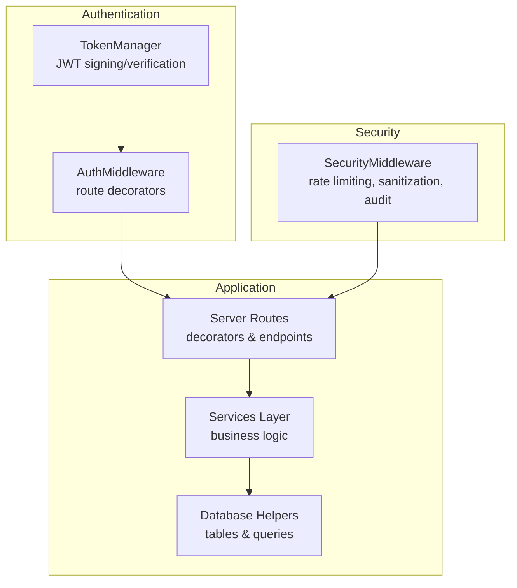
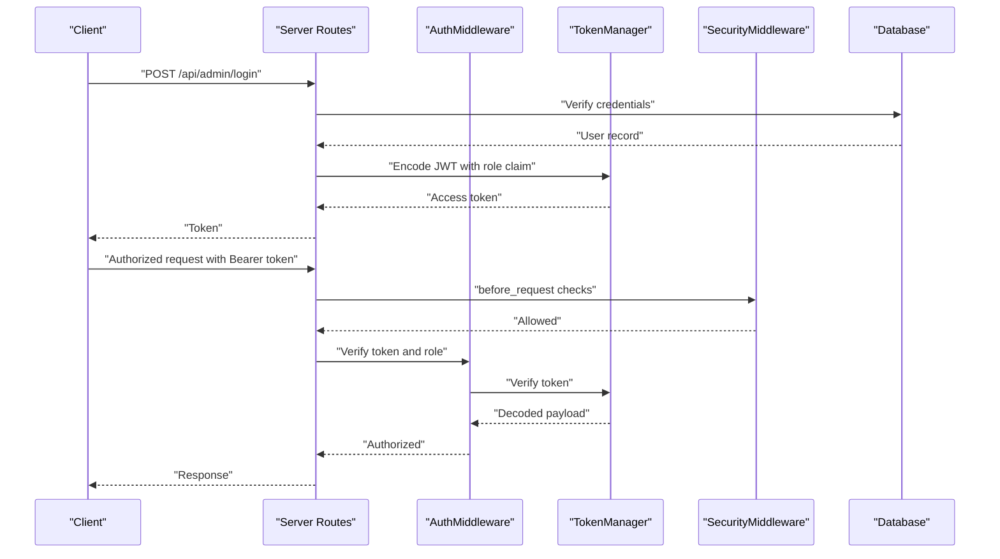
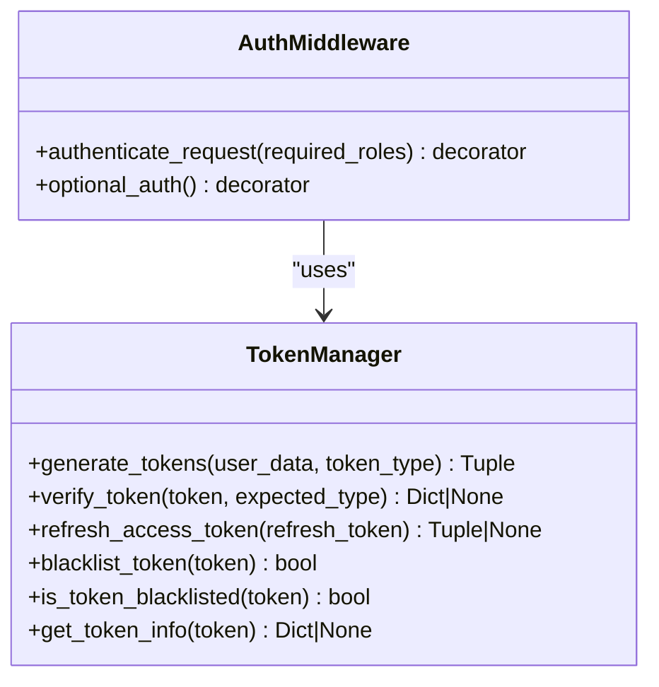
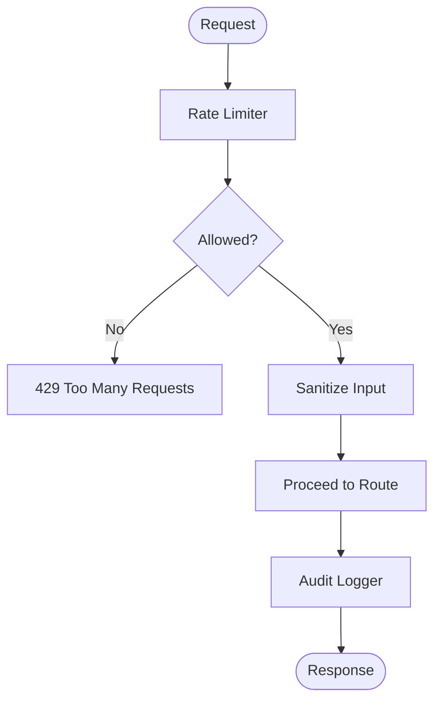
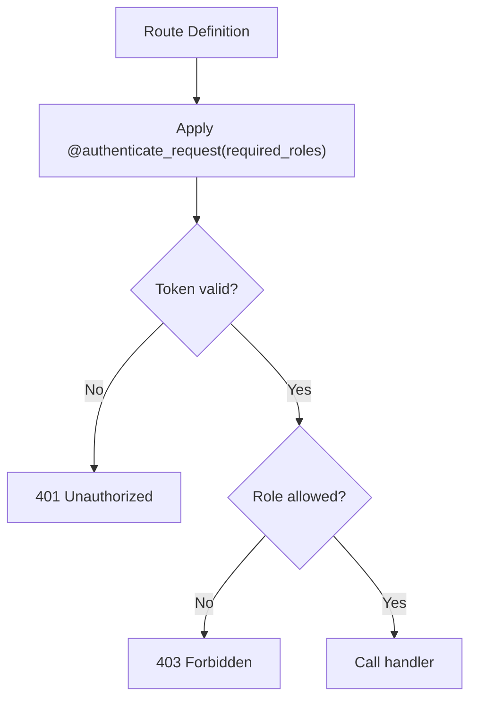
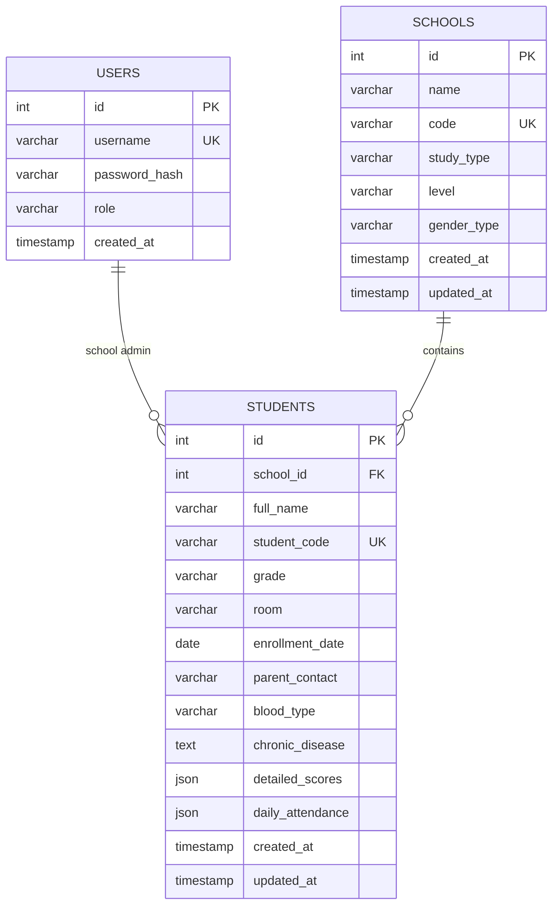
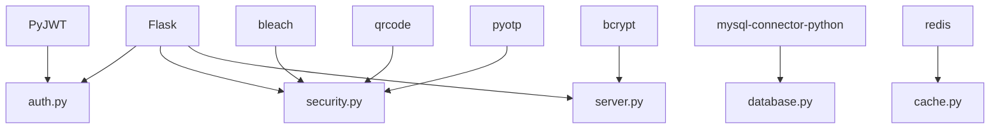

# Role-Based Access Control

<cite>
**Referenced Files in This Document**
- [auth.py](file://auth.py)
- [security.py](file://security.py)
- [server.py](file://server.py)
- [database.py](file://database.py)
- [utils.py](file://utils.py)
- [services.py](file://services.py)
- [README.md](file://README.md)
- [requirements.txt](file://requirements.txt)
</cite>

## Table of Contents
1. [Introduction](#introduction)
2. [Project Structure](#project-structure)
3. [Core Components](#core-components)
4. [Architecture Overview](#architecture-overview)
5. [Detailed Component Analysis](#detailed-component-analysis)
6. [Dependency Analysis](#dependency-analysis)
7. [Performance Considerations](#performance-considerations)
8. [Troubleshooting Guide](#troubleshooting-guide)
9. [Conclusion](#conclusion)
10. [Appendices](#appendices)

## Introduction
This document describes the role-based access control (RBAC) system implemented in the EduFlow Python backend. It explains how authentication tokens carry role claims, how authorization is enforced at the route level, and how the system integrates with the database and services layer. It also documents the multi-role architecture supporting admin, school, teacher, and student roles, along with practical examples of protecting endpoints and enforcing conditional access patterns.

The system currently exposes a robust token infrastructure and middleware for authentication and optional authentication. However, the route decorators that enforce role-based authorization are intentionally disabled in the current server implementation, allowing all roles to access protected endpoints. This document therefore focuses on the intended RBAC design and how to enable it safely.

## Project Structure
The RBAC system spans several modules:
- Authentication and token management: [auth.py](file://auth.py)
- Security middleware (rate limiting, input sanitization, audit logging): [security.py](file://security.py)
- Route definitions and authorization decorators: [server.py](file://server.py)
- Database schema and helpers: [database.py](file://database.py)
- Utility functions and validation helpers: [utils.py](file://utils.py)
- Business logic services: [services.py](file://services.py)
- Project metadata: [README.md](file://README.md), [requirements.txt](file://requirements.txt)

**Diagram sources**
- [auth.py](file://auth.py#L14-L376)
- [security.py](file://security.py#L476-L617)
- [server.py](file://server.py#L1-L200)
- [database.py](file://database.py#L120-L338)
- [services.py](file://services.py#L12-L43)

**Section sources**
- [README.md](file://README.md#L1-L23)
- [requirements.txt](file://requirements.txt#L1-L14)

## Core Components
- TokenManager: Generates and verifies JWT access and refresh tokens, manages token blacklisting, and exposes token introspection utilities.
- AuthMiddleware: Provides decorators to enforce authentication and optional authentication, and to enforce role-based authorization at the route level.
- SecurityMiddleware: Implements rate limiting, input sanitization, and audit logging around requests.
- Server Routes: Define endpoints and apply role-based authorization decorators.
- Services Layer: Encapsulates business logic and interacts with the database.
- Database Schema: Defines user and entity tables with role-related fields and relationships.

Key RBAC artifacts:
- Token payload includes a role claim used for authorization checks.
- Route decorators enforce allowed roles per endpoint.
- Audit logging captures unauthorized access attempts.

**Section sources**
- [auth.py](file://auth.py#L14-L376)
- [security.py](file://security.py#L476-L617)
- [server.py](file://server.py#L91-L135)
- [database.py](file://database.py#L138-L338)
- [services.py](file://services.py#L12-L43)

## Architecture Overview
The RBAC architecture combines JWT-based authentication with Flask route decorators and middleware. Tokens are issued upon successful login and carry role claims. On subsequent requests, the AuthMiddleware validates tokens and enforces role-based authorization. SecurityMiddleware adds cross-cutting concerns like rate limiting and input sanitization.

**Diagram sources**
- [server.py](file://server.py#L142-L199)
- [auth.py](file://auth.py#L70-L104)
- [security.py](file://security.py#L495-L546)

## Detailed Component Analysis

### Authentication and Token Management
- TokenManager handles:
  - Generating access and refresh tokens with expirations and unique JTI.
  - Verifying tokens, checking type and expiration.
  - Refreshing access tokens using refresh tokens.
  - Blacklisting tokens and checking blacklist status.
  - Inspecting token headers/payload without verification.
- AuthMiddleware provides:
  - authenticate_request(required_roles): Enforces authentication and role checks.
  - optional_auth(): Sets user context if token is present, otherwise proceeds.
  - Decorators for convenience: authenticate([...]), optional_authentication().

**Diagram sources**
- [auth.py](file://auth.py#L14-L376)

**Section sources**
- [auth.py](file://auth.py#L14-L376)

### Security Middleware and Audit Logging
- SecurityMiddleware:
  - Rate limiting per endpoint category (auth, api, default).
  - Input sanitization for JSON payloads.
  - Audit logging of actions and security events.
- AuditLogger:
  - Stores audit trails in a database table.
  - Logs unauthorized access attempts with severity.
  - Provides retrieval and cleanup utilities.

**Diagram sources**
- [security.py](file://security.py#L20-L76)
- [security.py](file://security.py#L495-L546)
- [security.py](file://security.py#L177-L423)

**Section sources**
- [security.py](file://security.py#L20-L76)
- [security.py](file://security.py#L476-L617)

### Server Routes and Authorization Decorators
- Current implementation:
  - authenticate_token decorator allows all requests (authorization disabled).
  - roles_required decorator allows all roles (authorization disabled).
- Intended design:
  - Apply @authenticate([...]) to enforce authentication.
  - Apply @roles_required('admin', 'school') to restrict endpoints to specific roles.
  - Use @optional_authentication() for endpoints that should accept tokens but do not require them.

**Diagram sources**
- [server.py](file://server.py#L91-L135)
- [auth.py](file://auth.py#L222-L267)

**Section sources**
- [server.py](file://server.py#L91-L135)
- [auth.py](file://auth.py#L222-L267)

### Database Schema and Role Claims
- Users table includes a role column with default admin.
- Login endpoints issue tokens with role claims:
  - Admin login sets role to admin.
  - School login sets role to school.
  - Student login sets role to student.
- Services and utilities rely on role-aware logic and helper functions.

**Diagram sources**
- [database.py](file://database.py#L138-L177)
- [database.py](file://database.py#L197-L234)

**Section sources**
- [database.py](file://database.py#L138-L177)
- [server.py](file://server.py#L142-L304)

### Practical Examples of Role-Based Endpoint Protection
- Admin-only endpoints:
  - POST /api/schools: Requires admin.
  - PUT /api/schools/<int:school_id>: Requires admin.
  - DELETE /api/schools/<int:school_id>: Requires admin.
- School-level endpoints:
  - GET /api/school/<int:school_id>/students: Requires admin or school.
  - POST /api/school/<int:school_id>/student: Requires admin or school.
  - PUT /api/student/<int:student_id>: Requires admin or school.
  - DELETE /api/student/<int:student_id>: Requires admin or school.
  - PUT /api/student/<int:student_id>/detailed: Requires admin or school.
  - GET /api/school/<int:school_id>/subjects: Requires admin or school.
  - POST /api/school/<int:school_id>/subject: Requires admin or school.

To enable protection, replace the current decorators with:
- @authenticate(['admin', 'school']) for school-level endpoints.
- @authenticate(['admin']) for admin-only endpoints.

**Section sources**
- [server.py](file://server.py#L330-L374)
- [server.py](file://server.py#L376-L414)
- [server.py](file://server.py#L416-L439)
- [server.py](file://server.py#L441-L467)
- [server.py](file://server.py#L469-L559)
- [server.py](file://server.py#L564-L681)
- [server.py](file://server.py#L683-L766)
- [server.py](file://server.py#L769-L806)

### Conditional Access Patterns and Data Access Restrictions
- Conditional access can be implemented by checking the role claim from the token payload and applying additional business rules (e.g., restricting access to own school’s data).
- Utilities provide helper functions for validating data formats and score ranges, which can be used alongside role checks to enforce data-level constraints.

**Section sources**
- [utils.py](file://utils.py#L123-L186)
- [server.py](file://server.py#L585-L613)

### Integration Between Authentication Tokens and Role Validation
- Tokens are validated by AuthMiddleware using TokenManager.
- Role validation compares the token’s role claim against the required roles list.
- On success, the decoded payload is attached to the request context for downstream handlers.

**Section sources**
- [auth.py](file://auth.py#L222-L267)
- [auth.py](file://auth.py#L70-L104)

### Role Transitions and Permission Inheritance
- The current implementation does not define explicit role transitions or inheritance rules.
- The intended model is:
  - admin: highest privilege, can manage all resources.
  - school: can manage resources within their school.
  - teacher: can access resources related to their assigned subjects/classes.
  - student: can access personal data and recommendations.
- Permission inheritance would be implemented by expanding the roles_required decorator to support hierarchical checks.

[No sources needed since this section proposes intended design without analyzing specific files]

### Relationship Between User Roles and Portal Access Levels
- Admin portal: Full administrative capabilities.
- School portal: Manage school-level data and users within the school.
- Teacher portal: Access to students and subjects assigned to the teacher.
- Student portal: Personal data and recommendations.

[No sources needed since this section describes portal access without analyzing specific files]

## Dependency Analysis
The RBAC system depends on:
- Flask for routing and request lifecycle.
- PyJWT for token encoding/decoding.
- bcrypt for password hashing.
- mysql-connector-python for database connectivity.
- bleach and MarkupSafe for input sanitization.
- redis for caching (used by cache module).
- qrcode and pyotp for 2FA.

**Diagram sources**
- [requirements.txt](file://requirements.txt#L1-L14)
- [auth.py](file://auth.py#L5-L12)
- [security.py](file://security.py#L1-L19)
- [server.py](file://server.py#L1-L17)
- [database.py](file://database.py#L100-L118)

**Section sources**
- [requirements.txt](file://requirements.txt#L1-L14)

## Performance Considerations
- Token verification is lightweight; ensure token expiration is reasonable to minimize verification overhead.
- Rate limiting prevents abuse and protects endpoints under load.
- Audit logging can be batched to reduce database writes; the audit logger flushes logs periodically.

[No sources needed since this section provides general guidance]

## Troubleshooting Guide
Common issues and resolutions:
- Invalid or expired token:
  - Symptom: 401 Unauthorized.
  - Resolution: Re-authenticate or refresh access token.
- Insufficient permissions:
  - Symptom: 403 Forbidden.
  - Resolution: Ensure the token’s role claim matches the required roles.
- Rate limit exceeded:
  - Symptom: 429 Too Many Requests.
  - Resolution: Wait for reset or adjust client behavior.
- Unauthorized access attempts:
  - Logged by AuditLogger; review logs for patterns.

**Section sources**
- [auth.py](file://auth.py#L235-L258)
- [security.py](file://security.py#L510-L517)
- [security.py](file://security.py#L247-L258)

## Conclusion
The EduFlow backend provides a solid foundation for role-based access control with JWT tokens, middleware-based authorization, and comprehensive security features. While the current server implementation disables role enforcement for testing, the underlying components are ready to enforce fine-grained authorization. By enabling the role decorators and integrating role-aware logic in services, the system can securely manage admin, school, teacher, and student portals with clear permission boundaries.

[No sources needed since this section summarizes without analyzing specific files]

## Appendices

### Enabling Role-Based Authorization
Steps to enable role enforcement:
1. Replace the current decorators:
   - Change @authenticate_token to @authenticate([...]).
   - Change @roles_required(...) to @authenticate([...]) and handle role checks inside the handler if needed.
2. Apply @authenticate(['admin', 'school']) to school-level endpoints.
3. Apply @authenticate(['admin']) to admin-only endpoints.
4. Optionally, add @optional_authentication() for public endpoints that may use tokens.

**Section sources**
- [server.py](file://server.py#L91-L135)
- [auth.py](file://auth.py#L222-L267)

### Example: Protecting a School-Level Endpoint
- Route: POST /api/school/<int:school_id>/student
- Current: @roles_required('admin', 'school')
- To enable: Replace with @authenticate(['admin', 'school']) and ensure the handler validates the requesting user’s school association.

**Section sources**
- [server.py](file://server.py#L469-L559)