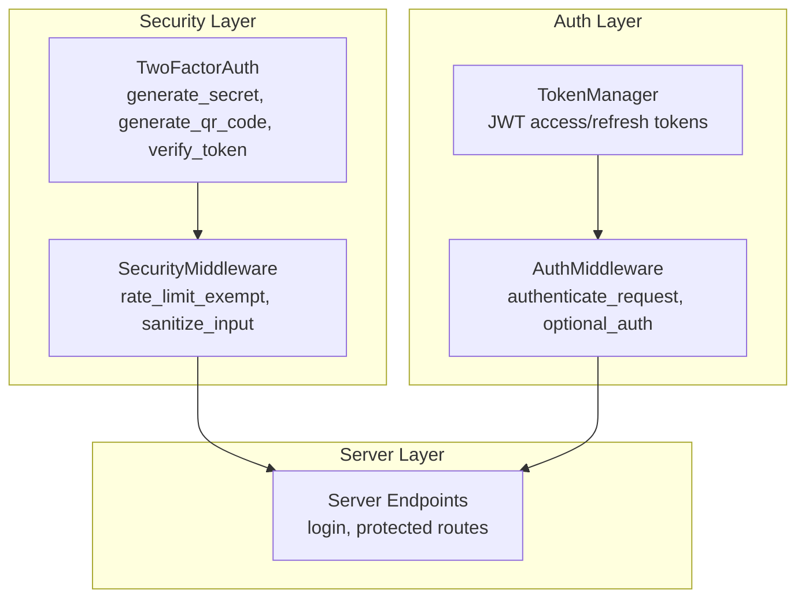
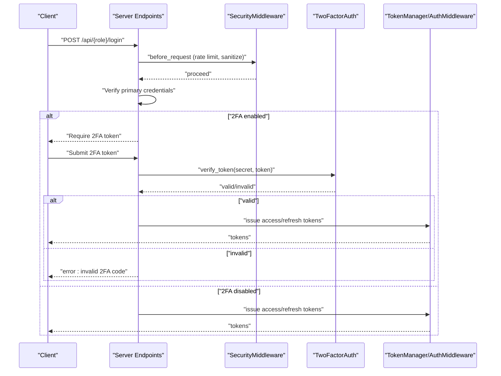
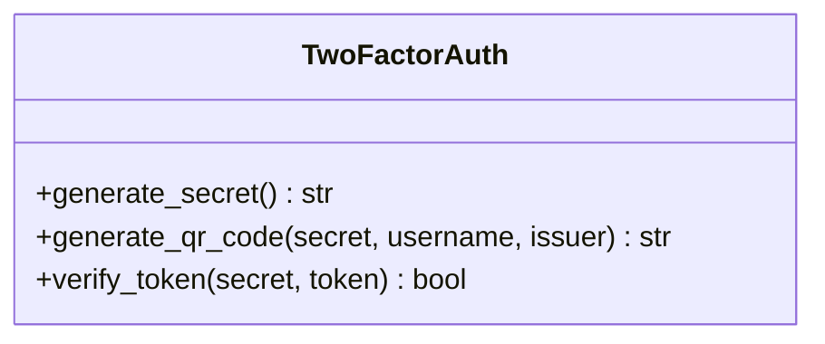
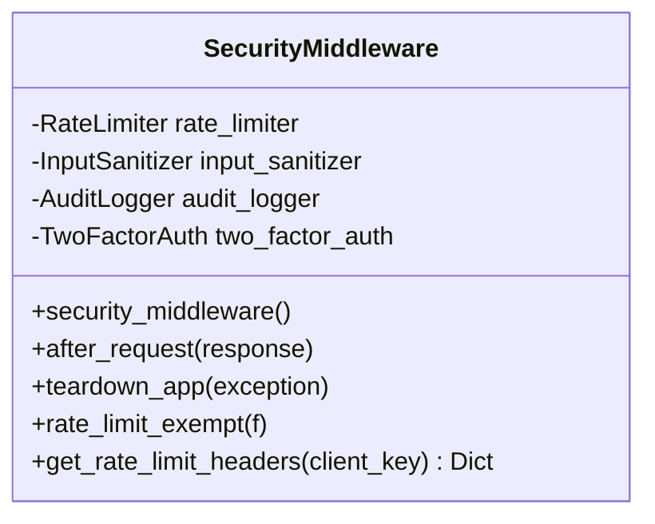
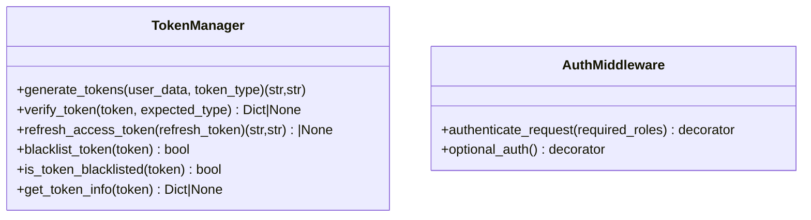
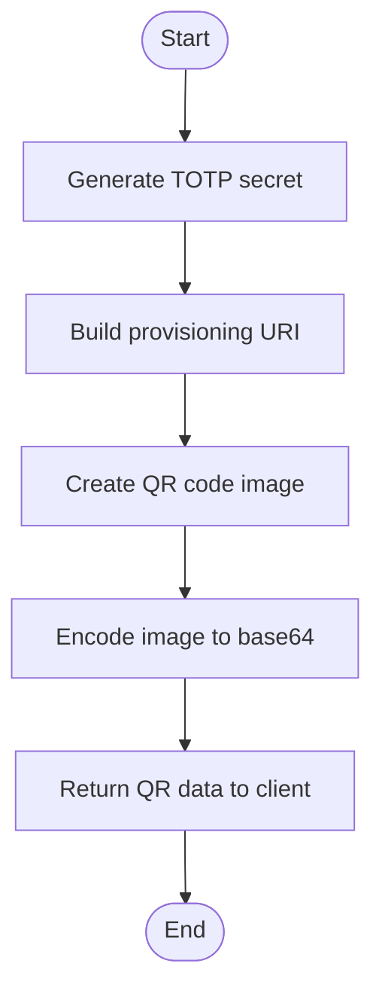
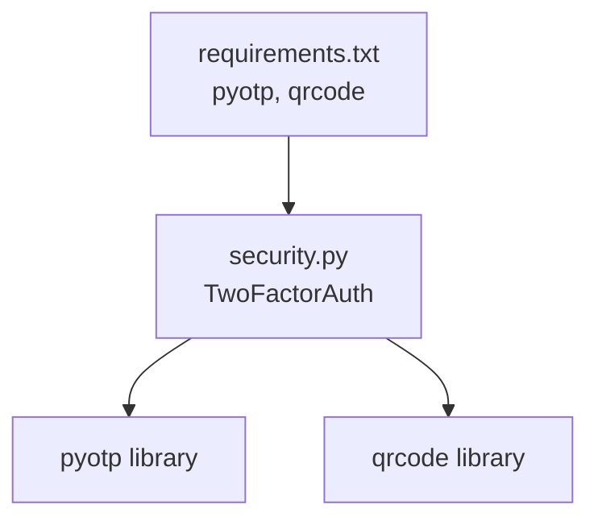

# Two-Factor Authentication

<cite>
**Referenced Files in This Document**
- [security.py](file://security.py)
- [auth.py](file://auth.py)
- [server.py](file://server.py)
- [database.py](file://database.py)
- [requirements.txt](file://requirements.txt)
- [.env.example](file://.env.example)
</cite>

## Table of Contents
1. [Introduction](#introduction)
2. [Project Structure](#project-structure)
3. [Core Components](#core-components)
4. [Architecture Overview](#architecture-overview)
5. [Detailed Component Analysis](#detailed-component-analysis)
6. [Dependency Analysis](#dependency-analysis)
7. [Performance Considerations](#performance-considerations)
8. [Troubleshooting Guide](#troubleshooting-guide)
9. [Conclusion](#conclusion)

## Introduction
This document explains the two-factor authentication (2FA) system implemented in the project. It focuses on PyOTP integration for time-based one-time passwords (TOTP), the 2FA setup process including QR code generation for authenticator apps, and the verification workflow during login and account access. It also provides practical examples for enabling 2FA for different user roles, documents backup/recovery mechanisms, and outlines security considerations and user experience optimizations. Finally, it shows how to integrate 2FA with the existing authentication flow and describes error handling for invalid codes and authentication failures.

## Project Structure
The 2FA implementation is primarily contained within the security module and integrates with the authentication and server layers. The key files are:
- security.py: Contains the TwoFactorAuth class and SecurityMiddleware that orchestrates rate limiting, input sanitization, audit logging, and 2FA capabilities.
- auth.py: Provides JWT-based authentication and middleware, which can be extended to incorporate 2FA checks.
- server.py: Defines authentication endpoints and integrates the security middleware.
- database.py: Manages database initialization and schema; can be extended to store 2FA secrets and backup codes.
- requirements.txt: Lists PyOTP and qrcode as dependencies for 2FA.
- .env.example: Demonstrates JWT_SECRET configuration used by the authentication system.

**Diagram sources**
- [security.py](file://security.py#L424-L475)
- [auth.py](file://auth.py#L14-L215)
- [server.py](file://server.py#L141-L200)

**Section sources**
- [security.py](file://security.py#L424-L475)
- [auth.py](file://auth.py#L14-L215)
- [server.py](file://server.py#L141-L200)

## Core Components
- TwoFactorAuth: Implements TOTP secret generation, QR code provisioning URI creation, and token verification with a small tolerance window.
- SecurityMiddleware: Integrates rate limiting, input sanitization, audit logging, and exposes the TwoFactorAuth instance for use in routes.
- TokenManager/AuthMiddleware: Provide JWT-based authentication and middleware for protecting routes; can be extended to enforce 2FA before granting access.

Key responsibilities:
- Secret generation and QR provisioning for authenticator apps.
- Verification of time-based tokens with tolerance for clock drift.
- Integration hooks for login and access control flows.

**Section sources**
- [security.py](file://security.py#L424-L475)
- [auth.py](file://auth.py#L14-L215)

## Architecture Overview
The 2FA workflow integrates with the existing authentication pipeline. During login, the system can optionally require a second factor. After successful primary authentication, the client receives a temporary access token. If 2FA is enabled, the client must submit a valid TOTP code to proceed. The SecurityMiddleware handles rate limiting and input sanitization around authentication endpoints.

**Diagram sources**
- [server.py](file://server.py#L141-L200)
- [security.py](file://security.py#L476-L563)
- [security.py](file://security.py#L424-L475)
- [auth.py](file://auth.py#L14-L215)

## Detailed Component Analysis

### TwoFactorAuth Implementation
The TwoFactorAuth class encapsulates all 2FA logic:
- Secret generation using a cryptographically secure base32 string.
- QR code generation via a provisioning URI compatible with authenticator apps.
- Token verification with a one-step tolerance window to handle minor time drift.

**Diagram sources**
- [security.py](file://security.py#L424-L475)

**Section sources**
- [security.py](file://security.py#L424-L475)

### SecurityMiddleware Integration
SecurityMiddleware initializes and exposes the TwoFactorAuth instance and applies cross-cutting concerns:
- Rate limiting tailored for authentication endpoints.
- Input sanitization for JSON payloads.
- Audit logging for security events and login attempts.

**Diagram sources**
- [security.py](file://security.py#L476-L563)

**Section sources**
- [security.py](file://security.py#L476-L563)

### Authentication and Middleware
The authentication system uses JWT tokens and middleware for enforcing access policies. While the current server routes do not enforce 2FA, the TokenManager/AuthMiddleware provide the foundation to integrate 2FA checks.

**Diagram sources**
- [auth.py](file://auth.py#L14-L215)

**Section sources**
- [auth.py](file://auth.py#L14-L215)

### QR Code Generation Workflow
The QR code generation process produces a base64-encoded PNG image for onboarding users into authenticator apps. The provisioning URI embeds the issuer and username for app recognition.

**Diagram sources**
- [security.py](file://security.py#L432-L459)

**Section sources**
- [security.py](file://security.py#L432-L459)

### Backup Codes and Recovery Mechanisms
The current implementation does not include backup codes or recovery mechanisms. To add resilience:
- Extend the database schema to store a set of single-use backup codes per user.
- Implement endpoints to generate and consume backup codes.
- Enforce backup code consumption upon use and prevent reuse.

[No sources needed since this section proposes future enhancements not present in the codebase]

### Practical Examples: Enabling 2FA for Different Roles
Below are practical examples of enabling 2FA for different user roles. These examples describe the steps and where to integrate the 2FA logic in the existing server endpoints.

- Admin role
  - Add a 2FA toggle in the admin profile management.
  - On enabling 2FA, generate a secret and QR code for the admin user.
  - Require 2FA verification during subsequent logins for the admin role.
  - Reference: [server.py](file://server.py#L142-L199)

- School role
  - Add a 2FA toggle in the school dashboard.
  - Generate a secret and QR code for the school entity.
  - Require 2FA verification during school login endpoints.
  - Reference: [server.py](file://server.py#L201-L256)

- Student role
  - Add a 2FA toggle in the student portal.
  - Generate a secret and QR code for the student user.
  - Require 2FA verification during student login endpoints.
  - Reference: [server.py](file://server.py#L258-L304)

[No sources needed since this section provides conceptual integration guidance]

### Integrating 2FA with Existing Authentication Flow
To integrate 2FA into the existing authentication flow:
- Modify the login endpoints to optionally require a 2FA token after primary credential verification.
- Use the TwoFactorAuth.verify_token method to validate the submitted token against the stored secret.
- Issue JWT access/refresh tokens only after successful 2FA verification.
- Optionally, redirect to a 2FA verification page or require a 2FA header/token for protected routes.

References:
- [server.py](file://server.py#L141-L200)
- [security.py](file://security.py#L424-L475)
- [auth.py](file://auth.py#L14-L215)

**Section sources**
- [server.py](file://server.py#L141-L200)
- [security.py](file://security.py#L424-L475)
- [auth.py](file://auth.py#L14-L215)

### Error Handling for Invalid Codes and Authentication Failures
Common error scenarios and recommended handling:
- Invalid 2FA token: Return a clear error message indicating the code is invalid or expired.
- Rate-limited login attempts: Enforce rate limits and return appropriate headers and status codes.
- Expired or invalid JWT tokens: Return 401 Unauthorized with a localized error message.
- Missing or malformed Authorization header: Return 401 Unauthorized with a clear message.

References:
- [security.py](file://security.py#L509-L517)
- [auth.py](file://auth.py#L234-L250)

**Section sources**
- [security.py](file://security.py#L509-L517)
- [auth.py](file://auth.py#L234-L250)

## Dependency Analysis
The 2FA implementation relies on external libraries for cryptographic and QR code generation.

**Diagram sources**
- [requirements.txt](file://requirements.txt#L11-L12)
- [security.py](file://security.py#L14-L18)

**Section sources**
- [requirements.txt](file://requirements.txt#L11-L12)
- [security.py](file://security.py#L14-L18)

## Performance Considerations
- TOTP verification uses a small tolerance window to mitigate clock skew; keep this minimal to reduce verification overhead.
- QR code generation occurs on-demand; cache frequently reused QR images if needed.
- Rate limiting protects login endpoints from brute-force attempts; tune thresholds according to deployment needs.
- JWT token verification is lightweight; avoid unnecessary decoding operations.

[No sources needed since this section provides general guidance]

## Troubleshooting Guide
- Symptom: 2FA verification fails despite correct code
  - Cause: Clock drift or tolerance window too small
  - Resolution: Increase tolerance window slightly or synchronize system clocks
  - Reference: [security.py](file://security.py#L473-L474)

- Symptom: QR code cannot be scanned by authenticator app
  - Cause: Incorrect provisioning URI or encoding issues
  - Resolution: Verify the generated provisioning URI and ensure base64 encoding is correct
  - Reference: [security.py](file://security.py#L445-L459)

- Symptom: Login rate-limited
  - Cause: Too many failed attempts
  - Resolution: Wait for the reset window or adjust rate limits
  - Reference: [security.py](file://security.py#L509-L517)

**Section sources**
- [security.py](file://security.py#L445-L459)
- [security.py](file://security.py#L473-L474)
- [security.py](file://security.py#L509-L517)

## Conclusion
The project includes a robust 2FA foundation using PyOTP and QR code generation, integrated with security middleware for rate limiting and audit logging. While the current server endpoints do not enforce 2FA, the TokenManager/AuthMiddleware and TwoFactorAuth classes provide clear integration points to add 2FA to the login flow. Extending the database schema to store 2FA secrets and backup codes would complete the solution, enabling secure, resilient authentication for all user roles.