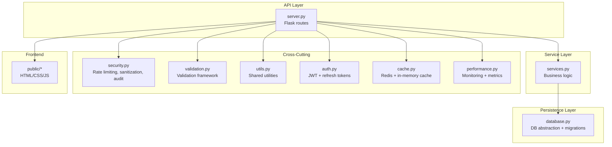
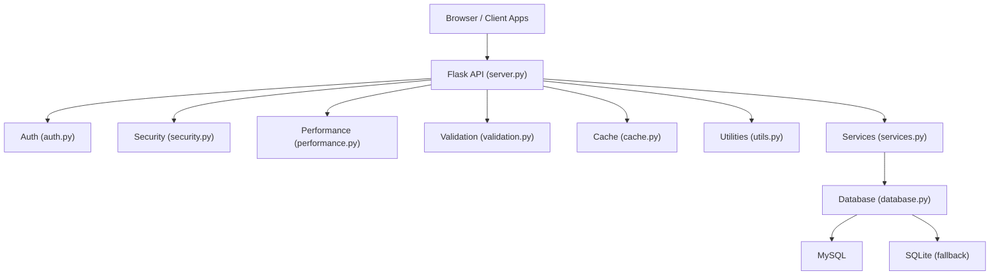
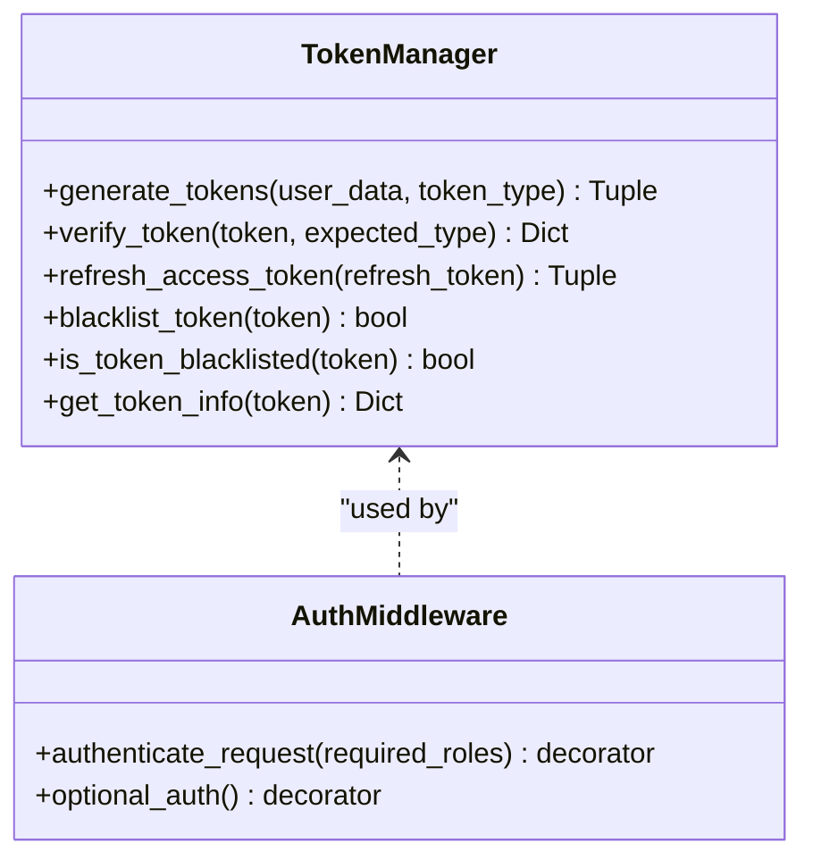
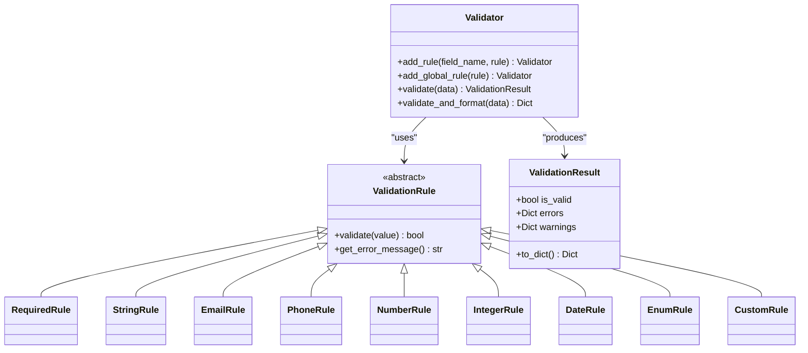
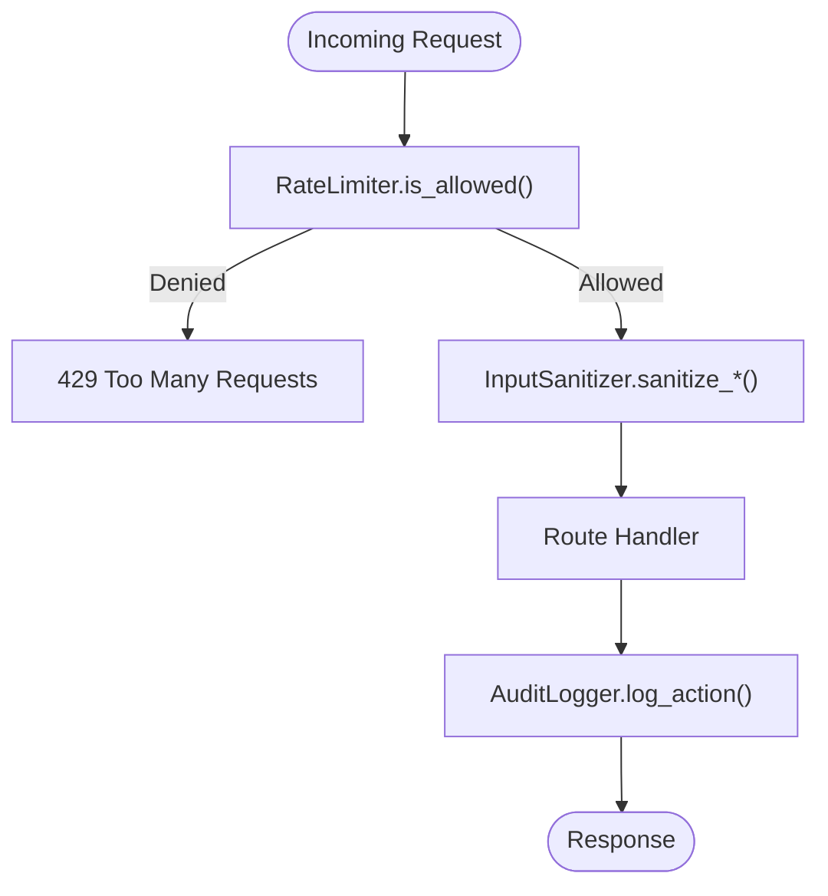
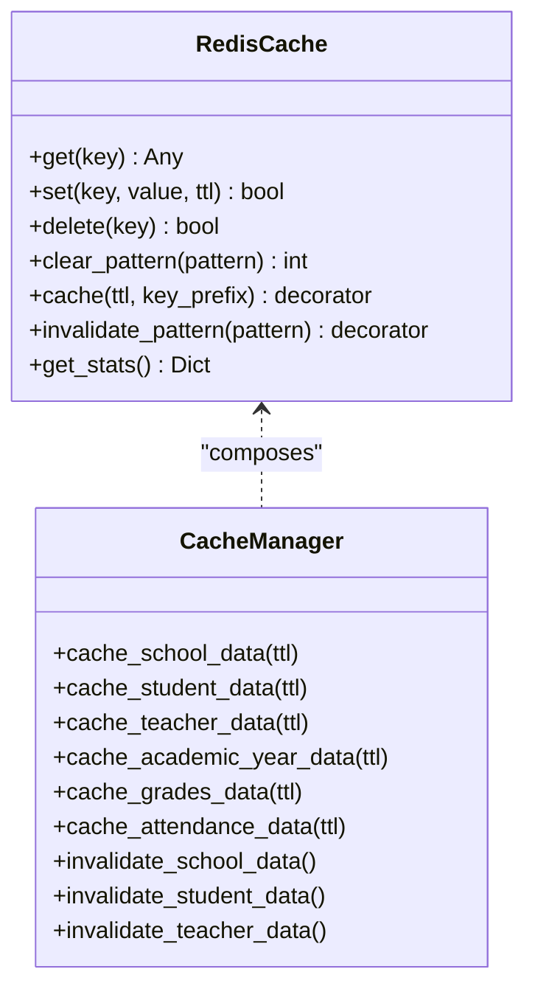
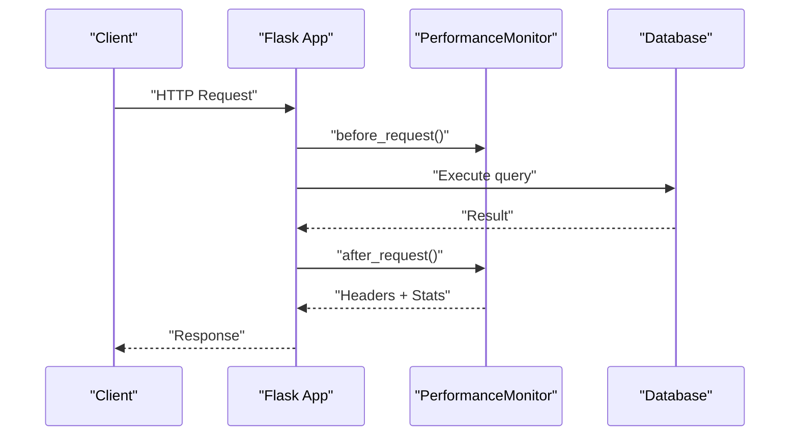
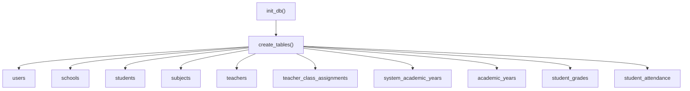
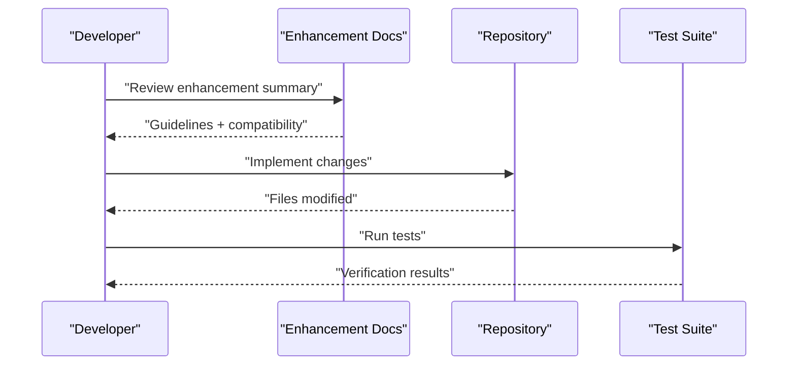
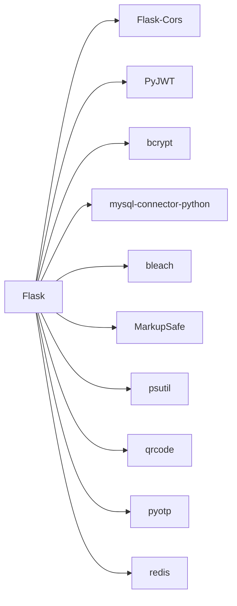

# Contributing & Extensions

<cite>
**Referenced Files in This Document**
- [README.md](file://README.md)
- [BUTTON_FORMATTING_ENHANCEMENT_SUMMARY.md](file://BUTTON_FORMATTING_ENHANCEMENT_SUMMARY.md)
- [ENHANCEMENT_SUMMARY.md](file://ENHANCEMENT_SUMMARY.md)
- [DATABASE_SETUP.md](file://DATABASE_SETUP.md)
- [DEPLOYMENT.md](file://DEPLOYMENT.md)
- [server.py](file://server.py)
- [database.py](file://database.py)
- [auth.py](file://auth.py)
- [utils.py](file://utils.py)
- [validation.py](file://validation.py)
- [services.py](file://services.py)
- [cache.py](file://cache.py)
- [security.py](file://security.py)
- [performance.py](file://performance.py)
- [requirements.txt](file://requirements.txt)
</cite>

## Table of Contents
1. [Introduction](#introduction)
2. [Project Structure](#project-structure)
3. [Core Components](#core-components)
4. [Architecture Overview](#architecture-overview)
5. [Detailed Component Analysis](#detailed-component-analysis)
6. [Dependency Analysis](#dependency-analysis)
7. [Performance Considerations](#performance-considerations)
8. [Troubleshooting Guide](#troubleshooting-guide)
9. [Conclusion](#conclusion)
10. [Appendices](#appendices)

## Introduction
This document provides a comprehensive guide for contributing to and extending the EduFlow system. It covers development standards, contribution workflows, extension points in the modular service architecture, customization options for institutions, backward compatibility, testing requirements, and integration patterns. It also outlines the enhancement implementation process with examples from the repository’s improvement documentation and provides best practices for maintaining system stability when adding new features or modifying the database schema safely.

## Project Structure
EduFlow is a Python/Flask-based school management system with a clear separation of concerns:
- API layer: Flask routes in the server module
- Service layer: Business logic in services.py
- Persistence layer: Database abstraction and migrations in database.py
- Cross-cutting concerns: Security, caching, performance, and validation utilities
- Frontend assets: Static HTML/CSS/JS under public/

**Diagram sources**
- [server.py](file://server.py#L1-L120)
- [services.py](file://services.py#L1-L120)
- [database.py](file://database.py#L1-L120)
- [security.py](file://security.py#L1-L120)
- [validation.py](file://validation.py#L1-L120)
- [utils.py](file://utils.py#L1-L120)
- [auth.py](file://auth.py#L1-L120)
- [cache.py](file://cache.py#L1-L120)
- [performance.py](file://performance.py#L1-L120)

**Section sources**
- [README.md](file://README.md#L1-L23)
- [server.py](file://server.py#L1-L120)
- [services.py](file://services.py#L1-L120)
- [database.py](file://database.py#L1-L120)
- [security.py](file://security.py#L1-L120)
- [validation.py](file://validation.py#L1-L120)
- [utils.py](file://utils.py#L1-L120)
- [auth.py](file://auth.py#L1-L120)
- [cache.py](file://cache.py#L1-L120)
- [performance.py](file://performance.py#L1-L120)

## Core Components
- Flask server and routing: Central API endpoints for admin, school, and student portals, health checks, and performance endpoints.
- Service layer: Encapsulates business logic and coordinates with the database layer.
- Database abstraction: MySQL/SQLite adapter with automatic migration and schema creation.
- Security middleware: Rate limiting, input sanitization, audit logging, and optional 2FA.
- Validation framework: Modular, composable validation rules with route decorators.
- Utilities: Centralized helpers for validation, sanitization, response formatting, and logging.
- Authentication: JWT with refresh tokens and role-based access control.
- Caching: Redis-backed cache with in-memory fallback and cache decorators.
- Performance monitoring: Request timing, endpoint statistics, and system metrics.

**Section sources**
- [server.py](file://server.py#L110-L220)
- [services.py](file://services.py#L12-L43)
- [database.py](file://database.py#L88-L120)
- [security.py](file://security.py#L20-L120)
- [validation.py](file://validation.py#L10-L120)
- [utils.py](file://utils.py#L19-L120)
- [auth.py](file://auth.py#L14-L120)
- [cache.py](file://cache.py#L14-L120)
- [performance.py](file://performance.py#L15-L120)

## Architecture Overview
The system follows a layered architecture:
- Presentation: Flask routes serve endpoints and static assets.
- Services: Orchestrate business logic and coordinate persistence.
- Persistence: Abstracts MySQL/SQLite with a connection pool and schema migration.
- Infrastructure: Security, caching, performance, and validation are integrated as middleware/services.

**Diagram sources**
- [server.py](file://server.py#L1-L120)
- [auth.py](file://auth.py#L1-L120)
- [security.py](file://security.py#L1-L120)
- [performance.py](file://performance.py#L1-L120)
- [validation.py](file://validation.py#L1-L120)
- [cache.py](file://cache.py#L1-L120)
- [utils.py](file://utils.py#L1-L120)
- [services.py](file://services.py#L1-L120)
- [database.py](file://database.py#L1-L120)

## Detailed Component Analysis

### Authentication and Authorization
- JWT with refresh tokens: Token manager supports access/refresh token lifecycle, blacklisting, and revocation.
- Role-based access control: Route decorators enforce role requirements.
- Optional auth: Decorators allow optional authentication for public endpoints.

**Diagram sources**
- [auth.py](file://auth.py#L14-L215)

**Section sources**
- [auth.py](file://auth.py#L14-L215)
- [server.py](file://server.py#L91-L108)

### Validation Framework
- Modular rules: Required, String, Email, Phone, Number, Integer, Date, Enum, Custom.
- Validator orchestrates rules and produces structured results.
- Route decorators integrate validation into Flask endpoints.

**Diagram sources**
- [validation.py](file://validation.py#L10-L240)

**Section sources**
- [validation.py](file://validation.py#L10-L240)
- [utils.py](file://utils.py#L19-L120)

### Security Middleware and Audit Logging
- Rate limiting: Sliding-window counters per endpoint category.
- Input sanitization: HTML cleaning and escaping with allow-listed tags.
- Audit logging: Buffered writes with database persistence and severity levels.
- 2FA: TOTP secret generation and QR provisioning.

**Diagram sources**
- [security.py](file://security.py#L20-L120)
- [security.py](file://security.py#L177-L423)

**Section sources**
- [security.py](file://security.py#L20-L120)
- [security.py](file://security.py#L177-L423)

### Caching Layer
- Redis-backed cache with in-memory fallback.
- Decorators for function result caching and pattern-based invalidation.
- Cache manager provides typed cache strategies.

**Diagram sources**
- [cache.py](file://cache.py#L14-L212)
- [cache.py](file://cache.py#L234-L305)

**Section sources**
- [cache.py](file://cache.py#L14-L212)
- [cache.py](file://cache.py#L234-L305)

### Performance Monitoring
- Tracks request durations, endpoint statistics, and system metrics.
- Adds performance headers and exposes monitoring endpoints.

**Diagram sources**
- [performance.py](file://performance.py#L15-L120)
- [performance.py](file://performance.py#L215-L241)

**Section sources**
- [performance.py](file://performance.py#L15-L120)
- [performance.py](file://performance.py#L215-L241)

### Database Abstraction and Schema Management
- MySQL/SQLite adapter with connection pooling and fallback.
- Automatic table creation and schema migration.
- Utility functions for unique code generation and teacher/student operations.

**Diagram sources**
- [database.py](file://database.py#L120-L338)

**Section sources**
- [database.py](file://database.py#L88-L120)
- [database.py](file://database.py#L120-L338)

### Enhancement Implementation Examples
- Button formatting enhancement: Unified design system across CSS modules, accessibility improvements, and consistent hover/size behavior.
- Validation and utility consolidation: Centralized validation, error logging, JWT auth, caching, client-side validation, and loading feedback.
- Backward compatibility: No schema changes, API compatibility, UI compatibility, and configuration compatibility.

**Diagram sources**
- [BUTTON_FORMATTING_ENHANCEMENT_SUMMARY.md](file://BUTTON_FORMATTING_ENHANCEMENT_SUMMARY.md#L1-L77)
- [ENHANCEMENT_SUMMARY.md](file://ENHANCEMENT_SUMMARY.md#L1-L313)

**Section sources**
- [BUTTON_FORMATTING_ENHANCEMENT_SUMMARY.md](file://BUTTON_FORMATTING_ENHANCEMENT_SUMMARY.md#L1-L77)
- [ENHANCEMENT_SUMMARY.md](file://ENHANCEMENT_SUMMARY.md#L166-L283)

## Dependency Analysis
External dependencies include Flask, CORS, JWT, bcrypt, MySQL connector, bleach, psutil, qrcode, pyotp, and redis.

**Diagram sources**
- [requirements.txt](file://requirements.txt#L1-L14)

**Section sources**
- [requirements.txt](file://requirements.txt#L1-L14)

## Performance Considerations
- Caching: Use cache decorators and cache managers to reduce database load and improve response times.
- Validation: Centralized validation reduces duplication and improves error handling consistency.
- Security: Rate limiting and input sanitization protect the system from abuse and injection.
- Monitoring: Track request times, endpoint performance, and system metrics to identify bottlenecks.

[No sources needed since this section provides general guidance]

## Troubleshooting Guide
- Database connectivity: Verify MySQL host/user/password/port and ensure the database is reachable.
- JWT secret: Generate a strong secret and configure it in environment variables.
- CORS: Update allowed origins for production deployments.
- Health checks: Use the health endpoint to verify environment and platform detection.

**Section sources**
- [DATABASE_SETUP.md](file://DATABASE_SETUP.md#L16-L66)
- [DEPLOYMENT.md](file://DEPLOYMENT.md#L54-L111)
- [server.py](file://server.py#L110-L139)

## Conclusion
EduFlow’s modular architecture and cross-cutting services enable safe and scalable extensions. By leveraging the validation framework, security middleware, caching layer, and performance monitoring, contributors can implement new features with minimal disruption. Adhering to backward compatibility, comprehensive testing, and integration patterns ensures stability and maintainability.

[No sources needed since this section summarizes without analyzing specific files]

## Appendices

### Contribution Guidelines and Pull Request Process
- Fork and branch: Create feature branches from the latest main.
- Coding standards: Follow existing code style; centralize shared logic in utilities and validation modules.
- Testing: Add unit/integration tests; verify with the existing test suite.
- Documentation: Update enhancement summaries and keep compatibility notes.
- Review: Open a pull request with a clear summary referencing related docs and tests.

[No sources needed since this section provides general guidance]

### Extension Points for Adding Features
- API layer: Add Flask routes with decorators for sanitization, validation, and authentication.
- Service layer: Encapsulate business logic and reuse database abstractions.
- Validation: Extend validators for new entities and compose rules for complex scenarios.
- Security: Leverage rate limiting and audit logging for new endpoints.
- Caching: Apply cache decorators for expensive reads; invalidate patterns after mutations.
- Frontend: Use the unified design system and accessibility enhancements for UI consistency.

**Section sources**
- [server.py](file://server.py#L140-L220)
- [services.py](file://services.py#L12-L43)
- [validation.py](file://validation.py#L203-L367)
- [security.py](file://security.py#L476-L562)
- [cache.py](file://cache.py#L170-L211)

### Customization Options for Institutions
- Branding: Modify CSS in the unified design system and portal-specific stylesheets.
- Workflows: Adjust validation rules and service logic to fit institutional policies.
- Multi-school architecture: Use the existing multi-school schema and services; extend with academic year management and teacher/class assignments.

**Section sources**
- [BUTTON_FORMATTING_ENHANCEMENT_SUMMARY.md](file://BUTTON_FORMATTING_ENHANCEMENT_SUMMARY.md#L1-L77)
- [database.py](file://database.py#L247-L290)
- [services.py](file://services.py#L298-L366)

### Backward Compatibility and Schema Safety
- No schema changes required for recent enhancements; migrations are additive.
- API compatibility: Preserve endpoint signatures and response formats.
- UI compatibility: Maintain existing workflows and visual consistency.
- Configuration compatibility: Keep environment variables optional and defaults intact.

**Section sources**
- [ENHANCEMENT_SUMMARY.md](file://ENHANCEMENT_SUMMARY.md#L166-L193)
- [DATABASE_SETUP.md](file://DATABASE_SETUP.md#L16-L33)

### Testing Requirements for Extensions
- Unit tests: Validate new utilities, validators, and services.
- Integration tests: Ensure endpoints work with security, caching, and validation.
- Performance tests: Confirm caching and query optimization improvements.
- User acceptance tests: Verify UI changes and accessibility enhancements.

**Section sources**
- [ENHANCEMENT_SUMMARY.md](file://ENHANCEMENT_SUMMARY.md#L146-L164)

### Deployment and Hosting
- Recommended platforms: Railway, Render, Vercel (with adjustments), Heroku.
- Environment variables: Configure JWT secret, database credentials, and production settings.
- Post-deployment: Update CORS origins, test all features, and monitor performance.

**Section sources**
- [DEPLOYMENT.md](file://DEPLOYMENT.md#L9-L111)