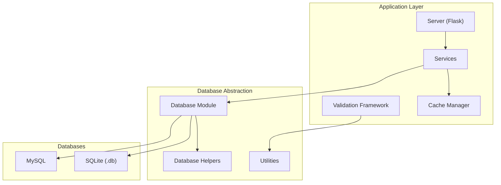
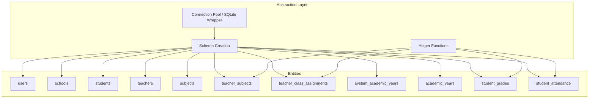
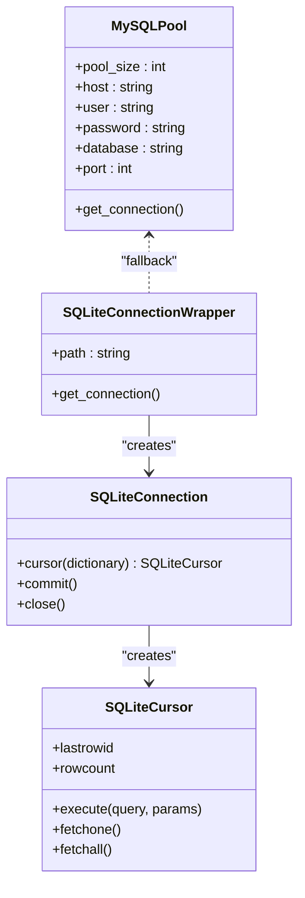
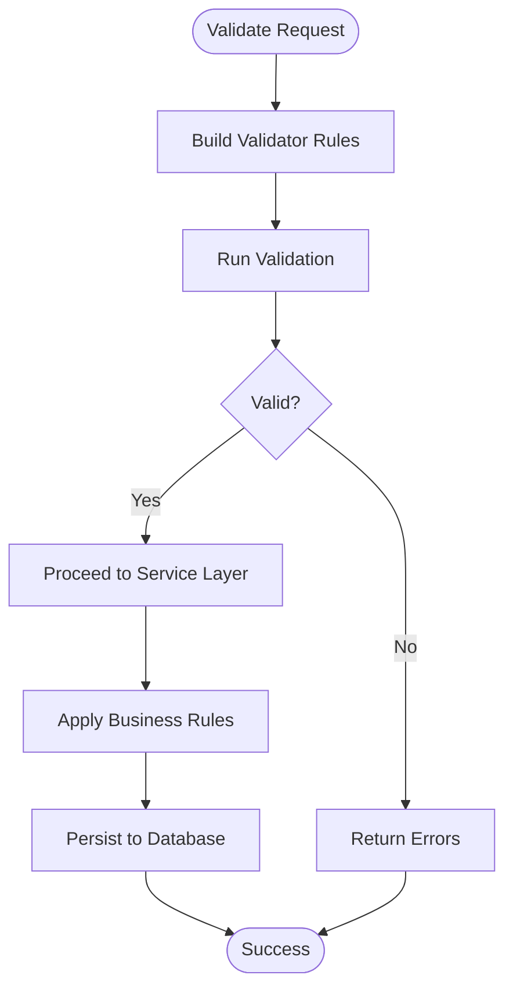
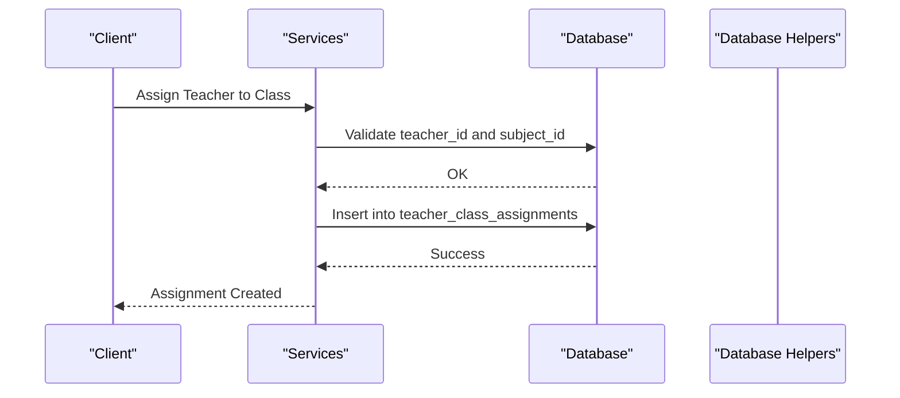
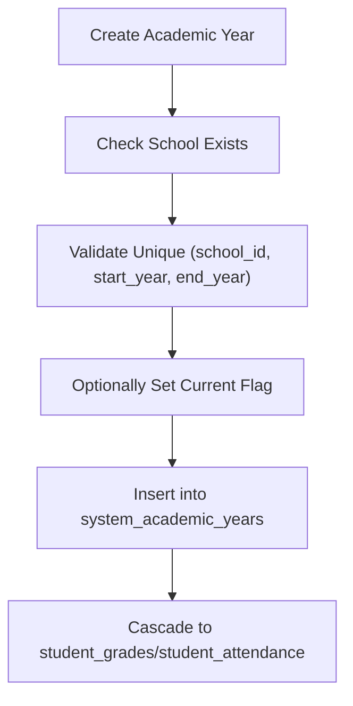
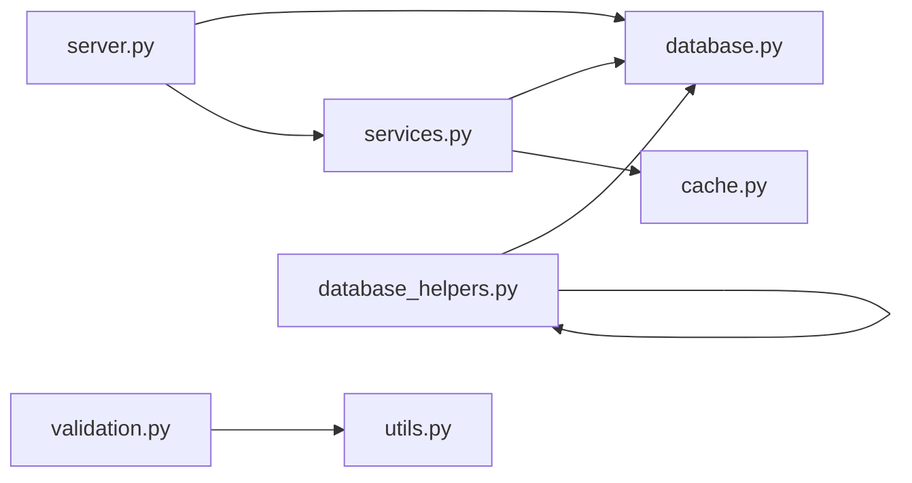

# Database Design

<cite>
**Referenced Files in This Document**
- [database.py](file://database.py)
- [database_helpers.py](file://database_helpers.py)
- [validation.py](file://validation.py)
- [validation_helpers.py](file://validation_helpers.py)
- [services.py](file://services.py)
- [cache.py](file://cache.py)
- [utils.py](file://utils.py)
- [server.py](file://server.py)
- [DATABASE_SETUP.md](file://DATABASE_SETUP.md)
- [DEPLOYMENT_GUIDE.md](file://DEPLOYMENT_GUIDE.md)
- [delete_academic_years.sql](file://delete_academic_years.sql)
</cite>

## Table of Contents
1. [Introduction](#introduction)
2. [Project Structure](#project-structure)
3. [Core Components](#core-components)
4. [Architecture Overview](#architecture-overview)
5. [Detailed Component Analysis](#detailed-component-analysis)
6. [Dependency Analysis](#dependency-analysis)
7. [Performance Considerations](#performance-considerations)
8. [Troubleshooting Guide](#troubleshooting-guide)
9. [Conclusion](#conclusion)
10. [Appendices](#appendices)

## Introduction
This document presents the comprehensive database design for the EduFlow system. It details the entity relationship model, table schemas, primary and foreign key relationships, indexes and constraints, and the dual MySQL/SQLite support architecture with a database abstraction layer. It also documents data validation rules, business logic constraints, data lifecycle management, migration strategies, and performance considerations for educational data queries and reporting.

## Project Structure
The database design is implemented primarily in Python modules:
- A central database abstraction layer that supports both MySQL and SQLite
- Helper modules for teacher-subject assignment operations
- Validation frameworks for input sanitization and business rule enforcement
- Service layer for business logic and caching integration
- Utilities for data transformations and validation helpers
- Deployment and setup documentation for MySQL and SQLite environments



**Diagram sources**
- [server.py](file://server.py#L1-L200)
- [services.py](file://services.py#L1-L120)
- [database.py](file://database.py#L1-L120)
- [database_helpers.py](file://database_helpers.py#L1-L40)
- [cache.py](file://cache.py#L1-L60)
- [utils.py](file://utils.py#L1-L60)

**Section sources**
- [server.py](file://server.py#L1-L200)
- [services.py](file://services.py#L1-L120)
- [database.py](file://database.py#L1-L120)

## Core Components
- Database Abstraction Layer: Provides a unified interface for MySQL and SQLite, including connection pooling, SQLite adapter, and automatic schema creation.
- Entity Model: Defines core entities (users, schools, students, teachers, subjects, academic years) and their relationships.
- Validation Framework: Enforces data integrity and business rules at the application level.
- Service Layer: Encapsulates business logic and integrates caching for performance.
- Teacher-Subject Assignment System: Manages many-to-many relationships between teachers and subjects, plus free-text subject assignments.

Key capabilities:
- Dual backend support with automatic fallback
- Centralized schema creation and migration
- Rich validation rules for Arabic and internationalized fields
- Caching integration for frequently accessed data
- Audit logging hooks for compliance

**Section sources**
- [database.py](file://database.py#L120-L338)
- [validation.py](file://validation.py#L263-L376)
- [services.py](file://services.py#L1-L120)
- [database_helpers.py](file://database_helpers.py#L12-L364)

## Architecture Overview
The database architecture centers on a single abstraction layer that adapts to MySQL or SQLite. The system creates tables on startup and provides helper functions for CRUD operations, teacher-subject assignments, and academic year management. The service layer orchestrates business logic and integrates caching.



**Diagram sources**
- [database.py](file://database.py#L120-L338)
- [database_helpers.py](file://database_helpers.py#L12-L364)

## Detailed Component Analysis

### Database Abstraction Layer
The abstraction layer supports both MySQL and SQLite:
- MySQL: Uses a connection pool with configurable size and parameters
- SQLite: Provides a lightweight wrapper that mimics MySQL’s connection interface
- Automatic fallback: If MySQL fails to connect, the system falls back to SQLite
- Schema creation: Creates tables on first run and seeds default admin user
- Migration support: Adds new columns to existing tables when upgrading



**Diagram sources**
- [database.py](file://database.py#L88-L118)
- [database.py](file://database.py#L23-L87)

**Section sources**
- [database.py](file://database.py#L88-L118)
- [database.py](file://database.py#L120-L338)

### Entity Relationship Model
Core entities and relationships:
- users: System users with roles
- schools: Educational institutions with unique codes
- students: Enrolled learners linked to schools
- teachers: Staff members linked to schools
- subjects: Academic subjects per school
- teacher_subjects: Many-to-many mapping between teachers and subjects
- teacher_class_assignments: Tracks which teachers teach which classes and subjects for academic years
- system_academic_years: Centralized academic year management
- academic_years: Legacy table for backward compatibility
- student_grades: Per-student, per-academic-year grade records
- student_attendance: Daily attendance tracking per academic year

```mermaid
erDiagram
USERS {
int id PK
varchar username UK
varchar password_hash
varchar role
timestamp created_at
}
SCHOOLS {
int id PK
varchar name
varchar code UK
varchar study_type
varchar level
varchar gender_type
timestamp created_at
timestamp updated_at
}
STUDENTS {
int id PK
int school_id FK
varchar full_name
varchar student_code UK
varchar grade
varchar branch
varchar room
date enrollment_date
varchar parent_contact
varchar blood_type
text chronic_disease
json detailed_scores
json daily_attendance
timestamp created_at
timestamp updated_at
}
TEACHERS {
int id PK
int school_id FK
varchar full_name
varchar teacher_code UK
varchar phone
varchar email
varchar password_hash
varchar grade_level
varchar specialization
text free_text_subjects
timestamp created_at
timestamp updated_at
}
SUBJECTS {
int id PK
int school_id FK
varchar name
varchar grade_level
timestamp created_at
timestamp updated_at
}
TEACHER_SUBJECTS {
int id PK
int teacher_id FK
int subject_id FK
timestamp created_at
unique(teacher_id, subject_id)
}
TEACHER_CLASS_ASSIGNMENTS {
int id PK
int teacher_id FK
varchar class_name
int subject_id FK
int academic_year_id FK
timestamp assigned_at
unique(teacher_id, class_name, subject_id, academic_year_id)
}
SYSTEM_ACADEMIC_YEARS {
int id PK
varchar name UK
int start_year
int end_year
date start_date
date end_date
int is_current
timestamp created_at
timestamp updated_at
}
ACADEMIC_YEARS {
int id PK
int school_id FK
varchar name
int start_year
int end_year
date start_date
date end_date
int is_current
timestamp created_at
timestamp updated_at
}
STUDENT_GRADES {
int id PK
int student_id FK
int academic_year_id FK
varchar subject_name
int month1
int month2
int midterm
int month3
int month4
int final
timestamp created_at
timestamp updated_at
}
STUDENT_ATTENDANCE {
int id PK
int student_id FK
int academic_year_id FK
date attendance_date
varchar status
text notes
timestamp created_at
}
STUDENTS }o--|| SCHOOLS : "belongs to"
TEACHERS }o--|| SCHOOLS : "belongs to"
SUBJECTS }o--|| SCHOOLS : "belongs to"
TEACHER_SUBJECTS }o--|| TEACHERS : "belongs to"
TEACHER_SUBJECTS }o--|| SUBJECTS : "belongs to"
TEACHER_CLASS_ASSIGNMENTS }o--|| TEACHERS : "belongs to"
TEACHER_CLASS_ASSIGNMENTS }o--|| SUBJECTS : "belongs to"
TEACHER_CLASS_ASSIGNMENTS }o--|| SYSTEM_ACADEMIC_YEARS : "belongs to"
STUDENT_GRADES }o--|| STUDENTS : "belongs to"
STUDENT_GRADES }o--|| SYSTEM_ACADEMIC_YEARS : "belongs to"
STUDENT_ATTENDANCE }o--|| STUDENTS : "belongs to"
STUDENT_ATTENDANCE }o--|| SYSTEM_ACADEMIC_YEARS : "belongs to"
```

**Diagram sources**
- [database.py](file://database.py#L138-L320)

**Section sources**
- [database.py](file://database.py#L138-L320)

### Table Schemas and Constraints
- Unique constraints:
  - users.username
  - schools.code
  - students.student_code
  - teachers.teacher_code
  - system_academic_years.name
- Foreign key constraints:
  - students.school_id → schools.id (CASCADE)
  - teachers.school_id → schools.id (CASCADE)
  - subjects.school_id → schools.id (CASCADE)
  - teacher_subjects.teacher_id → teachers.id (CASCADE)
  - teacher_subjects.subject_id → subjects.id (CASCADE)
  - teacher_class_assignments.teacher_id → teachers.id (CASCADE)
  - teacher_class_assignments.subject_id → subjects.id (CASCADE)
  - teacher_class_assignments.academic_year_id → system_academic_years.id (SET NULL)
  - student_grades.student_id → students.id (CASCADE)
  - student_grades.academic_year_id → system_academic_years.id (CASCADE)
  - student_attendance.student_id → students.id (CASCADE)
  - student_attendance.academic_year_id → system_academic_years.id (CASCADE)
- Indexes:
  - Composite unique indexes on teacher_subjects and teacher_class_assignments
  - Implicit indexes on primary keys and foreign keys
- Additional constraints:
  - JSON columns for flexible data storage (detailed_scores, daily_attendance)
  - Timestamp defaults for created_at/updated_at

**Section sources**
- [database.py](file://database.py#L138-L320)

### Data Validation Rules and Business Logic
- Input validation framework enforces:
  - Required fields, string length limits, numeric ranges, date formats, and enumerations
  - Custom validators for Arabic-grade formats, educational levels, and blood types
  - Global validation rules and warnings
- Business logic constraints:
  - Unique school and teacher codes generated with collision avoidance
  - Academic year management with current year flagging
  - Teacher-subject assignment validation ensuring subjects belong to the same school
  - Free-text subject support alongside predefined subjects



**Diagram sources**
- [validation.py](file://validation.py#L222-L262)
- [validation_helpers.py](file://validation_helpers.py#L12-L147)

**Section sources**
- [validation.py](file://validation.py#L263-L376)
- [validation_helpers.py](file://validation_helpers.py#L12-L147)
- [utils.py](file://utils.py#L27-L200)

### Teacher-Subject Assignment System
- Many-to-many mapping via teacher_subjects
- Free-text subject support stored in teachers.free_text_subjects
- Assignment validation ensures subjects belong to the same school as the teacher
- Helper functions provide:
  - Get teacher’s subjects (predefined + free-text)
  - Get students taught by a teacher based on subject grade levels
  - Assign/remove teacher-class-subject mappings with academic year scoping



**Diagram sources**
- [services.py](file://services.py#L510-L572)
- [database.py](file://database.py#L552-L572)

**Section sources**
- [database_helpers.py](file://database_helpers.py#L87-L169)
- [database.py](file://database.py#L467-L508)
- [database.py](file://database.py#L509-L551)

### Academic Year Structures
- Centralized system_academic_years table for system-wide academic year management
- Legacy academic_years table maintained for backward compatibility
- student_grades and student_attendance link to system_academic_years
- Migration script demonstrates deletion of specific academic years and cascade effects



**Diagram sources**
- [database.py](file://database.py#L261-L290)
- [delete_academic_years.sql](file://delete_academic_years.sql#L1-L19)

**Section sources**
- [database.py](file://database.py#L261-L290)
- [delete_academic_years.sql](file://delete_academic_years.sql#L1-L19)

### Data Lifecycle Management
- Initialization: On startup, tables are created and default admin user is seeded
- Code generation: Unique codes for schools and teachers with collision avoidance
- Data retention: Academic year data cascades with foreign keys; legacy table preserved for migration
- Cleanup: Migration scripts demonstrate safe deletion of academic years

**Section sources**
- [database.py](file://database.py#L120-L127)
- [database.py](file://database.py#L322-L333)
- [database.py](file://database.py#L348-L365)
- [database.py](file://database.py#L391-L466)

## Dependency Analysis
The system exhibits layered dependencies:
- Server depends on database initialization and exposes routes
- Services depend on database abstractions and caching
- Validation depends on utilities for custom checks
- Database helpers depend on database abstractions



**Diagram sources**
- [server.py](file://server.py#L1-L50)
- [services.py](file://services.py#L1-L20)
- [database.py](file://database.py#L1-L20)
- [database_helpers.py](file://database_helpers.py#L1-L15)
- [validation.py](file://validation.py#L1-L15)
- [utils.py](file://utils.py#L1-L15)
- [cache.py](file://cache.py#L1-L15)

**Section sources**
- [server.py](file://server.py#L1-L50)
- [services.py](file://services.py#L1-L20)
- [database.py](file://database.py#L1-L20)

## Performance Considerations
- Caching: Redis-backed cache with in-memory fallback; decorators enable transparent caching for expensive queries
- Connection pooling: MySQL pool reduces connection overhead
- Indexing: Composite unique indexes on many-to-many join tables optimize lookups
- Query patterns: Grouped aggregations and joins are used for recommendations and reports
- Scalability: MySQL preferred for production; SQLite suitable for development and small deployments

Practical tips:
- Use caching for frequently accessed entities (schools, teachers, subjects)
- Batch operations for teacher-subject assignments
- Monitor cache hit rates and adjust TTLs accordingly
- Optimize queries with appropriate filters and joins

**Section sources**
- [cache.py](file://cache.py#L14-L200)
- [services.py](file://services.py#L1-L43)

## Troubleshooting Guide
Common issues and resolutions:
- MySQL connection failures: The system automatically falls back to SQLite; check environment variables and network connectivity
- Unique constraint violations: Codes are generated with collision avoidance; verify uniqueness logic if collisions occur
- Academic year deletions: Use provided migration script; note cascade deletion effects on related records
- Validation errors: Review validation framework messages and ensure input matches expected formats
- Caching problems: Verify Redis availability or rely on in-memory fallback

Operational checks:
- Health endpoint confirms database type and configuration
- Environment variables for MySQL and JWT secret must be set in production
- Backups should be performed before migrations

**Section sources**
- [database.py](file://database.py#L99-L118)
- [delete_academic_years.sql](file://delete_academic_years.sql#L1-L19)
- [validation.py](file://validation.py#L332-L367)
- [server.py](file://server.py#L110-L140)
- [DATABASE_SETUP.md](file://DATABASE_SETUP.md#L55-L71)

## Conclusion
The EduFlow database design provides a robust, extensible foundation for educational data management. The dual MySQL/SQLite support, comprehensive validation, and caching integration deliver both reliability and performance. The centralized academic year management and teacher-subject assignment system enable scalable administration of complex educational workflows.

## Appendices

### A. Environment Configuration
- MySQL setup and environment variables
- Production deployment considerations
- Backup and rollback procedures

**Section sources**
- [DATABASE_SETUP.md](file://DATABASE_SETUP.md#L1-L71)
- [DEPLOYMENT_GUIDE.md](file://DEPLOYMENT_GUIDE.md#L191-L266)

### B. Migration and Schema Updates
- Automatic schema creation on startup
- Column additions for backward compatibility
- Safe deletion of academic years with cascade effects

**Section sources**
- [database.py](file://database.py#L120-L196)
- [delete_academic_years.sql](file://delete_academic_years.sql#L1-L19)