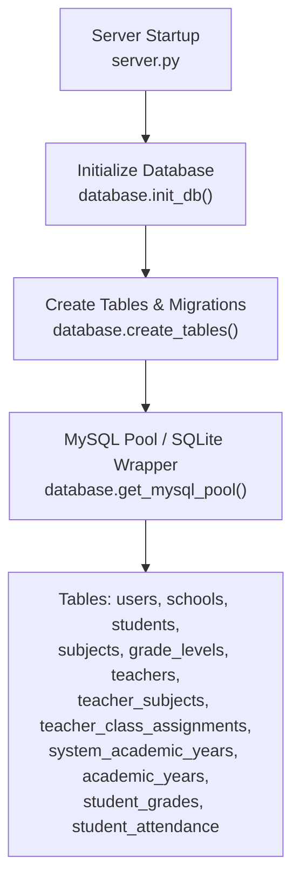
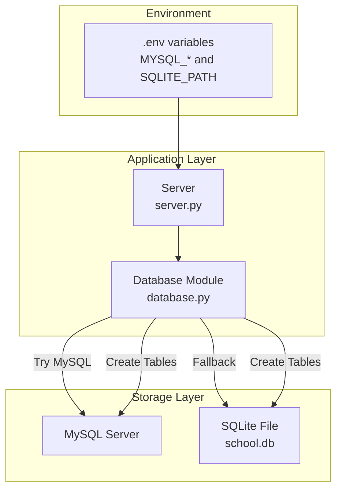
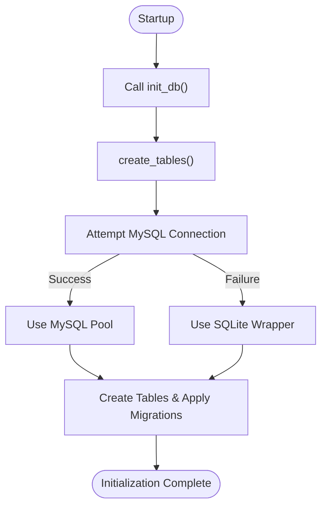
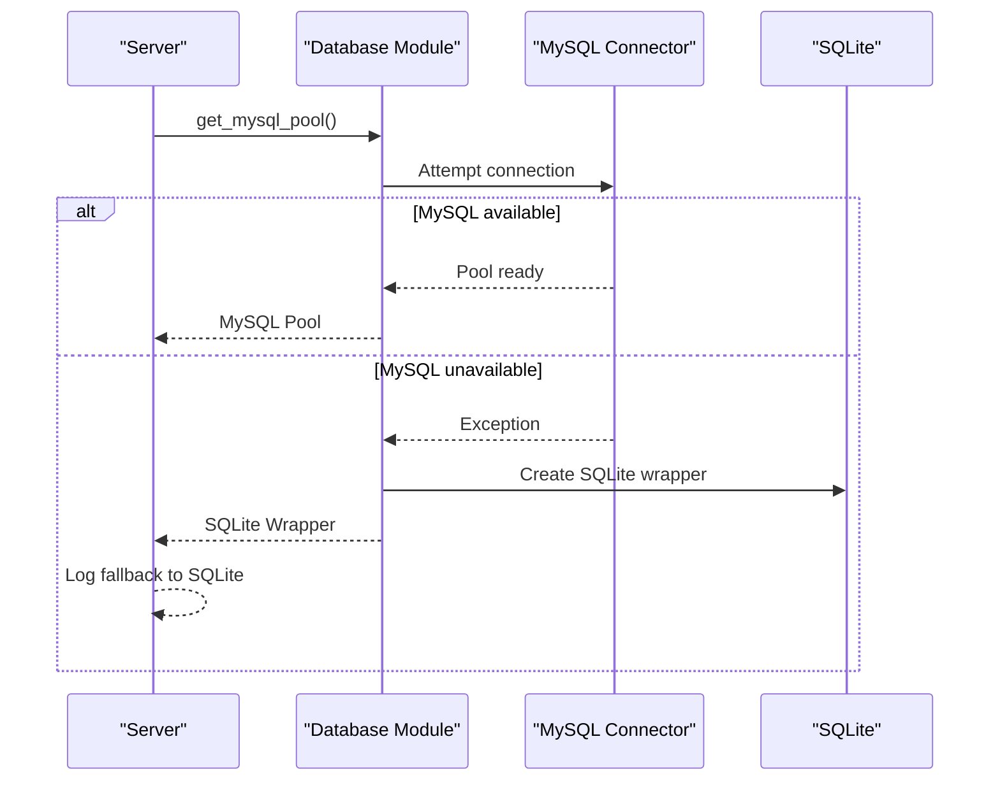
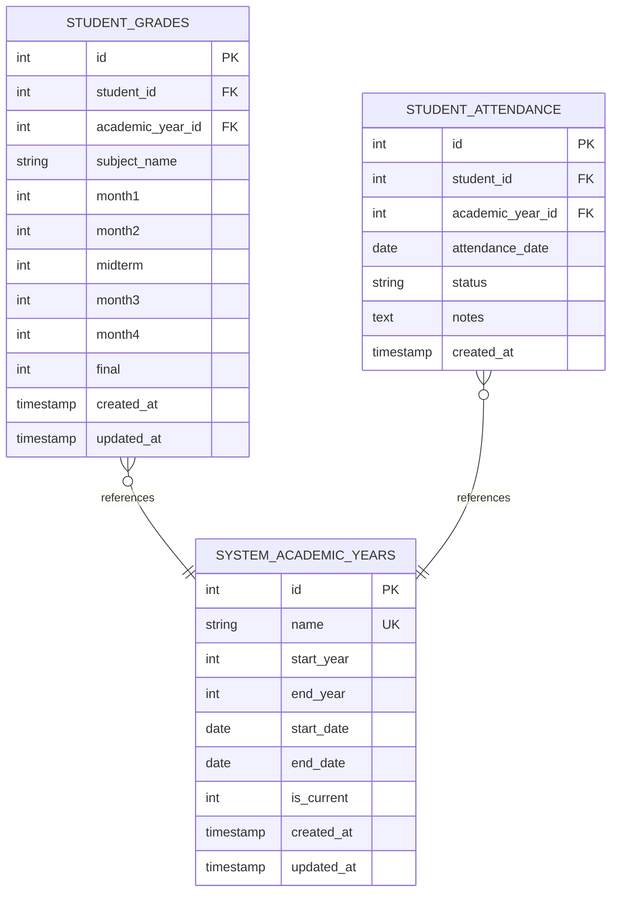
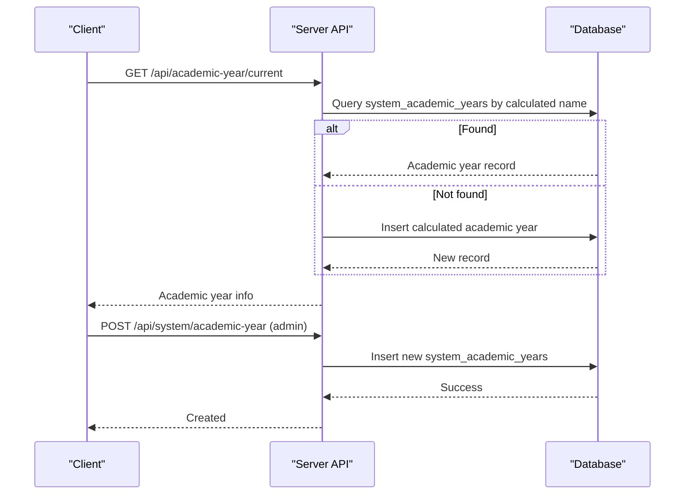
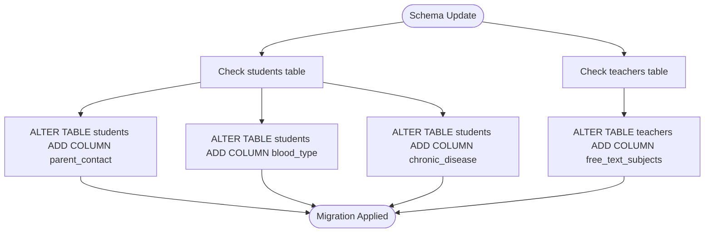
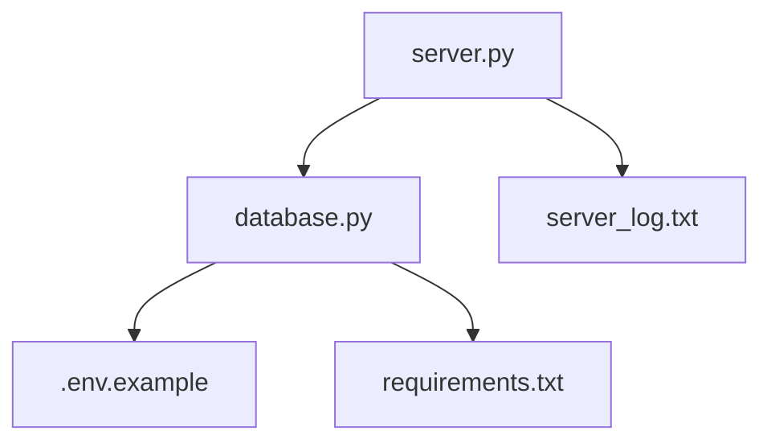

# Migration Strategies

<cite>
**Referenced Files in This Document**
- [database.py](file://database.py)
- [server.py](file://server.py)
- [DATABASE_SETUP.md](file://DATABASE_SETUP.md)
- [DEPLOYMENT_GUIDE.md](file://DEPLOYMENT_GUIDE.md)
- [server_log.txt](file://server_log.txt)
- [delete_academic_years.sql](file://delete_academic_years.sql)
- [.env.example](file://.env.example)
- [requirements.txt](file://requirements.txt)
</cite>

## Table of Contents
1. [Introduction](#introduction)
2. [Project Structure](#project-structure)
3. [Core Components](#core-components)
4. [Architecture Overview](#architecture-overview)
5. [Detailed Component Analysis](#detailed-component-analysis)
6. [Dependency Analysis](#dependency-analysis)
7. [Performance Considerations](#performance-considerations)
8. [Troubleshooting Guide](#troubleshooting-guide)
9. [Conclusion](#conclusion)
10. [Appendices](#appendices)

## Introduction
This document provides a comprehensive migration strategy for the EduFlow database system. It explains the database initialization process, table creation with backward compatibility, and column addition strategies for schema evolution. It documents the migration from the legacy academic_years table to the system_academic_years table, including data preservation and transition strategies. It also covers fallback mechanisms when MySQL is unavailable, automatic SQLite conversion, and environment-based database selection. Finally, it outlines database versioning approaches, schema update procedures, rollback strategies, examples of ALTER TABLE operations, data transformation during migrations, and performance considerations for large-scale migrations.

## Project Structure
The database initialization and migration logic resides primarily in the database module, with supporting deployment and environment configuration files. The server module initializes the database at startup and exposes administrative endpoints for academic year management.

**Diagram sources**
- [server.py](file://server.py#L27-L28)
- [database.py](file://database.py#L120-L338)

**Section sources**
- [server.py](file://server.py#L27-L28)
- [database.py](file://database.py#L120-L338)

## Core Components
- Database initialization and schema creation: The initialization routine creates tables and applies migrations for backward compatibility.
- Environment-based database selection: The system attempts to connect to MySQL and falls back to SQLite when unavailable.
- Academic year schema evolution: The system introduces system_academic_years alongside the legacy academic_years table for controlled migration.
- Administrative endpoints: Endpoints manage academic year lifecycle and ensure data consistency.

**Section sources**
- [database.py](file://database.py#L120-L338)
- [server.py](file://server.py#L1867-L1972)

## Architecture Overview
The system architecture integrates environment-driven database selection with a unified abstraction layer that supports both MySQL and SQLite. The initialization process ensures schema consistency and applies incremental migrations.

**Diagram sources**
- [.env.example](file://.env.example#L23-L28)
- [server.py](file://server.py#L27-L28)
- [database.py](file://database.py#L88-L118)

## Detailed Component Analysis

### Database Initialization and Schema Evolution
- Initialization flow: On startup, the server calls the initialization routine which creates tables and applies migrations.
- Table creation: The routine creates core tables and ensures foreign key constraints are enabled for SQLite.
- Backward compatibility: The legacy academic_years table is retained alongside the new system_academic_years table to support gradual migration.
- Incremental migrations: The routine adds new columns to existing tables using ALTER TABLE statements with defensive error handling.

**Diagram sources**
- [server.py](file://server.py#L27-L28)
- [database.py](file://database.py#L88-L118)
- [database.py](file://database.py#L123-L338)

**Section sources**
- [database.py](file://database.py#L120-L338)

### Environment-Based Database Selection and Fallback
- MySQL-first strategy: The system attempts to establish a MySQL connection pool using environment variables.
- Automatic fallback: If MySQL is unavailable, the system switches to SQLite and uses a wrapper to emulate MySQL behavior.
- Logging: The fallback is logged for visibility during startup and runtime.

**Diagram sources**
- [database.py](file://database.py#L88-L118)
- [server_log.txt](file://server_log.txt#L1-L32)

**Section sources**
- [database.py](file://database.py#L88-L118)
- [server_log.txt](file://server_log.txt#L1-L32)

### Academic Year Migration: From academic_years to system_academic_years
- Dual-table strategy: Both academic_years (legacy) and system_academic_years (centralized) are created during initialization to support migration.
- Centralized management: New administrative endpoints allow creating and managing system-wide academic years.
- Data association: New tables (student_grades, student_attendance) reference system_academic_years to enforce consistency.
- Controlled deletion: A script demonstrates safe deletion of specific academic years with cascading effects via foreign keys.

**Diagram sources**
- [database.py](file://database.py#L261-L320)

**Section sources**
- [database.py](file://database.py#L261-L320)
- [delete_academic_years.sql](file://delete_academic_years.sql#L1-L19)

### Administrative Academic Year Management
- Endpoint to compute and create current academic year if missing.
- Endpoint to list academic years with current year marking overridden by date calculation.
- Endpoint to add a new system-wide academic year (admin-only).

**Diagram sources**
- [server.py](file://server.py#L1867-L1972)

**Section sources**
- [server.py](file://server.py#L1867-L1972)

### Column Addition Strategies for Schema Evolution
- Defensive ALTER TABLE: The initialization routine adds new columns to existing tables with try/catch blocks to avoid failures if columns already exist.
- Example additions: parent_contact, blood_type, chronic_disease for students; free_text_subjects for teachers.

**Diagram sources**
- [database.py](file://database.py#L179-L195)

**Section sources**
- [database.py](file://database.py#L179-L195)

### Data Transformation During Migrations
- JSON normalization: The server normalizes JSON fields (detailed_scores, daily_attendance) to ensure consistent types when retrieved from MySQL.
- Grade validation: The server validates grade scales based on grade level to maintain data integrity during updates.

**Section sources**
- [server.py](file://server.py#L456-L466)
- [server.py](file://server.py#L598-L612)

### Rollback and Recovery Procedures
- Database backups: The deployment guide recommends backing up the database and files before deployment.
- Rollback steps: The guide outlines restoring the database and files, then restarting the server.

**Section sources**
- [DEPLOYMENT_GUIDE.md](file://DEPLOYMENT_GUIDE.md#L18-L25)
- [DEPLOYMENT_GUIDE.md](file://DEPLOYMENT_GUIDE.md#L242-L256)

## Dependency Analysis
The database module encapsulates environment-driven storage selection and provides a unified interface for table creation and migrations. The server module depends on the database module for initialization and exposes administrative endpoints for academic year management.

**Diagram sources**
- [server.py](file://server.py#L11)
- [database.py](file://database.py#L1-L20)
- [.env.example](file://.env.example#L23-L28)
- [requirements.txt](file://requirements.txt#L6)

**Section sources**
- [server.py](file://server.py#L11)
- [database.py](file://database.py#L1-L20)
- [.env.example](file://.env.example#L23-L28)
- [requirements.txt](file://requirements.txt#L6)

## Performance Considerations
- Connection resilience: The fallback to SQLite avoids downtime when MySQL is unavailable, ensuring continuous operation.
- Foreign key enforcement: Enabling foreign keys in SQLite helps maintain referential integrity during migrations.
- Minimal downtime: The dual-table approach allows gradual adoption of system_academic_years without disrupting existing workflows.
- Query volume reduction: The deployment guide highlights reduced database queries post-enhancement, indicating improved efficiency.

**Section sources**
- [server_log.txt](file://server_log.txt#L1-L32)
- [database.py](file://database.py#L132-L136)
- [DEPLOYMENT_GUIDE.md](file://DEPLOYMENT_GUIDE.md#L231-L240)

## Troubleshooting Guide
- MySQL connectivity issues: Verify environment variables and server availability; the system logs fallback to SQLite.
- Schema mismatch: Ensure the initialization routine runs to apply migrations and create required tables.
- Academic year inconsistencies: Use the administrative endpoints to create or adjust academic years; rely on the current year calculation logic.

**Section sources**
- [server_log.txt](file://server_log.txt#L1-L32)
- [database.py](file://database.py#L120-L338)
- [server.py](file://server.py#L1867-L1972)

## Conclusion
The EduFlow database system employs a robust, environment-driven initialization process with automatic fallback to SQLite, ensuring high availability. The schema evolution strategy maintains backward compatibility by retaining legacy tables while introducing centralized academic year management. Administrative endpoints facilitate controlled migration and data consistency. The documented rollback and performance practices further enhance operational reliability.

## Appendices
- Environment configuration: Ensure MYSQL_HOST, MYSQL_USER, MYSQL_PASSWORD, MYSQL_DATABASE, and MYSQL_PORT are set appropriately.
- Requirements: Confirm mysql-connector-python is installed for MySQL support.

**Section sources**
- [.env.example](file://.env.example#L23-L28)
- [requirements.txt](file://requirements.txt#L6)