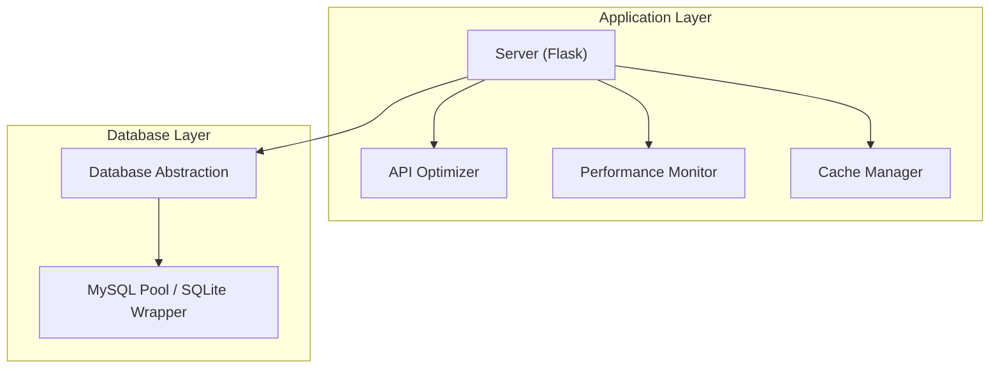
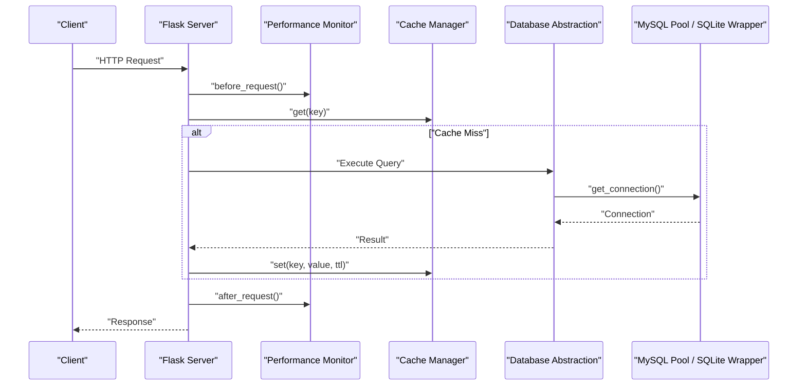
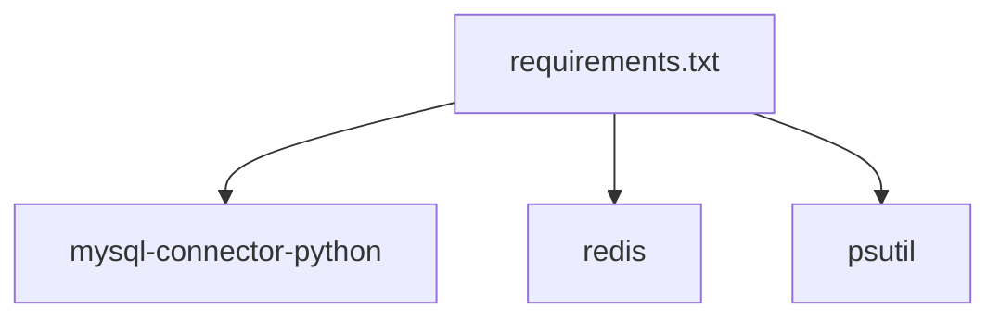
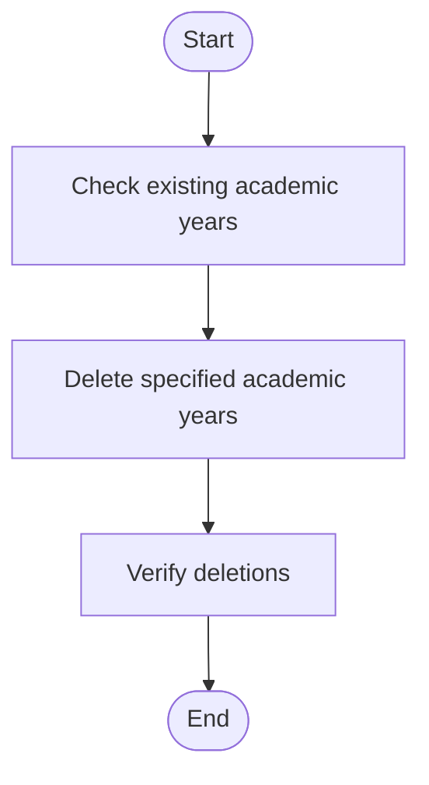

# Performance Optimization

<cite>
**Referenced Files in This Document**
- [database.py](file://database.py)
- [performance.py](file://performance.py)
- [cache.py](file://cache.py)
- [api_optimization.py](file://api_optimization.py)
- [server.py](file://server.py)
- [requirements.txt](file://requirements.txt)
- [DATABASE_SETUP.md](file://DATABASE_SETUP.md)
- [DEPLOYMENT.md](file://DEPLOYMENT.md)
- [delete_academic_years.sql](file://delete_academic_years.sql)
</cite>

## Table of Contents
1. [Introduction](#introduction)
2. [Project Structure](#project-structure)
3. [Core Components](#core-components)
4. [Architecture Overview](#architecture-overview)
5. [Detailed Component Analysis](#detailed-component-analysis)
6. [Dependency Analysis](#dependency-analysis)
7. [Performance Considerations](#performance-considerations)
8. [Troubleshooting Guide](#troubleshooting-guide)
9. [Conclusion](#conclusion)
10. [Appendices](#appendices)

## Introduction
This document provides a comprehensive performance optimization guide for the EduFlow database system. It focuses on indexing strategies for frequently queried columns, query optimization for complex joins, connection pooling configuration, SQLite versus MySQL performance characteristics, query execution plans, caching strategies for educational data, batch operations for bulk processing, report generation optimization, performance monitoring, slow query identification, and database tuning recommendations. It also addresses scalability considerations for multi-school deployments, connection limits, and resource allocation strategies.

## Project Structure
The performance-critical components are organized around four primary modules:
- Database abstraction and connection pooling
- Performance monitoring and metrics
- Caching layer with Redis and in-memory fallback
- API optimization utilities for field selection, batching, and pagination

**Diagram sources**
- [server.py](file://server.py#L1-L120)
- [database.py](file://database.py#L88-L118)
- [performance.py](file://performance.py#L15-L40)
- [cache.py](file://cache.py#L14-L49)
- [api_optimization.py](file://api_optimization.py#L187-L223)

**Section sources**
- [server.py](file://server.py#L1-L120)
- [database.py](file://database.py#L88-L118)
- [performance.py](file://performance.py#L15-L40)
- [cache.py](file://cache.py#L14-L49)
- [api_optimization.py](file://api_optimization.py#L187-L223)

## Core Components
- Database abstraction with automatic MySQL/SQLite fallback and connection pooling
- Performance monitoring with request timing, endpoint statistics, and system metrics
- Redis-backed caching with in-memory fallback and cache invalidation patterns
- API optimization utilities for field selection, pagination, and query batching

Key responsibilities:
- Database: manage connections, create tables, and provide CRUD helpers
- Performance: track request/response times, database query durations, and expose metrics endpoints
- Cache: provide transparent caching with TTL and pattern-based invalidation
- API Optimization: reduce payload sizes and improve throughput via selective field retrieval and batching

**Section sources**
- [database.py](file://database.py#L88-L118)
- [performance.py](file://performance.py#L15-L40)
- [cache.py](file://cache.py#L14-L49)
- [api_optimization.py](file://api_optimization.py#L187-L223)

## Architecture Overview
The system integrates performance monitoring, caching, and API optimization with a unified database abstraction that supports both MySQL and SQLite. The server initializes these components and exposes performance endpoints for diagnostics.

**Diagram sources**
- [server.py](file://server.py#L30-L42)
- [performance.py](file://performance.py#L41-L77)
- [cache.py](file://cache.py#L102-L128)
- [database.py](file://database.py#L88-L118)

## Detailed Component Analysis

### Database Abstraction and Connection Pooling
- Automatic MySQL/SQLite fallback with environment-driven configuration
- MySQL connection pool with configurable pool size
- SQLite adapter that mimics MySQL pool interface and normalizes SQL dialect differences
- Table creation with foreign key enforcement for SQLite and MySQL compatibility

Optimization opportunities:
- Add explicit indexes on frequently queried columns
- Use prepared statements consistently
- Consider connection pool sizing based on expected concurrency

**Section sources**
- [database.py](file://database.py#L13-L18)
- [database.py](file://database.py#L88-L118)
- [database.py](file://database.py#L123-L338)

### Performance Monitoring
- Tracks request durations, endpoint statistics, and system metrics
- Exposes endpoints for performance statistics, endpoint details, and system metrics
- Records database query durations for slow query identification

Implementation highlights:
- Thread-safe statistics with locks
- Sliding windows for recent request and query timings
- Endpoint-level averages and slow endpoint detection

**Section sources**
- [performance.py](file://performance.py#L15-L40)
- [performance.py](file://performance.py#L84-L91)
- [performance.py](file://performance.py#L110-L144)
- [performance.py](file://performance.py#L215-L234)

### Caching Layer
- Redis-backed cache with in-memory fallback
- TTL-based expiration and pattern-based invalidation
- High-level cache manager with predefined strategies for school, student, teacher, academic year, grades, and attendance data

Best practices:
- Use appropriate TTLs for volatile vs stable data
- Invalidate caches on write operations
- Monitor cache hit rates and Redis metrics

**Section sources**
- [cache.py](file://cache.py#L14-L49)
- [cache.py](file://cache.py#L170-L211)
- [cache.py](file://cache.py#L234-L275)

### API Optimization Utilities
- Field selection to reduce payload sizes
- Pagination to limit response sizes
- Query batching to reduce round trips
- Response optimization for compact JSON serialization

**Section sources**
- [api_optimization.py](file://api_optimization.py#L10-L61)
- [api_optimization.py](file://api_optimization.py#L113-L156)
- [api_optimization.py](file://api_optimization.py#L187-L223)
- [api_optimization.py](file://api_optimization.py#L249-L273)

### Query Optimization Techniques for Complex Joins
Common join patterns in the system:
- Teachers to subjects via many-to-many mapping
- Students to schools and academic years
- Class assignments linking teachers, subjects, and academic years

Optimization strategies:
- Ensure foreign keys and indexes on join columns
- Use EXPLAIN/ANALYZE to inspect query plans
- Prefer covering indexes for frequent filters
- Minimize N+1 queries by fetching related data in bulk

**Section sources**
- [database.py](file://database.py#L467-L507)
- [database.py](file://database.py#L509-L550)
- [database.py](file://database.py#L591-L622)
- [database.py](file://database.py#L624-L655)
- [database.py](file://database.py#L657-L698)
- [database.py](file://database.py#L700-L725)

## Dependency Analysis
External dependencies relevant to performance:
- MySQL Connector/Python for connection pooling
- Redis for caching
- psutil for system metrics

**Diagram sources**
- [requirements.txt](file://requirements.txt#L6-L13)

**Section sources**
- [requirements.txt](file://requirements.txt#L6-L13)

## Performance Considerations

### Indexing Strategies for Frequently Queried Columns
Recommended indexes based on the schema and usage patterns:
- schools.code: unique index for fast school lookup
- students.student_code: unique index for student lookup
- students.school_id: index for filtering by school
- students.academic_year_id: index for academic year filtering
- teachers.teacher_code: unique index for teacher lookup
- teachers.school_id: index for filtering by school
- teacher_subjects.teacher_id: index for teacher’s subjects
- teacher_subjects.subject_id: index for subject assignments
- teacher_class_assignments.teacher_id: index for teacher’s classes
- teacher_class_assignments.subject_id: index for subject classes
- teacher_class_assignments.academic_year_id: index for year-specific classes
- system_academic_years.name: unique index for academic year lookup
- student_grades.student_id: index for student grades
- student_grades.academic_year_id: index for year-specific grades
- student_attendance.student_id: index for student attendance
- student_attendance.academic_year_id: index for year-specific attendance

Implementation guidance:
- Create indexes after initial data loads to minimize downtime
- Monitor query plans using EXPLAIN/ANALYZE to validate index usage
- Consider composite indexes for multi-column filters (e.g., school + grade)

**Section sources**
- [database.py](file://database.py#L148-L177)
- [database.py](file://database.py#L198-L206)
- [database.py](file://database.py#L220-L234)
- [database.py](file://database.py#L237-L245)
- [database.py](file://database.py#L248-L259)
- [database.py](file://database.py#L263-L273)
- [database.py](file://database.py#L292-L307)
- [database.py](file://database.py#L310-L320)

### Query Optimization Techniques for Complex Joins
- Normalize join conditions and ensure proper foreign key constraints
- Use INNER JOINs where applicable to avoid unnecessary NULL handling
- Limit SELECT to required columns to reduce I/O
- Use LIMIT and pagination for large result sets
- Batch related queries to reduce round trips

Examples of optimized patterns:
- Fetch teacher subjects with predefined and free-text subjects
- Retrieve students by teacher’s subject grade levels
- Get class assignments with subject and teacher details

**Section sources**
- [database.py](file://database.py#L467-L507)
- [database.py](file://database.py#L509-L550)
- [database.py](file://database.py#L591-L622)
- [database.py](file://database.py#L624-L655)
- [database.py](file://database.py#L657-L698)
- [database.py](file://database.py#L700-L725)

### Database Connection Pooling Configuration
- MySQL pool size is currently set to 10
- Automatic fallback to SQLite when MySQL is unavailable
- Connection reuse reduces overhead and improves throughput

Recommendations:
- Adjust pool size based on concurrent request patterns and database capacity
- Monitor pool utilization and timeouts
- Consider separate pools for read/write workloads if scaling horizontally

**Section sources**
- [database.py](file://database.py#L103-L111)
- [database.py](file://database.py#L88-L118)

### SQLite vs MySQL Performance Characteristics
- MySQL offers robust connection pooling, advanced indexing, and ACID compliance
- SQLite is lightweight and suitable for development/testing or small deployments
- The system automatically falls back to SQLite if MySQL is unavailable

Guidelines:
- Use MySQL for production and multi-school deployments
- Use SQLite for local development and testing
- Ensure consistent SQL dialect normalization for cross-database compatibility

**Section sources**
- [database.py](file://database.py#L24-L87)
- [server_log.txt](file://server_log.txt#L15-L16)

### Query Execution Plans
- Use EXPLAIN/EXPLAIN ANALYZE to inspect query plans
- Look for full table scans and missing indexes
- Optimize WHERE clauses and JOIN orders
- Consider covering indexes for frequently filtered columns

[No sources needed since this section provides general guidance]

### Caching Strategies for Educational Data
- Cache school, student, teacher, academic year, grades, and attendance data with TTLs
- Invalidate caches on write operations to maintain consistency
- Monitor cache hit rates and Redis metrics

**Section sources**
- [cache.py](file://cache.py#L240-L262)
- [cache.py](file://cache.py#L202-L211)

### Batch Operations for Bulk Data Processing
- Use QueryBatcher to group multiple database operations
- Reduce network overhead and improve throughput
- Handle batch failures gracefully and log errors

**Section sources**
- [api_optimization.py](file://api_optimization.py#L62-L111)

### Optimization of Report Generation Queries
- Use field selection to limit payload sizes
- Apply pagination to control response sizes
- Cache report results with appropriate TTLs
- Consider pre-aggregating data for frequently accessed reports

**Section sources**
- [api_optimization.py](file://api_optimization.py#L10-L61)
- [api_optimization.py](file://api_optimization.py#L113-L156)
- [cache.py](file://cache.py#L240-L262)

### Performance Monitoring Approaches
- Track request/response times and endpoint statistics
- Record database query durations
- Expose performance endpoints for diagnostics
- Monitor system resources (CPU, memory, thread count)

**Section sources**
- [performance.py](file://performance.py#L15-L40)
- [performance.py](file://performance.py#L215-L234)

### Slow Query Identification
- Use performance monitor to identify slow endpoints
- Record and analyze database query durations
- Investigate queries with high average or maximum times

**Section sources**
- [performance.py](file://performance.py#L126-L136)
- [performance.py](file://performance.py#L84-L91)

### Database Tuning Recommendations
- Add indexes on frequently queried columns
- Optimize complex joins and reduce N+1 queries
- Use connection pooling and adjust pool size
- Monitor and tune query execution plans
- Implement caching for hot data paths

**Section sources**
- [database.py](file://database.py#L123-L338)
- [performance.py](file://performance.py#L110-L144)

### Scalability Considerations for Multi-School Deployments
- Use MySQL for production and horizontal scaling
- Implement connection pooling and monitor utilization
- Design cache invalidation strategies for multi-school environments
- Consider read replicas for reporting-heavy workloads
- Plan for resource allocation based on concurrent users and data volume

**Section sources**
- [DATABASE_SETUP.md](file://DATABASE_SETUP.md#L3-L71)
- [DEPLOYMENT.md](file://DEPLOYMENT.md#L9-L111)

## Troubleshooting Guide
Common performance issues and resolutions:
- Slow endpoints: Review performance monitor statistics and optimize queries
- High memory usage: Monitor system metrics and adjust pool sizes
- Cache misses: Increase TTLs for stable data and ensure proper invalidation
- Connection pool exhaustion: Increase pool size or reduce long-running queries

**Section sources**
- [performance.py](file://performance.py#L92-L108)
- [cache.py](file://cache.py#L148-L168)
- [database.py](file://database.py#L103-L111)

## Conclusion
By implementing targeted indexing, optimizing complex joins, leveraging connection pooling, adopting caching strategies, and utilizing API optimization utilities, the EduFlow system can achieve significant performance improvements. Continuous monitoring and iterative tuning will ensure sustained performance as the system scales to multi-school deployments.

## Appendices

### Appendix A: Academic Year Cleanup Script
The provided script demonstrates deletion of specific academic years and the impact on related data due to foreign key constraints.

**Diagram sources**
- [delete_academic_years.sql](file://delete_academic_years.sql#L4-L15)

**Section sources**
- [delete_academic_years.sql](file://delete_academic_years.sql#L1-L19)