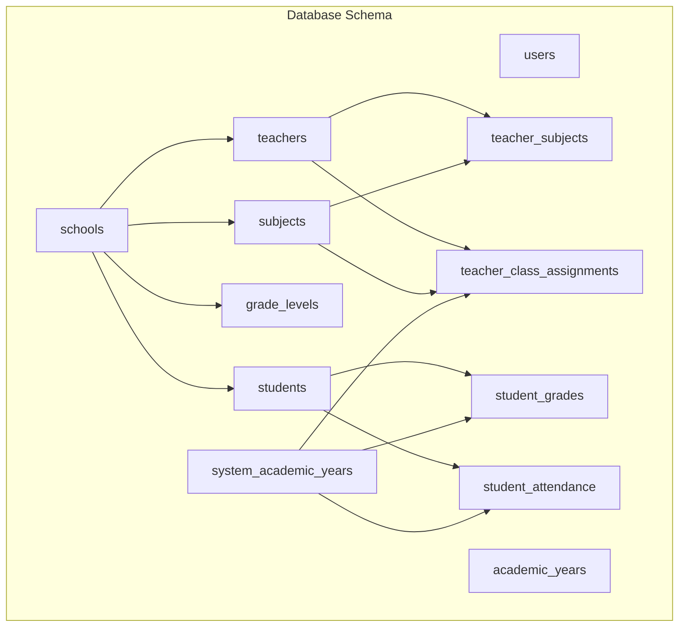
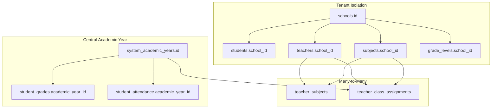
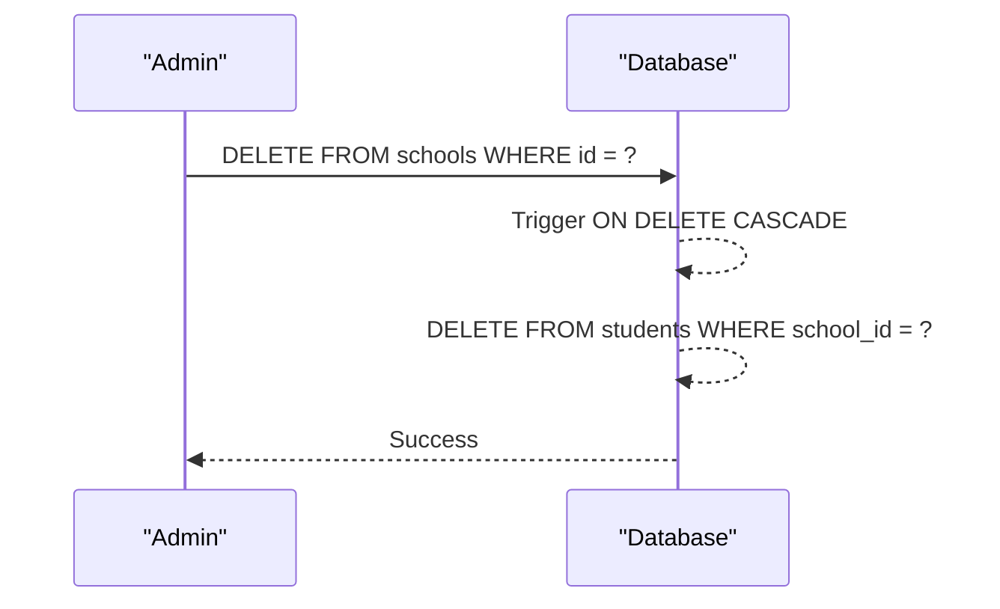
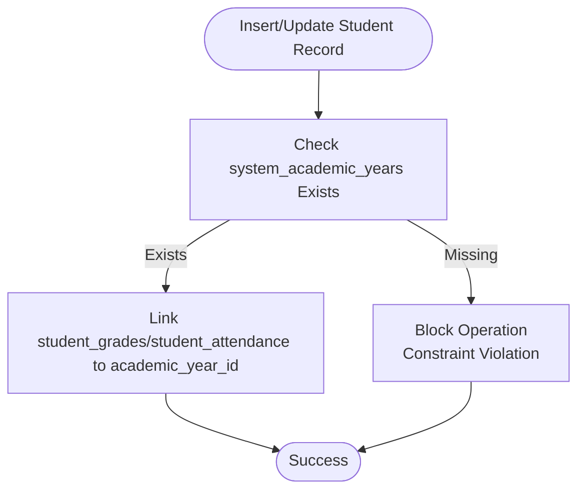
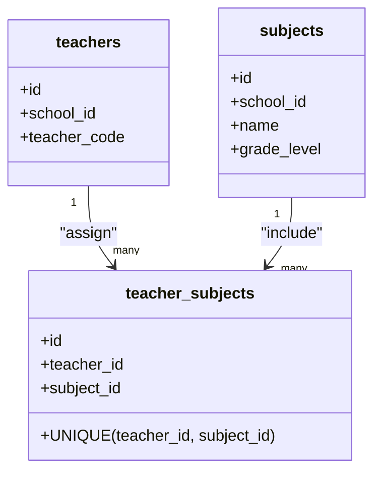
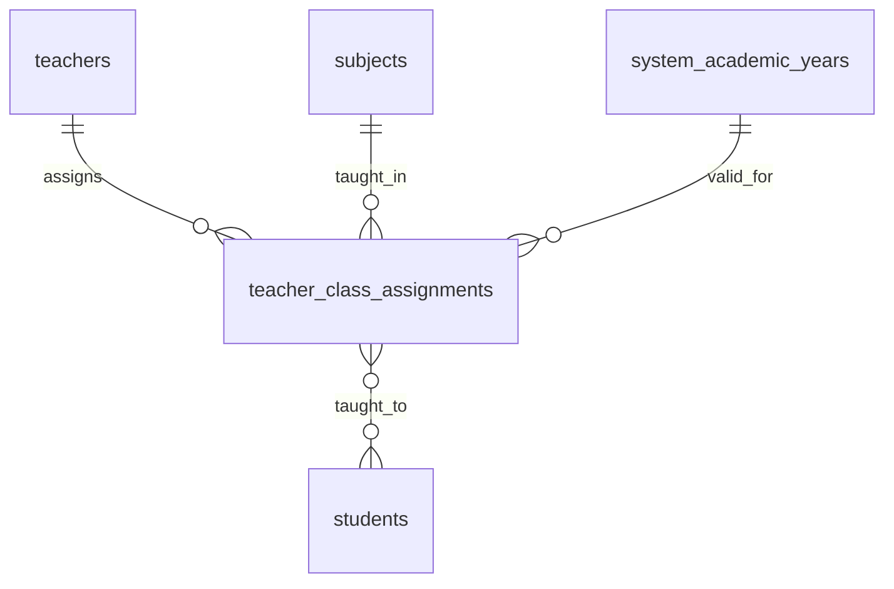
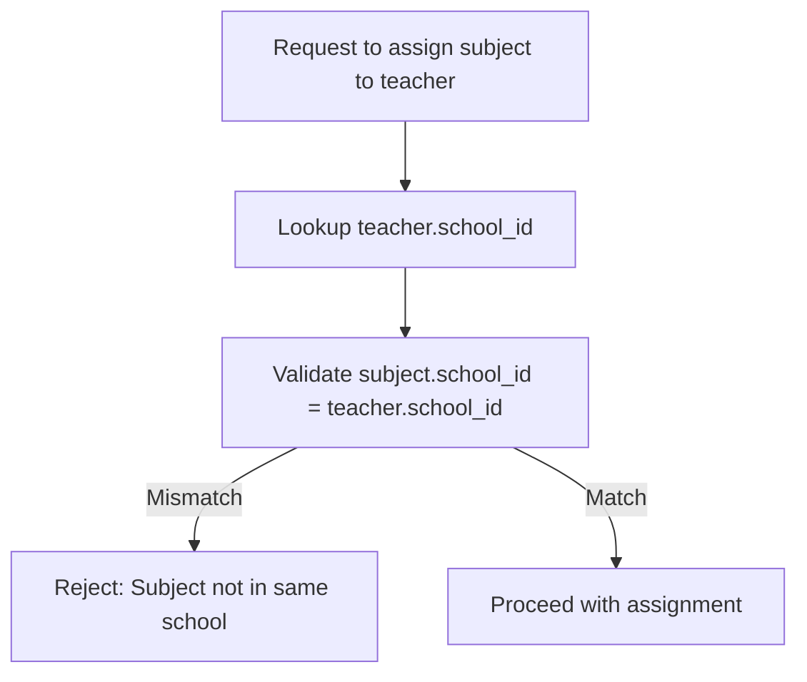
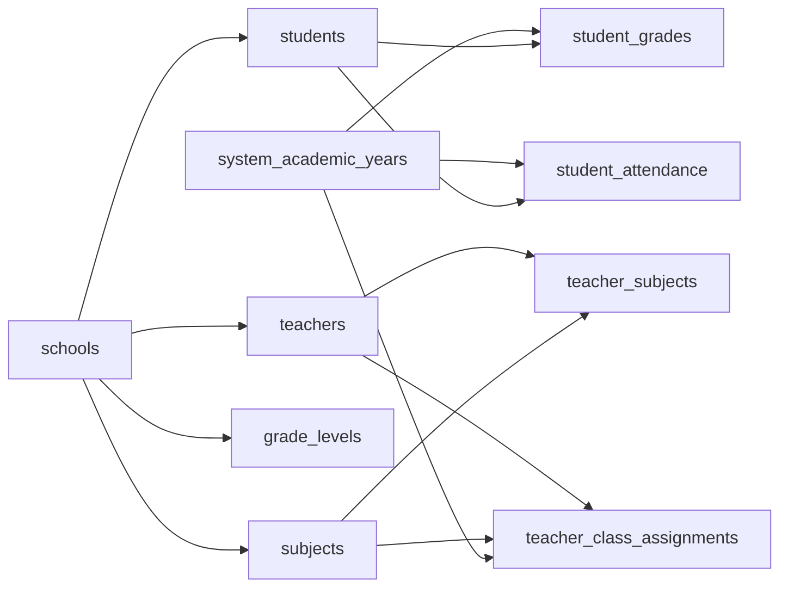

# Relationships & Constraints

<cite>
**Referenced Files in This Document**
- [database.py](file://database.py)
- [server.py](file://server.py)
- [database_helpers.py](file://database_helpers.py)
- [DATABASE_SETUP.md](file://DATABASE_SETUP.md)
- [delete_academic_years.sql](file://delete_academic_years.sql)
</cite>

## Table of Contents
1. [Introduction](#introduction)
2. [Project Structure](#project-structure)
3. [Core Components](#core-components)
4. [Architecture Overview](#architecture-overview)
5. [Detailed Component Analysis](#detailed-component-analysis)
6. [Dependency Analysis](#dependency-analysis)
7. [Performance Considerations](#performance-considerations)
8. [Troubleshooting Guide](#troubleshooting-guide)
9. [Conclusion](#conclusion)

## Introduction
This document explains the database relationships and constraints in the EduFlow system. It focuses on:
- Foreign key relationships and cascading behaviors (deletes from schools to students; updates from system_academic_years to student records)
- Many-to-many relationships via junction tables (teacher_subjects and teacher_class_assignments)
- Unique constraints and composite unique keys
- Tenant isolation using school_id to prevent cross-school data leakage
- Referential integrity rules, constraint names, and the impact of violations on data operations

## Project Structure
The database schema and constraint logic are primarily defined in the database initialization module. Supporting helpers and server endpoints enforce tenant boundaries and manage academic year usage.

**Diagram sources**
- [database.py](file://database.py#L138-L320)

**Section sources**
- [database.py](file://database.py#L138-L320)

## Core Components
- schools: Central tenant entity with unique identifiers and metadata.
- students: Per-school records linked by school_id; cascaded deletes from schools.
- teachers: Per-school staff with unique teacher_code and optional free-text subjects.
- subjects: Per-school subjects with grade-level targeting.
- teacher_subjects: Many-to-many junction between teachers and subjects.
- teacher_class_assignments: Tracks which teachers teach which subjects in which classes and academic years; uses composite unique key.
- system_academic_years: Centralized academic year management applied across all schools.
- student_grades and student_attendance: Enforce referential integrity to system_academic_years and students.

**Section sources**
- [database.py](file://database.py#L138-L320)

## Architecture Overview
The system enforces tenant isolation at the database level using school_id foreign keys. Academic year data is centralized under system_academic_years, referenced by student_grades and student_attendance. Many-to-many relationships are modeled explicitly with junction tables and unique constraints to prevent duplicates.

**Diagram sources**
- [database.py](file://database.py#L138-L320)

## Detailed Component Analysis

### Schools to Students: Cascading Deletes
- Relationship: schools.id → students.school_id
- Behavior: Deleting a school deletes all associated students due to ON DELETE CASCADE
- Impact: Ensures orphaned student records are not left behind when a school is removed

**Diagram sources**
- [database.py](file://database.py#L176-L177)

**Section sources**
- [database.py](file://database.py#L176-L177)

### System Academic Years to Student Records: Referential Integrity and Updates
- Relationship: system_academic_years.id → student_grades.academic_year_id and student_attendance.academic_year_id
- Behavior: student_grades and student_attendance reference system_academic_years; cascading deletes apply here
- Business logic: Academic year updates are centralized; student records remain valid as long as the referenced academic year exists

**Diagram sources**
- [database.py](file://database.py#L292-L320)

**Section sources**
- [database.py](file://database.py#L292-L320)

### Many-to-Many: Teachers and Subjects (teacher_subjects)
- Purpose: Associate teachers with multiple subjects and vice versa
- Junction table: teacher_subjects with foreign keys teacher_id and subject_id
- Uniqueness: UNIQUE(teacher_id, subject_id) prevents duplicate assignments
- Business logic: Teachers can be assigned predefined subjects or free-text subjects (stored separately); retrieval merges both

**Diagram sources**
- [database.py](file://database.py#L236-L245)

**Section sources**
- [database.py](file://database.py#L236-L245)
- [database_helpers.py](file://database_helpers.py#L120-L144)

### Many-to-Many: Teachers, Classes, Subjects, Academic Years (teacher_class_assignments)
- Purpose: Track which teachers teach which subjects in which classes for a given academic year
- Junction table: teacher_class_assignments with foreign keys teacher_id, subject_id, and academic_year_id
- Uniqueness: UNIQUE(teacher_id, class_name, subject_id, academic_year_id) prevents duplicate class assignments
- Cascade behavior: teacher_id and subject_id cascade deletes; academic_year_id SET NULL on delete (no cascade to student records)

**Diagram sources**
- [database.py](file://database.py#L247-L259)

**Section sources**
- [database.py](file://database.py#L247-L259)

### Unique Constraints and Composite Keys
- schools.code: UNIQUE
- students.student_code: UNIQUE
- teachers.teacher_code: UNIQUE
- teacher_subjects: UNIQUE(teacher_id, subject_id)
- teacher_class_assignments: UNIQUE(teacher_id, class_name, subject_id, academic_year_id)
- system_academic_years.name: UNIQUE

These constraints ensure:
- No duplicate identifiers across entities
- No duplicate teacher-subject pairs
- No duplicate class assignments per academic year

**Section sources**
- [database.py](file://database.py#L149-L151)
- [database.py](file://database.py#L163-L164)
- [database.py](file://database.py#L223-L224)
- [database.py](file://database.py#L243-L245)
- [database.py](file://database.py#L257-L258)
- [database.py](file://database.py#L264-L265)

### Tenant Isolation Mechanisms
- school_id in students, subjects, teachers, and grade_levels ties all records to a single school
- All queries that expose data filter by school_id to prevent cross-school leakage
- Helpers validate that subjects belong to the same school as the teacher before assignment

**Diagram sources**
- [database_helpers.py](file://database_helpers.py#L120-L144)

**Section sources**
- [database.py](file://database.py#L162-L162)
- [database.py](file://database.py#L200-L200)
- [database.py](file://database.py#L222-L222)
- [database.py](file://database.py#L211-L211)
- [database_helpers.py](file://database_helpers.py#L120-L144)

### Referential Integrity Rules and Constraint Names
- schools.id primary key
- students.school_id → schools(id) ON DELETE CASCADE
- subjects.school_id → schools(id) ON DELETE CASCADE
- teachers.school_id → schools(id) ON DELETE CASCADE
- teacher_subjects.teacher_id → teachers(id) ON DELETE CASCADE
- teacher_subjects.subject_id → subjects(id) ON DELETE CASCADE
- teacher_class_assignments.teacher_id → teachers(id) ON DELETE CASCADE
- teacher_class_assignments.subject_id → subjects(id) ON DELETE CASCADE
- teacher_class_assignments.academic_year_id → system_academic_years(id) ON DELETE SET NULL
- student_grades.student_id → students(id) ON DELETE CASCADE
- student_grades.academic_year_id → system_academic_years(id) ON DELETE CASCADE
- student_attendance.student_id → students(id) ON DELETE CASCADE
- student_attendance.academic_year_id → system_academic_years(id) ON DELETE CASCADE

Unique constraints:
- schools.code unique
- students.student_code unique
- teachers.teacher_code unique
- teacher_subjects(teacher_id, subject_id) unique
- teacher_class_assignments(teacher_id, class_name, subject_id, academic_year_id) unique
- system_academic_years.name unique

**Section sources**
- [database.py](file://database.py#L176-L177)
- [database.py](file://database.py#L204-L206)
- [database.py](file://database.py#L215-L217)
- [database.py](file://database.py#L232-L234)
- [database.py](file://database.py#L242-L245)
- [database.py](file://database.py#L254-L258)
- [database.py](file://database.py#L304-L307)
- [database.py](file://database.py#L317-L320)

### Impact of Constraint Violations on Data Operations
- Attempting to insert/update with a non-existent school_id in students/subjects/teachers will fail
- Inserting duplicate teacher_code, student_code, or school.code will fail
- Inserting duplicate teacher_id+subject_id into teacher_subjects will fail
- Inserting duplicate class assignment (teacher_id, class_name, subject_id, academic_year_id) will fail
- Deleting a system_academic_years record referenced by student_grades or student_attendance triggers cascading deletes
- Removing a teacher or subject referenced by teacher_subjects or teacher_class_assignments triggers cascading deletes

Operational safeguards:
- Academic year deletion in the server explicitly removes dependent records before deleting the year to ensure referential integrity

**Section sources**
- [server.py](file://server.py#L2060-L2090)
- [delete_academic_years.sql](file://delete_academic_years.sql#L1-L19)

## Dependency Analysis
The following diagram maps key dependencies among tables and how constraints enforce relationships.

**Diagram sources**
- [database.py](file://database.py#L138-L320)

**Section sources**
- [database.py](file://database.py#L138-L320)

## Performance Considerations
- Indexes implied by foreign keys: Foreign keys on school_id and entity references generally imply indexes, improving join performance for tenant-scoped queries.
- Junction tables: Ensure appropriate indexing on teacher_id, subject_id, and composite keys for teacher_class_assignments to optimize frequent lookups.
- Centralized academic years: Queries referencing system_academic_years benefit from indexing on name and id for quick lookups and updates.

[No sources needed since this section provides general guidance]

## Troubleshooting Guide
Common constraint violations and resolutions:
- Duplicate unique keys:
  - schools.code: Ensure unique school code generation and validation
  - students.student_code: Validate uniqueness before insert
  - teachers.teacher_code: Use unique code generation helpers
- Duplicate many-to-many assignments:
  - teacher_subjects: UNIQUE(teacher_id, subject_id) prevents duplicates
  - teacher_class_assignments: UNIQUE(teacher_id, class_name, subject_id, academic_year_id) prevents duplicate class assignments
- Referential integrity errors:
  - Ensure target records exist before insert (e.g., teacher, subject, academic year)
  - When deleting academic year, remove dependent records first or rely on cascading behavior

Operational tips:
- Use helper functions to validate assignments and enforce tenant boundaries
- Prefer centralized academic year management to minimize inconsistencies

**Section sources**
- [database.py](file://database.py#L149-L151)
- [database.py](file://database.py#L163-L164)
- [database.py](file://database.py#L223-L224)
- [database.py](file://database.py#L243-L245)
- [database.py](file://database.py#L257-L258)
- [database_helpers.py](file://database_helpers.py#L120-L144)

## Conclusion
The EduFlow database enforces strong referential integrity and tenant isolation through carefully designed foreign keys and unique constraints. Centralized academic year management simplifies year administration across schools, while junction tables model complex many-to-many relationships with explicit uniqueness guarantees. Adhering to these constraints ensures data consistency, prevents cross-school leakage, and supports scalable operations.