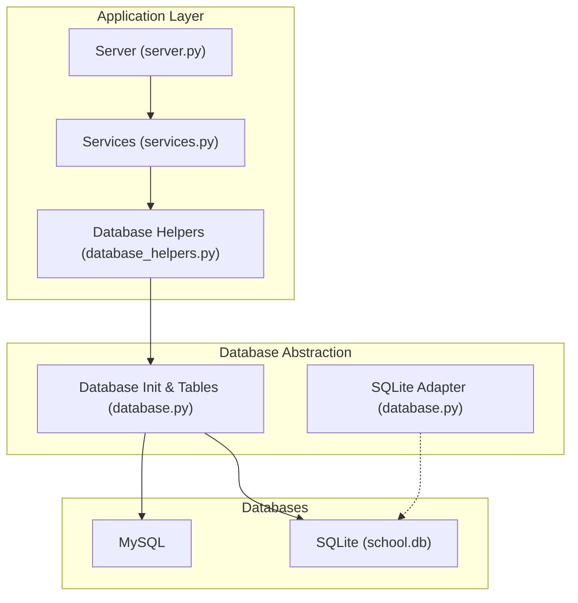
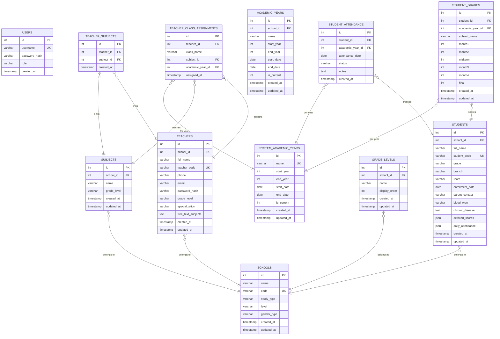
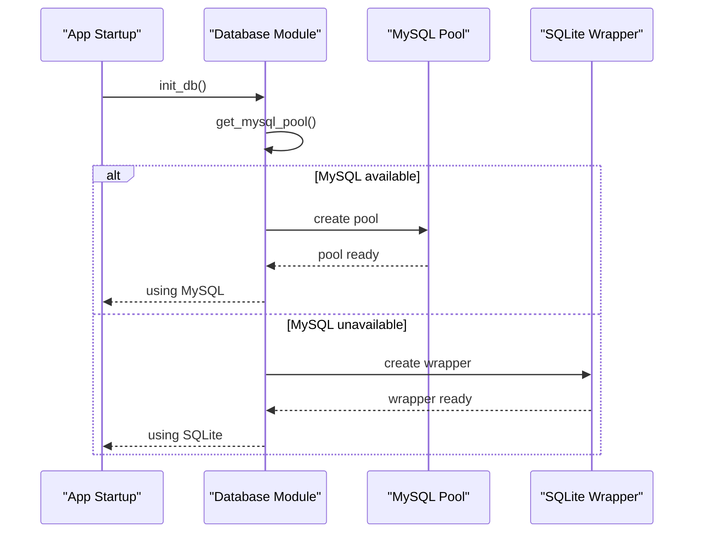
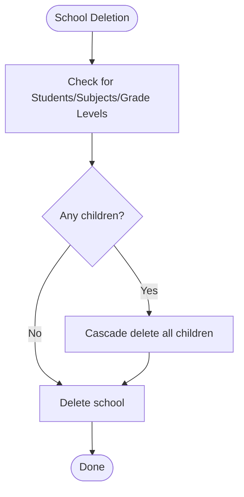
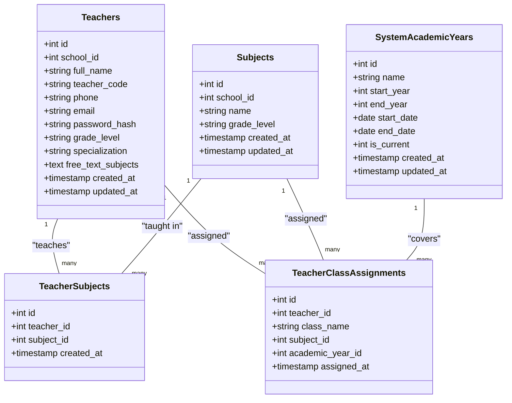
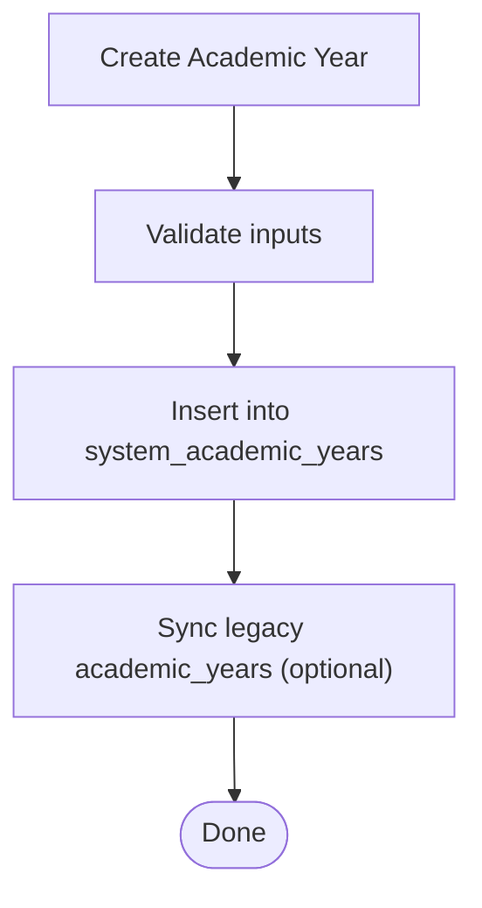
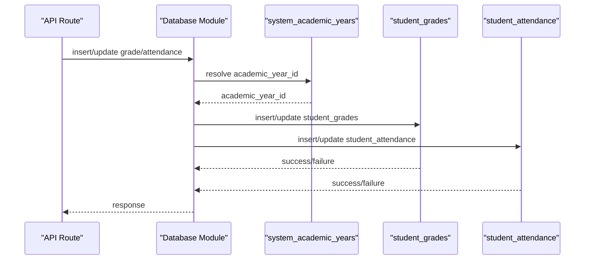
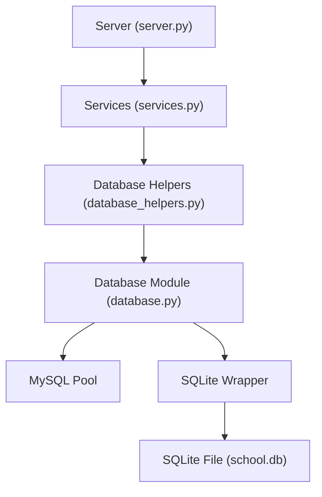

# Schema Overview

<cite>
**Referenced Files in This Document**
- [DATABASE_SETUP.md](file://DATABASE_SETUP.md)
- [database.py](file://database.py)
- [database_helpers.py](file://database_helpers.py)
- [server.py](file://server.py)
- [services.py](file://services.py)
- [delete_academic_years.sql](file://delete_academic_years.sql)
</cite>

## Table of Contents
1. [Introduction](#introduction)
2. [Project Structure](#project-structure)
3. [Core Components](#core-components)
4. [Architecture Overview](#architecture-overview)
5. [Detailed Component Analysis](#detailed-component-analysis)
6. [Dependency Analysis](#dependency-analysis)
7. [Performance Considerations](#performance-considerations)
8. [Troubleshooting Guide](#troubleshooting-guide)
9. [Conclusion](#conclusion)

## Introduction
This document provides a comprehensive schema overview for the EduFlow database design. It details the complete entity relationship model across the 11 core tables, explains primary and foreign key relationships, and demonstrates how schools isolate data through foreign key constraints. It also documents how students are linked to schools, how teachers connect to subjects and classes, and how the system supports both MySQL and SQLite through a unified abstraction layer. Finally, it describes many-to-many relationships using junction tables and outlines the dual-engine architecture.

## Project Structure
The database schema is defined programmatically in the backend and initialized at startup. The initialization logic creates all tables and enforces referential integrity. The application supports MySQL as the primary engine and falls back to SQLite when MySQL is unavailable. A dedicated abstraction layer translates MySQL DDL and SQL syntax to SQLite-compatible equivalents.

**Diagram sources**
- [database.py](file://database.py#L88-L118)
- [server.py](file://server.py#L1-L50)
- [services.py](file://services.py#L12-L43)

**Section sources**
- [DATABASE_SETUP.md](file://DATABASE_SETUP.md#L1-L71)
- [database.py](file://database.py#L88-L118)

## Core Components
This section summarizes the 11 tables and their roles in the EduFlow system. Each table’s purpose, primary key, and foreign key relationships are explained below.

- users
  - Purpose: Stores administrative accounts with hashed passwords and roles.
  - Primary key: id
  - Constraints: Unique username; default role admin; timestamps.

- schools
  - Purpose: Defines school metadata and attributes.
  - Primary key: id
  - Constraints: Unique code; study_type, level, gender_type; timestamps.

- students
  - Purpose: Holds student records linked to a school.
  - Primary key: id
  - Foreign key: school_id → schools.id (CASCADE)
  - Constraints: Unique student_code; JSON fields for detailed_scores and daily_attendance; timestamps.

- teachers
  - Purpose: Manages teacher profiles and affiliations.
  - Primary key: id
  - Foreign key: school_id → schools.id (CASCADE)
  - Constraints: Unique teacher_code; optional free-text subjects; timestamps.

- subjects
  - Purpose: Subject catalog per school.
  - Primary key: id
  - Foreign key: school_id → schools.id (CASCADE)
  - Constraints: name, grade_level; timestamps.

- grade_levels
  - Purpose: Custom grade levels per school.
  - Primary key: id
  - Foreign key: school_id → schools.id (CASCADE)
  - Constraints: display_order; timestamps.

- teacher_subjects (junction)
  - Purpose: Many-to-many relationship between teachers and subjects.
  - Primary key: id
  - Foreign keys: teacher_id → teachers.id (CASCADE), subject_id → subjects.id (CASCADE)
  - Constraints: unique combination of teacher_id and subject_id.

- teacher_class_assignments (junction)
  - Purpose: Tracks which teachers are assigned to which classes for subjects and academic years.
  - Primary key: id
  - Foreign keys: teacher_id → teachers.id (CASCADE), subject_id → subjects.id (CASCADE), academic_year_id → system_academic_years.id (SET NULL)
  - Constraints: unique combination of teacher_id, class_name, subject_id, academic_year_id.

- system_academic_years
  - Purpose: Centralized academic year management for all schools.
  - Primary key: id
  - Constraints: unique name; start/end year/date; is_current flag; timestamps.

- academic_years (legacy)
  - Purpose: Legacy per-school academic year table maintained for backward compatibility.
  - Primary key: id
  - Foreign key: school_id → schools.id (CASCADE)
  - Constraints: name, start/end year/date; is_current flag; timestamps.

- student_grades
  - Purpose: Stores student grades per academic year and subject.
  - Primary key: id
  - Foreign keys: student_id → students.id (CASCADE), academic_year_id → system_academic_years.id (CASCADE)
  - Constraints: monthly and final scores; timestamps.

- student_attendance
  - Purpose: Records student attendance per academic year and date.
  - Primary key: id
  - Foreign keys: student_id → students.id (CASCADE), academic_year_id → system_academic_years.id (CASCADE)
  - Constraints: status with default present; notes; timestamps.

**Section sources**
- [database.py](file://database.py#L138-L320)

## Architecture Overview
The database architecture centers around a central academic year table (system_academic_years) that is shared across all schools, while per-school isolation is enforced by foreign keys on students, subjects, and grade_levels. Teachers are associated with schools and subjects via junction tables. The abstraction layer ensures MySQL and SQLite compatibility by translating syntax and types.

**Diagram sources**
- [database.py](file://database.py#L138-L320)

## Detailed Component Analysis

### Dual MySQL/SQLite Support Architecture
The system initializes a MySQL connection pool by default. If MySQL is unavailable, it falls back to SQLite and wraps it to mimic the MySQL interface. The abstraction layer performs syntax translation and type normalization to keep SQL logic identical across engines.

Key mechanisms:
- MySQL pool creation and fallback to SQLite wrapper
- SQLite adapter converts placeholders, JSON types, and auto-increment syntax
- Foreign key enforcement for SQLite via PRAGMA
- Consistent query interface for both engines

**Diagram sources**
- [database.py](file://database.py#L88-L118)

**Section sources**
- [database.py](file://database.py#L23-L118)

### Schools Isolation Through Foreign Keys
Schools act as the top-level isolating entity. All student, subject, and grade-level records are constrained to belong to a specific school via foreign keys. Deleting a school cascades to all child records, preventing orphaned data.

- students.school_id → schools.id (CASCADE)
- subjects.school_id → schools.id (CASCADE)
- grade_levels.school_id → schools.id (CASCADE)
- teachers.school_id → schools.id (CASCADE)

**Diagram sources**
- [database.py](file://database.py#L176)
- [database.py](file://database.py#L205)
- [database.py](file://database.py#L216)
- [database.py](file://database.py#L233)

**Section sources**
- [database.py](file://database.py#L176)
- [database.py](file://database.py#L205)
- [database.py](file://database.py#L216)
- [database.py](file://database.py#L233)

### Students Linked to Schools
Each student record includes a school_id that references schools.id. This ensures all student data remains scoped to a single school. Students also carry JSON fields for detailed_scores and daily_attendance, enabling flexible storage of per-year metrics.

- Primary key: id
- Foreign key: school_id → schools.id (CASCADE)
- Unique constraint: student_code

**Section sources**
- [database.py](file://database.py#L160-L177)

### Teachers Connected to Subjects and Classes
Teachers are associated with subjects and classes through two junction tables:

- teacher_subjects: Many-to-many between teachers and subjects
  - Composite unique key: (teacher_id, subject_id)
  - Foreign keys: teacher_id → teachers.id (CASCADE), subject_id → subjects.id (CASCADE)

- teacher_class_assignments: Tracks teacher-class-subject-academic_year assignments
  - Composite unique key: (teacher_id, class_name, subject_id, academic_year_id)
  - Foreign keys: teacher_id → teachers.id (CASCADE), subject_id → subjects.id (CASCADE), academic_year_id → system_academic_years.id (SET NULL)

**Diagram sources**
- [database.py](file://database.py#L236-L259)
- [database.py](file://database.py#L261-L273)

**Section sources**
- [database.py](file://database.py#L236-L259)

### Academic Year Management
The system uses a centralized academic year table (system_academic_years) shared across all schools. Legacy per-school academic years (academic_years) remain for backward compatibility.

- system_academic_years: Centralized academic year definition with is_current flag
- academic_years: Per-school academic year table with foreign key to schools

**Diagram sources**
- [database.py](file://database.py#L261-L289)

**Section sources**
- [database.py](file://database.py#L261-L289)

### Grades and Attendance Tables
Grades and attendance are recorded per academic year using the centralized system_academic_years table. This ensures consistent year boundaries across all schools.

- student_grades: Per-student, per-year, per-subject scores
- student_attendance: Per-student, per-year, per-date attendance records

**Diagram sources**
- [database.py](file://database.py#L291-L320)
- [server.py](file://server.py#L2742-L2771)

**Section sources**
- [database.py](file://database.py#L291-L320)
- [server.py](file://server.py#L2742-L2771)

### Many-to-Many Relationships
The system uses explicit junction tables to manage many-to-many relationships:

- teacher_subjects: Links teachers to subjects
- teacher_class_assignments: Links teachers to classes, subjects, and academic years

These tables enforce uniqueness on combinations of identifiers to prevent duplicate assignments.

**Section sources**
- [database.py](file://database.py#L236-L259)

### Teacher Subject Assignment Utilities
The database helpers module provides utilities to manage teacher-subject assignments, including validation, assignment updates, and retrieval of assigned subjects.

- get_teacher_subject_assignments
- assign_subjects_to_teacher
- remove_subject_from_teacher
- get_teachers_by_subject
- validate_subject_assignment
- get_teacher_with_subjects

These functions encapsulate common operations and ensure data integrity.

**Section sources**
- [database_helpers.py](file://database_helpers.py#L12-L364)

## Dependency Analysis
The following diagram shows how the application components depend on the database layer and how the abstraction layer mediates between engines.

**Diagram sources**
- [server.py](file://server.py#L1-L50)
- [services.py](file://services.py#L12-L43)
- [database_helpers.py](file://database_helpers.py#L9-L10)
- [database.py](file://database.py#L88-L118)

**Section sources**
- [server.py](file://server.py#L1-L50)
- [services.py](file://services.py#L12-L43)
- [database_helpers.py](file://database_helpers.py#L9-L10)
- [database.py](file://database.py#L88-L118)

## Performance Considerations
- Use indexes on frequently queried columns (e.g., student_code, teacher_code, academic_year_id) to improve lookup performance.
- Normalize data to reduce duplication and maintain referential integrity.
- Prefer batch operations for bulk inserts/updates to minimize round trips.
- Monitor foreign key cascade operations during deletions to avoid long-running cascades on large datasets.

## Troubleshooting Guide
Common issues and resolutions:

- MySQL connection failures
  - Cause: Incorrect credentials or unreachable server.
  - Resolution: Verify environment variables and network connectivity; the system will fall back to SQLite automatically.

- SQLite foreign key constraints
  - Cause: Missing PRAGMA enablement.
  - Resolution: The abstraction layer enables foreign keys for SQLite; ensure the wrapper is used.

- Academic year deletion impact
  - Cause: Foreign key constraints on student_grades and student_attendance.
  - Resolution: Use the provided script to safely delete specific academic years; note that related records will be removed due to CASCADE.

- Teacher code generation collisions
  - Cause: Duplicate teacher codes.
  - Resolution: The system generates unique codes with multiple entropy sources and retries; verify uniqueness constraints and retry if needed.

**Section sources**
- [database.py](file://database.py#L88-L118)
- [delete_academic_years.sql](file://delete_academic_years.sql#L1-L19)

## Conclusion
The EduFlow database design establishes clear isolation boundaries through schools and enforces referential integrity across all entities. The dual MySQL/SQLite architecture, powered by a robust abstraction layer, ensures consistent behavior across environments. The many-to-many relationships for teachers and subjects, along with centralized academic year management, provide flexibility and scalability for diverse school systems.