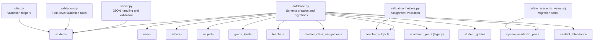
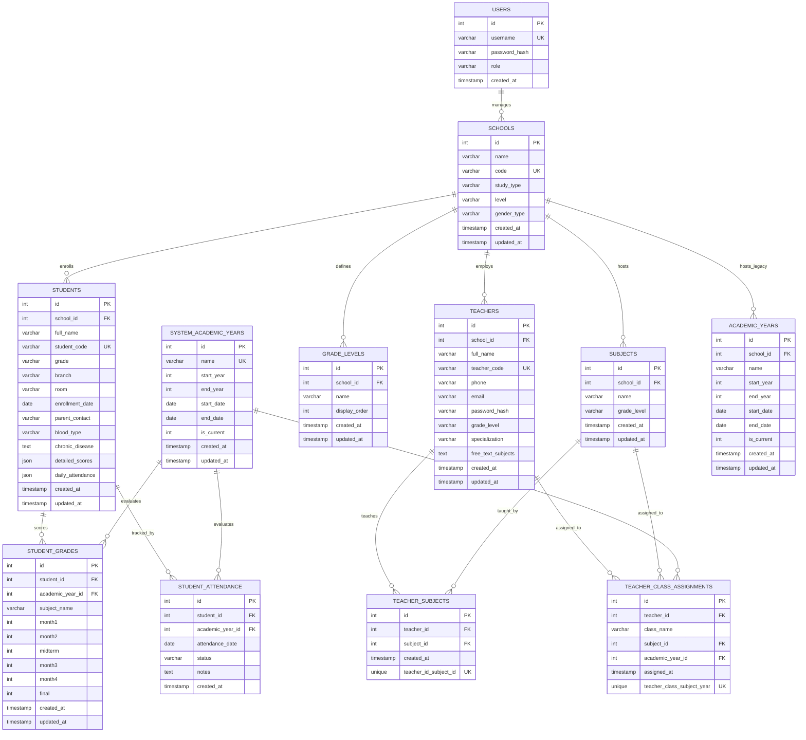
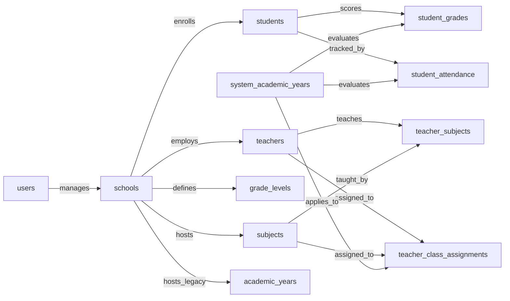

# Table Definitions

<cite>
**Referenced Files in This Document**
- [database.py](file://database.py)
- [server.py](file://server.py)
- [validation.py](file://validation.py)
- [utils.py](file://utils.py)
- [validation_helpers.py](file://validation_helpers.py)
- [DATABASE_SETUP.md](file://DATABASE_SETUP.md)
- [delete_academic_years.sql](file://delete_academic_years.sql)
</cite>

## Table of Contents
1. [Introduction](#introduction)
2. [Project Structure](#project-structure)
3. [Core Components](#core-components)
4. [Architecture Overview](#architecture-overview)
5. [Detailed Component Analysis](#detailed-component-analysis)
6. [Dependency Analysis](#dependency-analysis)
7. [Performance Considerations](#performance-considerations)
8. [Troubleshooting Guide](#troubleshooting-guide)
9. [Conclusion](#conclusion)

## Introduction
This document provides comprehensive table definition documentation for the EduFlow system. It covers all database tables, their fields, data types, constraints, defaults, and foreign key relationships. It also documents specialized fields such as JSON columns (detailed_scores, daily_attendance), boolean flags (is_current), computed fields, and migration scripts. Business logic and validation rules are explained to help administrators and developers understand how data integrity is enforced and how the system supports educational management workflows.

## Project Structure
The database schema is defined programmatically in the backend and initialized at startup. The primary schema creation script resides in the database initialization module, with additional migration steps handled dynamically for backward compatibility.

**Diagram sources**
- [database.py](file://database.py#L123-L338)
- [server.py](file://server.py#L441-L467)
- [validation.py](file://validation.py#L265-L318)
- [utils.py](file://utils.py#L187-L186)
- [validation_helpers.py](file://validation_helpers.py#L12-L146)
- [delete_academic_years.sql](file://delete_academic_years.sql#L1-L19)

**Section sources**
- [database.py](file://database.py#L123-L338)
- [DATABASE_SETUP.md](file://DATABASE_SETUP.md#L1-L71)

## Core Components
- Schema creation and migrations are performed in a single module that creates tables and adds new columns when needed.
- JSON fields are handled with special care in the server layer to ensure proper parsing and validation.
- Validation logic ensures data integrity at both the database and application levels.

**Section sources**
- [database.py](file://database.py#L123-L338)
- [server.py](file://server.py#L441-L467)
- [validation.py](file://validation.py#L265-L318)
- [utils.py](file://utils.py#L187-L186)

## Architecture Overview
The system uses a central database initialization routine to create tables and enforce referential integrity. Specialized JSON fields are stored as JSON in MySQL and treated as TEXT in SQLite for compatibility. Validation occurs both at the application level and through database constraints.

**Diagram sources**
- [database.py](file://database.py#L138-L338)

## Detailed Component Analysis

### users
- Purpose: Stores administrative and system user accounts.
- Constraints:
  - id: Auto-increment primary key.
  - username: Unique, not null.
  - role: Not null, default 'admin'.
  - created_at: Timestamp default current timestamp.
- Typical data:
  - Example admin user created at initialization with hashed password and role 'admin'.

**Section sources**
- [database.py](file://database.py#L139-L145)
- [database.py](file://database.py#L322-L332)

### schools
- Purpose: Defines educational institutions with metadata.
- Constraints:
  - id: Auto-increment primary key.
  - code: Unique, not null.
  - name, study_type, level, gender_type: Not null.
  - created_at, updated_at: Timestamp defaults.
- Unique constraints:
  - code: Ensures globally unique school identifier.
- Typical data:
  - School record with name, study type, level, gender type, and timestamps.

**Section sources**
- [database.py](file://database.py#L147-L157)
- [database.py](file://database.py#L340-L365)

### students
- Purpose: Stores student records linked to a school.
- Constraints:
  - id: Auto-increment primary key.
  - school_id: Foreign key to schools, cascade delete.
  - student_code: Unique, not null.
  - full_name, grade, room: Not null.
  - enrollment_date: Date.
  - parent_contact: Optional phone contact.
  - blood_type: Optional, restricted to predefined values.
  - chronic_disease: Optional text.
  - detailed_scores, daily_attendance: JSON fields.
  - created_at, updated_at: Timestamp defaults.
- Specialized fields:
  - detailed_scores: JSON object keyed by subject name; stores per-period scores. Validated to ensure numeric ranges based on grade level.
  - daily_attendance: JSON object keyed by date; stores daily presence status and notes.
- Business logic:
  - JSON fields are parsed and normalized in server routes; invalid JSON is coerced to empty objects.
  - Score validation enforces 0–10 for elementary grades 1–4 and 0–100 for others.
- Typical data:
  - Student with unique student_code, grade, room, and empty JSON placeholders for detailed_scores and daily_attendance.

**Section sources**
- [database.py](file://database.py#L159-L177)
- [server.py](file://server.py#L441-L467)
- [server.py](file://server.py#L564-L656)
- [server.py](file://server.py#L683-L766)
- [validation.py](file://validation.py#L265-L279)
- [utils.py](file://utils.py#L187-L186)

### subjects
- Purpose: Defines subjects offered by a school.
- Constraints:
  - id: Auto-increment primary key.
  - school_id: Foreign key to schools, cascade delete.
  - name: Not null.
  - grade_level: Optional.
  - created_at, updated_at: Timestamp defaults.
- Typical data:
  - Subject with name and grade level scoped to a school.

**Section sources**
- [database.py](file://database.py#L197-L206)

### grade_levels
- Purpose: Allows schools to define custom grade levels.
- Constraints:
  - id: Auto-increment primary key.
  - school_id: Foreign key to schools, cascade delete.
  - name: Not null.
  - display_order: Default 0.
  - created_at, updated_at: Timestamp defaults.
- Typical data:
  - Grade level entry with display order for sorting.

**Section sources**
- [database.py](file://database.py#L208-L217)

### teachers
- Purpose: Manages educators and their attributes.
- Constraints:
  - id: Auto-increment primary key.
  - school_id: Foreign key to schools, cascade delete.
  - teacher_code: Unique, not null.
  - full_name: Not null.
  - phone, email: Optional.
  - password_hash: Optional for authentication.
  - grade_level, specialization: Optional.
  - free_text_subjects: Optional text for free-form subjects.
  - created_at, updated_at: Timestamp defaults.
- Specialized fields:
  - free_text_subjects: Comma-separated list of subjects stored as text; later combined with predefined subjects for assignment display.
- Typical data:
  - Teacher with unique teacher_code, optional contact info, and optional free-text subjects.

**Section sources**
- [database.py](file://database.py#L219-L234)
- [database.py](file://database.py#L179-L195)

### teacher_subjects
- Purpose: Many-to-many relationship between teachers and subjects.
- Constraints:
  - id: Auto-increment primary key.
  - teacher_id, subject_id: Foreign keys to teachers and subjects, cascade delete.
  - created_at: Timestamp default.
  - teacher_id_subject_id: Unique composite index.
- Typical data:
  - Assignment entries linking a teacher to one or more subjects.

**Section sources**
- [database.py](file://database.py#L236-L245)

### teacher_class_assignments
- Purpose: Tracks which teachers are assigned to teach specific subjects in classes for academic years.
- Constraints:
  - id: Auto-increment primary key.
  - teacher_id: Foreign key to teachers, cascade delete.
  - class_name: Not null.
  - subject_id: Foreign key to subjects, cascade delete.
  - academic_year_id: Foreign key to system_academic_years, set null on delete.
  - assigned_at: Timestamp default.
  - teacher_class_subject_year: Unique composite index.
- Typical data:
  - Assignment entry for a teacher/class/subject combination within an academic year.

**Section sources**
- [database.py](file://database.py#L247-L259)

### system_academic_years
- Purpose: Centralized academic year management for the entire system.
- Constraints:
  - id: Auto-increment primary key.
  - name: Unique, not null.
  - start_year, end_year: Not null.
  - start_date, end_date: Optional dates.
  - is_current: Integer default 0 (boolean-like flag).
  - created_at, updated_at: Timestamp defaults.
- Typical data:
  - Academic year with name like "YYYY/YYYY", year range, and optional current flag.

**Section sources**
- [database.py](file://database.py#L261-L273)

### academic_years (legacy)
- Purpose: Legacy table for per-school academic year management; maintained for backward compatibility.
- Constraints:
  - id: Auto-increment primary key.
  - school_id: Foreign key to schools, cascade delete.
  - name, start_year, end_year: Not null.
  - start_date, end_date: Optional dates.
  - is_current: Integer default 0.
  - created_at, updated_at: Timestamp defaults.
- Typical data:
  - Per-school academic year entries mirroring system_academic_years.

**Section sources**
- [database.py](file://database.py#L275-L289)

### student_grades
- Purpose: Stores per-student, per-academic-year grade records for subjects.
- Constraints:
  - id: Auto-increment primary key.
  - student_id: Foreign key to students, cascade delete.
  - academic_year_id: Foreign key to system_academic_years, cascade delete.
  - subject_name: Not null.
  - month1–month4, midterm, final: Integer defaults 0.
  - created_at, updated_at: Timestamp defaults.
- Typical data:
  - Grade record with monthly and terminal scores for a subject in a given academic year.

**Section sources**
- [database.py](file://database.py#L291-L307)

### student_attendance
- Purpose: Tracks daily attendance for students within academic years.
- Constraints:
  - id: Auto-increment primary key.
  - student_id: Foreign key to students, cascade delete.
  - academic_year_id: Foreign key to system_academic_years, cascade delete.
  - attendance_date: Not null.
  - status: Default "present".
  - notes: Optional text.
  - created_at: Timestamp default.
- Typical data:
  - Attendance record with date, status, and optional notes.

**Section sources**
- [database.py](file://database.py#L309-L320)

## Dependency Analysis
- Referential integrity is enforced via foreign keys across tables.
- JSON fields are normalized in server routes to ensure consistent representation.
- Unique constraints on codes (school_code, student_code, teacher_code) ensure global uniqueness and simplify lookups.

**Diagram sources**
- [database.py](file://database.py#L138-L338)

**Section sources**
- [database.py](file://database.py#L138-L338)

## Performance Considerations
- JSON fields (detailed_scores, daily_attendance) are stored as JSON in MySQL and TEXT in SQLite. Parsing occurs in server routes to ensure consistent handling.
- Unique constraints on codes enable efficient lookups and reduce duplication risks.
- Cascade deletes ensure referential integrity without manual cleanup.

[No sources needed since this section provides general guidance]

## Troubleshooting Guide
- Unique constraint violations:
  - school.code, student.student_code, teacher.teacher_code must be unique. If conflicts occur, regenerate codes using provided generators.
- JSON parsing issues:
  - Server routes normalize JSON fields; malformed JSON is coerced to empty objects. Validate JSON before insertion.
- Academic year deletion:
  - Deleting from system_academic_years cascades to related tables due to foreign key constraints. Use provided migration script to safely remove specific years.

**Section sources**
- [database.py](file://database.py#L340-L365)
- [database.py](file://database.py#L391-L465)
- [server.py](file://server.py#L441-L467)
- [delete_academic_years.sql](file://delete_academic_years.sql#L1-L19)

## Conclusion
The EduFlow database schema is designed around educational entities with strong referential integrity and flexible JSON storage for dynamic data like scores and attendance. Unique constraints on identifiers streamline lookups and reduce duplication. Validation logic at both the application and database levels ensures data quality and supports the system’s educational management workflows.