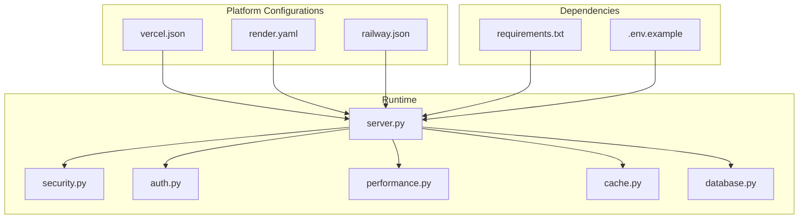
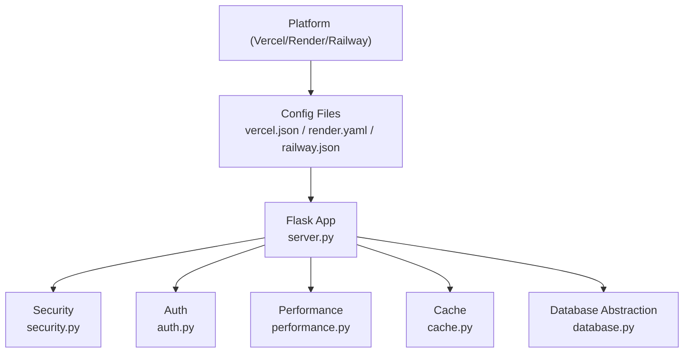
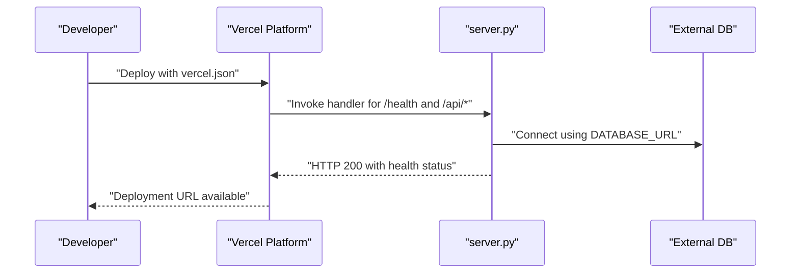
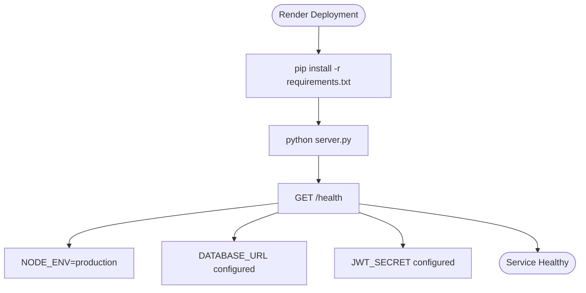
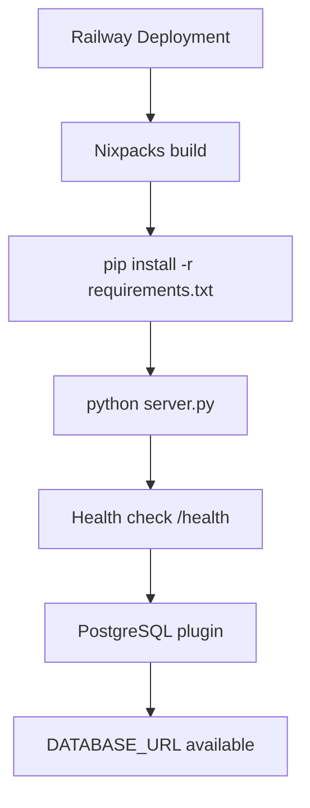
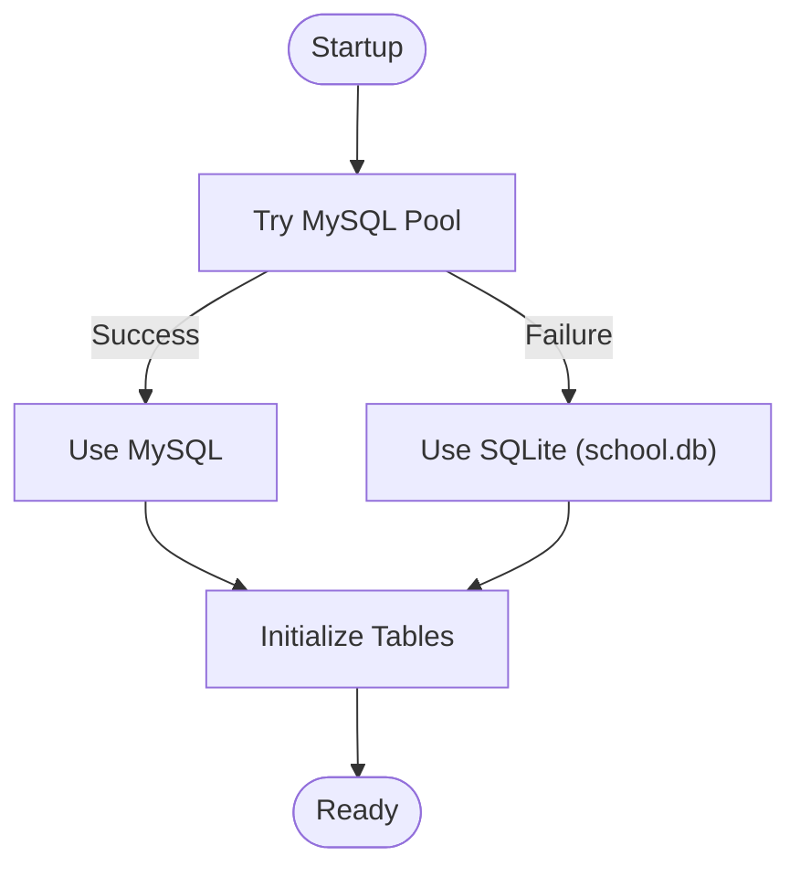
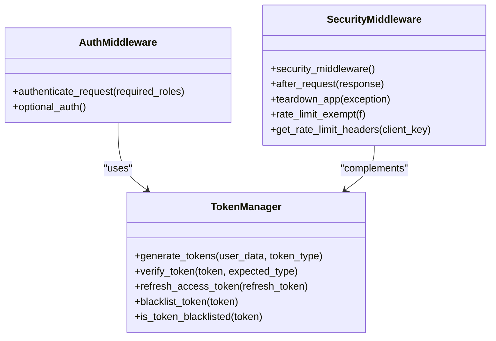
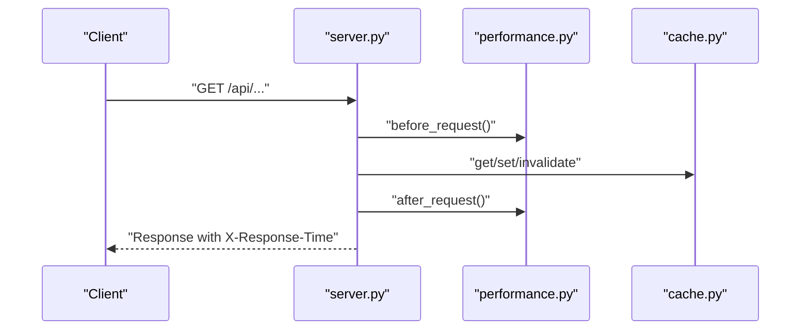
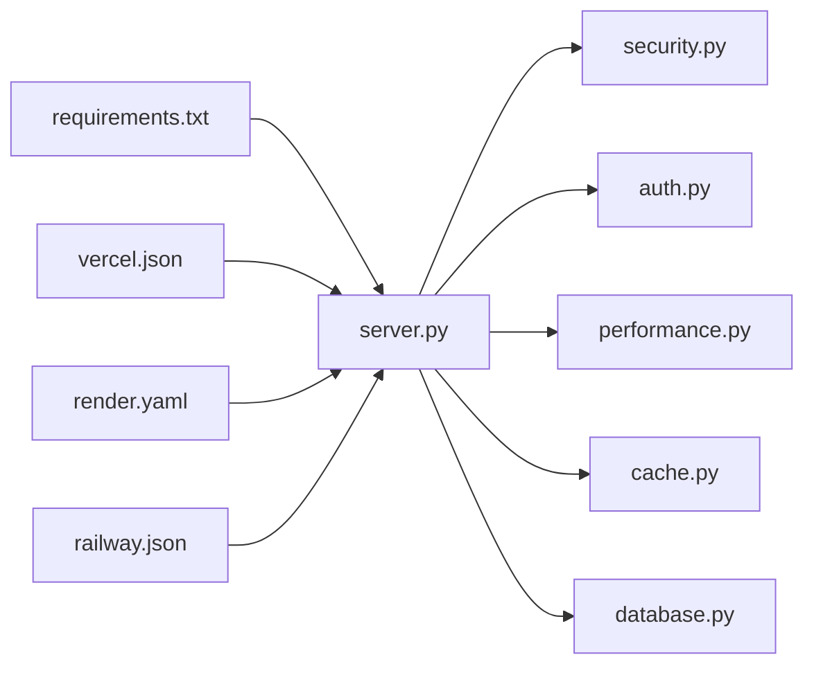

# Deployment Guide

<cite>
**Referenced Files in This Document**
- [DEPLOYMENT.md](file://DEPLOYMENT.md)
- [DEPLOYMENT_GUIDE.md](file://DEPLOYMENT_GUIDE.md)
- [HOSTING_SETUP_GUIDE.md](file://HOSTING_SETUP_GUIDE.md)
- [vercel.json](file://vercel.json)
- [render.yaml](file://render.yaml)
- [railway.json](file://railway.json)
- [.env.example](file://.env.example)
- [requirements.txt](file://requirements.txt)
- [server.py](file://server.py)
- [database.py](file://database.py)
- [auth.py](file://auth.py)
- [security.py](file://security.py)
- [performance.py](file://performance.py)
- [cache.py](file://cache.py)
- [services.py](file://services.py)
</cite>

## Table of Contents
1. [Introduction](#introduction)
2. [Project Structure](#project-structure)
3. [Core Components](#core-components)
4. [Architecture Overview](#architecture-overview)
5. [Detailed Component Analysis](#detailed-component-analysis)
6. [Dependency Analysis](#dependency-analysis)
7. [Performance Considerations](#performance-considerations)
8. [Troubleshooting Guide](#troubleshooting-guide)
9. [Conclusion](#conclusion)
10. [Appendices](#appendices)

## Introduction
This document provides comprehensive deployment guidance for the EduFlow system across cloud platforms and traditional hosting environments. It covers platform-specific configurations for Vercel, Render, and Railway; environment variable management; build and startup commands; production readiness; security and performance tuning; database strategies; SSL and monitoring; scaling and disaster recovery; and step-by-step deployment checklists.

## Project Structure
EduFlow is a Python/Flask application with a modular architecture:
- Web server and routing: server.py
- Database abstraction and migrations: database.py
- Authentication and security: auth.py, security.py
- Performance monitoring: performance.py
- Caching: cache.py
- Business logic: services.py
- Platform configuration: vercel.json, render.yaml, railway.json
- Environment variables: .env.example
- Dependencies: requirements.txt

**Diagram sources**
- [vercel.json](file://vercel.json#L1-L54)
- [render.yaml](file://render.yaml#L1-L34)
- [railway.json](file://railway.json#L1-L30)
- [server.py](file://server.py#L1-L200)
- [requirements.txt](file://requirements.txt#L1-L14)
- [.env.example](file://.env.example#L1-L78)

**Section sources**
- [vercel.json](file://vercel.json#L1-L54)
- [render.yaml](file://render.yaml#L1-L34)
- [railway.json](file://railway.json#L1-L30)
- [server.py](file://server.py#L1-L200)
- [requirements.txt](file://requirements.txt#L1-L14)
- [.env.example](file://.env.example#L1-L78)

## Core Components
- Platform configuration files define build commands, start commands, health checks, environment variables, and optional plugins.
- server.py initializes Flask, loads environment variables, sets up CORS, security middleware, performance monitoring, caching, and API routes.
- database.py abstracts MySQL connectivity with a graceful fallback to SQLite for development.
- security.py provides rate limiting, input sanitization, audit logging, and 2FA utilities.
- auth.py implements JWT token management with refresh tokens and blacklisting.
- performance.py tracks request/response metrics and system resources.
- cache.py integrates Redis with in-memory fallback for caching strategies.
- services.py encapsulates business logic and coordinates with database and security layers.

**Section sources**
- [server.py](file://server.py#L1-L200)
- [database.py](file://database.py#L1-L200)
- [security.py](file://security.py#L1-L200)
- [auth.py](file://auth.py#L1-L200)
- [performance.py](file://performance.py#L1-L120)
- [cache.py](file://cache.py#L1-L120)
- [services.py](file://services.py#L1-L120)

## Architecture Overview
The runtime architecture ties platform configurations to the Flask application stack. Platform files specify environment variables, build/start commands, and health checks. The server initializes middleware and routes, while database, security, performance, and cache layers provide operational capabilities.

**Diagram sources**
- [vercel.json](file://vercel.json#L1-L54)
- [render.yaml](file://render.yaml#L1-L34)
- [railway.json](file://railway.json#L1-L30)
- [server.py](file://server.py#L1-L200)
- [security.py](file://security.py#L1-L200)
- [auth.py](file://auth.py#L1-L200)
- [performance.py](file://performance.py#L1-L120)
- [cache.py](file://cache.py#L1-L120)
- [database.py](file://database.py#L1-L200)

## Detailed Component Analysis

### Vercel Deployment
- Build and runtime: Uses @vercel/python builder; builds from server.py; serves static assets from public/.
- Environment variables: NODE_ENV and VERCEL are set in vercel.json; configure DATABASE_URL and JWT_SECRET via Vercel dashboard.
- Routes: Health check mapped to server.py; API routes mapped to server.py; static assets served from public/.
- Limitations: Serverless timeouts and ephemeral storage; use external PostgreSQL (e.g., Supabase) and manage uploads carefully.

**Diagram sources**
- [vercel.json](file://vercel.json#L1-L54)
- [server.py](file://server.py#L110-L140)

**Section sources**
- [vercel.json](file://vercel.json#L1-L54)
- [HOSTING_SETUP_GUIDE.md](file://HOSTING_SETUP_GUIDE.md#L86-L104)

### Render Deployment
- Build and start: pip install -r requirements.txt; python server.py.
- Health check: /health endpoint.
- Environment variables: NODE_ENV, DATABASE_URL, JWT_SECRET, RENDER, TZ.
- Disk: Optional mounted disk for persistent data (/app/data).
- Scaling: Single instance by default; adjust in dashboard.

**Diagram sources**
- [render.yaml](file://render.yaml#L1-L34)
- [server.py](file://server.py#L110-L140)

**Section sources**
- [render.yaml](file://render.yaml#L1-L34)
- [HOSTING_SETUP_GUIDE.md](file://HOSTING_SETUP_GUIDE.md#L21-L83)

### Railway Deployment
- Builder: Nixpacks; build command installs requirements; start command runs server.py.
- Health check: /health endpoint with extended timeout.
- Plugins: PostgreSQL plugin included; provides DATABASE_URL.
- Environments: production environment variables configured.

**Diagram sources**
- [railway.json](file://railway.json#L1-L30)
- [server.py](file://server.py#L110-L140)

**Section sources**
- [railway.json](file://railway.json#L1-L30)
- [HOSTING_SETUP_GUIDE.md](file://HOSTING_SETUP_GUIDE.md#L68-L83)

### Environment Variables and Secrets
- Critical variables:
  - NODE_ENV: Must be production for hosting platforms.
  - DATABASE_URL: External PostgreSQL connection string.
  - JWT_SECRET: Strong random secret for token signing.
  - Optional: RENDER, RAILWAY_ENVIRONMENT, VERCEL, TZ.
- Example values and platform-specific guidance are provided in .env.example and HOSTING_SETUP_GUIDE.md.

**Section sources**
- [.env.example](file://.env.example#L1-L78)
- [HOSTING_SETUP_GUIDE.md](file://HOSTING_SETUP_GUIDE.md#L19-L146)

### Database Deployment Strategies
- Primary: External PostgreSQL (Render, Railway, Supabase).
- Fallback: SQLite for development; server falls back if MySQL is unavailable.
- Migration: Tables created on first run; default admin user initialized.

**Diagram sources**
- [database.py](file://database.py#L88-L120)
- [server.py](file://server.py#L27-L28)

**Section sources**
- [database.py](file://database.py#L88-L120)
- [server.py](file://server.py#L27-L28)

### Security and Authentication
- JWT: TokenManager generates access/refresh tokens with expiration and optional blacklisting.
- Auth middleware: Enforces bearer token authentication and optional auth.
- Security middleware: Rate limiting, input sanitization, audit logging, and 2FA utilities.
- Recommendations: Use Redis-backed token blacklisting in production; enforce HTTPS; rotate secrets.

**Diagram sources**
- [auth.py](file://auth.py#L14-L200)
- [security.py](file://security.py#L476-L580)

**Section sources**
- [auth.py](file://auth.py#L14-L200)
- [security.py](file://security.py#L476-L580)

### Performance Monitoring and Caching
- PerformanceMonitor: Tracks request times, endpoint stats, and system metrics; exposes /api/performance endpoints.
- CacheManager: Integrates Redis with in-memory fallback; provides cache decorators and invalidation patterns.
- Recommendations: Enable Redis in production; tune TTLs per data sensitivity; monitor slow endpoints.

**Diagram sources**
- [performance.py](file://performance.py#L15-L120)
- [cache.py](file://cache.py#L14-L120)
- [server.py](file://server.py#L1-L200)

**Section sources**
- [performance.py](file://performance.py#L15-L120)
- [cache.py](file://cache.py#L14-L120)

### Multi-Platform Deployment Approach
- Cloud providers: Vercel (serverless), Render (web service), Railway (Nixpacks).
- Traditional hosting: Use render.yaml-like configuration with a WSGI server behind a reverse proxy.
- Consistency: Align environment variables, health checks, and start commands across platforms.

**Section sources**
- [vercel.json](file://vercel.json#L1-L54)
- [render.yaml](file://render.yaml#L1-L34)
- [railway.json](file://railway.json#L1-L30)

## Dependency Analysis
- Runtime dependencies are declared in requirements.txt.
- server.py imports security, auth, performance, cache, and database modules.
- Platform configs depend on environment variables and start/build commands.

**Diagram sources**
- [requirements.txt](file://requirements.txt#L1-L14)
- [server.py](file://server.py#L1-L200)
- [vercel.json](file://vercel.json#L1-L54)
- [render.yaml](file://render.yaml#L1-L34)
- [railway.json](file://railway.json#L1-L30)

**Section sources**
- [requirements.txt](file://requirements.txt#L1-L14)
- [server.py](file://server.py#L1-L200)

## Performance Considerations
- Use external PostgreSQL for production; avoid SQLite for concurrent workloads.
- Enable Redis caching; monitor cache hit rates and tune TTLs.
- Monitor slow endpoints and system metrics via /api/performance endpoints.
- Optimize database queries and leverage caching for frequently accessed data.
- Ensure proper rate limiting and input sanitization to protect resources.

[No sources needed since this section provides general guidance]

## Troubleshooting Guide
- 404 errors: Verify backend is running and routes are mapped correctly.
- Database errors: Confirm DATABASE_URL format and connectivity; check platform firewall/IP whitelisting.
- CORS errors: Ensure frontend origin is allowed; verify CORS configuration.
- Build failures: Validate Python version and requirements.txt; confirm build commands.
- Health check issues: Confirm NODE_ENV=production and platform variables are set; redeploy after changes.

**Section sources**
- [DEPLOYMENT.md](file://DEPLOYMENT.md#L99-L105)
- [HOSTING_SETUP_GUIDE.md](file://HOSTING_SETUP_GUIDE.md#L171-L232)

## Conclusion
EduFlow supports robust deployments across Vercel, Render, and Railway with consistent environment variables, health checks, and production-grade security and performance features. Use external PostgreSQL, enable Redis caching, enforce HTTPS, and monitor performance to achieve reliable, scalable operation.

[No sources needed since this section summarizes without analyzing specific files]

## Appendices

### Step-by-Step Deployment Checklists
- Vercel
  - Install Vercel CLI and run vercel --prod.
  - Set environment variables: NODE_ENV, DATABASE_URL, JWT_SECRET, VERCEL.
  - Configure routes and functions in vercel.json.
- Render
  - Connect repository and set build/start commands.
  - Add environment variables: NODE_ENV, DATABASE_URL, JWT_SECRET, RENDER, TZ.
  - Enable auto-deploy and health check.
- Railway
  - Add PostgreSQL plugin; configure environment variables.
  - Set build and start commands in railway.json.
  - Configure restart policy and health check.

**Section sources**
- [vercel.json](file://vercel.json#L1-L54)
- [render.yaml](file://render.yaml#L1-L34)
- [railway.json](file://railway.json#L1-L30)

### SSL and Monitoring
- SSL: Most platforms provide automatic HTTPS termination; configure custom domains if needed.
- Monitoring: Use /health and /api/performance endpoints; integrate platform logs and metrics dashboards.

**Section sources**
- [server.py](file://server.py#L110-L140)
- [performance.py](file://performance.py#L215-L235)

### Scaling and Disaster Recovery
- Scaling: Use multiple instances on Render/Railway; consider CDN for static assets.
- Load balancing: Platform routers handle traffic; ensure stateless design.
- Disaster recovery: Back up database regularly; maintain backups of uploaded content; restore procedures outlined in deployment guides.

**Section sources**
- [DEPLOYMENT_GUIDE.md](file://DEPLOYMENT_GUIDE.md#L242-L256)