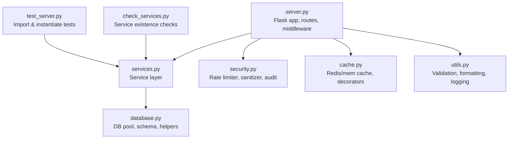
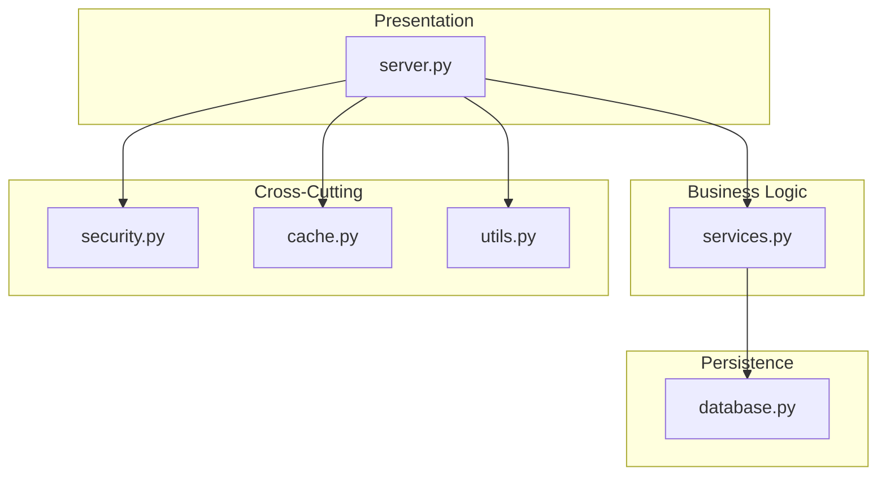
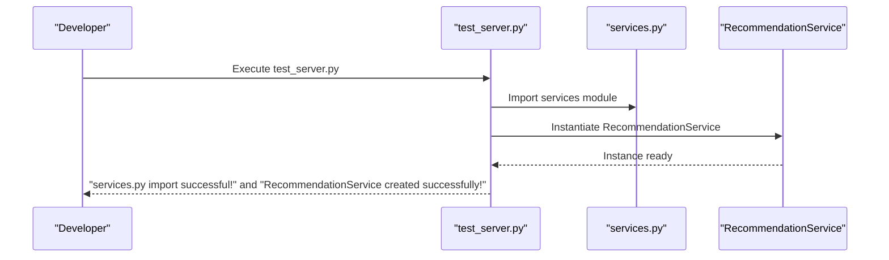
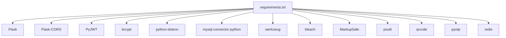

# Development Tools

<cite>
**Referenced Files in This Document**
- [README.md](file://README.md)
- [requirements.txt](file://requirements.txt)
- [server.py](file://server.py)
- [services.py](file://services.py)
- [database.py](file://database.py)
- [security.py](file://security.py)
- [cache.py](file://cache.py)
- [utils.py](file://utils.py)
- [test_server.py](file://test_server.py)
- [check_services.py](file://check_services.py)
</cite>

## Table of Contents
1. [Introduction](#introduction)
2. [Project Structure](#project-structure)
3. [Core Components](#core-components)
4. [Architecture Overview](#architecture-overview)
5. [Detailed Component Analysis](#detailed-component-analysis)
6. [Dependency Analysis](#dependency-analysis)
7. [Performance Considerations](#performance-considerations)
8. [Troubleshooting Guide](#troubleshooting-guide)
9. [Conclusion](#conclusion)
10. [Appendices](#appendices)

## Introduction
This document describes the EduFlow development tools and AI-assisted development system. It focuses on the Python backend services, testing utilities, debugging helpers, and development workflow optimizations that enable rapid feature development, testing automation, and maintenance. While the repository includes a .qoder directory intended for AI agents, plans, and skills, the directory contents are not present in this workspace snapshot. Therefore, this document emphasizes the existing Python-based development tools and how developers can integrate AI-assisted workflows with the current system.

## Project Structure
The project follows a layered architecture:
- Entry point: server.py initializes the Flask application, routes, and middleware.
- Services layer: services.py encapsulates business logic and interacts with the database.
- Persistence: database.py manages database connections and schema initialization.
- Security and caching: security.py and cache.py provide middleware, rate limiting, audit logging, and caching.
- Utilities: utils.py centralizes validation, formatting, and logging helpers.
- Testing and verification: test_server.py and check_services.py validate service imports and instantiation.
- Dependencies: requirements.txt defines the runtime stack.

**Diagram sources**
- [server.py](file://server.py#L1-L120)
- [services.py](file://services.py#L1-L120)
- [database.py](file://database.py#L88-L120)
- [security.py](file://security.py#L476-L578)
- [cache.py](file://cache.py#L234-L305)
- [utils.py](file://utils.py#L27-L120)
- [test_server.py](file://test_server.py#L1-L17)
- [check_services.py](file://check_services.py#L1-L36)

**Section sources**
- [README.md](file://README.md#L1-L23)
- [requirements.txt](file://requirements.txt#L1-L14)
- [server.py](file://server.py#L1-L120)

## Core Components
- Server and routing: server.py sets up Flask, CORS, environment configuration, and routes for authentication and CRUD operations. It integrates security, performance, caching, and API optimization layers.
- Services: services.py defines BaseService and specialized services (SchoolService, AcademicYearService, StudentService, TeacherService, RecommendationService) with database query orchestration and audit logging.
- Database abstraction: database.py provides a MySQL pool with automatic fallback to SQLite, schema creation, and helper functions for teacher-student relationships and academic year management.
- Security middleware: security.py implements rate limiting, input sanitization, audit logging, and 2FA utilities.
- Caching layer: cache.py offers Redis-backed caching with in-memory fallback, cache decorators, and invalidation patterns.
- Utilities: utils.py centralizes validation, input sanitization, response formatting, and logging helpers.
- Testing utilities: test_server.py and check_services.py validate imports and service instantiation.

**Section sources**
- [server.py](file://server.py#L1-L120)
- [services.py](file://services.py#L12-L120)
- [database.py](file://database.py#L88-L120)
- [security.py](file://security.py#L476-L578)
- [cache.py](file://cache.py#L234-L305)
- [utils.py](file://utils.py#L27-L120)
- [test_server.py](file://test_server.py#L1-L17)
- [check_services.py](file://check_services.py#L1-L36)

## Architecture Overview
The system architecture separates concerns into clear layers:
- Presentation and routing: Flask app with decorators for security and rate limiting.
- Business logic: Services encapsulate domain operations and coordinate with the database.
- Data access: Database layer abstracts MySQL/SQLite and provides helper functions.
- Cross-cutting concerns: Security middleware, caching, and utilities support all layers.

**Diagram sources**
- [server.py](file://server.py#L1-L120)
- [services.py](file://services.py#L12-L120)
- [database.py](file://database.py#L88-L120)
- [security.py](file://security.py#L476-L578)
- [cache.py](file://cache.py#L234-L305)
- [utils.py](file://utils.py#L27-L120)

## Detailed Component Analysis

### Server and Routing
Key responsibilities:
- Initialize Flask app, CORS, environment variables, and upload directories.
- Provide health check endpoint and authentication routes for admin, school, and student roles.
- Integrate security middleware, performance monitoring, caching, and API optimization.
- Implement CRUD routes for schools, students, subjects, and related data.

Developer workflow:
- Add new endpoints by extending server.py and applying decorators for sanitization and rate limiting.
- Use services.py for business logic and database interactions.
- Leverage cache.py decorators to optimize frequently accessed endpoints.

**Section sources**
- [server.py](file://server.py#L1-L140)
- [server.py](file://server.py#L141-L320)

### Services Layer
Key responsibilities:
- BaseService manages database pools, security middleware, audit logging, and connection lifecycle.
- Specialized services encapsulate domain operations:
  - SchoolService: CRUD for schools, unique code generation.
  - AcademicYearService: Academic year creation, retrieval, and current year management.
  - StudentService: Student CRUD, unique code generation, and detailed scores handling.
  - TeacherService: Teacher CRUD and unique code generation.
  - RecommendationService: Educational recommendations for teachers and students, including performance analysis and strategies.

AI-assisted development note:
- The .qoder directory is present but lacks content in this workspace snapshot. Developers can define agents, plans, and skills to automate repetitive tasks (e.g., generating service methods, validating inputs, writing tests) and integrate them with the existing codebase.

**Section sources**
- [services.py](file://services.py#L12-L120)
- [services.py](file://services.py#L367-L474)

### Database Abstraction
Key responsibilities:
- Provide MySQL connection pool with fallback to SQLite for local development.
- Create tables and handle migrations for users, schools, students, teachers, subjects, and academic year tracking.
- Offer helper functions for teacher-student relationships, class assignments, and academic year management.

Developer workflow:
- Use get_mysql_pool() to obtain a connection and execute queries via BaseService.
- Extend schema by adding tables or altering existing ones in create_tables().

**Section sources**
- [database.py](file://database.py#L88-L120)
- [database.py](file://database.py#L120-L340)

### Security Middleware
Key responsibilities:
- Rate limiting with configurable windows and thresholds.
- Input sanitization to prevent XSS and sanitize JSON payloads.
- Audit logging with batching and persistence to database.
- 2FA utilities for secure authentication.

Developer workflow:
- Apply @sanitize_input() and @rate_limit_exempt decorators to routes.
- Use AuditLogger to record actions and security events.

**Section sources**
- [security.py](file://security.py#L20-L77)
- [security.py](file://security.py#L78-L176)
- [security.py](file://security.py#L177-L423)
- [security.py](file://security.py#L424-L475)
- [security.py](file://security.py#L476-L578)

### Caching Layer
Key responsibilities:
- Redis-backed cache with in-memory fallback.
- Cache decorators for function results and invalidation patterns.
- Predefined cache strategies for school, student, teacher, academic year, grades, and attendance data.

Developer workflow:
- Wrap expensive operations with @cache.cache(ttl=...) to reduce database load.
- Invalidate caches after mutations using @cache.invalidate_pattern(...).

**Section sources**
- [cache.py](file://cache.py#L14-L101)
- [cache.py](file://cache.py#L170-L212)
- [cache.py](file://cache.py#L234-L305)

### Utilities
Key responsibilities:
- Validation helpers for required fields, blood types, educational levels, grade formats, and score ranges.
- Input sanitization and standardized response formatting.
- Logging helpers and JSON validation.

Developer workflow:
- Use @validate_input(required_fields=...) to enforce required fields.
- Apply EduFlowUtils.sanitize_input() and format_response() for consistent outputs.

**Section sources**
- [utils.py](file://utils.py#L19-L78)
- [utils.py](file://utils.py#L105-L186)
- [utils.py](file://utils.py#L243-L312)
- [utils.py](file://utils.py#L359-L405)

### Testing and Verification Utilities
- test_server.py validates imports and instantiates RecommendationService to ensure the services module is functional.
- check_services.py verifies the presence of RecommendationService class and instance, and reports errors with stack traces.

Developer workflow:
- Run test_server.py to confirm service availability.
- Use check_services.py to validate service definitions and instances.

**Diagram sources**
- [test_server.py](file://test_server.py#L1-L17)
- [services.py](file://services.py#L367-L474)

**Section sources**
- [test_server.py](file://test_server.py#L1-L17)
- [check_services.py](file://check_services.py#L1-L36)

## Dependency Analysis
Runtime dependencies include Flask, Flask-CORS, PyJWT, bcrypt, python-dotenv, mysql-connector-python, werkzeug, bleach, MarkupSafe, psutil, qrcode, pyotp, and redis.

**Diagram sources**
- [requirements.txt](file://requirements.txt#L1-L14)

**Section sources**
- [requirements.txt](file://requirements.txt#L1-L14)

## Performance Considerations
- Caching: Use cache decorators to cache expensive reads and invalidate on writes.
- Database pooling: Reuse connections via get_mysql_pool() to minimize overhead.
- Input sanitization: Reduce XSS risks and improve stability with bleach-based sanitization.
- Rate limiting: Prevent abuse and protect endpoints with configurable limits.
- Logging: Batch audit logs to reduce database write frequency.

[No sources needed since this section provides general guidance]

## Troubleshooting Guide
Common issues and resolutions:
- Database connectivity:
  - MySQL pool failure falls back to SQLite. Verify environment variables and network access.
  - Use get_mysql_pool() to initialize and test connectivity.
- Service instantiation failures:
  - Run test_server.py and check_services.py to validate imports and class availability.
- Security and rate limiting:
  - Review rate limit headers and adjust windows/thresholds if needed.
  - Ensure sanitize_input() is applied to JSON endpoints.
- Caching:
  - Confirm Redis connectivity or rely on in-memory fallback.
  - Use cache.clear_pattern() to invalidate stale keys.

**Section sources**
- [database.py](file://database.py#L88-L120)
- [test_server.py](file://test_server.py#L1-L17)
- [check_services.py](file://check_services.py#L1-L36)
- [security.py](file://security.py#L476-L578)
- [cache.py](file://cache.py#L294-L305)

## Conclusion
The EduFlow development tools provide a robust foundation for building and maintaining a school management system. The layered architecture, integrated security and caching, and comprehensive utilities streamline development. While the .qoder AI agent system is present as a directory, this workspace snapshot does not include its contents. Developers can leverage the existing testing, verification, and utility modules to accelerate feature development, maintain code quality, and integrate AI-assisted workflows as the .qoder components are populated.

[No sources needed since this section summarizes without analyzing specific files]

## Appendices
- Quick start:
  - Install dependencies: pip install -r requirements.txt
  - Initialize database: run server.py to trigger create_tables()
  - Start server: python server.py
- AI agent integration (conceptual):
  - Define agents in .qoder/agents to automate repetitive tasks.
  - Create plans in .qoder/plans to orchestrate multi-step development workflows.
  - Implement reusable skills in .qoder/skills for code generation, refactoring, and validation.

[No sources needed since this section provides general guidance]