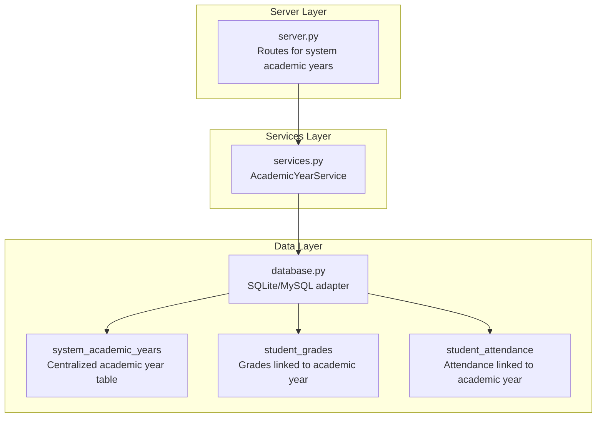
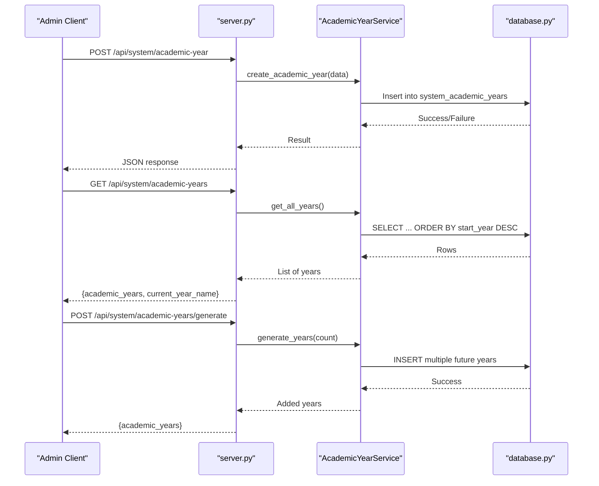
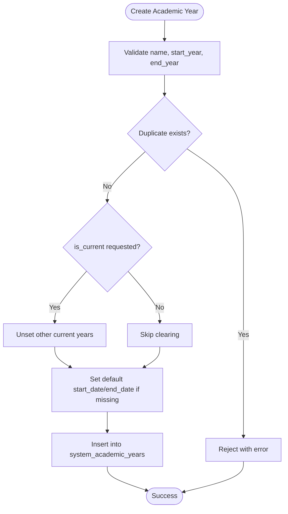
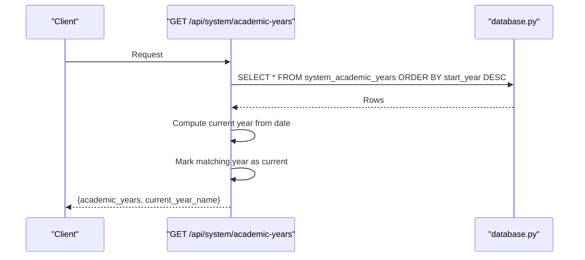
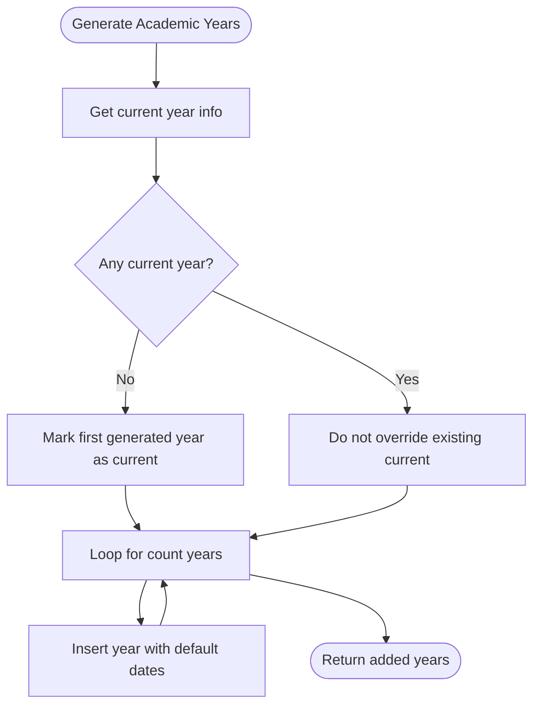
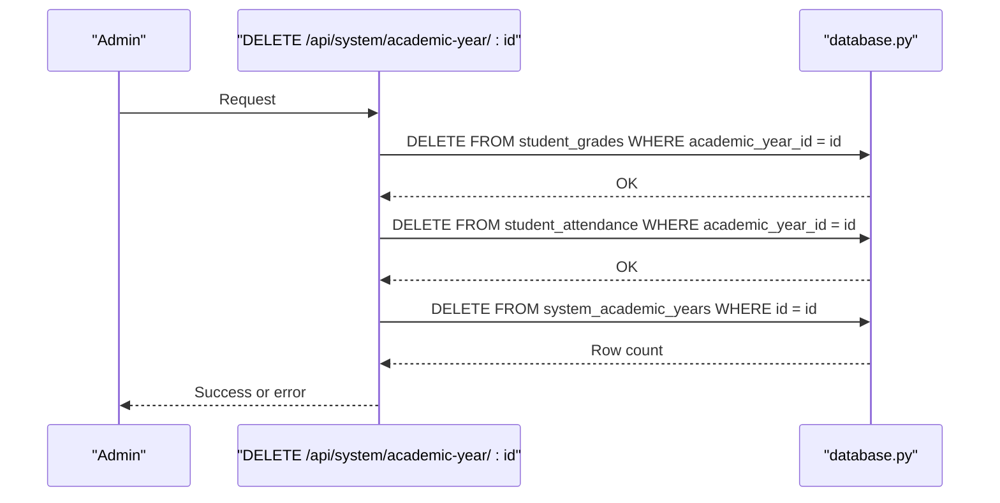
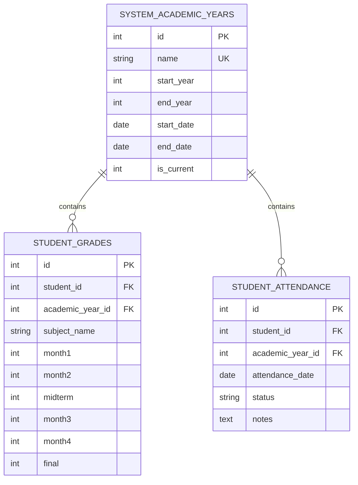
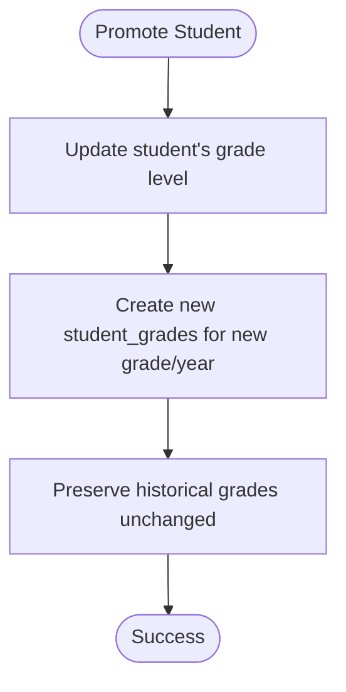
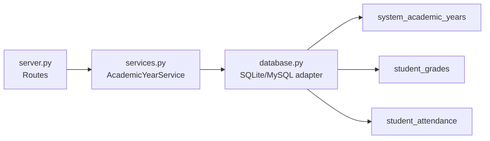

# Academic Year Management

<cite>
**Referenced Files in This Document**
- [README.md](file://README.md)
- [server.py](file://server.py)
- [database.py](file://database.py)
- [services.py](file://services.py)
- [academic_year_test.html](file://academic_year_test.html)
- [delete_academic_years.sql](file://delete_academic_years.sql)
- [PROMOTION_SYSTEM_SUMMARY.md](file://PROMOTION_SYSTEM_SUMMARY.md)
</cite>

## Table of Contents
1. [Introduction](#introduction)
2. [Project Structure](#project-structure)
3. [Core Components](#core-components)
4. [Architecture Overview](#architecture-overview)
5. [Detailed Component Analysis](#detailed-component-analysis)
6. [Dependency Analysis](#dependency-analysis)
7. [Performance Considerations](#performance-considerations)
8. [Troubleshooting Guide](#troubleshooting-guide)
9. [Conclusion](#conclusion)

## Introduction
This document explains the academic year management system implemented in the EduFlow Python backend. It covers the centralized academic year lifecycle (creation, activation, deletion), automated year generation for upcoming academic years, and how academic years integrate with student enrollment and grade tracking. It also documents the grade level progression system, including promotion logic that preserves historical records, and the configuration options for academic year start/end dates and current-year marking.

## Project Structure
The academic year management spans three primary areas:
- Database schema: Centralized academic year storage and relationships to student records
- Server routes: REST endpoints for CRUD operations, current year detection, and generation of future years
- Services: Business logic for academic year operations and integration with the database layer

**Diagram sources**
- [server.py](file://server.py#L1931-L2143)
- [services.py](file://services.py#L118-L230)
- [database.py](file://database.py#L261-L320)

**Section sources**
- [README.md](file://README.md#L1-L23)
- [server.py](file://server.py#L1931-L2143)
- [database.py](file://database.py#L261-L320)

## Core Components
- Centralized Academic Year Storage: The system maintains a single source of truth for academic years in a dedicated table, enabling consistent year management across all schools.
- Academic Year Lifecycle:
  - Creation: Validates year continuity and prevents duplicates; optionally sets a year as current.
  - Activation: Explicitly sets a year as current or infers the current year based on the calendar year.
  - Deletion: Removes a year and cascades cleanup of related student records.
- Year Generation: Generates upcoming academic years based on the current year, with sensible defaults for start/end dates.
- Integration with Student Records: Student grades and attendance are stored per academic year, ensuring historical separation and accurate reporting.

**Section sources**
- [server.py](file://server.py#L1931-L2143)
- [database.py](file://database.py#L261-L320)
- [PROMOTION_SYSTEM_SUMMARY.md](file://PROMOTION_SYSTEM_SUMMARY.md#L1-L98)

## Architecture Overview
The academic year system is designed around a centralized table that stores academic year metadata and relationships to student records. The server exposes REST endpoints for administrative actions, while the service layer encapsulates business logic and database interactions.

**Diagram sources**
- [server.py](file://server.py#L1931-L2143)
- [services.py](file://services.py#L118-L230)
- [database.py](file://database.py#L261-L320)

## Detailed Component Analysis

### Centralized Academic Year Management
- Purpose: Manage academic years centrally so that all schools align with the same calendar and policies.
- Key capabilities:
  - Create academic years with validation for year continuity and uniqueness.
  - Automatically mark the current year based on the current date.
  - Generate upcoming academic years in bulk.
  - Delete academic years with cascading cleanup of related student data.

**Diagram sources**
- [server.py](file://server.py#L1956-L2022)

**Section sources**
- [server.py](file://server.py#L1956-L2022)
- [database.py](file://database.py#L261-L273)

### Academic Year Retrieval and Current Year Detection
- Retrieves all academic years ordered by start year descending.
- Infers the current academic year based on the current date and overrides any stored is_current flag to ensure correctness.

**Diagram sources**
- [server.py](file://server.py#L1931-L1954)

**Section sources**
- [server.py](file://server.py#L1931-L1954)

### Automatic Year Generation
- Generates N upcoming academic years starting from the current year.
- Sets the first generated year as current if none is currently marked.
- Uses default start/end dates aligned with the academic calendar.

**Diagram sources**
- [server.py](file://server.py#L2091-L2143)

**Section sources**
- [server.py](file://server.py#L2091-L2143)

### Academic Year Deletion and Cleanup
- Deletes a specific academic year.
- Explicitly cleans up related student grades and attendance records before deleting the year to maintain referential integrity.

**Diagram sources**
- [server.py](file://server.py#L2059-L2089)

**Section sources**
- [server.py](file://server.py#L2059-L2089)

### Integration with Student Enrollment and Records
- Student enrollment and records (grades, attendance) are associated with academic years via foreign keys to the centralized academic year table.
- This ensures that historical records remain intact and that reports can be filtered by academic year.

**Diagram sources**
- [database.py](file://database.py#L291-L320)

**Section sources**
- [database.py](file://database.py#L291-L320)

### Grade Level Progression and Academic Year Validation
- The promotion system preserves historical grades and creates new records for the upgraded grade level and academic year.
- Academic year validation ensures that only consecutive years are accepted (end_year = start_year + 1) and that duplicates are prevented.

**Diagram sources**
- [PROMOTION_SYSTEM_SUMMARY.md](file://PROMOTION_SYSTEM_SUMMARY.md#L20-L38)

**Section sources**
- [PROMOTION_SYSTEM_SUMMARY.md](file://PROMOTION_SYSTEM_SUMMARY.md#L1-L98)

### Academic Year Configuration Options
- Name: Human-readable identifier (e.g., "2032/2033")
- Start/End Year: Consecutive integers validated by the backend
- Start/End Date: Defaults applied if not provided; can be customized
- Current Year: Can be explicitly set or inferred from the current date

**Section sources**
- [server.py](file://server.py#L1956-L2022)
- [server.py](file://server.py#L2091-L2143)

### Examples and Workflows

#### Example: Academic Year Setup
- Create a new academic year with a name and consecutive start/end years.
- Optionally mark it as current; the system will unset other current years.
- If dates are omitted, defaults are applied.

**Section sources**
- [server.py](file://server.py#L1956-L2022)

#### Example: Multi-Year Academic Tracking
- Retrieve all academic years and confirm which one is current based on the current date.
- Use the current year for enrollment and grade reporting.

**Section sources**
- [server.py](file://server.py#L1931-L1954)

#### Example: Student Year Progression Workflow
- Promote a student to the next grade level.
- The system updates the student’s grade level and creates new grade records for the new academic year without modifying historical data.

**Section sources**
- [PROMOTION_SYSTEM_SUMMARY.md](file://PROMOTION_SYSTEM_SUMMARY.md#L70-L88)

#### Example: Deleting Academic Years
- Use the provided SQL script to preview and remove specific academic years.
- The backend enforces cascading cleanup of related student records before deletion.

**Section sources**
- [delete_academic_years.sql](file://delete_academic_years.sql#L1-L19)
- [server.py](file://server.py#L2059-L2089)

## Dependency Analysis
- Server routes depend on the service layer for business logic.
- The service layer depends on the database adapter for persistence.
- Database tables enforce referential integrity between academic years and student records.

**Diagram sources**
- [server.py](file://server.py#L1931-L2143)
- [services.py](file://services.py#L118-L230)
- [database.py](file://database.py#L261-L320)

**Section sources**
- [server.py](file://server.py#L1931-L2143)
- [services.py](file://services.py#L118-L230)
- [database.py](file://database.py#L261-L320)

## Performance Considerations
- Centralized academic year storage reduces duplication and simplifies queries.
- Cascading deletes ensure referential integrity without complex manual cleanup.
- Date-based current year inference avoids stale flags and reduces maintenance overhead.

## Troubleshooting Guide
- Duplicate Academic Year: Creation fails if a year with the same name already exists.
- Invalid Year Continuity: End year must equal start year plus one.
- Current Year Conflicts: Setting a year as current unsets all others.
- Deletion Failures: Related student records must be cleared; the backend handles cascading cleanup.

**Section sources**
- [server.py](file://server.py#L1956-L2022)
- [server.py](file://server.py#L2024-L2057)
- [server.py](file://server.py#L2059-L2089)

## Conclusion
The academic year management system provides a robust, centralized mechanism for managing academic calendars, integrating seamlessly with student enrollment and grade tracking. Its design ensures data integrity, simplifies administration, and supports scalable growth through automated year generation and explicit deletion workflows.