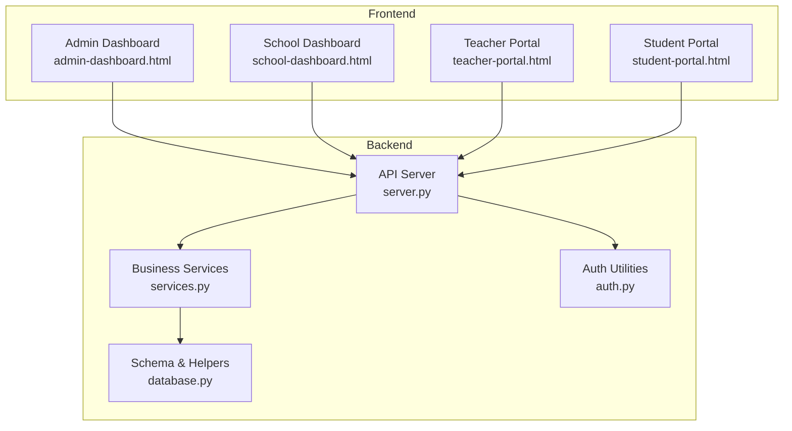
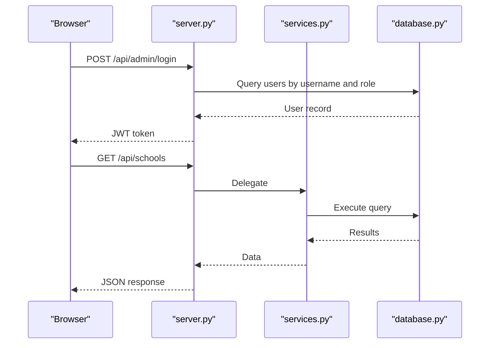
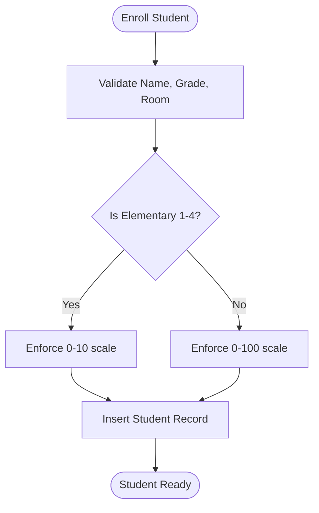
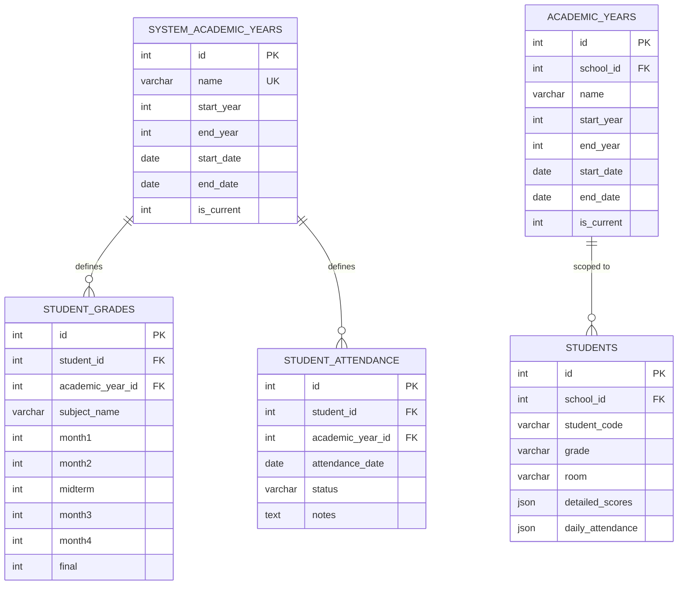
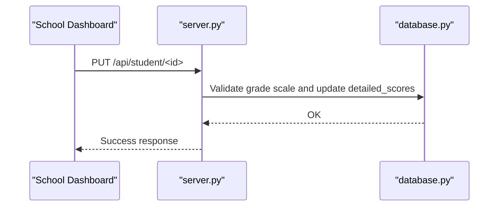
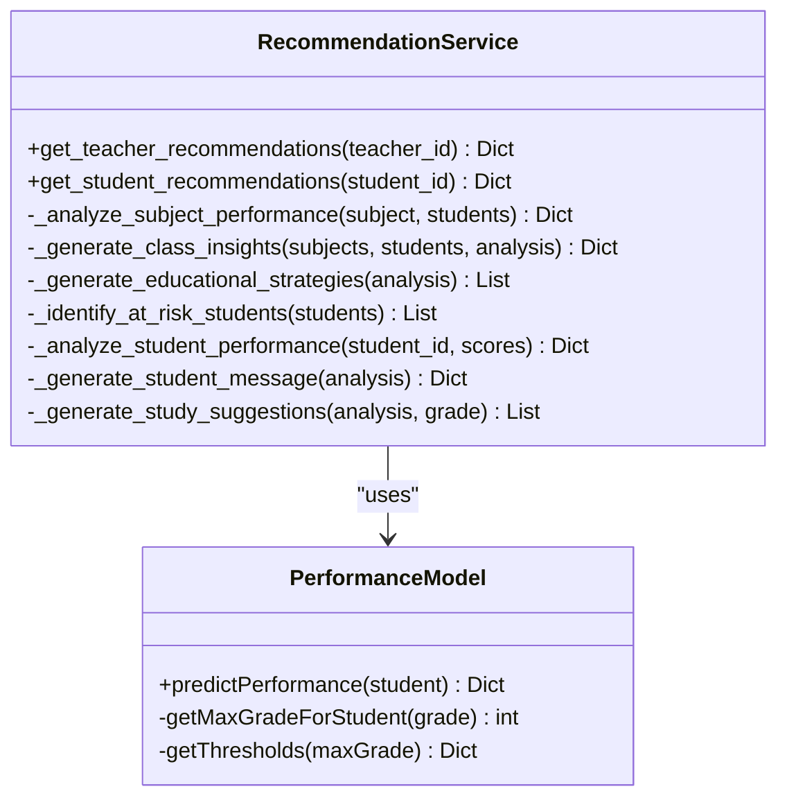
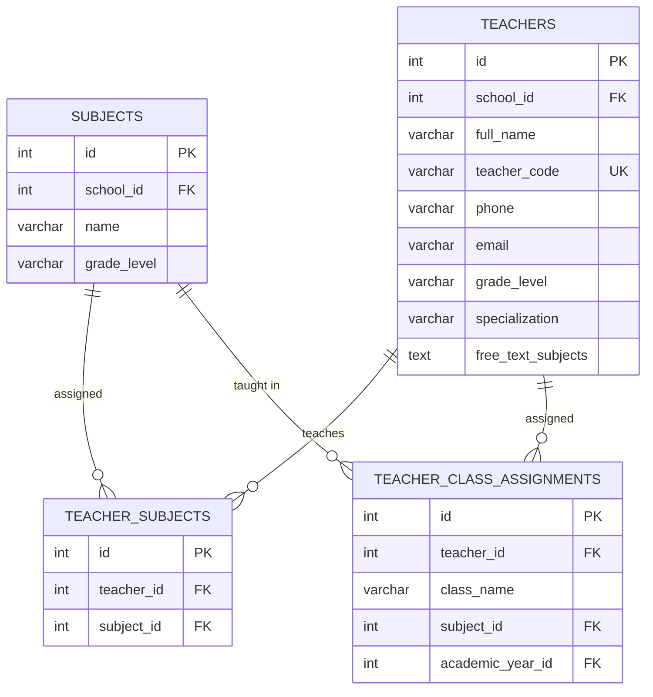
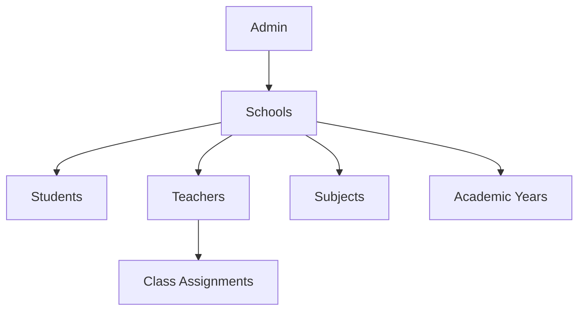
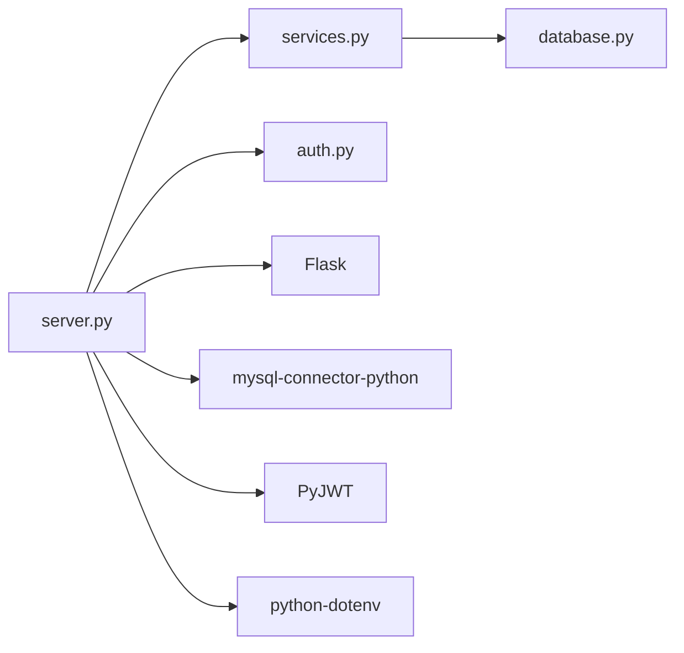

# Educational Features

<cite>
**Referenced Files in This Document**
- [README.md](file://README.md)
- [server.py](file://server.py)
- [database.py](file://database.py)
- [services.py](file://services.py)
- [auth.py](file://auth.py)
- [public/admin-dashboard.html](file://public/admin-dashboard.html)
- [public/school-dashboard.html](file://public/school-dashboard.html)
- [public/teacher-portal.html](file://public/teacher-portal.html)
- [public/student-portal.html](file://public/student-portal.html)
- [requirements.txt](file://requirements.txt)
</cite>

## Table of Contents
1. [Introduction](#introduction)
2. [Project Structure](#project-structure)
3. [Core Components](#core-components)
4. [Architecture Overview](#architecture-overview)
5. [Detailed Component Analysis](#detailed-component-analysis)
6. [Dependency Analysis](#dependency-analysis)
7. [Performance Considerations](#performance-considerations)
8. [Troubleshooting Guide](#troubleshooting-guide)
9. [Conclusion](#conclusion)
10. [Appendices](#appendices)

## Introduction
This document describes the educational management features of the EduFlow system. It covers student lifecycle management (enrollment, academic records, progress monitoring), academic year administration (centralized year management, grade-level tracking), grade entry and assessment, attendance monitoring, performance analytics, subject and teacher management, reporting and visualization, and multi-school administrative capabilities. Practical workflows for administrators, teachers, and students are included to illustrate typical usage patterns.

## Project Structure
EduFlow is a Python/Flask-based system with a frontend built using HTML/CSS/JavaScript and a MySQL-compatible backend (with automatic SQLite fallback). The system organizes functionality into:
- Backend API and services
- Database schema for schools, students, teachers, subjects, academic years, grades, and attendance
- Frontend dashboards for admin, school, teacher, and student portals

**Diagram sources**
- [server.py](file://server.py#L1-L120)
- [database.py](file://database.py#L120-L338)
- [services.py](file://services.py#L1-L43)
- [auth.py](file://auth.py#L14-L376)
- [public/admin-dashboard.html](file://public/admin-dashboard.html#L1-L174)
- [public/school-dashboard.html](file://public/school-dashboard.html#L1-L267)
- [public/teacher-portal.html](file://public/teacher-portal.html#L1-L17)
- [public/student-portal.html](file://public/student-portal.html#L1-L16)

**Section sources**
- [README.md](file://README.md#L1-L23)
- [requirements.txt](file://requirements.txt#L1-L14)

## Core Components
- Student Management: CRUD operations, detailed scores storage, daily attendance, and personal academic recommendations.
- Academic Year Management: Centralized academic year definitions and per-school current year selection.
- Subject and Teacher Management: Subject cataloging, teacher profiles, and teacher-class-assignment tracking.
- Performance Analytics: Aggregated metrics, charts, and AI-driven predictions.
- Reporting: Export capabilities and comprehensive student reports.
- Multi-School Administration: Centralized school management and cross-school analytics.

**Section sources**
- [server.py](file://server.py#L441-L766)
- [database.py](file://database.py#L261-L320)
- [services.py](file://services.py#L118-L230)
- [public/school-dashboard.html](file://public/school-dashboard.html#L311-L377)
- [public/teacher-portal.html](file://public/teacher-portal.html#L522-L533)
- [public/student-portal.html](file://public/student-portal.html#L47-L124)

## Architecture Overview
The system follows a layered architecture:
- Presentation: HTML dashboards for admin, school, teacher, and student.
- API: Flask routes handling authentication, CRUD, and analytics.
- Services: Business logic encapsulated in service classes.
- Persistence: MySQL connector with a SQLite adapter for local development.

**Diagram sources**
- [server.py](file://server.py#L142-L200)
- [services.py](file://services.py#L44-L101)
- [database.py](file://database.py#L120-L145)

## Detailed Component Analysis

### Student Management System
- Enrollment: Create students with unique codes, grade level, room, and optional medical/contact info.
- Academic Records: Store detailed scores per subject and per period; enforce grade scale rules (elementary 1–4 use 10-point scale).
- Progress Monitoring: Daily attendance logs and trend analysis for performance insights.
- Personalized Recommendations: AI-powered academic advice and study plans.

**Diagram sources**
- [server.py](file://server.py#L469-L559)
- [server.py](file://server.py#L564-L656)
- [server.py](file://server.py#L683-L766)

**Section sources**
- [server.py](file://server.py#L441-L766)
- [database.py](file://database.py#L159-L177)
- [public/student-portal.html](file://public/student-portal.html#L155-L713)

### Academic Year Management
- Centralized Academic Years: A system-level table defines academic years applicable across schools.
- Per-School Current Year: Schools can select which year is current.
- Migration Support: Backward compatibility maintained via legacy academic_years table.

**Diagram sources**
- [database.py](file://database.py#L261-L320)

**Section sources**
- [database.py](file://database.py#L261-L289)
- [services.py](file://services.py#L118-L230)

### Grade Entry and Assessment System
- Per-Subject Scores: Supports monthly, midterm, and final grades.
- Scale Validation: Automatically validates grade ranges based on grade level.
- Batch Updates: Update detailed scores and daily attendance via dedicated endpoints.

**Diagram sources**
- [server.py](file://server.py#L564-L656)
- [server.py](file://server.py#L683-L766)

**Section sources**
- [server.py](file://server.py#L564-L766)

### Attendance Monitoring
- Daily Attendance: Capture presence/absence/lates with optional notes.
- Historical Tracking: Maintain per-academic-year attendance records.
- UI Integration: Modal-based daily attendance capture and batch save.

**Section sources**
- [server.py](file://server.py#L441-L467)
- [public/school-dashboard.html](file://public/school-dashboard.html#L467-L498)

### Performance Analytics and Recommendations
- Class Insights: Pass rates, averages, and weak subject identification.
- Individual Recommendations: Personalized messages and study suggestions.
- AI Predictions: Student performance prediction and at-risk identification.

**Diagram sources**
- [services.py](file://services.py#L367-L913)
- [public/student-portal.html](file://public/student-portal.html#L556-L713)

**Section sources**
- [services.py](file://services.py#L367-L913)
- [public/student-portal.html](file://public/student-portal.html#L277-L549)

### Subject and Teacher Management
- Subjects: Catalog subjects per school and per grade level.
- Teachers: Manage teacher profiles, unique codes, and subject specializations.
- Assignments: Track which teachers are assigned to which classes and subjects per academic year.

**Diagram sources**
- [database.py](file://database.py#L197-L259)

**Section sources**
- [server.py](file://server.py#L768-L806)
- [database.py](file://database.py#L197-L259)

### Reporting and Administrative Functions
- Export Capabilities: Export teachers and students to Excel from the school dashboard.
- Comprehensive Reports: Generate detailed student reports across academic years.
- Admin School Management: Create/update/delete schools and manage academic years centrally.

**Section sources**
- [public/school-dashboard.html](file://public/school-dashboard.html#L272-L284)
- [public/admin-dashboard.html](file://public/admin-dashboard.html#L99-L119)
- [server.py](file://server.py#L306-L440)

### Multi-School Architecture
- Centralized Admin: Admin manages schools and academic years.
- School-Level Operations: Schools manage students, teachers, subjects, and grades within their domain.
- Cross-School Views: Teacher-class-assignments and analytics can be scoped to academic years.

**Diagram sources**
- [server.py](file://server.py#L306-L440)
- [database.py](file://database.py#L261-L320)

**Section sources**
- [server.py](file://server.py#L306-L440)
- [database.py](file://database.py#L261-L320)

## Dependency Analysis
- Database Abstraction: MySQL connector with a SQLite adapter for local development.
- Authentication: JWT-based with optional refresh token mechanism.
- Frontend Dashboards: Modular HTML pages with Chart.js for analytics.

**Diagram sources**
- [requirements.txt](file://requirements.txt#L1-L14)
- [server.py](file://server.py#L1-L20)

**Section sources**
- [requirements.txt](file://requirements.txt#L1-L14)
- [database.py](file://database.py#L88-L118)

## Performance Considerations
- Connection Pooling: MySQL connection pooling reduces overhead.
- Caching and Optimization: Cache manager and API optimization utilities are wired in the server bootstrap.
- Indexing and Queries: Ensure appropriate indexing on frequently queried columns (e.g., student_code, teacher_code, academic_year_id).
- Pagination and Field Selection: Use pagination and selective field retrieval for large datasets.

[No sources needed since this section provides general guidance]

## Troubleshooting Guide
- Authentication Issues: Verify JWT secret and token validity; ensure roles and permissions are correctly applied.
- Database Connectivity: Confirm MySQL host/user/password/database/port; fallback to SQLite when MySQL is unavailable.
- Grade Scale Errors: Validate grade ranges based on grade level; elementary 1–4 must use 0–10 scale.
- Attendance/Dates: Ensure dates are properly formatted and academic year boundaries are respected.

**Section sources**
- [server.py](file://server.py#L110-L139)
- [database.py](file://database.py#L88-L118)
- [server.py](file://server.py#L596-L612)

## Conclusion
EduFlow provides a comprehensive educational management platform with robust student lifecycle management, centralized academic year administration, detailed grade and attendance tracking, powerful analytics, and multi-school governance. The modular architecture and clear separation of concerns enable scalable enhancements and reliable operation across diverse institutional needs.

## Appendices

### Practical Workflows

- Administrator Workflow
  - Log in via admin dashboard.
  - Create schools and define academic years.
  - Monitor system-wide analytics and export reports.

- School Administrator Workflow
  - Manage students (enroll, update, export).
  - Configure subjects and assign teachers.
  - Enter grades and attendance; generate reports.

- Teacher Workflow
  - Log in via teacher portal.
  - View assigned subjects and students.
  - Enter grades and attendance; receive recommendations.

- Student Workflow
  - Log in via student portal.
  - View detailed scores, attendance, and personalized recommendations.
  - Switch between academic years for historical views.

[No sources needed since this section summarizes usage patterns]