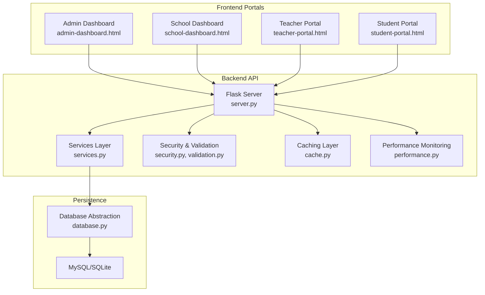
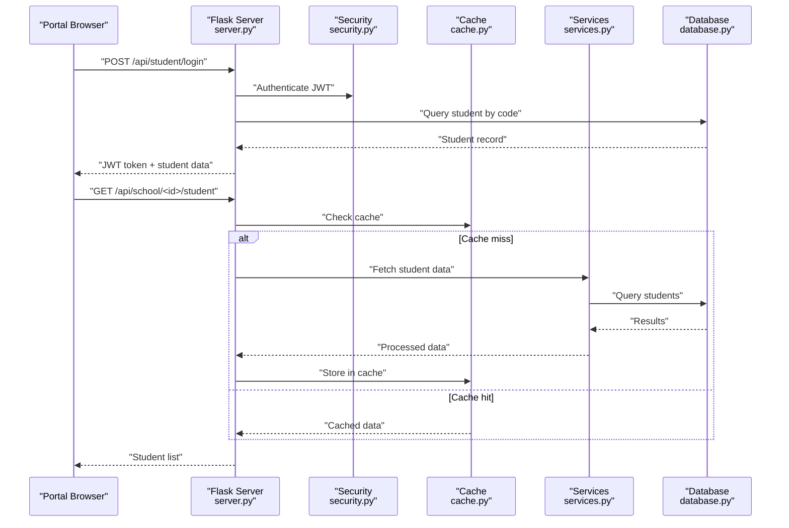
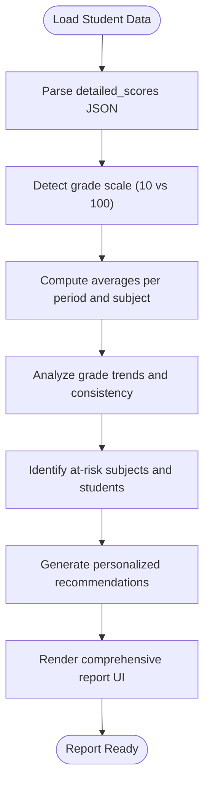
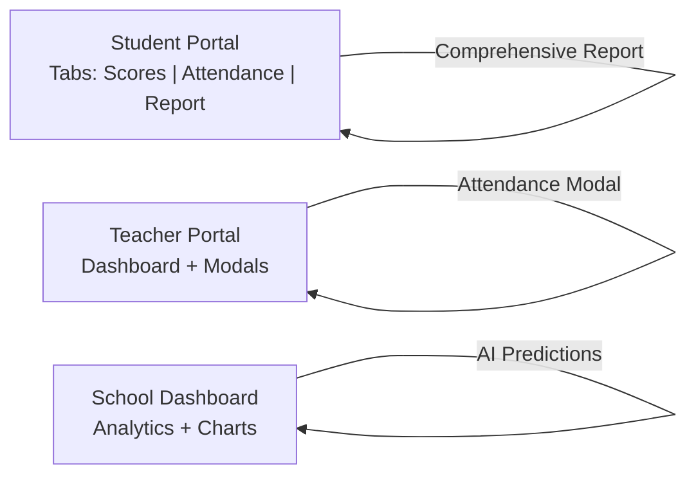
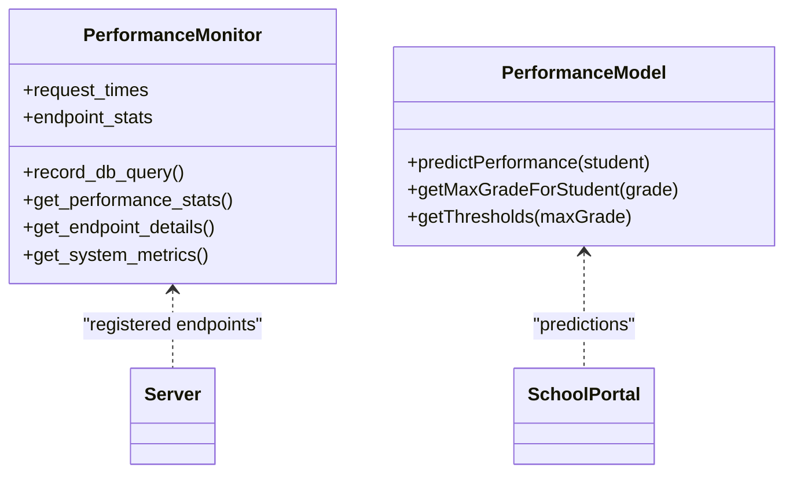
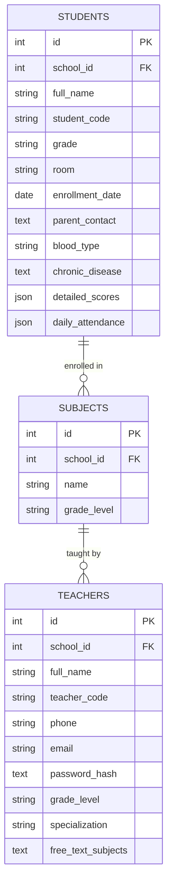
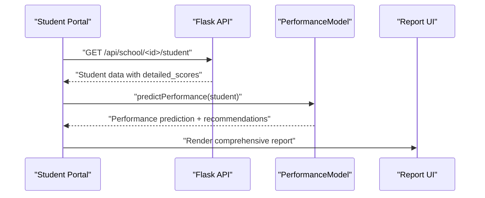
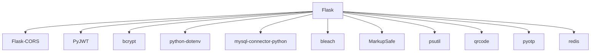

# Assessment Reporting System

<cite>
**Referenced Files in This Document**
- [README.md](file://README.md)
- [server.py](file://server.py)
- [database.py](file://database.py)
- [services.py](file://services.py)
- [performance.py](file://performance.py)
- [security.py](file://security.py)
- [cache.py](file://cache.py)
- [validation.py](file://validation.py)
- [requirements.txt](file://requirements.txt)
- [public/admin-dashboard.html](file://public/admin-dashboard.html)
- [public/teacher-portal.html](file://public/teacher-portal.html)
- [public/student-portal.html](file://public/student-portal.html)
- [public/school-dashboard.html](file://public/school-dashboard.html)
</cite>

## Table of Contents
1. [Introduction](#introduction)
2. [Project Structure](#project-structure)
3. [Core Components](#core-components)
4. [Architecture Overview](#architecture-overview)
5. [Detailed Component Analysis](#detailed-component-analysis)
6. [Dependency Analysis](#dependency-analysis)
7. [Performance Considerations](#performance-considerations)
8. [Troubleshooting Guide](#troubleshooting-guide)
9. [Conclusion](#conclusion)

## Introduction
This document describes the Assessment Reporting System built with Python and Flask. It focuses on report generation mechanisms, progress tracking displays, and academic performance dashboards. The system integrates student profiles, teacher dashboards, and administrative reporting requirements, and provides real-time analytics and multi-format export capabilities.

## Project Structure
The system follows a layered architecture:
- Frontend: HTML/CSS/JavaScript dashboards for admin, school, teacher, and student portals
- Backend: Flask server exposing REST endpoints for authentication, data management, and analytics
- Services: Business logic layer for recommendations and performance analytics
- Persistence: MySQL/SQLite via a unified connection abstraction
- Infrastructure: Security middleware, caching, performance monitoring, and validation

**Diagram sources**
- [server.py](file://server.py#L1-L200)
- [services.py](file://services.py#L1-L120)
- [database.py](file://database.py#L1-L120)
- [security.py](file://security.py#L1-L120)
- [cache.py](file://cache.py#L1-L120)
- [performance.py](file://performance.py#L1-L120)
- [public/admin-dashboard.html](file://public/admin-dashboard.html#L1-L174)
- [public/school-dashboard.html](file://public/school-dashboard.html#L1-L200)
- [public/teacher-portal.html](file://public/teacher-portal.html#L1-L120)
- [public/student-portal.html](file://public/student-portal.html#L1-L120)

**Section sources**
- [README.md](file://README.md#L1-L23)
- [requirements.txt](file://requirements.txt#L1-L14)

## Core Components
- Authentication and Authorization: JWT-based login for admin, school, and student; teacher login via code; role-based access control disabled for development
- Data Management: CRUD endpoints for schools, students, subjects, and teacher assignments
- Academic Data: Student grades and attendance stored as JSON fields with validation and scale-aware scoring
- Recommendations Engine: AI-powered academic insights for teachers and personalized guidance for students
- Performance Analytics: Dashboards with charts and AI predictions for performance trends
- Export Capabilities: Excel export for teacher and student lists from school dashboard

**Section sources**
- [server.py](file://server.py#L140-L304)
- [database.py](file://database.py#L138-L320)
- [services.py](file://services.py#L367-L765)
- [public/school-dashboard.html](file://public/school-dashboard.html#L270-L285)

## Architecture Overview
The backend exposes REST endpoints that integrate with a service layer for business logic, secured by middleware, cached for performance, and monitored for system metrics. The frontend portals consume these APIs to present dashboards and interactive reports.

**Diagram sources**
- [server.py](file://server.py#L258-L304)
- [security.py](file://security.py#L476-L578)
- [cache.py](file://cache.py#L14-L120)
- [services.py](file://services.py#L232-L282)
- [database.py](file://database.py#L120-L177)

## Detailed Component Analysis

### Report Generation Mechanisms
- Student Comprehensive Reports: The student portal generates a comprehensive academic report by analyzing detailed scores and attendance, computing averages, identifying trends, and providing personalized recommendations.
- Teacher Grade Recommendations: The teacher portal surfaces recommendations derived from subject performance analysis, class insights, and at-risk student identification.
- Administrative Yearly Reports: The admin dashboard supports academic year management and enables exporting school lists; the school dashboard provides export buttons for teachers and students.

**Diagram sources**
- [public/student-portal.html](file://public/student-portal.html#L556-L713)
- [public/student-portal.html](file://public/student-portal.html#L277-L549)

**Section sources**
- [public/student-portal.html](file://public/student-portal.html#L113-L125)
- [public/teacher-portal.html](file://public/teacher-portal.html#L522-L533)
- [public/admin-dashboard.html](file://public/admin-dashboard.html#L80-L97)

### Progress Tracking Displays
- Student Tabs: Detailed scores, daily attendance, and comprehensive report tabs with trend analysis and at-risk indicators.
- Teacher Dashboard: Overview cards for subjects, student counts, attendance rates, and grade averages; modal for managing grades and attendance.
- School Dashboard: Performance analytics with indicators (average grade, pass rate, attendance, excellence rate), charts, and AI predictions.

**Diagram sources**
- [public/student-portal.html](file://public/student-portal.html#L67-L125)
- [public/teacher-portal.html](file://public/teacher-portal.html#L477-L558)
- [public/school-dashboard.html](file://public/school-dashboard.html#L311-L377)

**Section sources**
- [public/student-portal.html](file://public/student-portal.html#L67-L125)
- [public/teacher-portal.html](file://public/teacher-portal.html#L477-L558)
- [public/school-dashboard.html](file://public/school-dashboard.html#L311-L377)

### Academic Performance Dashboards
- Real-time Metrics: PerformanceMonitor tracks request times, endpoint statistics, and system metrics for observability.
- AI Predictions: The PerformanceModel computes predicted performance levels, risk categories, and subject trends for proactive interventions.
- Visualizations: Chart.js renders grade and attendance distributions in the school dashboard.

**Diagram sources**
- [performance.py](file://performance.py#L15-L145)
- [public/school-dashboard.html](file://public/school-dashboard.html#L359-L377)

**Section sources**
- [performance.py](file://performance.py#L214-L241)
- [public/school-dashboard.html](file://public/school-dashboard.html#L359-L377)

### Report Templates and Data Formatting Standards
- Data Storage: Student detailed_scores and daily_attendance are stored as JSON fields in the students table, enabling flexible multi-period grade storage.
- Scale Awareness: The system detects elementary (1-4) versus higher grades to enforce appropriate score ranges (0-10 vs 0-100).
- Export Formats: The school dashboard provides Excel export buttons for teachers and students.

**Diagram sources**
- [database.py](file://database.py#L159-L177)
- [database.py](file://database.py#L197-L206)
- [database.py](file://database.py#L220-L234)

**Section sources**
- [server.py](file://server.py#L564-L767)
- [database.py](file://database.py#L159-L177)
- [public/school-dashboard.html](file://public/school-dashboard.html#L273-L280)

### Multi-format Export Capabilities
- Excel Export: Buttons on the school dashboard trigger Excel exports for teachers and students using SheetJS integration in the admin dashboard HTML.
- Future Enhancements: PDF and CSV exports can be integrated by adding server endpoints and client-side handlers similar to the existing Excel export pattern.

**Section sources**
- [public/admin-dashboard.html](file://public/admin-dashboard.html#L100-L104)
- [public/school-dashboard.html](file://public/school-dashboard.html#L273-L280)

### Real-time Reporting Features
- Live Dashboards: Teacher and school dashboards update in real-time as grades and attendance are saved.
- Performance Monitoring: X-Response-Time and X-Request-ID headers provide latency insights; endpoint statistics help identify slow routes.
- Caching: Redis or in-memory cache accelerates repeated reads of school, student, and teacher data.

**Section sources**
- [performance.py](file://performance.py#L49-L77)
- [cache.py](file://cache.py#L14-L120)

### Automated Report Scheduling
- Current State: No explicit scheduler is implemented in the codebase.
- Recommended Implementation: Integrate a job scheduler (e.g., APScheduler) to periodically generate and distribute reports, with configurable intervals and recipient lists.

[No sources needed since this section provides general guidance]

### Stakeholder Access Controls
- Authentication: JWT-based login for admin, school, and student; teacher login via code.
- Authorization: Role-based decorator currently allows all access (disabled for development).
- Security Enhancements: Input sanitization, rate limiting, audit logging, and 2FA support are available for production hardening.

**Section sources**
- [server.py](file://server.py#L91-L108)
- [security.py](file://security.py#L476-L578)

### Practical Examples

#### Report Creation Workflow (Student)
1. Student logs in via student portal
2. Detailed scores and attendance are fetched
3. Performance model computes averages, trends, and risk levels
4. Personalized recommendations are generated and displayed

**Diagram sources**
- [public/student-portal.html](file://public/student-portal.html#L717-L739)
- [public/student-portal.html](file://public/student-portal.html#L556-L713)

#### Custom Report Configuration (Teacher)
1. Teacher selects subject and class
2. System aggregates grades and attendance
3. Recommendations engine identifies weak areas and suggests actions
4. Teacher saves grades and views updated analytics

**Section sources**
- [public/teacher-portal.html](file://public/teacher-portal.html#L522-L533)
- [services.py](file://services.py#L367-L474)

#### Report Distribution Mechanism (School)
1. Admin selects academic year and filters
2. System generates analytics and predictions
3. Export buttons produce Excel files for stakeholders

**Section sources**
- [public/admin-dashboard.html](file://public/admin-dashboard.html#L80-L97)
- [public/school-dashboard.html](file://public/school-dashboard.html#L273-L280)

## Dependency Analysis
The system relies on Flask and supporting libraries for web, security, caching, and performance monitoring. Database connectivity is abstracted to support both MySQL and SQLite.

**Diagram sources**
- [requirements.txt](file://requirements.txt#L1-L14)

**Section sources**
- [requirements.txt](file://requirements.txt#L1-L14)

## Performance Considerations
- Caching: Use RedisCache or in-memory fallback to reduce database load for frequently accessed data.
- Query Optimization: Leverage database indexes on foreign keys and frequently filtered columns.
- Monitoring: Track slow endpoints and system metrics to identify bottlenecks.
- Scalability: Consider horizontal scaling and connection pooling for MySQL.

[No sources needed since this section provides general guidance]

## Troubleshooting Guide
- Authentication Issues: Verify JWT secret and environment configuration; ensure login endpoints receive sanitized inputs.
- Database Connectivity: Confirm MySQL host, user, password, and database settings; fallback to SQLite when MySQL is unavailable.
- Performance Problems: Review performance endpoints for slow routes and adjust caching strategies.
- Export Failures: Ensure SheetJS is loaded and Excel export buttons are bound to working handlers.

**Section sources**
- [server.py](file://server.py#L110-L139)
- [database.py](file://database.py#L88-L118)
- [performance.py](file://performance.py#L214-L241)
- [public/admin-dashboard.html](file://public/admin-dashboard.html#L16-L16)

## Conclusion
The Assessment Reporting System provides a robust foundation for academic reporting, progress tracking, and performance analytics. Its modular architecture supports real-time dashboards, AI-driven insights, and multi-format exports. With proper security hardening, caching, and scheduling enhancements, it can serve as a scalable solution for comprehensive school assessment reporting.