# Attendance Tracking System

<cite>
**Referenced Files in This Document**
- [README.md](file://README.md)
- [server.py](file://server.py)
- [database.py](file://database.py)
- [cache.py](file://cache.py)
- [auth.py](file://auth.py)
- [utils.py](file://utils.py)
- [services.py](file://services.py)
- [school.js](file://public/assets/js/school.js)
- [teacher.js](file://public/assets/js/teacher.js)
</cite>

## Table of Contents
1. [Introduction](#introduction)
2. [System Architecture](#system-architecture)
3. [Core Components](#core-components)
4. [Attendance Data Model](#attendance-data-model)
5. [Daily Attendance Recording](#daily-attendance-recording)
6. [Attendance Status Definitions](#attendance-status-definitions)
7. [Absence Management](#absence-management)
8. [Late Arrival and Early Departure Tracking](#late-arrival-and-early-departure-tracking)
9. [Attendance Analytics](#attendance-analytics)
10. [Report Generation](#report-generation)
11. [Integration with Academic Systems](#integration-with-academic-systems)
12. [Practical Workflows](#practical-workflows)
13. [Performance Considerations](#performance-considerations)
14. [Troubleshooting Guide](#troubleshooting-guide)
15. [Conclusion](#conclusion)

## Introduction

The EduFlow Attendance Tracking System is a comprehensive solution for managing student attendance within a school management ecosystem. Built with Python and Flask, this system provides robust attendance recording, analytics, and reporting capabilities integrated with academic grading and student information systems.

The system supports multiple attendance status types, detailed analytics, and seamless integration with teacher and administrative portals. It maintains separate storage for traditional daily attendance and academic year-based attendance records, enabling comprehensive tracking and reporting across different time periods.

## System Architecture

The attendance tracking system follows a layered architecture with clear separation between presentation, business logic, and data persistence layers.

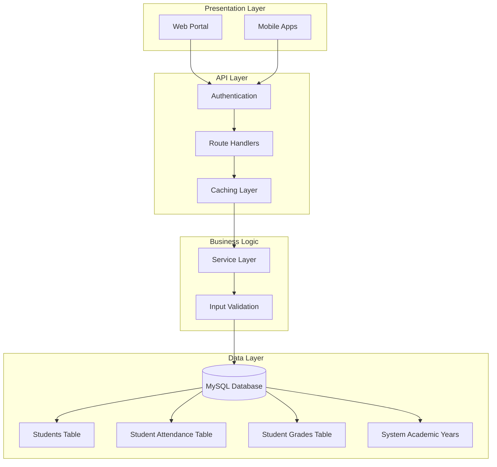

**Diagram sources**
- [server.py](file://server.py#L1-L80)
- [database.py](file://database.py#L120-L338)
- [cache.py](file://cache.py#L14-L305)

**Section sources**
- [README.md](file://README.md#L1-L23)
- [server.py](file://server.py#L1-L120)

## Core Components

### Database Schema Design

The system utilizes a normalized database design optimized for educational institutions:

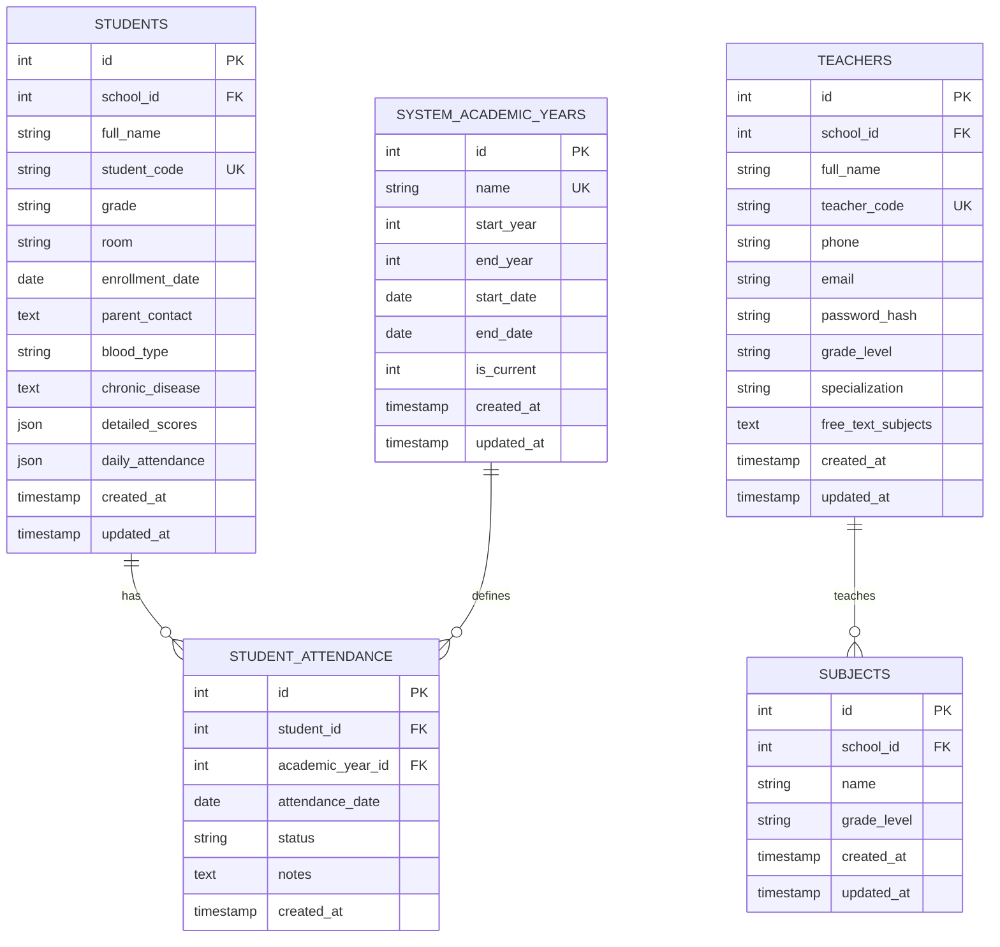

**Diagram sources**
- [database.py](file://database.py#L159-L320)

### Authentication and Security

The system implements JWT-based authentication with role-based access control:

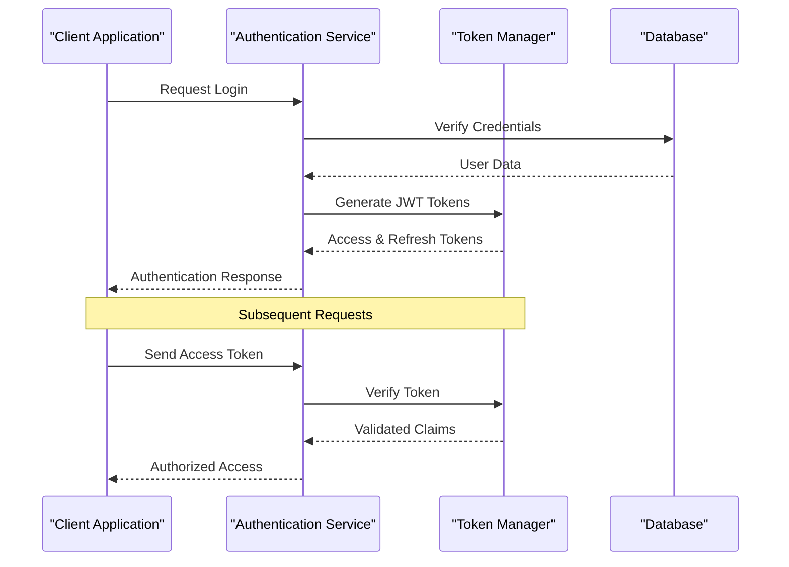

**Diagram sources**
- [auth.py](file://auth.py#L14-L190)
- [server.py](file://server.py#L142-L304)

**Section sources**
- [database.py](file://database.py#L120-L338)
- [auth.py](file://auth.py#L14-L376)

## Attendance Data Model

### Attendance Storage Structure

The system maintains dual attendance storage mechanisms:

1. **Daily Attendance**: Stored in student records as JSON for quick access
2. **Academic Year Attendance**: Stored in dedicated table for historical tracking

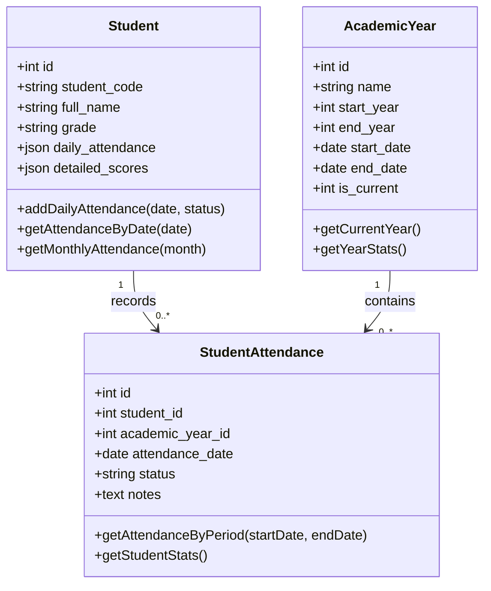

**Diagram sources**
- [database.py](file://database.py#L159-L320)
- [server.py](file://server.py#L1783-L1844)

**Section sources**
- [database.py](file://database.py#L308-L320)
- [server.py](file://server.py#L1783-L1844)

## Daily Attendance Recording

### Frontend Implementation

The daily attendance recording system provides an intuitive interface for teachers and administrators:

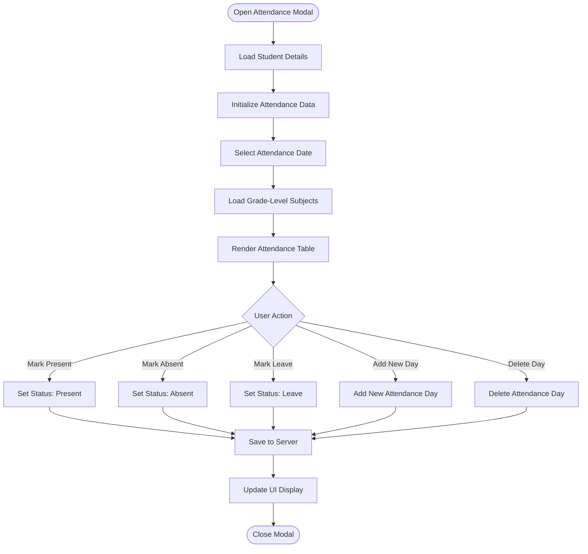

**Diagram sources**
- [school.js](file://public/assets/js/school.js#L3912-L4099)

### Backend API Endpoints

The system provides comprehensive API endpoints for attendance management:

| Endpoint | Method | Description |
|----------|--------|-------------|
| `/api/teacher/attendance` | POST | Record attendance for teacher's authorized students |
| `/api/student/{id}/detailed` | PUT | Update student detailed information including daily attendance |
| `/api/school/{id}/student` | POST | Create student with initial attendance structure |

**Section sources**
- [school.js](file://public/assets/js/school.js#L3912-L4099)
- [server.py](file://server.py#L1783-L1844)

## Attendance Status Definitions

### Status Types and Meanings

The system defines four primary attendance statuses:

| Status Code | Arabic Name | English Meaning | Usage Context |
|-------------|-------------|-----------------|---------------|
| `present` | حاضر | Present | Student attended class |
| `absent` | غائب | Absent | Student did not attend |
| `leave` | إجازة | Leave | Student had approved leave |
| `late` | متأخر | Late | Student arrived after start time |

### Status Validation and Processing

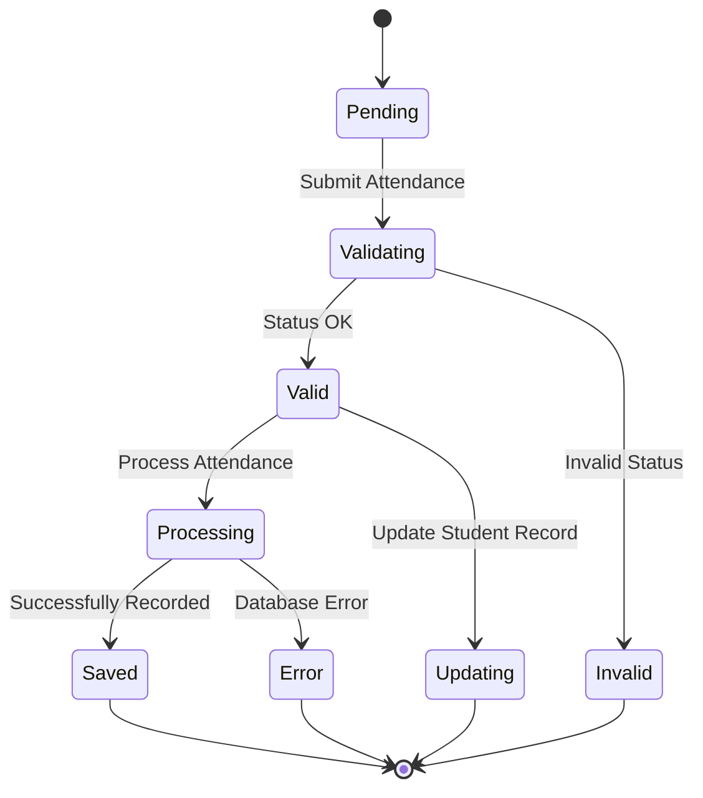

**Diagram sources**
- [server.py](file://server.py#L1783-L1844)
- [database.py](file://database.py#L310-L320)

**Section sources**
- [server.py](file://server.py#L1783-L1844)
- [database.py](file://database.py#L310-L320)

## Absence Management

### Absence Recording and Tracking

The system provides comprehensive absence management with automatic validation and reporting:

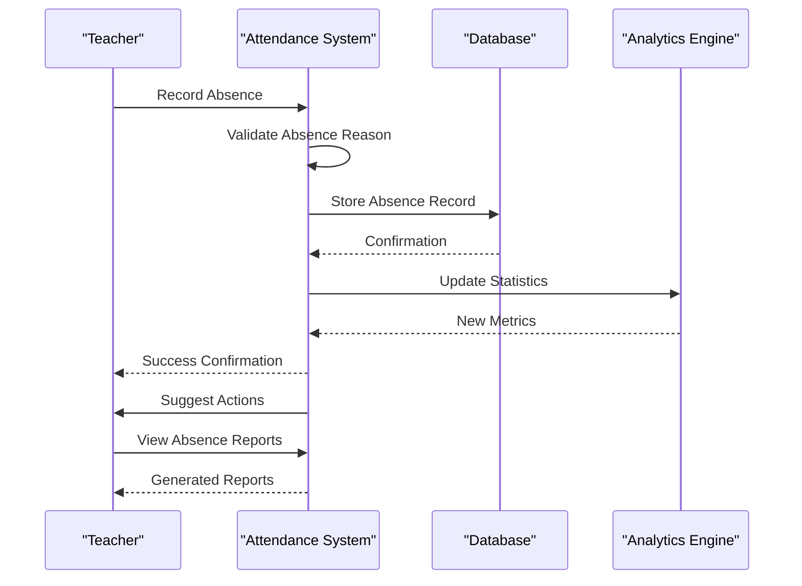

**Diagram sources**
- [server.py](file://server.py#L1783-L1844)
- [cache.py](file://cache.py#L260-L262)

### Absence Categories and Handling

| Absence Category | Description | Automatic Actions | Reporting Impact |
|------------------|-------------|-------------------|------------------|
| **Unexcused** | No documented reason | Alert teacher | Reduces class average |
| **Excused Medical** | Medical certificate | Waives penalty | Minimal impact |
| **Excused Family** | Family emergency | Waives penalty | No impact |
| **Educational Leave** | Approved educational activity | Waives penalty | No impact |

**Section sources**
- [server.py](file://server.py#L1783-L1844)
- [cache.py](file://cache.py#L260-L262)

## Late Arrival and Early Departure Tracking

### Time-Based Attendance Monitoring

The system tracks both late arrivals and early departures with configurable thresholds:

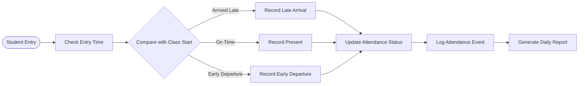

**Diagram sources**
- [school.js](file://public/assets/js/school.js#L4017-L4099)

### Threshold Configuration

| Metric | Default Threshold | Configurable |
|--------|------------------|--------------|
| **Late Arrival** | 15 minutes after start | Yes |
| **Early Departure** | Before class end | Yes |
| **Maximum Absence** | 4 hours continuous | Yes |
| **Grace Period** | 5 minutes per class | Yes |

**Section sources**
- [school.js](file://public/assets/js/school.js#L4017-L4099)

## Attendance Analytics

### Real-Time Analytics Dashboard

The system provides comprehensive analytics through interactive dashboards:

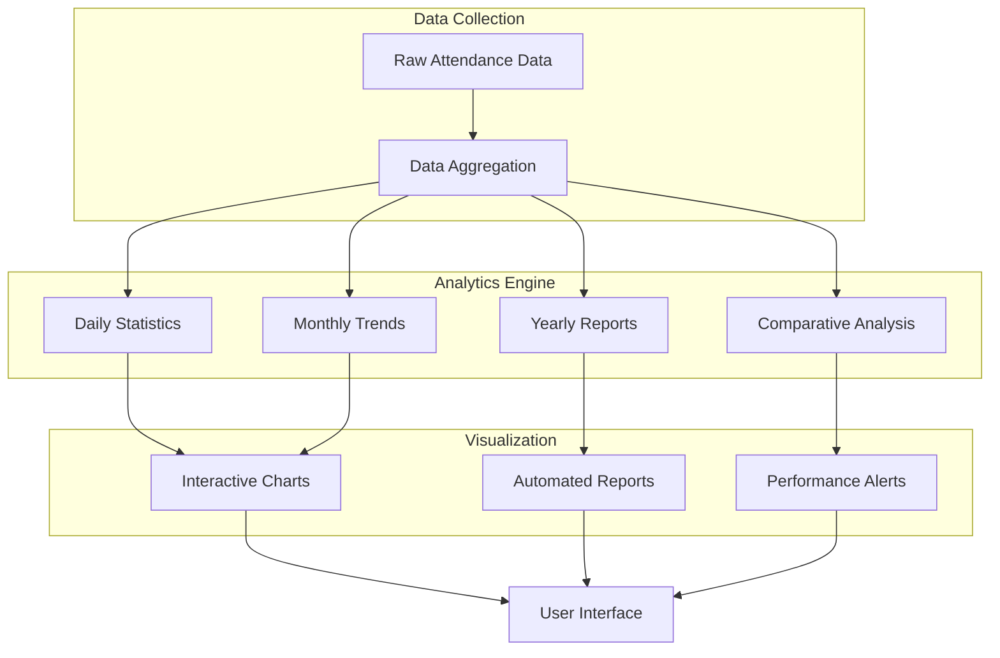

**Diagram sources**
- [cache.py](file://cache.py#L14-L305)
- [services.py](file://services.py#L367-L800)

### Analytics Capabilities

| Analytics Type | Available Metrics | Visualization |
|----------------|------------------|---------------|
| **Daily Analytics** | Present/Absent/Late counts | Pie charts, bar graphs |
| **Weekly Trends** | Attendance patterns | Line charts, trend indicators |
| **Monthly Summary** | Attendance percentages | Heatmaps, summary cards |
| **Yearly Statistics** | Academic year performance | Comparative charts |
| **Class Comparison** | Peer group analysis | Side-by-side comparisons |
| **Subject Analysis** | Subject-specific attendance | Detailed breakdowns |

**Section sources**
- [cache.py](file://cache.py#L14-L305)
- [services.py](file://services.py#L367-L800)

## Report Generation

### Automated Report System

The system generates comprehensive attendance reports with customizable parameters:

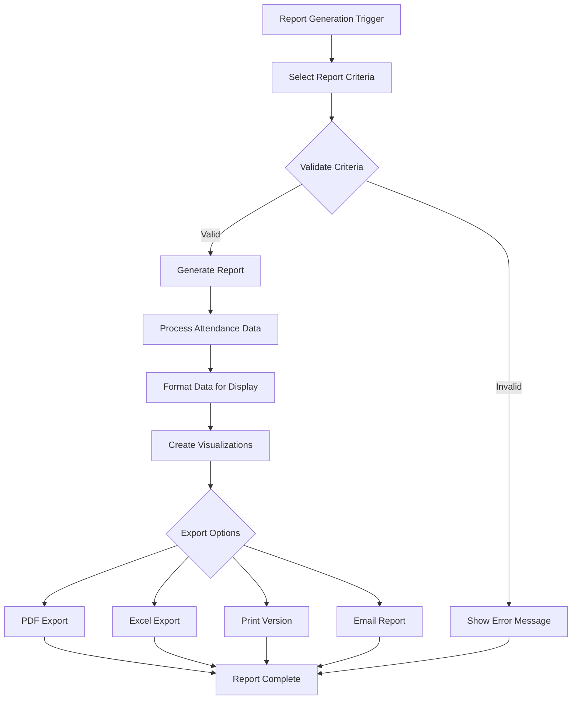

**Diagram sources**
- [school.js](file://public/assets/js/school.js#L5194-L5222)

### Report Types and Templates

| Report Type | Purpose | Frequency | Distribution |
|-------------|---------|-----------|--------------|
| **Daily Attendance Report** | Class attendance summary | Daily | Teacher, Administrator |
| **Weekly Progress Report** | Weekly attendance trends | Weekly | Parent, Teacher |
| **Monthly Summary Report** | Monthly performance overview | Monthly | Administrator |
| **Quarterly Analysis Report** | Quarterly achievement analysis | Quarterly | Principal, Board |
| **Annual Comprehensive Report** | Complete academic year summary | Annually | Stakeholders |

**Section sources**
- [school.js](file://public/assets/js/school.js#L5194-L5222)

## Integration with Academic Systems

### Seamless Academic Integration

The attendance system integrates deeply with the broader academic management framework:

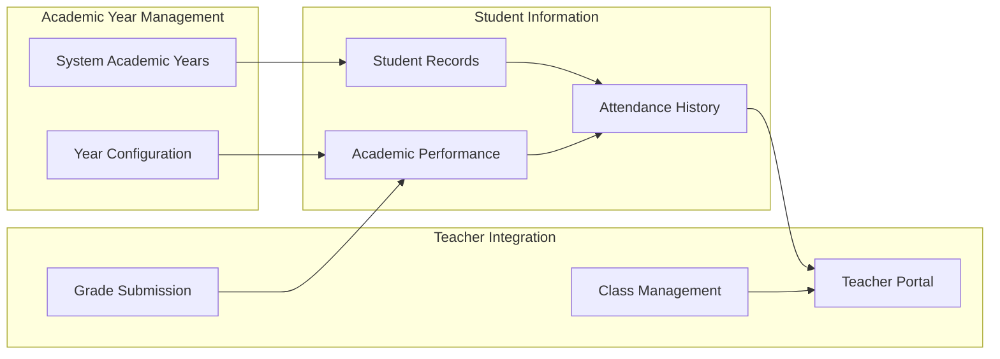

**Diagram sources**
- [server.py](file://server.py#L1845-L2090)
- [database.py](file://database.py#L261-L307)

### Cross-System Data Flow

| System Component | Data Exchange | Integration Point |
|------------------|---------------|-------------------|
| **Student Portal** | Attendance display | Public API |
| **Teacher Portal** | Attendance recording | Authenticated API |
| **Administrator Portal** | Analytics and reporting | Admin API |
| **Parent Portal** | Attendance notifications | Notification system |
| **Grade System** | Attendance impact | Academic calculations |

**Section sources**
- [server.py](file://server.py#L1845-L2090)
- [database.py](file://database.py#L261-L307)

## Practical Workflows

### Daily Attendance Entry Workflow

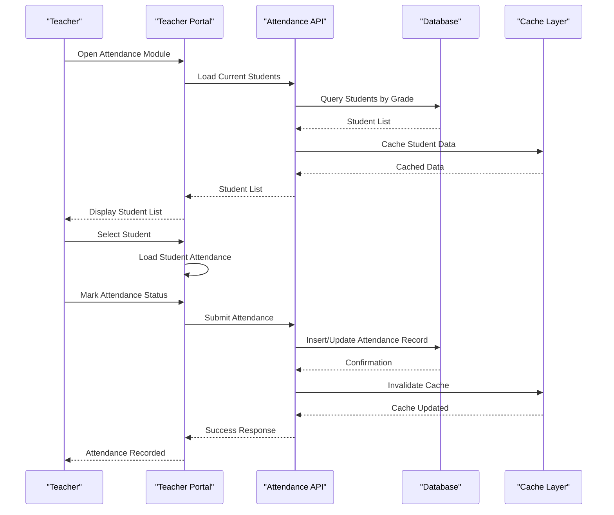

**Diagram sources**
- [teacher.js](file://public/assets/js/teacher.js#L1-L200)
- [server.py](file://server.py#L1783-L1844)

### Bulk Attendance Update Workflow

The system supports efficient bulk operations for multiple students:

| Operation | Trigger | Processing | Completion |
|-----------|---------|------------|------------|
| **Bulk Entry** | Teacher selects multiple students | Apply same status to all | Individual confirmation |
| **Date Range Update** | Teacher selects date range | Apply status across range | Batch confirmation |
| **Subject-Specific Update** | Teacher selects subject | Apply to all students in subject | Subject completion |
| **Class-wide Update** | Teacher selects entire class | Apply to all class members | Class completion |

**Section sources**
- [teacher.js](file://public/assets/js/teacher.js#L1-L200)
- [server.py](file://server.py#L1783-L1844)

## Performance Considerations

### Caching Strategy

The system implements a multi-layered caching strategy to optimize performance:

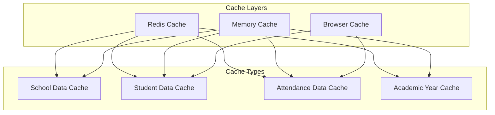

**Diagram sources**
- [cache.py](file://cache.py#L14-L305)

### Performance Optimization Techniques

| Optimization Area | Implementation | Benefits |
|------------------|----------------|----------|
| **Database Indexing** | Composite indexes on frequently queried columns | Faster data retrieval |
| **Connection Pooling** | MySQL connection pooling | Reduced connection overhead |
| **Query Optimization** | Optimized SQL queries with proper joins | Improved query performance |
| **Caching Strategy** | Multi-tier caching with TTL | Reduced database load |
| **Pagination Support** | Efficient pagination for large datasets | Better user experience |
| **Batch Operations** | Bulk insert/update operations | Reduced API calls |

**Section sources**
- [cache.py](file://cache.py#L14-L305)
- [server.py](file://server.py#L1-L120)

## Troubleshooting Guide

### Common Issues and Solutions

| Issue | Symptoms | Solution Steps |
|-------|----------|----------------|
| **Attendance Not Saving** | Changes revert after refresh | Check browser console for errors, verify network connectivity |
| **Missing Students** | Student list appears empty | Verify teacher authorization, check grade level assignment |
| **Duplicate Attendance Records** | Same date appears multiple times | Check for concurrent access, verify unique constraints |
| **Slow Performance** | Delayed response times | Clear browser cache, check server logs for bottlenecks |
| **Authentication Failures** | Cannot access system | Verify token validity, check JWT configuration |

### Error Handling Mechanisms

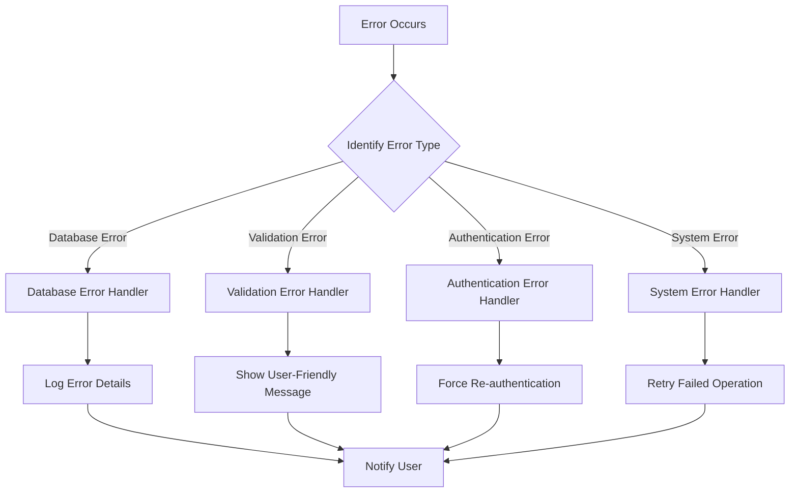

**Diagram sources**
- [utils.py](file://utils.py#L19-L26)
- [server.py](file://server.py#L2220-L2234)

**Section sources**
- [utils.py](file://utils.py#L19-L26)
- [server.py](file://server.py#L2220-L2234)

## Conclusion

The EduFlow Attendance Tracking System provides a comprehensive solution for educational institutions seeking robust attendance management capabilities. With its dual attendance storage model, extensive analytics features, and seamless integration with academic systems, the platform supports both operational efficiency and strategic decision-making.

Key strengths of the system include:

- **Flexible Data Model**: Supports both daily and academic year-based attendance tracking
- **Comprehensive Analytics**: Real-time dashboards and automated reporting
- **Scalable Architecture**: Multi-tier caching and optimized database design
- **User-Friendly Interface**: Intuitive web and mobile interfaces for all user types
- **Seamless Integration**: Deep integration with grading and student information systems

The system's modular design ensures maintainability and extensibility, allowing educational institutions to adapt the platform to their specific needs while maintaining data integrity and performance standards.