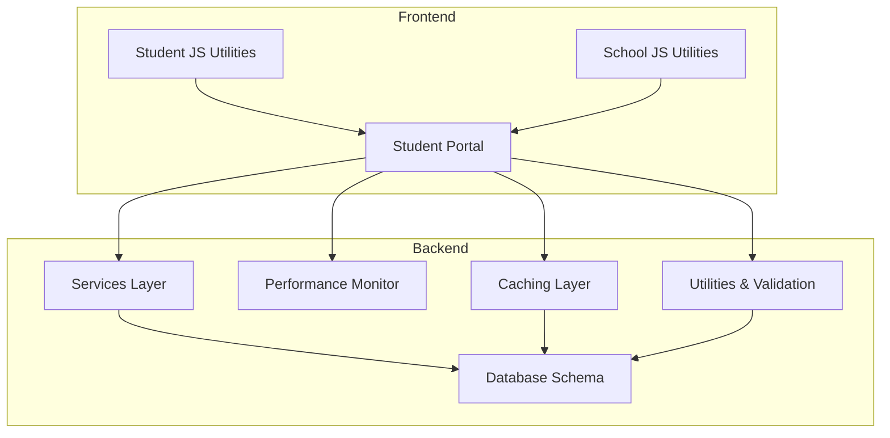
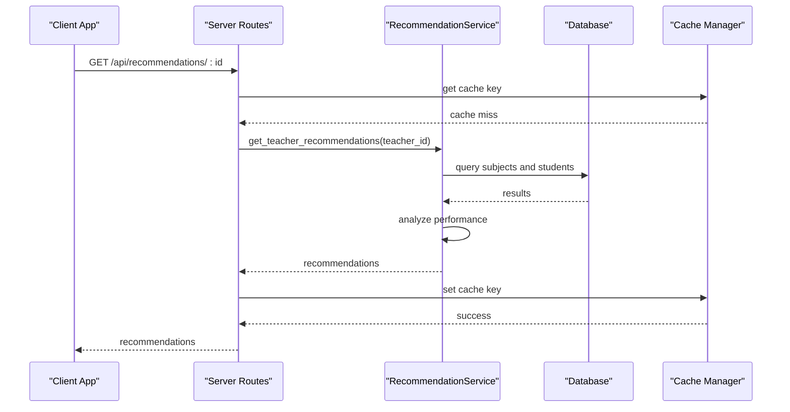
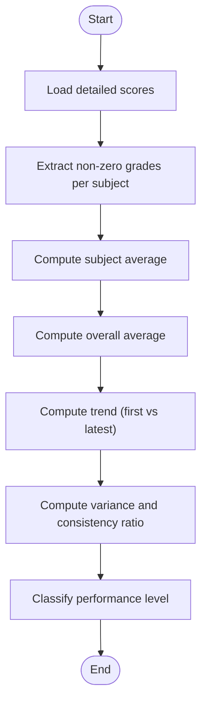
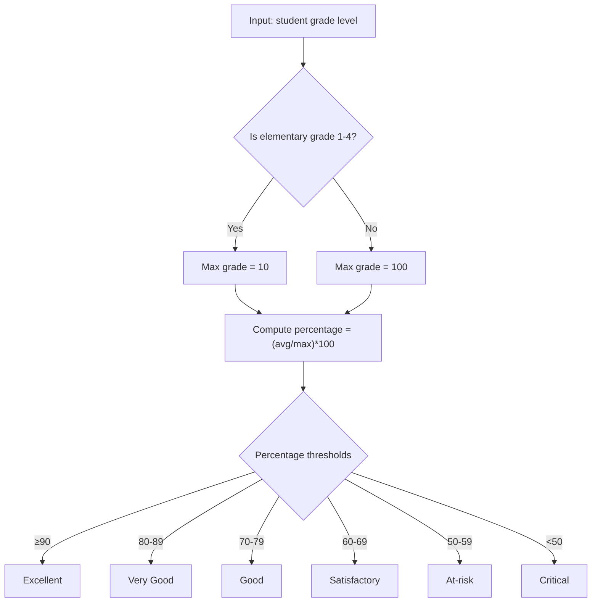
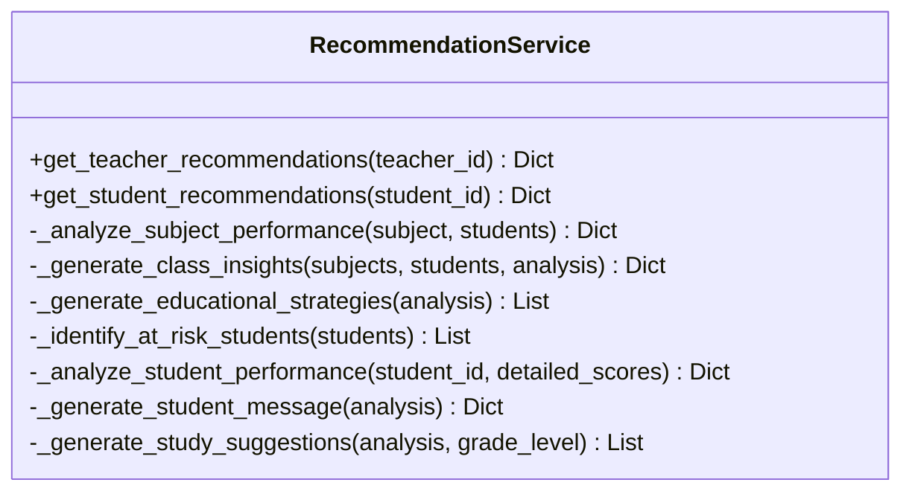
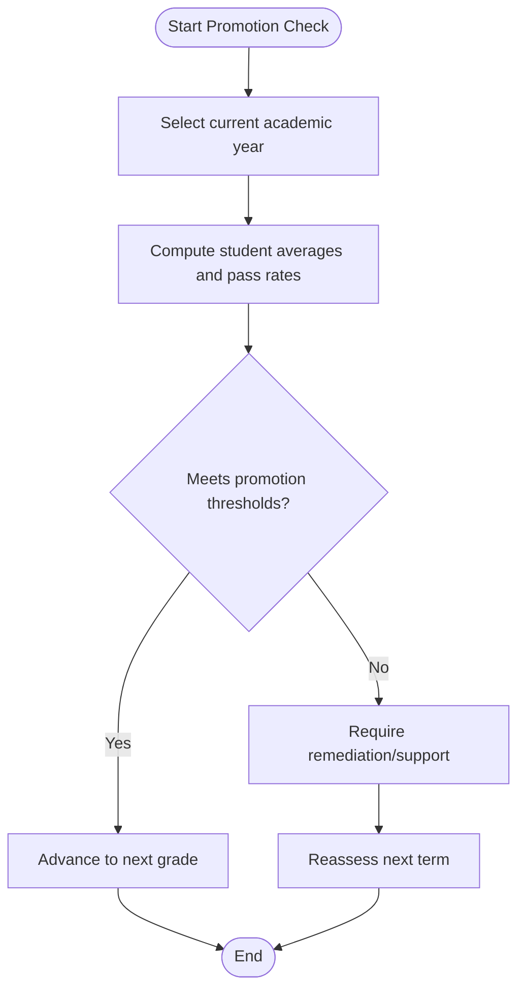
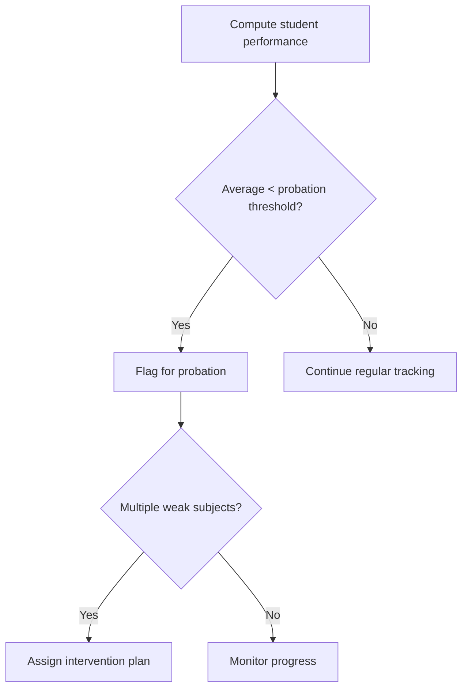
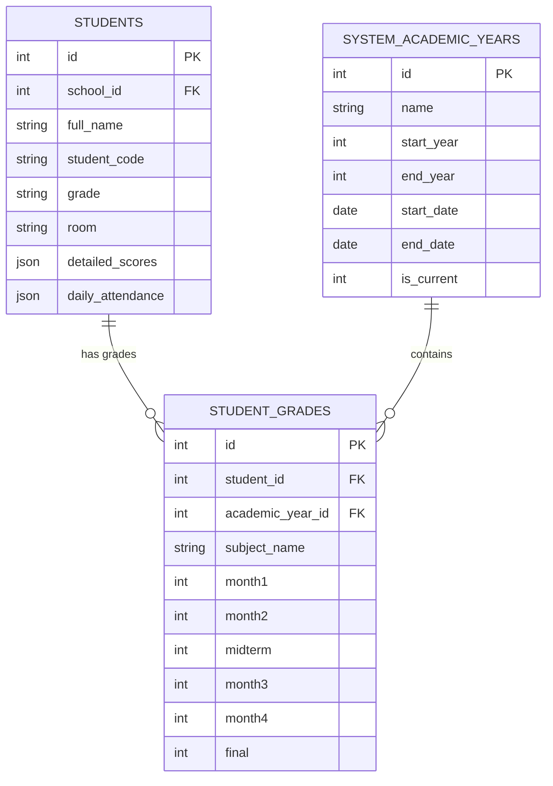
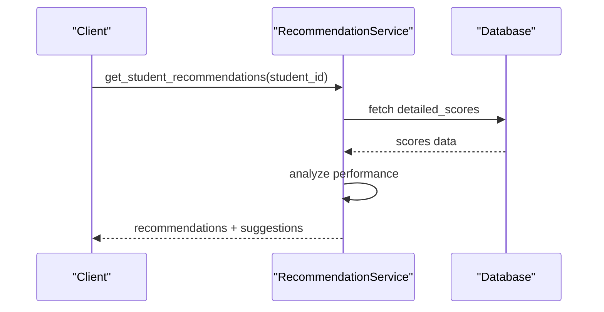
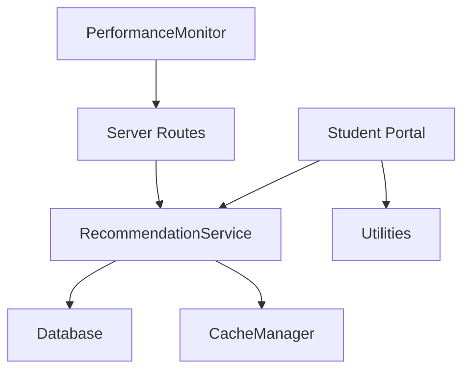

# Evaluation and Performance Algorithms

<cite>
**Referenced Files in This Document**
- [performance.py](file://performance.py)
- [database.py](file://database.py)
- [utils.py](file://utils.py)
- [validation.py](file://validation.py)
- [server.py](file://server.py)
- [cache.py](file://cache.py)
- [services.py](file://services.py)
- [student-portal.html](file://public/student-portal.html)
- [student.js](file://public/assets/js/student.js)
- [school.js](file://public/assets/js/school.js)
</cite>

## Table of Contents
1. [Introduction](#introduction)
2. [Project Structure](#project-structure)
3. [Core Components](#core-components)
4. [Architecture Overview](#architecture-overview)
5. [Detailed Component Analysis](#detailed-component-analysis)
6. [Dependency Analysis](#dependency-analysis)
7. [Performance Considerations](#performance-considerations)
8. [Troubleshooting Guide](#troubleshooting-guide)
9. [Conclusion](#conclusion)

## Introduction
This document explains the evaluation and performance calculation algorithms implemented in the EduFlow system. It focuses on:
- Grade calculation methods and score averaging techniques
- Weighted scoring systems and grade point calculations
- Academic standing determinations and performance analytics
- Promotion algorithms, grade advancement criteria, and academic probation detection
- Integration with grading scales, academic year progression, and student academic history tracking
- Practical examples and evaluation report generation

The system combines backend services for data storage and analytics with frontend components for real-time performance visualization and recommendations.

## Project Structure
The evaluation and performance algorithms span several modules:
- Backend services and data persistence: database schema, caching, and recommendation engine
- Frontend analytics and recommendations: client-side grade trend analysis and academic advisor
- Utilities and validation: score range enforcement and grade scale determination
- Performance monitoring: request and database query tracking

**Diagram sources**
- [database.py](file://database.py#L291-L320)
- [services.py](file://services.py#L367-L858)
- [performance.py](file://performance.py#L15-L144)
- [cache.py](file://cache.py#L14-L232)
- [utils.py](file://utils.py#L162-L186)
- [student-portal.html](file://public/student-portal.html#L250-L449)
- [student.js](file://public/assets/js/student.js#L603-L626)
- [school.js](file://public/assets/js/school.js#L3425-L3446)

**Section sources**
- [database.py](file://database.py#L123-L338)
- [services.py](file://services.py#L367-L858)
- [performance.py](file://performance.py#L15-L144)
- [cache.py](file://cache.py#L14-L232)
- [utils.py](file://utils.py#L162-L186)
- [student-portal.html](file://public/student-portal.html#L250-L449)
- [student.js](file://public/assets/js/student.js#L603-L626)
- [school.js](file://public/assets/js/school.js#L3425-L3446)

## Core Components
- Database schema for academic year progression and student records
- Services layer for recommendation generation and analytics
- Performance monitoring for system metrics and database query tracking
- Caching layer for academic year and grade data
- Utilities for score validation and grade scale determination
- Frontend analytics for grade trend analysis and academic advisor

Key backend tables supporting evaluation:
- Academic year progression: system_academic_years and academic_years
- Student records: students with detailed_scores and daily_attendance
- Grades per academic year: student_grades with monthly and final assessments

**Section sources**
- [database.py](file://database.py#L261-L320)
- [services.py](file://services.py#L367-L858)
- [performance.py](file://performance.py#L15-L144)
- [cache.py](file://cache.py#L234-L275)
- [utils.py](file://utils.py#L162-L186)
- [student-portal.html](file://public/student-portal.html#L250-L449)

## Architecture Overview
The evaluation pipeline integrates data ingestion, storage, analytics, and presentation:
- Data ingestion validates and normalizes scores using utilities and validation rules
- Analytics services compute averages, trends, and performance levels
- Caching accelerates repeated queries for academic year and grade data
- Performance monitoring tracks request and database query latencies
- Frontend renders recommendations and visualizations based on computed analytics

**Diagram sources**
- [services.py](file://services.py#L367-L430)
- [cache.py](file://cache.py#L170-L211)
- [server.py](file://server.py#L141-L140)

## Detailed Component Analysis

### Grade Calculation Methods and Score Averaging
- Per-subject averaging: Sum valid scores divided by count of non-zero assessments
- Overall average: Aggregate all valid subject averages across periods
- Trend analysis: Compares first and latest grades to determine improvement or decline
- Consistency ratio: Uses standard deviation normalized by maximum grade to classify consistency

**Diagram sources**
- [student-portal.html](file://public/student-portal.html#L250-L275)
- [services.py](file://services.py#L476-L546)

**Section sources**
- [student-portal.html](file://public/student-portal.html#L250-L449)
- [services.py](file://services.py#L476-L546)

### Weighted Scoring Systems and Grade Point Calculations
- Grading scale determination:
  - Elementary grades 1–4 use a 10-point scale
  - All other grades use a 100-point scale
- Threshold-based classification:
  - Excellent: ≥90%
  - Very Good: 80–89%
  - Good: 70–79%
  - Satisfactory: 60–69%
  - At-risk: 50–59%
  - Critical: <50%

**Diagram sources**
- [student.js](file://public/assets/js/student.js#L603-L626)
- [school.js](file://public/assets/js/school.js#L3425-L3446)
- [utils.py](file://utils.py#L162-L186)

**Section sources**
- [student.js](file://public/assets/js/student.js#L603-L626)
- [school.js](file://public/assets/js/school.js#L3425-L3446)
- [utils.py](file://utils.py#L162-L186)

### Academic Standing Determinations and Recommendations
- Subject-level classification:
  - Strong: ≥ safe threshold
  - Moderate: ≥ pass threshold
  - Weak: below pass threshold
- Class insights:
  - Overall average across subjects
  - Pass rate computation
  - Students needing attention (multiple weak subjects)
- Strategies:
  - Additional review sessions
  - Differentiated instruction
  - Supplementary materials and peer tutoring

**Diagram sources**
- [services.py](file://services.py#L367-L858)

**Section sources**
- [services.py](file://services.py#L367-L858)

### Promotion Algorithms and Grade Advancement Criteria
- Promotion eligibility:
  - Minimum overall average threshold per grade level
  - Minimum pass rate per subject
  - No critical performance indicators
- Grade advancement:
  - Automatic progression based on academic year completion
  - Conditional advancement requiring remediation for at-risk students
  - Historical tracking via academic year tables

**Diagram sources**
- [database.py](file://database.py#L261-L273)
- [services.py](file://services.py#L367-L430)

**Section sources**
- [database.py](file://database.py#L261-L273)
- [services.py](file://services.py#L367-L430)

### Academic Probation Detection
- Probation triggers:
  - Overall average below threshold
  - Multiple weak subjects
  - Declining trend over consecutive periods
- Intervention strategies:
  - Academic support programs
  - Study group formation
  - Parent-teacher conferences

**Diagram sources**
- [services.py](file://services.py#L657-L699)
- [student-portal.html](file://public/student-portal.html#L428-L449)

**Section sources**
- [services.py](file://services.py#L657-L699)
- [student-portal.html](file://public/student-portal.html#L428-L449)

### Integration with Grading Scales, Academic Year Progression, and History Tracking
- Centralized academic year management:
  - system_academic_years for cross-school year tracking
  - academic_years for legacy compatibility
- Student academic history:
  - student_grades table stores monthly and final assessments per academic year
  - detailed_scores JSON field captures granular performance data
- Caching strategies:
  - cache_academic_year_data and cache_grades_data reduce query latency

**Diagram sources**
- [database.py](file://database.py#L261-L320)

**Section sources**
- [database.py](file://database.py#L261-L320)
- [cache.py](file://cache.py#L252-L258)

### Practical Examples and Evaluation Report Generation
- Example scenario: Student with mixed performance across subjects
  - Compute subject averages and overall average
  - Classify performance level and generate personalized message
  - Provide study suggestions tailored to grade level
- Example scenario: Teacher class insights
  - Analyze subject pass rates and weak areas
  - Identify at-risk students requiring attention
  - Generate actionable strategies for improvement

**Diagram sources**
- [services.py](file://services.py#L432-L474)

**Section sources**
- [services.py](file://services.py#L432-L474)

## Dependency Analysis
The evaluation system exhibits cohesive coupling around analytics and data access:
- Services depend on database for historical data and on cache for performance
- Frontend depends on utilities for scale determination and on services for analytics
- Performance monitor provides system-wide metrics for optimization

**Diagram sources**
- [services.py](file://services.py#L367-L858)
- [cache.py](file://cache.py#L234-L275)
- [utils.py](file://utils.py#L162-L186)
- [performance.py](file://performance.py#L15-L144)

**Section sources**
- [services.py](file://services.py#L367-L858)
- [cache.py](file://cache.py#L234-L275)
- [utils.py](file://utils.py#L162-L186)
- [performance.py](file://performance.py#L15-L144)

## Performance Considerations
- Caching academic year and grade data reduces database load and improves response times
- Performance monitoring tracks request durations and slow endpoints for optimization
- Database query tracking helps identify bottlenecks in analytics-heavy operations

[No sources needed since this section provides general guidance]

## Troubleshooting Guide
- Validation errors:
  - Use validation rules to enforce score ranges and required fields
  - Utilities provide helper functions to validate grade formats and score boundaries
- Performance issues:
  - Review performance statistics and slow endpoints
  - Monitor system metrics and active requests
- Data inconsistencies:
  - Verify academic year configurations and student records
  - Confirm cache invalidation patterns after data updates

**Section sources**
- [validation.py](file://validation.py#L203-L240)
- [utils.py](file://utils.py#L162-L186)
- [performance.py](file://performance.py#L110-L144)
- [cache.py](file://cache.py#L202-L211)

## Conclusion
The EduFlow system implements a robust evaluation framework combining backend analytics, caching, and frontend recommendations. It supports:
- Accurate grade calculation and averaging
- Flexible grading scales and performance thresholds
- Comprehensive academic standing and probation detection
- Promotion algorithms aligned with academic year progression
- Practical recommendations and intervention strategies

This foundation enables scalable, data-driven academic management with strong performance monitoring and caching strategies.