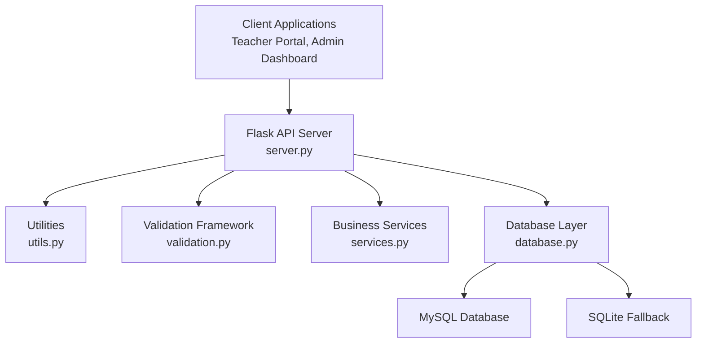
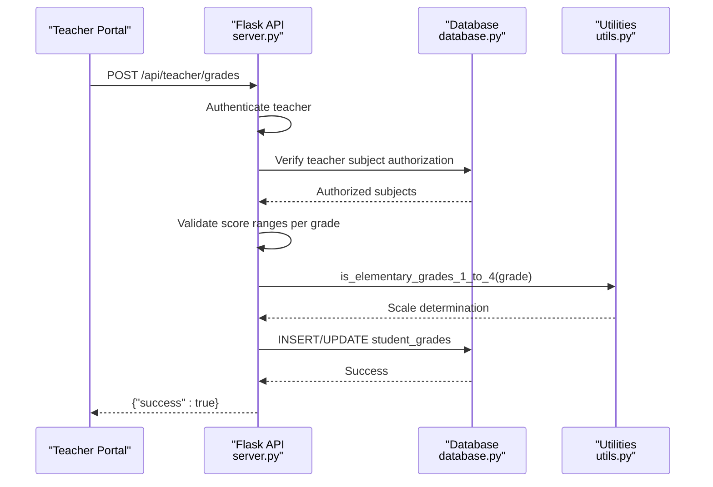
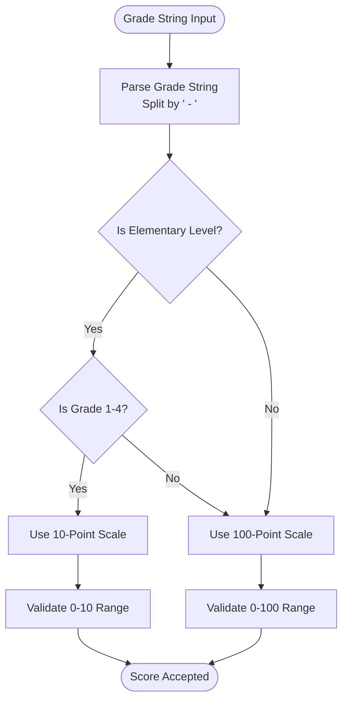
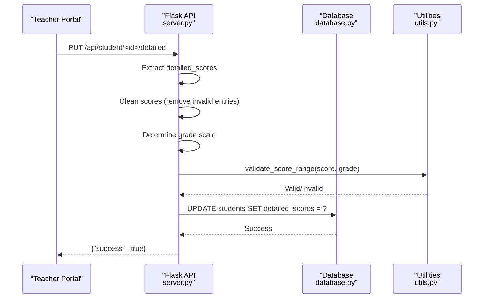
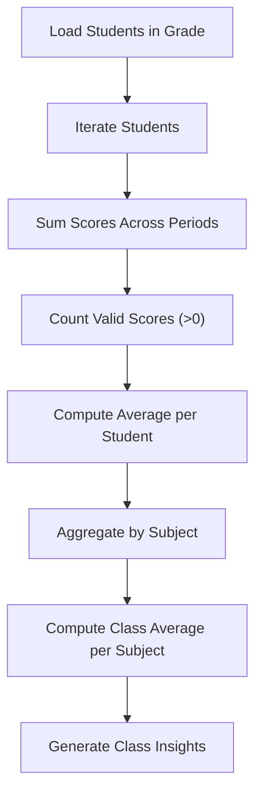
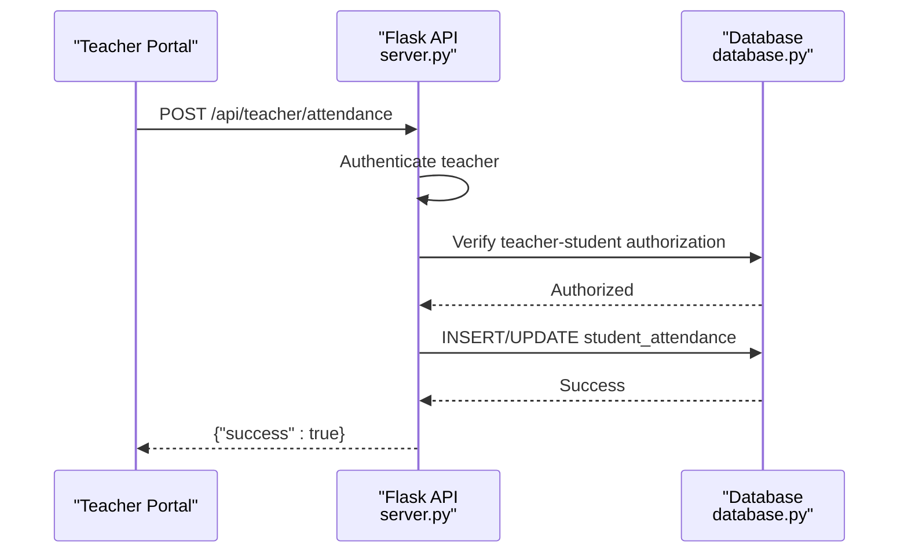
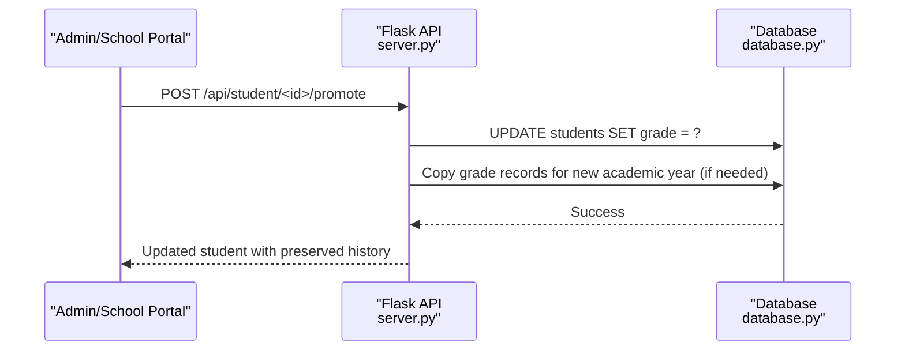
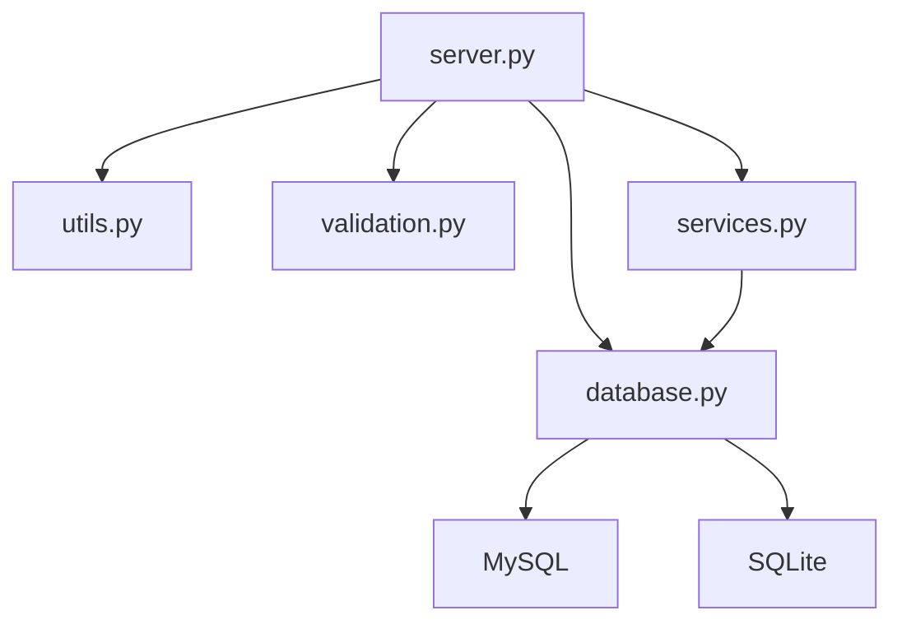

# Grading and Assessment System

<cite>
**Referenced Files in This Document**
- [server.py](file://server.py)
- [database.py](file://database.py)
- [utils.py](file://utils.py)
- [validation.py](file://validation.py)
- [services.py](file://services.py)
</cite>

## Table of Contents
1. [Introduction](#introduction)
2. [Project Structure](#project-structure)
3. [Core Components](#core-components)
4. [Architecture Overview](#architecture-overview)
5. [Detailed Component Analysis](#detailed-component-analysis)
6. [Dependency Analysis](#dependency-analysis)
7. [Performance Considerations](#performance-considerations)
8. [Troubleshooting Guide](#troubleshooting-guide)
9. [Conclusion](#conclusion)

## Introduction
This document describes the comprehensive grading and assessment system implemented in the EduFlow platform. It covers:
- Dual-scale grading system supporting both 10-point scale for elementary grades (1-4) and 100-point scale for higher grades
- Subject-specific scoring, period-based assessments (monthly, midterm, final), and score validation rules
- Score entry workflows for teachers, score modification procedures, and score aggregation mechanisms
- Attendance tracking with daily attendance recording, absence management, and attendance analytics
- Grade calculation algorithms, score averaging, and performance evaluation methods
- Integration with student profiles, subject assignments, and academic year tracking

## Project Structure
The system is implemented as a Flask-based backend with a MySQL-compatible persistence layer. Key modules:
- server.py: API endpoints for grading, attendance, academic year management, and teacher workflows
- database.py: Database schema definition and connection management (MySQL or SQLite fallback)
- utils.py: Utility functions for validation, score range checks, and formatting
- validation.py: Input validation framework for robust data validation
- services.py: Business logic services layered away from routes

**Diagram sources**
- [server.py](file://server.py#L1-L25)
- [database.py](file://database.py#L88-L118)
- [utils.py](file://utils.py#L27-L186)
- [validation.py](file://validation.py#L10-L240)
- [services.py](file://services.py#L12-L43)

**Section sources**
- [server.py](file://server.py#L1-L25)
- [database.py](file://database.py#L120-L338)

## Core Components
- Dual-scale grading engine: Determines whether a grade uses 10-point or 100-point scale based on grade string parsing
- Score validation: Enforces score boundaries per grade level and cleans detailed scores
- Academic year management: Centralized system academic years with automatic current year detection
- Teacher-grade management: Teacher-specific endpoints to add/update grades and record attendance
- Student profile integration: Stores detailed scores and daily attendance JSON fields in student records
- Class averages and analytics: Computes class-wide averages and performance insights

**Section sources**
- [server.py](file://server.py#L52-L90)
- [utils.py](file://utils.py#L163-L186)
- [server.py](file://server.py#L1708-L1843)
- [database.py](file://database.py#L159-L177)
- [server.py](file://server.py#L2351-L2414)

## Architecture Overview
The grading and assessment system is built around:
- Centralized academic year management using a system-wide table
- Teacher authorization to access only their assigned subjects and students
- JSON-based storage of detailed scores and daily attendance in student profiles
- Period-based scoring with monthly, midterm, and final periods

**Diagram sources**
- [server.py](file://server.py#L1708-L1781)
- [utils.py](file://utils.py#L123-L161)
- [database.py](file://database.py#L291-L307)

## Detailed Component Analysis

### Dual-Scale Grading System
- Elementary grades (1-4) use a 10-point scale; higher grades use a 100-point scale
- The system determines scale by parsing the grade string and checking for elementary indicators
- Validation enforces appropriate score bounds during updates

**Diagram sources**
- [server.py](file://server.py#L52-L90)
- [utils.py](file://utils.py#L123-L186)

**Section sources**
- [server.py](file://server.py#L52-L90)
- [utils.py](file://utils.py#L123-L186)

### Score Management and Validation
- Detailed scores stored per student as JSON with subject → periods mapping
- Validation cleans invalid entries and enforces score bounds based on grade
- Teacher endpoints validate subject authorization and grade level eligibility

**Diagram sources**
- [server.py](file://server.py#L683-L766)
- [utils.py](file://utils.py#L163-L186)

**Section sources**
- [server.py](file://server.py#L683-L766)
- [utils.py](file://utils.py#L163-L186)

### Period-Based Assessments and Aggregation
- Scoring periods: month1, month2, midterm, month3, month4, final
- Class averages computed by aggregating per-student averages per subject
- Analytics endpoints provide class insights and strategies

**Diagram sources**
- [server.py](file://server.py#L2351-L2414)

**Section sources**
- [server.py](file://server.py#L2351-L2414)

### Attendance Tracking System
- Daily attendance recorded with date, status, and notes
- Teacher authorization ensures attendance is only editable for their students
- Analytics include daily attendance dictionaries and raw records

**Diagram sources**
- [server.py](file://server.py#L1783-L1843)

**Section sources**
- [server.py](file://server.py#L1783-L1843)
- [server.py](file://server.py#L2416-L2481)

### Academic Year Tracking and Promotion
- Centralized academic years managed system-wide with automatic current year detection
- Promotion endpoint advances students to next grade while preserving historical records
- Automatic grade copying for new academic year when promoting

**Diagram sources**
- [server.py](file://server.py#L2526-L2625)

**Section sources**
- [server.py](file://server.py#L1847-L1925)
- [server.py](file://server.py#L2526-L2625)

### Practical Examples

#### Example 1: Score Entry for Elementary Grade (10-point scale)
- Scenario: Teacher enters scores for "ابتدائي - الأول الابتدائي" (Elementary Grade 1)
- Expected behavior: Scores must be between 0 and 10
- Workflow:
  - Teacher submits grades via POST /api/teacher/grades
  - Backend determines 10-point scale
  - Validation enforces 0–10 range
  - Grades saved to student_grades table

**Section sources**
- [server.py](file://server.py#L1708-L1781)
- [utils.py](file://utils.py#L123-L186)

#### Example 2: Score Entry for Higher Grade (100-point scale)
- Scenario: Teacher enters scores for "ثانوية - الثالثة الثانوية"
- Expected behavior: Scores must be between 0 and 100
- Workflow:
  - Same endpoint as above
  - Backend determines 100-point scale
  - Validation enforces 0–100 range

**Section sources**
- [server.py](file://server.py#L1708-L1781)
- [utils.py](file://utils.py#L123-L186)

#### Example 3: Class Average Calculation
- Scenario: Compute averages for a grade level
- Workflow:
  - Load all students in the grade
  - For each student, compute average per subject across periods
  - Aggregate averages by subject to produce class averages

**Section sources**
- [server.py](file://server.py#L2351-L2414)

#### Example 4: Student Promotion
- Scenario: Promote a student to the next grade level
- Workflow:
  - Update student's grade
  - Copy grade records for new academic year if needed
  - Preserve historical data

**Section sources**
- [server.py](file://server.py#L2526-L2625)

## Dependency Analysis
The system exhibits clear separation of concerns:
- server.py orchestrates API endpoints and delegates to utilities and database layer
- database.py centralizes schema and connection management
- utils.py encapsulates domain logic (score validation, grade parsing)
- validation.py provides reusable validation rules
- services.py abstracts business logic

**Diagram sources**
- [server.py](file://server.py#L1-L18)
- [database.py](file://database.py#L88-L118)
- [utils.py](file://utils.py#L27-L186)
- [validation.py](file://validation.py#L10-L240)
- [services.py](file://services.py#L12-L43)

**Section sources**
- [server.py](file://server.py#L1-L18)
- [database.py](file://database.py#L88-L118)

## Performance Considerations
- JSON fields for detailed_scores and daily_attendance enable flexible schema evolution
- Teacher authorization reduces unnecessary data scans by limiting access to authorized subjects/students
- Centralized academic year management avoids per-school duplication and simplifies queries
- Recommendations service computes insights client-side for reduced server load

## Troubleshooting Guide
Common issues and resolutions:
- Unauthorized subject access: Ensure teacher is assigned to the subject and grade level
- Invalid score range: Confirm grade scale (10 vs 100) matches the grade string
- Missing academic year: Use system academic year endpoints to create or select current year
- Attendance not saving: Verify teacher-student authorization and date format

**Section sources**
- [server.py](file://server.py#L1725-L1758)
- [utils.py](file://utils.py#L163-L186)
- [server.py](file://server.py#L1931-L1954)

## Conclusion
The EduFlow grading and assessment system provides a robust, scalable solution for managing academic performance across diverse grade levels. Its dual-scale grading engine, comprehensive validation, and integrated analytics enable accurate tracking of student progress while maintaining flexibility for future enhancements.