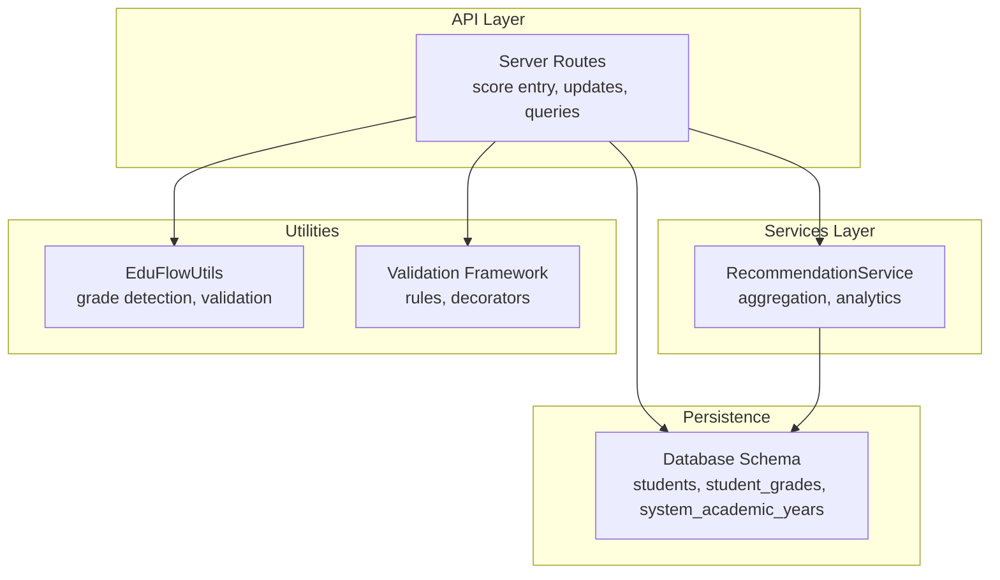
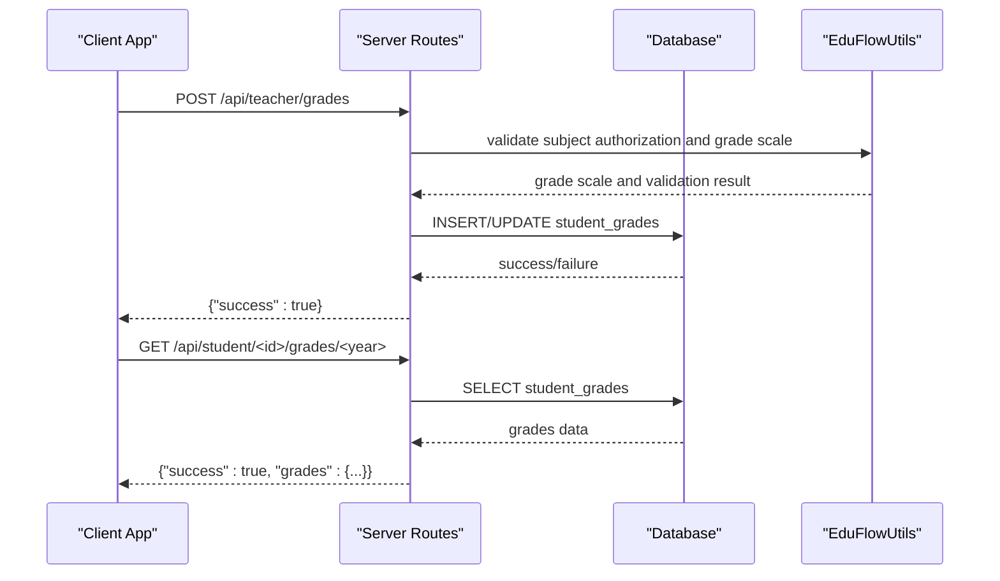
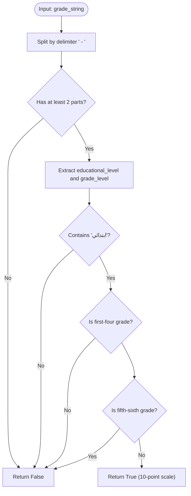
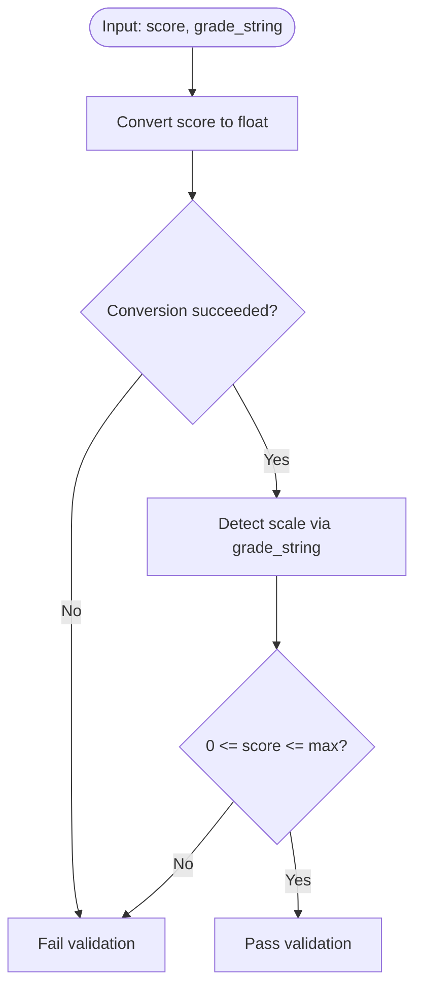
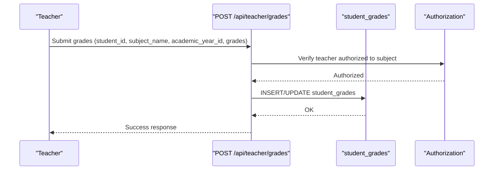
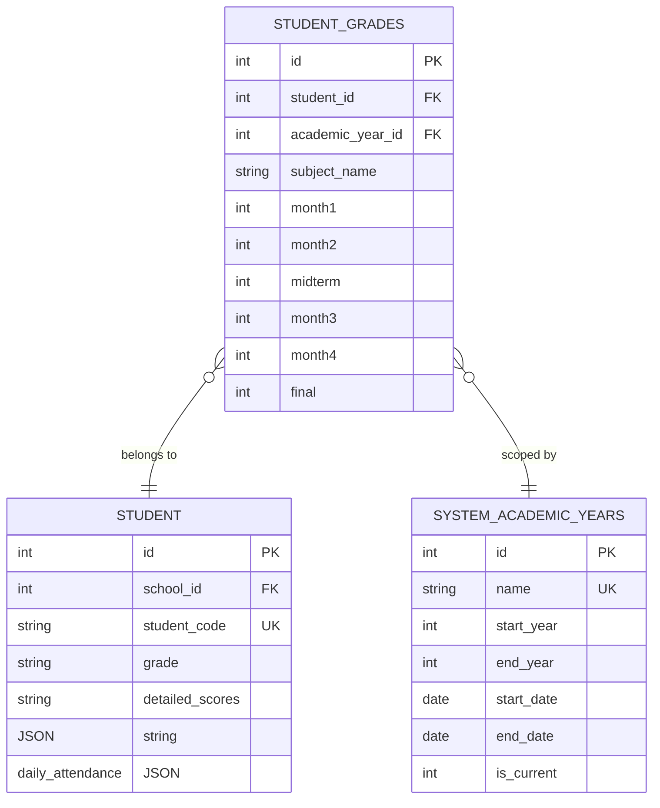
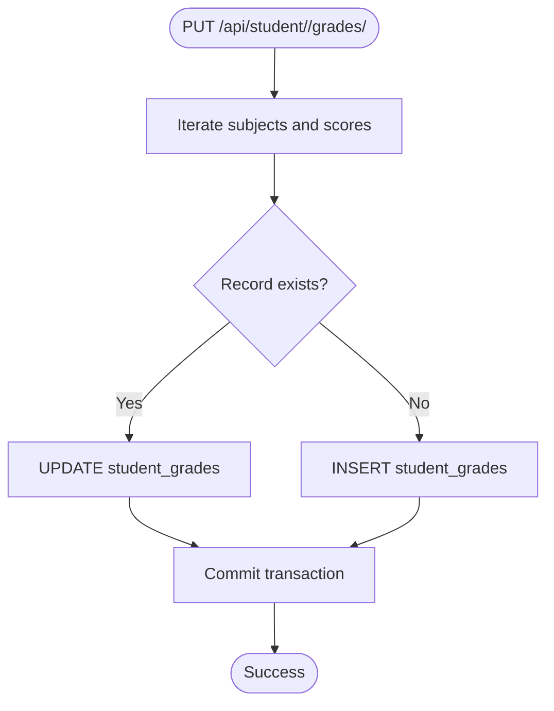
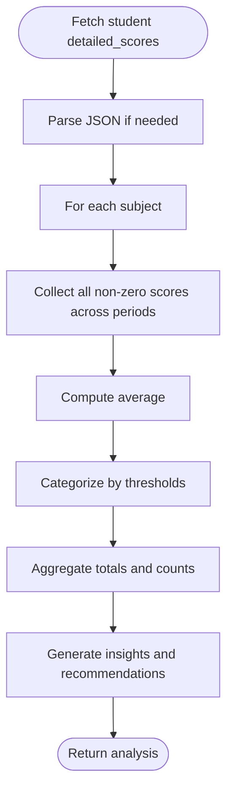
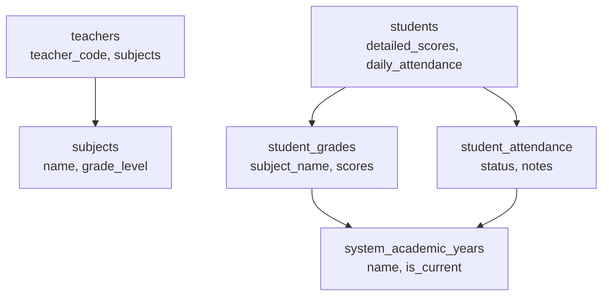
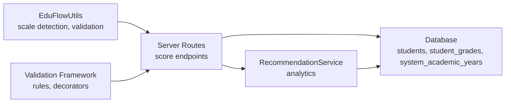

# Score Management System

<cite>
**Referenced Files in This Document**
- [server.py](file://server.py)
- [database.py](file://database.py)
- [utils.py](file://utils.py)
- [validation.py](file://validation.py)
- [validation_helpers.py](file://validation_helpers.py)
- [services.py](file://services.py)
</cite>

## Table of Contents
1. [Introduction](#introduction)
2. [Project Structure](#project-structure)
3. [Core Components](#core-components)
4. [Architecture Overview](#architecture-overview)
5. [Detailed Component Analysis](#detailed-component-analysis)
6. [Dependency Analysis](#dependency-analysis)
7. [Performance Considerations](#performance-considerations)
8. [Troubleshooting Guide](#troubleshooting-guide)
9. [Conclusion](#conclusion)

## Introduction
This document describes the score management system component of the EduFlow platform. It focuses on the dual-scale grading implementation (10-point scale for elementary grades 1–4 and 100-point scale for higher grades), score validation rules, grade conversion algorithms, and score entry workflows. It also covers subject-specific scoring, score modification procedures, score aggregation calculations, integration with student profiles and academic year tracking, and score persistence mechanisms with data integrity checks.

## Project Structure
The score management system spans several modules:
- Backend API endpoints for score entry, updates, and retrieval
- Database schema supporting both legacy student profile scoring and centralized academic year scoring
- Utility functions for grade detection and score validation
- Validation framework for robust input handling
- Services layer for recommendation and analytics

**Diagram sources**
- [server.py](file://server.py#L52-L90)
- [database.py](file://database.py#L159-L320)
- [utils.py](file://utils.py#L123-L186)
- [validation.py](file://validation.py#L10-L240)
- [services.py](file://services.py#L367-L766)

**Section sources**
- [server.py](file://server.py#L52-L90)
- [database.py](file://database.py#L159-L320)
- [utils.py](file://utils.py#L123-L186)
- [validation.py](file://validation.py#L10-L240)
- [services.py](file://services.py#L367-L766)

## Core Components
- Dual-scale grading engine: determines whether a grade uses a 10-point or 100-point scale based on grade string parsing.
- Score validation pipeline: enforces numeric ranges per scale and cleans malformed data.
- Score entry workflows: endpoints for adding/updating student scores and attendance per academic year.
- Score aggregation and analytics: computes averages, pass rates, and generates recommendations.
- Academic year tracking: centralizes academic year management and ties scores to a system-wide calendar.

Key implementation references:
- Grade detection and score range validation: [utils.py](file://utils.py#L123-L186)
- Score validation in student update endpoints: [server.py](file://server.py#L586-L614)
- Score validation in detailed score updates: [server.py](file://server.py#L716-L741)
- Teacher-grade entry endpoint: [server.py](file://server.py#L1708-L1782)
- Attendance recording endpoint: [server.py](file://server.py#L1783-L1844)
- Centralized academic year management: [server.py](file://server.py#L1847-L2090)
- Legacy student profile scoring fields: [database.py](file://database.py#L159-L177)
- Centralized student_grades and student_attendance tables: [database.py](file://database.py#L291-L320)

**Section sources**
- [utils.py](file://utils.py#L123-L186)
- [server.py](file://server.py#L586-L614)
- [server.py](file://server.py#L716-L741)
- [server.py](file://server.py#L1708-L1782)
- [server.py](file://server.py#L1783-L1844)
- [server.py](file://server.py#L1847-L2090)
- [database.py](file://database.py#L159-L177)
- [database.py](file://database.py#L291-L320)

## Architecture Overview
The score management system integrates three primary pathways:
- Legacy student profile scoring: stored in the students table under detailed_scores and daily_attendance.
- Centralized academic year scoring: stored in student_grades and student_attendance tables linked to system_academic_years.
- Analytics and recommendations: computed from both data sources.

**Diagram sources**
- [server.py](file://server.py#L1708-L1782)
- [server.py](file://server.py#L2270-L2300)
- [utils.py](file://utils.py#L123-L186)
- [database.py](file://database.py#L291-L320)

## Detailed Component Analysis

### Dual-Scale Grading Engine
The system distinguishes between elementary grades 1–4 (10-point scale) and all other grades (100-point scale). This is implemented via:
- A grade parsing function that identifies the educational stage and grade level.
- A score range validator that enforces appropriate bounds.

**Diagram sources**
- [utils.py](file://utils.py#L123-L161)

Practical examples:
- Elementary grade 1–4: "ابتدائي - الأول الابتدائي" → 10-point scale
- Elementary grade 5–6: "ابتدائي - الخامس الابتدائي" → 100-point scale
- Middle/Secondary/Preparatory: "متوسطة - الصف العاشر" → 100-point scale

**Section sources**
- [utils.py](file://utils.py#L123-L186)

### Score Validation Rules
Validation occurs at multiple layers:
- Route-level validation in student update endpoints ensures scores fall within the correct range based on grade.
- Detailed score update endpoint validates per subject and per period.
- A reusable validation framework supports broader input validation across the system.

**Diagram sources**
- [utils.py](file://utils.py#L163-L186)
- [server.py](file://server.py#L586-L614)
- [server.py](file://server.py#L716-L741)

**Section sources**
- [utils.py](file://utils.py#L163-L186)
- [server.py](file://server.py#L586-L614)
- [server.py](file://server.py#L716-L741)
- [validation.py](file://validation.py#L10-L240)

### Score Entry Workflows
There are two primary pathways for entering scores:

1) Teacher-grade entry (centralized academic year):
- Endpoint: POST /api/teacher/grades
- Validates teacher authorization to the subject and student’s grade level.
- Inserts or updates student_grades with monthly, midterm, and final scores.

2) Legacy student profile updates:
- Endpoints: PUT /api/student/<id>, PUT /api/student/<id>/detailed
- Validates detailed_scores against the appropriate scale and persists to students.detailed_scores.

**Diagram sources**
- [server.py](file://server.py#L1708-L1782)

**Section sources**
- [server.py](file://server.py#L1708-L1782)
- [server.py](file://server.py#L564-L657)
- [server.py](file://server.py#L683-L767)

### Subject-Specific Scoring Mechanisms
- Scoring periods: month1, month2, midterm, month3, month4, final.
- Storage: centralized in student_grades with subject_name as a key.
- Access: GET /api/student/<id>/grades/<year> returns a subject-to-scores mapping.

**Diagram sources**
- [database.py](file://database.py#L291-L320)
- [database.py](file://database.py#L261-L273)

**Section sources**
- [database.py](file://database.py#L291-L320)
- [server.py](file://server.py#L2270-L2300)

### Score Modification Procedures
- Update by year: PUT /api/student/<id>/grades/<year> iterates through subjects and inserts or updates records.
- Legacy detailed scores: PUT /api/student/<id>/detailed validates and persists detailed_scores and daily_attendance.

**Diagram sources**
- [server.py](file://server.py#L2302-L2349)

**Section sources**
- [server.py](file://server.py#L2302-L2349)
- [server.py](file://server.py#L683-L767)

### Score Aggregation Calculations
Aggregation is performed in the recommendation service:
- Computes subject averages, pass rates, and counts of excellent/good/needs-support students.
- Identifies at-risk students based on multiple weak subjects.
- Generates actionable strategies and personalized messages.

**Diagram sources**
- [services.py](file://services.py#L476-L547)
- [services.py](file://services.py#L657-L699)
- [services.py](file://services.py#L701-L766)

**Section sources**
- [services.py](file://services.py#L476-L547)
- [services.py](file://services.py#L657-L699)
- [services.py](file://services.py#L701-L766)

### Practical Examples

- Example 1: Adding a score for an elementary student (10-point scale)
  - Use POST /api/teacher/grades with subject_name and grades including month1–final.
  - The system validates that each score is between 0 and 10 based on the grade string.

- Example 2: Updating legacy detailed scores
  - Use PUT /api/student/<id>/detailed with detailed_scores.
  - Scores are validated per subject and persisted to students.detailed_scores.

- Example 3: Retrieving aggregated class averages
  - Use GET /api/school/<id>/class-averages with grade filter.
  - The system computes averages per subject across all students in the same grade.

**Section sources**
- [server.py](file://server.py#L1708-L1782)
- [server.py](file://server.py#L683-L767)
- [server.py](file://server.py#L2351-L2399)

### Integration with Student Profiles, Subjects, and Academic Year Tracking
- Student profiles: students table stores detailed_scores and daily_attendance for legacy scoring.
- Subjects: teacher authorization is enforced via teacher_subjects and subject_id matching.
- Academic year tracking: system_academic_years centralizes year management; student_grades and student_attendance link to academic_year_id.

**Diagram sources**
- [database.py](file://database.py#L159-L177)
- [database.py](file://database.py#L197-L206)
- [database.py](file://database.py#L236-L245)
- [database.py](file://database.py#L291-L320)
- [database.py](file://database.py#L261-L273)

**Section sources**
- [database.py](file://database.py#L159-L177)
- [database.py](file://database.py#L197-L206)
- [database.py](file://database.py#L236-L245)
- [database.py](file://database.py#L291-L320)
- [database.py](file://database.py#L261-L273)

### Score Persistence and Data Integrity Checks
- Transactional writes: student_grades and student_attendance updates use INSERT/ON DUPLICATE KEY UPDATE or explicit INSERT/UPDATE with commit.
- Foreign key constraints: student_grades and student_attendance reference students and system_academic_years.
- Input sanitization and validation: route-level checks and reusable validation utilities enforce data quality.

**Section sources**
- [server.py](file://server.py#L1760-L1773)
- [server.py](file://server.py#L2334-L2343)
- [database.py](file://database.py#L291-L320)

## Dependency Analysis
The score management system relies on:
- Grade detection utilities for scale enforcement
- Validation framework for input quality
- Centralized academic year management for temporal scoping
- Services layer for analytics and recommendations

**Diagram sources**
- [utils.py](file://utils.py#L123-L186)
- [validation.py](file://validation.py#L10-L240)
- [server.py](file://server.py#L1708-L1782)
- [database.py](file://database.py#L291-L320)
- [services.py](file://services.py#L367-L766)

**Section sources**
- [utils.py](file://utils.py#L123-L186)
- [validation.py](file://validation.py#L10-L240)
- [server.py](file://server.py#L1708-L1782)
- [database.py](file://database.py#L291-L320)
- [services.py](file://services.py#L367-L766)

## Performance Considerations
- Prefer batch updates for multiple subjects to reduce round-trips.
- Use indexed academic_year_id and subject_name for efficient lookups.
- Cache frequently accessed academic year metadata.
- Limit JSON payload sizes and sanitize inputs to prevent abuse.

## Troubleshooting Guide
Common issues and resolutions:
- Unauthorized subject access: Ensure teacher is assigned to the subject via teacher_subjects.
- Invalid score range: Confirm grade string classification and adjust score bounds accordingly.
- Missing academic year: Use system-academic-year endpoints to create or select the current year.
- JSON parsing errors: Validate JSON payloads and sanitize inputs before processing.

**Section sources**
- [server.py](file://server.py#L1725-L1738)
- [utils.py](file://utils.py#L163-L186)
- [server.py](file://server.py#L1931-L1954)
- [utils.py](file://utils.py#L336-L358)

## Conclusion
The score management system provides a robust, scalable solution for dual-scale grading, strict validation, and integrated analytics. By centralizing academic year tracking and leveraging a clear separation of concerns across utilities, services, and persistence, it supports accurate score entry, reliable modifications, and insightful aggregations aligned with student profiles and subject assignments.