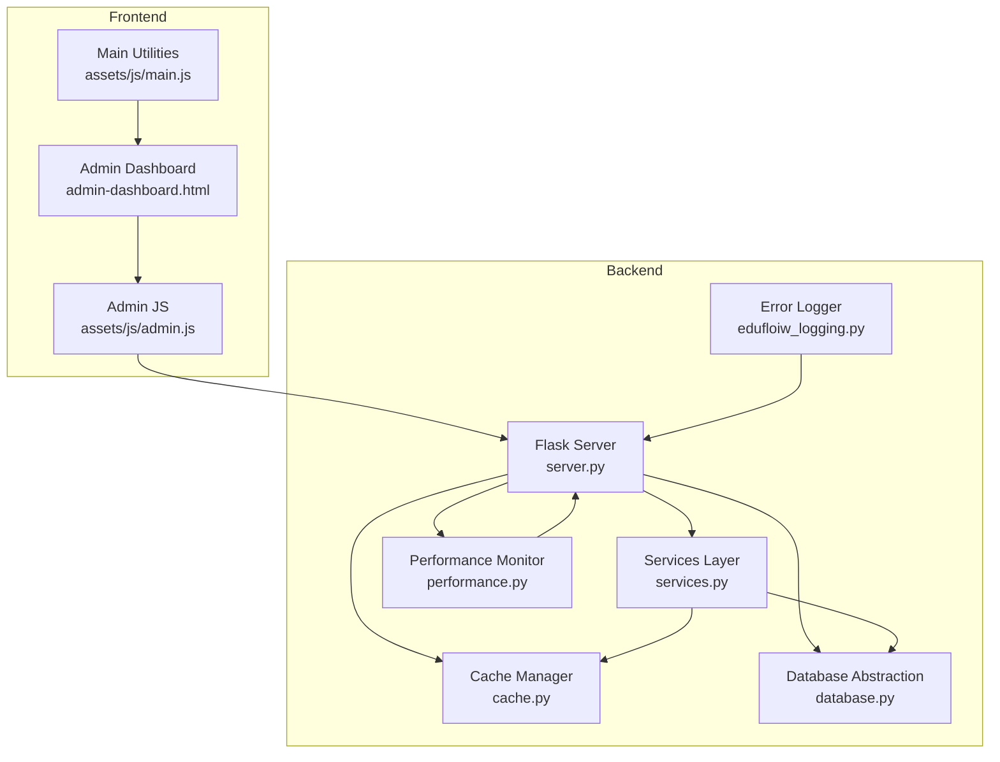
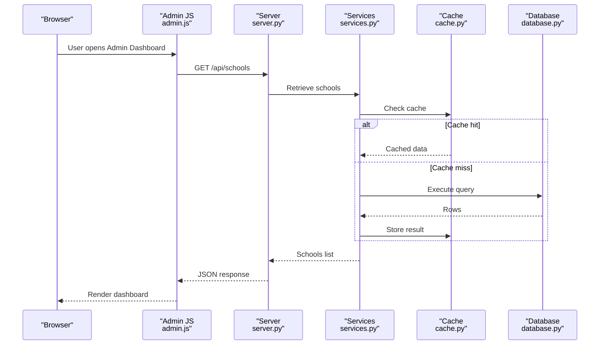
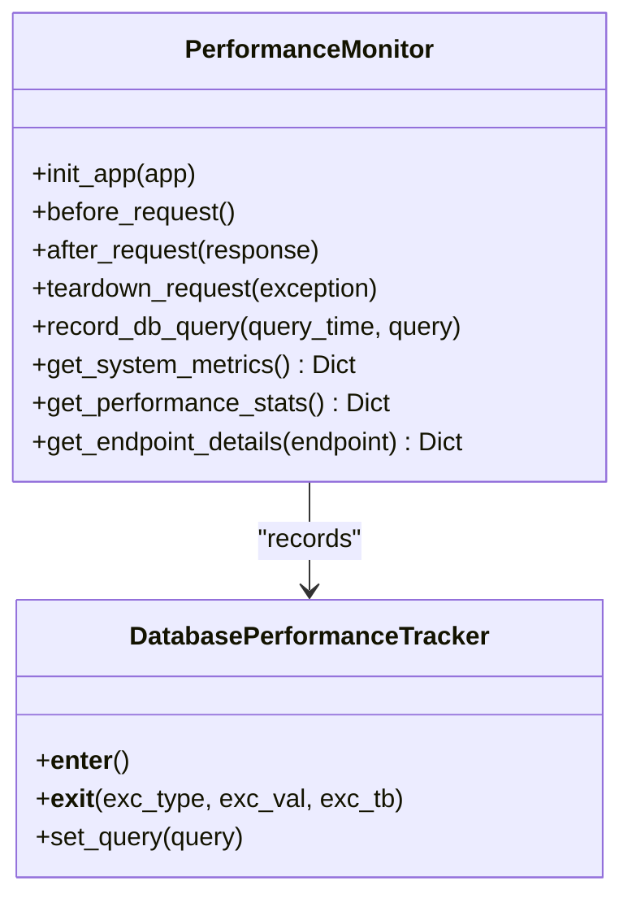
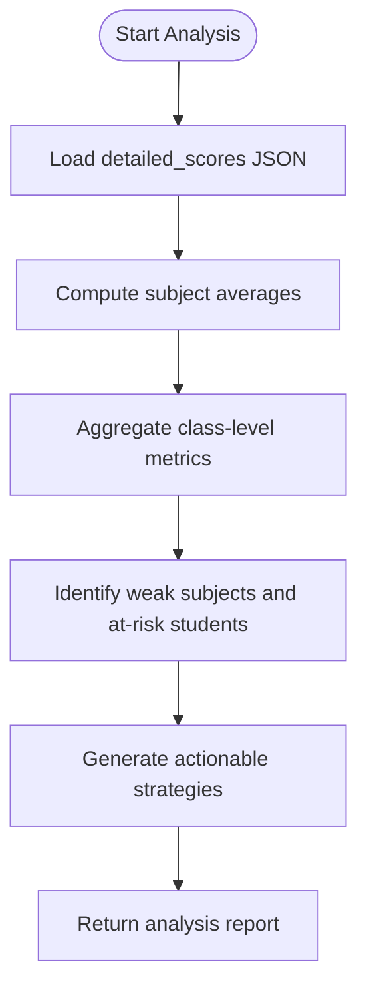
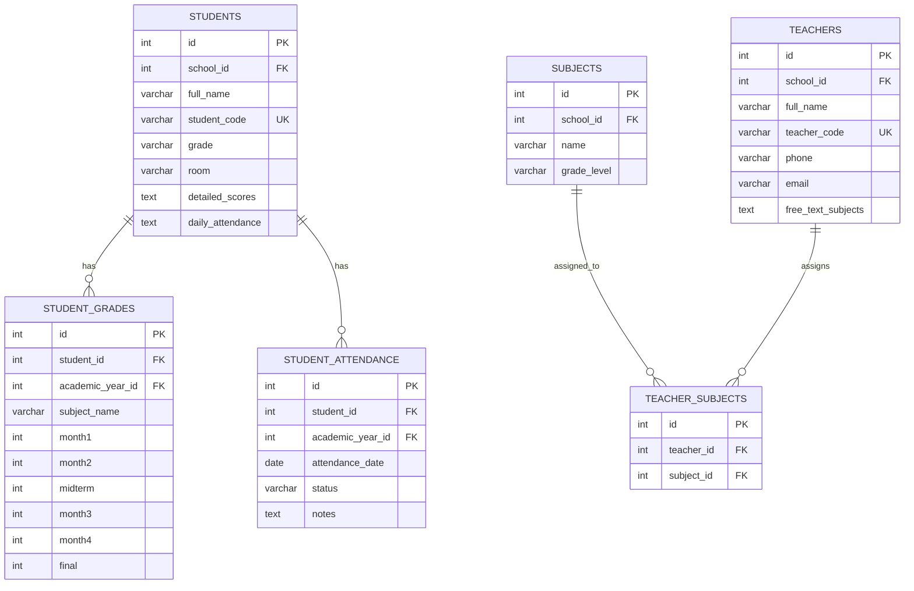
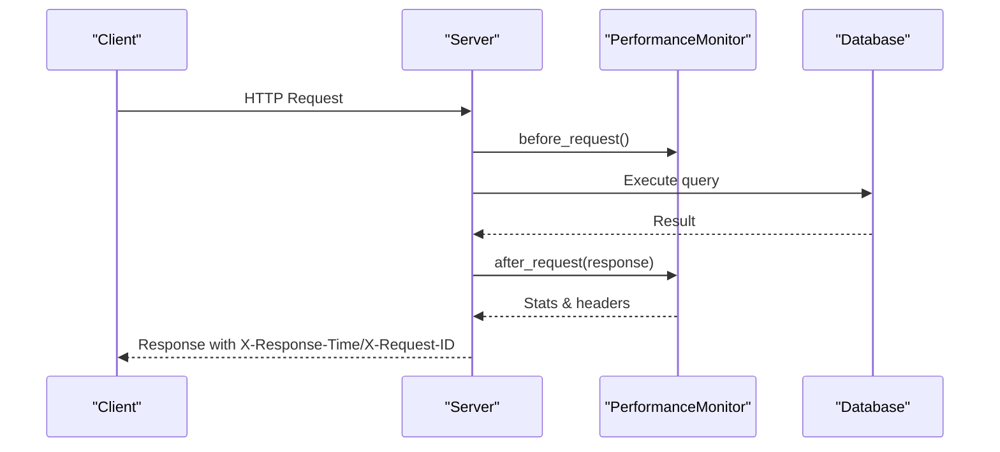
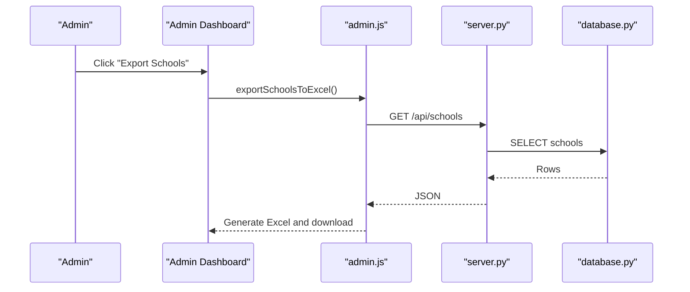
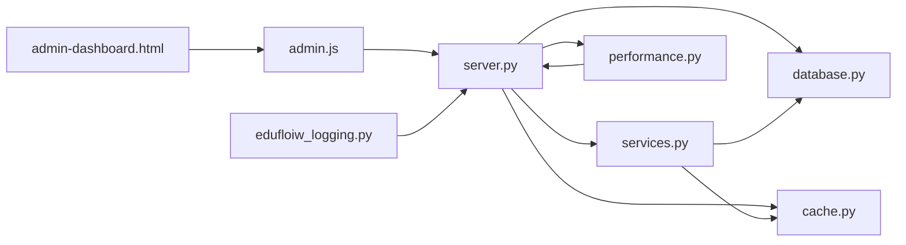

# Analytics and Metrics Collection

<cite>
**Referenced Files in This Document**
- [README.md](file://README.md)
- [performance.py](file://performance.py)
- [services.py](file://services.py)
- [database.py](file://database.py)
- [cache.py](file://cache.py)
- [server.py](file://server.py)
- [edufloiw_logging.py](file://edufloiw_logging.py)
- [public/admin-dashboard.html](file://public/admin-dashboard.html)
- [public/assets/js/admin.js](file://public/assets/js/admin.js)
- [public/assets/js/main.js](file://public/assets/js/main.js)
</cite>

## Table of Contents
1. [Introduction](#introduction)
2. [Project Structure](#project-structure)
3. [Core Components](#core-components)
4. [Architecture Overview](#architecture-overview)
5. [Detailed Component Analysis](#detailed-component-analysis)
6. [Dependency Analysis](#dependency-analysis)
7. [Performance Considerations](#performance-considerations)
8. [Troubleshooting Guide](#troubleshooting-guide)
9. [Conclusion](#conclusion)
10. [Appendices](#appendices)

## Introduction
This document describes the analytics and metrics collection system for the EduFlow school management platform. It explains how educational metrics are tracked (student performance indicators, class effectiveness, and program outcomes), how real-time monitoring captures system performance and user activity, and how data aggregation and statistical analysis are implemented. Administrative analytics features for decision support, resource allocation insights, and benchmarking are documented alongside practical examples of metric calculation workflows, data export capabilities, and guidance for extending analytics with custom integrations and privacy safeguards.

## Project Structure
The analytics system spans backend services, performance monitoring, caching, and frontend dashboards:
- Backend services encapsulate business logic and analytics computations
- Performance monitoring tracks request latency, endpoint statistics, and system resources
- Caching accelerates repeated analytics queries
- Logging centralizes error and performance telemetry
- Frontend dashboards present aggregated metrics and enable exports

**Diagram sources**
- [server.py](file://server.py#L1-L120)
- [performance.py](file://performance.py#L15-L108)
- [services.py](file://services.py#L1-L43)
- [cache.py](file://cache.py#L14-L50)
- [database.py](file://database.py#L88-L118)
- [edufloiw_logging.py](file://edufloiw_logging.py#L21-L80)
- [public/admin-dashboard.html](file://public/admin-dashboard.html#L1-L174)
- [public/assets/js/admin.js](file://public/assets/js/admin.js#L1-L120)
- [public/assets/js/main.js](file://public/assets/js/main.js#L1-L153)

**Section sources**
- [README.md](file://README.md#L1-L23)
- [server.py](file://server.py#L1-L120)

## Core Components
- PerformanceMonitor: Tracks request durations, endpoint statistics, slow endpoints, and system metrics; exposes REST endpoints for performance insights
- RecommendationService: Computes educational metrics including subject/class performance, pass rates, at-risk students, and personalized recommendations
- CacheManager: Provides Redis-backed caching with in-memory fallback and cache invalidation patterns
- Database abstraction: Manages MySQL/SQLite connections and creates normalized tables for students, teachers, subjects, academic years, and analytics data
- ErrorLogger: Centralized logging with categories, performance thresholds, and structured entries
- Frontend dashboards: Admin dashboard with export capabilities and interactive analytics displays

**Section sources**
- [performance.py](file://performance.py#L15-L144)
- [services.py](file://services.py#L367-L858)
- [cache.py](file://cache.py#L234-L275)
- [database.py](file://database.py#L120-L338)
- [edufloiw_logging.py](file://edufloiw_logging.py#L21-L143)
- [public/admin-dashboard.html](file://public/admin-dashboard.html#L100-L174)

## Architecture Overview
The system integrates analytics across three layers:
- Data ingestion and storage: Students’ detailed scores and attendance stored as JSON fields; normalized relational tables for subjects, teachers, and academic years
- Analytics computation: Services layer performs aggregations and statistical analysis
- Observability and presentation: PerformanceMonitor and ErrorLogger feed real-time dashboards and exportable reports

**Diagram sources**
- [public/admin-dashboard.html](file://public/admin-dashboard.html#L1-L174)
- [public/assets/js/admin.js](file://public/assets/js/admin.js#L64-L102)
- [server.py](file://server.py#L306-L321)
- [services.py](file://services.py#L44-L55)
- [cache.py](file://cache.py#L102-L128)
- [database.py](file://database.py#L128-L137)

## Detailed Component Analysis

### Performance Monitoring System
The PerformanceMonitor captures request timing, endpoint performance, and system resource usage. It maintains:
- Request time history with endpoint, method, status code, and timestamps
- Endpoint statistics (count, total time, average, min, max)
- Slow endpoint detection (>1s average)
- System metrics (CPU, memory, active requests, thread count)
- Performance endpoints for external monitoring

**Diagram sources**
- [performance.py](file://performance.py#L15-L183)

**Section sources**
- [performance.py](file://performance.py#L15-L144)
- [performance.py](file://performance.py#L215-L234)

### Educational Metrics and Recommendations
The RecommendationService computes:
- Subject-level performance: counts, averages, pass rates, excellent/good/needs-support distributions
- Class-level insights: overall averages, pass rates, subjects needing focus, at-risk students
- Personalized student analysis: overall averages, strong/weak subjects, performance level, messaging
- Strategies and suggestions: targeted actions based on performance gaps

**Diagram sources**
- [services.py](file://services.py#L476-L765)

**Section sources**
- [services.py](file://services.py#L367-L858)

### Data Aggregation Pipelines
Aggregation relies on:
- Relational normalization: students, teachers, subjects, academic years, and many-to-many relationships
- JSON fields for flexible scoring and attendance storage
- Caching for repeated analytics queries
- Batch operations for bulk grade level creation

**Diagram sources**
- [database.py](file://database.py#L159-L320)

**Section sources**
- [database.py](file://database.py#L120-L338)
- [server.py](file://server.py#L469-L559)

### Real-Time Monitoring and User Activity Tracking
Real-time monitoring includes:
- Request tracing with request IDs and response times
- Endpoint performance dashboards
- System resource usage (CPU/memory/threads)
- Slow endpoint identification
- Audit logging for administrative actions

**Diagram sources**
- [performance.py](file://performance.py#L41-L77)
- [server.py](file://server.py#L1-L42)

**Section sources**
- [performance.py](file://performance.py#L15-L144)
- [edufloiw_logging.py](file://edufloiw_logging.py#L213-L242)

### Administrative Analytics and Decision Support
Administrative features include:
- Centralized academic year management applied across all schools
- Export of school lists to Excel via SheetJS
- Interactive dashboards for performance summaries and year management
- Bulk grade level creation templates

**Diagram sources**
- [public/admin-dashboard.html](file://public/admin-dashboard.html#L100-L174)
- [public/assets/js/admin.js](file://public/assets/js/admin.js#L318-L349)
- [server.py](file://server.py#L306-L321)

**Section sources**
- [public/admin-dashboard.html](file://public/admin-dashboard.html#L1-L174)
- [public/assets/js/admin.js](file://public/assets/js/admin.js#L318-L349)
- [server.py](file://server.py#L306-L321)

### Data Export Capabilities
- Excel export of school lists using SheetJS
- Structured column mapping and workbook creation
- Notification feedback for export operations

**Section sources**
- [public/assets/js/admin.js](file://public/assets/js/admin.js#L318-L349)
- [public/admin-dashboard.html](file://public/admin-dashboard.html#L100-L104)

### Custom Analytics Development
Guidance for extending analytics:
- Use RecommendationService patterns for new metrics
- Apply CacheManager decorators for performance-sensitive queries
- Integrate DatabasePerformanceTracker for query-level timing
- Leverage ErrorLogger for structured telemetry and performance thresholds
- Add new endpoints in server.py following existing patterns

**Section sources**
- [services.py](file://services.py#L12-L43)
- [cache.py](file://cache.py#L170-L211)
- [performance.py](file://performance.py#L167-L183)
- [edufloiw_logging.py](file://edufloiw_logging.py#L300-L352)
- [server.py](file://server.py#L141-L200)

## Dependency Analysis
The analytics system exhibits low coupling and high cohesion:
- Services depend on database abstractions and cache manager
- PerformanceMonitor is integrated into Flask lifecycle hooks
- Frontend communicates with backend via REST endpoints
- Logging and caching are cross-cutting concerns

**Diagram sources**
- [server.py](file://server.py#L1-L42)
- [services.py](file://services.py#L1-L43)
- [performance.py](file://performance.py#L15-L35)
- [cache.py](file://cache.py#L234-L275)
- [database.py](file://database.py#L88-L118)
- [edufloiw_logging.py](file://edufloiw_logging.py#L268-L298)
- [public/admin-dashboard.html](file://public/admin-dashboard.html#L1-L174)
- [public/assets/js/admin.js](file://public/assets/js/admin.js#L1-L120)

**Section sources**
- [server.py](file://server.py#L1-L42)
- [services.py](file://services.py#L1-L43)
- [performance.py](file://performance.py#L15-L35)
- [cache.py](file://cache.py#L234-L275)
- [database.py](file://database.py#L88-L118)
- [edufloiw_logging.py](file://edufloiw_logging.py#L268-L298)

## Performance Considerations
- Use CacheManager decorators to cache expensive analytics queries
- Prefer batch operations for bulk updates (e.g., bulk grade levels)
- Monitor slow endpoints and optimize hotspots using PerformanceMonitor
- Apply DatabasePerformanceTracker around long-running queries
- Ensure JSON fields are indexed appropriately for filtering and sorting

[No sources needed since this section provides general guidance]

## Troubleshooting Guide
Common issues and resolutions:
- Performance degradation: Review slow endpoints and system metrics; adjust caching TTLs; profile queries
- Missing or malformed analytics data: Validate JSON fields (detailed_scores, daily_attendance) and normalize where needed
- Cache connectivity failures: Confirm Redis availability; fallback to in-memory cache is automatic
- Logging and monitoring: Use ErrorLogger categories and performance thresholds to pinpoint issues

**Section sources**
- [performance.py](file://performance.py#L110-L144)
- [edufloiw_logging.py](file://edufloiw_logging.py#L213-L242)
- [cache.py](file://cache.py#L29-L48)

## Conclusion
The EduFlow analytics and metrics system combines robust performance monitoring, relational modeling with flexible JSON fields, and a caching layer to deliver real-time insights for educational and administrative decision-making. The RecommendationService provides actionable analytics for educators, while the admin dashboard enables efficient data export and centralized academic year management. With structured logging and performance telemetry, the platform supports continuous optimization and reliable operations.

[No sources needed since this section summarizes without analyzing specific files]

## Appendices

### Example Metric Calculation Workflows
- Subject performance: Aggregate monthly and midterm scores per subject; compute averages and pass rates
- Class effectiveness: Combine subject metrics to derive class averages and identify focus areas
- Individual student insights: Compare subject averages, detect trends, and generate personalized messages
- Export pipeline: Fetch data via REST, transform to spreadsheet-ready arrays, and write Excel files

**Section sources**
- [services.py](file://services.py#L476-L765)
- [public/assets/js/admin.js](file://public/assets/js/admin.js#L318-L349)

### Integration with External Platforms
- Use performance endpoints for external monitoring dashboards
- Export analytics data for third-party BI tools
- Respect data privacy by avoiding PII in logs and ensuring secure transport

**Section sources**
- [performance.py](file://performance.py#L215-L234)
- [edufloiw_logging.py](file://edufloiw_logging.py#L268-L298)

### Data Privacy Considerations
- Avoid logging sensitive personal data; sanitize inputs and apply rate limiting
- Use HTTPS and secure tokens for authentication
- Apply least-privilege access controls and audit administrative actions

**Section sources**
- [server.py](file://server.py#L91-L108)
- [edufloiw_logging.py](file://edufloiw_logging.py#L186-L211)