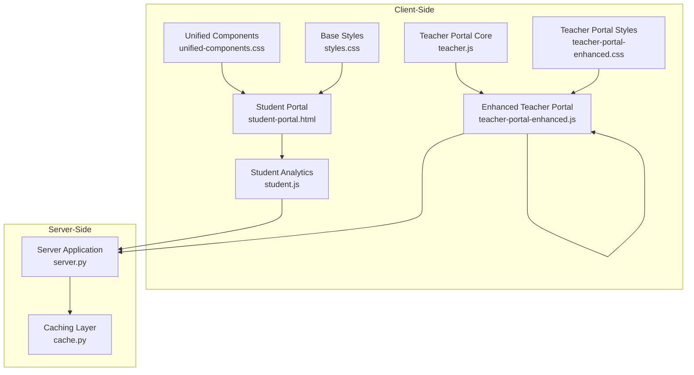
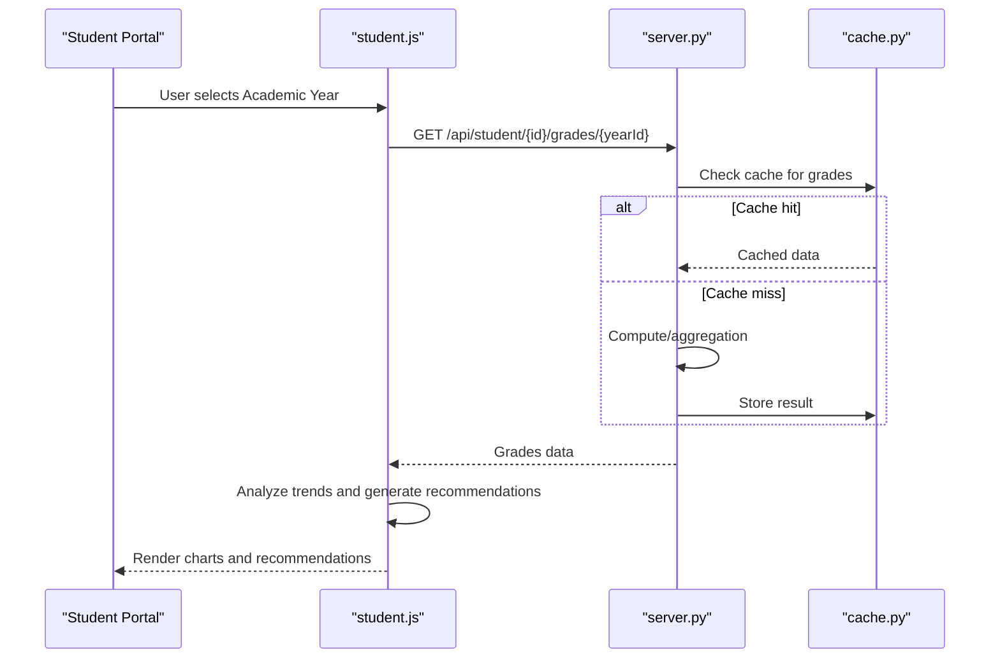
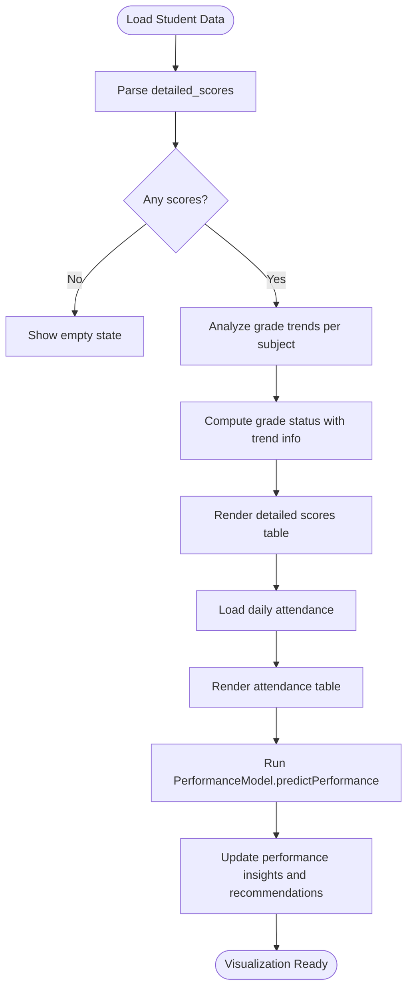
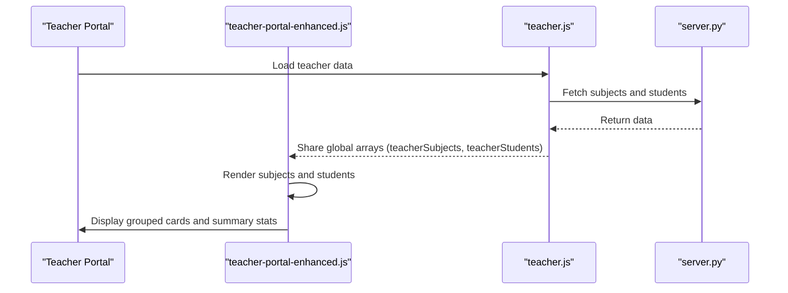
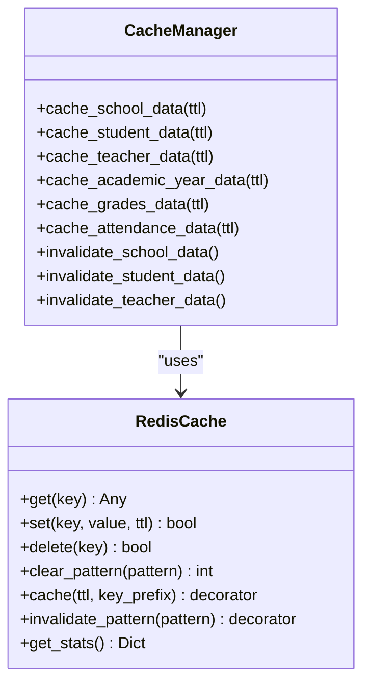
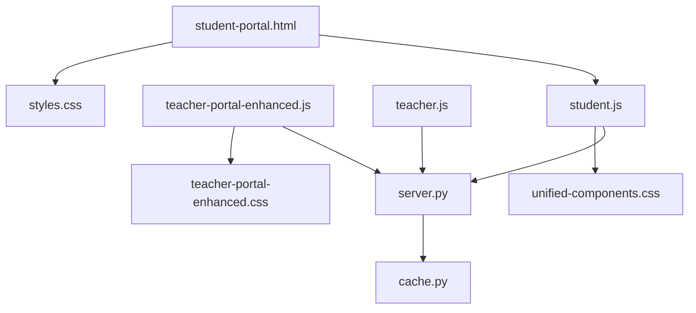

# Data Visualization Components

<cite>
**Referenced Files in This Document**
- [cache.py](file://cache.py)
- [server.py](file://server.py)
- [student-portal.html](file://public/student-portal.html)
- [student.js](file://public/assets/js/student.js)
- [teacher-portal-enhanced.js](file://public/assets/js/teacher-portal-enhanced.js)
- [teacher.js](file://public/assets/js/teacher.js)
- [styles.css](file://public/assets/css/styles.css)
- [unified-components.css](file://public/assets/css/unified-components.css)
- [teacher-portal-enhanced.css](file://public/assets/css/teacher-portal-enhanced.css)
</cite>

## Table of Contents
1. [Introduction](#introduction)
2. [Project Structure](#project-structure)
3. [Core Components](#core-components)
4. [Architecture Overview](#architecture-overview)
5. [Detailed Component Analysis](#detailed-component-analysis)
6. [Dependency Analysis](#dependency-analysis)
7. [Performance Considerations](#performance-considerations)
8. [Troubleshooting Guide](#troubleshooting-guide)
9. [Conclusion](#conclusion)

## Introduction
This document provides comprehensive documentation for the data visualization system within the EduFlow platform. It explains how charts and graphs are rendered for grade distributions, attendance analytics, and performance trend displays. It also covers interactive dashboard components, drill-down capabilities, real-time data updates, integration with the caching system for optimized performance, responsive design for mobile and desktop, and practical examples of chart configuration, data binding, and customization options.

## Project Structure
The visualization system spans client-side JavaScript modules, HTML templates, and server-side caching infrastructure:
- Client-side rendering and interactivity are implemented in dedicated JavaScript modules for student and teacher portals.
- Charts and analytics are integrated into the student portal's detailed scores and attendance tabs.
- The server provides caching mechanisms and APIs that feed visualization data.
- CSS modules define responsive layouts and unified design systems for cross-portal consistency.

**Diagram sources**
- [student-portal.html](file://public/student-portal.html#L1-L200)
- [student.js](file://public/assets/js/student.js#L1-L200)
- [teacher-portal-enhanced.js](file://public/assets/js/teacher-portal-enhanced.js#L1-L120)
- [teacher.js](file://public/assets/js/teacher.js#L1-L120)
- [styles.css](file://public/assets/css/styles.css#L1-L120)
- [unified-components.css](file://public/assets/css/unified-components.css#L1-L120)
- [teacher-portal-enhanced.css](file://public/assets/css/teacher-portal-enhanced.css#L1-L120)
- [server.py](file://server.py#L1-L120)
- [cache.py](file://cache.py#L1-L120)

**Section sources**
- [student-portal.html](file://public/student-portal.html#L1-L200)
- [student.js](file://public/assets/js/student.js#L1-L200)
- [teacher-portal-enhanced.js](file://public/assets/js/teacher-portal-enhanced.js#L1-L120)
- [teacher.js](file://public/assets/js/teacher.js#L1-L120)
- [styles.css](file://public/assets/css/styles.css#L1-L120)
- [unified-components.css](file://public/assets/css/unified-components.css#L1-L120)
- [teacher-portal-enhanced.css](file://public/assets/css/teacher-portal-enhanced.css#L1-L120)
- [server.py](file://server.py#L1-L120)
- [cache.py](file://cache.py#L1-L120)

## Core Components
- Student Academic Advisor: Computes performance trends, grade distributions, and generates recommendations for visualization and presentation.
- Performance Prediction Model: Predicts performance levels and risk categories for real-time insights.
- Tabbed Interface: Provides drill-down views for detailed scores, attendance analytics, and comprehensive reports.
- Caching Integration: Uses Redis and in-memory fallback to optimize API responses and reduce rendering delays.
- Responsive Design System: Ensures charts and tables adapt seamlessly across desktop and mobile devices.

Key implementation references:
- Trend analysis and recommendation generation in [student.js](file://public/assets/js/student.js#L187-L550)
- Performance prediction model in [student.js](file://public/assets/js/student.js#L556-L713)
- Tab switching and report loading in [student-portal.html](file://public/student-portal.html#L741-L760)
- Caching layer in [cache.py](file://cache.py#L1-L120)
- Unified component styles in [unified-components.css](file://public/assets/css/unified-components.css#L540-L580)

**Section sources**
- [student.js](file://public/assets/js/student.js#L187-L713)
- [student-portal.html](file://public/student-portal.html#L741-L760)
- [cache.py](file://cache.py#L1-L120)
- [unified-components.css](file://public/assets/css/unified-components.css#L540-L580)

## Architecture Overview
The visualization architecture integrates client-side rendering with server-side caching and API endpoints:
- Client-side modules fetch data from server endpoints and render charts/trends.
- The caching layer reduces latency and improves responsiveness for repeated queries.
- Unified CSS ensures consistent styling and responsive behavior across portals.

**Diagram sources**
- [student-portal.html](file://public/student-portal.html#L1090-L1141)
- [student.js](file://public/assets/js/student.js#L556-L713)
- [server.py](file://server.py#L1-L120)
- [cache.py](file://cache.py#L170-L212)

**Section sources**
- [student-portal.html](file://public/student-portal.html#L1090-L1141)
- [student.js](file://public/assets/js/student.js#L556-L713)
- [server.py](file://server.py#L1-L120)
- [cache.py](file://cache.py#L170-L212)

## Detailed Component Analysis

### Student Portal Visualization Components
The student portal provides three primary visualization areas:
- Detailed Scores Table: Displays per-period grades with trend indicators and status badges.
- Attendance Analytics: Shows daily attendance records with status classification.
- Comprehensive Report: Presents aggregated insights and recommendations.

Implementation highlights:
- Trend analysis and status determination in [student.js](file://public/assets/js/student.js#L187-L809)
- Tab switching logic in [student-portal.html](file://public/student-portal.html#L741-L760)
- Academic year filtering and data loading in [student-portal.html](file://public/student-portal.html#L1015-L1141)

**Diagram sources**
- [student.js](file://public/assets/js/student.js#L187-L809)
- [student-portal.html](file://public/student-portal.html#L811-L972)

**Section sources**
- [student.js](file://public/assets/js/student.js#L187-L809)
- [student-portal.html](file://public/student-portal.html#L811-L972)

### Teacher Portal Enhanced Components
The enhanced teacher portal focuses on subject and student listings with drill-down capabilities:
- Subject cards display grade-level grouping, counts, and actions.
- Student cards group by grade with detailed information and actions.
- Modal-based details for subjects and students.

Key references:
- Subject rendering and grouping in [teacher-portal-enhanced.js](file://public/assets/js/teacher-portal-enhanced.js#L129-L212)
- Student rendering and grouping in [teacher-portal-enhanced.js](file://public/assets/js/teacher-portal-enhanced.js#L217-L304)
- Modal implementations in [teacher-portal-enhanced.js](file://public/assets/js/teacher-portal-enhanced.js#L379-L504)
- Shared data synchronization with teacher.js in [teacher-portal-enhanced.js](file://public/assets/js/teacher-portal-enhanced.js#L58-L68)

**Diagram sources**
- [teacher-portal-enhanced.js](file://public/assets/js/teacher-portal-enhanced.js#L129-L304)
- [teacher.js](file://public/assets/js/teacher.js#L304-L372)
- [server.py](file://server.py#L1-L120)

**Section sources**
- [teacher-portal-enhanced.js](file://public/assets/js/teacher-portal-enhanced.js#L129-L304)
- [teacher.js](file://public/assets/js/teacher.js#L304-L372)
- [server.py](file://server.py#L1-L120)

### Caching Integration for Visualization Performance
The caching system optimizes visualization performance by reducing redundant API calls and accelerating data retrieval:
- Redis-backed cache with in-memory fallback.
- Decorators for automatic caching and invalidation.
- Predefined cache strategies for school, student, teacher, academic year, grades, and attendance data.

Key references:
- RedisCache class and methods in [cache.py](file://cache.py#L14-L169)
- Cache decorators and invalidation in [cache.py](file://cache.py#L170-L212)
- Cache manager strategies in [cache.py](file://cache.py#L234-L275)
- Server setup and usage in [server.py](file://server.py#L37-L42)

**Diagram sources**
- [cache.py](file://cache.py#L14-L275)

**Section sources**
- [cache.py](file://cache.py#L14-L275)
- [server.py](file://server.py#L37-L42)

### Responsive Design for Mobile and Desktop
The visualization system adheres to a unified design system ensuring consistent and responsive behavior:
- Unified component styles for headers, forms, tables, tabs, and alerts.
- Media queries for adaptive layouts on tablets and phones.
- Consistent spacing, typography, and color schemes across portals.

References:
- Unified component definitions in [unified-components.css](file://public/assets/css/unified-components.css#L1-L672)
- Base styles and color palette in [styles.css](file://public/assets/css/styles.css#L1-L120)
- Teacher portal overrides in [teacher-portal-enhanced.css](file://public/assets/css/teacher-portal-enhanced.css#L1-L120)

**Section sources**
- [unified-components.css](file://public/assets/css/unified-components.css#L1-L672)
- [styles.css](file://public/assets/css/styles.css#L1-L120)
- [teacher-portal-enhanced.css](file://public/assets/css/teacher-portal-enhanced.css#L1-L120)

### Examples: Chart Configuration, Data Binding, and Customization
While explicit chart libraries are not imported in the referenced files, the visualization pipeline demonstrates robust data preparation and binding patterns suitable for chart integration:
- Data preparation: Per-period grade sequences, trend analysis, and status computation in [student.js](file://public/assets/js/student.js#L187-L374)
- Recommendations generation: Structured HTML blocks for insights and actionable advice in [student.js](file://public/assets/js/student.js#L280-L550)
- Academic year filtering: Dynamic data loading and rendering in [student-portal.html](file://public/student-portal.html#L1106-L1141)

Practical examples (paths only):
- Trend analysis function: [analyzeGradeTrend](file://public/assets/js/student.js#L187-L275)
- Academic year selector and loader: [loadAcademicYears](file://public/student-portal.html#L1016-L1046), [onAcademicYearChange](file://public/student-portal.html#L1090-L1104)

**Section sources**
- [student.js](file://public/assets/js/student.js#L187-L550)
- [student-portal.html](file://public/student-portal.html#L1016-L1104)

## Dependency Analysis
The visualization system exhibits clear separation of concerns:
- Client-side modules depend on server endpoints and unified CSS.
- Server-side caching depends on Redis availability with graceful degradation to in-memory storage.
- Teacher portal components share data via global variables synchronized with teacher.js.

**Diagram sources**
- [student.js](file://public/assets/js/student.js#L1-L120)
- [teacher-portal-enhanced.js](file://public/assets/js/teacher-portal-enhanced.js#L1-L120)
- [teacher.js](file://public/assets/js/teacher.js#L1-L120)
- [server.py](file://server.py#L1-L120)
- [cache.py](file://cache.py#L1-L120)
- [unified-components.css](file://public/assets/css/unified-components.css#L1-L120)
- [teacher-portal-enhanced.css](file://public/assets/css/teacher-portal-enhanced.css#L1-L120)
- [styles.css](file://public/assets/css/styles.css#L1-L120)
- [student-portal.html](file://public/student-portal.html#L1-L120)

**Section sources**
- [student.js](file://public/assets/js/student.js#L1-L120)
- [teacher-portal-enhanced.js](file://public/assets/js/teacher-portal-enhanced.js#L1-L120)
- [teacher.js](file://public/assets/js/teacher.js#L1-L120)
- [server.py](file://server.py#L1-L120)
- [cache.py](file://cache.py#L1-L120)
- [unified-components.css](file://public/assets/css/unified-components.css#L1-L120)
- [teacher-portal-enhanced.css](file://public/assets/css/teacher-portal-enhanced.css#L1-L120)
- [styles.css](file://public/assets/css/styles.css#L1-L120)
- [student-portal.html](file://public/student-portal.html#L1-L120)

## Performance Considerations
- Caching Strategies: Use cache decorators for frequently accessed data (grades, attendance, academic years) to minimize server load and improve response times.
- Data Aggregation: Pre-compute trends and averages client-side to reduce repeated computations during rendering.
- Lazy Loading: Load academic year-specific data only when requested to avoid unnecessary network traffic.
- Responsive Rendering: Optimize table and card layouts for smaller screens to prevent excessive reflows and repaints.
- Real-time Updates: Implement periodic refresh intervals judiciously to balance freshness with performance.

[No sources needed since this section provides general guidance]

## Troubleshooting Guide
Common issues and resolutions:
- Empty or missing data: Verify academic year selection and API responses in [student-portal.html](file://public/student-portal.html#L1090-L1141).
- Trend calculation anomalies: Review grade threshold logic and period ordering in [student.js](file://public/assets/js/student.js#L187-L275).
- Caching failures: Confirm Redis connectivity and fallback behavior in [cache.py](file://cache.py#L29-L48).
- Styling inconsistencies: Ensure unified component styles are applied in [unified-components.css](file://public/assets/css/unified-components.css#L540-L580).

**Section sources**
- [student-portal.html](file://public/student-portal.html#L1090-L1141)
- [student.js](file://public/assets/js/student.js#L187-L275)
- [cache.py](file://cache.py#L29-L48)
- [unified-components.css](file://public/assets/css/unified-components.css#L540-L580)

## Conclusion
The EduFlow data visualization system combines robust client-side analytics with efficient server-side caching to deliver responsive, insightful dashboards. The student portal’s detailed scores, attendance analytics, and comprehensive reports provide actionable intelligence, while the teacher portal’s enhanced components streamline subject and student management. Unified design systems and responsive layouts ensure consistent experiences across devices. By leveraging caching strategies and structured data preparation, the system achieves optimal performance and scalability for real-time visualization needs.