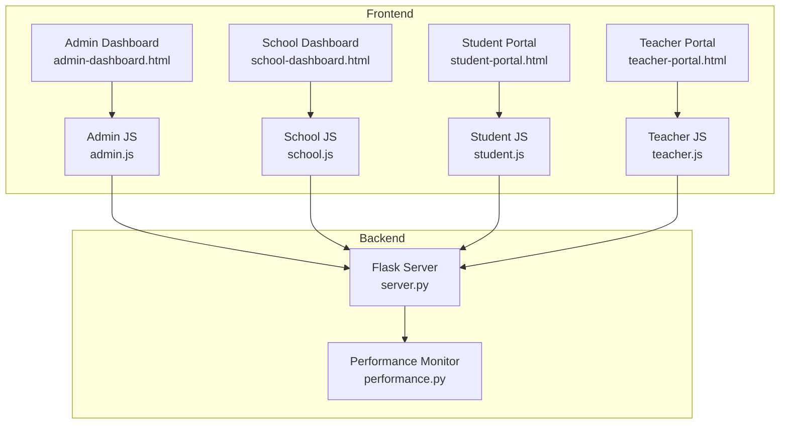
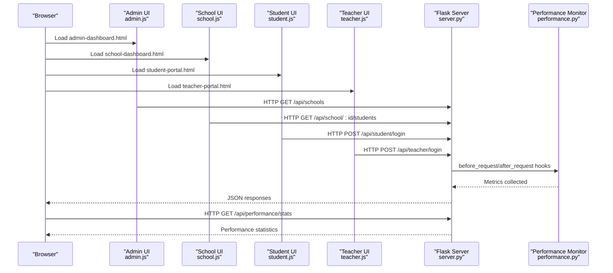
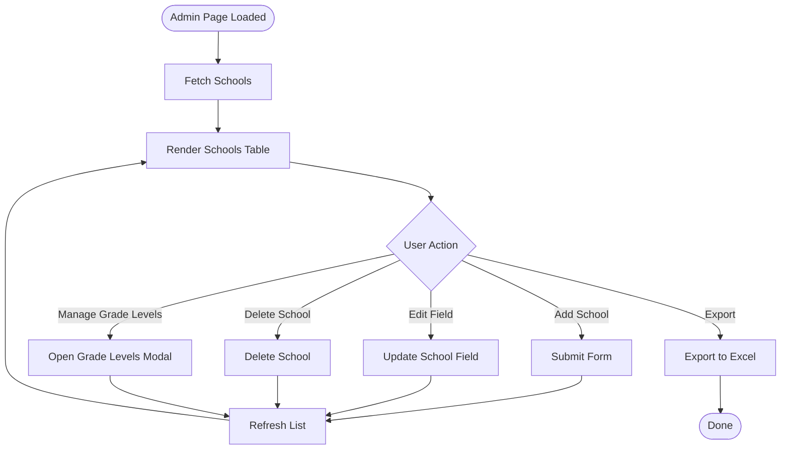
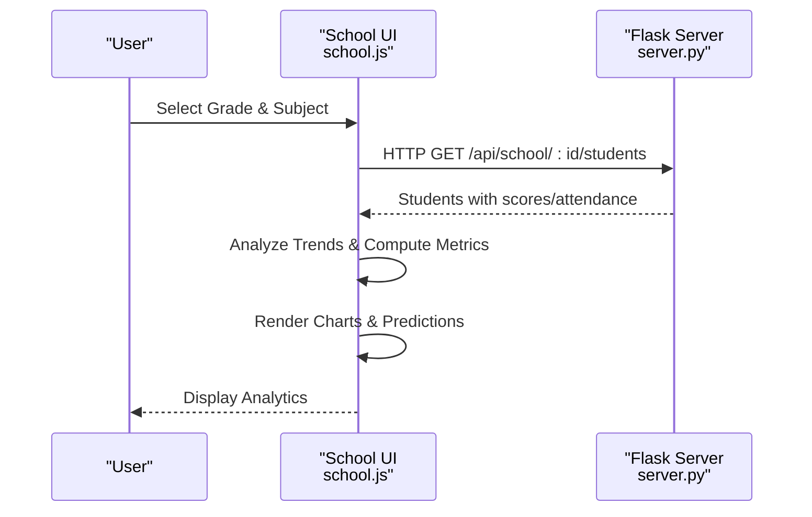
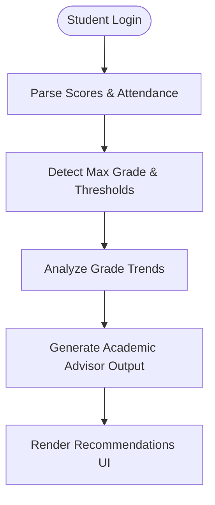
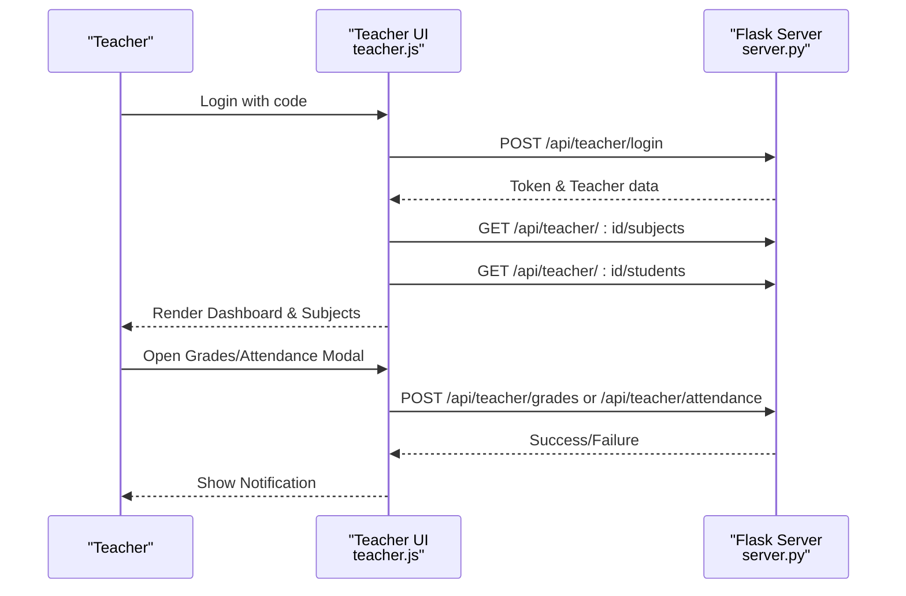
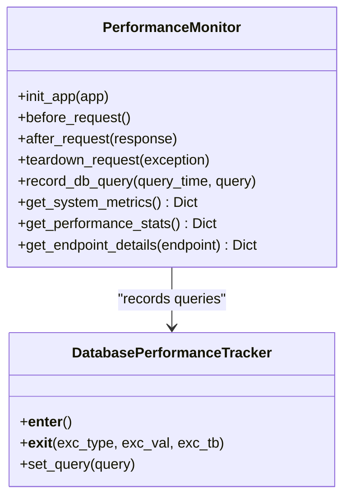
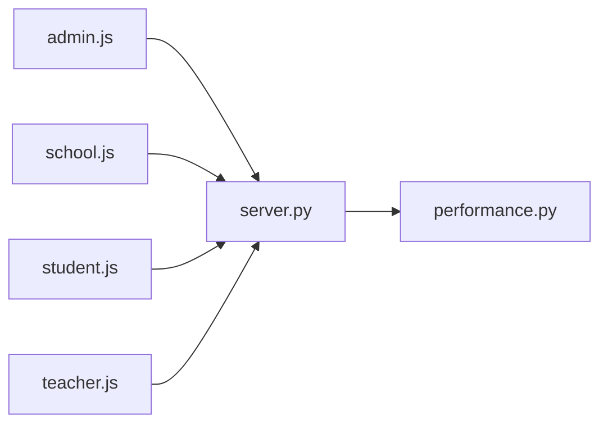

# Performance Dashboards

<cite>
**Referenced Files in This Document**
- [admin-dashboard.html](file://public/admin-dashboard.html)
- [school-dashboard.html](file://public/school-dashboard.html)
- [student-portal.html](file://public/student-portal.html)
- [teacher-portal.html](file://public/teacher-portal.html)
- [performance.py](file://performance.py)
- [server.py](file://server.py)
- [admin.js](file://public/assets/js/admin.js)
- [school.js](file://public/assets/js/school.js)
- [student.js](file://public/assets/js/student.js)
- [teacher.js](file://public/assets/js/teacher.js)
</cite>

## Table of Contents
1. [Introduction](#introduction)
2. [Project Structure](#project-structure)
3. [Core Components](#core-components)
4. [Architecture Overview](#architecture-overview)
5. [Detailed Component Analysis](#detailed-component-analysis)
6. [Dependency Analysis](#dependency-analysis)
7. [Performance Considerations](#performance-considerations)
8. [Troubleshooting Guide](#troubleshooting-guide)
9. [Conclusion](#conclusion)

## Introduction
This document describes the performance dashboard system that provides real-time monitoring and insights for educational institutions. It covers:
- Real-time performance monitoring with metrics collection and display
- Student achievement tracking, class performance metrics, and academic progress indicators
- Administrative dashboard for school oversight, teacher evaluation, and academic program assessment
- Widget configurations for grade distribution charts, attendance analytics, and performance trend visualizations
- Integration with the backend performance monitoring system and data refresh mechanisms

## Project Structure
The dashboard system consists of:
- Frontend pages for administrators, schools, teachers, and students
- Client-side JavaScript modules handling data visualization, recommendations, and API interactions
- Backend Flask server exposing REST endpoints and integrating performance monitoring
- Performance monitoring middleware capturing request metrics and system resources

**Diagram sources**
- [admin-dashboard.html](file://public/admin-dashboard.html#L1-L174)
- [school-dashboard.html](file://public/school-dashboard.html#L1-L394)
- [student-portal.html](file://public/student-portal.html#L1-L125)
- [teacher-portal.html](file://public/teacher-portal.html#L1-L631)
- [admin.js](file://public/assets/js/admin.js#L1-L988)
- [school.js](file://public/assets/js/school.js#L1-L6138)
- [student.js](file://public/assets/js/student.js#L1-L1848)
- [teacher.js](file://public/assets/js/teacher.js#L1-L784)
- [server.py](file://server.py#L1-L2920)
- [performance.py](file://performance.py#L1-L241)

**Section sources**
- [admin-dashboard.html](file://public/admin-dashboard.html#L1-L174)
- [school-dashboard.html](file://public/school-dashboard.html#L1-L394)
- [student-portal.html](file://public/student-portal.html#L1-L125)
- [teacher-portal.html](file://public/teacher-portal.html#L1-L631)
- [admin.js](file://public/assets/js/admin.js#L1-L988)
- [school.js](file://public/assets/js/school.js#L1-L6138)
- [student.js](file://public/assets/js/student.js#L1-L1848)
- [teacher.js](file://public/assets/js/teacher.js#L1-L784)
- [server.py](file://server.py#L1-L2920)
- [performance.py](file://performance.py#L1-L241)

## Core Components
- Administrative Dashboard: Manages schools, academic years, and exports lists. Features include adding schools, managing grade levels, and exporting data.
- School Dashboard: Presents performance analytics, grade distributions, attendance charts, AI predictions, and recommendations. Supports filtering by grade and subject.
- Student Portal: Displays individual performance insights, recommendations, detailed scores, attendance, and comprehensive reports.
- Teacher Portal: Shows subjects overview, student counts, and provides grade/attendance management interfaces.
- Performance Monitoring: Captures request/response times, endpoint statistics, and system metrics for backend performance insights.

Key widget areas:
- Performance indicators (averages, pass rates, attendance, excellence)
- Charts for grades and attendance
- AI predictions for top/below-average students and recommendations
- Academic year management and filtering

**Section sources**
- [admin-dashboard.html](file://public/admin-dashboard.html#L33-L119)
- [school-dashboard.html](file://public/school-dashboard.html#L311-L377)
- [student-portal.html](file://public/student-portal.html#L47-L125)
- [teacher-portal.html](file://public/teacher-portal.html#L463-L558)
- [performance.py](file://performance.py#L15-L144)

## Architecture Overview
The system integrates frontend dashboards with a Flask backend. The performance monitoring middleware attaches to the Flask app to collect metrics and expose them via dedicated endpoints.

**Diagram sources**
- [admin.js](file://public/assets/js/admin.js#L64-L102)
- [school.js](file://public/assets/js/school.js#L783-L800)
- [student.js](file://public/assets/js/student.js#L540-L565)
- [teacher.js](file://public/assets/js/teacher.js#L60-L104)
- [server.py](file://server.py#L141-L200)
- [performance.py](file://performance.py#L35-L77)

**Section sources**
- [server.py](file://server.py#L1-L2920)
- [performance.py](file://performance.py#L1-L241)

## Detailed Component Analysis

### Administrative Dashboard
- Purpose: Manage schools, academic years, and export lists.
- Key features:
  - Add new schools with stage and gender type
  - Manage grade levels per school
  - Academic year creation and central management
  - Export schools to Excel
- Data refresh: Manual refresh function and modal-driven updates.

**Diagram sources**
- [admin.js](file://public/assets/js/admin.js#L64-L102)
- [admin.js](file://public/assets/js/admin.js#L177-L217)
- [admin.js](file://public/assets/js/admin.js#L240-L262)
- [admin.js](file://public/assets/js/admin.js#L318-L349)

**Section sources**
- [admin-dashboard.html](file://public/admin-dashboard.html#L33-L119)
- [admin.js](file://public/assets/js/admin.js#L1-L988)

### School Dashboard Widgets
- Performance Analytics:
  - Filters: grade level and subject
  - Metrics: average grade, pass rate, attendance rate, excellence rate
  - Visualizations: grade distribution chart, attendance chart
  - AI Predictions: top students, struggling students, recommendations
- Data aggregation:
  - Trend analysis across monthly and term periods
  - Threshold-based classification (pass/safe ranges)
  - Recommendations engine generating actionable guidance

**Diagram sources**
- [school-dashboard.html](file://public/school-dashboard.html#L311-L377)
- [school.js](file://public/assets/js/school.js#L36-L216)
- [school.js](file://public/assets/js/school.js#L226-L579)

**Section sources**
- [school-dashboard.html](file://public/school-dashboard.html#L311-L377)
- [school.js](file://public/assets/js/school.js#L1-L6138)

### Student Portal Widgets
- Personalized insights:
  - Overall average and performance level
  - Strengths, improvement areas, and action plan
  - Motivational banners and study tips
- Recommendations engine:
  - Threshold detection based on grade scale (10 or 100)
  - Trend analysis with improvement/deterioration detection
  - Subject-specific and holistic guidance

**Diagram sources**
- [student-portal.html](file://public/student-portal.html#L47-L125)
- [student.js](file://public/assets/js/student.js#L39-L127)
- [student.js](file://public/assets/js/student.js#L132-L516)

**Section sources**
- [student-portal.html](file://public/student-portal.html#L1-L125)
- [student.js](file://public/assets/js/student.js#L1-L1848)

### Teacher Portal Widgets
- Overview cards: subjects, student count, attendance rate, grades average
- Recommendations section for grade management
- Subject management table with student counts and actions
- Grade/attendance modals for editing and saving

**Diagram sources**
- [teacher-portal.html](file://public/teacher-portal.html#L463-L558)
- [teacher.js](file://public/assets/js/teacher.js#L60-L104)
- [teacher.js](file://public/assets/js/teacher.js#L304-L372)
- [teacher.js](file://public/assets/js/teacher.js#L467-L579)

**Section sources**
- [teacher-portal.html](file://public/teacher-portal.html#L1-L631)
- [teacher.js](file://public/assets/js/teacher.js#L1-L784)

### Performance Monitoring Integration
- Backend performance monitoring captures:
  - Request durations and endpoint statistics
  - Active requests and thread counts
  - CPU/memory usage via system metrics
- Exposed endpoints:
  - GET /api/performance/stats: overall stats
  - GET /api/performance/endpoint/<endpoint>: endpoint details
  - GET /api/performance/system: system metrics

**Diagram sources**
- [performance.py](file://performance.py#L15-L165)

**Section sources**
- [performance.py](file://performance.py#L1-L241)
- [server.py](file://server.py#L13-L35)

## Dependency Analysis
- Frontend-to-backend:
  - Admin dashboard interacts with school and academic year endpoints
  - School dashboard fetches student data and renders analytics
  - Student and teacher portals authenticate and retrieve personalized data
- Backend-to-monitoring:
  - Flask app initializes performance monitoring and registers endpoints
  - Middleware captures timing and system metrics for observability

**Diagram sources**
- [admin.js](file://public/assets/js/admin.js#L1-L988)
- [school.js](file://public/assets/js/school.js#L1-L6138)
- [student.js](file://public/assets/js/student.js#L1-L1848)
- [teacher.js](file://public/assets/js/teacher.js#L1-L784)
- [server.py](file://server.py#L1-L2920)
- [performance.py](file://performance.py#L1-L241)

**Section sources**
- [server.py](file://server.py#L1-L2920)
- [performance.py](file://performance.py#L1-L241)

## Performance Considerations
- Real-time metrics:
  - Use periodic polling or WebSocket updates for live charts (recommended enhancement)
  - Debounce filter selections to avoid excessive API calls
- Data visualization:
  - Lazy-load charts and only render when tabs are active
  - Cache computed metrics per session to reduce recomputation
- Backend throughput:
  - Enable pagination and field selection for large datasets
  - Use database query performance tracking to identify bottlenecks
- Frontend responsiveness:
  - Show skeleton loaders during data fetches
  - Implement client-side debouncing for rapid inputs

## Troubleshooting Guide
- Authentication issues:
  - Verify tokens are present in local storage and included in Authorization headers
  - Confirm login endpoints return success and token
- Data not loading:
  - Check network tab for failed API calls
  - Validate JSON responses and handle parsing errors gracefully
- Performance monitoring:
  - Access /api/performance/stats and /api/performance/system to inspect metrics
  - Investigate slow endpoints via /api/performance/endpoint/<endpoint>

**Section sources**
- [admin.js](file://public/assets/js/admin.js#L8-L15)
- [school.js](file://public/assets/js/school.js#L783-L800)
- [student.js](file://public/assets/js/student.js#L540-L565)
- [teacher.js](file://public/assets/js/teacher.js#L60-L104)
- [performance.py](file://performance.py#L218-L234)

## Conclusion
The performance dashboard system provides a comprehensive, real-time view of academic performance across administrative, school, teacher, and student perspectives. With integrated performance monitoring, configurable widgets, and actionable recommendations, it supports data-driven decision-making and continuous improvement in educational outcomes.