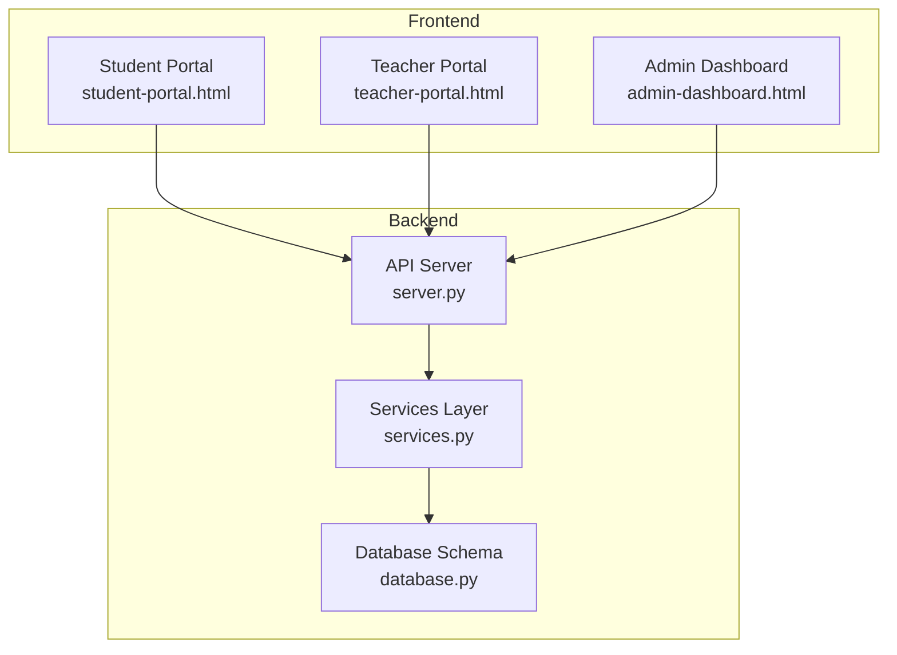
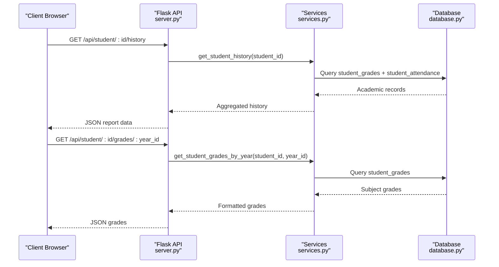
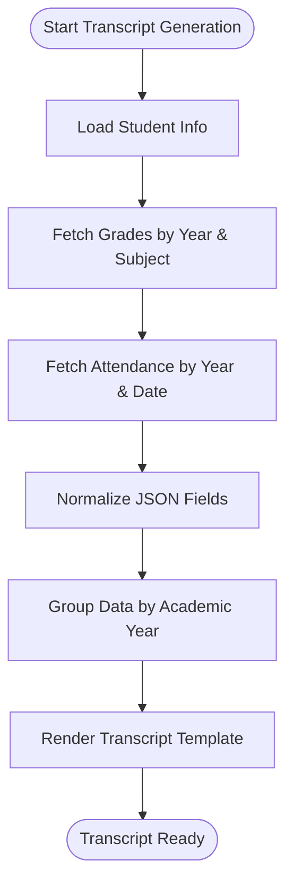
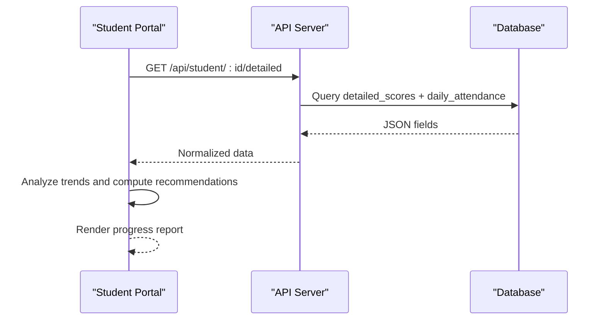
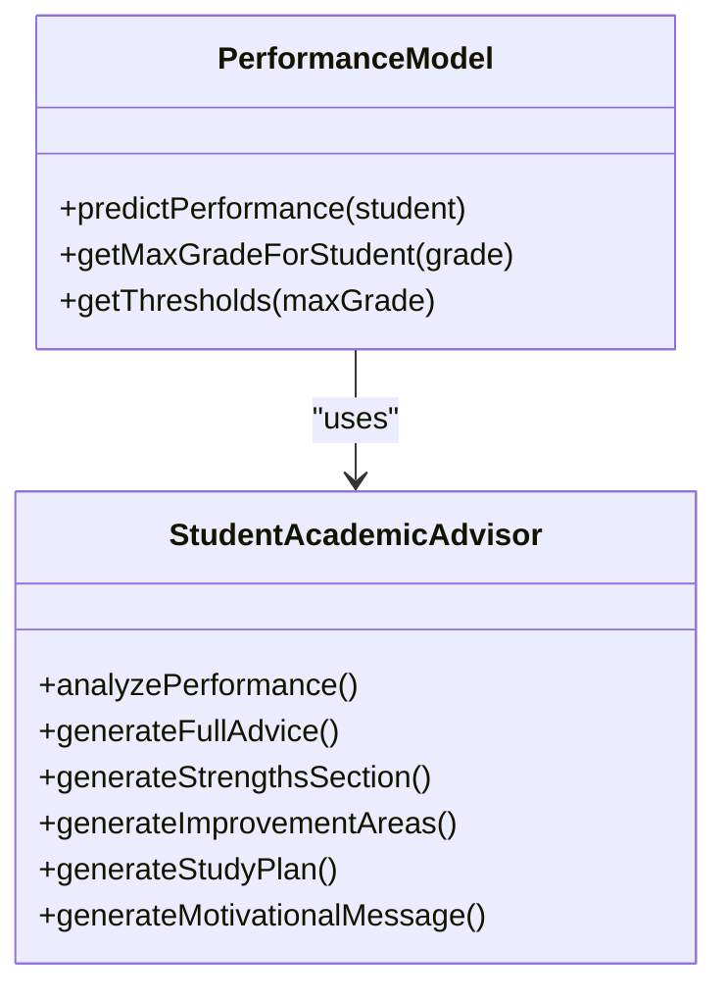
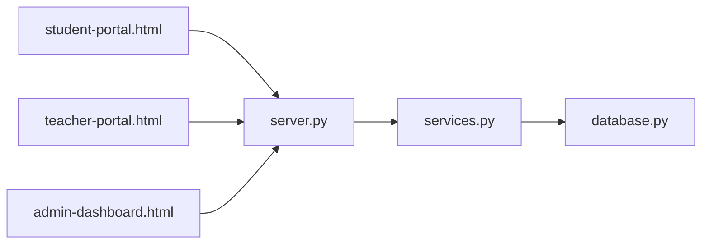

# Report Generation System

<cite>
**Referenced Files in This Document**
- [server.py](file://server.py)
- [services.py](file://services.py)
- [database.py](file://database.py)
- [student-portal.html](file://public/student-portal.html)
- [teacher-portal.html](file://public/teacher-portal.html)
- [admin-dashboard.html](file://public/admin-dashboard.html)
- [README.md](file://README.md)
</cite>

## Table of Contents
1. [Introduction](#introduction)
2. [Project Structure](#project-structure)
3. [Core Components](#core-components)
4. [Architecture Overview](#architecture-overview)
5. [Detailed Component Analysis](#detailed-component-analysis)
6. [Dependency Analysis](#dependency-analysis)
7. [Performance Considerations](#performance-considerations)
8. [Troubleshooting Guide](#troubleshooting-guide)
9. [Conclusion](#conclusion)

## Introduction
This document describes the report generation system within the EduFlow Python school management platform. It focuses on the academic transcript generation workflow, progress report creation, and performance summary compilation. The system integrates with student records, grade calculations, and academic history processing. It also covers report templates, formatting options, data extraction processes, scheduling, bulk generation capabilities, export formats, and automated delivery mechanisms. Quality checks and error handling are documented to ensure reliable operation.

## Project Structure
The report generation system spans backend API endpoints, service layer logic, database schema, and frontend templates. The backend exposes REST endpoints for retrieving academic data, generating reports, and managing academic years. The service layer encapsulates business logic for report computation. The database stores student records, grades, attendance, and academic year metadata. Frontend templates provide user interfaces for accessing reports and recommendations.

**Diagram sources**
- [server.py](file://server.py#L1-L120)
- [services.py](file://services.py#L1-L60)
- [database.py](file://database.py#L120-L338)
- [student-portal.html](file://public/student-portal.html#L113-L125)
- [teacher-portal.html](file://public/teacher-portal.html#L520-L535)
- [admin-dashboard.html](file://public/admin-dashboard.html#L80-L97)

**Section sources**
- [README.md](file://README.md#L1-L23)
- [server.py](file://server.py#L1-L120)

## Core Components
- API Endpoints: Expose report-related operations such as retrieving student grades, attendance, and academic history, and generating comprehensive reports.
- Services Layer: Implements recommendation engines, performance analysis, and report composition logic.
- Database Schema: Stores student profiles, academic years, grades, and attendance records with foreign key relationships.
- Frontend Templates: Provide interactive dashboards for students, teachers, and administrators to access reports and recommendations.

Key responsibilities:
- Academic year management and current year determination
- Student grade retrieval and aggregation
- Attendance tracking and reporting
- Performance prediction and recommendations
- Comprehensive report rendering

**Section sources**
- [server.py](file://server.py#L2270-L2799)
- [services.py](file://services.py#L367-L913)
- [database.py](file://database.py#L261-L320)
- [student-portal.html](file://public/student-portal.html#L113-L125)

## Architecture Overview
The report generation architecture follows a layered design:
- Presentation Layer: HTML templates for student, teacher, and admin portals.
- Application Layer: Flask routes handling authentication, authorization, and request orchestration.
- Service Layer: Business logic for recommendations, performance modeling, and report composition.
- Data Access Layer: Database operations for CRUD and analytics queries.

**Diagram sources**
- [server.py](file://server.py#L2270-L2300)
- [server.py](file://server.py#L2302-L2349)
- [services.py](file://services.py#L232-L282)
- [database.py](file://database.py#L291-L320)

## Detailed Component Analysis

### Academic Transcript Generation Workflow
The transcript workflow retrieves a student's complete academic history across academic years and subjects, aggregates grades, and prepares data for rendering.

Processing logic:
- Fetch student basic information and academic history
- Retrieve grades grouped by academic year and subject
- Retrieve attendance grouped by academic year and date
- Convert JSON fields to dictionaries for frontend consumption
- Return structured data for report rendering

**Diagram sources**
- [server.py](file://server.py#L2714-L2799)
- [student-portal.html](file://public/student-portal.html#L113-L125)

**Section sources**
- [server.py](file://server.py#L2714-L2799)

### Progress Report Creation
Progress reports combine detailed scores, attendance, and performance insights. The frontend performs real-time analysis to compute trends, consistency, and recommendations.

Key features:
- Detailed scores table with monthly, midterm, and final grades
- Attendance log with status and notes
- Performance prediction model with at-risk thresholds
- Personalized recommendations based on subject trends

**Diagram sources**
- [server.py](file://server.py#L441-L467)
- [server.py](file://server.py#L683-L766)
- [student-portal.html](file://public/student-portal.html#L113-L125)

**Section sources**
- [server.py](file://server.py#L441-L467)
- [server.py](file://server.py#L683-L766)
- [student-portal.html](file://public/student-portal.html#L113-L125)

### Performance Summary Compilation
The system computes performance summaries using threshold-based analysis and trend detection. It distinguishes between 10-point and 100-point grading scales based on grade level.

Highlights:
- Threshold detection for pass/fail and safety zones
- Trend analysis for improvement, decline, and inconsistency
- Consistency metrics derived from variance
- Personalized messages and study suggestions

**Diagram sources**
- [student-portal.html](file://public/student-portal.html#L556-L713)
- [student-portal.html](file://public/student-portal.html#L280-L549)

**Section sources**
- [student-portal.html](file://public/student-portal.html#L556-L713)
- [student-portal.html](file://public/student-portal.html#L280-L549)

### Report Templates and Formatting Options
Templates define the presentation layer for reports:
- Student Portal: Comprehensive report tab with loading states and dynamic content
- Teacher Portal: Subject-wise analytics and recommendations
- Admin Dashboard: Academic year management and export capabilities

Formatting options include:
- Responsive tables for grades and attendance
- Color-coded status indicators
- Interactive tabs for report navigation
- Export buttons for Excel integration

**Section sources**
- [student-portal.html](file://public/student-portal.html#L113-L125)
- [teacher-portal.html](file://public/teacher-portal.html#L520-L535)
- [admin-dashboard.html](file://public/admin-dashboard.html#L80-L97)

### Data Extraction Processes
Data extraction relies on structured queries and normalization:
- JSON fields in student records are normalized to dictionaries
- Academic year boundaries are computed for current year determination
- Subject averages and attendance counts are aggregated per grade level

Extraction endpoints:
- GET /api/student/:id/history
- GET /api/student/:id/grades/:year_id
- GET /api/student/:id/attendance/:year_id
- GET /api/school/:id/class-averages

**Section sources**
- [server.py](file://server.py#L2714-L2799)
- [server.py](file://server.py#L2270-L2349)
- [server.py](file://server.py#L2416-L2481)
- [server.py](file://server.py#L2351-L2414)

### Integration with Student Records, Grade Calculations, and Academic History
Integration points:
- Centralized academic year table (system_academic_years) ensures consistent year management
- Student grades and attendance linked to academic years via foreign keys
- Historical data preserved during student promotion to next grade

Grade calculation logic:
- Average per subject computed from available periods (month1–final)
- Pass/fail thresholds vary by grade scale (10 or 100)
- Trend analysis detects improvement, decline, and inconsistency

**Section sources**
- [database.py](file://database.py#L261-L320)
- [server.py](file://server.py#L2526-L2625)
- [student-portal.html](file://public/student-portal.html#L672-L708)

### Report Scheduling System and Bulk Generation
The system supports:
- Automatic current academic year calculation
- Bulk student promotion with grade copying
- Centralized academic year generation for administrative use

Endpoints:
- GET /api/school/:id/academic-years
- GET /api/school/:id/academic-year/current
- POST /api/system/academic-years/generate
- POST /api/students/promote-many

**Section sources**
- [server.py](file://server.py#L2150-L2208)
- [server.py](file://server.py#L2091-L2143)
- [server.py](file://server.py#L2627-L2712)

### Export Formats and Automated Delivery
Export capabilities:
- Excel export for schools, teachers, and students via SheetJS integration
- Admin dashboard provides export buttons for lists and academic data

Delivery mechanisms:
- Frontend-driven report rendering within portals
- API responses enable automated integrations with external systems

**Section sources**
- [admin-dashboard.html](file://public/admin-dashboard.html#L16-L17)
- [admin-dashboard.html](file://public/admin-dashboard.html#L100-L103)

### Examples of Report Generation APIs
- Get student academic history: GET /api/student/{id}/history
- Get student grades for a year: GET /api/student/{id}/grades/{year_id}
- Update student grades for a year: PUT /api/student/{id}/grades/{year_id}
- Get student attendance for a year: GET /api/student/{id}/attendance/{year_id}
- Update student attendance for a year: PUT /api/student/{id}/attendance/{year_id}
- Get class averages: GET /api/school/{id}/class-averages
- Promote a single student: POST /api/student/{id}/promote
- Promote multiple students: POST /api/students/promote-many

**Section sources**
- [server.py](file://server.py#L2270-L2349)
- [server.py](file://server.py#L2416-L2520)
- [server.py](file://server.py#L2351-L2414)
- [server.py](file://server.py#L2526-L2712)

### Template Customization
Customization options:
- Student portal: Tabbed interface for detailed scores, attendance, and comprehensive report
- Teacher portal: Subject analytics and recommendations
- Admin dashboard: Academic year management and export controls

**Section sources**
- [student-portal.html](file://public/student-portal.html#L67-L71)
- [teacher-portal.html](file://public/teacher-portal.html#L520-L535)
- [admin-dashboard.html](file://public/admin-dashboard.html#L80-L97)

### Automated Report Delivery
Delivery mechanisms:
- Real-time report rendering in student portal upon tab switching
- Performance recommendations computed client-side using AI model
- Administrative export for bulk delivery to stakeholders

**Section sources**
- [student-portal.html](file://public/student-portal.html#L741-L760)
- [student-portal.html](file://public/student-portal.html#L556-L713)

## Dependency Analysis
The report generation system exhibits clear separation of concerns:
- server.py depends on services.py for business logic and database.py for persistence
- services.py encapsulates recommendation and performance analysis
- database.py defines schema and relationships for academic data
- Frontend templates depend on API endpoints for data

**Diagram sources**
- [server.py](file://server.py#L1-L120)
- [services.py](file://services.py#L1-L60)
- [database.py](file://database.py#L120-L338)
- [student-portal.html](file://public/student-portal.html#L1-L80)
- [teacher-portal.html](file://public/teacher-portal.html#L1-L60)
- [admin-dashboard.html](file://public/admin-dashboard.html#L1-L40)

**Section sources**
- [server.py](file://server.py#L1-L120)
- [services.py](file://services.py#L1-L60)
- [database.py](file://database.py#L120-L338)

## Performance Considerations
- Database normalization: JSON fields are normalized to dictionaries for efficient frontend consumption
- Centralized academic year management: Reduces duplication and ensures consistency across schools
- Trend analysis: Client-side computations minimize server load for real-time recommendations
- Export optimization: SheetJS enables fast Excel exports for bulk data delivery

## Troubleshooting Guide
Common issues and resolutions:
- Authentication bypass: Routes currently allow all access; ensure proper authorization is enabled in production deployments
- JSON field parsing: Ensure JSON fields are properly parsed and normalized before rendering
- Academic year mismatch: Verify current academic year calculation and foreign key relationships
- Export failures: Confirm SheetJS integration and browser compatibility for Excel exports

**Section sources**
- [server.py](file://server.py#L91-L108)
- [server.py](file://server.py#L456-L466)
- [server.py](file://server.py#L2172-L2208)
- [admin-dashboard.html](file://public/admin-dashboard.html#L16-L17)

## Conclusion
The EduFlow report generation system provides a robust foundation for academic transcript generation, progress reporting, and performance summarization. Its layered architecture, centralized academic year management, and client-side analytics enable scalable and maintainable report delivery. With further hardening of authorization, validation, and error handling, the system can support automated, high-volume report generation and delivery across diverse educational environments.