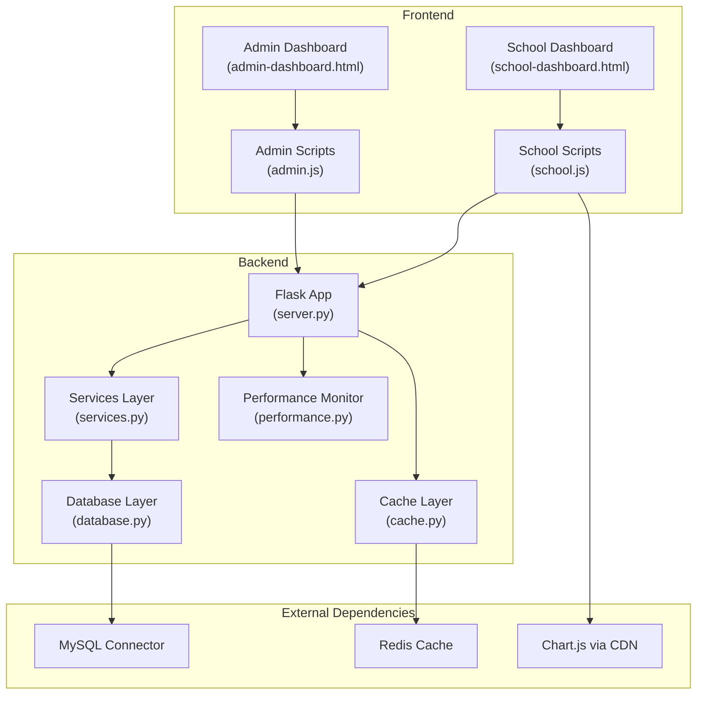
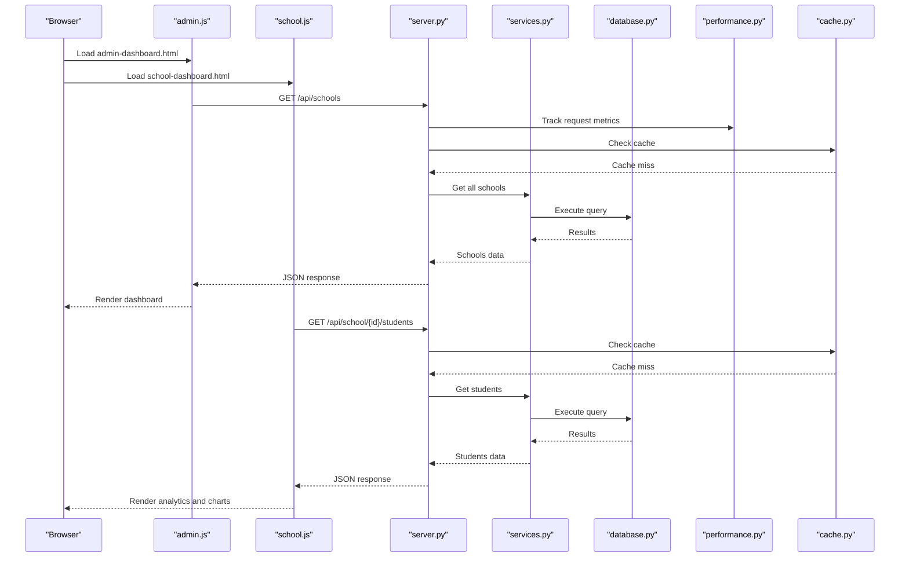
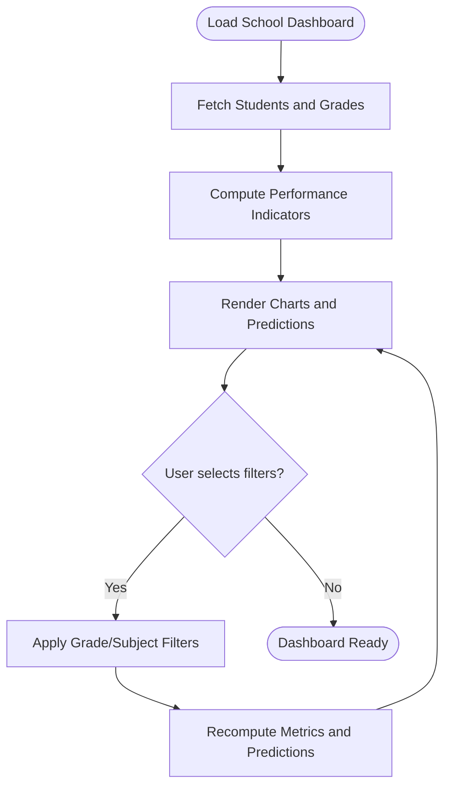
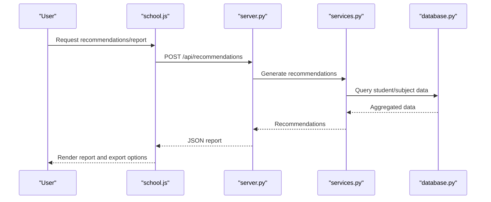
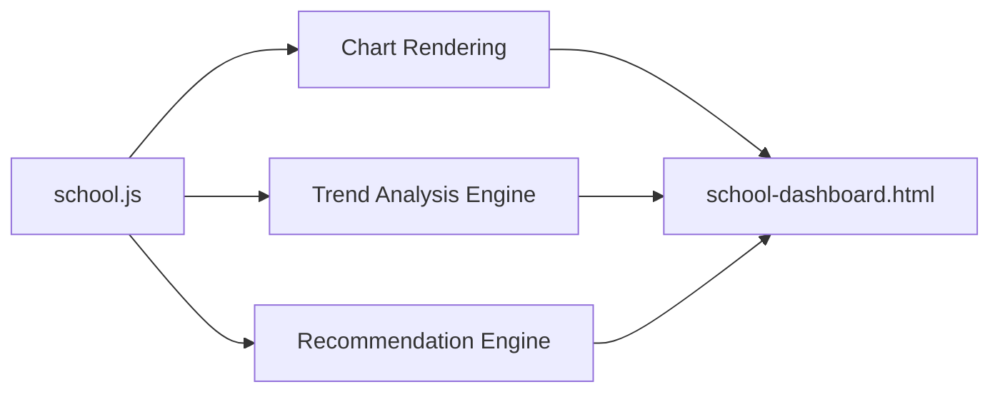
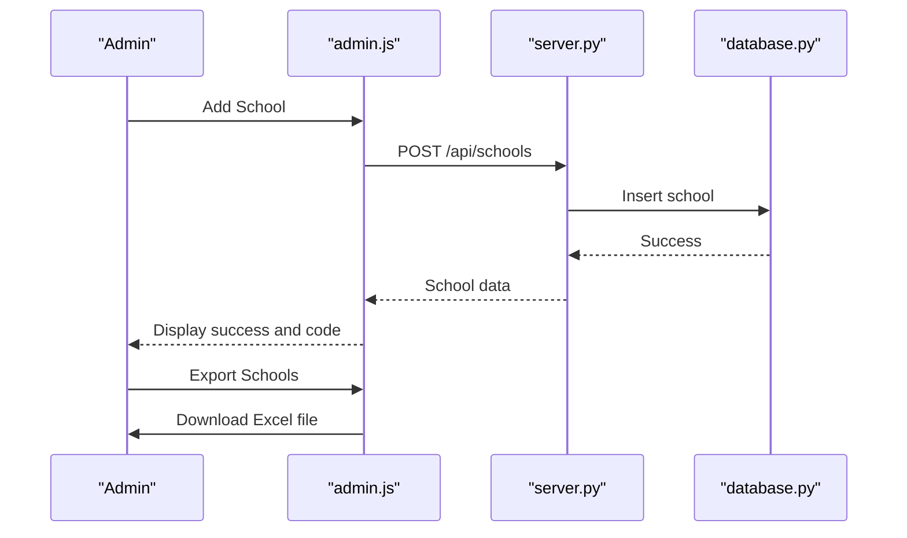
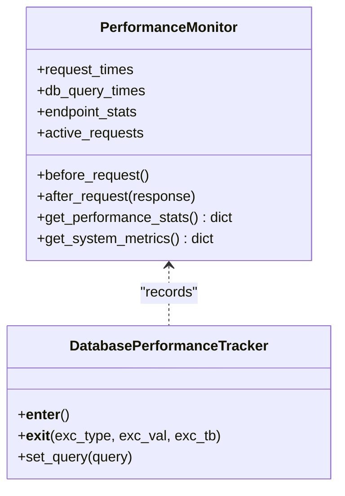
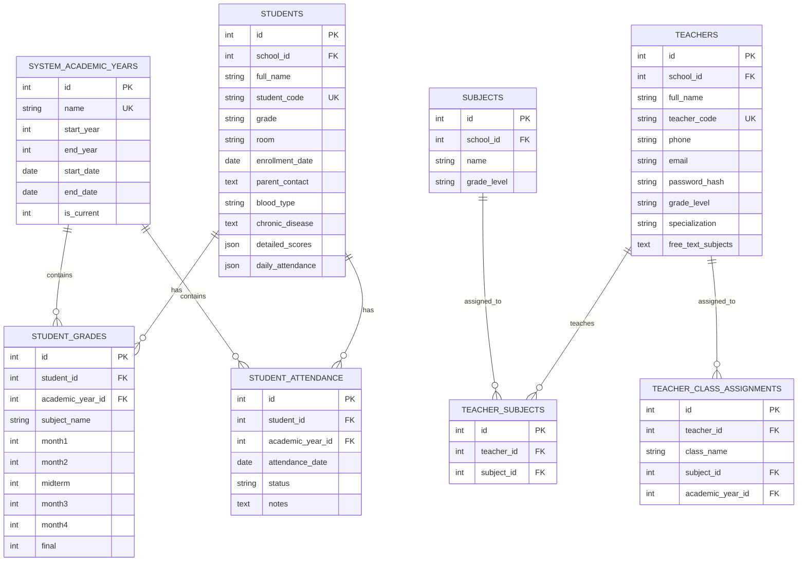

# Reporting and Analytics System

<cite>
**Referenced Files in This Document**
- [server.py](file://server.py)
- [services.py](file://services.py)
- [database.py](file://database.py)
- [performance.py](file://performance.py)
- [cache.py](file://cache.py)
- [admin-dashboard.html](file://public/admin-dashboard.html)
- [school-dashboard.html](file://public/school-dashboard.html)
- [admin.js](file://public/assets/js/admin.js)
- [school.js](file://public/assets/js/school.js)
- [requirements.txt](file://requirements.txt)
</cite>

## Table of Contents
1. [Introduction](#introduction)
2. [Project Structure](#project-structure)
3. [Core Components](#core-components)
4. [Architecture Overview](#architecture-overview)
5. [Detailed Component Analysis](#detailed-component-analysis)
6. [Dependency Analysis](#dependency-analysis)
7. [Performance Considerations](#performance-considerations)
8. [Troubleshooting Guide](#troubleshooting-guide)
9. [Conclusion](#conclusion)

## Introduction
This document describes the reporting and analytics system for the EduFlow educational platform. It covers the performance analytics dashboard for student achievement tracking, class performance metrics, and academic progress monitoring. It also documents the report generation system for academic transcripts, progress reports, and performance summaries, along with data visualization capabilities for grade distributions, attendance analytics, and performance trends. Administrative reporting features for school management, teacher evaluation, and academic program assessment are included, alongside real-time monitoring for system performance, user activity tracking, and educational metrics collection. The document concludes with practical examples of report generation workflows, dashboard usage scenarios, and performance monitoring procedures, plus integration details with educational systems and data aggregation mechanisms.

## Project Structure
The system is structured around a Python Flask backend with modular services, a MySQL/SQLite database layer, and a responsive frontend built with HTML/CSS/JavaScript. The frontend includes dedicated dashboards for administrators and schools, with interactive analytics and reporting features.

**Diagram sources**
- [server.py](file://server.py#L1-L120)
- [services.py](file://services.py#L1-L120)
- [database.py](file://database.py#L1-L120)
- [performance.py](file://performance.py#L1-L60)
- [cache.py](file://cache.py#L1-L60)
- [admin-dashboard.html](file://public/admin-dashboard.html#L1-L40)
- [school-dashboard.html](file://public/school-dashboard.html#L1-L40)

**Section sources**
- [server.py](file://server.py#L1-L120)
- [admin-dashboard.html](file://public/admin-dashboard.html#L1-L40)
- [school-dashboard.html](file://public/school-dashboard.html#L1-L40)

## Core Components
- Flask API server with route handlers for authentication, schools, students, subjects, and analytics endpoints.
- Service layer encapsulating business logic for recommendations, academic year management, and CRUD operations.
- Database abstraction supporting MySQL and SQLite with dynamic migrations and schema creation.
- Performance monitoring middleware capturing request/response metrics and system resource usage.
- Redis-based caching with in-memory fallback for query results and session data.
- Frontend dashboards with interactive charts and modals for analytics, grading, and attendance.

Key implementation references:
- Authentication and routing: [server.py](file://server.py#L140-L305)
- Analytics and recommendations: [services.py](file://services.py#L367-L800)
- Database schema and helpers: [database.py](file://database.py#L120-L338)
- Performance monitoring: [performance.py](file://performance.py#L15-L145)
- Caching layer: [cache.py](file://cache.py#L14-L129)
- Admin dashboard UI: [admin-dashboard.html](file://public/admin-dashboard.html#L1-L174)
- School dashboard UI: [school-dashboard.html](file://public/school-dashboard.html#L1-L120)

**Section sources**
- [server.py](file://server.py#L140-L305)
- [services.py](file://services.py#L367-L800)
- [database.py](file://database.py#L120-L338)
- [performance.py](file://performance.py#L15-L145)
- [cache.py](file://cache.py#L14-L129)
- [admin-dashboard.html](file://public/admin-dashboard.html#L1-L174)
- [school-dashboard.html](file://public/school-dashboard.html#L1-L120)

## Architecture Overview
The system follows a layered architecture:
- Presentation layer: HTML templates and JavaScript for admin and school dashboards.
- Application layer: Flask routes delegate to service classes for domain logic.
- Data access layer: Unified database abstraction with MySQL/SQLite support and helper functions.
- Observability layer: Performance monitoring and caching for scalability.

**Diagram sources**
- [server.py](file://server.py#L306-L467)
- [services.py](file://services.py#L44-L101)
- [database.py](file://database.py#L120-L177)
- [performance.py](file://performance.py#L41-L77)
- [cache.py](file://cache.py#L102-L129)
- [admin.js](file://public/assets/js/admin.js#L64-L102)
- [school.js](file://public/assets/js/school.js#L783-L795)

## Detailed Component Analysis

### Performance Analytics Dashboard
The school dashboard provides:
- Performance indicators: average grade, pass rate, attendance rate, excellence rate.
- Interactive charts for grade distribution and attendance trends.
- AI-powered predictions for top performers, struggling students, and recommendations.
- Subject-wise analytics and trend analysis with professional recommendation engine.

**Diagram sources**
- [school-dashboard.html](file://public/school-dashboard.html#L311-L377)
- [school.js](file://public/assets/js/school.js#L586-L726)

**Section sources**
- [school-dashboard.html](file://public/school-dashboard.html#L311-L377)
- [school.js](file://public/assets/js/school.js#L586-L726)

### Report Generation System
The system supports:
- Academic transcripts and progress reports via professional recommendation engine.
- Export functionality for schools and teachers (Excel export).
- Centralized academic year management for consistent reporting across institutions.

**Diagram sources**
- [services.py](file://services.py#L367-L800)
- [server.py](file://server.py#L683-L766)
- [school.js](file://public/assets/js/school.js#L581-L584)

**Section sources**
- [services.py](file://services.py#L367-L800)
- [school.js](file://public/assets/js/school.js#L581-L584)

### Data Visualization Capabilities
Visualization features include:
- Grade distribution charts and attendance analytics rendered with Chart.js.
- Real-time indicator updates and responsive layouts for mobile devices.
- Trend analysis with professional recommendation engine for actionable insights.

**Diagram sources**
- [school-dashboard.html](file://public/school-dashboard.html#L349-L377)
- [school.js](file://public/assets/js/school.js#L36-L216)

**Section sources**
- [school-dashboard.html](file://public/school-dashboard.html#L349-L377)
- [school.js](file://public/assets/js/school.js#L36-L216)

### Administrative Reporting Features
Administrative capabilities include:
- Centralized academic year management for all schools.
- School creation, editing, and deletion with export to Excel.
- Grade level management with bulk addition templates.

**Diagram sources**
- [admin-dashboard.html](file://public/admin-dashboard.html#L33-L119)
- [admin.js](file://public/assets/js/admin.js#L177-L217)
- [server.py](file://server.py#L330-L374)

**Section sources**
- [admin-dashboard.html](file://public/admin-dashboard.html#L33-L119)
- [admin.js](file://public/assets/js/admin.js#L177-L217)
- [server.py](file://server.py#L330-L374)

### Real-time Monitoring System
Real-time monitoring captures:
- Request/response times, endpoint statistics, and error rates.
- System metrics including CPU, memory, active requests, and thread counts.
- Performance endpoints for diagnostics and optimization.

**Diagram sources**
- [performance.py](file://performance.py#L15-L145)

**Section sources**
- [performance.py](file://performance.py#L15-L145)

### Data Aggregation Mechanisms
Data aggregation includes:
- Centralized academic year tables for consistent reporting.
- Student grades and attendance stored per academic year.
- Teacher and subject assignments linking educators to classes and subjects.

**Diagram sources**
- [database.py](file://database.py#L261-L320)

**Section sources**
- [database.py](file://database.py#L261-L320)

## Dependency Analysis
External dependencies include Flask, MySQL connector, Redis, and psutil for system metrics.

```mermaid
graph TB
Flask["Flask==3.0.0"]
FlaskCORS["Flask-Cors==4.0.0"]
PyJWT["PyJWT==2.8.0"]
bcrypt["bcrypt==4.0.1"]
python_dotenv["python-dotenv==1.0.0"]
mysql_connector["mysql-connector-python==8.0.33"]
werkzeug["Werkzeug==3.0.1"]
bleach["bleach==6.1.0"]
MarkupSafe["MarkupSafe==2.1.3"]
psutil["psutil==5.9.6"]
qrcode["qrcode==7.4.2"]
pyotp["pyotp==2.9.0"]
redis["redis==5.0.1"]
requirements["requirements.txt"] --> Flask
requirements --> FlaskCORS
requirements --> PyJWT
requirements --> bcrypt
requirements --> python_dotenv
requirements --> mysql_connector
requirements --> werkzeug
requirements --> bleach
requirements --> MarkupSafe
requirements --> psutil
requirements --> qrcode
requirements --> pyotp
requirements --> redis
```

**Diagram sources**
- [requirements.txt](file://requirements.txt#L1-L14)

**Section sources**
- [requirements.txt](file://requirements.txt#L1-L14)

## Performance Considerations
- Caching: Redis cache with in-memory fallback reduces repeated database queries. Cache decorators are available for school, student, teacher, academic year, grades, and attendance data.
- Database pooling: MySQL connection pooling improves throughput under load.
- Monitoring: PerformanceMonitor tracks request latency, endpoint hotspots, and system resources.
- Recommendations: Trend analysis and recommendation engine compute intensive analytics client-side for responsiveness.

Practical tips:
- Use cache decorators for frequently accessed endpoints.
- Monitor slow endpoints via performance endpoints.
- Scale Redis for production deployments.

**Section sources**
- [cache.py](file://cache.py#L234-L275)
- [performance.py](file://performance.py#L110-L145)
- [server.py](file://server.py#L33-L39)

## Troubleshooting Guide
Common issues and resolutions:
- Database connectivity failures: The system falls back to SQLite if MySQL is unavailable. Check environment variables and connection settings.
- Authentication bypass: Authentication decorators currently allow all access; adjust decorators to enforce role-based access.
- Performance bottlenecks: Use performance endpoints to identify slow routes and optimize queries.
- Export failures: Ensure SheetJS is loaded for Excel exports in the admin dashboard.

Operational checks:
- Health endpoint: Verify system status and platform detection.
- Performance endpoints: Inspect request statistics and system metrics.
- Cache stats: Confirm Redis availability and memory usage.

**Section sources**
- [database.py](file://database.py#L99-L118)
- [server.py](file://server.py#L110-L139)
- [performance.py](file://performance.py#L215-L234)
- [cache.py](file://cache.py#L213-L232)
- [admin-dashboard.html](file://public/admin-dashboard.html#L16-L16)

## Conclusion
The EduFlow reporting and analytics system provides a robust foundation for educational data management, visualization, and insights. Its modular architecture enables scalable deployment, while integrated performance monitoring and caching ensure responsiveness. The dashboard-driven UI supports both administrative oversight and classroom-level analytics, with professional recommendation engines guiding actionable interventions. By leveraging centralized academic year management and standardized data models, the system facilitates consistent reporting across institutions and supports continuous improvement in teaching and learning outcomes.