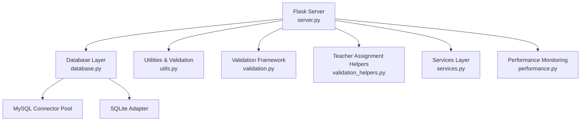
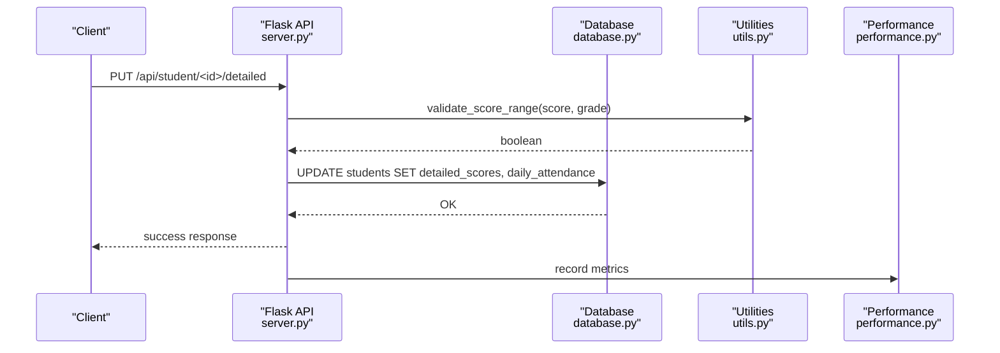
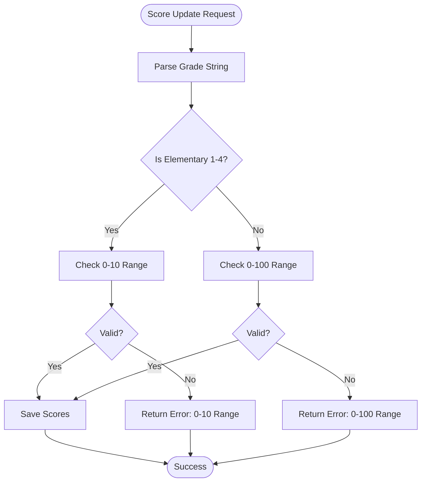
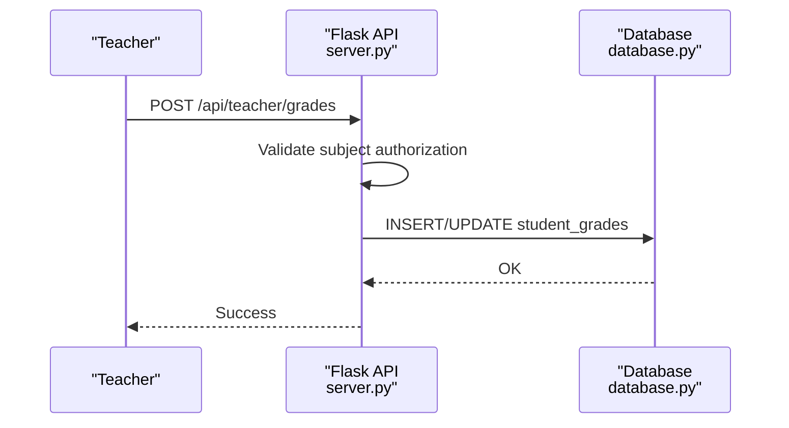
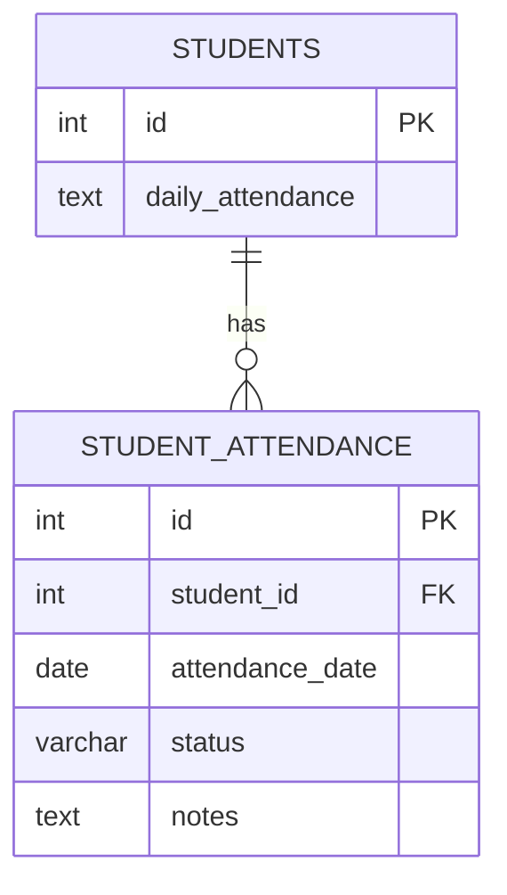
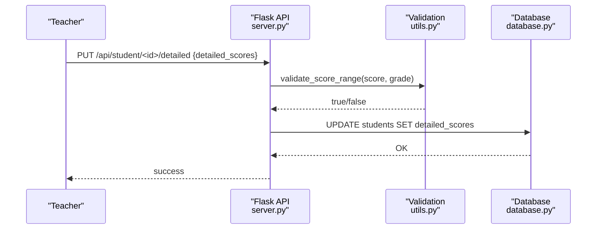
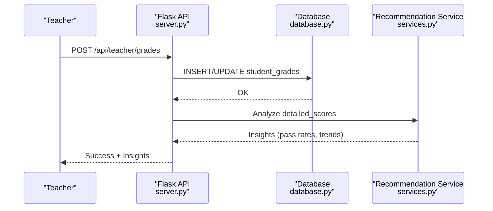
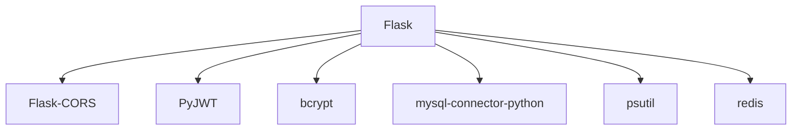

# Academic Record Management

<cite>
**Referenced Files in This Document**
- [server.py](file://server.py)
- [database.py](file://database.py)
- [utils.py](file://utils.py)
- [validation.py](file://validation.py)
- [validation_helpers.py](file://validation_helpers.py)
- [services.py](file://services.py)
- [performance.py](file://performance.py)
- [requirements.txt](file://requirements.txt)
- [README.md](file://README.md)
</cite>

## Table of Contents
1. [Introduction](#introduction)
2. [Project Structure](#project-structure)
3. [Core Components](#core-components)
4. [Architecture Overview](#architecture-overview)
5. [Detailed Component Analysis](#detailed-component-analysis)
6. [Dependency Analysis](#dependency-analysis)
7. [Performance Considerations](#performance-considerations)
8. [Troubleshooting Guide](#troubleshooting-guide)
9. [Conclusion](#conclusion)

## Introduction
This document describes the academic record management system, focusing on the scoring system, grade level validation, and integration with teacher assignment workflows. It explains how subject-based grade tracking, period-based assessments, and score validation work together, including the dual-grade scale system (elementary 1–4 use a 10-point scale; all other grades use a 100-point scale). It also documents the daily attendance tracking mechanism using JSON-based storage and outlines how teacher assignments connect to performance analytics.

## Project Structure
The system is a Flask-based backend with a modular design:
- API endpoints for CRUD operations on students, subjects, teachers, and academic years
- Centralized utilities for validation, sanitization, and score range checking
- Database abstraction supporting both MySQL and SQLite
- Performance monitoring and caching integrations
- Teacher assignment and authorization logic

**Diagram sources**
- [server.py](file://server.py#L1-L120)
- [database.py](file://database.py#L88-L120)
- [utils.py](file://utils.py#L1-L40)
- [validation.py](file://validation.py#L1-L40)
- [validation_helpers.py](file://validation_helpers.py#L1-L40)
- [services.py](file://services.py#L1-L40)
- [performance.py](file://performance.py#L1-L40)

**Section sources**
- [README.md](file://README.md#L1-L23)
- [requirements.txt](file://requirements.txt#L1-L14)

## Core Components
- Scoring and validation logic:
  - Elementary grades 1–4 use a 10-point scale; all other grades use a 100-point scale
  - Score validation enforces grade-appropriate ranges during updates
- Daily attendance tracking:
  - Stored as JSON in the students table under the daily_attendance column
- Teacher assignment integration:
  - Teachers can only manage students and subjects within their authorized scope
  - Academic records feed into recommendation services for performance analytics

Key implementation references:
- Grade detection and score validation: [server.py](file://server.py#L52-L90), [utils.py](file://utils.py#L123-L186)
- Attendance JSON handling: [server.py](file://server.py#L441-L467), [database.py](file://database.py#L159-L177)
- Teacher authorization and grade management: [server.py](file://server.py#L1708-L1843)
- Recommendation service for analytics: [services.py](file://services.py#L367-L765)

**Section sources**
- [server.py](file://server.py#L52-L90)
- [utils.py](file://utils.py#L123-L186)
- [database.py](file://database.py#L159-L177)
- [server.py](file://server.py#L441-L467)
- [server.py](file://server.py#L1708-L1843)
- [services.py](file://services.py#L367-L765)

## Architecture Overview
The system separates concerns across layers:
- Presentation/API: Flask routes handle HTTP requests and responses
- Business logic: Services encapsulate domain operations
- Data access: Database module abstracts MySQL/SQLite connections
- Utilities: Shared helpers for validation, sanitization, and score range checks
- Performance: Metrics and monitoring middleware

**Diagram sources**
- [server.py](file://server.py#L683-L766)
- [utils.py](file://utils.py#L163-L186)
- [database.py](file://database.py#L159-L177)
- [performance.py](file://performance.py#L1-L120)

## Detailed Component Analysis

### Scoring System and Grade Scale
- Dual-scale enforcement:
  - Elementary grades 1–4: scores must be between 0 and 10
  - Other grades: scores must be between 0 and 100
- Validation occurs during:
  - Bulk updates via `/api/student/<id>/detailed`
  - Individual student updates via `/api/student/<id>`
- The grade detection logic parses Arabic-formatted grade strings to determine the scale.

**Diagram sources**
- [server.py](file://server.py#L683-L766)
- [utils.py](file://utils.py#L123-L186)

**Section sources**
- [server.py](file://server.py#L52-L90)
- [server.py](file://server.py#L683-L766)
- [utils.py](file://utils.py#L123-L186)

### Period-Based Assessment Recording
- Structure:
  - Subject-based dictionary with period keys (e.g., month1, month2, midterm, month3, month4, final)
  - Stored as JSON in the detailed_scores column
- Validation ensures each score falls within the appropriate range based on grade level
- Example workflow:
  - Teacher posts grades for a subject and academic year
  - System verifies subject authorization and student eligibility
  - Grades are inserted or updated atomically

**Diagram sources**
- [server.py](file://server.py#L1708-L1782)
- [database.py](file://database.py#L291-L307)

**Section sources**
- [server.py](file://server.py#L1708-L1782)
- [database.py](file://database.py#L291-L307)

### Daily Attendance Tracking
- Data model:
  - JSON column daily_attendance stores per-date attendance records
  - Records include status (present, absent, late, excused) and optional notes
- Retrieval:
  - API endpoint returns student records with parsed JSON for daily_attendance
- UI integration displays attendance in a table with localized status labels

**Diagram sources**
- [database.py](file://database.py#L159-L177)
- [database.py](file://database.py#L309-L320)

**Section sources**
- [server.py](file://server.py#L441-L467)
- [database.py](file://database.py#L159-L177)
- [database.py](file://database.py#L309-L320)

### Score Scaling Algorithms and Grade Calculations
- The system does not implement explicit conversion algorithms between scales; it validates inputs against the correct range per grade level.
- Recommendations and analytics compute averages and pass rates from stored period scores, enabling performance insights without altering stored values.

Practical implications:
- Teachers enter scores according to the grade’s scale
- Analytics services calculate derived metrics (averages, pass rates) from the stored data

**Section sources**
- [services.py](file://services.py#L476-L546)
- [services.py](file://services.py#L548-L620)

### Practical Workflows

#### Score Entry Workflow
- Steps:
  - Prepare detailed_scores JSON with subject → periods
  - Submit via `/api/student/<id>/detailed` or `/api/student/<id>`
  - System validates each score against the grade’s scale
  - On success, updates are persisted

**Diagram sources**
- [server.py](file://server.py#L683-L766)
- [utils.py](file://utils.py#L163-L186)
- [database.py](file://database.py#L159-L177)

#### Bulk Score Updates
- Endpoint: `/api/student/<id>/detailed`
- Validates all scores before updating
- Supports partial updates (only detailed_scores or daily_attendance)

**Section sources**
- [server.py](file://server.py#L683-L766)

#### Grade Level Validation Scenarios
- Elementary 1–4:
  - Accepts scores 0–10
  - Rejects scores outside this range
- Other grades:
  - Accepts scores 0–100
  - Rejects scores outside this range

**Section sources**
- [server.py](file://server.py#L724-L740)
- [utils.py](file://utils.py#L163-L186)

### Integration with Teacher Assignment Systems
- Authorization:
  - Teachers can only manage students and subjects within their authorized scope
  - Subject access is verified against teacher_subjects and subject grade levels
- Academic records feeding analytics:
  - Recommendation service aggregates detailed_scores to produce insights
  - Analytics include pass rates, average scores, and at-risk student identification

**Diagram sources**
- [server.py](file://server.py#L1708-L1782)
- [services.py](file://services.py#L367-L474)

**Section sources**
- [server.py](file://server.py#L1708-L1782)
- [services.py](file://services.py#L367-L474)

## Dependency Analysis
External libraries and their roles:
- Flask: Web framework and routing
- Flask-CORS: Cross-origin support
- PyJWT: Token-based authentication
- bcrypt: Password hashing
- mysql-connector-python: MySQL connectivity
- psutil: System metrics for performance monitoring
- redis: Caching (configured but not extensively used in core logic)

**Diagram sources**
- [requirements.txt](file://requirements.txt#L1-L14)

**Section sources**
- [requirements.txt](file://requirements.txt#L1-L14)

## Performance Considerations
- Performance monitoring tracks request durations, endpoint statistics, and system metrics
- Database query performance can be tracked via a dedicated context manager
- Recommendations include batching and caching strategies for analytics-heavy operations

[No sources needed since this section provides general guidance]

## Troubleshooting Guide
Common issues and resolutions:
- Invalid score ranges:
  - Ensure scores match the grade’s scale (0–10 for elementary 1–4, 0–100 otherwise)
  - Review validation errors returned by score update endpoints
- Attendance JSON parsing:
  - Confirm daily_attendance is valid JSON; the API normalizes stringified JSON to objects
- Teacher authorization:
  - Verify the teacher’s assigned subjects and grade levels before posting grades
- Database connectivity:
  - The system falls back from MySQL to SQLite if MySQL is unavailable

**Section sources**
- [server.py](file://server.py#L683-L766)
- [server.py](file://server.py#L441-L467)
- [server.py](file://server.py#L1708-L1782)
- [database.py](file://database.py#L88-L118)

## Conclusion
The academic record management system provides a robust foundation for accurate scoring, strict grade-level validation, and integrated teacher assignment workflows. Its JSON-based attendance and detailed score storage enable flexible analytics, while performance monitoring and modular architecture support scalability and maintainability.