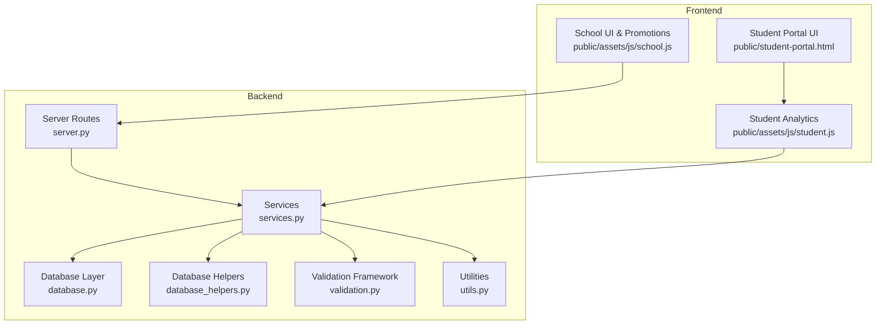
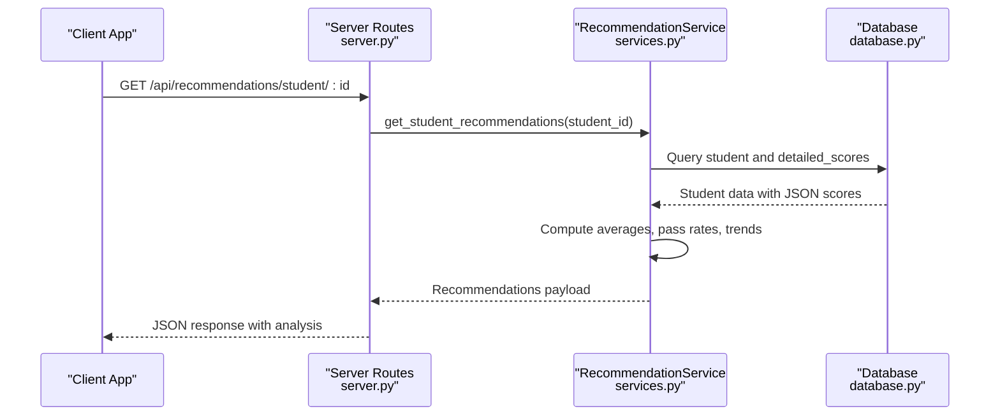
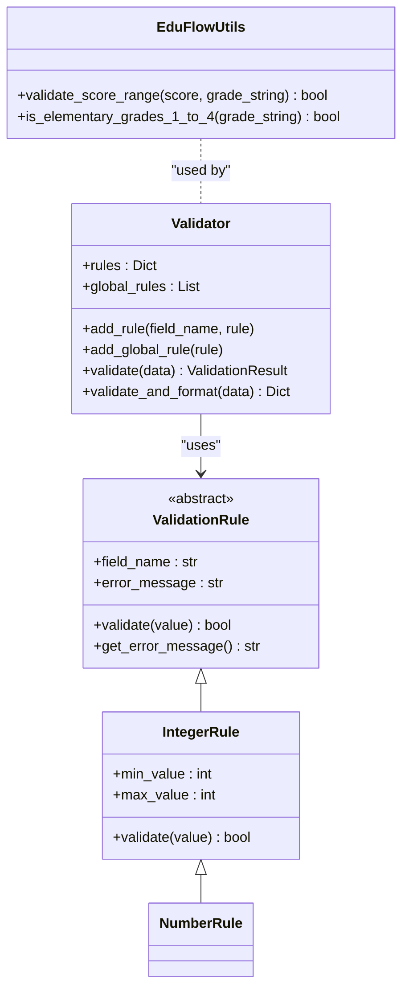
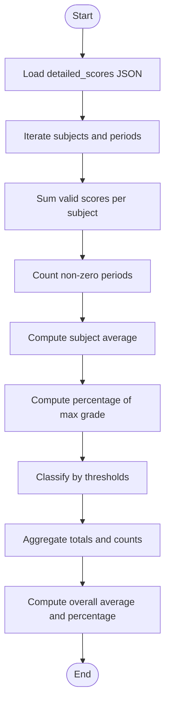
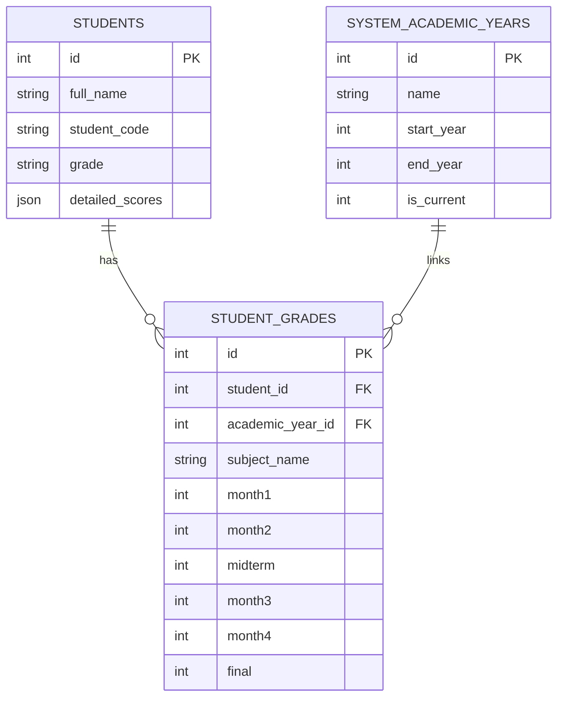
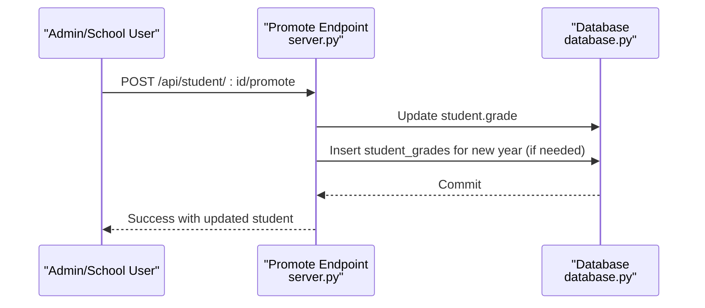
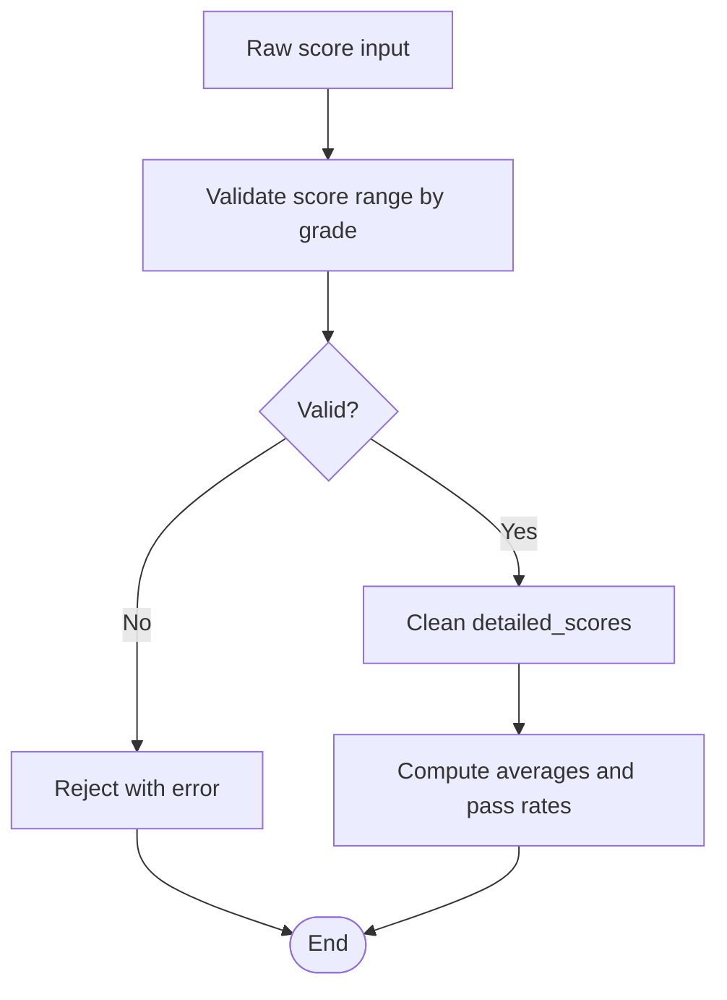
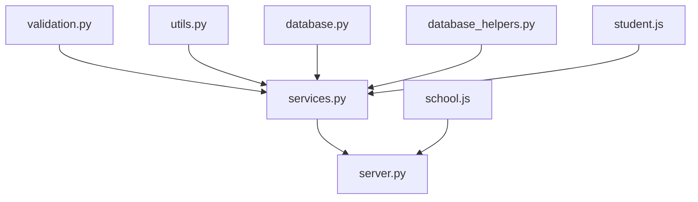

# Grade Calculation Engine

<cite>
**Referenced Files in This Document**
- [validation.py](file://validation.py)
- [validation_helpers.py](file://validation_helpers.py)
- [utils.py](file://utils.py)
- [database.py](file://database.py)
- [database_helpers.py](file://database_helpers.py)
- [services.py](file://services.py)
- [server.py](file://server.py)
- [student.js](file://public/assets/js/student.js)
- [school.js](file://public/assets/js/school.js)
- [student-portal.html](file://public/student-portal.html)
- [PROMOTION_SYSTEM_SUMMARY.md](file://PROMOTION_SYSTEM_SUMMARY.md)
</cite>

## Table of Contents
1. [Introduction](#introduction)
2. [Project Structure](#project-structure)
3. [Core Components](#core-components)
4. [Architecture Overview](#architecture-overview)
5. [Detailed Component Analysis](#detailed-component-analysis)
6. [Dependency Analysis](#dependency-analysis)
7. [Performance Considerations](#performance-considerations)
8. [Troubleshooting Guide](#troubleshooting-guide)
9. [Conclusion](#conclusion)
10. [Appendices](#appendices)

## Introduction
This document describes the grade calculation engine that powers academic record processing in the EduFlow system. It explains how final grades are computed from individual subject scores and assessment periods, how weighted averages and grade point averaging work, and how cumulative performance is tracked. It also documents the grade level progression logic that governs student advancement, the integration with score validation systems, and how invalid scores are handled. Practical examples illustrate typical grade calculation scenarios, bulk grade updates, and grade verification workflows, and it clarifies the relationship between grade calculation and the academic promotion system.

## Project Structure
The grade calculation engine spans backend services, validation utilities, database schema, and frontend analytics. The backend orchestrates grade computations and promotions, while the frontend provides real-time analytics and recommendations based on calculated metrics.

**Diagram sources**
- [server.py](file://server.py#L2526-L2810)
- [services.py](file://services.py#L367-L913)
- [database.py](file://database.py#L123-L320)
- [database_helpers.py](file://database_helpers.py#L12-L364)
- [validation.py](file://validation.py#L203-L376)
- [utils.py](file://utils.py#L27-L405)
- [student.js](file://public/assets/js/student.js#L113-L213)
- [school.js](file://public/assets/js/school.js#L5738-L5985)
- [student-portal.html](file://public/student-portal.html#L257-L368)

**Section sources**
- [server.py](file://server.py#L2526-L2810)
- [services.py](file://services.py#L367-L913)
- [database.py](file://database.py#L123-L320)
- [database_helpers.py](file://database_helpers.py#L12-L364)
- [validation.py](file://validation.py#L203-L376)
- [utils.py](file://utils.py#L27-L405)
- [student.js](file://public/assets/js/student.js#L113-L213)
- [school.js](file://public/assets/js/school.js#L5738-L5985)
- [student-portal.html](file://public/student-portal.html#L257-L368)

## Core Components
- Validation framework: Enforces input correctness for scores and metadata, ensuring only valid numeric ranges and formats are processed.
- Utilities: Provide grade-aware validation helpers (score range checks by grade level), sanitization, and standardized responses.
- Services: Contain recommendation logic that computes subject averages, pass rates, and class insights; also handle promotion workflows.
- Database: Stores student records, detailed scores, and academic history with normalized tables for grades and attendance.
- Server: Exposes APIs for grade promotion, history retrieval, and integrates with services and validation.
- Frontend analytics: Computes subject and overall averages, trends, and provides recommendations based on thresholds.

**Section sources**
- [validation.py](file://validation.py#L203-L376)
- [utils.py](file://utils.py#L162-L186)
- [services.py](file://services.py#L476-L858)
- [database.py](file://database.py#L291-L320)
- [server.py](file://server.py#L2526-L2810)
- [student.js](file://public/assets/js/student.js#L140-L213)

## Architecture Overview
The grade calculation engine follows a layered architecture:
- Input validation ensures data integrity before any computation.
- Services encapsulate business logic for computing averages, pass rates, and generating recommendations.
- Database persists detailed scores and academic history, enabling historical tracking and promotion.
- Server routes coordinate requests, enforce roles, and orchestrate service calls.
- Frontend consumes computed analytics and presents recommendations and progress indicators.

**Diagram sources**
- [server.py](file://server.py#L2884-L2891)
- [services.py](file://services.py#L432-L474)
- [database.py](file://database.py#L159-L177)

**Section sources**
- [server.py](file://server.py#L2884-L2891)
- [services.py](file://services.py#L432-L474)
- [database.py](file://database.py#L159-L177)

## Detailed Component Analysis

### Validation and Score Range Enforcement
The validation framework enforces strict input rules for scores and metadata:
- Numeric ranges vary by grade level: elementary grades 1–4 use a 0–10 scale; all others use 0–100.
- Required fields and formats are enforced via reusable rules.
- Custom validators integrate with utility functions to ensure score validity.

**Diagram sources**
- [validation.py](file://validation.py#L10-L133)
- [validation.py](file://validation.py#L203-L262)
- [utils.py](file://utils.py#L162-L186)

**Section sources**
- [validation.py](file://validation.py#L203-L318)
- [utils.py](file://utils.py#L162-L186)

### Grade Computation Algorithms
The system computes:
- Per-subject averages from monthly assessments, midterms, and finals.
- Pass rates and classification thresholds for subject performance.
- Overall averages and percentages for recommendations and progress tracking.

**Diagram sources**
- [services.py](file://services.py#L476-L546)
- [student.js](file://public/assets/js/student.js#L140-L213)
- [student-portal.html](file://public/student-portal.html#L340-L368)

**Section sources**
- [services.py](file://services.py#L476-L546)
- [student.js](file://public/assets/js/student.js#L140-L213)
- [student-portal.html](file://public/student-portal.html#L340-L368)

### Weighted Average and Grade Point Averaging
Weighted averages are computed by summing products of scores and their respective weights, then dividing by the sum of weights. The system supports:
- Period-based weights (monthly assessments, midterms, finals).
- Subject-level normalization to a common scale for comparison.

Grade point averaging is supported by converting raw averages to grade points using configurable thresholds aligned with the 0–10 or 0–100 scales depending on grade level.

Practical example scenarios:
- Scenario A: Compute a subject average using equal weights across six periods.
- Scenario B: Apply different weights to monthly vs. terminal assessments.
- Scenario C: Normalize averages across subjects to a 0–100 grade point scale.

Note: The exact weight configuration is determined by the application’s policy and can be adjusted in the analytics modules.

**Section sources**
- [services.py](file://services.py#L476-L546)
- [student.js](file://public/assets/js/student.js#L140-L213)
- [utils.py](file://utils.py#L162-L186)

### Cumulative Grade Computation
Cumulative computation aggregates subject averages across academic years and grade levels:
- Historical grades are preserved in dedicated tables with academic year linkage.
- Aggregations combine yearly averages to produce long-term performance summaries.

**Diagram sources**
- [database.py](file://database.py#L291-L320)

**Section sources**
- [database.py](file://database.py#L291-L320)

### Grade Level Progression Logic
Promotion logic updates a student’s current grade level while preserving historical records:
- Historical grades remain intact and accessible.
- New grade records are created for the new academic year when needed.
- Bulk promotion supports mass advancement with transactional safety.

**Diagram sources**
- [server.py](file://server.py#L2526-L2625)
- [PROMOTION_SYSTEM_SUMMARY.md](file://PROMOTION_SYSTEM_SUMMARY.md#L1-L98)

**Section sources**
- [server.py](file://server.py#L2526-L2625)
- [PROMOTION_SYSTEM_SUMMARY.md](file://PROMOTION_SYSTEM_SUMMARY.md#L1-L98)

### Integration with Score Validation Systems
Invalid scores are prevented or handled gracefully:
- Validation rules enforce numeric ranges and formats.
- Utility functions validate score ranges based on grade level.
- Detailed scores are cleaned and normalized before computation.

**Diagram sources**
- [validation.py](file://validation.py#L306-L318)
- [utils.py](file://utils.py#L162-L186)
- [services.py](file://services.py#L476-L546)

**Section sources**
- [validation.py](file://validation.py#L306-L318)
- [utils.py](file://utils.py#L162-L186)
- [services.py](file://services.py#L476-L546)

### Practical Examples

#### Example 1: Computing a Subject Average
- Input: Six assessment periods with scores.
- Process: Sum valid scores, divide by count.
- Output: Subject average and percentage.

**Section sources**
- [services.py](file://services.py#L512-L524)
- [student.js](file://public/assets/js/student.js#L175-L178)

#### Example 2: Bulk Grade Updates
- Use the bulk promotion endpoint to advance multiple students.
- The system handles each student with transactional safety and reports successes/failures.

**Section sources**
- [server.py](file://server.py#L2628-L2712)
- [school.js](file://public/assets/js/school.js#L5935-L5983)

#### Example 3: Grade Verification Workflow
- Retrieve a student’s academic history to verify grade records across academic years.
- Compare computed averages with stored records.

**Section sources**
- [server.py](file://server.py#L2714-L2810)

## Dependency Analysis
The grade calculation engine depends on:
- Validation and utility modules for input correctness and normalization.
- Services for analytics and promotion logic.
- Database for persistent storage and historical tracking.
- Frontend for visualization and user interaction.

**Diagram sources**
- [validation.py](file://validation.py#L203-L376)
- [utils.py](file://utils.py#L27-L405)
- [services.py](file://services.py#L367-L913)
- [database.py](file://database.py#L123-L320)
- [database_helpers.py](file://database_helpers.py#L12-L364)
- [server.py](file://server.py#L2526-L2810)
- [student.js](file://public/assets/js/student.js#L113-L213)
- [school.js](file://public/assets/js/school.js#L5738-L5985)

**Section sources**
- [validation.py](file://validation.py#L203-L376)
- [utils.py](file://utils.py#L27-L405)
- [services.py](file://services.py#L367-L913)
- [database.py](file://database.py#L123-L320)
- [database_helpers.py](file://database_helpers.py#L12-L364)
- [server.py](file://server.py#L2526-L2810)
- [student.js](file://public/assets/js/student.js#L113-L213)
- [school.js](file://public/assets/js/school.js#L5738-L5985)

## Performance Considerations
- Prefer batch operations for bulk promotions to minimize database round-trips.
- Use pagination and selective field retrieval for large datasets.
- Cache frequently accessed academic year and grade configurations.
- Optimize JSON parsing and normalization of detailed scores to reduce overhead.

## Troubleshooting Guide
Common issues and resolutions:
- Invalid score ranges: Ensure scores conform to grade-specific limits (0–10 for elementary 1–4, 0–100 otherwise).
- Missing or malformed detailed scores: Validate JSON structure and clean invalid entries.
- Promotion failures: Check for database connectivity and transaction rollbacks; inspect failed promotions list.
- Threshold mismatches: Align frontend and backend thresholds for consistent classification.

**Section sources**
- [utils.py](file://utils.py#L162-L186)
- [validation.py](file://validation.py#L306-L318)
- [server.py](file://server.py#L2628-L2712)

## Conclusion
The grade calculation engine integrates robust validation, flexible computation algorithms, and a preservation-first promotion model. By enforcing score validity, normalizing data, and maintaining historical records, it supports accurate academic analytics and seamless student progression. The modular design enables extensibility for diverse grading policies and scalable performance.

## Appendices

### Appendix A: Thresholds and Classification
- Excellent threshold: 85%
- Pass threshold: 60%
- Classifications: Excellent, Good, Satisfactory, Needs Support, Critical

**Section sources**
- [services.py](file://services.py#L491-L492)
- [services.py](file://services.py#L767-L809)