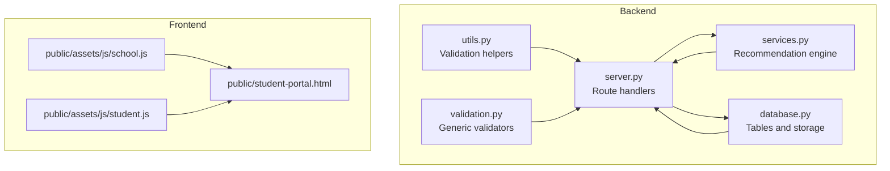
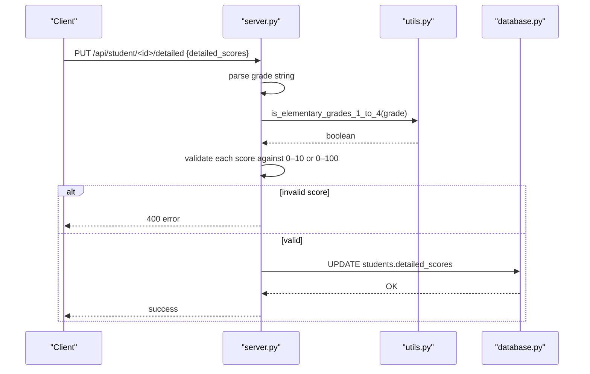
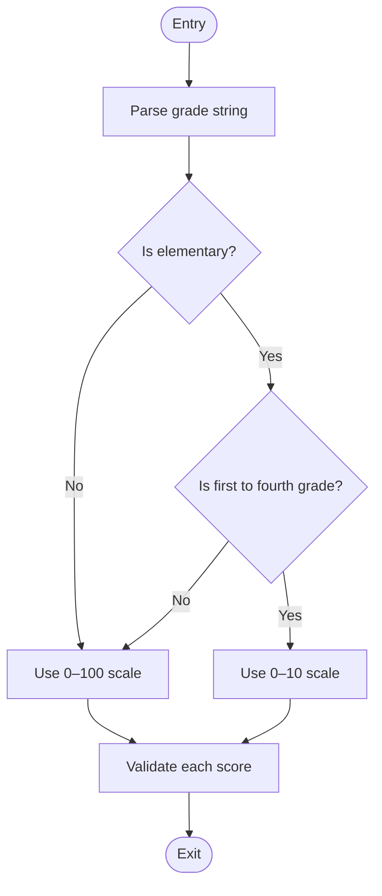
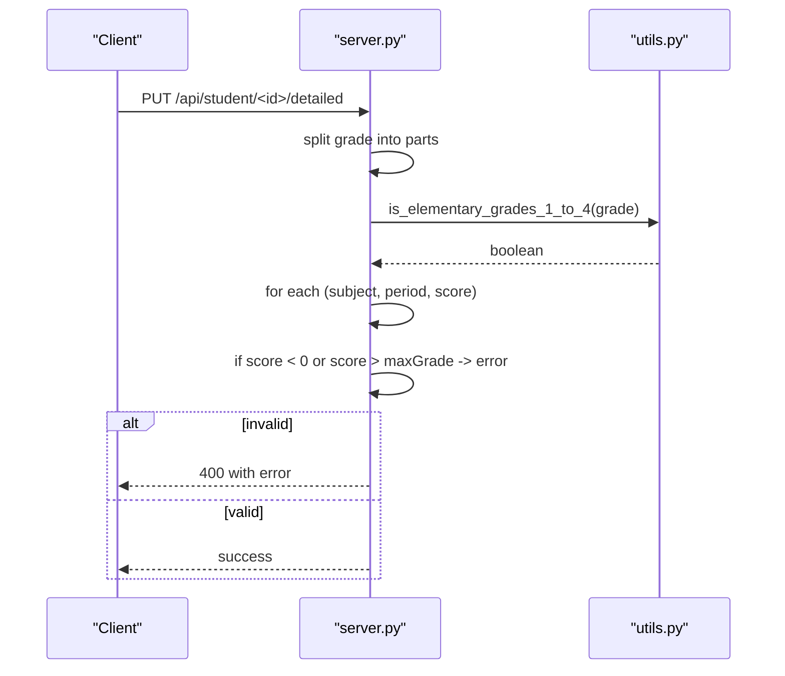
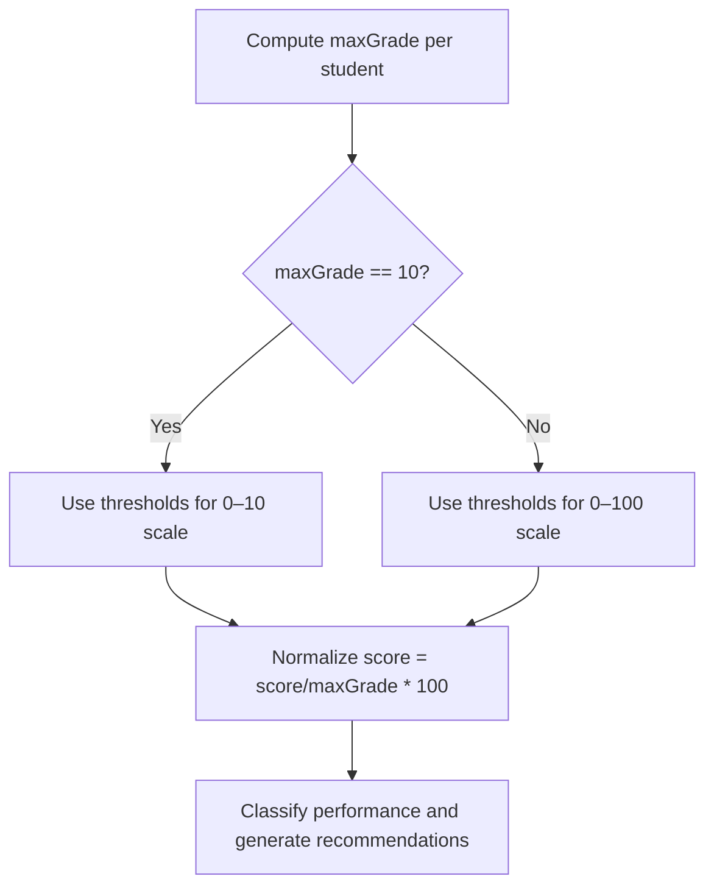
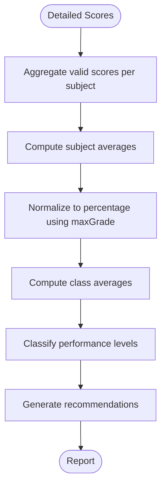
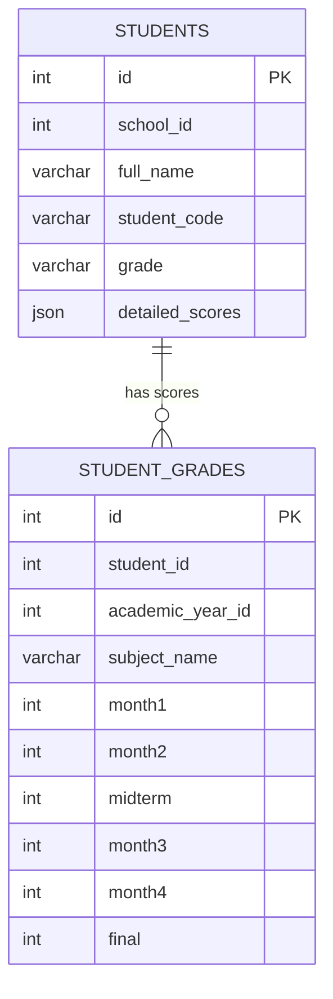
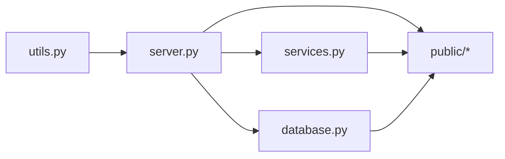

# Score Scaling Algorithms

<cite>
**Referenced Files in This Document**
- [utils.py](file://utils.py)
- [server.py](file://server.py)
- [validation.py](file://validation.py)
- [services.py](file://services.py)
- [database.py](file://database.py)
- [public/assets/js/school.js](file://public/assets/js/school.js)
- [public/assets/js/student.js](file://public/assets/js/student.js)
- [public/student-portal.html](file://public/student-portal.html)
</cite>

## Table of Contents
1. [Introduction](#introduction)
2. [Project Structure](#project-structure)
3. [Core Components](#core-components)
4. [Architecture Overview](#architecture-overview)
5. [Detailed Component Analysis](#detailed-component-analysis)
6. [Dependency Analysis](#dependency-analysis)
7. [Performance Considerations](#performance-considerations)
8. [Troubleshooting Guide](#troubleshooting-guide)
9. [Conclusion](#conclusion)

## Introduction
This document explains the score scaling algorithms used in academic record management. It covers:
- The grade-level score validation system that automatically selects score ranges based on educational stage (grades 1–4 use 0–10; others use 0–100).
- Mathematical formulas and conversion logic ensuring consistency across scales.
- Normalization processes enabling fair comparisons across subjects and assessment periods.
- Validation logic preventing invalid score entries and maintaining data integrity.
- Practical examples, edge cases, and integration with grade calculation workflows.
- Impact on final grade computation and report generation.

## Project Structure
The score scaling system spans backend validation and normalization logic, frontend presentation thresholds, and persistence in the database.

**Diagram sources**
- [utils.py](file://utils.py#L122-L186)
- [server.py](file://server.py#L52-L89)
- [validation.py](file://validation.py#L306-L318)
- [services.py](file://services.py#L476-L765)
- [database.py](file://database.py#L291-L320)
- [public/assets/js/school.js](file://public/assets/js/school.js#L3425-L3446)
- [public/assets/js/student.js](file://public/assets/js/student.js#L603-L620)
- [public/student-portal.html](file://public/student-portal.html#L672-L702)

**Section sources**
- [utils.py](file://utils.py#L122-L186)
- [server.py](file://server.py#L52-L89)
- [validation.py](file://validation.py#L306-L318)
- [services.py](file://services.py#L476-L765)
- [database.py](file://database.py#L291-L320)
- [public/assets/js/school.js](file://public/assets/js/school.js#L3425-L3446)
- [public/assets/js/student.js](file://public/assets/js/student.js#L603-L620)
- [public/student-portal.html](file://public/student-portal.html#L672-L702)

## Core Components
- Grade detection and score-range validation:
  - Backend: [utils.py](file://utils.py#L122-L186) provides the core logic to detect elementary grades 1–4 and validate scores accordingly.
  - Frontend: [public/assets/js/school.js](file://public/assets/js/school.js#L3425-L3446) and [public/assets/js/student.js](file://public/assets/js/student.js#L603-L620) compute the maximum grade per student and thresholds.
- Route-level enforcement:
  - [server.py](file://server.py#L590-L740) validates incoming detailed scores against the correct range per student’s grade.
- Generic validators:
  - [validation.py](file://validation.py#L306-L318) defines integer score fields constrained to 0–100 for general use.
- Recommendation engine:
  - [services.py](file://services.py#L476-L765) computes averages and performance levels using normalized percentages derived from the max grade.
- Persistence:
  - [database.py](file://database.py#L291-L320) stores student scores per subject and assessment periods.

**Section sources**
- [utils.py](file://utils.py#L122-L186)
- [server.py](file://server.py#L590-L740)
- [validation.py](file://validation.py#L306-L318)
- [services.py](file://services.py#L476-L765)
- [database.py](file://database.py#L291-L320)
- [public/assets/js/school.js](file://public/assets/js/school.js#L3425-L3446)
- [public/assets/js/student.js](file://public/assets/js/student.js#L603-L620)

## Architecture Overview
The system enforces score scaling at three layers:
- Input validation: Route handlers validate each score against the grade-appropriate range.
- Presentation normalization: Frontend converts raw scores to percentages using the max grade.
- Reporting aggregation: Services compute averages and performance levels using normalized percentages.

**Diagram sources**
- [server.py](file://server.py#L590-L740)
- [utils.py](file://utils.py#L122-L186)
- [database.py](file://database.py#L291-L320)

## Detailed Component Analysis

### Grade Detection and Score Range Validation
- Purpose: Automatically select the correct score range (0–10 vs 0–100) based on the educational stage and grade level.
- Implementation highlights:
  - Detect elementary stage and first to fourth grade levels.
  - Exclude fifth and sixth grades from 0–10 scale.
  - Validate numeric scores against the computed range.

**Diagram sources**
- [utils.py](file://utils.py#L122-L186)
- [server.py](file://server.py#L52-L89)

**Section sources**
- [utils.py](file://utils.py#L122-L186)
- [server.py](file://server.py#L52-L89)

### Route-Level Score Validation
- Purpose: Enforce score range constraints at the API boundary.
- Behavior:
  - Parses the student’s grade to determine the max grade.
  - Iterates through detailed scores and rejects out-of-range values.
  - Returns localized error messages for invalid entries.

**Diagram sources**
- [server.py](file://server.py#L590-L740)
- [utils.py](file://utils.py#L122-L186)

**Section sources**
- [server.py](file://server.py#L590-L740)

### Frontend Thresholds and Normalization
- Purpose: Normalize raw scores to percentages for consistent reporting and visualization.
- Behavior:
  - Compute max grade per student (10 for elementary 1–4; 100 otherwise).
  - Define pass and safe thresholds based on max grade.
  - Convert raw scores to percentages for display and recommendation generation.

**Diagram sources**
- [public/assets/js/school.js](file://public/assets/js/school.js#L3425-L3446)
- [public/assets/js/student.js](file://public/assets/js/student.js#L603-L620)
- [public/student-portal.html](file://public/student-portal.html#L672-L702)

**Section sources**
- [public/assets/js/school.js](file://public/assets/js/school.js#L3425-L3446)
- [public/assets/js/student.js](file://public/assets/js/student.js#L603-L620)
- [public/student-portal.html](file://public/student-portal.html#L672-L702)

### Recommendation Engine Normalization
- Purpose: Compute class and student averages using normalized percentages.
- Behavior:
  - Aggregate valid scores per subject.
  - Compute averages and classify performance levels.
  - Generate recommendations based on normalized metrics.

**Diagram sources**
- [services.py](file://services.py#L476-L765)

**Section sources**
- [services.py](file://services.py#L476-L765)

### Data Model and Storage
- Purpose: Persist student scores and support normalization and reporting.
- Schema highlights:
  - student_grades table stores monthly and final scores per subject and academic year.
  - Students’ detailed_scores store per-period scores for normalization and recommendation.

**Diagram sources**
- [database.py](file://database.py#L159-L177)
- [database.py](file://database.py#L291-L320)

**Section sources**
- [database.py](file://database.py#L159-L177)
- [database.py](file://database.py#L291-L320)

## Dependency Analysis
- Backend-to-frontend dependencies:
  - Backend determines max grade via grade parsing; frontend consumes this to normalize and display.
- Route-to-utils dependency:
  - Route handlers depend on utility functions to decide the correct score range.
- Service-to-route dependency:
  - Recommendation service relies on normalized averages produced by route-level and frontend logic.

**Diagram sources**
- [utils.py](file://utils.py#L122-L186)
- [server.py](file://server.py#L52-L89)
- [services.py](file://services.py#L476-L765)
- [database.py](file://database.py#L291-L320)
- [public/assets/js/school.js](file://public/assets/js/school.js#L3425-L3446)
- [public/assets/js/student.js](file://public/assets/js/student.js#L603-L620)

**Section sources**
- [utils.py](file://utils.py#L122-L186)
- [server.py](file://server.py#L52-L89)
- [services.py](file://services.py#L476-L765)
- [database.py](file://database.py#L291-L320)
- [public/assets/js/school.js](file://public/assets/js/school.js#L3425-L3446)
- [public/assets/js/student.js](file://public/assets/js/student.js#L603-L620)

## Performance Considerations
- Minimize repeated parsing:
  - Cache the computed max grade per student during request processing to avoid recomputation.
- Efficient normalization:
  - Normalize scores once per report cycle rather than per display event.
- Batch updates:
  - When updating detailed scores, batch validations and writes to reduce database round-trips.

## Troubleshooting Guide
Common issues and resolutions:
- Invalid score range error:
  - Symptom: 400 error indicating score must be between 0 and 10 or 0 and 100.
  - Cause: Score outside the computed max grade for the student’s grade.
  - Resolution: Adjust score to match the correct scale or correct the grade string.
- Mixed scales in reports:
  - Symptom: Confusion when comparing subjects across different grades.
  - Cause: Raw scores not normalized to percentages.
  - Resolution: Ensure frontend normalization and service-level averages use the same max grade.
- Edge case: Fifth and sixth graders in elementary stage:
  - Symptom: Unexpected 0–10 scale.
  - Cause: Incorrect grade string parsing.
  - Resolution: Confirm grade string includes “الخامس” or “السادس” to exclude 0–10 scale.

**Section sources**
- [server.py](file://server.py#L590-L740)
- [utils.py](file://utils.py#L122-L186)
- [public/assets/js/school.js](file://public/assets/js/school.js#L3425-L3446)
- [public/assets/js/student.js](file://public/assets/js/student.js#L603-L620)

## Conclusion
The score scaling system ensures data integrity and fair comparisons by:
- Dynamically selecting score ranges based on grade detection.
- Enforcing validation at the API boundary.
- Normalizing scores to percentages for consistent reporting and recommendations.
Adhering to these patterns guarantees accurate final grade computation and reliable report generation across diverse educational stages.