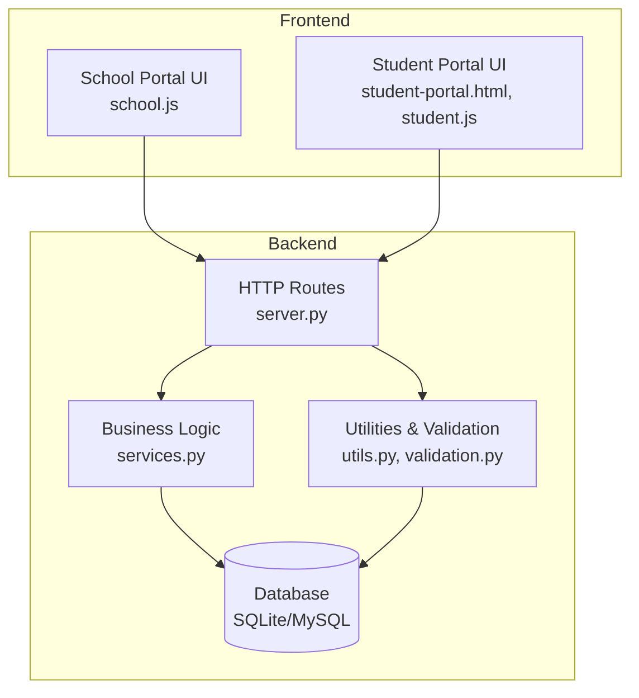
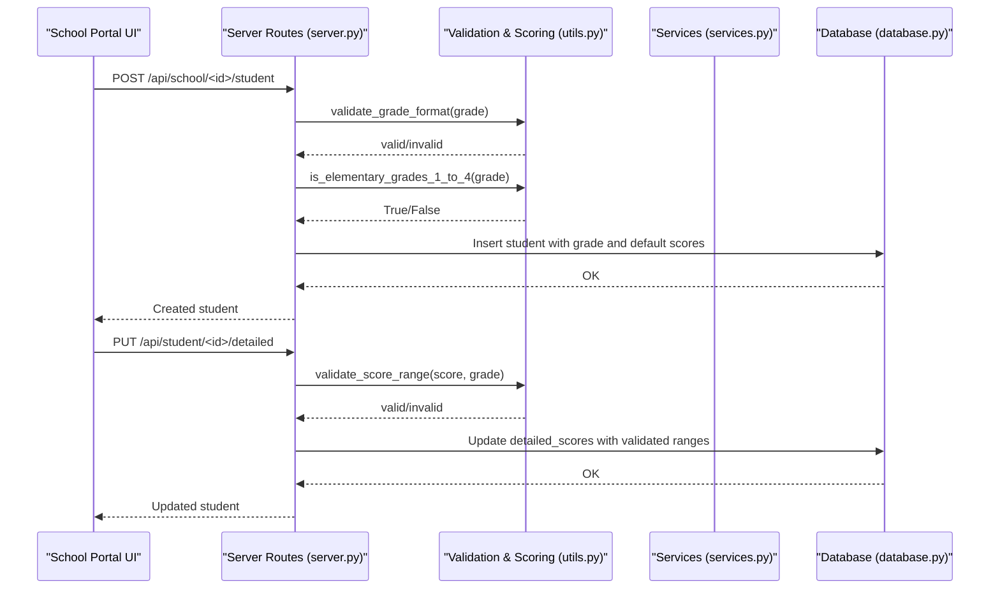
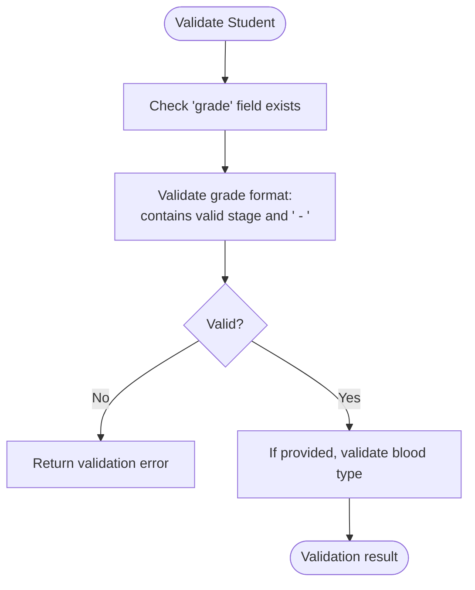
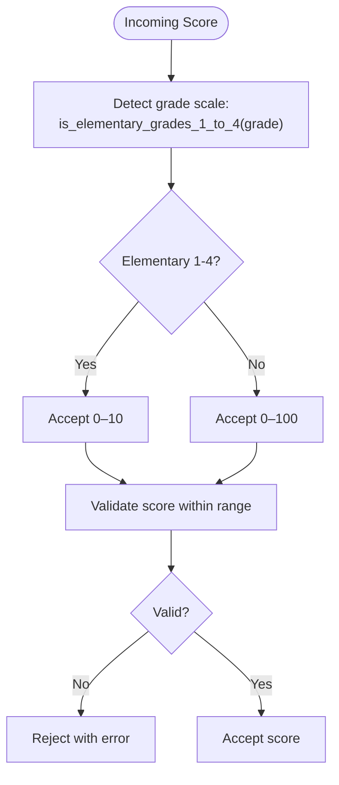
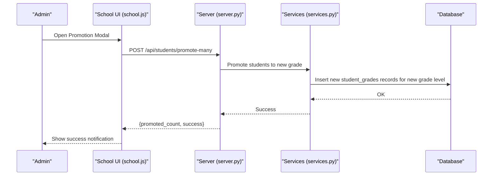
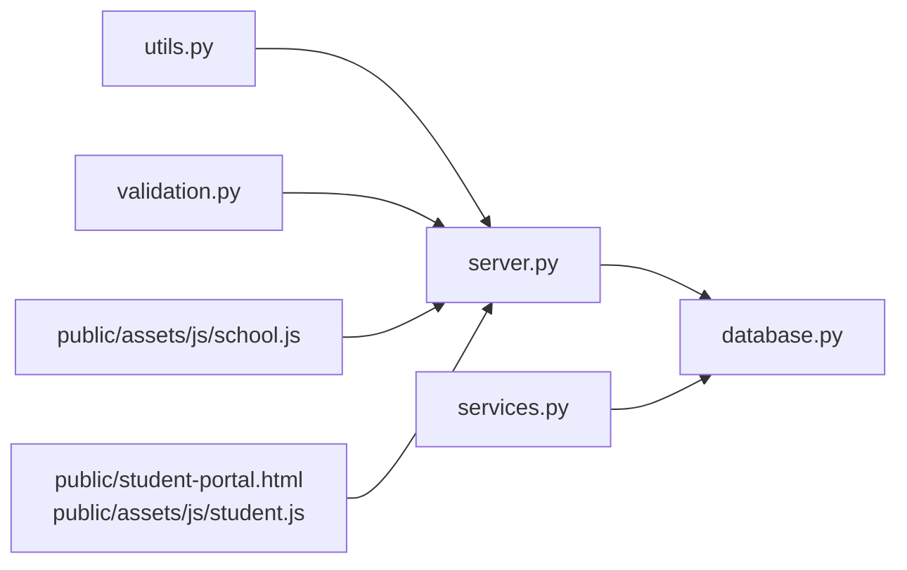

# Grade Level and Educational Stages

<cite>
**Referenced Files in This Document**
- [README.md](file://README.md)
- [utils.py](file://utils.py)
- [validation.py](file://validation.py)
- [validation_helpers.py](file://validation_helpers.py)
- [database.py](file://database.py)
- [populate_subjects.py](file://populate_subjects.py)
- [server.py](file://server.py)
- [services.py](file://services.py)
- [PROMOTION_SYSTEM_SUMMARY.md](file://PROMOTION_SYSTEM_SUMMARY.md)
- [public/assets/js/school.js](file://public/assets/js/school.js)
- [public/student-portal.html](file://public/student-portal.html)
- [public/assets/js/student.js](file://public/assets/js/student.js)
</cite>

## Table of Contents
1. [Introduction](#introduction)
2. [Project Structure](#project-structure)
3. [Core Components](#core-components)
4. [Architecture Overview](#architecture-overview)
5. [Detailed Component Analysis](#detailed-component-analysis)
6. [Dependency Analysis](#dependency-analysis)
7. [Performance Considerations](#performance-considerations)
8. [Troubleshooting Guide](#troubleshooting-guide)
9. [Conclusion](#conclusion)

## Introduction
This document explains the grade level and educational stages system in EduFlow. It covers the four educational stages, grade string format, validation rules, score scaling logic, grade progression and promotion, and integration with subject assignment. The goal is to help administrators, teachers, and developers understand how grades are represented, validated, scaled, and progressed across academic years while maintaining historical records.

## Project Structure
The grade system spans backend services, validation utilities, database schema, and frontend integrations:
- Backend: utilities and validation enforce grade format and score ranges; server routes handle student updates and score validation; services manage academic year and promotion logic.
- Database: stores students, subjects, academic years, and grade-related records.
- Frontend: integrates grade logic into student and school dashboards, including promotion modals and dynamic score thresholds.

**Diagram sources**
- [server.py](file://server.py#L1-L120)
- [utils.py](file://utils.py#L1-L120)
- [validation.py](file://validation.py#L263-L320)
- [services.py](file://services.py#L118-L230)
- [database.py](file://database.py#L120-L339)
- [public/assets/js/school.js](file://public/assets/js/school.js#L5640-L5985)
- [public/student-portal.html](file://public/student-portal.html#L1777-L1818)
- [public/assets/js/student.js](file://public/assets/js/student.js#L603-L631)

**Section sources**
- [README.md](file://README.md#L1-L23)
- [database.py](file://database.py#L120-L339)

## Core Components
- Educational stages and mappings:
  - Four stages: Elementary (ابتدائي), Middle (متوسطة), Secondary (ثانوية), Preparatory (إعدادية).
  - Stage-to-level mapping normalizes short forms to full level names.
- Grade string format:
  - Pattern: "<stage> - <grade_description>" (e.g., "ابتدائي - الأول الابتدائي").
  - Validation ensures presence of stage indicator and at least two segments.
- Score scaling:
  - Elementary grades 1–4 use a 0–10 scale.
  - All other grades (including elementary 5–6, middle, secondary, preparatory) use a 0–100 scale.
- Promotion and academic year progression:
  - Promotion updates a student’s current grade level without modifying historical records.
  - New records are created for the new grade level under the current academic year.

**Section sources**
- [utils.py](file://utils.py#L33-L42)
- [utils.py](file://utils.py#L105-L186)
- [validation.py](file://validation.py#L265-L280)
- [server.py](file://server.py#L52-L89)
- [server.py](file://server.py#L470-L560)
- [PROMOTION_SYSTEM_SUMMARY.md](file://PROMOTION_SYSTEM_SUMMARY.md#L3-L24)

## Architecture Overview
The grade system integrates validation, scoring, and promotion across layers.

**Diagram sources**
- [server.py](file://server.py#L470-L560)
- [server.py](file://server.py#L683-L767)
- [utils.py](file://utils.py#L105-L186)
- [database.py](file://database.py#L159-L177)

## Detailed Component Analysis

### Educational Stages and Grade String Format
- Supported stages: Elementary (ابتدائي), Middle (متوسطة), Secondary (ثانوية), Preparatory (إعدادية).
- Stage normalization: Short stage names are mapped to full level names for consistency.
- Grade string format: "<stage> - <grade_description>". Validation checks for presence of a valid stage and at least two segments.

Practical examples:
- Valid: "ابتدائي - الأول الابتدائي", "متوسطة - الصف الأول", "ثانوية - الصف الثاني", "إعدادية - الصف الثالث".
- Invalid: "ابتدائي", "ابتدائي الأول الابتدائي" (missing separator), or "غير معروف - الصف الأول".

Integration points:
- Student creation and updates validate the grade string format.
- Subject assignment uses grade_level to filter subjects by grade.

**Section sources**
- [utils.py](file://utils.py#L33-L42)
- [utils.py](file://utils.py#L105-L121)
- [validation.py](file://validation.py#L265-L280)
- [populate_subjects.py](file://populate_subjects.py#L38-L52)
- [database.py](file://database.py#L197-L206)

### Grade Validation System
- Field-level validation:
  - Grade is required and must pass custom validation for format.
- Format validation:
  - Ensures the grade string contains a valid stage and at least two segments separated by " - ".
- Blood type validation:
  - Optional field constrained to acceptable values.

**Diagram sources**
- [validation.py](file://validation.py#L265-L280)
- [validation.py](file://validation.py#L174-L202)

**Section sources**
- [validation.py](file://validation.py#L265-L280)
- [validation.py](file://validation.py#L174-L202)

### Grade-Based Score Scaling System
- Scale determination:
  - Elementary grades 1–4: 0–10 scale.
  - All other grades: 0–100 scale.
- Implementation:
  - Utilities detect elementary 1–4 based on stage and grade keywords.
  - Server routes validate incoming scores against the computed scale.
  - Frontend adapts UI thresholds accordingly.

**Diagram sources**
- [utils.py](file://utils.py#L122-L186)
- [server.py](file://server.py#L597-L612)
- [server.py](file://server.py#L725-L740)
- [public/assets/js/student.js](file://public/assets/js/student.js#L603-L631)
- [public/student-portal.html](file://public/student-portal.html#L684-L702)

**Section sources**
- [utils.py](file://utils.py#L122-L186)
- [server.py](file://server.py#L597-L612)
- [server.py](file://server.py#L725-L740)
- [public/assets/js/student.js](file://public/assets/js/student.js#L603-L631)
- [public/student-portal.html](file://public/student-portal.html#L684-L702)

### Grade Progression and Promotion Logic
- Principle:
  - Promotion advances a student to a new grade level without altering historical records.
  - Historical grades remain preserved as permanent academic records.
- Implementation:
  - Promotion endpoints accept student IDs, new grade level, and academic year.
  - New grade records are created for the new academic year; previous records remain unchanged.
  - UI provides single and mass promotion modals with warnings and confirmations.

**Diagram sources**
- [public/assets/js/school.js](file://public/assets/js/school.js#L5640-L5985)
- [server.py](file://server.py#L1-L120)
- [services.py](file://services.py#L118-L230)
- [PROMOTION_SYSTEM_SUMMARY.md](file://PROMOTION_SYSTEM_SUMMARY.md#L3-L24)

**Section sources**
- [PROMOTION_SYSTEM_SUMMARY.md](file://PROMOTION_SYSTEM_SUMMARY.md#L3-L24)
- [public/assets/js/school.js](file://public/assets/js/school.js#L5640-L5985)
- [services.py](file://services.py#L118-L230)

### Integration with Subject Assignment Systems
- Subjects are associated with grade levels via the grade_level column.
- Filtering:
  - When a class name is "stage - grade", the system extracts the grade level and filters subjects accordingly.
- Examples:
  - For "ابتدائي - الأول الابتدائي", only subjects with grade_level = "الأول الابتدائي" are shown.

**Section sources**
- [database.py](file://database.py#L197-L206)
- [populate_subjects.py](file://populate_subjects.py#L38-L52)
- [validation_helpers.py](file://validation_helpers.py#L192-L273)

## Dependency Analysis
Key dependencies and relationships:
- server.py depends on utils.py for grade detection and validation helpers.
- server.py validates scores and enforces grade format during student updates.
- services.py coordinates academic year and promotion logic.
- database.py defines schema for students, subjects, academic years, and grade records.
- Frontend scripts rely on grade logic to compute score thresholds and drive promotion UI.

**Diagram sources**
- [utils.py](file://utils.py#L105-L186)
- [validation.py](file://validation.py#L265-L280)
- [server.py](file://server.py#L470-L560)
- [database.py](file://database.py#L120-L339)
- [services.py](file://services.py#L118-L230)
- [public/assets/js/school.js](file://public/assets/js/school.js#L5640-L5985)
- [public/student-portal.html](file://public/student-portal.html#L1777-L1818)
- [public/assets/js/student.js](file://public/assets/js/student.js#L603-L631)

**Section sources**
- [utils.py](file://utils.py#L105-L186)
- [validation.py](file://validation.py#L265-L280)
- [server.py](file://server.py#L470-L560)
- [database.py](file://database.py#L120-L339)
- [services.py](file://services.py#L118-L230)
- [public/assets/js/school.js](file://public/assets/js/school.js#L5640-L5985)
- [public/student-portal.html](file://public/student-portal.html#L1777-L1818)
- [public/assets/js/student.js](file://public/assets/js/student.js#L603-L631)

## Performance Considerations
- Score validation occurs per subject and per grading period; keep validation logic efficient by early exits and minimal regex usage.
- Use database indexes on frequently filtered columns (e.g., students.grade, subjects.grade_level) to speed up queries.
- Batch operations for mass promotions reduce round-trips and improve throughput.

## Troubleshooting Guide
Common issues and resolutions:
- Invalid grade format:
  - Ensure the grade string follows "<stage> - <grade_description>" and contains a valid stage.
  - Reference: [validation.py](file://validation.py#L265-L280), [utils.py](file://utils.py#L105-L121).
- Score out of range:
  - For elementary 1–4, scores must be 0–10; otherwise use 0–100.
  - Reference: [utils.py](file://utils.py#L162-L186), [server.py](file://server.py#L597-L612).
- Promotion not updating records:
  - Verify new grade level and academic year are set; ensure historical records are preserved.
  - Reference: [PROMOTION_SYSTEM_SUMMARY.md](file://PROMOTION_SYSTEM_SUMMARY.md#L3-L24), [services.py](file://services.py#L118-L230).
- Subject visibility mismatch:
  - Confirm subjects’ grade_level matches the expected grade string extracted from class names.
  - Reference: [populate_subjects.py](file://populate_subjects.py#L38-L52), [validation_helpers.py](file://validation_helpers.py#L192-L273).

**Section sources**
- [validation.py](file://validation.py#L265-L280)
- [utils.py](file://utils.py#L162-L186)
- [server.py](file://server.py#L597-L612)
- [PROMOTION_SYSTEM_SUMMARY.md](file://PROMOTION_SYSTEM_SUMMARY.md#L3-L24)
- [services.py](file://services.py#L118-L230)
- [populate_subjects.py](file://populate_subjects.py#L38-L52)
- [validation_helpers.py](file://validation_helpers.py#L192-L273)

## Conclusion
EduFlow’s grade system provides a robust, stage-aware model for representing student progress. It enforces consistent grade formatting, scales scores appropriately by grade level, preserves historical academic records during promotions, and integrates seamlessly with subject assignment. The combination of backend validation, frontend threshold computation, and clear promotion semantics ensures accurate and reliable grade management across academic years.