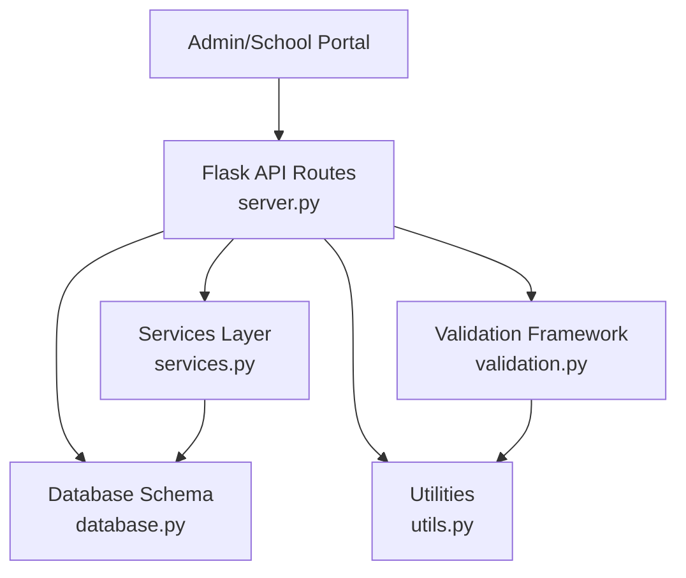
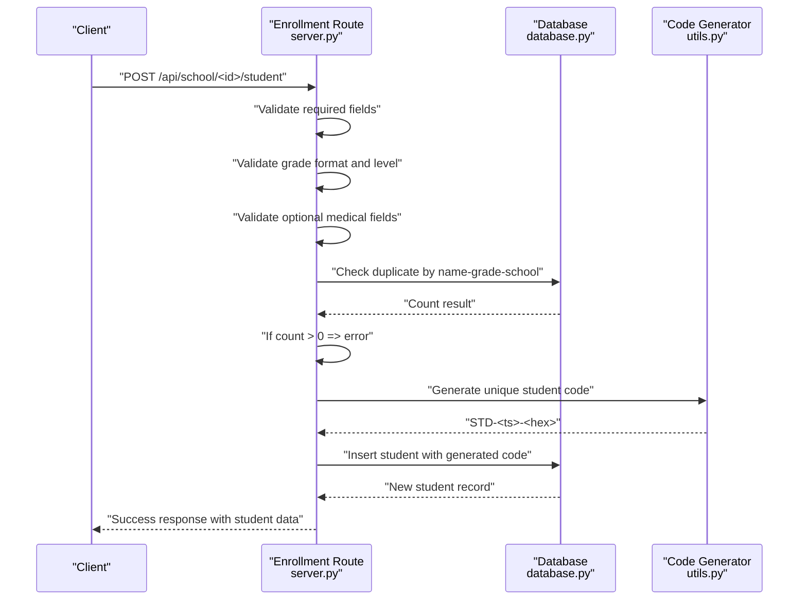
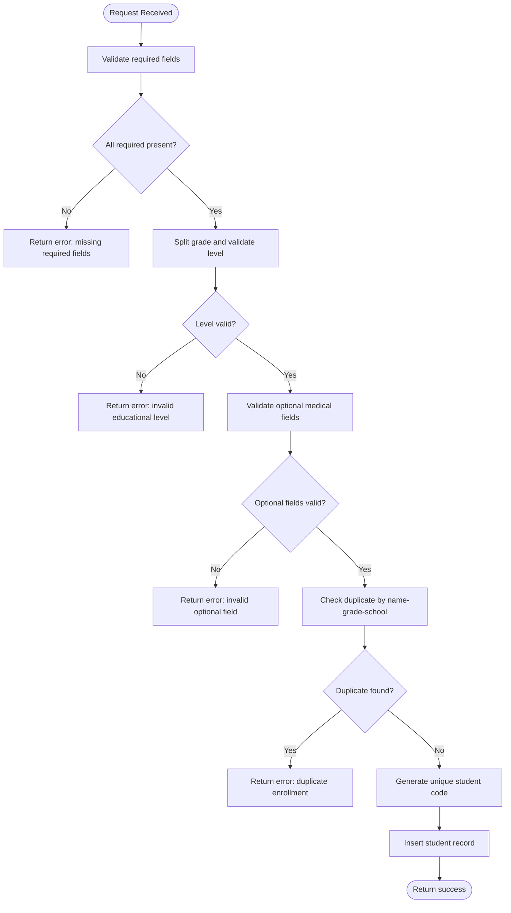
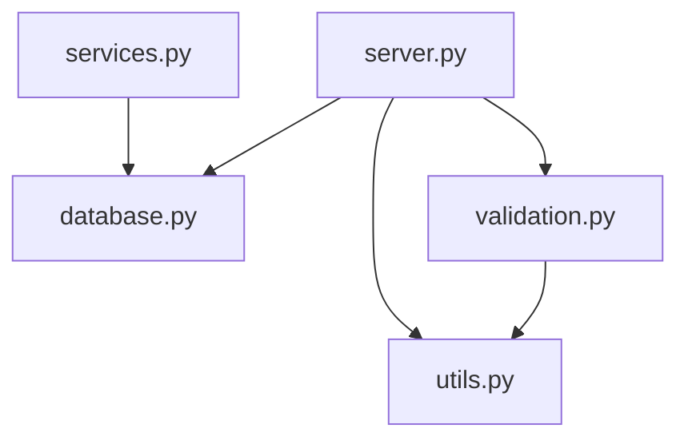

# Student Enrollment Process

<cite>
**Referenced Files in This Document**
- [server.py](file://server.py)
- [database.py](file://database.py)
- [utils.py](file://utils.py)
- [validation.py](file://validation.py)
- [validation_helpers.py](file://validation_helpers.py)
- [services.py](file://services.py)
</cite>

## Table of Contents
1. [Introduction](#introduction)
2. [Project Structure](#project-structure)
3. [Core Components](#core-components)
4. [Architecture Overview](#architecture-overview)
5. [Detailed Component Analysis](#detailed-component-analysis)
6. [Dependency Analysis](#dependency-analysis)
7. [Performance Considerations](#performance-considerations)
8. [Troubleshooting Guide](#troubleshooting-guide)
9. [Conclusion](#conclusion)

## Introduction
This document explains the complete student enrollment process in EduFlow, covering form processing, unique student code generation, duplicate prevention, validation rules, and the enrollment data model. It also details grade validation, duplicate detection logic, and integration points with the broader school management system. Practical examples and error handling guidance are included to help administrators and developers implement and troubleshoot the workflow effectively.

## Project Structure
The enrollment workflow spans several modules:
- API endpoints orchestrate enrollment requests and enforce role-based access.
- Database schema defines the student record structure and constraints.
- Utilities provide shared validation helpers and code generation.
- Validation framework offers reusable rules for consistent input checks.
- Services encapsulate business logic and can be used to extend or integrate enrollment flows.

**Diagram sources**
- [server.py](file://server.py#L469-L560)
- [database.py](file://database.py#L159-L177)
- [utils.py](file://utils.py#L213-L226)
- [validation.py](file://validation.py#L265-L280)
- [services.py](file://services.py#L232-L269)

**Section sources**
- [server.py](file://server.py#L469-L560)
- [database.py](file://database.py#L159-L177)
- [utils.py](file://utils.py#L213-L226)
- [validation.py](file://validation.py#L265-L280)
- [services.py](file://services.py#L232-L269)

## Core Components
- Enrollment endpoint: Validates required fields, grade format and level, optional medical info, and prevents duplicates before inserting a new student.
- Unique student code generator: Creates codes with the STD- prefix, timestamp, and random suffix.
- Duplicate detection: Checks for existing students with the same name, grade, and school.
- Validation rules: Enforces required fields, grade format, educational level, and optional medical fields.
- Data model: Defines the student record structure and optional medical fields.

Key implementation references:
- Enrollment route and validation: [server.py](file://server.py#L469-L560)
- Unique code generation: [server.py](file://server.py#L531-L531), [utils.py](file://utils.py#L213-L226)
- Duplicate check: [server.py](file://server.py#L509-L530)
- Medical info validation: [server.py](file://server.py#L501-L507)
- Student table schema: [database.py](file://database.py#L159-L177)
- Validation framework: [validation.py](file://validation.py#L265-L280)

**Section sources**
- [server.py](file://server.py#L469-L560)
- [utils.py](file://utils.py#L213-L226)
- [database.py](file://database.py#L159-L177)
- [validation.py](file://validation.py#L265-L280)

## Architecture Overview
The enrollment flow integrates API validation, database persistence, and utility functions to ensure correctness and uniqueness.

**Diagram sources**
- [server.py](file://server.py#L469-L560)
- [database.py](file://database.py#L159-L177)
- [utils.py](file://utils.py#L213-L226)

## Detailed Component Analysis

### Enrollment Endpoint and Validation
The enrollment endpoint enforces:
- Required fields: full_name, grade, room.
- Grade format: must split into at least two parts and match supported educational levels.
- Educational level: restricted to predefined values.
- Optional medical fields: parent_contact, blood_type, chronic_disease.
- Duplicate prevention: blocks enrollment if a student with the same name, grade, and school already exists.
- Unique student code generation: uses timestamp and random hex with STD- prefix.

**Diagram sources**
- [server.py](file://server.py#L469-L560)

**Section sources**
- [server.py](file://server.py#L469-L560)

### Unique Student Code Generation
The system generates unique student codes using:
- Prefix: STD-
- Timestamp component derived from milliseconds since epoch
- Random uppercase hex component
- Uniqueness enforced by database constraint and pre-insertion checks

References:
- Code generation logic: [server.py](file://server.py#L531-L531), [utils.py](file://utils.py#L213-L226)
- Database uniqueness constraint: [database.py](file://database.py#L163-L164)

**Section sources**
- [server.py](file://server.py#L531-L531)
- [utils.py](file://utils.py#L213-L226)
- [database.py](file://database.py#L163-L164)

### Duplicate Prevention Mechanism
Duplicate detection ensures a student with the same full_name, grade, and school_id cannot be enrolled twice. The algorithm:
- Executes a count query on the students table filtered by name, grade, and school_id.
- Blocks enrollment if count > 0.
- Returns a localized error message indicating duplicate enrollment.

References:
- Duplicate check query and logic: [server.py](file://server.py#L509-L530)

**Section sources**
- [server.py](file://server.py#L509-L530)

### Validation Rules and Grade System
Validation encompasses:
- Required fields: full_name, grade, room.
- Grade format: must include a valid educational level and separator.
- Educational level: one of the supported stages.
- Optional medical fields: parent_contact, blood_type, chronic_disease.
- Blood type validation: restricted to known values.
- Score range validation (for related operations): 0–10 for elementary grades 1–4, 0–100 otherwise.

References:
- Validation rules for student data: [validation.py](file://validation.py#L265-L280)
- Utility validations: [utils.py](file://utils.py#L80-L104), [utils.py](file://utils.py#L163-L186)
- Grade helper function: [server.py](file://server.py#L52-L90), [utils.py](file://utils.py#L123-L161)

**Section sources**
- [validation.py](file://validation.py#L265-L280)
- [utils.py](file://utils.py#L80-L104)
- [utils.py](file://utils.py#L123-L186)
- [server.py](file://server.py#L52-L90)

### Enrollment Data Model
The student record includes:
- Required fields: school_id, full_name, student_code, grade, room, enrollment_date.
- Optional medical fields: parent_contact, blood_type, chronic_disease.
- JSON fields: detailed_scores, daily_attendance initialized as empty JSON objects.
- Timestamps: created_at, updated_at.

References:
- Students table schema: [database.py](file://database.py#L159-L177)

**Section sources**
- [database.py](file://database.py#L159-L177)

### Classroom Assignment Workflow Integration
While the enrollment endpoint creates a student record, classroom assignment is handled separately via teacher-class assignment workflows. The recommendation service demonstrates how grade-level context influences downstream operations (e.g., retrieving students by grade for analytics). Classroom assignment typically follows enrollment and involves linking teachers to classes and subjects.

References:
- Recommendation service student retrieval by grade: [services.py](file://services.py#L396-L406)
- Teacher-class assignment tables and queries: [database.py](file://database.py#L247-L259)

**Section sources**
- [services.py](file://services.py#L396-L406)
- [database.py](file://database.py#L247-L259)

## Dependency Analysis
The enrollment process depends on:
- API route for request handling and validation.
- Database for schema enforcement and duplicate checks.
- Utilities for code generation and validation helpers.
- Validation framework for reusable rules.
- Services for potential future refactoring of business logic.

**Diagram sources**
- [server.py](file://server.py#L469-L560)
- [database.py](file://database.py#L159-L177)
- [utils.py](file://utils.py#L213-L226)
- [validation.py](file://validation.py#L265-L280)
- [services.py](file://services.py#L232-L269)

**Section sources**
- [server.py](file://server.py#L469-L560)
- [database.py](file://database.py#L159-L177)
- [utils.py](file://utils.py#L213-L226)
- [validation.py](file://validation.py#L265-L280)
- [services.py](file://services.py#L232-L269)

## Performance Considerations
- Indexing: Consider adding composite indexes on (full_name, grade, school_id) to optimize duplicate checks.
- Asynchronous processing: For high-volume enrollments, offload duplicate checks and inserts to background tasks.
- Caching: Cache frequently accessed grade-level configurations to reduce repeated lookups.
- Pagination and filtering: When retrieving student lists, apply pagination and filters to avoid large result sets.

## Troubleshooting Guide
Common issues and resolutions:
- Missing required fields: Ensure full_name, grade, and room are provided. The endpoint returns a clear error when any are absent.
- Invalid grade format: Grade must include a valid educational level and separator. Verify the format before submission.
- Invalid educational level: Only supported levels are accepted. Confirm the level matches expected values.
- Invalid blood type: If provided, must be one of the accepted values. Remove or correct the field if invalid.
- Duplicate enrollment: If a student with the same name, grade, and school already exists, the system blocks the request. Adjust inputs or confirm the student’s status.
- Database connectivity: If the database pool is unavailable, the endpoint returns a failure response. Check connection settings and retry.

Operational references:
- Required fields and grade validation: [server.py](file://server.py#L481-L499)
- Blood type validation: [server.py](file://server.py#L501-L507)
- Duplicate check and error: [server.py](file://server.py#L509-L530)
- Database connection failure handling: [server.py](file://server.py#L514-L515)

**Section sources**
- [server.py](file://server.py#L481-L530)
- [server.py](file://server.py#L514-L515)

## Conclusion
EduFlow’s student enrollment process combines strict input validation, robust duplicate prevention, and a reliable unique code generation mechanism. The modular architecture—API routes, database schema, utilities, and validation—ensures maintainability and extensibility. Integrating with classroom assignment workflows enables seamless transitions from enrollment to class placement and ongoing academic management.