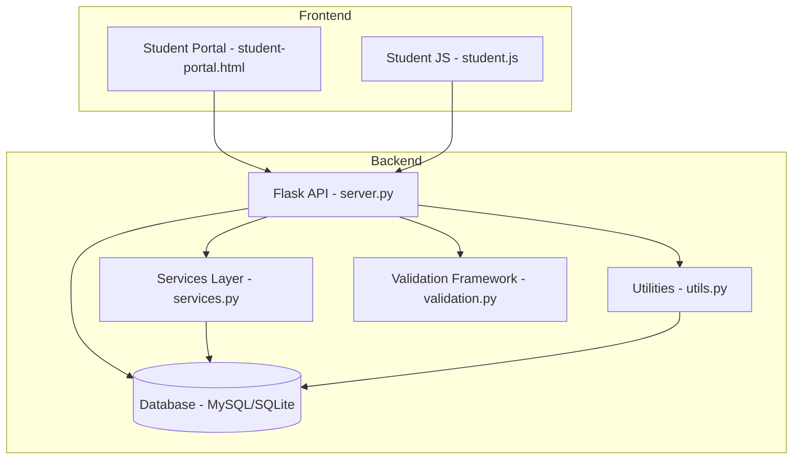
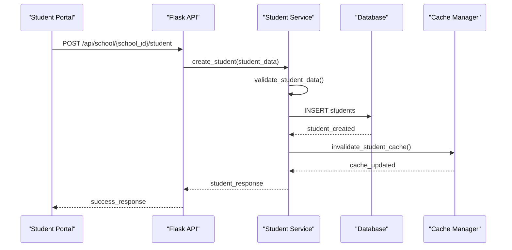
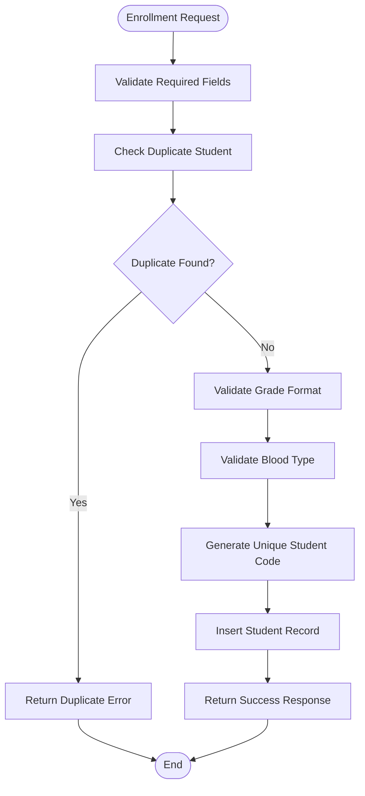
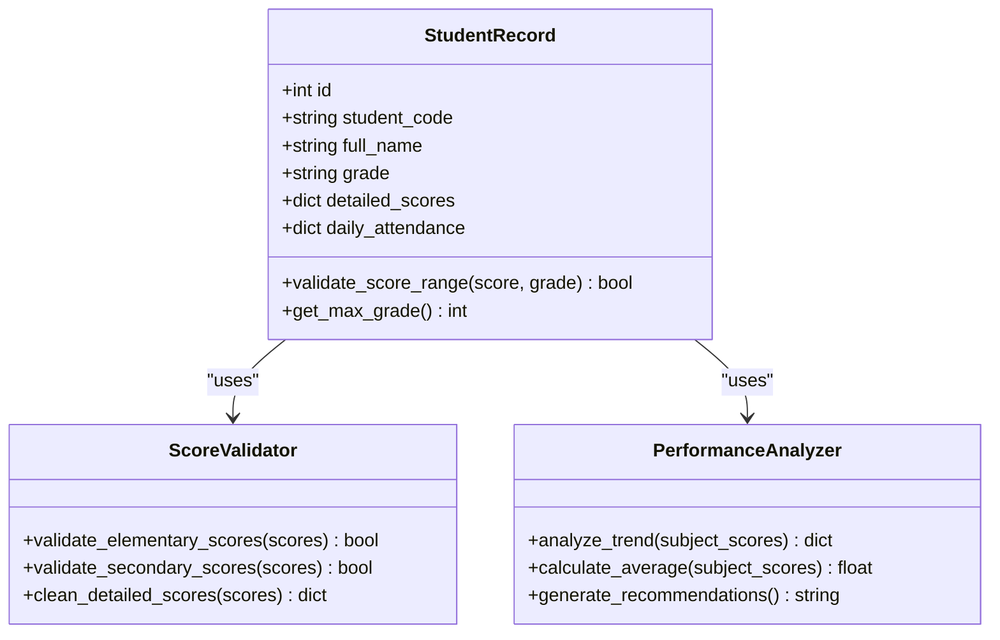
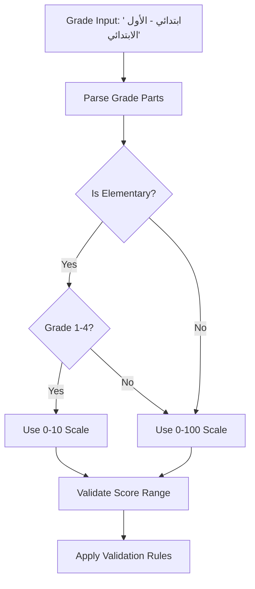
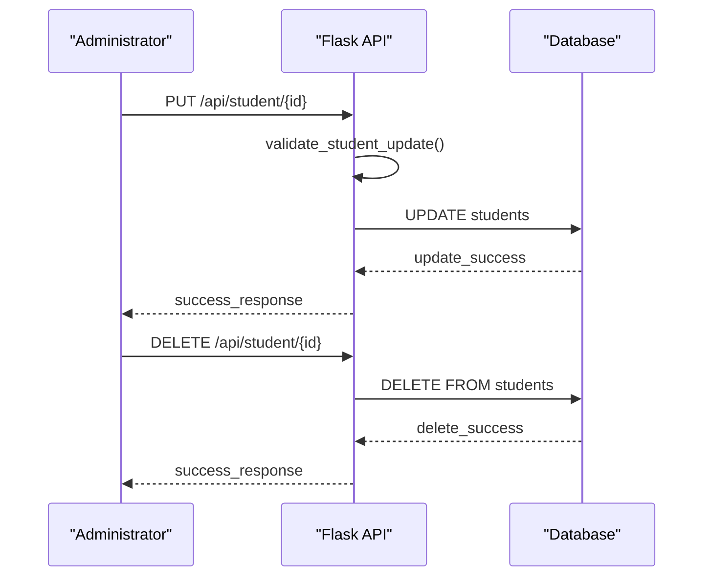
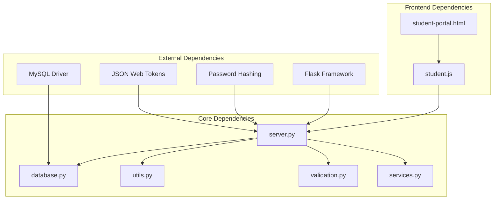

# Student Management System

<cite>
**Referenced Files in This Document**
- [server.py](file://server.py)
- [database.py](file://database.py)
- [validation.py](file://validation.py)
- [utils.py](file://utils.py)
- [validation_helpers.py](file://validation_helpers.py)
- [services.py](file://services.py)
- [student.js](file://public/assets/js/student.js)
- [student-portal.html](file://public/student-portal.html)
</cite>

## Table of Contents
1. [Introduction](#introduction)
2. [Project Structure](#project-structure)
3. [Core Components](#core-components)
4. [Architecture Overview](#architecture-overview)
5. [Detailed Component Analysis](#detailed-component-analysis)
6. [Dependency Analysis](#dependency-analysis)
7. [Performance Considerations](#performance-considerations)
8. [Troubleshooting Guide](#troubleshooting-guide)
9. [Conclusion](#conclusion)

## Introduction
This document provides comprehensive documentation for the student management system within EduFlow. It covers the complete student enrollment process, unique student code generation, profile management, academic record tracking, score management with grade-level validation, and score scaling for elementary versus secondary education. It also documents the student profile structure, grade level system with Arabic educational stages, deletion and modification workflows, data validation rules, duplicate prevention mechanisms, integration with school management and teacher assignment systems, and practical examples for enrollment, scoring, and profile updates.

## Project Structure
The student management system is implemented as a Flask-based backend API with a MySQL/SQLite database and a frontend student portal. The key components include:
- Backend API routes for student enrollment, updates, deletions, and academic record management
- Database schema with tables for students, schools, subjects, teachers, and academic records
- Validation framework for input sanitization and business rule enforcement
- Utility functions for code generation, score validation, and data formatting
- Frontend JavaScript for student portal interactions, grade analysis, and recommendations

**Diagram sources**
- [server.py](file://server.py#L1-L120)
- [database.py](file://database.py#L120-L338)
- [services.py](file://services.py#L1-L120)
- [utils.py](file://utils.py#L1-L120)
- [validation.py](file://validation.py#L1-L120)
- [student-portal.html](file://public/student-portal.html#L1-L120)
- [student.js](file://public/assets/js/student.js#L1-L120)

**Section sources**
- [server.py](file://server.py#L1-L120)
- [database.py](file://database.py#L120-L338)

## Core Components
The student management system consists of several core components working together:

### Database Schema
The system uses a normalized relational schema with the following key tables:
- **students**: Stores student profiles, enrollment details, and academic records
- **schools**: Contains school information and metadata
- **subjects**: Manages subject offerings per school
- **teachers**: Handles teacher profiles and assignments
- **student_grades**: Tracks detailed academic performance per subject and period
- **student_attendance**: Records daily attendance and excused absences

### API Endpoints
The backend exposes RESTful endpoints for:
- Student CRUD operations with duplicate prevention
- Academic record management (scores and attendance)
- School and teacher integration
- Grade level management and validation

### Validation Framework
A comprehensive validation system ensures data integrity:
- Input sanitization and XSS protection
- Required field validation
- Educational level and grade format validation
- Score range validation based on grade level
- Duplicate detection for student enrollment

**Section sources**
- [database.py](file://database.py#L138-L338)
- [server.py](file://server.py#L441-L766)
- [validation.py](file://validation.py#L263-L376)
- [utils.py](file://utils.py#L27-L186)

## Architecture Overview
The system follows a layered architecture with clear separation of concerns:

**Diagram sources**
- [server.py](file://server.py#L469-L559)
- [services.py](file://services.py#L232-L297)
- [database.py](file://database.py#L159-L177)

The architecture implements:
- **Layered Design**: Clear separation between API, service, and data access layers
- **Validation Pipeline**: Multi-layer validation from frontend to database
- **Caching Strategy**: Optimistic caching for improved performance
- **Error Handling**: Centralized error management and response formatting

**Section sources**
- [server.py](file://server.py#L1-L120)
- [services.py](file://services.py#L12-L43)

## Detailed Component Analysis

### Student Enrollment Process
The student enrollment process involves multiple validation steps and duplicate prevention mechanisms:

**Diagram sources**
- [server.py](file://server.py#L469-L559)
- [utils.py](file://utils.py#L214-L225)

Key features of the enrollment process:
- **Duplicate Prevention**: Checks for existing students with same name and grade in the same school
- **Unique Code Generation**: Creates unique student codes using timestamp and random components
- **Multi-field Validation**: Validates educational level, grade format, and medical information
- **Automatic JSON Initialization**: Initializes detailed_scores and daily_attendance as empty JSON objects

**Section sources**
- [server.py](file://server.py#L469-L559)
- [utils.py](file://utils.py#L214-L225)

### Academic Record Tracking System
The academic record system supports detailed score management with grade-level validation:

**Diagram sources**
- [utils.py](file://utils.py#L163-L211)
- [student.js](file://public/assets/js/student.js#L132-L516)

The system implements:
- **Grade-Level Scoring**: Automatic score scaling between 0-10 for elementary grades 1-4 and 0-100 for other grades
- **Trend Analysis**: Detects improvement, decline, and consistency patterns
- **Performance Insights**: Generates personalized recommendations based on academic performance
- **Real-time Validation**: Frontend validation prevents invalid score entries

**Section sources**
- [utils.py](file://utils.py#L163-L211)
- [student.js](file://public/assets/js/student.js#L132-L516)

### Student Profile Management
Student profiles include comprehensive personal and medical information:

| Profile Field | Data Type | Validation | Purpose |
|---------------|-----------|------------|---------|
| full_name | string | 2-255 chars | Student identification |
| student_code | string | unique | System identifier |
| grade | string | Arabic format | Educational level |
| room | string | 1-100 chars | Classroom assignment |
| enrollment_date | date | ISO format | Admission tracking |
| parent_contact | string | phone validation | Emergency contact |
| blood_type | enum | O+, A+, B+, AB+ | Medical requirements |
| chronic_disease | text | free text | Health management |

**Section sources**
- [database.py](file://database.py#L159-L177)
- [server.py](file://server.py#L472-L537)
- [validation.py](file://validation.py#L265-L279)

### Grade Level System
The system supports Arabic educational stages with automatic score scaling:

**Diagram sources**
- [utils.py](file://utils.py#L123-L186)
- [student.js](file://public/assets/js/student.js#L584-L620)

Grade level mappings:
- **Elementary (ابتدائي)**: Grades 1-4 use 10-point scale
- **Middle (متوسطة)**: Uses 100-point scale
- **Secondary (ثانوية)**: Uses 100-point scale
- **Preparatory (إعدادية)**: Uses 100-point scale

**Section sources**
- [utils.py](file://utils.py#L123-L186)
- [server.py](file://server.py#L52-L90)

### Deletion and Modification Workflows
The system provides robust data modification capabilities:

**Diagram sources**
- [server.py](file://server.py#L564-L681)

Modification features:
- **Selective Updates**: Supports partial updates to student profiles
- **Score Management**: Separate endpoint for detailed score updates
- **Attendance Tracking**: Dedicated endpoint for daily attendance management
- **Cascade Deletion**: Automatic cleanup of related academic records

**Section sources**
- [server.py](file://server.py#L564-L766)

### Integration with School Management and Teachers
The system integrates with broader school management through:

- **School Association**: Students are linked to schools via foreign key relationships
- **Teacher Assignment**: Students can be associated with teachers through subject enrollments
- **Academic Year Tracking**: Centralized academic year management for consistent grading
- **Performance Analytics**: Cross-school performance comparisons and recommendations

**Section sources**
- [database.py](file://database.py#L208-L320)
- [services.py](file://services.py#L367-L474)

## Dependency Analysis
The system exhibits clear dependency relationships:

**Diagram sources**
- [server.py](file://server.py#L1-L20)
- [database.py](file://database.py#L1-L20)
- [utils.py](file://utils.py#L1-L10)

Key dependency characteristics:
- **Low Coupling**: Modules have minimal interdependencies
- **Clear Interfaces**: Well-defined function signatures and return types
- **External Library Usage**: Standard Python libraries for security and web frameworks
- **Database Abstraction**: Single connection pool abstraction for database access

**Section sources**
- [server.py](file://server.py#L1-L20)
- [database.py](file://database.py#L88-L118)

## Performance Considerations
The system implements several performance optimization strategies:

- **Connection Pooling**: MySQL connection pooling reduces database overhead
- **Caching Strategy**: Cache manager for frequently accessed data
- **Lazy Loading**: Teacher subject data loaded only when requested
- **Batch Operations**: Bulk grade level creation for efficiency
- **JSON Storage**: Efficient storage of detailed scores and attendance data

## Troubleshooting Guide
Common issues and their solutions:

### Authentication Issues
- **Problem**: Students cannot log in with valid codes
- **Solution**: Verify JWT secret configuration and token expiration settings
- **Prevention**: Regular token rotation and secure secret management

### Data Validation Errors
- **Problem**: Enrollment fails with validation errors
- **Solution**: Check required fields and format requirements
- **Prevention**: Implement frontend validation before submission

### Database Connection Problems
- **Problem**: API returns database connection errors
- **Solution**: Verify MySQL credentials and network connectivity
- **Prevention**: Implement connection retry logic and health checks

### Performance Issues
- **Problem**: Slow response times for large datasets
- **Solution**: Optimize queries with proper indexing
- **Prevention**: Implement pagination and caching strategies

**Section sources**
- [server.py](file://server.py#L110-L139)
- [database.py](file://database.py#L88-L118)

## Conclusion
The EduFlow student management system provides a comprehensive, scalable solution for educational institution management. Its architecture emphasizes data integrity through multi-layer validation, supports Arabic educational standards with intelligent score scaling, and offers robust integration capabilities with broader school management systems. The system's modular design, clear separation of concerns, and comprehensive validation framework make it suitable for deployment in diverse educational environments while maintaining high standards of data accuracy and user experience.