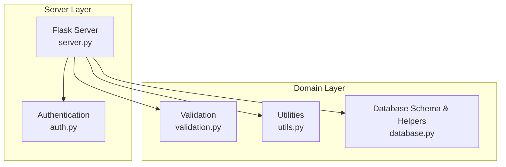
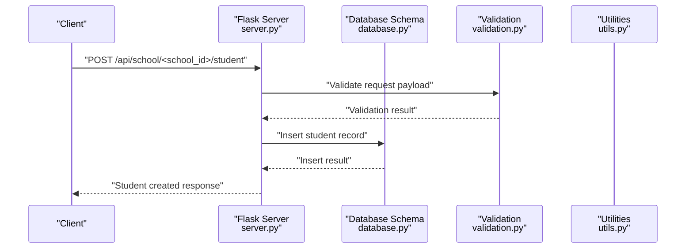
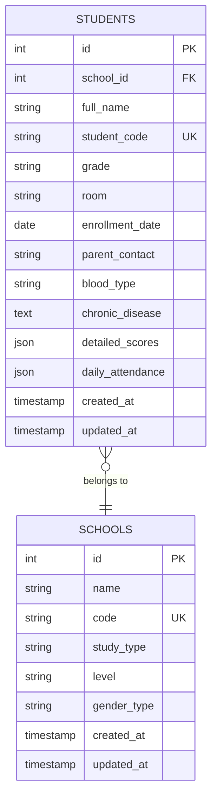
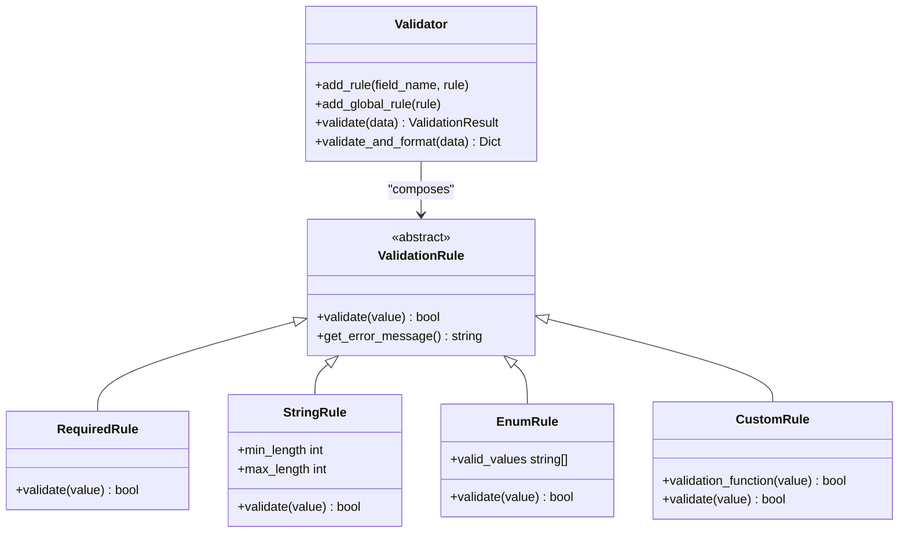
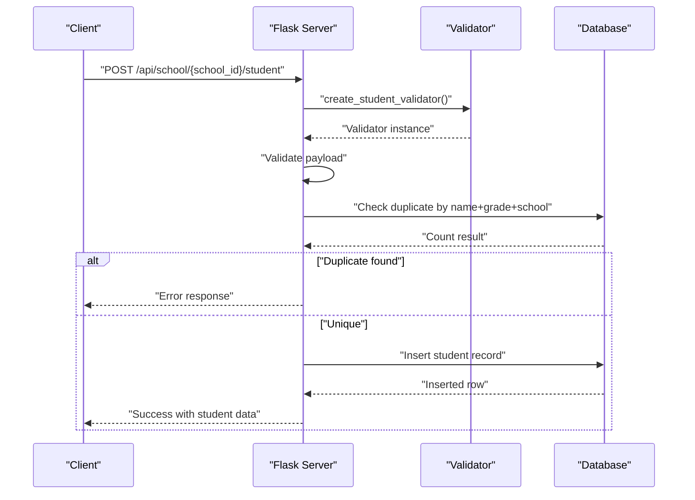
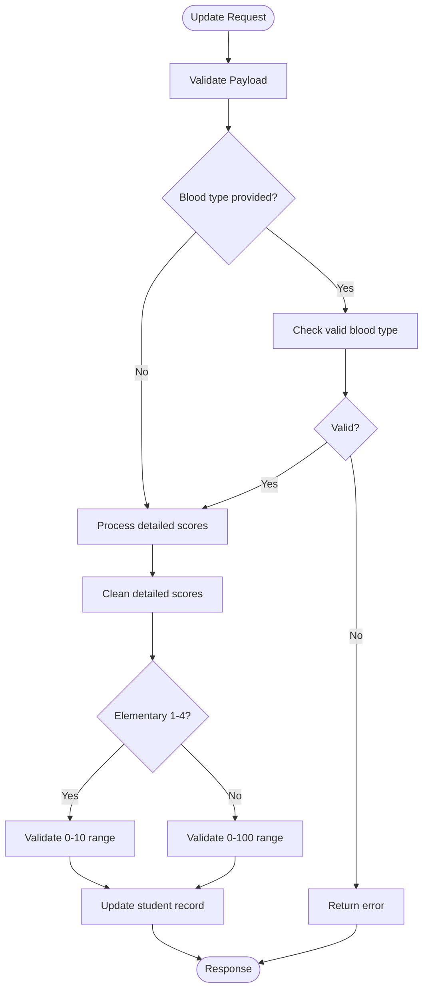
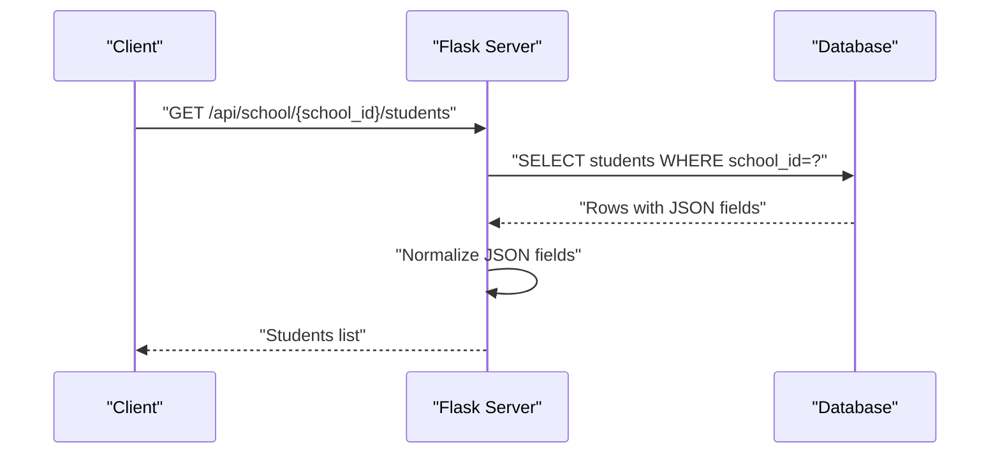
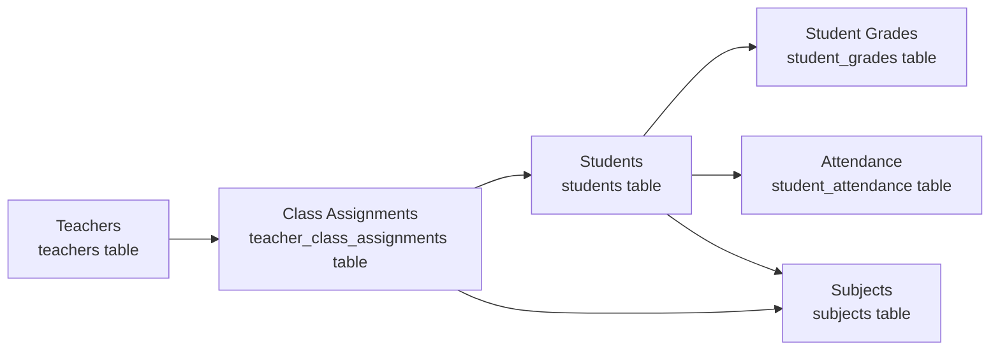
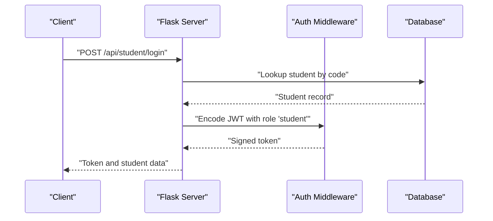
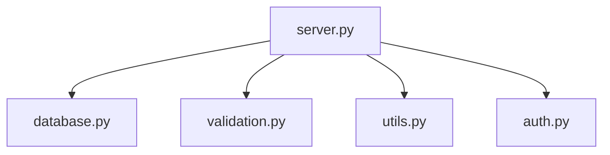

# Student Profile Management

<cite>
**Referenced Files in This Document**
- [README.md](file://README.md)
- [database.py](file://database.py)
- [validation.py](file://validation.py)
- [utils.py](file://utils.py)
- [server.py](file://server.py)
- [auth.py](file://auth.py)
</cite>

## Table of Contents
1. [Introduction](#introduction)
2. [Project Structure](#project-structure)
3. [Core Components](#core-components)
4. [Architecture Overview](#architecture-overview)
5. [Detailed Component Analysis](#detailed-component-analysis)
6. [Dependency Analysis](#dependency-analysis)
7. [Performance Considerations](#performance-considerations)
8. [Troubleshooting Guide](#troubleshooting-guide)
9. [Conclusion](#conclusion)

## Introduction
This document provides comprehensive documentation for student profile management within EduFlow, a Python and Flask-based school management system. It details the complete student profile structure, validation rules, update workflows, search and retrieval mechanisms, data integrity measures, integrations with teacher assignments and academic tracking, and the relationship with authentication systems.

## Project Structure
EduFlow organizes functionality around a Flask server with modular components:
- Database layer: schema definition and connection management
- Validation layer: reusable validation rules and validators
- Utilities: shared helpers for sanitization, formatting, and error handling
- Server: API endpoints implementing CRUD operations, authentication, and integrations
- Authentication: JWT-based token management and middleware

**Diagram sources**
- [server.py](file://server.py#L1-L120)
- [auth.py](file://auth.py#L1-L120)
- [validation.py](file://validation.py#L1-L120)
- [utils.py](file://utils.py#L1-L120)
- [database.py](file://database.py#L120-L340)

**Section sources**
- [README.md](file://README.md#L1-L23)
- [server.py](file://server.py#L1-L120)
- [database.py](file://database.py#L120-L340)

## Core Components
- Student profile structure: mandatory and optional fields, JSON-based academic data storage
- Validation framework: reusable rules for required fields, strings, enums, and custom formats
- Update workflows: full profile modification and partial updates for scores and attendance
- Search and retrieval: filtering by grade, room, and school
- Data integrity: duplicate prevention, sanitization, and JSON normalization
- Integrations: teacher assignments, subject enrollment, and academic progress tracking
- Authentication: JWT-based login flows for admin, school, and student roles

**Section sources**
- [database.py](file://database.py#L159-L177)
- [validation.py](file://validation.py#L265-L280)
- [server.py](file://server.py#L469-L560)
- [server.py](file://server.py#L564-L657)
- [server.py](file://server.py#L683-L767)
- [auth.py](file://auth.py#L14-L190)

## Architecture Overview
The student profile management architecture centers on the Flask server exposing REST endpoints that interact with the database schema defined in the database module. Validation and utility modules enforce data quality and formatting. Authentication integrates with JWT tokens for role-based access control.

**Diagram sources**
- [server.py](file://server.py#L469-L560)
- [validation.py](file://validation.py#L265-L280)
- [database.py](file://database.py#L159-L177)

## Detailed Component Analysis

### Student Profile Structure
The student entity stores both mandatory and optional information:
- Mandatory fields: school reference, full name, student code, grade, room
- Optional demographic/medical fields: parent contact, blood type, chronic disease
- Academic data: JSON fields for detailed scores and daily attendance
- Timestamps: created and updated timestamps

**Diagram sources**
- [database.py](file://database.py#L159-L177)
- [database.py](file://database.py#L147-L157)

**Section sources**
- [database.py](file://database.py#L159-L177)

### Validation Rules and Data Sanitization
The validation framework enforces:
- Required fields: full name, grade, room
- String constraints: minimum/maximum lengths
- Custom formats: grade format validation and blood type enumeration
- Sanitization: input cleaning to mitigate XSS risks

**Diagram sources**
- [validation.py](file://validation.py#L203-L262)
- [validation.py](file://validation.py#L10-L33)
- [validation.py](file://validation.py#L34-L56)
- [validation.py](file://validation.py#L152-L162)
- [validation.py](file://validation.py#L163-L173)

**Section sources**
- [validation.py](file://validation.py#L265-L280)
- [utils.py](file://utils.py#L27-L121)

### Profile Creation Workflow
- Endpoint: POST /api/school/{school_id}/student
- Validation: required fields, grade format, optional blood type
- Duplicate prevention: checks for identical name and grade within the same school
- Code generation: unique student code
- Storage: inserts into students table with JSON defaults for academic data

**Diagram sources**
- [server.py](file://server.py#L469-L560)
- [validation.py](file://validation.py#L265-L280)
- [database.py](file://database.py#L159-L177)

**Section sources**
- [server.py](file://server.py#L469-L560)

### Profile Update Workflows
- Complete profile modification: PUT /api/student/{student_id}
- Partial updates: PUT /api/student/{student_id}/detailed
- Scoring validation: validates score ranges based on grade level (0–10 for elementary 1–4, 0–100 otherwise)
- JSON normalization: cleans and normalizes detailed scores and attendance

**Diagram sources**
- [server.py](file://server.py#L564-L657)
- [server.py](file://server.py#L683-L767)
- [utils.py](file://utils.py#L163-L186)

**Section sources**
- [server.py](file://server.py#L564-L657)
- [server.py](file://server.py#L683-L767)
- [utils.py](file://utils.py#L163-L186)

### Search and Retrieval Mechanisms
- Retrieve all students for a school: GET /api/school/{school_id}/students
- Filtering: grade, room, and school-level queries supported via database constraints
- JSON handling: converts stored JSON strings to dictionaries for API responses

**Diagram sources**
- [server.py](file://server.py#L441-L468)
- [database.py](file://database.py#L159-L177)

**Section sources**
- [server.py](file://server.py#L441-L468)

### Data Integrity Measures
- Unique constraints: student code and school code uniqueness enforced at schema level
- Duplicate prevention: name-grade-school combination checked before insertion
- Sanitization: input cleaning to prevent XSS and limit field sizes
- JSON normalization: ensures consistent JSON parsing and defaults for academic data

**Section sources**
- [database.py](file://database.py#L159-L177)
- [server.py](file://server.py#L509-L531)
- [utils.py](file://utils.py#L243-L271)

### Integration with Other Systems
- Teacher assignments: students are linked to teachers via subjects and grade levels
- Subject enrollment: student grade level determines eligible subjects
- Academic progress tracking: detailed scores and attendance stored per academic year

**Diagram sources**
- [database.py](file://database.py#L159-L177)
- [database.py](file://database.py#L292-L321)
- [database.py](file://database.py#L247-L259)

**Section sources**
- [database.py](file://database.py#L292-L321)
- [database.py](file://database.py#L247-L259)

### Authentication Integration
- Student login: JWT token issued with role "student"
- Admin and school logins: JWT tokens with respective roles
- Authentication decorators: role-based access control for protected endpoints
- Token management: signing, verification, and optional refresh mechanisms

**Diagram sources**
- [server.py](file://server.py#L258-L304)
- [auth.py](file://auth.py#L14-L190)

**Section sources**
- [server.py](file://server.py#L258-L304)
- [auth.py](file://auth.py#L14-L190)

## Dependency Analysis
The server module depends on:
- Database module for schema definitions and helper functions
- Validation module for request validation
- Utilities for sanitization and formatting
- Authentication module for JWT handling

**Diagram sources**
- [server.py](file://server.py#L1-L16)
- [database.py](file://database.py#L1-L20)
- [validation.py](file://validation.py#L1-L10)
- [utils.py](file://utils.py#L1-L10)
- [auth.py](file://auth.py#L1-L10)

**Section sources**
- [server.py](file://server.py#L1-L16)

## Performance Considerations
- JSON fields: detailed_scores and daily_attendance are stored as JSON; ensure indexing strategies if querying frequently
- Pagination and field selection: optimized endpoints reduce payload sizes
- Caching: cache manager setup available for repeated reads
- Connection pooling: MySQL connection pool with SQLite fallback for development

## Troubleshooting Guide
Common issues and resolutions:
- Validation errors: ensure required fields are present and formatted correctly (e.g., grade format, blood type)
- Duplicate student creation: verify name-grade-school combination uniqueness
- Invalid score ranges: confirm score values align with grade scale (0–10 vs 0–100)
- Authentication failures: verify JWT token presence and validity
- Database connectivity: check MySQL availability or fallback to SQLite

**Section sources**
- [validation.py](file://validation.py#L222-L262)
- [server.py](file://server.py#L509-L531)
- [utils.py](file://utils.py#L163-L186)
- [auth.py](file://auth.py#L70-L104)

## Conclusion
EduFlow’s student profile management provides a robust foundation for maintaining student records, enforcing data quality through validation and sanitization, and integrating with teacher assignments and academic tracking. The modular architecture enables maintainability and extensibility for future enhancements.