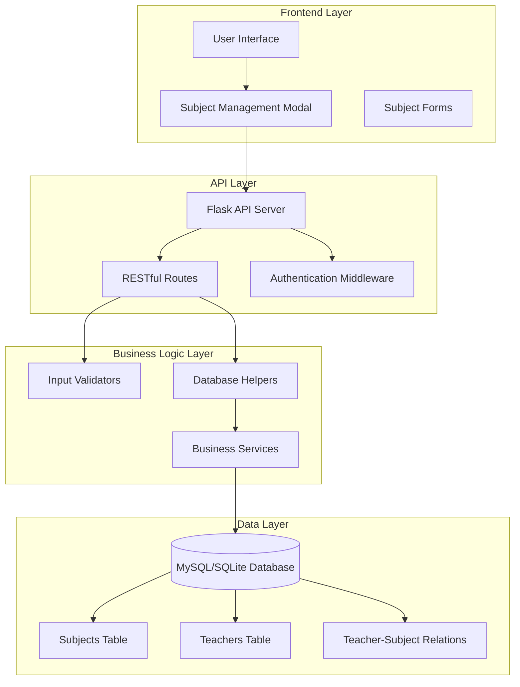
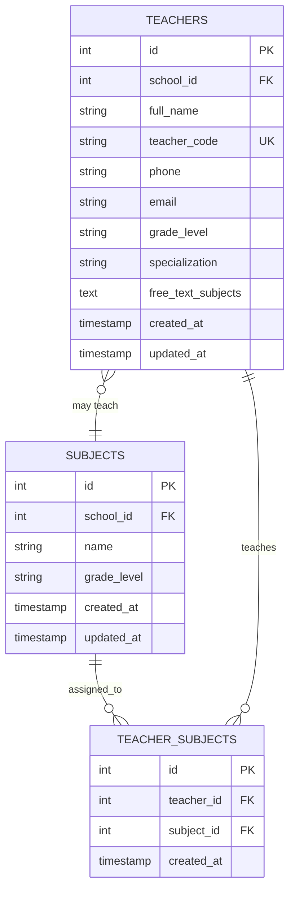
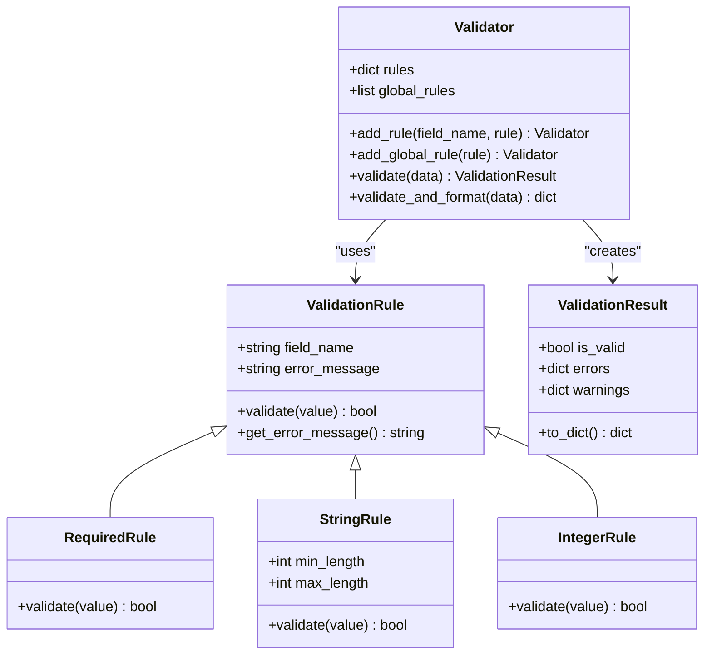
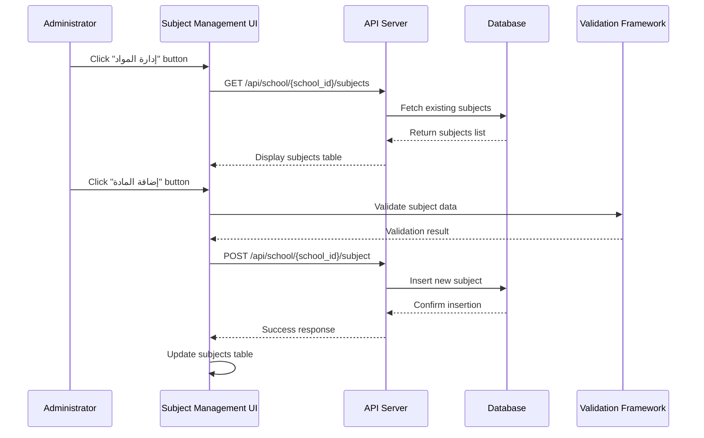
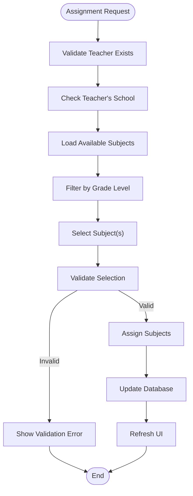
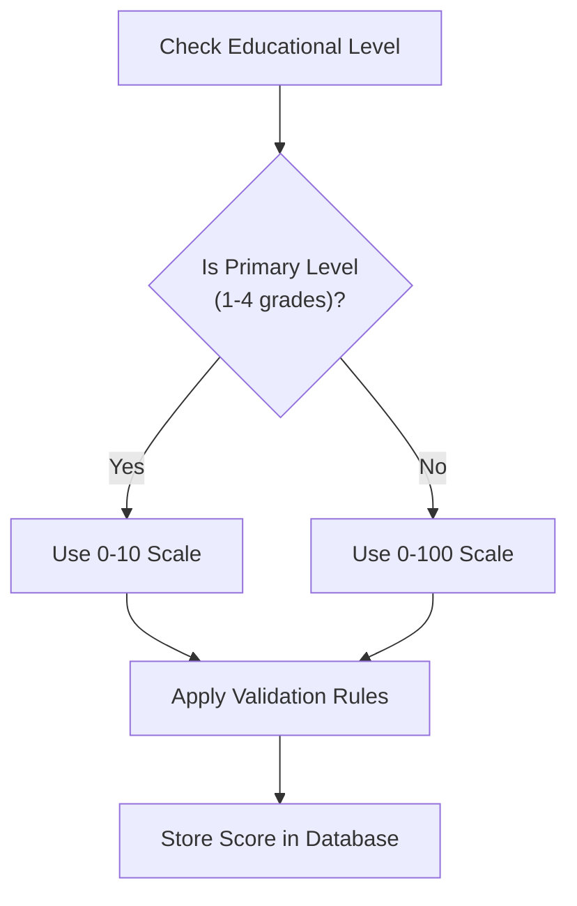
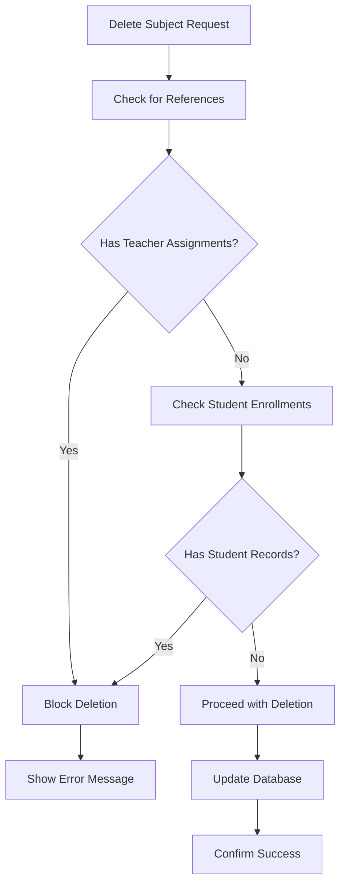
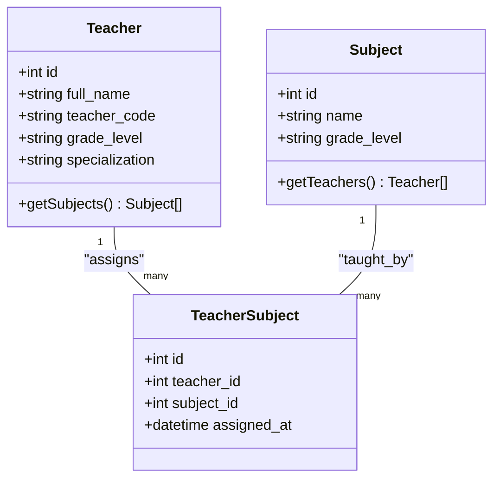
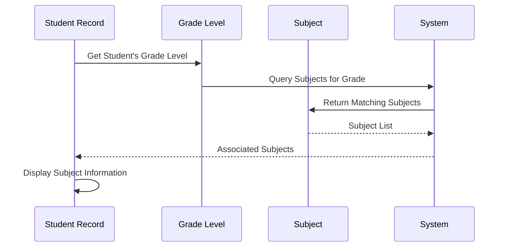
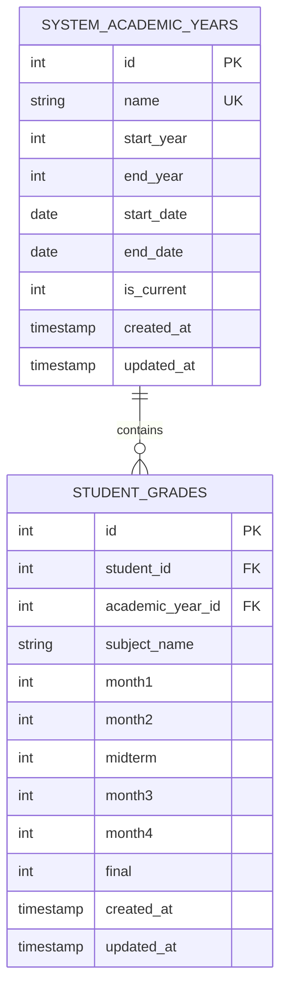

# Subject Management System

<cite>
**Referenced Files in This Document**
- [README.md](file://README.md)
- [SUBJECT_MANAGEMENT_IMPLEMENTATION.md](file://SUBJECT_MANAGEMENT_IMPLEMENTATION.md)
- [TEACHER_SUBJECT_ASSIGNMENT_IMPLEMENTATION.md](file://TEACHER_SUBJECT_ASSIGNMENT_IMPLEMENTATION.md)
- [validation.py](file://validation.py)
- [validation_helpers.py](file://validation_helpers.py)
- [database.py](file://database.py)
- [database_helpers.py](file://database_helpers.py)
- [populate_subjects.py](file://populate_subjects.py)
- [debug_subjects.py](file://debug_subjects.py)
- [server.py](file://server.py)
- [public/school-dashboard.html](file://public/school-dashboard.html)
- [public/assets/js/teacher-subject-assignment.js](file://public/assets/js/teacher-subject-assignment.js)
</cite>

## Table of Contents
1. [Introduction](#introduction)
2. [System Architecture](#system-architecture)
3. [Core Components](#core-components)
4. [Subject Creation and Configuration](#subject-creation-and-configuration)
5. [Subject Assignment System](#subject-assignment-system)
6. [Subject-Based Score Tracking](#subject-based-score-tracking)
7. [Subject Deletion and Modification](#subject-deletion-and-modification)
8. [Integration with Teacher Management](#integration-with-teacher-management)
9. [Student Enrollment and Classroom Management](#student-enrollment-and-classroom-management)
10. [Academic Year Integration](#academic-year-integration)
11. [Performance Considerations](#performance-considerations)
12. [Troubleshooting Guide](#troubleshooting-guide)
13. [Conclusion](#conclusion)

## Introduction

The Subject Management System is a comprehensive component of the EduFlow school management platform that provides centralized control over educational subjects, their configuration, and integration with teacher assignments and student tracking. This system enables school administrators to manage subjects independently of specific classes, ensuring data consistency and streamlined educational workflows.

The system supports multiple educational stages including primary, intermediate, secondary, and preparatory levels, with Arabic and English interfaces. It provides robust validation mechanisms, real-time filtering capabilities, and seamless integration with the broader school management ecosystem.

## System Architecture

The Subject Management System follows a layered architecture pattern with clear separation of concerns between frontend interfaces, backend APIs, and database operations.

**Diagram sources**
- [server.py](file://server.py#L1-L80)
- [database.py](file://database.py#L120-L339)
- [validation.py](file://validation.py#L203-L376)

**Section sources**
- [README.md](file://README.md#L1-L23)
- [SUBJECT_MANAGEMENT_IMPLEMENTATION.md](file://SUBJECT_MANAGEMENT_IMPLEMENTATION.md#L1-L119)

## Core Components

### Database Schema Design

The system utilizes a normalized relational database design with carefully defined relationships between entities:

**Diagram sources**
- [database.py](file://database.py#L197-L245)

### Validation Framework

The system implements a comprehensive validation framework that ensures data integrity and consistency:

**Diagram sources**
- [validation.py](file://validation.py#L10-L240)

**Section sources**
- [database.py](file://database.py#L197-L245)
- [validation.py](file://validation.py#L296-L318)

## Subject Creation and Configuration

### Subject Creation Process

The subject creation workflow follows a structured approach ensuring data validation and consistency:

**Diagram sources**
- [server.py](file://server.py#L768-L816)
- [validation.py](file://validation.py#L296-L304)

### Subject Naming Conventions

The system supports flexible subject naming with Arabic and English characters:

- **Minimum Length**: 1 character
- **Maximum Length**: 255 characters
- **Allowed Characters**: Arabic, English letters, numbers, spaces, and basic punctuation
- **Required Fields**: Subject name is mandatory

### Grade Level Associations

Subjects can be associated with specific grade levels or remain as general subjects:

- **Grade Level Field**: Optional association with educational stages
- **Grade Level Validation**: Supports primary (ابتدائي), intermediate (متوسطة), secondary (ثانوية), and preparatory (إعدادية) levels
- **Flexible Association**: Subjects can be assigned to specific grade levels or remain school-wide

**Section sources**
- [SUBJECT_MANAGEMENT_IMPLEMENTATION.md](file://SUBJECT_MANAGEMENT_IMPLEMENTATION.md#L32-L55)
- [validation.py](file://validation.py#L296-L304)
- [server.py](file://server.py#L787-L816)

## Subject Assignment System

### Teacher-Subject Assignment Workflow

The assignment system provides comprehensive management of subject-teacher relationships:

**Diagram sources**
- [validation_helpers.py](file://validation_helpers.py#L12-L136)
- [database_helpers.py](file://database_helpers.py#L87-L168)

### Assignment Validation Rules

The system implements comprehensive validation for subject assignments:

- **Duplicate Prevention**: Prevents assigning the same subject multiple times to a teacher
- **School Ownership Validation**: Ensures subjects belong to the teacher's school
- **Format Validation**: Validates subject IDs are proper integers
- **Existence Checks**: Verifies both teacher and subject existence

### Real-Time Assignment Interface

The frontend provides an intuitive interface for managing subject assignments:

- **Search and Filter**: Real-time subject search and grade-level filtering
- **Bulk Operations**: Ability to assign multiple subjects simultaneously
- **Visual Feedback**: Clear indication of assigned and available subjects
- **Confirmation Dialogs**: Prevents accidental deletions or modifications

**Section sources**
- [TEACHER_SUBJECT_ASSIGNMENT_IMPLEMENTATION.md](file://TEACHER_SUBJECT_ASSIGNMENT_IMPLEMENTATION.md#L49-L61)
- [validation_helpers.py](file://validation_helpers.py#L12-L136)
- [public/assets/js/teacher-subject-assignment.js](file://public/assets/js/teacher-subject-assignment.js#L17-L123)

## Subject-Based Score Tracking

### Assessment Categories

The system supports comprehensive score tracking across multiple assessment periods:

| Assessment Period | Score Range | Notes |
|-------------------|-------------|-------|
| Month 1 | 0-100 (or 0-10 for primary grades) | First monthly assessment |
| Month 2 | 0-100 (or 0-10 for primary grades) | Second monthly assessment |
| Midterm | 0-100 (or 0-10 for primary grades) | Half-year examination |
| Month 3 | 0-100 (or 0-10 for primary grades) | Third monthly assessment |
| Month 4 | 0-100 (or 0-10 for primary grades) | Fourth monthly assessment |
| Final | 0-100 (or 0-10 for primary grades) | Final examination |

### Grade Scale Adaptation

The system automatically adapts grading scales based on educational level:

**Diagram sources**
- [server.py](file://server.py#L52-L89)

### Performance Metrics

The system calculates various performance metrics for comprehensive analysis:

- **Average Scores**: Calculated across all assessment periods
- **Pass Rates**: Percentage of students meeting minimum passing criteria
- **Excellence Rates**: Percentage of high-performing students
- **Attendance Correlation**: Analysis of attendance impact on performance

**Section sources**
- [server.py](file://server.py#L52-L89)
- [server.py](file://server.py#L683-L766)

## Subject Deletion and Modification

### Deletion Validation Process

The system implements strict validation before allowing subject deletion:

**Diagram sources**
- [server.py](file://server.py#L848-L867)

### Modification Workflows

Subject modification follows a similar validation pattern:

- **Name Updates**: Validate length and format requirements
- **Grade Level Changes**: Ensure consistency with existing assignments
- **School Ownership**: Verify subject belongs to the requesting school
- **Duplicate Prevention**: Check for existing subjects with identical names

### Duplicate Prevention Mechanisms

The system implements multiple layers of duplicate prevention:

- **Database Constraints**: Unique constraints on subject names per school
- **Application Validation**: Real-time checking during creation
- **Import Validation**: Prevention during bulk operations
- **User Feedback**: Clear error messages for duplicate detection

**Section sources**
- [server.py](file://server.py#L818-L846)
- [server.py](file://server.py#L848-L867)
- [validation_helpers.py](file://validation_helpers.py#L192-L273)

## Integration with Teacher Management

### Teacher-Subject Relationship Management

The system maintains comprehensive relationships between teachers and subjects:

**Diagram sources**
- [database.py](file://database.py#L236-L245)
- [database_helpers.py](file://database_helpers.py#L12-L44)

### Teacher Assignment Interface

The teacher assignment interface provides comprehensive management capabilities:

- **Subject Selection**: Visual selection of subjects from available list
- **Grade-Level Filtering**: Filter subjects by educational stage
- **Bulk Assignment**: Assign multiple subjects simultaneously
- **Real-time Validation**: Immediate feedback on assignment validity
- **Assignment History**: Track when subjects were assigned

### Free-Text Subject Support

The system supports both predefined subjects and free-text subject entries:

- **Free-Text Subjects**: Allow teachers to define custom subjects
- **Mixed Assignment**: Support for both predefined and free-text subjects
- **Display Integration**: Unified display of all assigned subjects
- **Validation**: Sanitization and validation of free-text entries

**Section sources**
- [public/assets/js/teacher-subject-assignment.js](file://public/assets/js/teacher-subject-assignment.js#L144-L262)
- [database.py](file://database.py#L467-L507)

## Student Enrollment and Classroom Management

### Student Subject Association

Students are automatically associated with subjects based on their grade levels:

**Diagram sources**
- [database.py](file://database.py#L509-L550)

### Classroom Management Integration

The system integrates with classroom management through teacher assignments:

- **Class-Teacher Relationships**: Link teachers to specific classes
- **Subject-Class Alignment**: Ensure subjects match class requirements
- **Academic Year Context**: Maintain subject assignments across academic years
- **Enrollment Tracking**: Monitor student enrollment in subject classes

### Student Performance Tracking

The system provides comprehensive student performance tracking:

- **Individual Records**: Detailed score tracking per student per subject
- **Class Analytics**: Aggregate performance metrics for each class
- **Progress Monitoring**: Track student improvement over time
- **Intervention Alerts**: Automatic alerts for struggling students

**Section sources**
- [database.py](file://database.py#L509-L550)
- [server.py](file://server.py#L1427-L1433)

## Academic Year Integration

### Academic Year Management

The system maintains centralized academic year management:

**Diagram sources**
- [database.py](file://database.py#L261-L307)

### Year-Long Subject Tracking

Subjects are tracked consistently across academic years:

- **Subject Persistence**: Subject records maintained across years
- **Grade Scaling**: Automatic adaptation of grading scales
- **Historical Tracking**: Complete performance history per student
- **Year Comparison**: Ability to compare performance across academic years

### Current Year Management

The system manages current academic year context:

- **Default Selection**: Automatic selection of current academic year
- **Year Switching**: Ability to view historical data
- **Year-Specific Reports**: Generate reports for specific academic years
- **Transition Management**: Smooth transitions between academic years

**Section sources**
- [database.py](file://database.py#L261-L307)
- [server.py](file://server.py#L1439-L1469)

## Performance Considerations

### Database Optimization

The system implements several performance optimization strategies:

- **Indexing Strategy**: Strategic indexing on frequently queried columns
- **Query Optimization**: Efficient queries for subject and teacher relationships
- **Connection Pooling**: MySQL connection pooling for improved performance
- **Caching Layers**: Application-level caching for frequently accessed data

### Frontend Performance

The user interface is optimized for performance:

- **Lazy Loading**: Dynamic loading of subject lists and teacher assignments
- **Virtual Scrolling**: Efficient rendering of large datasets
- **Debounced Search**: Optimized search functionality with input debouncing
- **Minimal Re-renders**: React-like state management for efficient updates

### Scalability Considerations

The system is designed for scalability:

- **Horizontal Scaling**: Support for multiple database instances
- **Load Balancing**: Distribution of API requests across servers
- **Database Sharding**: Potential for subject and teacher data sharding
- **CDN Integration**: Static asset delivery optimization

## Troubleshooting Guide

### Common Issues and Solutions

**Subject Creation Failures**
- **Issue**: Subject creation returns validation errors
- **Solution**: Verify subject name length and format requirements
- **Prevention**: Implement client-side validation before submission

**Assignment Conflicts**
- **Issue**: Unable to assign subjects to teachers
- **Solution**: Check if subject belongs to teacher's school
- **Prevention**: Filter subjects by school before assignment

**Database Connection Problems**
- **Issue**: API returns database connection errors
- **Solution**: Verify MySQL service availability and credentials
- **Prevention**: Implement connection retry logic

### Debugging Tools

The system includes comprehensive debugging capabilities:

- **Database Debug Script**: [debug_subjects.py](file://debug_subjects.py#L1-L45) - Inspect database state
- **Sample Data Population**: [populate_subjects.py](file://populate_subjects.py#L1-L88) - Generate test data
- **API Health Checks**: Built-in health check endpoints for system monitoring

### Error Handling Patterns

The system implements consistent error handling:

- **Structured Error Responses**: Standardized error message formats
- **Multi-language Support**: Arabic and English error messages
- **Validation Feedback**: Specific error messages for input validation failures
- **Logging Integration**: Comprehensive logging for debugging and monitoring

**Section sources**
- [debug_subjects.py](file://debug_subjects.py#L1-L45)
- [populate_subjects.py](file://populate_subjects.py#L1-L88)
- [validation.py](file://validation.py#L332-L376)

## Conclusion

The Subject Management System represents a comprehensive solution for educational institution needs, providing robust subject management, teacher assignment capabilities, and integrated student tracking. The system's modular architecture, comprehensive validation framework, and real-time interfaces ensure reliable operation across diverse educational environments.

Key strengths of the system include:

- **Data Integrity**: Multi-layer validation prevents inconsistent data
- **Scalability**: Designed for growth from single school to district-wide deployment
- **Flexibility**: Supports multiple educational stages and grading systems
- **User Experience**: Intuitive interfaces with comprehensive feedback
- **Integration**: Seamless integration with broader school management ecosystem

The system provides a solid foundation for educational institutions seeking comprehensive subject and teacher management capabilities while maintaining data consistency and operational efficiency.