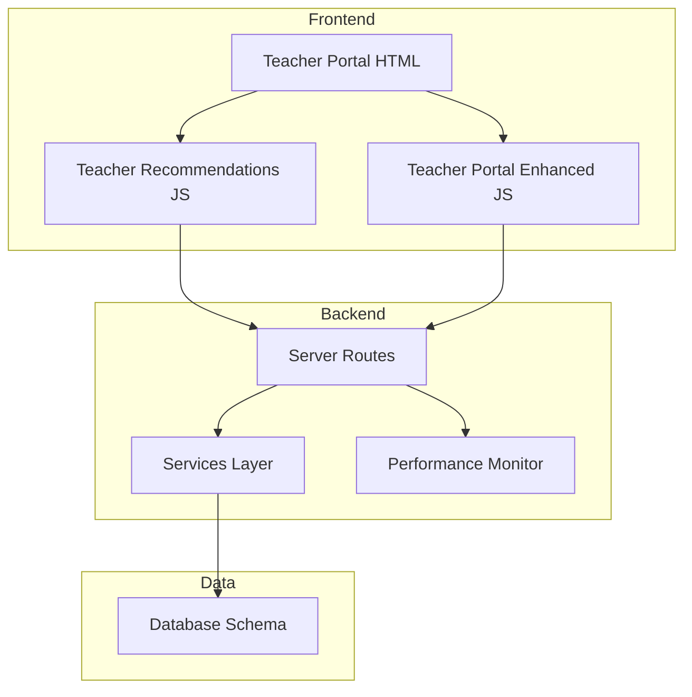
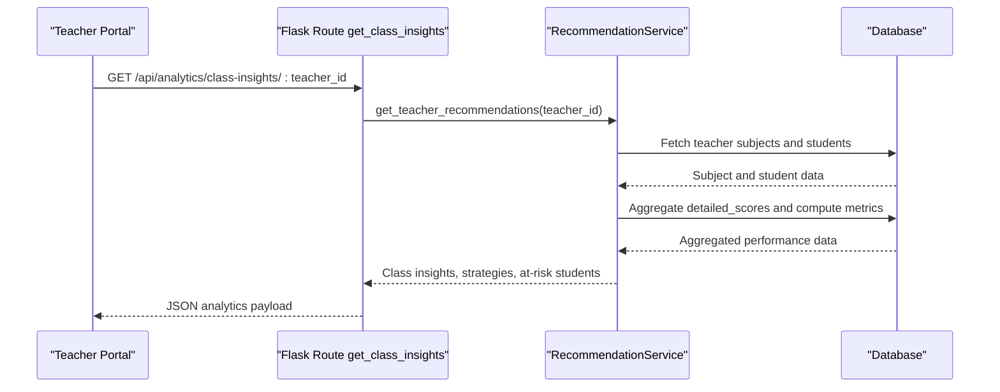
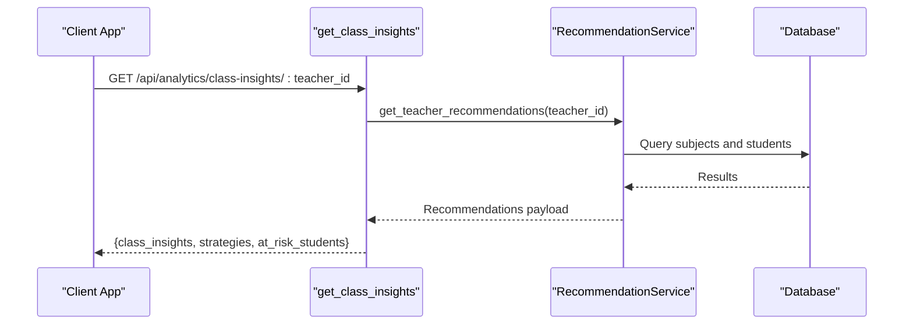
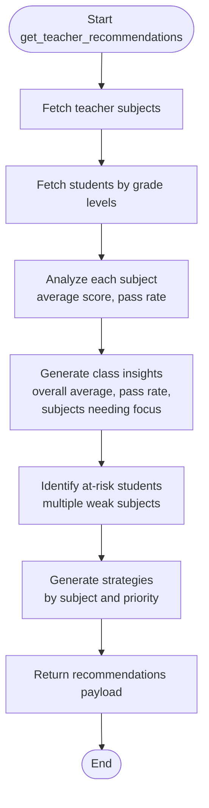
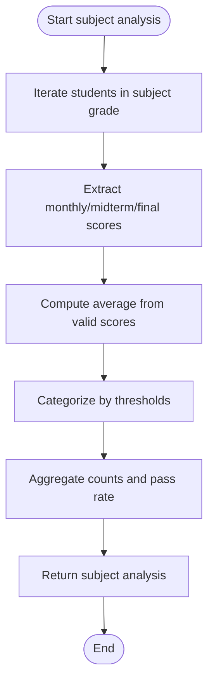
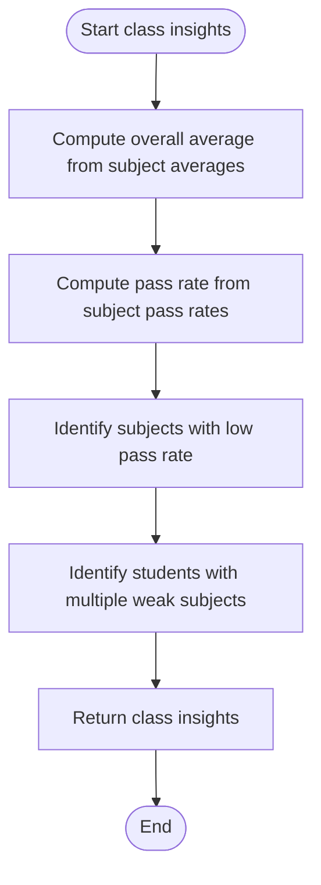
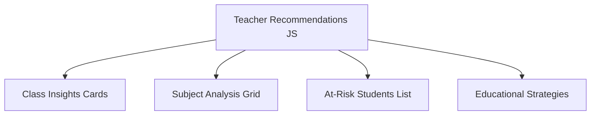
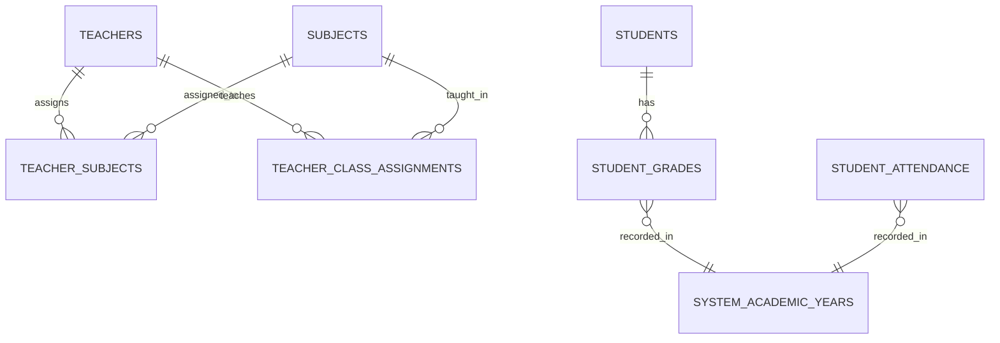
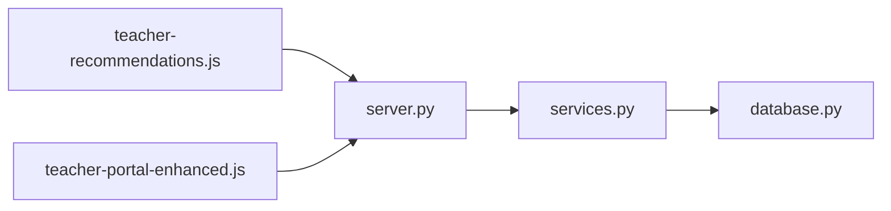

# Class Insights and Analytics

<cite>
**Referenced Files in This Document**
- [README.md](file://README.md)
- [server.py](file://server.py)
- [services.py](file://services.py)
- [database.py](file://database.py)
- [performance.py](file://performance.py)
- [teacher-portal.html](file://public/teacher-portal.html)
- [teacher-recommendations.js](file://public/assets/js/teacher-recommendations.js)
- [teacher-portal-enhanced.js](file://public/assets/js/teacher-portal-enhanced.js)
</cite>

## Table of Contents
1. [Introduction](#introduction)
2. [Project Structure](#project-structure)
3. [Core Components](#core-components)
4. [Architecture Overview](#architecture-overview)
5. [Detailed Component Analysis](#detailed-component-analysis)
6. [Dependency Analysis](#dependency-analysis)
7. [Performance Considerations](#performance-considerations)
8. [Troubleshooting Guide](#troubleshooting-guide)
9. [Conclusion](#conclusion)

## Introduction
This document describes the class insights and analytics system that powers teacher performance analytics and student achievement tracking within the EduFlow school management platform. It focuses on the get_class_insights function and the underlying analytics pipeline that aggregates student performance data by class, subject, and time period. The system provides teacher performance metrics such as student success rates, grade distributions, and indicators of attention needs, alongside a student achievement tracking mechanism that monitors individual and collective progress over time. The analytics dashboard enables teacher self-assessment and improvement planning, with integrations to grading systems, attendance tracking, and academic year progression.

## Project Structure
The analytics system spans backend services, database schema, and frontend dashboards:
- Backend: Flask routes expose analytics endpoints, backed by service-layer logic and database queries.
- Services: Business logic encapsulates analytics computations for class insights, subject performance, at-risk students, and educational strategies.
- Database: Schema stores student data, grades, attendance, and teacher-class assignments.
- Frontend: Teacher portal renders analytics cards and interactive recommendations.

**Diagram sources**
- [server.py](file://server.py#L2893-L2911)
- [services.py](file://services.py#L367-L913)
- [database.py](file://database.py#L123-L321)
- [teacher-portal.html](file://public/teacher-portal.html#L520-L535)
- [teacher-recommendations.js](file://public/assets/js/teacher-recommendations.js#L1-L294)
- [teacher-portal-enhanced.js](file://public/assets/js/teacher-portal-enhanced.js#L1-L604)
- [performance.py](file://performance.py#L15-L241)

**Section sources**
- [README.md](file://README.md#L1-L23)
- [server.py](file://server.py#L1-L120)
- [database.py](file://database.py#L123-L321)

## Core Components
- Analytics Endpoint: The get_class_insights route aggregates teacher recommendations and returns class insights, strategies, and at-risk students.
- Recommendation Service: Computes subject-wise averages, pass rates, and class-level metrics; identifies students needing attention; proposes strategies.
- Database Queries: Retrieve teacher assignments, students, and student performance data stored in JSON fields.
- Frontend Rendering: Displays class insights cards, subject analysis, at-risk student alerts, and suggested strategies.

Key implementation references:
- Analytics endpoint: [get_class_insights](file://server.py#L2893-L2911)
- Recommendation computation: [get_teacher_recommendations](file://services.py#L367-L430), [_generate_class_insights](file://services.py#L548-L620)
- Student performance analysis: [_analyze_subject_performance](file://services.py#L476-L546), [_analyze_student_performance](file://services.py#L701-L765)
- Data access helpers: [get_teacher_subjects](file://database.py#L467-L507), [get_teacher_students](file://database.py#L509-L550)

**Section sources**
- [server.py](file://server.py#L2893-L2911)
- [services.py](file://services.py#L367-L620)
- [database.py](file://database.py#L467-L550)

## Architecture Overview
The analytics pipeline follows a layered architecture:
- Presentation: Teacher portal renders analytics UI.
- API: Flask routes handle requests and delegate to services.
- Services: Encapsulate analytics logic and data transformations.
- Persistence: Database stores structured and JSON data for grades and attendance.

**Diagram sources**
- [server.py](file://server.py#L2893-L2911)
- [services.py](file://services.py#L367-L430)
- [database.py](file://database.py#L467-L550)

## Detailed Component Analysis

### Analytics Endpoint: get_class_insights
The get_class_insights endpoint orchestrates analytics retrieval for a given teacher:
- Validates teacher_id presence.
- Delegates to RecommendationService.get_teacher_recommendations.
- Returns class_insights, strategies, and at_risk_students.

**Diagram sources**
- [server.py](file://server.py#L2893-L2911)
- [services.py](file://services.py#L367-L430)

**Section sources**
- [server.py](file://server.py#L2893-L2911)

### Recommendation Service: get_teacher_recommendations
This service computes:
- Subject analysis: average scores, pass rates, counts for excellent/good/needs-support.
- Class insights: total students, overall average, pass rate, subjects needing focus, top performers, and at-risk students.
- Strategies: actionable recommendations prioritized by issue severity.
- At-risk students: identified by multiple weak subjects.

**Diagram sources**
- [services.py](file://services.py#L367-L430)
- [services.py](file://services.py#L476-L620)

**Section sources**
- [services.py](file://services.py#L367-L430)
- [services.py](file://services.py#L476-L620)

### Subject Performance Analysis
The subject analysis module calculates:
- Average score across valid assessments per subject.
- Pass rate thresholds and counts for performance categories.
- Trend indicators (stable in current implementation).

**Diagram sources**
- [services.py](file://services.py#L476-L546)

**Section sources**
- [services.py](file://services.py#L476-L546)

### Class Insights Generation
Class insights consolidate subject-level metrics:
- Overall average across subjects.
- Pass rate computed from subject pass rates.
- Identification of subjects needing focus and at-risk students.

**Diagram sources**
- [services.py](file://services.py#L548-L620)

**Section sources**
- [services.py](file://services.py#L548-L620)

### Frontend Analytics Dashboard
The teacher portal displays:
- Class insights cards: total students, overall average, pass rate.
- Subject analysis grid: pass rates, averages, and counts.
- At-risk students list with weak subjects.
- Educational strategies with priorities and suggested actions.

**Diagram sources**
- [teacher-recommendations.js](file://public/assets/js/teacher-recommendations.js#L118-L275)
- [teacher-portal.html](file://public/teacher-portal.html#L520-L535)

**Section sources**
- [teacher-recommendations.js](file://public/assets/js/teacher-recommendations.js#L118-L275)
- [teacher-portal.html](file://public/teacher-portal.html#L520-L535)

### Database Integration and Data Model
The analytics rely on:
- Teacher-subject assignments and class assignments.
- Student records containing detailed_scores (JSON) and daily_attendance (JSON).
- Centralized academic year management for time-bound analytics.

Key schema elements:
- teacher_subjects: Many-to-many linking teachers and subjects.
- student_grades: Per-academic-year grades per subject.
- student_attendance: Per-academic-year attendance records.
- system_academic_years: Central academic year registry.

**Diagram sources**
- [database.py](file://database.py#L197-L321)

**Section sources**
- [database.py](file://database.py#L197-L321)

## Dependency Analysis
The analytics system exhibits clear separation of concerns:
- server.py depends on services.py for business logic.
- services.py depends on database.py for data access.
- Frontend modules depend on server endpoints for analytics data.

**Diagram sources**
- [server.py](file://server.py#L1-L16)
- [services.py](file://services.py#L1-L20)
- [database.py](file://database.py#L1-L20)
- [teacher-recommendations.js](file://public/assets/js/teacher-recommendations.js#L1-L26)
- [teacher-portal-enhanced.js](file://public/assets/js/teacher-portal-enhanced.js#L1-L26)

**Section sources**
- [server.py](file://server.py#L1-L16)
- [services.py](file://services.py#L1-L20)
- [database.py](file://database.py#L1-L20)

## Performance Considerations
- Request and database query tracking: The performance monitor captures request durations, endpoint statistics, and system metrics to identify slow endpoints and bottlenecks.
- Recommendations: Use pagination and field selection where applicable to reduce payload sizes.
- Caching: Integrate caching for frequently accessed analytics datasets to minimize repeated computations.

Practical guidance:
- Monitor slow endpoints and optimize heavy queries.
- Apply rate limiting and input sanitization for analytics endpoints.
- Consider precomputing aggregates for large datasets to improve response times.

**Section sources**
- [performance.py](file://performance.py#L15-L241)

## Troubleshooting Guide
Common issues and resolutions:
- Missing teacher_id: Ensure the teacher_id parameter is provided in analytics requests.
- Empty recommendations: Verify teacher assignments and student data availability.
- Database connectivity: Confirm database initialization and connection pool configuration.
- Frontend rendering errors: Check network tab for API failures and console logs for JavaScript exceptions.

Operational checks:
- Health endpoint: Use the health route to validate environment and configuration.
- Performance endpoints: Inspect performance statistics and system metrics for anomalies.

**Section sources**
- [server.py](file://server.py#L110-L139)
- [performance.py](file://performance.py#L214-L235)

## Conclusion
The class insights and analytics system integrates teacher assignments, student performance data, and academic year context to deliver actionable insights. The get_class_insights endpoint consolidates subject performance, class-level metrics, at-risk students, and recommended strategies, enabling teachers to assess performance, identify improvement areas, and plan targeted interventions. The modular architecture ensures maintainability, while performance monitoring and frontend dashboards support efficient operation and user experience.